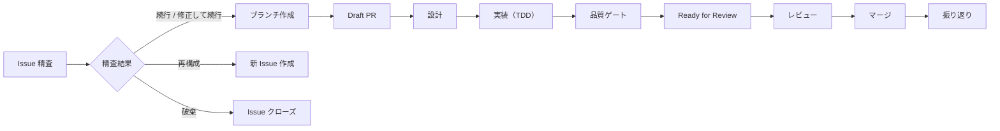

# Issue 駆動開発フロー

Issue 駆動開発の AI ディレクティブ版。教育的解説は [手順書](../../docs/60_手順書/04_開発フロー/01_Issue駆動開発.md) を参照。

開発フロー:



## AI 着手トリガー

ユーザーが Issue 番号を指定した場合、着手の指示として扱い、直ちに精査フローに入る。

**禁止:** 着手の意思が明確な場合に「着手してよろしいですか？」等の確認を挟むこと

## 1. Issue 精査

### 精査の観点

| 観点 | 問い |
|------|------|
| Want の確認 | この Issue が解決しようとしている本質的なニーズは何か？ |
| How への偏り | Issue が特定の解決策を前提にしていないか？ |
| 完了基準の妥当性 | 完了基準は Want を満たしているか？ |
| 暗黙の仮定 | Issue が前提としている仮定は正しいか？ |
| スコープの適切さ | 過大/過小ではないか？ |
| As-Is の妥当性 | Issue の現状分析は最新か、事実として正しいか？ |

### As-Is 検証（必須）

Issue 本文の現状分析は作成時点の仮説。着手時に最新の As-Is で検証する。

前提: コード実測の前に `origin/main` を最新化する。

```bash
git fetch origin main
```

1. `gh issue view <number> --json createdAt` で作成日時を確認
2. `gh pr list --search "#<Issue番号>"` で作成後の関連 PR を検索
3. 最新の As-Is を `origin/main` 基準で実測・確認（Issue 本文を鵜呑みにしない）
4. Issue の前提が現在も有効か判断

→ 詳細: [問題解決フレームワーク > Issue 精査時の As-Is 確認](problem-solving.md#issue-精査時の-as-is-確認)

### 精査結果の分岐

| 結果 | 条件 | アクション |
|------|------|-----------|
| 続行 | Issue の内容に問題なし | ブランチ作成へ |
| 修正して続行 | スコープ・完了基準等に修正が必要 | Issue を修正後、ブランチ作成へ |
| 再構成 | 分割・統合・再作成が必要 | 新 Issue を作成、元 Issue をクローズ |
| 破棄 | Want 不在、前提崩壊、重複等 | 理由を記録して Issue をクローズ |

### 精査結果の記録（必須）

精査結果を Issue コメントとして記録する。記録がない場合、精査が実施されたとみなさない。

```bash
gh issue comment <Issue番号> --body "$(cat <<'EOF'
## Issue 精査

**Want**: [本質的なニーズ]

**As-Is 検証**:
- Issue 作成日: YYYY-MM-DD
- 関連 PR: #XXX（または なし）
- 最新の As-Is: [実測結果]

**Want 突合**: [As-Is に変化があった場合、その変化が Want を満たしているかの評価。変化なしの場合は「変化なし」]

**精査結果**: 続行

**理由**: [判断理由]
EOF
)"
```

### 完了基準の要件

完了基準は操作パスレベルで記述する。コンポーネント実装レベル（「POST /approve で承認できる」等）ではなく、ユーザー操作レベル（「承認者が詳細画面から承認ボタンを押して承認を完了できる」等）。

技術的基準と E2E 基準の両方を含める（フルスタック機能の場合）。

## 2. ブランチ作成

ブランチ作成前に main を最新化し、最新 main からブランチを作成する:

```bash
# 通常
git checkout main && git pull origin main

# worktree 等で main がロックされている場合
git fetch origin main
git checkout -b <branch-name> origin/main
```

命名規則:

| パターン | 形式 |
|---------|------|
| 新機能（Story 単位） | `feature/{issue番号}-{機能名}` |
| バグ修正 | `fix/{issue番号}-{バグ名}` |

**禁止:**
- main ブランチで直接作業・コミット
- Epic 番号でブランチを作成すること（ブランチは Story 単位）

## 3. Draft PR 作成

```bash
git commit --allow-empty -m "#34 WIP: Implement login feature"
git push -u origin HEAD
gh pr create --draft --title "#34 Implement login feature" --body-file .github/pull_request_template.md
```

### PR 本文ルール

PR テンプレート（`.github/pull_request_template.md`）に従う。Squash マージで PR 本文がコミットメッセージになる。

| セクション | 必須 | 内容 |
|-----------|------|------|
| 概要 | ✓ | 変更内容を 1〜3 行で |
| Related | ✓ | 関連 Issue 番号（`Closes #34` 等） |
| 確認項目 | ✓ | 完了したテスト項目を `[x]` で記載 |

- 空のセクションは削除する
- HTML コメント（`<!-- -->`）は使用しない
- 確認項目には完了項目のみ記載（未完了 `[ ]` を残さない）

**禁止:** Draft なしで PR を作成すること

## 4. 設計

### 4.1 基本設計確認

`docs/30_基本設計書/` を確認し、アーキテクチャ上の位置づけを把握する。基本設計の変更が必要な場合は設計書を先に更新する。

### 4.2 詳細設計作成

`docs/40_詳細設計書/` に詳細設計を作成する。API を含む場合は OpenAPI 仕様書（`openapi/openapi.yaml`）を更新する（Single Source of Truth）。

### 4.3 実装計画作成

Issue 本文に実装計画を追記する。→ 計画ファイルの必須要素: [zoom-rhythm.md > 計画ファイルへの記載](zoom-rhythm.md#計画ファイルへの記載必須)

Phase 分割基準: 依存順（下位 → 上位レイヤー）。フルスタック機能の場合、既存 API の拡張も Phase に含める。

### 4.4 収束確認

→ 詳細: [zoom-rhythm.md > 収束確認のチェックリスト](zoom-rhythm.md#収束確認のチェックリスト)

**禁止:** 収束確認セクションのない計画で実装を開始すること

### 4.5 設計成果物のコミット

設計と実装を分けてコミットする。

### 設計フェーズの簡略化条件

以下の**すべて**を満たす場合のみ簡略化可能:
- 単純なバグ修正、typo 修正、ドキュメント修正
- 新しい設計判断が不要（URL 設計、データ構造、API 契約の変更なし）
- 変更ファイルが 3 個以下

判定テスト: 「この変更には選択肢があるか？」→ Yes なら設計判断が必要。スキップ不可。

収束確認（4.4）は省略不可。

## 5. 実装（TDD）

→ TDD の手順: [dev-flow-tdd.md](dev-flow-tdd.md)

### コミット粒度

| タイミング | 例 |
|-----------|-----|
| テストが通ったとき | `Add test for UserRepository find_by_email` |
| リファクタリング完了時 | `Refactor error handling in UserRepository` |
| 1つの機能単位が完成したとき | `Implement UserRepository` |

lefthook がブランチ名から Issue 番号を自動付与する。

### Issue 進捗更新

Phase やタスクが完了したら、Issue のチェックボックスを都度 `[x]` に更新する。

## 6. 品質ゲート

実装完了後、6.1-6.8 を通過してから Ready for Review に変更する。

### 6.1 自動チェック

```bash
just check
```

→ [ADR-059](../../docs/70_ADR/059_品質ゲートのローカル実行範囲変更.md)

### 6.2 品質チェックリスト

→ 位置づけ: [zoom-rhythm.md > 品質を守る二つの砦](zoom-rhythm.md#品質を守る二つの砦)（最後の砦 = 品質ゲート）

設計・ドキュメント:
- [ ] 詳細設計書が作成・更新されているか（`docs/40_詳細設計書/`）
- [ ] API を含む場合、OpenAPI 仕様書が更新されているか（`openapi/`）
- [ ] 技術選定・設計判断があれば ADR が作成されているか（`docs/70_ADR/`）
- [ ] 設計判断を伴う実装があれば実装解説が作成されているか（`docs/90_実装解説/`）
- [ ] コード変更・設計判断があればセッションログが作成されているか（`prompts/runs/`）
- [ ] 変更種別に応じた必須ドキュメントが更新されているか:
  - アーキテクチャ構成変更 → 基本設計書
  - エンティティ追加・更新パス追加 → エンティティ影響マップ
  - データストア追加 → データ削除設計
  - 開発ツール追加 → 環境構築手順 + justfile
  - CI ワークフロー変更 → GitHub Actions ナレッジベース
  - デプロイ構成変更 → 対象環境での動作確認 or 環境差異の考慮を PR 本文に記載

Issue との整合:
- [ ] `just check-issue` が正常終了するか（全チェックボックスが `[x]`）
- [ ] PR の変更が Issue の Want/To-Be を過不足なく満たしているか

テスト:
- [ ] テストリストの項目が全て実装されているか（計画と実装が 1:1）
- [ ] テスト層の網羅性: テストピラミッドの全層が検討され、該当・非該当が明記されているか
- [ ] 操作パス起点の検証: テスト設計が操作パスから出発し、テストリストと対応づけられているか
- [ ] フルスタック機能の場合、E2E シナリオを確認済みか
- [ ] テスト責任の検証: Epic の Story の場合、テスト責任マッピングに割り当てられたテストが実装・通過しているか
- [ ] PR 確認項目の全項目がチェック済みか
- [ ] TDD サイクル（Red → Green → Refactor）を守っているか
- [ ] テストレビュー済みか（冗長なテストの統合、テスト名の明確さ、構造の整理）

コード品質確認（マイナス→ゼロ）:
- [ ] アーキテクチャ一貫性: ショートカットがない
- [ ] 既存パターン整合: 命名、構造、エラー処理が既存パターンに準拠
- [ ] 型安全性・エラーハンドリング: 既存 Newtype を使用、安易な unwrap/expect がない
- [ ] 仕様突合: OpenAPI と実装が一致（フィールド、ステータスコード、型）
  - 新規ハンドラモジュール → `openapi.rs` の `paths()` に登録
  - 新規タグ → `openapi.rs` の `tags()` に登録
  - `just openapi-generate` → `git diff openapi/openapi.yaml` で確認
- [ ] レイヤー間接続: 全レイヤーにフィールド変更が伝播、DB 制約への影響確認
- [ ] YAGNI/KISS の正しい適用: シンプル化を理由にしたレイヤー違反・型安全性省略がない
- [ ] 技術的前提の確認: ツール仕様が公式ドキュメントで確認されている
- [ ] 既存ドキュメントとの矛盾がない
- [ ] 構造的健全性: `just check-unused-deps`、新モジュール追加時は責務重複を確認
- [ ] セキュリティ基本確認: 認証・認可パスの新規/変更時は設計書と突合、シークレットのハードコーディングなし、ユーザー入力のバリデーション実施
- [ ] デプロイ構成変更時の環境差異: docker-compose、CI/CD 等の変更時に対象環境のリソース特性（CPU、メモリ、ネットワーク帯域、ディスク I/O）を考慮したか

品質向上（ゼロ→プラス）:
- [ ] シンプルさ: 不要な中間層、冗長なデータ構造がないか
- [ ] 型の活用: 新たに型で防げる不正状態がないか（Newtype、型安全ステートマシン、構造的強制）
- [ ] 責務の明確さ: 各コンポーネントの責務が単一か
- [ ] ベストプラクティス: 推奨パターンに沿っているか

UI/UX 品質確認（フロントエンド変更がある場合）:
- [ ] デザイントークン整合: [デザインガイドライン](../../docs/40_詳細設計書/13_デザインガイドライン.md)に準拠
- [ ] 共有コンポーネント活用: 既存の共有コンポーネントを使用
- [ ] アクセシビリティ: セマンティック HTML、ARIA、キーボード操作、label 関連付け
- [ ] 状態表示: RemoteData の全状態 + 空データが適切に処理
- [ ] エラー表示: ユーザーの言語で表現、回復手段を提供
- [ ] 視覚的階層: タイポグラフィ階層に沿っているか
- [ ] 破壊的操作の防御: ConfirmDialog、ボタン色が操作の意味と一致

デザイン品質向上（ゼロ→プラス）:
- [ ] コントラストの効果: 重要な要素が周囲と差別化
- [ ] 整列の一貫性: スペーシンググリッド（4px 基準）
- [ ] 余白の活用: グルーピングと呼吸感

横断検証（複数 Phase の PR の場合）:
- [ ] Phase 間データフロー整合: 下位→上位レイヤーの入出力を突合、差分ゼロ
- [ ] 仕様との端到端突合: OpenAPI → Core → BFF → フロントエンドでデータが一貫
- [ ] 完了基準の E2E 検証: Issue の完了基準がすべて達成

### 6.3 品質確認を PR 本文に記載

品質チェックリスト（6.2）の確認結果を PR 本文の品質確認セクションにカテゴリ別で記載する。

- 各カテゴリ: カテゴリ名 + コロン + 確認内容（1行）
- 該当しないカテゴリは `N/A（理由）`
- 「設計・ドキュメント」は具体的なファイルパスを記載（「更新済み」のみは不可）

→ フォーマット: [zoom-rhythm.md > PR 本文への記載](zoom-rhythm.md#pr-本文への記載必須)

### 6.4 計画ファイルの確認

```bash
git status prompts/plans/
```

未コミットファイルがあり、現在の作業と関連があればコミットする。

### 6.5 base branch との同期確認

```bash
git fetch origin main && git log HEAD..origin/main --oneline
```

| 状態 | 対応 |
|------|------|
| 差分なし | 6.6 へ |
| 差分あり | `git rebase origin/main` → `just check` で再確認 → 6.6 へ |

### 6.6-6.8 プッシュ → CI 確認 → Ready

```bash
git push
gh pr checks --watch
gh pr ready
```

**禁止:**
- CI が失敗している状態で Ready にすること
- wrap-up 完了を検証せずに Ready にすること
- 品質ゲートを通過せずに Ready for Review に戻すこと
- `--admin` で CI バイパス、CI 失敗状態での強制マージ、ユーザー指示なしのマージ

### 6.9 Draft に戻した後の再 Ready

品質保証がリセットされた状態。コミットの作成者に関わらず品質ゲートを再度通過する。

## 7. レビュー確認

Claude Code Action による自動レビューが実行される。

1. レビューコメントを確認
2. 指摘があれば修正をコミット
3. 修正不要な指摘は理由を返信してから resolve

承認基準: Critical/High は修正必須（request-changes）、Medium/Low は改善推奨だがマージ可能。

## 8. マージ

```bash
gh pr merge --squash
just clean-branches
```

`--auto` は使用しない。レビュー結果を確認してからマージする。

## 9. 振り返り

### 振り返りコメント

```bash
gh issue comment <番号> --body "$(cat <<'EOF'
## 振り返り

### 完了条件の検証
- [x] 条件1: 達成

### 予想と違ったこと
（なければ「特になし」）

### 学んだこと
（技術的な発見、設計上の気づき）

### 次に活かすこと
（同様のタスクで意識すべき点）
EOF
)"
```

### 学びの転記基準

| 重要度 | 記録先 |
|--------|-------|
| 高: 再利用可能なパターン | ローカルドキュメント（技術ノート、ADR、実装解説） |
| 中: プロジェクト固有 | Issue コメント + セッションログ |
| 低: 一時的な気づき | Issue コメントのみ |

### 改善記録の検証

```bash
grep -rl "#<Issue番号>" process/improvements/ --include="*.md"
```

関連する改善記録があり検証セクションが未追記なら追記する。

### TODO/FIXME の棚卸し

```bash
grep -rn "TODO(#<Issue番号>)\|FIXME(#<Issue番号>)" backend/ frontend/
```

| 状態 | 対応 |
|------|------|
| アノテーションなし | 不要 |
| 解消済み | アノテーション削除 |
| 未解消 | 新 Issue 作成、参照番号更新 |

### 振り返りのスキップ条件

typo 修正・軽微なドキュメント修正・既存パターンの単純な踏襲。改善記録の検証は省略しない。

---

## Epic/Story 運用

→ ブランチ戦略: [ADR-046](../../docs/70_ADR/046_Story-per-PRブランチ戦略.md)

### Story 分解の品質基準

各 Story は main に独立してマージ可能でなければならない。

| 基準 | 問い |
|------|------|
| 独立動作 | この Story だけマージしても main は壊れないか？ |
| 後方互換 | 後続 Story がなくても既存機能は動作するか？ |
| テスト完結 | この Story 単独でテストが全て通るか？ |
| 意味のある単位 | この Story だけで何らかの価値を提供するか？ |
| テスト責任の網羅 | Epic の完了基準の各項目が、テストピラミッドの各層にわたって、いずれかの Story のテスト責任に割り当てられているか？ |

### テスト責任マッピング（成果物要件）

Story 分解時に、Epic 本文に以下のマッピング表を記載する。

```markdown
## テスト責任マッピング

| Epic 完了基準 | 操作パス | テスト層 | 担当 Story | テスト内容 |
|--------------|---------|---------|-----------|----------|
| ... | 正常系 | E2E | #NNN | ... |
```

確認項目:
- Epic の完了基準の全項目が表に含まれている
- 各完了基準について正常系・準正常系・異常系の操作パスが検討されている
- 各項目に担当 Story が割り当てられている
- 「どの Story にも属さない」項目がある場合、統合テスト Story を作成

**禁止:** テスト責任がいずれの Story にも割り当てられていない状態で実装に入ること

### ブランチ命名

Story 単位でブランチを作成する。Epic 番号でブランチを作成しない。

### PR と Issue の紐付け

| 対象 | 方法 |
|------|------|
| Story | PR 本文で `Closes #NNN` → 自動クローズ |
| Epic | 全サブ Issue 完了後に手動クローズ |

Epic に対して `Closes` を使用しない。

### Epic タスクリスト管理

- Story Issue 作成時: Epic 本文にリンクを追記
- Story PR マージ時: `just sync-epic <Story番号>` で自動更新
- 全 Story 完了後: Epic をクローズ

### Epic 完了基準の統合検証

全 Story 完了後、Epic クローズ前にテスト責任マッピング表に基づいて統合検証する。

```markdown
## Epic 完了基準の統合検証

| 完了基準 | テスト層 | テスト | 結果 |
|---------|---------|-------|------|
| ... | E2E | xxx.spec.ts | Pass |
```

**禁止:** 統合検証を実施せずに Epic をクローズすること
