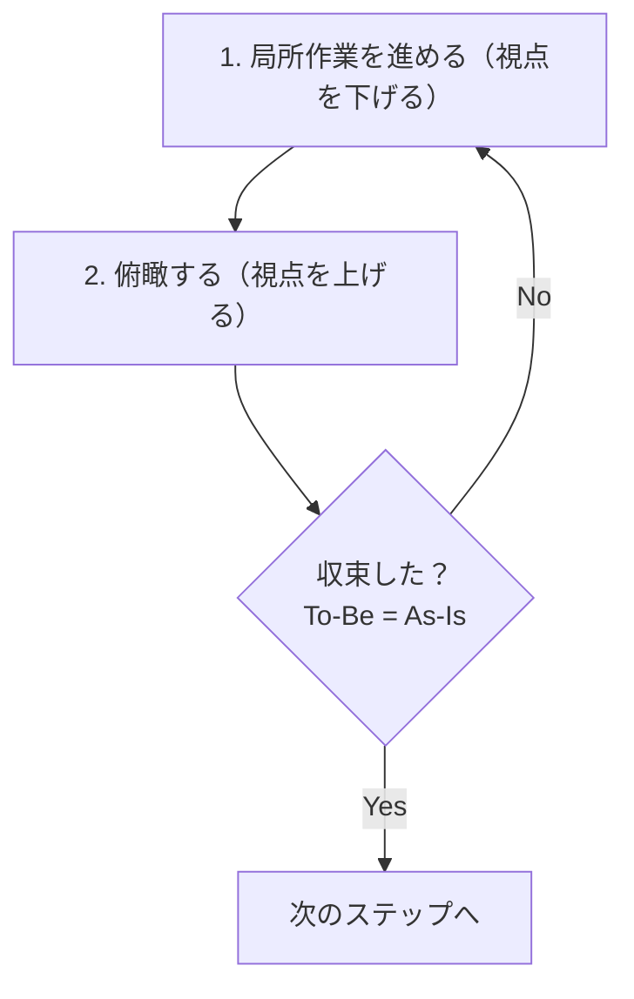

# 俯瞰・実装リズム（Zoom In/Out Rhythm）

良い仕事は、全体と局所を忙しなく往復する。視点の高度を上げ下げしながら、俯瞰と局所作業を行き来するリズムを大事にする。

## 前提: 設計段階では設計を詰める

**往復は「設計をスキップしてよい」という意味ではない。**

- **設計段階**: しっかり設計を詰める。網羅性、完結性、整合性を確認してから実装に入る
- **実装段階**: 設計を前提に実装しつつ、必要に応じて設計に戻る

「往復」が意味するのは、「設計が完了しても、実装中に設計を見直す機会がある」ということ。設計段階での深い検討を軽視する言い訳にしてはならない。

## 往復のリズム

設計でも実装でもドキュメント修正でも、どんな作業でも同じリズムを適用する。視点の高度を上げ下げしながら、全体と局所を行き来する。

- **俯瞰**（高い視点）: 全体構造、整合性、意図
- **局所**（低い視点）: この関数、このセクション、この一文

### いつ視点を上げるか

| タイミング | 俯瞰の内容 |
|-----------|-----------|
| 一つの変更を完了したとき | この変更は全体と調和しているか？より良い構造はないか？ |
| 予期しない発見時 | これは局所的な対処でいいか？全体に組み込むべきか？ |
| 「何か違う」と感じた瞬間 | 違和感の正体は何か？前提が崩れていないか？ |
| 区切りのとき | ここまでの成果は全体と調和しているか？ |

具体例: TDD の Refactor ステップ、ドキュメントのセクション追加後、設計の一部を書き終えたとき

### 俯瞰で何をするか

1. **発見を言語化する**: 作業中に気づいたこと、追加した処理、当初想定との差異
2. **全体への統合を検討する**: 局所的対処で終わらせるか、全体構造に反映するか
3. **整合性を確認する**: 他の箇所への波及、全体との調和

### 往復の効果

- 局所的な対処が積み重なって「つぎはぎ」になることを防ぐ
- 作業中の発見が全体を豊かにする（一方向フローの打破）
- 「完成してから見直す」のではなく、常に全体を意識しながら進める

## To-Be / As-Is による収束

往復を繰り返した結果、最終的には「理想状態（To-Be）と現状（As-Is）のギャップがゼロ」になることで収束する。



### To-Be の確定と更新

#### 確定タイミング

| フェーズ | To-Be 確定タイミング |
|---------|---------------------|
| 設計・計画 | 探索完了後、計画を書き始める前 |
| 実装 | テストを書く前（TDD の前提） |
| テスト | テストリスト作成時 |
| 横断検証 | 全 Phase 完了後、検証開始前 |

#### 更新の条件

往復の中で、To-Be 自体を更新すべき場合がある:

| 条件 | 例 |
|------|-----|
| より良い理想状態の発見 | 実装中にもっとエレガントな設計パターンを発見 |
| 外部からの要件変更 | ユーザーからの指摘、新しい要件の追加 |
| 技術的制約の発見 | 当初の理想が達成不可能と判明 |
| 探索での新知見 | 前提が誤っていたことが判明 |

To-Be を更新する場合は、変更理由を明示してから新しい To-Be で往復を再開する。

**禁止事項:**

- 往復の中で暗黙で To-Be を変更すること
- 「実装が難しいから」という理由で理想を下げること
- 変更理由を記録せずに To-Be を変えること

## 収束確認のチェックリスト

チェックリストは「往復が収束したか」を確認するためのもの。機械的に項目を通過することが目的ではなく、往復のリズムが最終的に整合性のある状態に落ち着いたかを確認する。

### 設計・計画フェーズ

| # | 観点 | 理想状態（To-Be） | 確認内容 |
|---|------|------------------|---------|
| 1 | 網羅性 | 探索で発見された全対象が計画に含まれている | 対象リストと探索結果を突合し、差分がゼロ。除外はすべて理由付きで記載 |
| 2 | 曖昧さ排除 | 不確定な記述がゼロ | 「あれば」「必要に応じて」等を検索し、該当ゼロを確認 |
| 3 | 設計判断の完結性 | 全ての差異・バリエーションに判断が記載されている | 探索で見つかった差異と計画の判断を突合し、未決定ゼロ |
| 4 | スコープ境界 | 対象と対象外が両方明記されている | 「対象」「対象外」セクションが存在し、暗黙の除外がない |
| 5 | 技術的前提 | コードに現れない前提が考慮されている | HTML/CSS 仕様、フレームワーク挙動、ツール制約を確認済み |
| 6 | 既存ドキュメント整合 | 既存ドキュメントと矛盾がない | 要件定義書、設計書、ADR と照合し、矛盾ゼロ |

出典: 項目 1-5 は [計画段階での網羅性不足](../../prompts/improvements/2026-02/2026-02-02_1023_計画段階での置換対象と設計決定の網羅性不足.md) の対策から抽出。項目 6 は CLAUDE.md 既存ルール（技術選定・設計判断の原則 > 2. 既存ドキュメントの確認を必須とする）。

### 実装フェーズ

TDD サイクルの Refactor ステップが往復のトリガー。各サイクルで視点を上げ、以下の観点で整合性を確認する。

**コミット前の必須確認**: 各 Phase のコミット前に、以下のチェックリストがすべて OK であることを確認する。確認せずにコミットしてはならない。

Phase 完了後にも改めて全体を通して検証する。

| # | 観点 | 理想状態（To-Be） | 確認内容 |
|---|------|------------------|---------|
| 1 | アーキテクチャ一貫性 | レイヤー違反がゼロ | ハンドラ→リポジトリ直接呼び出し等のショートカットがない |
| 2 | 既存パターン整合 | 既存コードと一貫している | 命名、構造、エラー処理が既存パターンに準拠 |
| 3 | 型安全性・エラーハンドリング | 型で表現できるものは型で表現されている | String/整数の濫用、安易な unwrap/expect がない |
| 4 | 仕様突合 | OpenAPI 仕様と実装が一致している | フィールド、ステータスコード、型を突合し、差分ゼロ |
| 5 | レイヤー間接続 | 全レイヤーにフィールド変更が伝播している | API レスポンス拡張が必要な箇所を見落としていない |
| 6 | YAGNI/KISS の正しい適用 | 機能スコープと設計品質が区別されている | シンプル化を理由にしたレイヤー違反・型安全性省略がない |
| 7 | 技術的前提の確認 | ツール仕様が公式ドキュメントで確認されている | 推測に基づく実装がない |

出典: 項目 1, 3, 6 は [YAGNI-KISS の拡大解釈](../../prompts/improvements/2026-02/2026-02-01_0004_YAGNI-KISSの拡大解釈による設計品質低下.md)。項目 4 は [OpenAPI 仕様突合漏れ](../../prompts/improvements/2026-01/2026-01-29_1445_Phase5実装時のOpenAPI仕様突合漏れ.md)。項目 5 は [E2E 視点の完了基準欠如](../../prompts/improvements/2026-01/2026-01-29_1304_E2E視点の完了基準欠如.md)。項目 7 は [Hurl 仕様未確認のまま機能を推奨](../../prompts/improvements/2026-02/2026-02-01_0003_Hurl仕様未確認のまま機能を推奨.md)。項目 2 は品質原則に基づく補完項目。

### テストフェーズ

| # | 観点 | 理想状態（To-Be） | 確認内容 |
|---|------|------------------|---------|
| 1 | テストリスト突合 | 計画と実装が 1:1 で対応している | 実装計画のテストリストと実際のテストを突合し、差分ゼロ |
| 2 | カバレッジ | 正常系・異常系・境界値が網羅されている | 各パターンのテストが存在し、漏れゼロ |
| 3 | E2E 視点 | ユーザーが UI から操作を完了できる | フルスタック機能の場合、E2E シナリオを確認済み |
| 4 | TDD 遵守 | Red → Green → Refactor のサイクルを守っている | テストを先に書き、プロダクションコードは後 |

出典: 項目 1 は TDD 開発フローのテストリスト進め方。項目 2 は TDD 開発フロー チェックリスト。項目 3 は [E2E 視点の完了基準欠如](../../prompts/improvements/2026-01/2026-01-29_1304_E2E視点の完了基準欠如.md)。項目 4 は TDD 開発フローのサイクル定義。

### 横断検証フェーズ（複数 Phase の PR で全 Phase 完了後に実施）

各 Phase が個別に整合していても、Phase 間の接続でずれが生じることがある。全 Phase 完了後に、PR 全体を俯瞰して検証する。

| # | 観点 | 理想状態（To-Be） | 確認内容 |
|---|------|------------------|---------|
| 1 | Phase 間データフロー整合 | 全レイヤーでデータが一致している | 下位レイヤーの出力と上位レイヤーの入力を突合し、差分ゼロ |
| 2 | 仕様との端到端突合 | OpenAPI → Core → BFF → フロントエンドでデータが一貫している | Silent Failure（オプショナルフィールドでのフォールバック）がない |
| 3 | 完了基準の E2E 検証 | Issue の完了基準がすべて達成されている | E2E 基準「ユーザーが UI から操作を完了できる」を確認済み |

出典: 項目 1, 2 は [OpenAPI 仕様突合漏れ](../../prompts/improvements/2026-01/2026-01-29_1445_Phase5実装時のOpenAPI仕様突合漏れ.md) および [E2E 視点の完了基準欠如](../../prompts/improvements/2026-01/2026-01-29_1304_E2E視点の完了基準欠如.md)。これらのインシデントでは、各 Phase は個別に正しかったがレイヤー間の接続で Silent Failure が発生した。

## 既存の検証プロセスとの関係

俯瞰・実装リズムは、既存の検証プロセスと**補完関係**にある。

| 既存プロセス | 役割 | リズムとの関係 |
|-------------|------|----------------|
| [Ready for Review チェックリスト](../../docs/04_手順書/04_開発フロー/01_Issue駆動開発.md#62-整合性チェックリスト) | PR 提出前の最終確認 | 往復の最終収束確認 |
| [TDD Refactor ステップ](../../docs/04_手順書/04_開発フロー/02_TDD開発フロー.md#-refactor-きれいにする) | コード内部品質の改善 | 俯瞰のトリガー |
| 既存 rules（[api.md](api.md), [repository.md](repository.md), [data-store.md](data-store.md)） | 特定コンテキストの詳細ルール | 俯瞰時の観点を提供 |

## 計画ファイルへの記載（必須）

計画ファイル（plan mode で作成するファイル）には、末尾に収束確認セクションを記載する。記載されていない計画は完成とみなさない。

```markdown
## 収束確認（設計・計画）

| # | 観点 | 理想状態（To-Be） | 判定 | 確認内容 |
|---|------|------------------|------|---------|
| 1 | 網羅性 | 探索で発見された全対象が計画に含まれている | OK | [具体的に何を確認したか] |
| 2 | 曖昧さ排除 | 不確定な記述がゼロ | OK | [具体的に何を確認したか] |
| 3 | 設計判断の完結性 | 全ての差異に判断が記載されている | OK | [具体的に何を確認したか] |
| 4 | スコープ境界 | 対象と対象外が両方明記されている | OK | [具体的に何を確認したか] |
| 5 | 技術的前提 | コードに現れない前提が考慮されている | OK | [具体的に何を確認したか] |
| 6 | 既存ドキュメント整合 | 既存ドキュメントと矛盾がない | OK | [具体的に何を確認したか] |
```

目的: 行動規範（「収束を確認すること」）ではなく成果物要件（「収束確認が記載されていること」）にすることで、欠落を構造的に防ぐ。

改善の経緯: [自己検証ループの自動実行欠如](../../prompts/improvements/2026-02/2026-02-05_2100_自己検証ループの自動実行欠如.md)

## PR 本文への記載（必須）

Ready for Review にする前に、PR 本文の **Self-review セクション** に収束確認結果を記載する。記載されていない PR は Ready for Review にしない。

```markdown
## Self-review

| # | 観点 | 判定 | 確認内容 |
|---|------|------|---------|
| 1 | 実装チェックリスト | OK | 全7項目確認済み |
| 2 | 横断検証（複数 Phase の場合） | OK | Phase間データフロー整合確認 |
| 3 | `just check-all` pass | OK | CI で確認 |
```

目的: 計画ファイルと同様に、「収束確認の記載」を成果物要件とすることで、Ready for Review 前の確認を構造的に強制する。

改善の経緯: [実装フェーズにおける自己検証の自動実行欠如](../../prompts/improvements/2026-02/2026-02-06_0010_実装フェーズにおける自己検証の自動実行欠如.md)

## AI エージェントへの指示

- 実装中は視点の高度を意識し、頻繁に俯瞰と実装を往復する
- TDD の Refactor ステップ、予期しないエッジケース発見時、「何か違う」と感じた瞬間に視点を上げる
- 俯瞰では「発見の言語化」「設計への統合検討」「整合性確認」を行う
- 成果物（計画、設計書、コード、テスト）の提示・コミット前に収束を確認する
- 計画ファイルには収束確認セクションを必ず記載する
- Ready for Review 前に PR 本文の Self-review セクションに収束確認結果を記載する
- 往復の実施を逐一報告する必要はない。品質は結果で示す

**禁止事項:**

- 視点を上げずに実装だけを続けること
- 収束確認を実施せずに成果物を提示・コミットすること
- 収束確認で指摘が見つかったにもかかわらず修正せずに提示すること
- 収束確認セクションのない計画ファイルを提示すること
- Self-review セクションが空または不十分な状態で Ready for Review にすること

## 参照

- 改善記録:
  - [実装フェーズにおける自己検証の自動実行欠如](../../prompts/improvements/2026-02/2026-02-06_0010_実装フェーズにおける自己検証の自動実行欠如.md)
  - [自己検証ループの自動実行欠如](../../prompts/improvements/2026-02/2026-02-05_2100_自己検証ループの自動実行欠如.md)
  - [計画段階での置換対象と設計決定の網羅性不足](../../prompts/improvements/2026-02/2026-02-02_1023_計画段階での置換対象と設計決定の網羅性不足.md)
  - [YAGNI-KISS の拡大解釈による設計品質低下](../../prompts/improvements/2026-02/2026-02-01_0004_YAGNI-KISSの拡大解釈による設計品質低下.md)
  - [Hurl 仕様未確認のまま機能を推奨](../../prompts/improvements/2026-02/2026-02-01_0003_Hurl仕様未確認のまま機能を推奨.md)
  - [E2E 視点の完了基準欠如](../../prompts/improvements/2026-01/2026-01-29_1304_E2E視点の完了基準欠如.md)
  - [Phase 5 実装時の OpenAPI 仕様突合漏れ](../../prompts/improvements/2026-01/2026-01-29_1445_Phase5実装時のOpenAPI仕様突合漏れ.md)
- 既存プロセス:
  - [Issue 駆動開発](../../docs/04_手順書/04_開発フロー/01_Issue駆動開発.md)
  - [TDD 開発フロー](../../docs/04_手順書/04_開発フロー/02_TDD開発フロー.md)
