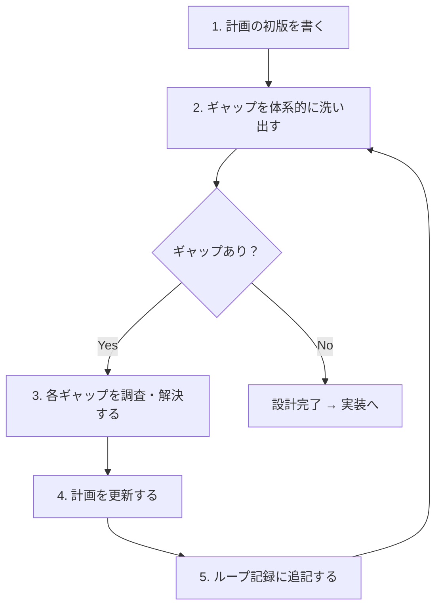
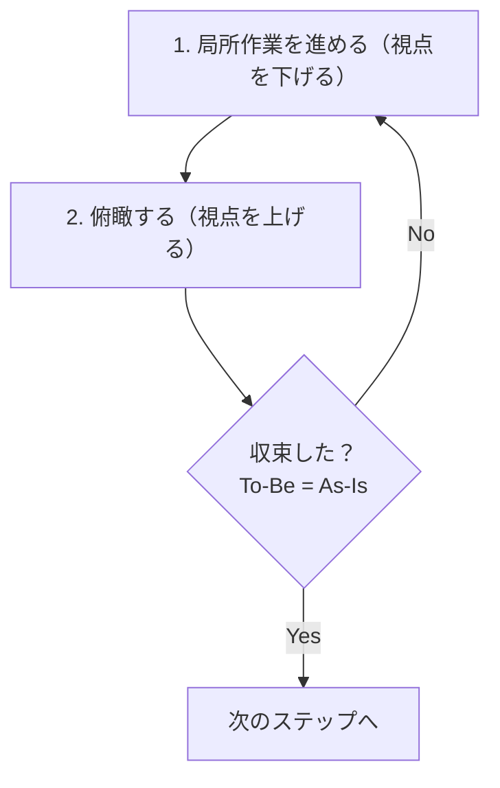

# 俯瞰・実装リズム（Zoom In/Out Rhythm）

全体（俯瞰）と局所（実装）を往復する。以下にそのタイミングと方法を定義する。

## 前提: 設計段階では設計を詰める

**往復は「設計をスキップしてよい」という意味ではない。**

- **設計段階**: しっかり設計を詰める。網羅性、完結性、整合性を確認してから実装に入る
- **実装段階**: 設計を前提に実装しつつ、必要に応じて設計に戻る

往復は実装中に設計を見直す機会があるという意味であり、設計段階の検討を軽視する根拠にしない。

### 設計段階でも同じリズムを適用する

設計を「詰める」とは、**To-Be と As-Is のギャップがゼロになるまでループする**こと。

1. 計画の初版を書く
2. 俯瞰する（チェックリストで確認、全体との整合性）
3. ギャップがあれば修正して 2 に戻る
4. ギャップがゼロになったら実装に入る

設計段階で収束していない計画は、実装に入ってはならない。

### 設計ブラッシュアップループ

初版には必ずギャップがある。ギャップがゼロになるまで繰り返し洗い出しと解決を行う。

#### ループの具体プロセス



1. 計画の初版を書く
2. ギャップを体系的に洗い出す（後述の「ギャップ発見の観点」を使用）
3. 各ギャップを調査・解決する（コード探索、API 検証、仕様確認）
4. 計画を更新する（設計判断を追加、コードスニペットを修正）
5. ループ記録に追記する（きっかけ、調査内容、結果）
6. 2 に戻る（ギャップゼロになるまで）

#### ギャップ発見の観点

各ループで以下の観点からギャップを探す。ギャップには二つの方向がある。

**欠陥の発見（マイナス → ゼロ）**: 設計に含まれる問題を解消する

| 観点 | 探すもの | 例 |
|------|---------|-----|
| 未定義 | 参照されているが定義されていないもの | 関数名のみ記載で実装未定義、型定義の欠如 |
| 曖昧 | 複数の解釈が可能な記述 | 処理の優先順位、エラー時の挙動、戻り値の型 |
| 競合・エッジケース | 組み合わせの挙動が未定義のもの | 複数条件の同時指定、境界値、同時更新 |
| 不完全なパス | 状態遷移やエラーパスに漏れがあるもの | エラー時の回復手順、状態解除の操作、異常終了時のクリーンアップ |
| アーキテクチャ不整合 | レイヤー境界や責務分担の矛盾 | 純粋関数内での副作用の必要性、レイヤー間の責務のずれ |
| 既存手段の見落とし | 標準ライブラリや既存パターンに代替があるもの | 標準ライブラリの関数、フレームワーク提供の機能、プロジェクト内の既存パターン |

**品質の向上（ゼロ → プラス）**: 正しい設計をより良い設計に引き上げる

| 観点 | 問い | 例 |
|------|------|-----|
| シンプルさ | 同じ結果をより少ない概念で実現できないか | 不要な中間層の排除、データ構造の簡素化 |
| 型の活用 | 不正な状態を型レベルで防げないか | String → 専用型、フィールドの組み合わせをカスタム型で表現 |
| 責務の明確さ | 各コンポーネントの責務は単一か | URL 表現の責務を Route に集約、ドメインロジックの UI 層からの分離 |
| ベストプラクティス | その分野の推奨パターンに沿っているか | 標準ライブラリの宣言的 API、確立されたアーキテクチャパターン |

これらは代表的な観点であり、網羅的ではない。対象の性質に応じて観点を追加する。

#### 完了基準

「ギャップが見つからない」だけでは不十分。以下をすべて満たすこと:

1. 上記の観点で体系的に探索してギャップがゼロ
2. 各設計判断に選択肢・理由・トレードオフが記載されている
3. 具体的なコードスニペット（関数シグネチャ、型定義）で挙動が一意に確定する

ブラッシュアップループは設計の反復改善プロセスであり、ループ完了後に[収束確認チェックリスト（設計・計画フェーズ）](#設計計画フェーズ)で成果物の品質を検証する。

#### ループ記録（計画ファイルの必須要素）

各ループの検出・対応を以下の形式で記録する。「観点」列は[ギャップ発見の観点](#ギャップ発見の観点)に対応する。

```markdown
### ブラッシュアップループの記録

| ループ | 検出したギャップ | 観点 | 対応 |
|-------|----------------|------|------|
| 1回目 | [何を検出したか] | [ギャップ発見の観点] | [計画をどう変更したか] |
| 2回目 | [何を検出したか] | [ギャップ発見の観点] | [計画をどう変更したか] |
```

改善の経緯: [設計ブラッシュアップループの形式知化](../../prompts/improvements/2026-02/2026-02-06_2220_設計ブラッシュアップループの形式知化.md)

## 往復のリズム

すべての作業（設計・実装・ドキュメント修正）に同じリズムを適用する。

- **俯瞰**（高い視点）: 全体構造、整合性、意図
- **局所**（低い視点）: この関数、このセクション、この一文

### 実装中の俯瞰: 設計原則レンズ

実装中の俯瞰は、TDD Refactor ステップの**設計原則レンズ**で行う。

→ 具体的な問いとトリガー: [TDD 開発フロー > Refactor: 設計を改善する](../../docs/04_手順書/04_開発フロー/02_TDD開発フロー.md#-refactor-設計を改善する)

| タイミング | レンズ |
|-----------|--------|
| 毎 Refactor | Simple Design（意図・重複・最小性） |
| モジュール/関数の完成時 | SRP・DIP・型の活用 |
| Phase 完了時 | 全レンズ + [品質チェックリスト](../../docs/04_手順書/04_開発フロー/01_Issue駆動開発.md#62-品質チェックリスト) |

発見があった場合のみ、セッションログの判断ログに記録する。

改善の経緯: [往復のリズムが機能しない構造的原因](../../prompts/improvements/2026-02/2026-02-08_2355_往復のリズムが機能しない構造的原因.md)

### その他の作業での俯瞰

TDD 以外の作業（ドキュメント修正、設定変更など）では、以下のタイミングで視点を上げる:

| タイミング | 俯瞰の内容 |
|-----------|-----------|
| 一つの変更を完了したとき | この変更は全体と調和しているか？ |
| 予期しない発見時 | 局所的対処でいいか？全体に組み込むべきか？ |
| 区切りのとき | ここまでの成果は全体と調和しているか？ |

## 理想駆動による収束

まず理想状態（To-Be）を定義し、現状（As-Is）を理想に近づける。

1. To-Be を先に定義する（「どうあるべきか」を明確にする）
2. As-Is を To-Be に近づける作業を行う
3. 俯瞰してギャップを確認する
4. ギャップがゼロになるまで 2-3 を繰り返す



### To-Be の確定と更新

#### 確定タイミング

| フェーズ | To-Be 確定タイミング |
|---------|---------------------|
| 設計・計画 | 探索完了後、計画を書き始める前 |
| 実装 | テストを書く前（TDD の前提） |
| テスト | テストリスト作成時 |
| 横断検証 | 全 Phase 完了後、検証開始前 |

#### 更新の条件

往復の中で、To-Be 自体を更新すべき場合がある:

| 条件 | 例 |
|------|-----|
| より良い理想状態の発見 | 実装中にもっとエレガントな設計パターンを発見 |
| 外部からの要件変更 | ユーザーからの指摘、新しい要件の追加 |
| 技術的制約の発見 | 当初の理想が達成不可能と判明 |
| 探索での新知見 | 前提が誤っていたことが判明 |

To-Be を更新する場合は、変更理由を明示してから新しい To-Be で往復を再開する。

**禁止事項:**

- 往復の中で暗黙で To-Be を変更すること
- 「実装が難しいから」という理由で理想を下げること
- 変更理由を記録せずに To-Be を変えること

## 収束確認のチェックリスト

### 設計・計画フェーズ

| # | 観点 | 理想状態（To-Be） | 確認内容 |
|---|------|------------------|---------|
| 1 | 網羅性 | 探索で発見された全対象が計画に含まれている | 対象リストと探索結果を突合し、差分がゼロ。除外はすべて理由付きで記載 |
| 2 | 曖昧さ排除 | 不確定な記述がゼロ | 「あれば」「必要に応じて」等を検索し、該当ゼロを確認 |
| 3 | 設計判断の完結性 | 全ての差異・バリエーションに判断が記載されている | 探索で見つかった差異と計画の判断を突合し、未決定ゼロ |
| 4 | スコープ境界 | 対象と対象外が両方明記されている | 「対象」「対象外」セクションが存在し、暗黙の除外がない |
| 5 | 技術的前提 | コードに現れない前提が考慮されている | HTML/CSS 仕様、フレームワーク挙動、ツール制約を確認済み |
| 6 | 既存ドキュメント整合 | 既存ドキュメントと矛盾がない | 要件定義書、設計書、ADR と照合し、矛盾ゼロ |

改善の経緯: [計画段階での網羅性不足](../../prompts/improvements/2026-02/2026-02-02_1023_計画段階での置換対象と設計決定の網羅性不足.md)

### 実装フェーズ

各 TDD サイクルの Refactor で [設計原則レンズ](../../docs/04_手順書/04_開発フロー/02_TDD開発フロー.md#設計原則レンズ) の問いに答え、改善機会を探す。

**コミット前の必須確認**: 各 Phase のコミット前に、品質チェックリストの「コード品質確認」がすべて OK であることを確認する。確認せずにコミットしてはならない。

Phase 完了後にも改めて全体を通して検証する。

品質チェックリストの具体的な確認項目は [Issue駆動開発 > 品質チェックリスト](../../docs/04_手順書/04_開発フロー/01_Issue駆動開発.md#62-品質チェックリスト) を参照。

観点と出典:

| # | 観点 | 理想状態（To-Be） | 出典 |
|---|------|------------------|------|
| 1 | アーキテクチャ一貫性 | レイヤー違反がゼロ | [YAGNI-KISS の拡大解釈](../../prompts/improvements/2026-02/2026-02-01_0004_YAGNI-KISSの拡大解釈による設計品質低下.md) |
| 2 | 既存パターン整合 | 既存コードと一貫している | 品質原則に基づく補完項目 |
| 3 | 型安全性・エラーハンドリング | 型で表現できるものは型で表現されている | [YAGNI-KISS の拡大解釈](../../prompts/improvements/2026-02/2026-02-01_0004_YAGNI-KISSの拡大解釈による設計品質低下.md) |
| 4 | 仕様突合 | OpenAPI 仕様と実装が一致している | [OpenAPI 仕様突合漏れ](../../prompts/improvements/2026-01/2026-01-29_1445_Phase5実装時のOpenAPI仕様突合漏れ.md) |
| 5 | レイヤー間接続 | 全レイヤーにフィールド変更が伝播している | [E2E 視点の完了基準欠如](../../prompts/improvements/2026-01/2026-01-29_1304_E2E視点の完了基準欠如.md)、[テストスコープ差異](../../prompts/improvements/2026-02/2026-02-02_1636_ローカルとCIのテストスコープ差異による検証漏れ.md) |
| 6 | YAGNI/KISS の正しい適用 | 機能スコープと設計品質が区別されている | [YAGNI-KISS の拡大解釈](../../prompts/improvements/2026-02/2026-02-01_0004_YAGNI-KISSの拡大解釈による設計品質低下.md) |
| 7 | 技術的前提の確認 | ツール仕様が公式ドキュメントで確認されている | [Hurl 仕様未確認](../../prompts/improvements/2026-02/2026-02-01_0003_Hurl仕様未確認のまま機能を推奨.md) |

#### 暫定値・ワークアラウンド採用時の影響パス洗い出し

暫定値やワークアラウンドを計画に記載する際は、その値が通る全パスを列挙し、各パスで問題がないことを確認する。

確認対象のパス:
- ユニットテスト（Mock リポジトリ → DB 制約なし）
- 統合テスト（`#[sqlx::test]` → テスト毎に独立 DB）
- API テスト（実 DB + シードデータ）
- 開発サーバー（実 DB + シードデータ）

例:
```
DisplayNumber::new(1) が通るパス:
1. ユニットテスト → Mock → DB 制約なし → OK
2. 統合テスト → #[sqlx::test] → シードデータなし → OK
3. API テスト → 実 DB + シードデータ → display_number=1 が衝突 → NG
4. 開発サーバー → 実 DB + シードデータ → 衝突 → NG
```

出典: [ローカルと CI のテストスコープ差異による検証漏れ](../../prompts/improvements/2026-02/2026-02-02_1636_ローカルとCIのテストスコープ差異による検証漏れ.md)

### テストフェーズ

品質チェックリストの具体的な確認項目は [Issue駆動開発 > 品質チェックリスト](../../docs/04_手順書/04_開発フロー/01_Issue駆動開発.md#62-品質チェックリスト) を参照。

| # | 観点 | 理想状態（To-Be） | 出典 |
|---|------|------------------|------|
| 1 | テストリスト突合 | 計画と実装が 1:1 で対応している | TDD 開発フローのテストリスト進め方 |
| 2 | カバレッジ | 正常系・異常系・境界値が網羅されている | TDD 開発フロー チェックリスト |
| 3 | E2E 視点 | ユーザーが UI から操作を完了できる | [E2E 視点の完了基準欠如](../../prompts/improvements/2026-01/2026-01-29_1304_E2E視点の完了基準欠如.md) |
| 4 | TDD 遵守 | Red → Green → Refactor のサイクルを守っている | TDD 開発フローのサイクル定義 |
| 5 | テスト品質 | 各テストが独立した仕様を表現し、冗長なテストがない | TDD 開発フローのテストレビュー |

### 横断検証フェーズ（複数 Phase の PR で全 Phase 完了後に実施）

全 Phase 完了後に、PR 全体を俯瞰して検証する。

品質チェックリストの具体的な確認項目は [Issue駆動開発 > 品質チェックリスト](../../docs/04_手順書/04_開発フロー/01_Issue駆動開発.md#62-品質チェックリスト) を参照。

| # | 観点 | 理想状態（To-Be） | 出典 |
|---|------|------------------|------|
| 1 | Phase 間データフロー整合 | 全レイヤーでデータが一致している | [OpenAPI 仕様突合漏れ](../../prompts/improvements/2026-01/2026-01-29_1445_Phase5実装時のOpenAPI仕様突合漏れ.md)、[E2E 視点の完了基準欠如](../../prompts/improvements/2026-01/2026-01-29_1304_E2E視点の完了基準欠如.md) |
| 2 | 仕様との端到端突合 | OpenAPI → Core → BFF → フロントエンドでデータが一貫している | 同上 |
| 3 | 完了基準の E2E 検証 | Issue の完了基準がすべて達成されている | 同上 |

## 品質を守る二つの砦

設計段階と品質ゲートの二段構えで品質を担保する。


| | 最初の砦 | 最後の砦 |
|---|---------|---------|
| タイミング | 設計段階（実装前） | 品質ゲート（実装後） |
| プロセス | [設計ブラッシュアップループ](#設計ブラッシュアップループ) | [品質ゲート](../../docs/04_手順書/04_開発フロー/01_Issue駆動開発.md#6-品質ゲートと-ready-for-review) |
| マイナス→ゼロ | ギャップ発見（欠陥の発見） | 整合性チェックリスト |
| ゼロ→プラス | ギャップ発見（品質の向上） | 品質向上の最終確認 |

実装中は [TDD の Refactor ステップ（設計原則レンズ）](../../docs/04_手順書/04_開発フロー/02_TDD開発フロー.md#-refactor-設計を改善する) で品質を作り込み、[品質チェックリスト](../../docs/04_手順書/04_開発フロー/01_Issue駆動開発.md#62-品質チェックリスト)で漏れを防ぐ。特定コンテキストの詳細ルール（[api.md](api.md), [repository.md](repository.md), [data-store.md](data-store.md)）は俯瞰時の観点を提供する。

## 計画ファイルへの記載（必須）

計画ファイル（plan mode で作成するファイル）には、以下を記載する。記載されていない計画は完成とみなさない。

### 確認事項（各 Phase）

各 Phase に「確認事項」セクションを記載する。実装前に確認すべき型・パターン・ライブラリ API を事前に洗い出す。

→ 哲学と原則: [実装前の確認](pre-implementation.md)

**計画時（チェックボックス形式で記載）:**

```markdown
### Phase N: コンポーネント名

#### 確認事項
- [ ] 型: [確認する型] → [ファイルパス]
- [ ] パターン: [参照するパターン] → [参照ファイル]
- [ ] ライブラリ: [使用する API] → [Grep 既存使用 or docs.rs URL]
```

**実施後（Phase 開始時にチェック + 結果を追記）:**

```markdown
#### 確認事項
- [x] 型: UserState の定義 → `handler/auth.rs` L23, 3バリアント
- [x] パターン: 既存ハンドラの引数パターン → `handler/workflow.rs` State + Json パターン
- [x] ライブラリ: axum State 抽出子 → Grep 結果 12箇所、FromRef パターン
```

確認事項が不要な Phase（既知のパターンのみ）は「確認事項: なし（既知のパターンのみ）」と明示する。

注意: 確認事項は Phase 内部に配置する（末尾ではない）。テストリストと同じレベルで Phase に紐づく情報のため。ブラッシュアップループや収束確認は計画全体の品質に関わるもので、引き続き末尾に配置する。

### テストリスト（各 Phase）

各 Phase のテストリストに、テストピラミッドの各層を明記する。テスト層の選択は設計判断であり、計画ファイル作成時（設計段階）で検討する。

```markdown
### Phase N: コンポーネント名

#### テストリスト

ユニットテスト:
- [ ] 正常系のテスト
- [ ] 異常系のテスト

ハンドラテスト（該当なし）

API テスト（該当なし）

E2E テスト（該当なし）
```

- 各テスト層について、該当するテストがあればリストを記載し、該当しない場合は「該当なし」と明記する
- 暗黙の省略を防ぐため、層を丸ごと省略してはならない
- テスト層の判断基準: そのコンポーネントに HTTP ハンドラがあればハンドラテスト、公開 API エンドポイントがあれば API テスト、UI 操作を伴うならば E2E テストを検討する

改善の経緯: [テストリストがユニットテスト層のみをカバー](../../prompts/improvements/2026-02/2026-02-11_1731_テストリストがユニットテスト層のみをカバー.md)

### ブラッシュアップループの記録

設計の思考過程を可視化する。ループが1回以上記録されていること。

```markdown
### ブラッシュアップループの記録

| ループ | 検出したギャップ | 観点 | 対応 |
|-------|----------------|------|------|
| 1回目 | [何を検出したか] | [ギャップ発見の観点] | [計画をどう変更したか] |
```

### 収束確認チェックリスト

```markdown
## 収束確認（設計・計画）

| # | 観点 | 理想状態（To-Be） | 判定 | 確認内容 |
|---|------|------------------|------|---------|
| 1 | 網羅性 | 探索で発見された全対象が計画に含まれている | OK | [具体的に何を確認したか] |
| 2 | 曖昧さ排除 | 不確定な記述がゼロ | OK | [具体的に何を確認したか] |
| 3 | 設計判断の完結性 | 全ての差異に判断が記載されている | OK | [具体的に何を確認したか] |
| 4 | スコープ境界 | 対象と対象外が両方明記されている | OK | [具体的に何を確認したか] |
| 5 | 技術的前提 | コードに現れない前提が考慮されている | OK | [具体的に何を確認したか] |
| 6 | 既存ドキュメント整合 | 既存ドキュメントと矛盾がない | OK | [具体的に何を確認したか] |
```

改善の経緯: [自己検証ループの自動実行欠如](../../prompts/improvements/2026-02/2026-02-05_2100_自己検証ループの自動実行欠如.md)

## PR 本文への記載（必須）

品質ゲートの一環として、PR 本文の **Self-review セクション** に収束確認結果を記載する。記載されていない PR は Ready for Review（`gh pr ready`）にしない。

観点は作業の種類に応じて変わる。機械的にテンプレートを埋めるのではなく、「この作業の収束とは何か」を考えて記載する。

**実装の場合:**
```markdown
## Self-review

| # | 観点 | 判定 | 確認内容 |
|---|------|------|---------|
| 1 | 品質チェックリスト | OK | 全項目確認済み |
| 2 | `just check-all` pass | OK | CI で確認 |
```

**ドキュメント修正の場合:**
```markdown
## Self-review

| # | 観点 | 判定 | 確認内容 |
|---|------|------|---------|
| 1 | 参照の網羅性 | OK | 関連ファイルの参照をすべて更新 |
| 2 | 用語の統一 | OK | 新旧用語が混在していないことを確認 |
| 3 | 意図の明確さ | OK | 変更の目的が読み手に伝わることを確認 |
```

改善の経緯: [実装フェーズにおける自己検証の自動実行欠如](../../prompts/improvements/2026-02/2026-02-06_0010_実装フェーズにおける自己検証の自動実行欠如.md)

## AI エージェントへの指示

- 実装中は TDD Refactor の設計原則レンズで俯瞰する。抽象的に「視点を上げる」のではなく、具体的な問いに答える
- 発見があった場合のみ、セッションログの判断ログに記録する
- TDD 以外の作業では、変更完了時・発見時・区切りで視点を上げる
- 成果物（計画、設計書、コード、テスト）の提示・コミット前に収束を確認する
- 計画ファイルには収束確認セクションを必ず記載する
- 品質ゲートの一環として、PR 本文の Self-review セクションに収束確認結果を記載する
- 往復の実施を逐一報告する必要はない。品質は結果で示す

**禁止事項:**

- 視点を上げずに実装だけを続けること
- 収束確認を実施せずに成果物を提示・コミットすること
- 収束確認で指摘が見つかったにもかかわらず修正せずに提示すること
- 収束確認セクションのない計画ファイルを提示すること
- Self-review セクションが空または不十分な状態で品質ゲートを通過済みとすること

## 既知手法との関連

→ [ナレッジベース: 独自フレームワークと既知手法の対応](../../docs/06_ナレッジベース/methodology/独自フレームワークと既知手法の対応.md)

## 参照

- 改善記録:
  - [往復のリズムが機能しない構造的原因](../../prompts/improvements/2026-02/2026-02-08_2355_往復のリズムが機能しない構造的原因.md)
  - [実装フェーズにおける自己検証の自動実行欠如](../../prompts/improvements/2026-02/2026-02-06_0010_実装フェーズにおける自己検証の自動実行欠如.md)
  - [自己検証ループの自動実行欠如](../../prompts/improvements/2026-02/2026-02-05_2100_自己検証ループの自動実行欠如.md)
  - [計画段階での置換対象と設計決定の網羅性不足](../../prompts/improvements/2026-02/2026-02-02_1023_計画段階での置換対象と設計決定の網羅性不足.md)
  - [YAGNI-KISS の拡大解釈による設計品質低下](../../prompts/improvements/2026-02/2026-02-01_0004_YAGNI-KISSの拡大解釈による設計品質低下.md)
  - [Hurl 仕様未確認のまま機能を推奨](../../prompts/improvements/2026-02/2026-02-01_0003_Hurl仕様未確認のまま機能を推奨.md)
  - [E2E 視点の完了基準欠如](../../prompts/improvements/2026-01/2026-01-29_1304_E2E視点の完了基準欠如.md)
  - [Phase 5 実装時の OpenAPI 仕様突合漏れ](../../prompts/improvements/2026-01/2026-01-29_1445_Phase5実装時のOpenAPI仕様突合漏れ.md)
- 既存プロセス:
  - [Issue 駆動開発](../../docs/04_手順書/04_開発フロー/01_Issue駆動開発.md)
  - [TDD 開発フロー](../../docs/04_手順書/04_開発フロー/02_TDD開発フロー.md)
