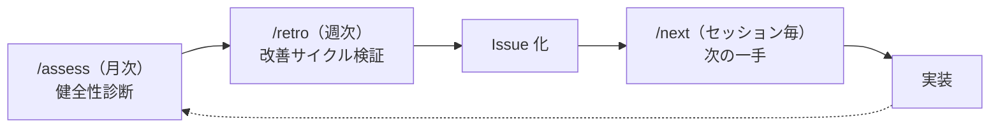

# CLAUDE.md

このファイルは Claude Code (claude.ai/code) がこのリポジトリで作業する際のガイダンスを提供する。

## 言語

応答は日本語で行う。コメント、ドキュメントも日本語で記述する。

### 段階的英語化

開発ワークフローを通じた英語力向上のため、以下は英語で記述する:

- **コミットメッセージ**: 英語で記述する
- **PR タイトル**: 英語で記述する（squash merge でコミットメッセージになるため）

それ以外（Issue タイトル、コードコメント、ドキュメント、PR 本文）は引き続き日本語。Issue タイトルは一覧でのスキャナビリティを優先し、日本語で記述する。

### プロンプト英訳

ユーザーの日本語プロンプトに対し、応答の冒頭で英訳を添える:

```
💬 Your prompt in English: [自然な英訳]
```

- 基本はカジュアル〜ニュートラル（日常で使える表現）
- 堅すぎる場合は口語的な言い換えも併記してよい
- 短い相槌や「はい」「いいえ」程度の返答には不要
- 意訳で構わない。自然な英語表現を優先する
- ユーザーが英語の意味を質問した場合や、日本語での説明を求めた場合は日本語で応答してよい

## プロジェクト概要

RingiFlow: 承認フロー・タスク管理・ドキュメント管理を一元化するエンタープライズ向けワークフロー管理システム（SaaS）

| レイヤー | 技術 |
|---------|------|
| バックエンド | Rust + axum（BFF / Core Service / Auth Service） |
| フロントエンド | Elm |
| インフラ | AWS（ECS Fargate, Aurora PostgreSQL, ElastiCache Redis） |
| IaC | Terraform |

## 開発コマンド

```bash
just setup              # 初回セットアップ
just dev-deps           # PostgreSQL, Redis を起動
just check              # リント + テスト（実装中の軽量チェック）
just check-all          # リント + テスト + API テスト + E2E テスト（プッシュ前に必須）
just fmt                # 全体フォーマット
```

### 開発サーバー起動

開発サーバーは必ず `just` コマンドで起動する。直接 `pnpm run dev` や `cargo run` を実行してはいけない。

```bash
just dev-all            # 全サーバー一括起動（推奨）
just dev-down           # 依存サービス（PostgreSQL, Redis）を停止
```

`dev-all` は依存サービス（PostgreSQL, Redis）を起動した後、mprocs（TUI プロセスマネージャー）で BFF・Core Service・Auth Service・Web を一括起動する。

#### 個別起動

特定のサーバーだけ起動したい場合:

```bash
just dev-deps           # PostgreSQL, Redis を起動（先に実行）
just dev-bff            # BFF
just dev-core-service   # Core Service
just dev-auth-service   # Auth Service
just dev-web            # フロントエンド
```

理由: 環境変数はルートの `.env` ファイルで管理し、justfile の `set dotenv-load := true` で読み込む設計。`just` を経由しないと環境変数が設定されない。

→ 詳細: [ナレッジベース: Vite](docs/06_ナレッジベース/frontend/Vite.md#環境変数管理)

### 単一テスト実行

```bash
# Rust
cd backend && cargo test テスト名
cd backend && cargo test --package ringiflow-domain テスト名

# Elm
cd frontend && pnpm run test -- --watch tests/Example.elm
```

### データストア操作

PostgreSQL スキーマやデータの確認に使用する。MCP（PostgreSQL）も利用可能。

```bash
just db-tables              # テーブル一覧
just db-schema テーブル名    # カラム定義
just db-query "SELECT ..."  # SQL 実行
just redis-keys             # Redis キー一覧
just redis-keys "session:*" # パターン指定
just redis-get キー名        # Redis 値取得
```

### 統合テスト

```bash
just test-rust-integration  # DB 接続が必要
```

## コードアーキテクチャ

### バックエンド（Rust Workspace）

```
backend/
├── apps/
│   ├── bff/            # BFF（セッション管理、API プロキシ）
│   ├── core-service/   # Core Service（ビジネスロジック）
│   └── auth-service/   # Auth Service（認証）
└── crates/
    ├── domain/         # ドメインモデル
    ├── infra/          # インフラ層（DB、Redis）
    └── shared/         # 共有ユーティリティ
```

依存関係: `apps → domain → shared`, `apps → infra → shared`

### フロントエンド（Elm + Vite）

```
frontend/src/
├── Main.elm            # エントリポイント
├── Route.elm           # ルーティング
├── Page/               # ページモジュール
└── Ports.elm           # JavaScript 連携
```

TEA（The Elm Architecture）パターンを採用。

## プロジェクト理念

2つの確固たる理念がある。すべての作業・設計・判断においてこれを最優先する。

### 理念1: 学習効果の最大化

このプロジェクトはオーナーの技術的学びを深める場である。

- 設計判断を伴う箇所では、なぜその選択をしたか解説する
- 代替案とトレードオフを示し、思考プロセスを共有する
- 応用パターンやベストプラクティスの観点から説明する

### 理念2: 品質の追求

[ISO/IEC 25010](https://iso25000.com/en/iso-25000-standards/iso-25010) のプロダクト品質モデルに基づき、ソフトウェア品質を体系的に追求する。

**重点品質特性（現在）:**

| 品質特性 | 副特性（代表例） | このプロジェクトでの意味 |
|---------|----------------|----------------------|
| 保守性 | モジュール性、修正性、試験性 | 長期的な進化と学習効果の最大化 |
| 機能適合性 | 完全性、正確性、適切性 | ワークフローの正確な実行 |
| セキュリティ | 機密性、完全性、真正性 | マルチテナントのデータ分離 |

**段階的に取り組む品質特性:**

| 品質特性 | 副特性（代表例） | 取り組み時期 |
|---------|----------------|------------|
| 信頼性 | 可用性、障害許容性、回復性 | Phase 2〜 |
| 操作性 | 学習性、操作容易性、エラー防止 | Phase 2〜 |
| 性能効率性 | 時間効率性、資源効率性、容量 | Phase 3〜 |

残り（互換性、柔軟性、安全性）は現時点では低優先。必要に応じて取り組む。

品質戦略は Validation（妥当性確認）と Verification（検証）の2層で構成する:

| 層 | 問い | 活動 | 仕組み |
|----|------|------|--------|
| Validation | 正しい問題を解いているか？ | Issue 精査、前提検証 | [問題解決フレームワーク](.claude/rules/problem-solving.md)、[Issue 精査](docs/04_手順書/04_開発フロー/01_Issue駆動開発.md#既存-issue-の精査) |
| Verification | 正しく作っているか？ | 実装品質の確保 | 守りと攻め（下記） |

Verification 層には**守り**と**攻め**の2方向がある:

| 方向 | 内容 | 仕組み |
|------|------|--------|
| 守り（欠陥除去） | マイナス→ゼロ: 問題を検出し修正する | 設計レビュー、品質チェックリスト |
| 攻め（設計改善） | ゼロ→プラス: より良い構造を発見し統合する | 設計レビュー、TDD Refactor の[設計原則レンズ](docs/04_手順書/04_開発フロー/02_TDD開発フロー.md#設計原則レンズ) |

設計原則:

- シンプルさを保つ（KISS）。必要十分な複雑さに留める
- 責務を明確に分離する。一つのモジュール/関数は一つの責務
- 依存関係の方向を意識する。詳細が抽象に依存する構造
- 過度な抽象化・過度な DRY を避ける。3回繰り返すまでは重複を許容

YAGNI/KISS と設計品質の判断基準:

YAGNI/KISS/MVP は**機能スコープ**の原則であり、**設計品質**を妥協する根拠にならない。

| 区分 | 判断 | 例 |
|------|------|-----|
| 機能の先取り | YAGNI を適用して見送ってよい | 将来必要になるかもしれないキャッシュ層の追加、まだ要件にない多段階承認 |
| 設計品質 | YAGNI/KISS を理由に妥協しない | レイヤー違反（ハンドラ→リポジトリ直接呼び出し）、型安全性の省略（String で済ませる）、エラーハンドリングの省略（unwrap で済ませる） |

判定テスト: 「この判断を放置すると、後続の実装で同じパターンが使われるか？」→ Yes なら設計品質の問題（割れ窓理論）。YAGNI/KISS で正当化してはならない。

型システムの活用（Rust / Elm の強みを活かす）:

- 型で表現できるものは型で表現する（文字列や整数の濫用を避ける）
- 不正な状態を表現不可能にする（Make Illegal States Unrepresentable）
- 安易な unwrap / expect を避け、エラーを適切に型で扱う

コードの明確さ:

- 意図が伝わる命名を心がける
- コメントは「なぜ」を書く。「何を」はコードで表現する

これらの理念は「あれば良い」ではなく**必須**。速度や利便性のために犠牲にしない。

### 共通アプローチ: ベストプラクティス起点

2つの理念を実現するための、全領域共通のアプローチ。

**あらゆる判断において、その分野の業界ベストプラクティスを起点（デフォルト）とし、プロジェクトの現実に合わせて意識的に調整する。**

- **起点を高く置く**: 「何もないところから足す」のではなく「ベストプラクティスから始めて調整する」。出発点が違えば到達点も違う
- **全領域に適用**: コード設計、UI/UX、アクセシビリティ、セキュリティ、テスト、検証、プロジェクト運営——例外なし
- **意識的な調整**: ベストプラクティスから外れるときは理由を記録する（ADR、Issue、コメント）。記録のない逸脱は許容しない
- **知って判断する**: 「知らなかったから従わなかった」は許容しない。まず調べ、知った上で判断する

→ 技術・ツール領域での具体化: [最新ベストプラクティス採用方針](.claude/rules/latest-practices.md)
→ 方法論・プロセス設計での具体化: [方法論・プロセス設計の方針](.claude/rules/methodology-design.md)
→ 収束の方法論: [俯瞰・実装リズム](.claude/rules/zoom-rhythm.md)の理想駆動

## 技術選定・設計判断の原則

### 1. 理念・要件への合致を最優先

判断の優先順位:

1. セキュリティ要件への適合
2. プロジェクト理念（学習効果、品質追求）との整合
3. 非機能要件（可用性、パフォーマンス等）の充足
4. 技術的なシンプルさ・効率

### 2. 既存ドキュメントの確認を必須とする

設計判断の前に、関連する既存ドキュメントを必ず確認する:

- 要件定義書（特にセキュリティ要件、非機能要件）
- 関連する ADR（過去の意思決定）
- 関連する設計書（基本設計、詳細設計）

**禁止事項:**

- 既存ドキュメントを確認せずに設計判断を提案すること
- 過去の ADR で却下された選択肢を、同じ文脈で再提案すること（新しい情報がある場合を除く）

### 3. 決定の文書化

新しい技術選定・設計判断を行った場合は、必ず ADR に記録する。

## 俯瞰・実装リズム

良いプログラミングは、設計と実装を忙しなく往復する。視点の高度を上げ下げしながら、全体と局所を行き来するリズムを大事にする。

| タイミング | 俯瞰の内容 |
|-----------|-----------|
| TDD の Refactor ステップ | [設計原則レンズ](docs/04_手順書/04_開発フロー/02_TDD開発フロー.md#設計原則レンズ)で設計品質を評価 |
| 予期しないエッジケース発見時 | 局所対処か全体設計への統合かの判断 |
| Phase の区切り | 全レンズ + 品質チェックリストで全体確認 |

往復を繰り返した結果、理想状態（To-Be）と現状（As-Is）のギャップがゼロになることで収束する。

→ 詳細: [`.claude/rules/zoom-rhythm.md`](.claude/rules/zoom-rhythm.md)

**禁止:** 視点を上げずに実装だけを続けること、収束確認を実施せずに成果物を提示・コミットすること

## 問題解決のアプローチ

問題や指摘を受けたとき、すぐに修正案を出さない。まず腰を据えて考える。

1. **Want（本質）**: ユーザーが本当に望んでいることは何か？
2. **To-Be（理想状態）**: どうあるべきだったか？
3. **As-Is（現状）**: 実際に何が起きたか？
4. **ギャップ分析**: なぜ理想と現実にずれが生じたか？
5. **根本原因**: 表層的な原因の奥にある構造的な問題は何か？
6. **対策設計**: 根本原因を解消し、Want を満たす対策は何か？

How（具体的な対策）にこだわりすぎず、常に Want を満たすかを検証する。

→ 詳細: [`.claude/rules/problem-solving.md`](.claude/rules/problem-solving.md)

**禁止:** このフレームワークを経ずに対策を提示すること

## 運用サイクル

プロジェクトの健全性を維持するため、3つのスキルが連携してフィードバックループを形成する。



| スキル | 頻度 | 役割 | 出力 |
|-------|------|------|------|
| `/assess` | 月次 | 3軸（Discovery / Delivery / Sustainability）で現状を診断 | 診断レポート + 推奨アクション |
| `/retro` | 週次 | 改善記録の有効性検証、トレンド分析、SRE 的観点 | レトロレポート + アクションアイテム |
| `/next` | セッション毎 | GitHub Issues から次の作業を選定 | 推奨タスク |

`/next` は GitHub Issues のみをデータソースとする。`/assess` と `/retro` のアクションアイテムは Issue 化することで `/next` に接続される。

## ドキュメント体系

このプロジェクトは一切の暗黙知を許容しない。すべての知識はコード・実装・文書で明示する。

| 知りたいこと | 参照先 |
|-------------|--------|
| 何を作るか（WHAT） | [`docs/01_要件定義書/`](docs/01_要件定義書/) |
| ユーザーから見た振る舞い（WHAT） | [`docs/01_要件定義書/機能仕様書/`](docs/01_要件定義書/機能仕様書/) |
| 全体設計（HOW） | [`docs/02_基本設計書/`](docs/02_基本設計書/) |
| 実装設計（HOW） | [`docs/03_詳細設計書/`](docs/03_詳細設計書/) |
| 操作手順（HOW TO） | [`docs/04_手順書/`](docs/04_手順書/) |
| 意思決定（WHY） | [`docs/05_ADR/`](docs/05_ADR/) |
| 技術知識 | [`docs/06_ナレッジベース/`](docs/06_ナレッジベース/) |
| 実装解説 | [`docs/07_実装解説/`](docs/07_実装解説/) |
| テスト | [`docs/08_テスト/`](docs/08_テスト/) |
| 設計の思考過程 | [`prompts/plans/`](prompts/plans/) |
| セッションログ | [`prompts/runs/`](prompts/runs/) |
| 操作パターン | [`prompts/recipes/`](prompts/recipes/) |
| AI 運用改善記録 | [`prompts/improvements/`](prompts/improvements/) |
| 診断レポート | [`prompts/reports/`](prompts/reports/) |

作業開始時は [`docs/01_要件定義書/00_はじめに.md`](docs/01_要件定義書/00_はじめに.md) から読み、全体像を把握すること。

### 情報管理の原則: ローカルファースト

→ 詳細: [ADR-025: 情報管理とローカル知識集約の方針](docs/05_ADR/025_情報管理とローカル知識集約の方針.md)

GitHub と ローカルの役割を明確に分離する:

| 場所 | 役割 | 記録するもの |
|------|------|-------------|
| GitHub Issues/PR | 一時的・ワークフロー用 | 作業追跡、進捗管理、CI 連携 |
| ローカル docs | 永続的・知識用 | 要件、設計判断、学び、パターン |

Issue/PR 内での長い議論は避け、判断・学びはローカルドキュメントに記録する。
Issue クローズ時には振り返りコメントを残し、重要な学びはローカルに転記する。

### AI エージェントが手順を案内する場合

- 操作手順を聞かれたら `justfile` または手順書を参照するよう案内する
- 会話の中で手順を独自に生成・要約しない
- 新しい手順が必要なら、justfile か手順書に追記して形式知化する

### ナレッジベースの活用

コード内のコメントは簡潔に、詳細解説はナレッジベースに書いてコードからリンクする:

```rust
//! 詳細: [BFF パターン](../../../docs/06_ナレッジベース/architecture/BFFパターン.md)
```

```elm
{-| 詳細: [TEA パターン](../../../docs/06_ナレッジベース/elm/Elmアーキテクチャ.md) -}
```

### ドキュメント自動作成ルール

**AI エージェントへの必須事項:**

セッション中に以下に該当する活動があった場合、対応ドキュメントを自発的に作成する。セッション終了時（`/wrap-up` 実行時）にも該当がないか振り返る。

**禁止:** 該当する活動があったにもかかわらず、ドキュメントを作成しないこと

- **ADR** — 技術選定、実装方針の選択、見送りの判断
- **ナレッジベース** — 新しいツール・パターン導入、技術解説
- **セッションログ** — コード変更、設計判断（→ [`prompts/runs/`](prompts/runs/)）
- **実装解説** — PR 単位の機能解説・コード解説。`/explain` で生成（→ [`docs/07_実装解説/`](docs/07_実装解説/)）
- **操作レシピ** — 非自明な操作で問題解決、再利用可能なパターン発見（→ [`prompts/recipes/`](prompts/recipes/)）
- **改善記録** — AI エージェント運用上の問題と対策（→ [`prompts/improvements/`](prompts/improvements/)）

## 学習支援

### 解説するタイミング

以下のような「設計判断を伴う箇所」では、コードとともに解説を提供する:

- アーキテクチャ上の決定（なぜこの構造にしたか）
- 複数の実装パターンから一つを選択した場面
- 非自明なロジックやイディオム
- トレードオフが存在する選択

単純な CRUD 実装や定型的な修正では解説は不要。

### 解説の内容

1. 意図: なぜこのコード/設計にしたか
2. 代替案: 他にどんな選択肢があったか、なぜ採用しなかったか
3. トレードオフ: この選択のメリット・デメリット
4. 関連知識: 理解を深めるための概念や参考情報

### 想定レベル

オーナーは中級者（各技術の基礎は理解済み）。基本構文の説明は不要。応用パターンやベストプラクティスの観点から解説する。

特に注力: アーキテクチャ設計（DDD, CQRS）、Elm/TEA パターン、ソフトウェア設計原則

### 複数選択肢の提示

ユーザーに複数の選択肢を提示する際は、推奨オプションを明示する。

```
どの方法で進めますか？
1. 選択肢 A
2. 選択肢 B
3. 選択肢 C
4. **A + C の組み合わせ（推奨）** ← 理由を簡潔に
```

- 選択肢だけ列挙して「どれにしますか？」と聞くのではなく、判断材料と推奨を提供する
- 単一選択だけでなく、組み合わせが最適な場合はそれを推奨として明示する

注: Yes/No で答えられるクローズドクエスチョンには適用しない。

### 英語サマリー（Insight ブロック）

Insight ブロックには、日本語の解説に加えて 1〜2 文の英語サマリーを必ず付ける:

```
★ Insight ─────────────────────────────────────
[日本語の教育的ポイント 2-3 点]

📝 In English: [1-2 sentence summary of the key takeaway]
─────────────────────────────────────────────────
```

## Issue 駆動開発

**AI エージェントへの必須事項:**

機能実装の依頼を受けたら、**コードを書く前に**必ず [手順書](docs/04_手順書/04_開発フロー/01_Issue駆動開発.md) を読み、記載されたフローに従う。

**禁止:** 手順書を読まずに実装を開始すること

設計フェーズ完了後、実装フェーズに入る際は必ず [TDD 開発フロー](docs/04_手順書/04_開発フロー/02_TDD開発フロー.md) を参照し、**テストから書き始める**こと。

**禁止:** テストを書かずにプロダクションコードを書き始めること

コードを書く前に、関連する型定義と既存パターンを必ず確認する。推測で書かない。

→ 詳細: [`.claude/rules/pre-implementation.md`](.claude/rules/pre-implementation.md)

→ 詳細: [手順書: Issue 駆動開発](docs/04_手順書/04_開発フロー/01_Issue駆動開発.md)

1. Issue を確認または作成し、前提を精査する
2. Story 番号を含むブランチを作成（例: `feature/34-user-auth`）
3. 実装（[TDD](docs/04_手順書/04_開発フロー/02_TDD開発フロー.md)）
4. PR を作成し `Closes #34` で紐づけ（Story 単位）
5. マージで Story Issue 自動クローズ

補足:
- 機能実装前に対応 Issue の存在を確認
- ブランチ名には Story 番号を含める（Epic 番号ではない）
- Phase やタスク完了時は Issue のチェックボックスを更新

## Git 操作ルール

### ブランチ戦略（GitHub Flow + Story-per-PR）

→ 意思決定: [ADR-046](docs/05_ADR/046_Story-per-PRブランチ戦略.md)

各 Story を個別 PR で main にマージする。Integration branch（develop 等）は使用しない。

```bash
git checkout -b feature/Story番号-機能名   # 新機能（Story 単位）
git checkout -b fix/Issue番号-バグ名       # バグ修正
```

**禁止:**

- main ブランチで直接作業・コミット
- Epic 番号でブランチを作成すること（ブランチは Story 単位）

### コミットメッセージ

```bash
git commit -m "#34 Implement find_by_email for UserRepository"
```

lefthook により、ブランチ名が `feature/34-xxx` 形式なら Issue 番号は自動付与される。

英語コミットでよく使う動詞パターン:

| 動詞 | 用途 | 例 |
|------|------|-----|
| Implement | 新規実装 | Implement user authentication |
| Add | 追加 | Add validation to login form |
| Fix | バグ修正 | Fix null pointer in session handler |
| Update | 変更・改善 | Update error messages for clarity |
| Refactor | リファクタリング | Refactor session management logic |
| Remove | 削除 | Remove deprecated API endpoint |
| Rename | リネーム | Rename Session to Shared |

### PR 作成（Draft）

→ 詳細: [手順書: Draft PR を作成](docs/04_手順書/04_開発フロー/01_Issue駆動開発.md#3-draft-pr-を作成)

```bash
git commit --allow-empty -m "#34 WIP: Implement login feature"
git push -u origin HEAD
gh pr create --draft --title "#34 Implement login feature" --body-file .github/pull_request_template.md
```

**PR 本文の形式:**

- 本文の先頭に `## Issue` セクションを配置:
  - Story PR: `Closes #<Story番号>` で自動クローズ
  - Issue を参照するだけの場合: `Related to #123`
  - Issue がない場合: `なし`
- Epic に対して `Closes` は使用しない（Epic は全サブ Issue 完了後に手動クローズ）
- AI エージェントは `--body` でテンプレート形式の本文を直接指定し、末尾に署名を付与する: `🤖 Generated with [Claude Code](https://claude.com/claude-code)`

**Test plan の記載について:**

- **単一 PR で完結する場合**: 実装したテストと手動テストの手順を記載
- **Epic の Story PR の場合**: 各 Story PR に、その Story のテスト手順を記載

### PR 完了フロー

実装完了から Ready for Review までの手順。順番を守ること。

1. 実装完了、`just check-all` 通過
2. 収束確認完了（[zoom-rhythm.md](.claude/rules/zoom-rhythm.md)）
3. Draft PR 作成（`gh pr create --draft`）
4. `/wrap-up` でドキュメント整備
5. wrap-up 完了の検証（構造的チェックポイント）
6. base branch 同期確認（`git fetch origin main && git log HEAD..origin/main --oneline`）
7. ユーザーに確認を求める（「Ready にしてよいですか？」）
8. ユーザー承認後、`gh pr ready` で Ready にする

Step 5 の検証方法:

```bash
git -c core.quotepath=false diff --name-only main...HEAD | grep -E "^(prompts/runs/|prompts/improvements/|prompts/recipes/|docs/05_ADR/|docs/06_|docs/07_)"
```

- ドキュメントコミットが存在すれば Step 6 へ進む
- 存在しない場合は `/wrap-up` を先に実行する
- `/wrap-up` の結果「作成不要」と判断された場合は、その旨をユーザーに伝えてから Step 6 へ進む

Step 6 の同期確認: 差分がある場合は `git rebase origin/main` を実行し、`just check-all` で再確認する。Ready for Review 後の rebase は CI + レビューの再実行を伴うため、プッシュ前に解消する

**禁止:**

- Draft なしで PR を作成すること
- ユーザー確認なしに `gh pr ready` を実行すること
- wrap-up 完了を検証せずに Ready を提案すること

改善の経緯:
- [PR を Draft で作成しなかった](prompts/improvements/2026-02/2026-02-05_2104_PRをDraftで作成しなかった.md)
- [ユーザー確認なしに PR を Ready にした](prompts/improvements/2026-02/2026-02-05_2104_ユーザー確認なしにPRをReadyにした.md)
- [wrap-up 前に Ready を提案する再発](prompts/improvements/2026-02/2026-02-09_2134_wrap-up前にReadyを提案する再発.md)

### Ready for Review

```bash
just check-all  # lint + test + API test
gh pr ready     # Draft を解除
```

→ 詳細チェックリスト: [手順書: 品質ゲートと Ready for Review](docs/04_手順書/04_開発フロー/01_Issue駆動開発.md#6-品質ゲートと-ready-for-review)

### マージ

```bash
gh pr merge --squash --delete-branch
just clean-branches  # マージ後のローカルブランチ削除
```

**禁止:** `--admin` で CI バイパス、CI 失敗状態での強制マージ

## 構造品質の維持

新モジュール追加時の責務重複チェック、ファイルサイズ閾値（500 行）、未使用依存の検出に関する指針。

→ 詳細: [`.claude/rules/structural-review.md`](.claude/rules/structural-review.md)

## データストア追加時の必須対応

新しいデータストアを追加する場合、テナント退会時のデータ削除を考慮した設計が必須。

→ 詳細: [`.claude/rules/data-store.md`](.claude/rules/data-store.md)

1. `tenant_id` による削除が可能か確認
2. 削除レジストリに登録
3. 設計書を更新

## エンティティ追加・更新パス追加時の必須対応

新しいエンティティを追加する場合、または既存エンティティに新しい更新パス（ユースケース）を追加する場合、エンティティ影響マップを作成・更新する。

→ 詳細: [`docs/03_詳細設計書/エンティティ影響マップ/`](docs/03_詳細設計書/エンティティ影響マップ/)

1. [テンプレート](docs/03_詳細設計書/エンティティ影響マップ/TEMPLATE.md)を使って影響マップを作成
2. 更新パスと競合リスクを洗い出す
3. 必要に応じて競合対策（楽観的ロック等）を設計する

## リポジトリ実装時の必須対応

新しいリポジトリを実装する場合、以下の手順を厳守する。

→ 詳細: [`.claude/rules/repository.md`](.claude/rules/repository.md)

1. 既存のリポジトリテストを確認（配置、パターン）
2. テストは `backend/crates/infra/tests/` に配置
3. `#[sqlx::test(migrations = "../../migrations")]` を使用
4. `just sqlx-prepare` でキャッシュを更新
5. `just pre-commit` で全体チェック

**禁止:** DB 接続が必要なテストを `src/` に配置、`sqlx-prepare` の省略

## API 実装時の必須対応

BFF の公開 API エンドポイントを追加・変更・削除した場合、以下を必ず実施する。

→ 詳細: [`.claude/rules/api.md`](.claude/rules/api.md)

1. OpenAPI 仕様書 ([`openapi/openapi.yaml`](openapi/openapi.yaml)) を更新
2. API 設計書との整合性を確認

**禁止:** 実装と OpenAPI 仕様書が乖離した状態でコミットすること

## 開発ツール追加時の必須対応

新しい開発ツールを追加する場合、以下を同時に更新:

1. `justfile` の `check-tools` タスク
2. [`docs/04_手順書/01_開発参画/01_開発環境構築.md`](docs/04_手順書/01_開発参画/01_開発環境構築.md)

## アーキテクチャ構成変更時の必須対応

以下のいずれかに該当する変更を行った場合、基本設計書を確認・更新する。

該当する変更:
- サービス（アプリケーション）の追加・削除
- 共有クレートの追加・削除
- 外部連携先の追加・削除
- サービス間通信パターンの変更

確認・更新する設計書:

1. [`00_アーキテクチャ概要.md`](docs/02_基本設計書/00_アーキテクチャ概要.md) — 構成図、レイヤー表、通信表、セキュリティ境界図
2. [`01_アーキテクチャ設計.md`](docs/02_基本設計書/01_アーキテクチャ設計.md) — 詳細構成図、コンポーネント図、レイヤー表
3. [`02_プロジェクト構造設計.md`](docs/02_基本設計書/02_プロジェクト構造設計.md) — ディレクトリ構造、Cargo.toml、クレート構成図

**禁止:** アーキテクチャ構成を変更しながら基本設計書を更新しないこと

## CI ワークフロー変更時の必須対応

GitHub Actions ワークフローに新しい Action を追加した場合、以下を実施する。

→ 詳細: [ナレッジベース: GitHub Actions](docs/06_ナレッジベース/devtools/GitHubActions.md#アクション許可設定)

1. [ナレッジベースの許可設定テーブル](docs/06_ナレッジベース/devtools/GitHubActions.md#プロジェクトでの許可設定)に Action のパターンを追記する
2. 間接依存（Action が内部で呼び出す別の Action）がないか確認し、あれば同様に追記する
3. GitHub Settings → Actions → General の許可パターンにも追加する（リポジトリ管理者が手動で実施）

**禁止:** 許可設定を更新せずに CI ワークフローに新しい Action を追加すること

## ドキュメント規約

→ [`.claude/rules/docs.md`](.claude/rules/docs.md)

## PR レビュー

Claude Code Action による自動 PR レビューが有効。

→ [`.github/workflows/claude-auto-review.yaml`](.github/workflows/claude-auto-review.yaml)

承認基準:

| 重大度 | 基準 | アクション |
|--------|------|-----------|
| Critical/High | マージ前に修正必須 | request-changes |
| Medium/Low | 改善推奨だがマージ可能 | approve + コメント |

```bash
# 指摘対応フロー
gh pr checks && gh pr view --comments
# 対応後、理由を返信してから resolve
gh pr merge --squash --delete-branch
```
