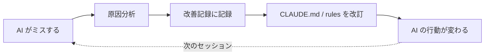
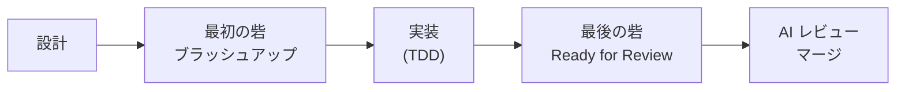
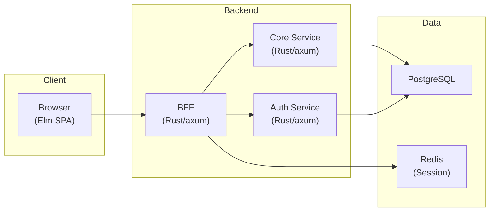

# RingiFlow (稟議フロー)

[](https://github.com/ka2kama/ringiflow/actions/workflows/ci.yaml)


承認フロー・タスク管理・ドキュメント管理を一元化する **エンタープライズ向けワークフロー管理システム（SaaS）**

> **学習 & 実験プロジェクト**: 商用レベルの品質を目指しながら、AI エージェント（Claude Code）主導で開発する実験。

---

## プロジェクト理念

このプロジェクトは 2 つの理念を軸に進めている。

### 学習効果の最大化

単にコードを書くだけでなく、**設計判断の理由**を常に言語化する。

- なぜその技術・パターンを選んだか
- 他にどんな選択肢があり、なぜ採用しなかったか
- トレードオフは何か

**重点学習テーマ:**
- CQRS + Event Sourcing
- 並行更新と状態整合性（楽観的ロック、競合解決、UI同期）
- マルチテナントアーキテクチャ

これらを ADR や技術ノートに記録し、後から振り返れるようにしている。

### 品質の追求

外部品質（信頼性、パフォーマンス、セキュリティ）と内部品質（可読性、保守性、テスタビリティ）の両方を追求する。

**設計原則:**
- シンプルさを保つ（KISS）
- 責務を明確に分離する
- 変更の影響範囲を局所化する

**型システムの活用:**
- 不正な状態を型で表現不可能にする
- 実行時エラーよりコンパイルエラーを選ぶ

### 共通アプローチ: ベストプラクティス起点

2つの理念を実現するため、あらゆる判断において業界ベストプラクティスを起点とし、プロジェクトの現実に合わせて調整する。

- 起点を高く置く（ベストプラクティスから始めて調整する）
- 全領域に適用（コード設計、UI/UX、セキュリティ、テスト——例外なし）
- 意識的な調整（外れるときは理由を記録する）

---

## AI 駆動開発

AI にコードを書かせること自体は容易になった。しかし「正しく」「高品質に」書かせ続けるのは別の問題で、プロンプトの工夫だけでは AI は同じミスを繰り返す。

このプロジェクトでは AI エージェント（Claude Code）に開発を主導させながら、その課題を構造的に解決する仕組みを構築・運用している。

| 役割 | 担当 | 内容 |
|------|------|------|
| オーナー | 人間 | 方針決定、レビュー、最終判断 |
| 実装者 | Claude Code | 設計、実装、テスト、ドキュメント作成 |
| レビュアー | Claude Code Action | PR の自動レビュー |

### AI の行動規範

[CLAUDE.md](CLAUDE.md)（600行超）と [17 のルールファイル](.claude/rules/) が AI の行動を構造的に規定している。
「AI が自由に書く」のではなく、「ルールに従って書く」体制。主要なルール:

- [Issue 駆動開発](docs/04_手順書/04_開発フロー/01_Issue駆動開発.md) / [TDD](docs/04_手順書/04_開発フロー/02_TDD開発フロー.md) の強制 — コードを書く前に Issue を確認し、テストから書き始める
- [実装前チェックリスト](.claude/rules/pre-implementation.md) — 型定義・既存パターンを確認してから書く。推測で書かない
- [俯瞰・実装リズム](.claude/rules/zoom-rhythm.md) — 設計と実装を往復し、収束（To-Be = As-Is）を確認してから提出
- [問題解決フレームワーク](.claude/rules/problem-solving.md) — すぐに修正案を出さず、Want → To-Be → As-Is → 根本原因の順で考える
- [ベストプラクティス起点](.claude/rules/latest-practices.md) — 技術選定も[方法論設計](.claude/rules/methodology-design.md)も、業界のベストプラクティスから始めて調整する
- [ドキュメント自動作成](CLAUDE.md#ドキュメント自動作成ルール) — 技術選定には ADR、新パターンにはナレッジベース、設計判断にはセッションログを自発的に作成

### 改善フィードバックループ

AI はミスをする。重要なのは、同じミスを繰り返さない仕組みがあること。



現在 [30 件以上の改善記録](prompts/improvements/)が蓄積されている。代表的な事例:

| 事例 | 問題 | 対策 |
|------|------|------|
| [YAGNI/KISS の拡大解釈](prompts/improvements/2026-02/2026-02-01_0004_YAGNI-KISSの拡大解釈による設計品質低下.md) | AI が YAGNI を設計品質の妥協に使う | 機能スコープと設計品質を区別するルールを追加 |
| [E2E 視点の完了基準欠如](prompts/improvements/2026-01/2026-01-29_1304_E2E視点の完了基準欠如.md) | API は動くが UI から操作できない | 完了基準に E2E 視点を追加 |
| [自己検証の自動実行欠如](prompts/improvements/2026-02/2026-02-05_2100_自己検証ループの自動実行欠如.md) | 「検証すること」と指示しても実行されない | 行動規範ではなく成果物要件にして構造的に強制 |

### 品質の二重防壁

品質は開発フロー全体を通じて作り込む。設計と実装後に正式な関門を置き、実装中は TDD で継続的に品質を維持する。



- 最初の砦（設計段階）: [ブラッシュアップループ](.claude/rules/zoom-rhythm.md#設計ブラッシュアップループ)で設計のギャップをゼロにしてから実装に入る
- 最後の砦（Ready for Review）: [品質チェックリスト](docs/04_手順書/04_開発フロー/01_Issue駆動開発.md#62-品質チェックリスト)で漏れを防ぎ、PR に Self-review を記載する

→ 詳細: [CLAUDE.md](CLAUDE.md)

---

## 技術スタック

| レイヤー | 技術 | 選定理由 |
|---------|------|----------|
| バックエンド | **Rust** + axum | 型安全性、メモリ安全性、高パフォーマンス |
| フロントエンド | **Elm** | 純粋関数型、ランタイムエラーゼロ、The Elm Architecture |
| データストア | PostgreSQL, Redis | ワークフロー・ユーザー管理、セッション管理 |
| インフラ | AWS Lightsail, Cloudflare | デモ環境（個人開発向け低コスト構成） |

## アーキテクチャ



### 設計パターン

| パターン | 目的 |
|---------|------|
| **BFF (Backend for Frontend)** | セキュリティ強化（トークン秘匿）、フロントエンド最適化 API |
| **マルチテナント (tenant_id)** | アプリケーションレベルのテナントデータ分離 |
| **レイヤードアーキテクチャ** | domain / infra / apps の責務分離 |

## 技術的ハイライト

### ドキュメント体系

すべての知識を文書化し、**暗黙知ゼロ**を目指す。

| 知りたいこと | 参照先 |
|-------------|--------|
| 何を作るか（WHAT） | [要件定義書](docs/01_要件定義書/) |
| どう作るか（HOW） | [基本設計書](docs/02_基本設計書/) / [詳細設計書](docs/03_詳細設計書/) |
| どう操作するか（HOW TO） | [手順書](docs/04_手順書/) |
| なぜその決定か（WHY） | [ADR](docs/05_ADR/)（例: [ID 形式](docs/05_ADR/001_ID形式の選定.md) / [データ削除](docs/05_ADR/007_テナント退会時のデータ削除方針.md) / [Newtype 化](docs/05_ADR/016_プリミティブ型のNewtype化方針.md)） |
| 技術の知識 | [ナレッジベース](docs/06_ナレッジベース/) |
| 実装の詳細解説 | [実装解説](docs/07_実装解説/)（例: [認証機能](docs/07_実装解説/01_認証機能/00_概要.md)） |
| 開発の過程 | [セッションログ](prompts/runs/) |

### CI/CD & コード品質

- **GitHub Actions**: 変更検出による効率的な並列 CI
- **Claude Code Action**: AI による自動 PR レビュー
- **リント**: clippy (Rust), elm-review (Elm)
- **フォーマット**: rustfmt, elm-format

### 開発環境

- **並行開発対応**: git worktree + Docker Compose で、複数タスクを独立した環境で同時進行可能
  - **ポート自動割り当て**: 環境ごとに衝突しないポートを自動設定

## ディレクトリ構成

```
ringiflow/
├── backend/           # Rust バックエンド
│   ├── apps/          # BFF, Core Service, Auth Service
│   └── crates/        # 共有ライブラリ（domain, infra, shared）
├── frontend/          # Elm フロントエンド
├── infra/             # Terraform, Docker
├── openapi/           # OpenAPI 仕様
├── prompts/           # AI 運用（セッションログ、改善記録、計画）
└── docs/              # ドキュメント
    ├── 01_要件定義書/
    ├── 02_基本設計書/
    ├── 03_詳細設計書/
    ├── 04_手順書/
    ├── 05_ADR/
    ├── 06_ナレッジベース/
    └── 07_実装解説/
```

## 開発フロー

GitHub Projects + Issue でタスクを管理。

1. Issue を作成または確認
2. `feature/123-機能名` 形式でブランチ作成
3. 実装 → PR 作成（`Closes #123` で紐付け）
4. CI + AI レビュー → マージ

→ [Project Board](https://github.com/users/ka2kama/projects/1) / [Issues](https://github.com/ka2kama/ringiflow/issues)

## Getting Started

開発環境の構築手順: [手順書](docs/04_手順書/01_開発参画/01_開発環境構築.md)

複数タスクを同時に進める場合: [並行開発（Worktree）](docs/04_手順書/04_開発フロー/04_並行開発（Worktree）.md)

```bash
# 初回セットアップ（依存関係インストール、DB 起動、マイグレーション）
just setup

# 開発サーバー起動（BFF, Core Service, Auth Service, Web を一括起動）
just dev-all

# コミット前チェック（lint + test + API test）
just check-all
```

## 開発状況

**Phase 2（機能拡張）計画中** — Phase 1 MVP 完了

| Phase | 状態 | 内容 |
|-------|------|------|
| Phase 0 | ✅ 完了 | 開発基盤構築（CI/CD、プロジェクト構造、ドキュメント体系） |
| Phase 1 | ✅ 完了 | 最小限の動作するワークフローシステム |
| Phase 2 | 📋 計画中 | 機能拡張（マルチテナント、通知、ドキュメント管理） |
| Phase 3 | 📋 計画中 | エンタープライズ機能（SSO/MFA、複雑なフロー） |
| Phase 4 | 📋 計画中 | 高度な機能（CQRS/ES、リアルタイム） |

詳細: [実装ロードマップ](docs/03_詳細設計書/00_実装ロードマップ.md)
