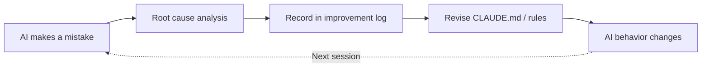
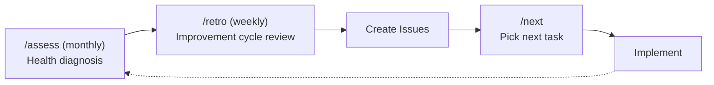
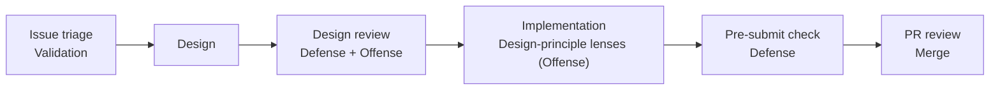
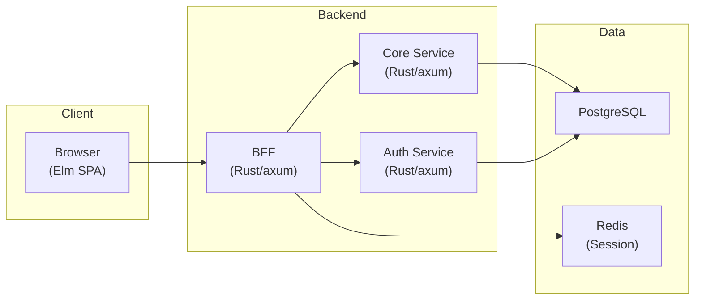

# RingiFlow

[日本語版はこちら](README.ja.md)

[](https://github.com/ka2kama/ringiflow/actions/workflows/ci.yaml)


An **enterprise workflow management system (SaaS)** that unifies approval flows, task management, and document management.

> **Learning & Experimentation Project**: An experiment in building production-quality software driven primarily by an AI agent (Claude Code).

---

## Project Philosophy

### Maximize Learning

Articulate and record the reasoning behind every design decision.

- Why was this technology or pattern chosen?
- What alternatives were considered, and why were they rejected?
- What are the trade-offs?

**Key learning themes:**
- CQRS + Event Sourcing
- Concurrent updates and state consistency (optimistic locking, conflict resolution, UI synchronization)
- Multi-tenant architecture

### Pursue Quality

Systematically pursue software quality based on the [ISO/IEC 25010](https://iso25000.com/en/iso-25000-standards/iso-25010) product quality model, currently focusing on maintainability, functional suitability, and security.

The quality strategy consists of two layers — V&V (Validation & Verification):

| Layer | Question | Mechanism |
|-------|----------|-----------|
| Validation | Are we solving the right problem? | [Problem-solving framework](.claude/rules/problem-solving.md), [Issue triage](docs/04_手順書/04_開発フロー/01_Issue駆動開発.md#既存-issue-の精査) |
| Verification | Are we building it correctly? | Defense & Offense (below) |

The Verification layer has two complementary directions:

| Direction | Focus | Mechanism |
|-----------|-------|-----------|
| Defense (defect removal) | Negative → Zero: detect and fix problems | Design review, quality checklists |
| Offense (design improvement) | Zero → Positive: discover and integrate better structures | Design review, [design-principle lenses](docs/04_手順書/04_開発フロー/02_TDD開発フロー.md#設計原則レンズ) in TDD Refactor |

**Design principles:**
- Keep it simple (KISS)
- Separate concerns clearly
- Localize the impact of changes

**Leverage the type system:**
- Make invalid states unrepresentable
- Prefer compile-time errors over runtime errors

### Common Approach: Start from Best Practices

Start from industry best practices and adjust to fit the project's context.

- Set the bar high (start from best practices, then adapt)
- Apply to every domain (code design, UI/UX, security, testing, development process — no exceptions)
- Adjust consciously (document the reason when deviating)

---

## AI-Driven Development

Development is led by an AI agent (Claude Code), with guardrails to ensure quality.

| Role | Actor | Responsibilities |
|------|-------|------------------|
| Owner | Human | Direction setting, review, final decisions |
| Implementer | Claude Code | Design, implementation, testing, documentation |
| Reviewer | Claude Code Action | Automated PR review |

### AI Behavioral Rules

[CLAUDE.md](CLAUDE.md) (~400 lines) and [22 rule files](.claude/rules/) structurally govern the AI's behavior. The AI doesn't write freely — it follows rules.

Key rules:

- [Issue-driven development](docs/04_手順書/04_開発フロー/01_Issue駆動開発.md) / [TDD](docs/04_手順書/04_開発フロー/02_TDD開発フロー.md) enforcement — Verify the Issue before coding; write tests first
- [Pre-implementation checklist](.claude/rules/pre-implementation.md) — Confirm type definitions and existing patterns before writing; no guessing
- [Design-implementation rhythm](.claude/rules/zoom-rhythm.md) — Alternate between big-picture and detail views; only submit when the gap between ideal and actual reaches zero
- [Problem-solving framework](.claude/rules/problem-solving.md) — Don't jump to fixes; think through essential purpose → ideal state → current state → root cause
- [Best-practices-first](.claude/rules/latest-practices.md) — Both technology selection and [methodology design](.claude/rules/methodology-design.md) start from industry best practices
- [Auto-generate documentation](CLAUDE.md#ドキュメント自動作成ルール) — ADRs for technology choices, knowledge base for new patterns, session logs for design decisions

### Improvement Feedback Loop



Currently [79 improvement records](process/improvements/) exist. Examples:

| Case | Problem | Countermeasure |
|------|---------|----------------|
| [YAGNI/KISS misapplication](process/improvements/2026-02/2026-02-01_0004_YAGNI-KISSの拡大解釈による設計品質低下.md) | AI used YAGNI to justify compromising design quality | Added rule to distinguish feature scope from design quality |
| [Missing E2E perspective](process/improvements/2026-01/2026-01-29_1304_E2E視点の完了基準欠如.md) | API works but unusable from UI | Added E2E perspective to completion criteria |
| [Self-verification not executed](process/improvements/2026-02/2026-02-05_2100_自己検証ループの自動実行欠如.md) | Instructions to "verify" were ignored | Shifted from behavioral norms to deliverable requirements for structural enforcement |

### Operational Cycle: Diagnose → Reflect → Act

In addition to improvement records, the project regularly diagnoses and reflects on overall health.



- `/assess`: Diagnose across 3 axes — Discovery (unstarted features) / Delivery (backlog) / Sustainability (technical health)
- `/retro`: Evaluate improvement effectiveness, recurrence rate & MTTR analysis, Toil analysis, error-budget thinking
- `/next`: Select next work item, including actions created from diagnosis results

### Quality Strategy: Validation & Verification

Quality is ensured through two layers: Validation (solving the right problem?) and Verification (building it correctly?).



- Issue triage: Validate Issue assumptions, scope, and completion criteria using the [problem-solving framework](.claude/rules/problem-solving.md)
- Design review: [Iterate design reviews](.claude/rules/zoom-rhythm.md#設計ブラッシュアップループ) until gaps reach zero before implementation
- Design-principle lenses: Answer [SRP, DIP, Simple Design questions](docs/04_手順書/04_開発フロー/02_TDD開発フロー.md#設計原則レンズ) during TDD Refactor to find improvement opportunities
- Pre-submit check: Catch remaining issues with the [quality checklist](docs/04_手順書/04_開発フロー/01_Issue駆動開発.md#62-品質チェックリスト), and include Self-review in the PR

→ Details: [CLAUDE.md](CLAUDE.md)

---

## Tech Stack

| Layer | Technology | Rationale |
|-------|-----------|-----------|
| Backend | **Rust** + axum | Type safety, memory safety, high performance |
| Frontend | **Elm** | Pure functional, zero runtime errors, The Elm Architecture |
| Data stores | PostgreSQL, Redis | Workflow & user management, session management |
| Infrastructure | AWS Lightsail, Cloudflare | Demo environment (low-cost setup for solo development) |

## Demo

https://demo.ka2kama.com

> The login page is not yet implemented; DevAuth (development authentication bypass) provides an authenticated state.

## Architecture



### Design Patterns

| Pattern | Purpose |
|---------|---------|
| **BFF (Backend for Frontend)** | Security hardening (token concealment), frontend-optimized API |
| **Multi-tenant (tenant_id)** | Application-level tenant data isolation |
| **Layered architecture** | Separation of concerns across domain / infra / apps |

## Technical Highlights

### Documentation System

All knowledge is documented — aiming for **zero tacit knowledge**.

| What you want to know | Where to look |
|-----------------------|---------------|
| What to build (WHAT) | [Requirements](docs/01_要件定義書/) |
| How to build it (HOW) | [High-level design](docs/02_基本設計書/) / [Detailed design](docs/03_詳細設計書/) |
| How to operate (HOW TO) | [Procedures](docs/04_手順書/) |
| Why that decision (WHY) | [ADRs](docs/05_ADR/) (e.g., [ID format](docs/05_ADR/001_ID形式の選定.md) / [Data deletion](docs/05_ADR/007_テナント退会時のデータ削除方針.md) / [Newtype wrapping](docs/05_ADR/016_プリミティブ型のNewtype化方針.md)) |
| Technical knowledge | [Knowledge base](docs/06_ナレッジベース/) |
| Implementation walkthroughs | [Implementation guides](docs/07_実装解説/) (e.g., [Authentication](docs/07_実装解説/01_認証機能/01_認証機能_機能解説.md)) |
| Tests | [Tests](docs/08_テスト/) (API test matrices, test specifications) |
| Development history | [Session logs](prompts/runs/) |

### CI/CD & Code Quality

- **GitHub Actions**: Efficient parallel CI with change detection
- **Claude Code Action**: AI-powered automated PR review
- **Linting**: clippy (Rust), elm-review (Elm)
- **Formatting**: rustfmt, elm-format

### Development Environment

- **Parallel development**: git worktree + Docker Compose with persistent slot system for running multiple tasks in isolated environments simultaneously
  - **Deterministic port mapping**: Predictable port assignments based on slot numbers

## Directory Structure

```
ringiflow/
├── backend/           # Rust backend
│   ├── apps/          # BFF, Core Service, Auth Service
│   └── crates/        # Shared libraries (domain, infra, shared)
├── frontend/          # Elm frontend
├── infra/             # Terraform, Docker
├── openapi/           # OpenAPI specs
├── prompts/           # AI operations (session logs, improvement records, plans)
└── docs/              # Documentation
    ├── 01_要件定義書/   # Requirements
    ├── 02_基本設計書/   # High-level design
    ├── 03_詳細設計書/   # Detailed design
    ├── 04_手順書/      # Procedures
    ├── 05_ADR/        # Architecture Decision Records
    ├── 06_ナレッジベース/ # Knowledge base
    └── 07_実装解説/    # Implementation guides
```

## Development Flow

Tasks are managed with GitHub Projects + Issues.

1. Create or review an Issue
2. Create a branch in the `feature/123-feature-name` format
3. Implement → Create PR (link with `Closes #123`)
4. CI + AI review → Merge

→ [Project Board](https://github.com/users/ka2kama/projects/1) / [Issues](https://github.com/ka2kama/ringiflow/issues)

## Getting Started

Development environment setup: [Procedures](docs/04_手順書/01_開発参画/01_開発環境構築.md)

For working on multiple tasks simultaneously: [Parallel development (Worktree)](docs/04_手順書/04_開発フロー/04_並行開発（Worktree）.md)

```bash
# Initial setup (install dependencies, start DB, run migrations)
just setup

# Start dev servers (BFF, Core Service, Auth Service, Web — all at once)
just dev-all

# Pre-commit check (lint + test + API test)
just check-all
```

## Development Status

**Phase 2 (Feature Expansion) in progress** — Phase 1 MVP complete

| Phase | Status | Description |
|-------|--------|-------------|
| Phase 0 | ✅ Complete | Development foundation (CI/CD, project structure, documentation system) |
| Phase 1 | ✅ Complete | Minimum viable workflow system |
| Phase 2 | 🚧 In Progress | Feature expansion (multi-tenant, notifications, document management) |
| Phase 3 | 📋 Planning | Enterprise features (SSO/MFA, complex workflows) |
| Phase 4 | 📋 Planning | Advanced features (CQRS/ES, real-time) |

Details: [Implementation Roadmap](docs/03_詳細設計書/00_実装ロードマップ.md)
