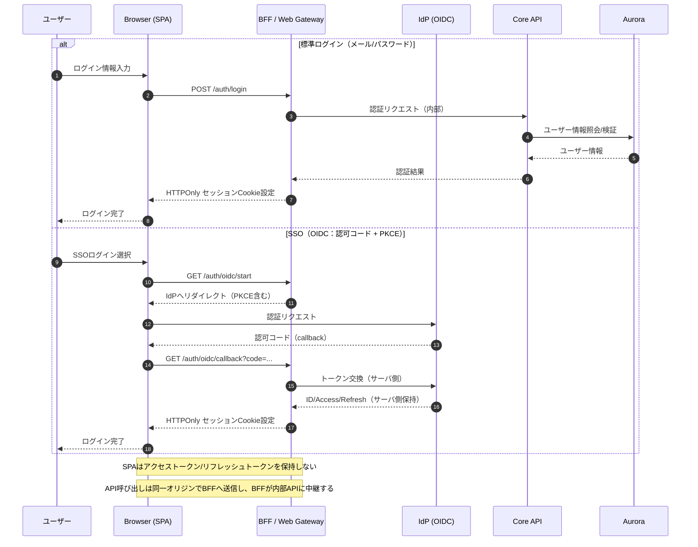
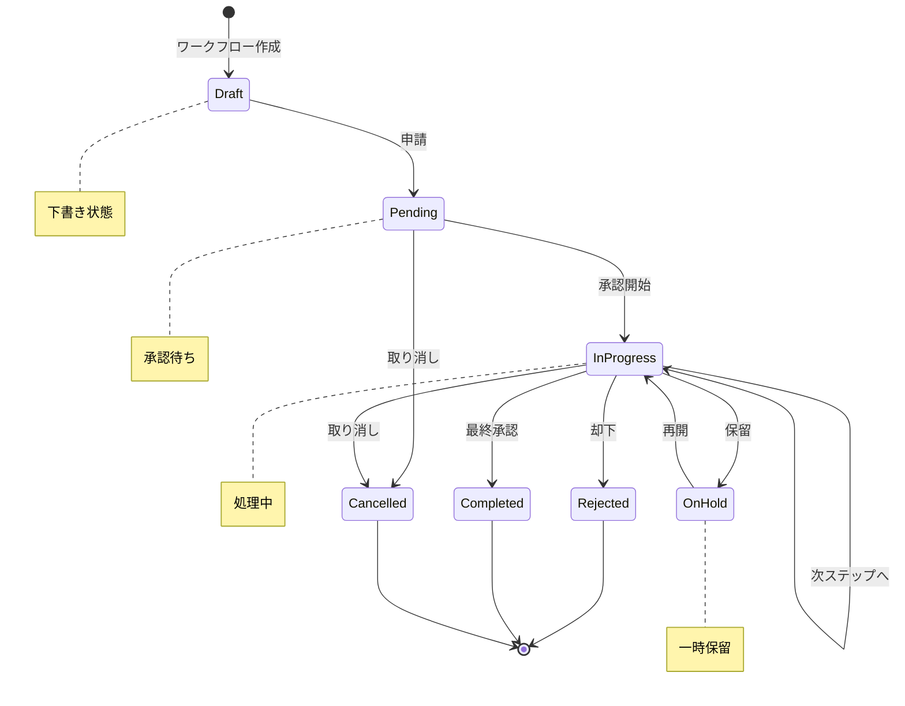
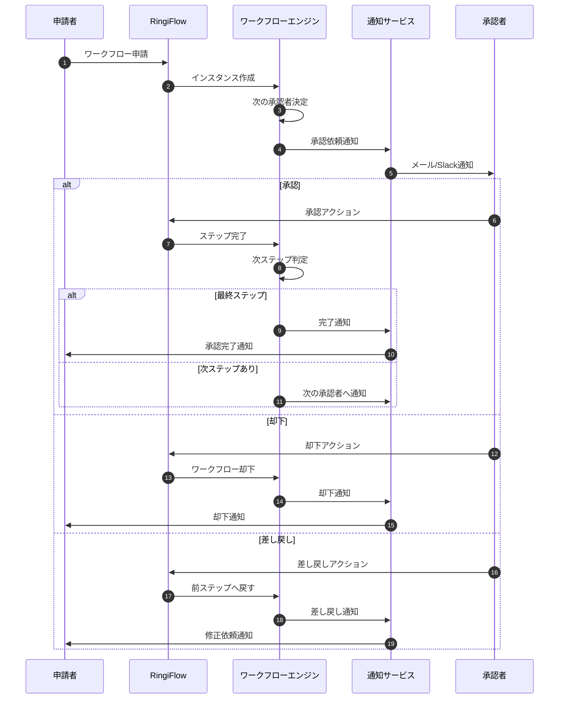
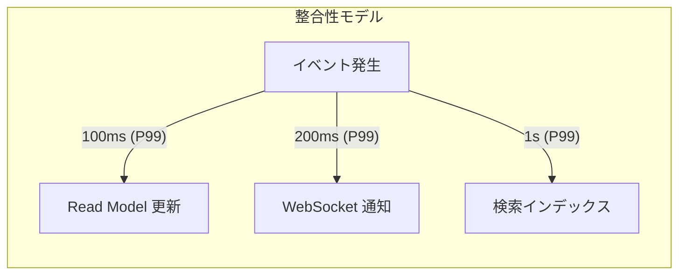
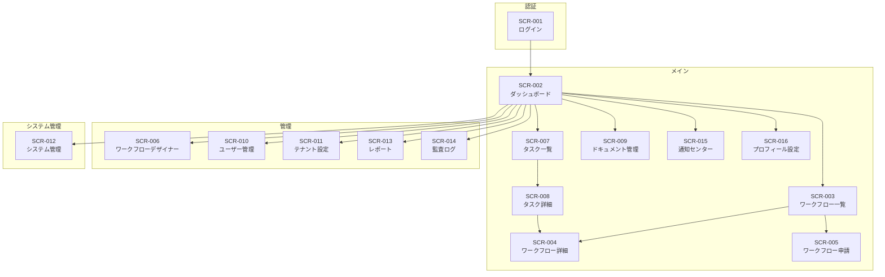

# RingiFlow コア要件

## TOC
- [CORE-01] RingiFlow 要件定義（ドキュメント群）
- [CORE-02] プロジェクト概要
- [CORE-03] システム概要
- [CORE-04] 機能要件
- [CORE-05] 非機能要件
- [CORE-06] UI/UX 要件
- [CORE-07] テナント課金・プラン管理
- [CORE-08] 検索機能要件
- [CORE-09] 国際化（i18n）要件
- [CORE-10] API 設計
- [CORE-11] ワークフロー定義スキーマ
- [CORE-12] テスト戦略

---

## [CORE-01] RingiFlow 要件定義（ドキュメント群）

本ドキュメント群は、RingiFlow の設計・実装・運用を一貫して進めるための要件定義です。
対象読者は、プロダクト開発者（フロントエンド／バックエンド）、インフラ／SRE（Site Reliability Engineering：サイト信頼性エンジニアリング）、セキュリティ担当者です。

## 文書の規約

本ドキュメントでは RFC 2119 の慣例に従い、要件の強度を以下のキーワードで表現します。

- MUST：必須要件です。この要件を満たさないと、システムは正しく動作しません。
- SHOULD：強く推奨される要件です。特別な理由がない限り実装してください。
- MAY：任意です。必要に応じて実装を検討してください。

## 文書構成

- 00_はじめに.md
  Claude Code がドキュメントを読む順序、引用方法（SECTION_ID）、推測の扱いを固定するための最小ルールです。
- 01_コア要件.md
  プロジェクトのスコープ、全体像、機能要件、非機能要件を統合した本文です。
- 02_アーキテクチャ設計.md
  システムアーキテクチャ（全体構成）、コンポーネント設計、バッチ処理について記載しています。
- 03_インフラとDB設計.md
  インフラストラクチャ（AWS 上のネットワーク、サーバー構成）、データベース設計について記載しています。
- 04_運用設計.md
  セキュリティ要件、監視・運用要件、デプロイメント（本番環境への配備手順）について記載しています。
- 05_高度な設計.md
  外部連携、AWS アカウント・IAM 設計、ベストプラクティス、EDA（Event-Driven Architecture：イベント駆動アーキテクチャ）について記載しています。
- 06_用語集.md
  本ドキュメント群で使用する専門用語の説明です。不明な用語があればこちらを参照してください。  

## [CORE-02] プロジェクト概要

### 1.1 プロジェクトの目的

本プロジェクトは、**商用利用レベルの品質を担保したエンタープライズアプリケーション開発**の私的学習を目的とします。具体的には以下のスキル習得を目標とします。

- Rust + axum（Rust 向け Web フレームワーク）を用いた高性能 Web アプリケーションの設計・実装
- フロントエンドは Elm（関数型プログラミング言語）を採用し、The Elm Architecture パターンで構築
    - WebSocket（サーバーとの双方向リアルタイム通信）等のブラウザ機能との連携は Ports（Elm と JavaScript の橋渡し機構）を使用
    - Ports 境界の契約・監視・再同期を非機能要件として明文化する
- AWS のエンタープライズグレードなインフラ構築
    - マルチ AZ：複数のアベイラビリティゾーン（データセンター群）に分散配置して耐障害性を確保
    - マルチアカウント：本番環境・開発環境等を別々の AWS アカウントで分離して管理
- IaC（Infrastructure as Code：インフラのコード化）として Terraform を使用し、インフラの再現性を確保
- CI/CD パイプライン（継続的インテグレーション/継続的デリバリー：コードの自動テスト・自動デプロイの仕組み）の構築
- セキュリティ・可用性・パフォーマンスのベストプラクティス習得

### 1.2 プロジェクトスコープ

| 区分 | 内容 |
|------|------|
| スコープ内 | Web アプリケーション本体、バックエンド API、バッチ処理、インフラ構築、CI/CD 構築 |
| スコープ外 | モバイルアプリ、オンプレミス（自社データセンター）連携、データ移行ツール |

### 1.3 成功基準

- 本番環境において 99.9% 以上の可用性を達成（月間ダウンタイム約 43 分以内）
- P99 レイテンシが 200ms 以下（リクエストの 99% が 200ms 以内に応答）
- セキュリティ監査において重大な脆弱性が検出されないこと
- インフラ全体が Terraform で再構築可能であること（手動設定なしで環境を再現できる）

---

## [CORE-03] システム概要

### 2.1 システム名称

**RingiFlow**（フローフォージ）- エンタープライズ ワークフロー管理システム

### 2.2 システム概要説明

RingiFlow は、企業内の業務プロセス（申請・承認フロー、タスク管理、ドキュメント管理）を一元管理するエンタープライズ向け SaaS（Software as a Service：クラウド上で提供されるソフトウェアサービス）アプリケーションです。

本システムは以下の特徴を持ちます。

- **柔軟なワークフロー定義**: ノーコード/ローコード（プログラミング不要または最小限のコードで設定できる仕組み）でワークフローを設計可能
- **マルチテナント対応**: 複数の組織（会社）を安全に分離して運用できる
- **高い拡張性**: API ファースト（API を中心とした設計）で外部システムとの連携が容易
- **エンタープライズセキュリティ**: SSO（シングルサインオン：一度のログインで複数サービスにアクセス）、監査ログ、データ暗号化を標準装備

#### 2.2.1 テナント（組織）モデル

テナントとは、本システムを利用する「会社単位の領域」のことです。

- **テナントは原則として「会社（組織）単位」**とし、SaaS におけるワークスペースに相当する境界として扱います。
- 部署・プロジェクト等のグルーピングは、同一テナント内の論理グループ（例: Team/Space）として表現します。**課金・監査・データ分離の境界はテナント単位**です。
- 認証トークンおよびアプリケーションのリクエストコンテキストには tenant_id を必須とし、以降の認可・監査・データアクセスで利用します。

#### 2.2.2 テナント分離モデル（Pool/Bridge/Silo）

RingiFlow は AWS SaaS Lens（AWS が提供する SaaS 設計のベストプラクティス集）の考え方にならい、以下のモデルを採用します。

- **Pool（標準）**: 共有基盤（共有 DB/共有スキーマ）を使用し、tenant_id によってデータを分離します。コスト効率が高く、ほとんどのテナントはこのモデルを使用します。
- **Silo（例外）**: 大手テナント等で契約上・法的に強い分離が必要な場合、専用 DB または専用スタック（完全に独立した環境）を提供できます。
- **Bridge（混在）**: テナントごとに分離モード（POOL/SILO）を保持し、リクエスト処理とデータアクセスが適切なデータプレーン（データ処理基盤）へルーティング（振り分け）されます。

（学習用途の推奨）最初は Pool のみで実装し、分離モードのスキーマとルーティングだけ先に用意しておきます。

### 2.3 ユーザー区分

| ユーザー種別 | 説明 | 想定人数 |
|-------------|------|---------|
| システム管理者 | システム全体の管理、テナント管理 | 5名程度 |
| テナント管理者 | 組織内のユーザー管理、ワークフロー設計 | 各テナント1〜5名 |
| 一般ユーザー | ワークフローの実行、タスク処理 | 各テナント数十〜数百名 |
| API利用者 | 外部システムからのAPI経由アクセス | システム単位 |

### 2.4 想定規模

| 項目 | 初期 | 1年後 | 3年後 |
|------|------|------|------|
| テナント数 | 10 | 100 | 500 |
| 総ユーザー数 | 500 | 10,000 | 100,000 |
| 月間リクエスト数 | 100万 | 1,000万 | 1億 |
| データ保存量 | 100GB | 1TB | 10TB |

---

## [CORE-04] 機能要件

### 3.1 認証・認可機能

認証（Authentication）とは「誰であるかを確認すること」、認可（Authorization）とは「何をする権限があるかを確認すること」です。

#### 認証フロー

以下の図は、ユーザーがログインする際のデータの流れを示しています。

- **SPA**: Single Page Application（ブラウザ上で動作する Web アプリケーション）
- **BFF**: Backend For Frontend（SPA 専用のバックエンドサーバー。セキュリティの要となる）
- **IdP**: Identity Provider（認証を担当する外部サービス。例: Okta, Azure AD）
- **OIDC**: OpenID Connect（OAuth 2.0 ベースの認証プロトコル）



#### 3.1.1 認証機能

| 機能ID | 機能名 | 説明 | 優先度 |
|--------|--------|------|--------|
| AUTH-001 | メール/パスワード認証 | 標準的なメール・パスワードによるログイン | 必須 |
| AUTH-002 | SSO連携（SAML 2.0） | Okta、Azure AD 等との SAML（Security Assertion Markup Language：XML ベースの認証連携規格）連携 | 必須 |
| AUTH-003 | SSO連携（OIDC） | OpenID Connect + PKCE（Proof Key for Code Exchange：認可コード横取り攻撃を防ぐ仕組み）による認証連携。トークン交換は BFF 側で実施 | 必須 |
| AUTH-004 | MFA（多要素認証） | TOTP（Time-based One-Time Password：時刻ベースのワンタイムパスワード。Google Authenticator 等で使用）、SMS による二要素認証 | 必須 |
| AUTH-005 | ソーシャルログイン | Google、Microsoft アカウントでのログイン | 推奨 |
| AUTH-006 | パスワードリセット | メールによるパスワードリセットフロー | 必須 |
| AUTH-007 | セッション管理 | サーバサイドセッション。HTTPOnly Cookie（JavaScript からアクセスできない安全な Cookie）を使用。アイドル/絶対期限、同時セッション制御、強制ログアウト機能を含む | 必須 |
| AUTH-008 | SCIM プロビジョニング | SCIM（System for Cross-domain Identity Management）により、IdP からユーザー/グループを自動作成・更新・無効化。Okta/Azure AD 等に対応 | 推奨 |
| AUTH-009 | アカウント無効化（退職者対応） | 退職/異動時の即時アクセス停止、トークン失効、セッション破棄 | 必須 |
| AUTH-010 | トークン秘匿（BFF） | ブラウザにアクセストークン/リフレッシュトークンを保持しない。BFF で保管し、内部 API 呼び出しにのみ使用（XSS 攻撃からトークンを保護） | 必須 |
| AUTH-011 | CSRF防御 | CSRF（Cross-Site Request Forgery：偽サイトから正規サイトへの不正リクエスト）を防ぐため、SameSite Cookie と同期トークン方式を併用 | 必須 |

#### 3.1.2 認可機能

| 機能ID | 機能名 | 説明 | 優先度 |
|--------|--------|------|--------|
| AUTHZ-001 | RBAC | Role-Based Access Control（役割ベースアクセス制御）。ユーザーに「管理者」「一般ユーザー」等のロールを割り当て、ロールごとに権限を管理 | 必須 |
| AUTHZ-002 | ABAC | Attribute-Based Access Control（属性ベースアクセス制御）。「部署が経理」「役職が課長以上」等の属性に基づくきめ細かな権限制御 | 推奨 |
| AUTHZ-003 | テナント分離 | マルチテナント環境でのデータ分離。他テナントのデータにはアクセスできない | 必須 |
| AUTHZ-004 | API キー管理 | 外部システム連携用の API キーの発行・管理 | 必須 |

### 3.2 ワークフロー管理機能

#### ワークフロー状態遷移図



#### ワークフロー処理シーケンス



#### 3.2.1 ワークフロー定義

| 機能ID | 機能名 | 説明 | 優先度 |
|--------|--------|------|--------|
| WF-001 | ワークフローデザイナー | GUI によるワークフロー設計 | 必須 |
| WF-002 | 承認ステップ定義 | 単独承認、並列承認、順次承認の設定 | 必須 |
| WF-003 | 条件分岐 | 条件に応じたフロー分岐 | 必須 |
| WF-004 | 自動アクション | ステップ完了時の自動処理（メール送信等） | 必須 |
| WF-005 | SLA設定 | ステップごとの期限設定と、期限超過時のエスカレーション（上位者への自動通知・権限移譲） | 推奨 |
| WF-006 | テンプレート管理 | 定義済みワークフローのテンプレート化 | 推奨 |

#### 3.2.2 ワークフロー実行

| 機能ID | 機能名 | 説明 | 優先度 |
|--------|--------|------|--------|
| WF-101 | ワークフロー申請 | 新規ワークフローインスタンスの作成 | 必須 |
| WF-102 | 承認・却下 | 各ステップでの承認/却下アクション | 必須 |
| WF-103 | 差し戻し | 前ステップへの差し戻し | 必須 |
| WF-104 | 代理承認 | 代理者による承認処理 | 推奨 |
| WF-105 | 一括承認 | 複数案件の一括処理 | 推奨 |
| WF-106 | 進捗確認 | ワークフローの進捗状況可視化 | 必須 |

### 3.3 タスク管理機能

| 機能ID | 機能名 | 説明 | 優先度 |
|--------|--------|------|--------|
| TASK-001 | タスク作成 | 手動でのタスク作成 | 必須 |
| TASK-002 | タスク割り当て | ユーザー/グループへの割り当て | 必須 |
| TASK-003 | 期限管理 | 期限設定とリマインダー | 必須 |
| TASK-004 | 優先度設定 | 優先度による分類 | 必須 |
| TASK-005 | コメント機能 | タスクへのコメント追加 | 必須 |
| TASK-006 | 添付ファイル | タスクへのファイル添付 | 必須 |
| TASK-007 | タスク検索・フィルタ | 高度な検索機能 | 必須 |

### 3.4 ドキュメント管理機能

| 機能ID | 機能名 | 説明 | 優先度 |
|--------|--------|------|--------|
| DOC-001 | ファイルアップロード | 各種ファイルのアップロード | 必須 |
| DOC-002 | バージョン管理 | ファイルのバージョン履歴管理 | 必須 |
| DOC-003 | フォルダ管理 | 階層型フォルダ構造 | 必須 |
| DOC-004 | 全文検索 | ドキュメント内容の検索 | 推奨 |
| DOC-005 | アクセス権限設定 | ファイル/フォルダ単位のアクセス制御 | 必須 |
| DOC-006 | プレビュー | ブラウザ内でのファイルプレビュー | 推奨 |

### 3.5 通知機能

| 機能ID | 機能名 | 説明 | 優先度 |
|--------|--------|------|--------|
| NOTIFY-001 | メール通知 | 各種イベントのメール通知 | 必須 |
| NOTIFY-002 | Slack通知 | Slack チャンネルへの通知 | 必須 |
| NOTIFY-003 | Teams通知 | Microsoft Teams への通知 | 推奨 |
| NOTIFY-004 | Webhook | カスタムWebhookによる通知 | 必須 |
| NOTIFY-005 | アプリ内通知 | システム内通知センター | 必須 |
| NOTIFY-006 | 通知設定 | ユーザーごとの通知設定 | 必須 |

### 3.6 レポート・分析機能

| 機能ID | 機能名 | 説明 | 優先度 |
|--------|--------|------|--------|
| RPT-001 | ダッシュボード | KPIの可視化 | 必須 |
| RPT-002 | ワークフロー統計 | 処理件数、所要時間等の統計 | 必須 |
| RPT-003 | レポートエクスポート | PDF/Excel形式でのエクスポート | 推奨 |
| RPT-004 | 監査ログ閲覧 | 監査ログの検索・閲覧 | 必須 |

### 3.7 システム管理機能

| 機能ID | 機能名 | 説明 | 優先度 |
|--------|--------|------|--------|
| ADM-001 | テナント管理 | テナントの CRUD 操作（Create：作成、Read：参照、Update：更新、Delete：削除） | 必須 |
| ADM-002 | ユーザー管理 | ユーザーの CRUD 操作 | 必須 |
| ADM-003 | ロール管理 | 権限ロールの定義 | 必須 |
| ADM-004 | グループ管理 | ユーザーグループの管理 | 必須 |
| ADM-005 | システム設定 | グローバル設定の管理 | 必須 |
| ADM-006 | 利用状況モニタリング | リソース使用状況の監視 | 推奨 |

### 3.8 API機能

| 機能ID | 機能名 | 説明 | 優先度 |
|--------|--------|------|--------|
| API-001 | REST API | RESTful API の提供 | 必須 |
| API-002 | GraphQL API | GraphQL エンドポイントの提供 | 推奨 |
| API-003 | API ドキュメント | OpenAPI (Swagger) によるドキュメント | 必須 |
| API-004 | レート制限 | API呼び出しのレート制限 | 必須 |
| API-005 | API バージョニング | APIのバージョン管理 | 必須 |

---

## [CORE-05] 非機能要件

非機能要件とは、「何ができるか」（機能）ではなく「どのように動作するか」（性能、信頼性、セキュリティ等）を定義するものです。

### 4.1 可用性要件

可用性とは、システムが正常に利用できる状態を維持できる度合いを示します。

| 項目 | 要件 | 備考 |
|------|------|------|
| 稼働率 | 99.9% 以上（月間ダウンタイム 43 分以内） | 計画メンテナンス除く |
| RPO（目標復旧時点） | 1 時間以内 | Recovery Point Objective：障害時に「どの時点までのデータを復旧できるか」。1 時間以内なら、最大 1 時間分のデータロスで済む |
| RTO（目標復旧時間） | 4 時間以内 | Recovery Time Objective：障害発生から「何時間以内にサービスを復旧させるか」 |
| 冗長構成 | マルチ AZ 構成（最低 2AZ） | 複数のデータセンターに分散配置し、片方が障害でも継続稼働 |
| フェイルオーバー | 自動フェイルオーバー | 障害発生時に自動的に待機系へ切り替わる |
| バックアップ | 日次自動バックアップ、35 日間保持 | |

### 4.2 パフォーマンス要件

| 項目 | 要件 | 備考 |
|------|------|------|
| 応答時間（API） | P50: 50ms 以下、P95: 100ms 以下、P99: 200ms 以下 | P50/P95/P99 はパーセンタイル値。P99 = 200ms なら「リクエストの 99% は 200ms 以内に応答」という意味 |
| 応答時間（画面） | 初期表示 2 秒以内 | |
| 同時接続ユーザー数 | 10,000 ユーザー | |
| スループット | 1,000 RPS 以上 | RPS = Requests Per Second（1 秒あたりのリクエスト処理数） |
| ファイルアップロード | 100MB/ファイル、1GB/リクエスト（マルチパート） | マルチパート：大きなファイルを分割してアップロードする方式 |

### 4.3 スケーラビリティ要件

スケーラビリティとは、負荷の増減に応じてシステムの処理能力を拡張・縮小できる能力です。

| 項目 | 要件 | 備考 |
|------|------|------|
| 水平スケーリング | オートスケーリング対応 | 水平スケーリング：サーバー台数を増やして処理能力を上げる方式。CPU 使用率 70% で自動的にサーバー追加 |
| 最小インスタンス数 | 2（各 AZ 1 台以上） | 可用性確保のため常時 2 台以上 |
| 最大インスタンス数 | 20 | コスト上限として設定 |
| スケールアウト時間 | 5 分以内 | 負荷増加を検知してから新サーバーが稼働するまで |

### 4.4 セキュリティ要件

詳細は「04_運用設計.md」を参照。

| 項目 | 要件 |
|------|------|
| 通信暗号化 | TLS 1.3（Transport Layer Security：通信を暗号化するプロトコル）を最小バージョンとして強制（ALB/CloudFront の TLS ポリシーで担保） |
| 保存データ暗号化 | AES-256（Advanced Encryption Standard：256 ビット鍵長の対称暗号方式） |
| 認証 | OAuth 2.0（認可フレームワーク）/ OIDC / SAML 2.0 対応 |
| WAF | AWS WAF（Web Application Firewall：Web アプリケーションへの攻撃を検知・防御するサービス）によるプロテクション |
| 脆弱性対応 | Critical: 24時間以内、High: 7日以内 |

### 4.5 運用性要件

| 項目 | 要件 |
|------|------|
| ログ保持期間 | CloudWatch Logs: 30日、S3: 90日〜1年（ログ種別による）、監査ログ: 1年（Glacier：低コスト長期保存ストレージに移行後は最大3年保持） |
| 監視 | 24時間365日監視（自動アラート） |
| デプロイ | ゼロダウンタイムデプロイ（Blue/Green：新旧 2 環境を用意し、切り替えることでダウンタイムなしでリリース） |
| ロールバック | 5分以内にロールバック（前バージョンへの切り戻し）可能 |


補足（Must）
運用性要件の実現手段として、アプリケーションは以下を必須とし、`correlationId`（リクエストを追跡するための一意な ID）により相互参照できなければならない。

- 構造化ログ：JSON 形式等で出力され、検索・分析しやすいログ
- 分散トレーシング：複数サービスにまたがるリクエストの流れを可視化する仕組み
- 主要メトリクス：レイテンシ/エラー率/依存障害/キュー滞留/DB プール枯渇

詳細は「02_アーキテクチャ設計.md [SECTION_ID: OPS-01] / 5.3.2 Rust バックエンド安定運用要件」および「04_運用設計.md [SECTION_ID: OPS-05]」を優先規範とする。  


### 4.6 互換性要件

| 項目 | 対応バージョン |
|------|----------------|
| ブラウザ | Chrome（最新2バージョン）、Firefox（最新2バージョン）、Safari（最新2バージョン）、Edge（最新2バージョン） |
| 画面解像度 | 1280x720 以上 |
| レスポンシブ対応 | タブレット（768px以上） |

### 4.7 データ整合性要件

本システムでは、イベントソーシング + CQRS アーキテクチャを採用し、結果整合性（Eventual Consistency）モデルを採用する。

用語説明：
- イベントソーシング：データの状態ではなく「何が起きたか（イベント）」を記録し、イベントを再生して現在の状態を構築する方式
- CQRS（Command Query Responsibility Segregation）：データの書き込み（コマンド）と読み取り（クエリ）を分離するアーキテクチャパターン
- 結果整合性：即座に全データが同期されるのではなく、一定時間後に整合性が保たれるモデル
- Read Model：読み取り専用に最適化されたデータビュー
- Aggregate：一貫性を保つべきデータのまとまり（例：1 件のワークフローとその全ステップ）

| 項目 | 要件 | 備考 |
|------|------|------|
| Read Model 更新遅延 | 通常 100ms 以下、最大 5秒以内 | イベント発生から Read Model 反映まで |
| WebSocket 通知遅延 | 通常 200ms 以下、最大 3秒以内 | イベント発生からブラウザ通知まで |
| 検索インデックス更新 | 通常 1秒以下、最大 30秒以内 | OpenSearch 反映まで |
| イベント順序保証 | 同一 Aggregate 内で保証 | パーティションキー（データの振り分けキー）による順序保証 |
| 冪等性保証 | すべてのイベントハンドラで必須 | 冪等性：同じ処理を何度実行しても結果が変わらない性質。event_id による重複排除で実現 |
| 整合性回復 | イベント再処理により回復可能 | Kafka（分散メッセージキュー）オフセットリセットで過去イベントを再処理 |



**結果整合性の許容範囲**
- ワークフロー一覧表示: 数秒の遅延は許容
- ダッシュボード統計: リアルタイム性より正確性を優先
- 承認操作後の状態反映: 即座にUI更新（楽観的UI更新）、バックエンドは結果整合性

---

### 4.8 データガバナンス・プライバシー要件

エンタープライズ利用では「保持・削除・エクスポート」が契約/法務/監査のボトルネックになりやすい。
そのため、以下を明示的な要件として定義する。

用語説明：
- 論理削除：データベース上では削除フラグを立てるだけで、データ自体は残す方式。誤削除時に復旧可能
- 物理削除：データベースからデータを完全に消去する方式
- Right to Erasure：GDPR（EU 一般データ保護規則）で定められた「忘れられる権利」。ユーザーが自分のデータの完全削除を要求できる権利
- 署名付き URL：一定期間だけ有効な認証情報を含む URL。S3 ファイルを安全に共有するために使用
- リーガルホールド：訴訟や監査に備えて、関連データの削除を一時停止する仕組み

| 項目 | 要件 | 備考 |
|------|------|------|
| データ保持（Retention） | テナント単位で保持ポリシーを設定可能（例: 1年/3年/7年） | 監査ログ・添付ファイルも対象 |
| 論理削除と猶予期間 | 通常削除は論理削除（例: 7〜30日猶予）→ 期限後に物理削除 | 事故対応（復旧）と両立 |
| 物理削除（Right to Erasure） | 管理者が「即時/猶予付き」を選択可能。物理削除はバックアップ領域も含めて完了期限を定義 | 例: 30日以内に完全消去 |
| データエクスポート（Portability） | テナント管理者が監査ログ含む全データをエクスポート可能（CSV/JSON、署名付きURL） | バッチ（ECS Tasks/AWS Batch）で実施 |
| リーガルホールド | 監査/訴訟対応で削除を停止できるフラグを提供 | 権限は最小特権で限定 |

### 4.9 SLO/SLI・インシデント管理要件

可用性/性能の数値（4.1〜4.3）を「運用品質」に落とし込むため、SLO と運用手順を定義する。
AWS Well-Architected（AWS が提供するベストプラクティス集）の考え方に沿い、測定可能な指標を先に固定する。

用語説明：
- SLI（Service Level Indicator）：サービス品質を測定する具体的な指標（例：レスポンスタイム、エラー率）
- SLO（Service Level Objective）：SLI に対する目標値（例：可用性 99.9%）
- DLQ（Dead Letter Queue）：処理に失敗したメッセージを退避するキュー。これが溜まると障害の兆候

| 対象 | SLI（計測） | SLO（目標） | 備考 |
|------|------------|------------|------|
| API 可用性 | 2xx/3xx 比率（除外ルール明記） | 月次 99.9% | 計画メンテ除外 |
| API レイテンシ | P99 | 200ms 以下 | 4.2 と整合 |
| イベント処理 | コンシューマ遅延、DLQ 件数 | P99 5秒以内、DLQ 0 を維持 | 4.7 と整合 |
| 監査ログ | 取り込み遅延 | 1分以内 | 監査要件上重要 |

インシデント運用は、重大度定義（SEV1〜SEV4）、初動 SLA、エスカレーション経路、ポストモーテム（障害発生後の振り返りと再発防止策の策定）を必須とする。
Runbook（定型対応手順書：障害発生時に誰でも同じ手順で対応できるようにまとめたドキュメント）を「04_運用設計.md」に紐づけて整備する。

---

## [CORE-06] UI/UX 要件

### 5.1 画面一覧

| 画面ID | 画面名 | 説明 | 対象ユーザー |
|--------|--------|------|-------------|
| SCR-001 | ログイン | メール/パスワード、SSO 選択 | 全ユーザー |
| SCR-002 | ダッシュボード | KPI、タスク一覧、通知サマリ | 一般ユーザー |
| SCR-003 | ワークフロー一覧 | 申請済み/承認待ち/完了のフィルタ表示 | 一般ユーザー |
| SCR-004 | ワークフロー詳細 | 進捗、履歴、添付ファイル、コメント | 一般ユーザー |
| SCR-005 | ワークフロー申請 | フォーム入力、ファイル添付、申請実行 | 一般ユーザー |
| SCR-006 | ワークフローデザイナー | ノーコード/ローコードでフロー設計 | テナント管理者 |
| SCR-007 | タスク一覧 | 自分に割り当てられたタスク | 一般ユーザー |
| SCR-008 | タスク詳細 | 承認/却下/差し戻しアクション | 一般ユーザー |
| SCR-009 | ドキュメント管理 | フォルダ/ファイル一覧、アップロード | 一般ユーザー |
| SCR-010 | ユーザー管理 | ユーザー CRUD、ロール割り当て | テナント管理者 |
| SCR-011 | テナント設定 | 組織設定、SSO 設定、通知設定 | テナント管理者 |
| SCR-012 | システム管理 | テナント管理、システム設定 | システム管理者 |
| SCR-013 | レポート | 統計ダッシュボード、エクスポート | テナント管理者 |
| SCR-014 | 監査ログ | 操作履歴の検索・閲覧 | テナント管理者 |
| SCR-015 | 通知センター | アプリ内通知一覧、既読管理 | 一般ユーザー |
| SCR-016 | プロフィール設定 | 個人設定、MFA 設定、通知設定 | 一般ユーザー |

### 5.2 画面遷移図



### 5.3 ワークフローデザイナー要件

ワークフローデザイナー（SCR-006）は、ノーコード/ローコードでワークフローを設計するための画面である。

#### 5.3.1 デザイナー機能

| 機能ID | 機能名 | 説明 | 優先度 |
|--------|--------|------|--------|
| WFD-001 | キャンバス | ドラッグ&ドロップでステップを配置 | 必須 |
| WFD-002 | ステップパレット | 承認/通知/条件分岐等のステップ部品 | 必須 |
| WFD-003 | 接続線 | ステップ間の遷移を線で接続 | 必須 |
| WFD-004 | プロパティパネル | 選択ステップの設定編集 | 必須 |
| WFD-005 | バリデーション | フロー定義の整合性チェック | 必須 |
| WFD-006 | プレビュー | 定義したフローの動作プレビュー | 推奨 |
| WFD-007 | バージョン管理 | 定義のバージョン履歴管理 | 必須 |
| WFD-008 | インポート/エクスポート | JSON 形式での入出力 | 推奨 |

#### 5.3.2 ステップ種別

| ステップ種別 | 説明 | アイコン例 |
|-------------|------|----------|
| 開始 | フローの開始点 | ○ |
| 終了 | フローの終了点 | ◎ |
| 承認 | 単独/並列/順次承認 | ✓ |
| 通知 | メール/Slack/Teams 通知 | ✉ |
| 条件分岐 | 条件に応じた分岐 | ◇ |
| 待機 | 一定時間/条件待機 | ⏳ |
| スクリプト | カスタムロジック実行 | { } |
| 外部連携 | Webhook/API 呼び出し | ↗ |

### 5.4 ダッシュボード KPI

ダッシュボード（SCR-002）に表示する KPI を定義する。

| KPI ID | 指標名 | 説明 | 更新頻度 |
|--------|--------|------|---------|
| KPI-001 | 承認待ちタスク数 | 自分に割り当てられた未処理タスク | リアルタイム |
| KPI-002 | 本日完了タスク数 | 当日中に完了したタスク数 | リアルタイム |
| KPI-003 | 期限超過タスク数 | SLA 超過中のタスク数 | リアルタイム |
| KPI-004 | 申請中ワークフロー数 | 自分が申請した処理中の件数 | リアルタイム |
| KPI-005 | 週間処理件数推移 | 過去7日間の処理件数グラフ | 日次 |
| KPI-006 | 平均処理時間 | ワークフロー完了までの平均時間 | 日次 |

### 5.5 デザインシステム

| 項目 | 要件 |
|------|------|
| カラーパレット | プライマリ、セカンダリ、エラー、警告、成功、情報の6色を基本とする |
| タイポグラフィ | 見出し（H1〜H4）、本文、キャプション、ラベルを統一 |
| コンポーネント | ボタン、フォーム、テーブル、カード、モーダル等を共通化 |
| アイコン | 統一されたアイコンセット（例: Heroicons）を使用 |
| スペーシング | 4px 基準のグリッドシステム |
| レスポンシブ | ブレークポイント: 768px（タブレット）、1024px（デスクトップ） |
| アクセシビリティ | WCAG 2.1 AA 準拠を目標（WCAG：Web Content Accessibility Guidelines。障害のある方を含む全ユーザーが使えるようにするための国際標準ガイドライン） |
| ダークモード | 将来対応（MAY）、カラートークンで切り替え可能な設計 |

---

## [CORE-07] テナント課金・プラン管理

### 6.1 プラン定義

| プラン名 | 説明 | 対象 |
|---------|------|------|
| Free | 無料トライアル | 評価目的 |
| Standard | 標準プラン | 中小企業 |
| Professional | 拡張プラン | 中〜大企業 |
| Enterprise | エンタープライズ | 大企業/カスタム要件 |

### 6.2 プラン別機能制限

| 機能 | Free | Standard | Professional | Enterprise |
|------|------|----------|--------------|------------|
| ユーザー数上限 | 5 | 50 | 500 | 無制限 |
| ワークフロー定義数 | 3 | 20 | 100 | 無制限 |
| 月間ワークフロー実行数 | 100 | 1,000 | 10,000 | 無制限 |
| ストレージ容量 | 1GB | 10GB | 100GB | カスタム |
| SSO（SAML/OIDC） | - | - | ✓ | ✓ |
| SCIM プロビジョニング | - | - | - | ✓ |
| カスタムロール | - | ✓ | ✓ | ✓ |
| API アクセス | - | ✓ | ✓ | ✓ |
| 監査ログ保持期間 | 30日 | 90日 | 1年 | 3年 |
| SLA | - | 99.5% | 99.9% | 99.95% |
| サポート | コミュニティ | メール | 優先メール | 専任担当 |
| データリージョン選択 | - | - | - | ✓ |
| Silo 分離モード | - | - | - | ✓ |

### 6.3 使用量計測

| 計測項目 | 単位 | 計測方式 |
|---------|------|---------|
| アクティブユーザー数 | 月間ユニークログイン数 | 日次集計 |
| ワークフロー実行数 | インスタンス作成数 | リアルタイム |
| ストレージ使用量 | GB | 日次集計 |
| API コール数 | リクエスト数 | リアルタイム |

### 6.4 課金モデル

| 項目 | 要件 |
|------|------|
| 課金サイクル | 月次/年次（年次は10%割引） |
| 超過時の扱い | 警告通知後、一時的な機能制限（ブロックではない） |
| アップグレード | 即時適用、日割り計算 |
| ダウングレード | 次回更新時に適用 |
| 解約 | データ保持期間30日、その後削除 |

### 6.5 課金管理機能（将来実装）

本プロジェクトは学習目的のため、課金機能の実装は将来フェーズとする。
ただし、以下のデータモデルとインターフェースは初期設計に含める。

| 機能ID | 機能名 | 説明 | 優先度 |
|--------|--------|------|--------|
| BILL-001 | プラン表示 | 現在のプランと使用状況の表示 | 必須 |
| BILL-002 | 使用量ダッシュボード | 各種使用量のグラフ表示 | 必須 |
| BILL-003 | プラン変更 | アップグレード/ダウングレード申請 | 推奨 |
| BILL-004 | 請求履歴 | 過去の請求一覧 | MAY |
| BILL-005 | 支払い方法管理 | クレジットカード/請求書払い | MAY |

---

## [CORE-08] 検索機能要件

### 7.1 検索対象

| 対象 | 検索フィールド | インデックス種別 |
|------|---------------|----------------|
| ワークフロー | タイトル、説明、申請者名、ステータス | 全文検索 + フィルタ |
| タスク | タイトル、担当者名、ステータス、期限 | 全文検索 + フィルタ |
| ドキュメント | ファイル名、本文（対応形式のみ）、メタデータ | 全文検索 |
| ユーザー | 名前、メールアドレス、部署 | フィルタ |
| コメント | コメント本文 | 全文検索 |

### 7.2 全文検索対応ファイル形式

| 形式 | 拡張子 | 対応 | 備考 |
|------|--------|------|------|
| プレーンテキスト | .txt | ✓ | |
| PDF | .pdf | ✓ | テキスト抽出（OCR は将来対応） |
| Microsoft Word | .docx | ✓ | |
| Microsoft Excel | .xlsx | ✓ | セル内テキストのみ |
| Microsoft PowerPoint | .pptx | ✓ | |
| HTML | .html | ✓ | |
| Markdown | .md | ✓ | |
| 画像 | .jpg, .png | - | OCR 対応は将来検討 |

### 7.3 検索クエリ機能

| 機能 | 説明 | 例 |
|------|------|-----|
| キーワード検索 | 単語での検索 | `承認` |
| フレーズ検索 | 完全一致フレーズ | `"経費申請"` |
| AND 検索 | 複数条件の AND | `承認 AND 経費` |
| OR 検索 | 複数条件の OR | `承認 OR 申請` |
| NOT 検索 | 除外条件 | `承認 NOT 却下` |
| ワイルドカード | 前方/後方一致 | `承認*` |
| フィールド指定 | 特定フィールド検索 | `title:経費` |

### 7.4 フィルタ・ソート

#### フィルタ条件

| フィルタ | 対象 | 値 |
|---------|------|-----|
| ステータス | ワークフロー/タスク | 下書き/申請中/承認済み/却下/取消 |
| 期間 | 作成日/更新日/期限 | 日付範囲 |
| 担当者 | タスク | ユーザー選択 |
| 申請者 | ワークフロー | ユーザー選択 |
| 優先度 | ワークフロー/タスク | 低/中/高/緊急 |
| ワークフロー種別 | ワークフロー | 定義選択 |
| ファイル種別 | ドキュメント | 形式選択 |

#### ソート条件

| ソートキー | 説明 |
|-----------|------|
| 関連度 | 検索スコア降順（デフォルト） |
| 作成日 | 新しい順/古い順 |
| 更新日 | 新しい順/古い順 |
| 期限 | 近い順/遠い順 |
| タイトル | 昇順/降順 |

### 7.5 検索結果表示

| 項目 | 要件 |
|------|------|
| ページネーション | 20件/ページ（変更可能: 10, 20, 50, 100） |
| ハイライト | 検索キーワードをハイライト表示 |
| スニペット | 本文から該当箇所を抜粋表示（前後50文字） |
| ファセット | フィルタ条件ごとの件数表示（例：ステータス別に「申請中: 15件」「承認済み: 30件」と表示） |
| 検索候補 | オートコンプリート（入力中に候補表示） |
| 検索履歴 | 直近10件の検索履歴を保持 |

### 7.6 検索パフォーマンス要件

| 項目 | 要件 |
|------|------|
| 検索レスポンス | P99 500ms 以下 |
| インデックス更新遅延 | 通常1秒以下、最大30秒以内 |
| 同時検索リクエスト | 100 RPS 以上 |

---

## [CORE-09] 国際化（i18n）要件

### 8.1 対応言語

| 言語 | ロケール | 対応 | 備考 |
|------|---------|------|------|
| 日本語 | ja-JP | ✓ | 初期リリース |
| 英語 | en-US | ✓ | 初期リリース |
| 中国語（簡体） | zh-CN | MAY | 将来対応 |

### 8.2 タイムゾーン

| 項目 | 要件 |
|------|------|
| サーバサイド | UTC で統一保存 |
| クライアント表示 | ユーザー設定のタイムゾーンで表示 |
| デフォルト | テナント設定のタイムゾーン（日本の場合 Asia/Tokyo） |
| 対応タイムゾーン | IANA タイムゾーンデータベース準拠 |

### 8.3 日付・時刻フォーマット

| ロケール | 日付 | 時刻 | 日時 |
|---------|------|------|------|
| ja-JP | 2025年1月15日 | 14:30 | 2025年1月15日 14:30 |
| en-US | January 15, 2025 | 2:30 PM | January 15, 2025, 2:30 PM |

### 8.4 数値・通貨フォーマット

| ロケール | 数値 | 通貨 |
|---------|------|------|
| ja-JP | 1,234,567.89 | ¥1,234,567 |
| en-US | 1,234,567.89 | $1,234,567.89 |

### 8.5 翻訳管理

| 項目 | 要件 |
|------|------|
| 翻訳ファイル形式 | JSON（キー: 翻訳文） |
| キー命名規則 | ドット区切りの階層構造（例: `workflow.status.approved`） |
| プレースホルダ | ICU MessageFormat 形式（国際化対応の標準フォーマット。例: `{count} 件の通知`） |
| 複数形対応 | ICU MessageFormat の plural/select 構文（言語ごとの単数・複数形の違いを吸収） |
| フォールバック | 翻訳がない場合は英語にフォールバック |

### 8.6 テナント別設定

| 設定項目 | 範囲 | 説明 |
|---------|------|------|
| デフォルト言語 | テナント | テナント全体のデフォルト言語 |
| デフォルトタイムゾーン | テナント | テナント全体のデフォルトタイムゾーン |
| ユーザー言語 | ユーザー | 個人の言語設定（テナント設定を上書き） |
| ユーザータイムゾーン | ユーザー | 個人のタイムゾーン設定 |

---

## [CORE-10] API 設計

### 9.1 API 設計原則

| 原則 | 説明 |
|------|------|
| RESTful | リソース指向の URL 設計（REST：Representational State Transfer。HTTP メソッド GET/POST/PUT/DELETE でリソースを操作する設計スタイル） |
| JSON | リクエスト/レスポンスは JSON 形式 |
| バージョニング | URL パス方式（`/api/v1/...`）で API のバージョンを管理 |
| 認証 | BFF 経由のセッション認証（外部 API は API キー） |
| エラーレスポンス | RFC 7807 Problem Details 形式（エラー情報を構造化して返す標準仕様） |

### 9.2 URL 設計規則

| 規則 | 例 |
|------|-----|
| リソース名は複数形 | `/workflows`, `/tasks` |
| ケバブケース | `/workflow-definitions` |
| ネストは2階層まで | `/workflows/{id}/steps` |
| アクションは動詞 | `/workflows/{id}/submit` |
| フィルタはクエリパラメータ | `/workflows?status=pending` |

### 9.3 主要エンドポイント一覧

#### 認証 API（BFF）

| メソッド | パス | 説明 |
|---------|------|------|
| POST | `/auth/login` | メール/パスワードログイン |
| GET | `/auth/oidc/start` | OIDC 認証開始 |
| GET | `/auth/oidc/callback` | OIDC コールバック |
| POST | `/auth/logout` | ログアウト |
| GET | `/auth/me` | 現在のユーザー情報取得 |
| POST | `/auth/refresh` | セッション延長 |

#### ワークフロー API

| メソッド | パス | 説明 |
|---------|------|------|
| GET | `/api/v1/workflows` | ワークフロー一覧取得 |
| POST | `/api/v1/workflows` | ワークフロー作成（下書き） |
| GET | `/api/v1/workflows/{id}` | ワークフロー詳細取得 |
| PUT | `/api/v1/workflows/{id}` | ワークフロー更新 |
| DELETE | `/api/v1/workflows/{id}` | ワークフロー削除 |
| POST | `/api/v1/workflows/{id}/submit` | ワークフロー申請 |
| POST | `/api/v1/workflows/{id}/cancel` | ワークフロー取り消し |
| GET | `/api/v1/workflows/{id}/history` | ワークフロー履歴取得 |
| GET | `/api/v1/workflows/{id}/steps` | ステップ一覧取得 |
| POST | `/api/v1/workflows/{id}/steps/{stepId}/approve` | ステップ承認 |
| POST | `/api/v1/workflows/{id}/steps/{stepId}/reject` | ステップ却下 |
| POST | `/api/v1/workflows/{id}/steps/{stepId}/request-changes` | 差し戻し |

#### ワークフロー定義 API

| メソッド | パス | 説明 |
|---------|------|------|
| GET | `/api/v1/workflow-definitions` | 定義一覧取得 |
| POST | `/api/v1/workflow-definitions` | 定義作成 |
| GET | `/api/v1/workflow-definitions/{id}` | 定義詳細取得 |
| PUT | `/api/v1/workflow-definitions/{id}` | 定義更新 |
| DELETE | `/api/v1/workflow-definitions/{id}` | 定義削除 |
| POST | `/api/v1/workflow-definitions/{id}/publish` | 定義公開 |
| GET | `/api/v1/workflow-definitions/{id}/versions` | バージョン一覧 |

#### タスク API

| メソッド | パス | 説明 |
|---------|------|------|
| GET | `/api/v1/tasks` | タスク一覧取得 |
| GET | `/api/v1/tasks/my` | 自分のタスク一覧 |
| GET | `/api/v1/tasks/{id}` | タスク詳細取得 |
| PUT | `/api/v1/tasks/{id}` | タスク更新 |
| POST | `/api/v1/tasks/{id}/comments` | コメント追加 |
| GET | `/api/v1/tasks/{id}/comments` | コメント一覧 |

#### ドキュメント API

| メソッド | パス | 説明 |
|---------|------|------|
| GET | `/api/v1/documents` | ドキュメント一覧 |
| POST | `/api/v1/documents` | ドキュメントアップロード |
| GET | `/api/v1/documents/{id}` | ドキュメント詳細 |
| DELETE | `/api/v1/documents/{id}` | ドキュメント削除 |
| GET | `/api/v1/documents/{id}/download` | ダウンロード URL 取得 |
| GET | `/api/v1/documents/{id}/versions` | バージョン一覧 |

#### ユーザー・テナント API

| メソッド | パス | 説明 |
|---------|------|------|
| GET | `/api/v1/users` | ユーザー一覧 |
| POST | `/api/v1/users` | ユーザー作成 |
| GET | `/api/v1/users/{id}` | ユーザー詳細 |
| PUT | `/api/v1/users/{id}` | ユーザー更新 |
| DELETE | `/api/v1/users/{id}` | ユーザー削除（無効化） |
| GET | `/api/v1/tenant` | テナント情報取得 |
| PUT | `/api/v1/tenant` | テナント設定更新 |

### 9.4 ページネーション

```json
// リクエスト
GET /api/v1/workflows?page=1&per_page=20&sort=created_at&order=desc

// レスポンス
{
  "data": [...],
  "pagination": {
    "page": 1,
    "per_page": 20,
    "total_pages": 10,
    "total_count": 195
  }
}
```

### 9.5 エラーレスポンス形式

RFC 7807 Problem Details 形式を採用する。

```json
{
  "type": "https://ringiflow.example.com/errors/validation-error",
  "title": "Validation Error",
  "status": 400,
  "detail": "リクエストの検証に失敗しました",
  "instance": "/api/v1/workflows",
  "errors": [
    {
      "field": "title",
      "message": "タイトルは必須です"
    }
  ],
  "correlation_id": "550e8400-e29b-41d4-a716-446655440000"
}
```

### 9.6 レート制限レスポンス

```
HTTP/1.1 429 Too Many Requests
X-RateLimit-Limit: 100
X-RateLimit-Remaining: 0
X-RateLimit-Reset: 1640000000
Retry-After: 60

{
  "type": "https://ringiflow.example.com/errors/rate-limit-exceeded",
  "title": "Rate Limit Exceeded",
  "status": 429,
  "detail": "リクエスト数が上限を超えました。60秒後に再試行してください",
  "retry_after_ms": 60000
}
```

---

## [CORE-11] ワークフロー定義スキーマ

### 10.1 スキーマ概要

ワークフロー定義は JSON 形式で保存され、以下の構造を持つ。

```json
{
  "$schema": "https://ringiflow.example.com/schemas/workflow-definition/v1.json",
  "version": "1.0",
  "metadata": {
    "name": "経費申請ワークフロー",
    "description": "経費の申請と承認を行うワークフロー",
    "category": "経費",
    "tags": ["経費", "申請"]
  },
  "form": {
    "fields": [...]
  },
  "steps": [...],
  "transitions": [...],
  "settings": {...}
}
```

### 10.2 フォーム定義

```json
{
  "form": {
    "fields": [
      {
        "id": "expense_type",
        "type": "select",
        "label": "経費種別",
        "required": true,
        "options": [
          { "value": "travel", "label": "交通費" },
          { "value": "meal", "label": "食事代" },
          { "value": "supply", "label": "消耗品" }
        ]
      },
      {
        "id": "amount",
        "type": "number",
        "label": "金額",
        "required": true,
        "min": 1,
        "max": 1000000,
        "unit": "円"
      },
      {
        "id": "date",
        "type": "date",
        "label": "発生日",
        "required": true
      },
      {
        "id": "description",
        "type": "textarea",
        "label": "説明",
        "required": false,
        "maxLength": 1000
      },
      {
        "id": "receipt",
        "type": "file",
        "label": "領収書",
        "required": true,
        "accept": ["image/*", "application/pdf"],
        "maxSize": "10MB"
      }
    ]
  }
}
```

### 10.3 フィールド型

| 型 | 説明 | 追加プロパティ |
|-----|------|---------------|
| text | テキスト入力 | minLength, maxLength, pattern |
| textarea | 複数行テキスト | minLength, maxLength |
| number | 数値入力 | min, max, step, unit |
| select | 選択肢 | options, multiple |
| radio | ラジオボタン | options |
| checkbox | チェックボックス | options |
| date | 日付 | min, max |
| datetime | 日時 | min, max |
| file | ファイル添付 | accept, maxSize, multiple |
| user | ユーザー選択 | multiple, filter |
| group | グループ選択 | multiple |

### 10.4 ステップ定義

```json
{
  "steps": [
    {
      "id": "start",
      "type": "start",
      "name": "申請開始"
    },
    {
      "id": "manager_approval",
      "type": "approval",
      "name": "上長承認",
      "assignee": {
        "type": "manager",
        "level": 1
      },
      "actions": ["approve", "reject", "request_changes"],
      "sla": {
        "duration": "3d",
        "escalation": {
          "type": "notify",
          "target": { "type": "manager", "level": 2 }
        }
      }
    },
    {
      "id": "finance_approval",
      "type": "approval",
      "name": "経理承認",
      "condition": {
        "field": "amount",
        "operator": ">=",
        "value": 50000
      },
      "assignee": {
        "type": "role",
        "role": "finance_approver"
      },
      "actions": ["approve", "reject"]
    },
    {
      "id": "notify_result",
      "type": "notification",
      "name": "結果通知",
      "channels": ["email", "app"],
      "template": "workflow_completed"
    },
    {
      "id": "end_approved",
      "type": "end",
      "name": "承認完了",
      "status": "approved"
    },
    {
      "id": "end_rejected",
      "type": "end",
      "name": "却下",
      "status": "rejected"
    }
  ]
}
```

### 10.5 ステップ型

| 型 | 説明 | 必須プロパティ |
|-----|------|---------------|
| start | 開始点 | - |
| end | 終了点 | status |
| approval | 承認ステップ | assignee, actions |
| notification | 通知送信 | channels, template |
| condition | 条件分岐 | conditions |
| parallel | 並列実行 | branches |
| wait | 待機 | duration または condition |
| script | カスタムロジック | scriptId |
| webhook | 外部 API 呼び出し | url, method |

### 10.6 遷移定義

```json
{
  "transitions": [
    {
      "from": "start",
      "to": "manager_approval"
    },
    {
      "from": "manager_approval",
      "to": "finance_approval",
      "trigger": "approve",
      "condition": {
        "field": "amount",
        "operator": ">=",
        "value": 50000
      }
    },
    {
      "from": "manager_approval",
      "to": "notify_result",
      "trigger": "approve",
      "condition": {
        "field": "amount",
        "operator": "<",
        "value": 50000
      }
    },
    {
      "from": "manager_approval",
      "to": "end_rejected",
      "trigger": "reject"
    },
    {
      "from": "finance_approval",
      "to": "notify_result",
      "trigger": "approve"
    },
    {
      "from": "finance_approval",
      "to": "end_rejected",
      "trigger": "reject"
    },
    {
      "from": "notify_result",
      "to": "end_approved"
    }
  ]
}
```

### 10.7 担当者指定方式

| 方式 | 説明 | 例 |
|------|------|-----|
| user | 特定ユーザー | `{ "type": "user", "userId": "..." }` |
| role | ロール | `{ "type": "role", "role": "approver" }` |
| manager | 申請者の上長 | `{ "type": "manager", "level": 1 }` |
| group | グループメンバー | `{ "type": "group", "groupId": "..." }` |
| field | フォームフィールド値 | `{ "type": "field", "fieldId": "approver" }` |
| script | スクリプトで動的決定 | `{ "type": "script", "scriptId": "..." }` |

### 10.8 条件式

```json
// 単純条件
{
  "field": "amount",
  "operator": ">=",
  "value": 50000
}

// 複合条件（AND）
{
  "and": [
    { "field": "amount", "operator": ">=", "value": 50000 },
    { "field": "expense_type", "operator": "==", "value": "travel" }
  ]
}

// 複合条件（OR）
{
  "or": [
    { "field": "amount", "operator": ">=", "value": 100000 },
    { "field": "expense_type", "operator": "==", "value": "equipment" }
  ]
}
```

### 10.9 演算子

| 演算子 | 説明 | 対応型 |
|--------|------|--------|
| == | 等しい | 全型 |
| != | 等しくない | 全型 |
| > | より大きい | number, date |
| >= | 以上 | number, date |
| < | より小さい | number, date |
| <= | 以下 | number, date |
| in | いずれかに含まれる | select, radio |
| not_in | いずれにも含まれない | select, radio |
| contains | 含む | text, textarea |
| starts_with | で始まる | text |
| ends_with | で終わる | text |
| is_empty | 空である | 全型 |
| is_not_empty | 空でない | 全型 |

---

## [CORE-12] テスト戦略

テストは、単体テスト（個々の関数やモジュール）→ 統合テスト（複数コンポーネントの連携）→ E2E テスト（End-to-End：ユーザー操作を模擬した全体テスト）の順に範囲が広がります。範囲が狭いテストほど実行が速く、問題の特定も容易なため、単体テストを厚くするのが基本方針です。

### 11.1 テストピラミッド

```
        /\
       /  \     E2E テスト (5%)
      /----\    - 主要ユーザーシナリオ
     /      \
    /--------\  統合テスト (20%)
   /          \ - API 統合テスト
  /------------\- DB 統合テスト
 /              \
/----------------\ 単体テスト (75%)
                  - ドメインロジック
                  - ユーティリティ
```

### 11.2 テスト種別と目的

| テスト種別 | 目的 | ツール | 実行タイミング |
|-----------|------|--------|---------------|
| 単体テスト | ドメインロジックの正確性検証 | cargo test, elm-test | コミット前、CI |
| 統合テスト | コンポーネント間連携の検証 | cargo test --test integration | CI |
| API テスト | API 契約の検証 | cargo test, OpenAPI validator | CI |
| E2E テスト | ユーザーシナリオの検証 | Playwright | CI（ステージング） |
| 性能テスト | パフォーマンス要件の検証 | wrk, k6 | リリース前 |
| セキュリティテスト | 脆弱性の検出 | cargo audit, trivy, OWASP ZAP | CI、定期 |

### 11.3 カバレッジ目標

| 対象 | 目標 | 必須 |
|------|------|------|
| 単体テスト（Rust） | 80% 以上 | ドメイン層 90% |
| 単体テスト（Elm） | 80% 以上 | Decoder 100% |
| 統合テスト | 主要パス 100% | 認証/認可フロー |
| E2E テスト | クリティカルパス 100% | ログイン〜申請〜承認 |

### 11.4 単体テスト要件

#### Rust

| 対象 | テスト内容 |
|------|-----------|
| ドメインエンティティ | 生成、状態遷移、バリデーション |
| ドメインサービス | ビジネスルール、計算ロジック |
| イベントハンドラ | イベント処理、冪等性 |
| バリデータ | 入力検証、境界値 |
| ユーティリティ | ヘルパー関数、変換処理 |

```rust
// 例: ワークフロー状態遷移のテスト
#[cfg(test)]
mod tests {
    use super::*;

    #[test]
    fn workflow_can_transition_from_draft_to_pending() {
        let workflow = Workflow::new(/*...*/);
        assert_eq!(workflow.status(), WorkflowStatus::Draft);

        let result = workflow.submit();
        assert!(result.is_ok());
        assert_eq!(workflow.status(), WorkflowStatus::Pending);
    }

    #[test]
    fn workflow_cannot_submit_without_required_fields() {
        let workflow = Workflow::new_incomplete(/*...*/);

        let result = workflow.submit();
        assert!(result.is_err());
        assert!(matches!(result.unwrap_err(), WorkflowError::ValidationFailed(_)));
    }
}
```

#### Elm

| 対象 | テスト内容 |
|------|-----------|
| Decoder | JSON デコード、エラーハンドリング |
| Update | Msg による Model 更新 |
| ビジネスロジック | 計算、変換関数 |

```elm
-- 例: Decoder テスト
suite : Test
suite =
    describe "Workflow Decoder"
        [ test "decodes valid workflow" <|
            \_ ->
                Json.Decode.decodeString workflowDecoder validJson
                    |> Expect.ok
        , test "fails on missing required field" <|
            \_ ->
                Json.Decode.decodeString workflowDecoder invalidJson
                    |> Expect.err
        , test "handles unknown status gracefully" <|
            \_ ->
                Json.Decode.decodeString workflowDecoder unknownStatusJson
                    |> Expect.ok
        ]
```

### 11.5 統合テスト要件

| シナリオ | テスト内容 |
|---------|-----------|
| 認証フロー | ログイン→セッション検証→ログアウト |
| ワークフロー作成 | API→DB 保存→イベント発行 |
| 承認フロー | 申請→承認→状態更新→通知 |
| 検索 | データ投入→インデックス更新→検索結果検証 |
| ファイルアップロード | アップロード→S3 保存→メタデータ登録 |

### 11.6 E2E テストシナリオ

| シナリオID | シナリオ名 | 説明 | 優先度 |
|-----------|-----------|------|--------|
| E2E-001 | ログイン | メール/パスワードでログイン | 必須 |
| E2E-002 | SSO ログイン | OIDC でログイン | 必須 |
| E2E-003 | ワークフロー申請 | フォーム入力→申請→確認 | 必須 |
| E2E-004 | 承認フロー | タスク一覧→詳細→承認 | 必須 |
| E2E-005 | 却下フロー | タスク一覧→詳細→却下 | 必須 |
| E2E-006 | 差し戻し | 詳細→差し戻し→再申請 | 必須 |
| E2E-007 | ファイルアップロード | ドキュメント管理→アップロード | 必須 |
| E2E-008 | 検索 | キーワード検索→結果表示 | 推奨 |
| E2E-009 | ユーザー管理 | 作成→編集→無効化 | 推奨 |
| E2E-010 | ワークフローデザイナー | 定義作成→公開 | 推奨 |

### 11.7 性能テスト要件

| テスト種別 | 目的 | 条件 |
|-----------|------|------|
| 負荷テスト | 通常負荷での性能確認 | 100 RPS × 10分 |
| ストレステスト | 限界性能の確認 | 1000 RPS × 5分 |
| スパイクテスト | 急激な負荷変動への耐性 | 0→500→0 RPS |
| 耐久テスト | 長時間稼働での安定性 | 100 RPS × 24時間 |

### 11.8 セキュリティテスト要件

用語説明：
- SAST（Static Application Security Testing）：ソースコードを静的に解析して脆弱性を検出
- DAST（Dynamic Application Security Testing）：実際にアプリケーションを動かして脆弱性を検出
- ペネトレーションテスト：攻撃者の視点でシステムに侵入を試みるテスト

| テスト種別 | 対象 | ツール | 頻度 |
|-----------|------|--------|------|
| 依存関係スキャン | Rust クレート | cargo audit（依存ライブラリの脆弱性検査） | 毎 CI |
| コンテナスキャン | Docker イメージ | trivy（コンテナ脆弱性スキャナ） | 毎 CI |
| SAST | ソースコード | clippy, semgrep | 毎 CI |
| DAST | 稼働アプリケーション | OWASP ZAP（Web アプリ脆弱性スキャナ） | 週次 |
| ペネトレーションテスト | 本番相当環境 | 外部委託 | 年次 |

### 11.9 テストデータ管理

| 項目 | 要件 |
|------|------|
| テストデータ生成 | ファクトリパターンで一貫性のあるデータ生成 |
| データ分離 | テスト間でデータが干渉しないよう分離 |
| クリーンアップ | テスト後にデータをクリーンアップ |
| 機密データ | 本番データを使用しない、マスキング必須 |
