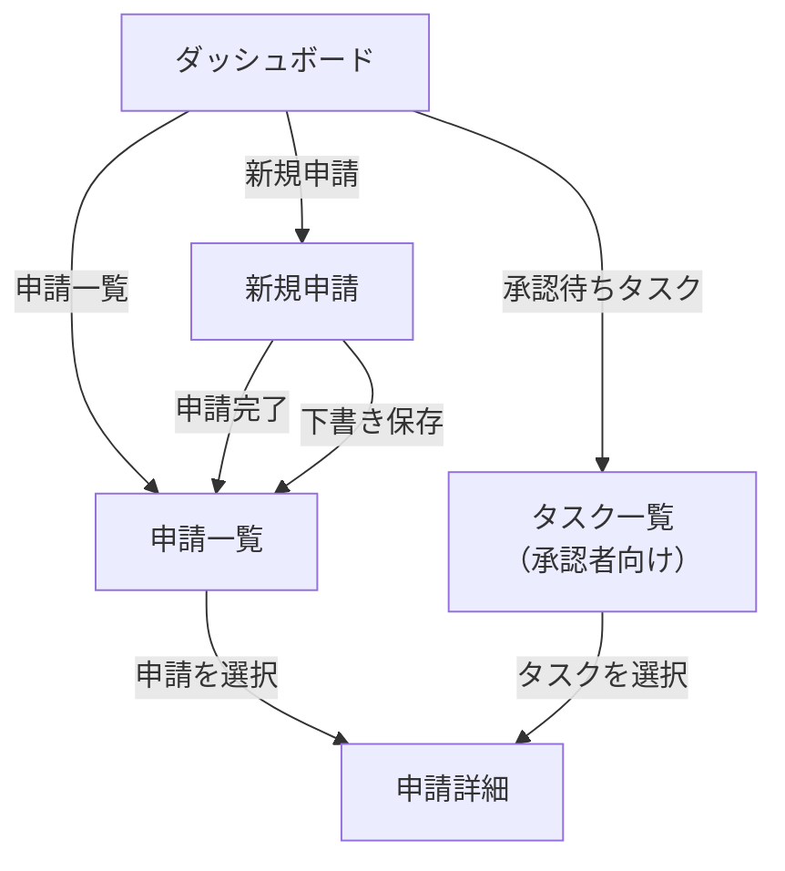
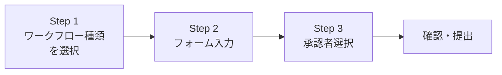
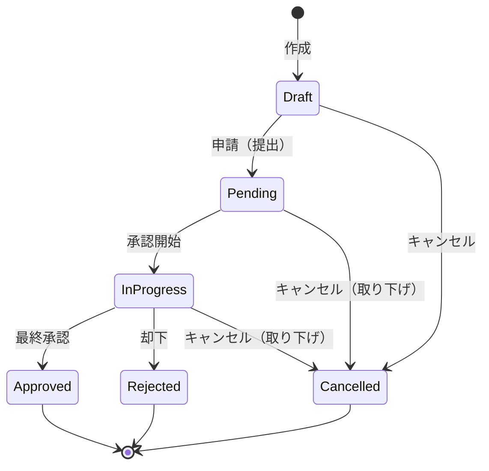
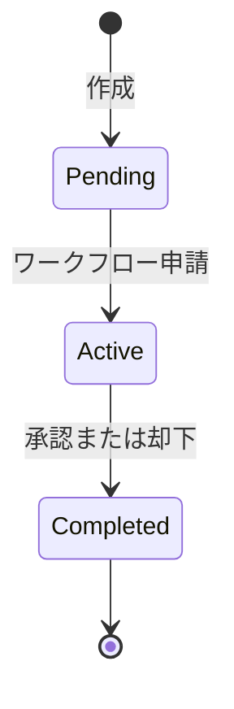

# ワークフロー管理 機能仕様書

## 1. 概要

ワークフロー管理は、RingiFlow の中核機能である。ユーザーは業務上の申請（経費精算、休暇申請、稟議など）をシステム上で作成・提出し、定められた承認フローに沿って処理を進める。

### 目的

- 申請者: 業務申請をオンラインで作成・提出し、進捗を確認できる
- 承認者: 自分に割り当てられた申請を承認・却下・差し戻しできる
- 管理者: ワークフローのテンプレートを定義・管理できる

### 対象ユーザー

| ロール | この機能での役割 |
|--------|---------------|
| 一般ユーザー（申請者） | 申請の作成・提出・取り下げ、進捗確認 |
| 一般ユーザー（承認者） | 承認・却下・差し戻し |
| テナント管理者 | ワークフロー定義の作成・管理 |

### 関連する機能要件

`[SECTION_ID: CORE-04]` 4.2 ワークフロー管理機能（WF-001〜WF-006, WF-101〜WF-106）

## 2. シナリオ

### シナリオ 1: 経費精算の申請（申請者: 田中さん）

田中さんは営業部の社員で、先週の出張の交通費を精算したい。

1. ダッシュボードの「新規申請」ボタンをクリックする
2. ワークフロー種類の一覧が表示される。「経費精算申請」を選択する
3. 申請フォームが表示される。タイトル「出張交通費（大阪→東京）」を入力し、金額（15,000円）、発生日、経費種別（交通費）、説明を入力する
4. 承認者として直属の上長・鈴木さんを検索・選択する
5. 内容を確認し、「申請する」ボタンをクリックする
6. 「申請が完了しました」というメッセージが表示される
7. 申請一覧で、自分の申請が「承認中」ステータスで表示されていることを確認する

### シナリオ 2: 申請の承認（承認者: 鈴木さん）

鈴木さんは田中さんの上長で、経費精算の承認権限を持っている。

1. ダッシュボードに「承認待ちタスク: 1件」と表示されている
2. タスク一覧を開くと、田中さんの「出張交通費（大阪→東京）」が表示される
3. 詳細を開くと、申請内容（金額、日付、説明）とフォームデータが確認できる
4. 内容に問題がないので、コメント欄に「確認しました」と入力し、「承認」ボタンをクリックする
5. ワークフローのステータスが「承認済み」に変わる

### シナリオ 3: 申請の却下と再申請（承認者: 鈴木さん、申請者: 田中さん）

1. 鈴木さんが田中さんの経費申請を確認したところ、領収書が添付されていない
2. コメント「領収書を添付してください」を入力し、「却下」ボタンをクリックする
3. 田中さんに却下通知が届く
4. 田中さんは却下された申請の詳細を確認し、却下理由を読む
5. 新しい申請を作成し、今度は領収書を添付して再申請する

### シナリオ 4: 下書き保存（申請者: 田中さん）

1. 田中さんは経費精算の申請フォームに入力を始めたが、領収書の金額を確認する必要がある
2. 途中まで入力した内容を「下書き保存」する
3. 翌日、申請一覧から「下書き」ステータスの申請を開き、入力を再開する
4. 金額を修正し、「申請する」ボタンで提出する

## 3. 画面・操作フロー

### 全体フロー

### 新規申請フォームの操作ステップ

1. ワークフロー種類の選択 — テナントで定義済みのワークフロー一覧から選択
2. フォーム入力 — 選択したワークフロー種類に応じた動的フォームに入力
3. 承認者選択 — ユーザー検索で承認者を指定
4. 確認・提出 — 内容を確認し、下書き保存または申請

## 4. 機能詳細

### 4.1 ワークフロー申請

#### 新規申請の作成

ユーザーは新規申請を作成できる。申請フォームはワークフロー定義（テンプレート）に基づいて動的に生成される。

入力項目:

| 項目 | 必須 | 制約 | 説明 |
|------|------|------|------|
| ワークフロー種類 | はい | テナントで定義済みの種類から選択 | 選択に応じてフォームが切り替わる |
| タイトル | はい | 1〜200 文字 | 申請の件名 |
| フォームフィールド | 定義による | ワークフロー定義で指定 | 後述「動的フォームフィールド」参照 |
| 承認者 | はい | テナント内のユーザーから選択 | 検索で絞り込み可能 |

#### 動的フォームフィールド

ワークフロー定義に基づき、以下のフィールドタイプが動的に表示される。

| フィールドタイプ | 表示 | バリデーション |
|----------------|------|--------------|
| テキスト（text） | テキスト入力欄 | 最小/最大文字数 |
| 複数行テキスト（textarea） | テキストエリア | 最大文字数 |
| 数値（number） | 数値入力欄 | 最小値/最大値 |
| 選択（select） | ドロップダウン | 選択肢から1つ |
| ラジオボタン（radio） | ラジオグループ | 選択肢から1つ |
| チェックボックス（checkbox） | チェックボックスグループ | 複数選択可 |
| 日付（date） | 日付ピッカー | 日付範囲 |
| 日時（datetime） | 日時ピッカー | 日時範囲 |
| ファイル（file） | ファイル選択 | ファイル形式、最大サイズ |

各フィールドの必須/任意はワークフロー定義で指定される。必須フィールドにはラベルに「*」マークが付く。

#### バリデーションとエラーメッセージ

バリデーションは申請ボタン押下時に実行される。エラーがある場合はフィールドの直下に赤字でメッセージが表示される。

| 状況 | エラーメッセージ |
|------|----------------|
| 必須フィールドが空 | 「必須項目です」 |
| テキストが最小文字数未満 | 「最低 N 文字必要です」 |
| テキストが最大文字数超過 | 「最大 N 文字までです」 |
| 数値が範囲外 | 「N 以上 M 以下で入力してください」 |
| ファイルサイズ超過 | 「ファイルサイズは N MB 以下にしてください」 |
| ファイル形式不正 | 「許可されたファイル形式: [形式一覧]」 |

注意: 下書き保存時は、タイトルのみ必須。フォームフィールドのバリデーションは申請時にのみ実行される。

### 4.2 申請一覧

自分が作成した申請の一覧を表示する。

表示項目:

| カラム | 説明 |
|--------|------|
| タイトル | 申請の件名（リンク: 詳細画面へ遷移） |
| ステータス | 現在の状態（色分けバッジで表示） |
| 申請日 | 申請（提出）した日時。下書きの場合は作成日 |

フィルタ:

| フィルタ | 選択肢 |
|---------|--------|
| ステータス | すべて / 下書き / 承認中 / 承認済み / 却下 / キャンセル |

#### ステータスバッジの表示

| ステータス | 日本語表示 | バッジの色 |
|-----------|-----------|----------|
| Draft | 下書き | グレー |
| Pending | 申請待ち | 黄色 |
| InProgress | 承認中 | 青 |
| Approved | 承認済み | 緑 |
| Rejected | 却下 | 赤 |
| Cancelled | キャンセル | グレー |

### 4.3 申請詳細

申請の詳細情報を表示する。

表示セクション:

1. 基本情報 — タイトル、ステータス、申請者、申請日、作成日、更新日
2. フォームデータ — 入力されたフォームの内容（フィールドラベルと値をペアで表示）
3. 承認ステップ — 承認者、承認/却下の結果、コメント（承認済みまたは却下の場合）

承認者向けアクション（自分がアクティブなステップの承認者の場合）:

| アクション | ボタン表示 | 説明 |
|-----------|----------|------|
| 承認 | 「承認」 | この申請を承認する |
| 却下 | 「却下」 | この申請を却下する |

承認・却下時にはコメント（任意、最大 1,000 文字）を入力できる。

### 4.4 下書き管理

下書きとして保存された申請は、後から編集・提出できる。

| 操作 | 説明 |
|------|------|
| 下書き保存 | 申請フォームの入力途中の内容を保存する |
| 下書きの編集 | 申請一覧から下書きを開き、入力を再開する |
| 下書きの申請 | 編集後に「申請する」で提出する |

### 4.5 承認・却下

承認者は、自分に割り当てられたアクティブなステップに対して承認または却下を行う。

前提条件:
- ワークフローのステータスが「承認中（InProgress）」である
- 承認ステップのステータスが「アクティブ（Active）」である
- 操作者がそのステップの承認者として割り当てられている

承認時の動作:
1. ステップが「完了」になる
2. MVP では1段階承認のため、ワークフロー全体が「承認済み」になる
3. 申請者に承認完了の通知が送られる

却下時の動作:
1. ステップが「完了」になる（判定: 却下）
2. ワークフロー全体が「却下」になる
3. 申請者に却下の通知が送られる（却下コメント付き）

#### 競合時の動作

複数の操作が同時に行われた場合（例: 申請者が取り下げ中に承認者が承認）、先に処理された操作が優先される。後発の操作には以下のエラーが表示される:

> このワークフローは既に更新されています。最新の状態を取得してください。

「再読み込み」ボタンで最新の状態を取得できる。

## 5. 状態遷移

### ワークフローインスタンスの状態遷移

| 遷移 | トリガー | 条件 |
|------|---------|------|
| → Draft | 新規作成 | — |
| Draft → Pending | 申請者が「申請する」をクリック | 全バリデーション通過、承認者が選択済み |
| Pending → InProgress | 承認者が承認プロセスを開始 | — |
| InProgress → Approved | 承認者が「承認」をクリック | 全ステップが承認完了 |
| InProgress → Rejected | 承認者が「却下」をクリック | — |
| Draft → Cancelled | 申請者が下書きを削除 | — |
| Pending → Cancelled | 申請者が申請を取り下げ | — |
| InProgress → Cancelled | 申請者が申請を取り下げ | — |

### 承認ステップの状態遷移

| ステップステータス | 説明 |
|------------------|------|
| Pending | 作成済みだがまだアクティブでない |
| Active | 承認者がアクションを取れる状態 |
| Completed | 承認または却下が完了 |

## 6. 権限

### ロール別アクセス制御

| 操作 | 一般ユーザー（申請者） | 一般ユーザー（承認者） | テナント管理者 |
|------|:---:|:---:|:---:|
| 申請の作成 | ○ | ○ | ○ |
| 自分の申請一覧の閲覧 | ○ | ○ | ○ |
| 自分の申請の詳細閲覧 | ○ | ○ | ○ |
| 下書きの編集・削除 | ○（自分のもの） | ○（自分のもの） | ○（自分のもの） |
| 申請の取り下げ | ○（自分のもの） | ○（自分のもの） | ○（自分のもの） |
| 承認・却下 | — | ○（割り当てられたもの） | ○ |
| 全申請の閲覧 | — | — | ○ |
| ワークフロー定義の管理 | — | — | ○ |

補足:
- 「承認者」は固有のロールではなく、ワークフローステップに割り当てられたユーザーを指す
- テナント管理者はテナント内の全申請を閲覧できる
- 他テナントのデータには一切アクセスできない（テナント分離）

## 7. 非ゴール（対象外）

以下の機能は本仕様書の対象外とする。

| 機能 | 理由 | 関連機能 ID |
|------|------|-----------|
| 差し戻し（前ステップへの戻し） | 将来対応。MVP では却下→再申請で代替 | WF-103 |
| 代理承認 | 将来対応。並行更新の学習テーマとして別途実装 | WF-104 |
| 一括承認 | 将来対応。並行更新の学習テーマとして別途実装 | WF-105 |
| 多段階承認（複数の承認ステップ） | MVP では1段階承認。将来拡張予定 | WF-002 |
| 条件分岐（金額による承認ルート変更等） | 将来対応 | WF-003 |
| SLA 設定（期限とエスカレーション） | 将来対応 | WF-005 |
| ワークフローデザイナー（GUI） | 将来対応。管理者向け画面 | WF-001 |
| 通知機能の詳細 | 別途「通知機能」仕様書で定義 | NOTIFY-001〜006 |
| 保留（OnHold）ステータス | MVP 対象外。コア要件で定義されているが未実装 | — |

注: コア要件の状態遷移図では `Completed` が使われているが、実装では承認完了を `Approved` として命名している。これは意図的な設計判断であり、承認結果を明確に区別するためである。

## 8. 未解決事項

| # | 事項 | 影響範囲 | ステータス |
|---|------|---------|-----------|
| 1 | 下書きの有効期限（自動削除するか） | 下書き管理 | 未決定 |
| 2 | 取り下げ後の再申請フロー（コピー機能の有無） | 申請フロー | 未決定 |
| 3 | 添付ファイルのプレビュー対応範囲 | 申請詳細 | 未決定 |

## 9. 関連ドキュメント

| ドキュメント | 参照先 |
|-------------|--------|
| コア要件（機能要件） | [01_コア要件.md](../01_コア要件.md) CORE-04 4.2 |
| ワークフロー定義スキーマ | [01_コア要件.md](../01_コア要件.md) CORE-11 |
| ワークフロー申請フォーム UI 設計 | [03_詳細設計書/10_ワークフロー申請フォームUI設計.md](../../03_詳細設計書/10_ワークフロー申請フォームUI設計.md) |
| ワークフロー承認却下機能設計 | [03_詳細設計書/11_ワークフロー承認却下機能設計.md](../../03_詳細設計書/11_ワークフロー承認却下機能設計.md) |
| 用語集 | [02_用語集.md](../02_用語集.md) |

---

## 変更履歴

| 日付 | 変更内容 |
|------|---------|
| 2026-02-10 | 初版作成 |
