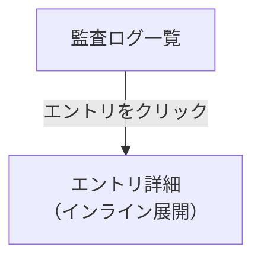

# 監査ログ 機能仕様書

## 1. 概要

監査ログは、テナント内の操作履歴を記録・閲覧するための機能である。「誰が・いつ・何をしたか」を追跡可能にし、コンプライアンスとセキュリティの基盤を提供する。

### 目的

- テナント管理者: テナント内の操作履歴を検索・閲覧し、不正や異常を検出する
- システム: ユーザーの操作を自動的に記録し、説明責任を担保する

### 対象ユーザー

| ロール | この機能での役割 |
|--------|---------------|
| テナント管理者 | 監査ログの閲覧・検索 |
| システム（自動） | 操作の記録 |

### 関連する機能要件

- `[RPT-004]` 監査ログ閲覧 — 監査ログの検索・閲覧

## 2. シナリオ

### シナリオ 1: 特定ユーザーの操作履歴を確認する（テナント管理者: 佐藤さん）

佐藤さんは、退職予定の山田さんが最近どのような操作をしたか確認したい。

1. サイドバーの「監査ログ」をクリックする
2. 監査ログ一覧画面が表示される。直近の操作が新しい順に表示される
3. 「ユーザー」フィルタで「山田太郎」を選択する
4. 山田さんの操作履歴が絞り込まれる
5. 各行にはタイムスタンプ、操作内容、対象リソース、結果が表示される
6. 気になるエントリをクリックすると、詳細（リクエスト元 IP、関連リソース ID 等）が確認できる

### シナリオ 2: 権限変更の監査を行う（テナント管理者: 佐藤さん）

佐藤さんは、先月の権限変更がすべて正当であったか監査したい。

1. 監査ログ一覧画面を開く
2. 「アクション」フィルタで「ロール割り当て」「ロール変更」を選択する
3. 「期間」フィルタで先月（2026年1月1日〜2026年1月31日）を指定する
4. 期間内の権限変更操作がすべて表示される
5. 各エントリには、変更を実施したユーザーと変更内容が記録されている

## 3. 画面・操作フロー

### 監査ログフロー

監査ログは一覧画面のみで完結する。詳細はインライン展開（アコーディオン）で表示し、画面遷移なしに確認できる。

## 4. 機能詳細

### 4.1 記録対象の操作

以下の操作が自動的に監査ログに記録される。

| カテゴリ | 操作 | アクション名 |
|---------|------|-------------|
| 認証 | ログイン成功 | `auth.login` |
| 認証 | ログイン失敗 | `auth.login_failed` |
| 認証 | ログアウト | `auth.logout` |
| ユーザー管理 | ユーザー作成 | `user.create` |
| ユーザー管理 | ユーザー編集 | `user.update` |
| ユーザー管理 | ユーザー無効化 | `user.deactivate` |
| ユーザー管理 | ユーザー有効化 | `user.activate` |
| ロール管理 | ロール作成 | `role.create` |
| ロール管理 | ロール編集 | `role.update` |
| ロール管理 | ロール削除 | `role.delete` |
| ロール管理 | ロール割り当て変更 | `role.assign` |
| ワークフロー | 申請作成 | `workflow.create` |
| ワークフロー | 申請提出 | `workflow.submit` |
| ワークフロー | 承認 | `workflow.approve` |
| ワークフロー | 却下 | `workflow.reject` |
| ワークフロー | 取り下げ | `workflow.cancel` |

### 4.2 記録内容

各監査ログエントリには以下の情報が含まれる（運用設計 8.5 の MUST 要件に準拠）。

| フィールド | 型 | 説明 | 例 |
|-----------|-----|------|-----|
| id | UUID | エントリの一意識別子 | `550e8400-...` |
| tenant_id | UUID | テナント ID | `660e8400-...` |
| actor_id | UUID | 操作を実行したユーザー ID | `770e8400-...` |
| actor_name | String | 操作者の表示名（記録時点のスナップショット） | `佐藤花子` |
| action | String | 操作のアクション名 | `user.create` |
| resource_type | String | 対象リソースの種類 | `user` |
| resource_id | UUID | 対象リソースの ID | `880e8400-...` |
| result | String | 操作の結果 | `success` / `failure` |
| detail | JSON | 操作の詳細（変更前後の値等） | `{"name": "山田太郎"}` |
| correlation_id | UUID | リクエストの追跡 ID | `990e8400-...` |
| source_ip | String | リクエスト元 IP アドレス（取得可能な場合） | `192.168.1.1` |
| timestamp | DateTime | 操作日時（UTC） | `2026-01-15T09:30:00Z` |

注:
- `actor_name` は記録時点のスナップショット。ユーザー名が後で変更されても、ログの表示名は変わらない
- `detail` の内容はアクションにより異なる。パスワードハッシュ等のセンシティブ情報は含めない

### 4.3 監査ログ一覧

テナント内の監査ログを新しい順に表示する。

表示項目:

| カラム | 説明 |
|--------|------|
| 日時 | 操作日時（ローカルタイムゾーンで表示） |
| ユーザー | 操作を実行したユーザー名 |
| アクション | 操作の種類（日本語ラベルで表示） |
| 対象 | 操作対象のリソース |
| 結果 | 成功 / 失敗（色分けバッジ） |

フィルタ:

| フィルタ | 選択肢 |
|---------|--------|
| 期間 | 日付範囲（開始日〜終了日） |
| ユーザー | テナント内ユーザーから選択 |
| アクション | 操作種類から選択（複数選択可） |
| 結果 | すべて / 成功 / 失敗 |

#### アクション名の日本語ラベル

| アクション | 日本語表示 |
|-----------|-----------|
| `auth.login` | ログイン |
| `auth.login_failed` | ログイン失敗 |
| `auth.logout` | ログアウト |
| `user.create` | ユーザー作成 |
| `user.update` | ユーザー編集 |
| `user.deactivate` | ユーザー無効化 |
| `user.activate` | ユーザー有効化 |
| `role.create` | ロール作成 |
| `role.update` | ロール編集 |
| `role.delete` | ロール削除 |
| `role.assign` | ロール割り当て |
| `workflow.create` | 申請作成 |
| `workflow.submit` | 申請提出 |
| `workflow.approve` | 承認 |
| `workflow.reject` | 却下 |
| `workflow.cancel` | 取り下げ |

#### ページネーション

監査ログはカーソルベースのページネーションで表示する。タイムスタンプをカーソルとし、「次のページ」「前のページ」で移動する。1 ページあたり 50 件表示。

カーソルベースを採用する理由:
- DynamoDB のパーティションキー（tenant_id）+ ソートキー（timestamp）のアクセスパターンと整合する
- オフセットベースと異なり、データ追加時にページのずれが生じない

### 4.4 エントリ詳細（インライン展開）

一覧の行をクリックすると、インラインで詳細情報が展開される。

表示項目:

| 項目 | 説明 |
|------|------|
| 操作詳細 | detail フィールドの内容（変更前後の値等） |
| リソース ID | 操作対象の ID |
| リクエスト元 IP | source_ip（取得可能な場合） |
| 追跡 ID | correlation_id（サポート問い合わせ時に利用） |

## 5. データストア設計

### 格納先: DynamoDB

監査ログは DynamoDB に格納する。基本設計書（インフラ・DB 設計 6.3.2, 7.1.2）の設計に準拠する。

| 項目 | 値 |
|------|-----|
| テーブル名 | `audit_logs` |
| パーティションキー | `tenant_id` (UUID) |
| ソートキー | `timestamp` (ISO 8601 文字列) |
| TTL | プランに応じて設定（30日〜3年） |

DynamoDB を選択する理由:
- 高頻度の追記に最適化されている
- 追記専用の特性が改ざん防止要件（運用設計 8.5）と整合する
- パーティションキーによるテナント分離が自然
- TTL による自動クリーンアップでデータライフサイクル管理が容易
- テナント退会時のデータ削除設計が DynamoDB 前提で策定済み

### アクセスパターン

| パターン | クエリ |
|---------|-------|
| テナントの直近のログ取得 | PK=tenant_id, SK DESC, LIMIT 50 |
| テナントの期間指定ログ取得 | PK=tenant_id, SK BETWEEN start AND end |
| 特定ユーザーの操作検索 | PK=tenant_id, Filter: actor_id = X |

注: actor_id や action による検索は DynamoDB のフィルタ式で実現する。検索頻度が高い場合は GSI（Global Secondary Index）の追加を検討する。

## 6. 権限

### ロール別アクセス制御

| 操作 | テナント管理者 | 一般ユーザー |
|------|:---:|:---:|
| 監査ログの閲覧 | ○ | — |
| 監査ログの検索 | ○ | — |

補足:
- 監査ログの閲覧権限はテナント管理者に限定する（最小権限の原則）
- 監査ログは閲覧のみ。編集・削除の操作は提供しない（追記専用）
- 他テナントの監査ログには一切アクセスできない

## 7. 非ゴール（対象外）

| 機能 | 理由 | 関連要件 |
|------|------|---------|
| 監査ログのエクスポート（CSV/JSON） | 将来対応。データポータビリティ要件で対応 | — |
| アラート通知（ログイン失敗急増、権限変更等） | SHOULD 要件。Phase 2-5（通知基盤）以降で対応 | 運用設計 8.5 |
| S3 へのアーカイブ | バッチ処理（BATCH-005）として別途対応 | — |
| Athena による横断分析 | S3 アーカイブ後に対応 | — |
| 監査ログの保持期間設定 UI | 将来対応 | — |
| GSI の追加（actor_id, action 等） | 検索頻度を見て判断 | — |

## 8. 未解決事項

| # | 事項 | 影響範囲 | ステータス |
|---|------|---------|-----------|
| 1 | ログイン失敗のログ記録タイミング（BFF or Auth Service） | 記録基盤 | 未決定 |
| 2 | DynamoDB Local の開発環境セットアップ方法 | 開発環境 | 未決定 |
| 3 | 同一テナント・同一タイムスタンプのエントリの一意性保証 | データモデル | 未決定 |

## 9. 関連ドキュメント

| ドキュメント | 参照先 |
|-------------|--------|
| コア要件（レポート・分析機能） | [01_コア要件.md](../01_コア要件.md) RPT-004 |
| 運用設計（監査ログ要件） | [04_運用設計.md](../../02_基本設計書/04_運用設計.md) 8.5 |
| インフラ・DB 設計（DynamoDB） | [03_インフラとDB設計.md](../../02_基本設計書/03_インフラとDB設計.md) 6.3.2, 7.1.2 |
| テナント退会時データ削除設計 | [06_テナント退会時データ削除設計.md](../../03_詳細設計書/06_テナント退会時データ削除設計.md) |
| 非機能要件（SLI: 取り込み遅延 1 分以内） | [01_コア要件.md](../01_コア要件.md) 5.9 |
| 用語集 | [02_用語集.md](../02_用語集.md) |

---

## 変更履歴

| 日付 | 変更内容 |
|------|---------|
| 2026-02-11 | 初版作成 |
