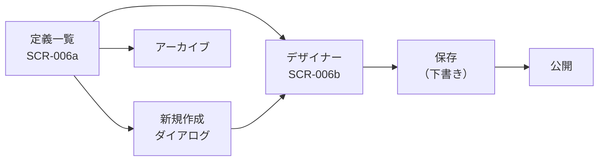
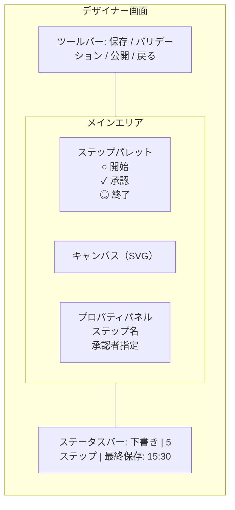
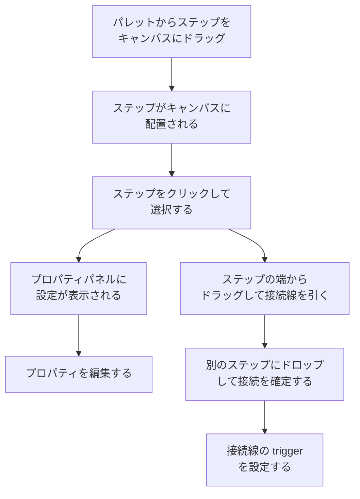
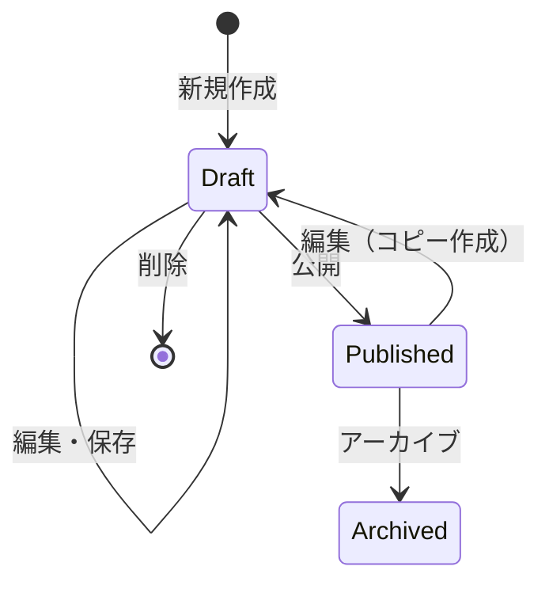

# ワークフローデザイナー 機能仕様書

> **実装状態**: 未実装（Phase 2-4 で実装予定）

## 1. 概要

ワークフローデザイナーは、テナント管理者がワークフロー定義を GUI で作成・編集する機能である。キャンバス上にステップを配置し、接続線で遷移を定義することで、コードを書かずに承認フローを設計できる。

### 目的

- テナント管理者が GUI でワークフロー定義を作成・編集・公開できる
- フロー定義のバリデーションにより、不正な定義の公開を防止する
- 定義のライフサイクル（下書き → 公開 → アーカイブ）を管理できる

### 対象ユーザー

| ロール | この機能での役割 |
|--------|---------------|
| テナント管理者 | ワークフロー定義の作成・編集・公開・アーカイブ |

一般ユーザーはデザイナー画面にアクセスできない。一般ユーザーが関わるのは、公開された定義に基づいて申請する場面であり、それは[ワークフロー管理 機能仕様書](01_ワークフロー管理.md)の範囲である。

### 関連する機能要件

`[SECTION_ID: CORE-04]` 4.2 ワークフロー管理機能（WF-001）
`[SECTION_ID: CORE-04]` 6.3 ワークフローデザイナー要件（WFD-001〜WFD-005）
`[SECTION_ID: CORE-11]` ワークフロー定義スキーマ

## 2. シナリオ

### シナリオ 1: 新しいワークフロー定義の作成（テナント管理者: 佐藤さん）

佐藤さんは経理部の管理者で、新しい経費精算ワークフローを作成したい。上長承認 → 経理承認の 2 段階承認フローを定義する。

1. ダッシュボードのサイドメニューから「ワークフロー定義」を開く
2. 定義一覧画面が表示される。「新規作成」ボタンをクリックする
3. ワークフロー定義名（「経費精算申請」）と説明を入力するダイアログが表示される
4. 入力して「作成」をクリックすると、デザイナー画面が開く
5. 画面左のステップパレットから「開始」ステップをキャンバスにドラッグ&ドロップする
6. 同様に「承認」ステップを 2 つ配置する
7. 「終了」ステップを 2 つ配置する（承認完了用と却下用）
8. 1 つ目の承認ステップを選択し、右のプロパティパネルでステップ名を「上長承認」に変更する
9. 2 つ目の承認ステップのステップ名を「経理承認」に変更する
10. 開始ステップから上長承認ステップへ接続線を引く
11. 上長承認ステップから経理承認ステップへ「承認時」の接続線を引く
12. 上長承認ステップから却下用終了ステップへ「却下時」の接続線を引く
13. 経理承認ステップから承認完了用終了ステップへ「承認時」の接続線を引く
14. 経理承認ステップから却下用終了ステップへ「却下時」の接続線を引く
15. ツールバーの「バリデーション」ボタンをクリックする。「フロー定義は有効です」と表示される
16. 「保存」ボタンをクリックする。定義が下書きとして保存される
17. 「公開」ボタンをクリックし、確認ダイアログで「公開する」を選択する
18. 定義一覧に戻ると、「経費精算申請」が「公開済み」ステータスで表示される

### シナリオ 2: 既存ワークフロー定義の編集（テナント管理者: 佐藤さん）

佐藤さんは既に公開されている「経費精算申請」ワークフローに、3 段階目の承認ステップを追加したい。

1. 定義一覧画面で「経費精算申請」の「編集」ボタンをクリックする
2. 公開済みの定義は直接編集できないため、下書きコピーが作成される旨のダイアログが表示される
3. 「コピーを作成」をクリックすると、デザイナー画面に下書きコピーが表示される
4. 新しい承認ステップを配置し、接続線を調整する
5. バリデーション → 保存 → 公開の手順で新しいバージョンとして公開する
6. 旧バージョンは自動的にアーカイブされる

### シナリオ 3: バリデーションエラーの修正（テナント管理者: 佐藤さん）

佐藤さんがワークフロー定義を作成中に、不完全な状態で公開しようとする。

1. 承認ステップを配置したが、終了ステップへの接続線を引き忘れた状態
2. 「公開」ボタンをクリックする
3. バリデーションが自動実行され、エラーが表示される:
   - 「承認ステップ「上長承認」に却下時の遷移先が定義されていません」
4. エラー箇所（上長承認ステップ）がキャンバス上でハイライトされる
5. 佐藤さんが不足している接続線を追加する
6. 再度「公開」をクリックすると、バリデーションが通り公開される

### シナリオ 4: ワークフロー定義のアーカイブ（テナント管理者: 佐藤さん）

使わなくなったワークフロー定義を非表示にする。

1. 定義一覧画面で「旧申請フロー」の「アーカイブ」ボタンをクリックする
2. 確認ダイアログが表示される:「この定義をアーカイブしますか？アーカイブ後、新規申請に使用できなくなります。実行中の申請には影響しません」
3. 「アーカイブする」をクリックする
4. 定義一覧から非表示になる（フィルタで「アーカイブ済み」を選択すると表示できる）

## 3. 画面・操作フロー

### 全体フロー

### デザイナー画面のレイアウト

| エリア | 位置 | 内容 |
|--------|------|------|
| ツールバー | 上部全幅 | 保存、バリデーション、公開、戻るボタン |
| ステップパレット | 左サイドバー | ドラッグ元（開始・承認・終了ステップ） |
| キャンバス（SVG） | 中央メイン | ワークフローの描画・編集エリア |
| プロパティパネル | 右サイドバー | 選択ステップの設定（名前、承認者指定等） |
| ステータスバー | 下部全幅 | 定義ステータス、ステップ数、最終保存時刻 |

### キャンバス操作フロー

## 4. 機能詳細

### 4.1 定義一覧・管理

#### 一覧表示項目

| 項目 | 説明 |
|------|------|
| 定義名 | ワークフロー定義の名前 |
| 説明 | 定義の説明文（省略表示） |
| ステータス | 下書き / 公開済み / アーカイブ済み |
| バージョン | 現在のバージョン番号 |
| 作成者 | 定義を作成したユーザー名 |
| 更新日時 | 最終更新日時 |

#### フィルタ

| フィルタ | 選択肢 | デフォルト |
|---------|--------|-----------|
| ステータス | すべて / 下書き / 公開済み / アーカイブ済み | 下書き + 公開済み |

#### 操作

| 操作 | 対象ステータス | 説明 |
|------|--------------|------|
| 新規作成 | — | 新しい定義を下書きとして作成 |
| 編集 | 下書き | デザイナー画面を開く |
| 編集（コピー） | 公開済み | 下書きコピーを作成してデザイナー画面を開く |
| 公開 | 下書き | 定義を公開する（バリデーション必須） |
| アーカイブ | 公開済み | 新規申請に使用できなくする |
| 削除 | 下書き | 下書き定義を完全に削除する |

### 4.2 キャンバス（WFD-001）

テナント管理者がステップを配置・移動する SVG ベースの領域。

| 操作 | 説明 |
|------|------|
| ドラッグ&ドロップ（配置） | パレットからステップをキャンバスにドラッグして配置する |
| ドラッグ（移動） | キャンバス上のステップをドラッグして位置を変更する |
| クリック（選択） | ステップをクリックして選択する。プロパティパネルに設定が表示される |
| Delete キー（削除） | 選択中のステップを削除する。接続線も自動削除される |
| キャンバスクリック（選択解除） | キャンバスの空白領域をクリックして選択を解除する |

ステップはグリッドにスナップして配置される（整列のため）。

### 4.3 ステップパレット（WFD-002）

Phase 2-4 で使用可能なステップ種別:

| ステップ種別 | アイコン | 説明 | 配置制約 |
|-------------|---------|------|---------|
| 開始 | ○ | フローの開始点 | 1 つのみ |
| 承認 | ✓ | 承認ステップ（順次承認） | 複数配置可能 |
| 終了 | ◎ | フローの終了点 | 複数配置可能（承認完了、却下等） |

パレットからキャンバスへドラッグ&ドロップでステップを追加する。

### 4.4 接続線（WFD-003）

ステップ間の遷移を表現する矢印線。

#### 接続の作成

ステップの接続ポイント（右端または下端）からドラッグを開始し、接続先ステップにドロップして遷移を作成する。

#### trigger の設定

承認ステップからの遷移には trigger を設定する:

| trigger | 説明 | 線の表示 |
|---------|------|---------|
| approve | 承認時の遷移先 | 実線（緑矢印） |
| reject | 却下時の遷移先 | 破線（赤矢印） |
| （なし） | 無条件遷移（開始→承認、承認→終了 等） | 実線（グレー矢印） |

開始ステップからの遷移は trigger なし（無条件遷移）。

#### 接続の削除

接続線をクリックして選択し、Delete キーで削除する。

### 4.5 プロパティパネル（WFD-004）

選択中のステップの設定を編集するパネル。ステップ種別によって表示項目が異なる。

#### 開始ステップのプロパティ

| 項目 | 説明 | 入力 |
|------|------|------|
| ステップ名 | 表示名（デフォルト: 「開始」） | テキスト（任意） |

#### 承認ステップのプロパティ

| 項目 | 説明 | 入力 |
|------|------|------|
| ステップ名 | 表示名（例: 「上長承認」） | テキスト（必須） |
| 承認者指定方式 | 承認者の決定方法 | 固定: 「申請時にユーザーを選択」 |

Phase 2-4 では承認者指定方式は「申請時にユーザーを選択」（`assignee.type: "user"`）のみ。ロール指定（`role`）、上長指定（`manager`）等は Phase 3 で追加する。

#### 終了ステップのプロパティ

| 項目 | 説明 | 入力 |
|------|------|------|
| ステップ名 | 表示名（例: 「承認完了」「却下」） | テキスト（必須） |
| 終了ステータス | ワークフローの最終ステータス | 選択: `approved` / `rejected` |

### 4.6 バリデーション（WFD-005）

フロー定義の整合性チェック。公開前に自動実行され、手動でも実行できる。

#### バリデーションルール

| # | ルール | エラーメッセージ |
|---|--------|---------------|
| 1 | 開始ステップが 1 つ存在する | 「開始ステップを配置してください」 |
| 2 | 終了ステップが 1 つ以上存在する | 「終了ステップを配置してください」 |
| 3 | 承認ステップが 1 つ以上存在する | 「承認ステップを配置してください」 |
| 4 | 開始ステップからの遷移が定義されている | 「開始ステップの遷移先を設定してください」 |
| 5 | すべての承認ステップに approve 遷移がある | 「承認ステップ「{name}」に承認時の遷移先が定義されていません」 |
| 6 | すべての承認ステップに reject 遷移がある | 「承認ステップ「{name}」に却下時の遷移先が定義されていません」 |
| 7 | すべてのステップが遷移で到達可能（孤立ステップなし） | 「ステップ「{name}」に到達する遷移がありません」 |
| 8 | 循環参照がない | 「フローに循環が検出されました」 |
| 9 | 終了ステップにステータスが設定されている | 「終了ステップ「{name}」のステータスを設定してください」 |
| 10 | 承認ステップに名前が設定されている | 「承認ステップの名前を入力してください」 |

#### エラー表示

バリデーションエラーが検出された場合:
- エラーメッセージの一覧をキャンバス下部に表示する
- エラーに関連するステップをキャンバス上でハイライト（赤枠）する
- エラーメッセージをクリックすると、該当ステップにフォーカスする

### 4.7 フォーム定義

ワークフロー定義には、申請時に表示するフォームフィールドの定義を含む。デザイナー画面のプロパティパネルで、定義全体のフォームフィールドを編集できる。

#### Phase 2-4 で対応するフィールド型

| フィールド型 | 説明 | 設定項目 |
|-------------|------|---------|
| text | テキスト入力 | label, required, maxLength |
| textarea | 複数行テキスト | label, required, maxLength |
| number | 数値入力 | label, required, min, max |
| select | 選択肢 | label, required, options |
| date | 日付 | label, required |

#### フォームエディタ

定義全体に紐づくフォームフィールドの一覧を編集する。

| 操作 | 説明 |
|------|------|
| フィールド追加 | フィールド型を選択して追加する |
| フィールド編集 | ラベル、必須/任意、制約値を設定する |
| フィールド並べ替え | ドラッグで表示順を変更する |
| フィールド削除 | フィールドを削除する |

## 5. 状態遷移

### ワークフロー定義のライフサイクル

| ステータス | 説明 | 許可される操作 |
|-----------|------|--------------|
| Draft（下書き） | 編集中の定義。申請には使用できない | 編集、保存、公開、削除 |
| Published（公開済み） | 利用可能な定義。新規申請で選択できる | 編集（コピー）、アーカイブ |
| Archived（アーカイブ済み） | 非表示の定義。新規申請に使用できない。実行中の申請には影響しない | — |

### 公開済み定義の編集に関する注意

公開済み定義を「編集」すると、新しい下書きコピーが作成される。元の公開済み定義はそのまま残り、実行中の申請に影響しない。コピーを公開すると、元の定義は自動的にアーカイブされる。

この振る舞いにより、定義のバージョニングが暗黙的に実現される。明示的なバージョン管理 UI（WFD-007）は Phase 4 で対応する。

## 6. 権限

| 操作 | テナント管理者 | 一般ユーザー |
|------|:------------:|:----------:|
| 定義一覧の閲覧 | ✓ | ✗ |
| 定義の作成 | ✓ | ✗ |
| 定義の編集 | ✓ | ✗ |
| 定義の公開 | ✓ | ✗ |
| 定義のアーカイブ | ✓ | ✗ |
| 定義の削除（下書き） | ✓ | ✗ |

デザイナー画面（SCR-006）は管理者メニューに属し、一般ユーザーにはメニュー自体が表示されない。

## 7. 非ゴール（対象外）

| 機能 | 理由 | 関連機能ID |
|------|------|-----------|
| 条件分岐ステップ | Phase 3 で実装予定 | WF-003 |
| 並列承認ステップ | Phase 3 で実装予定 | WF-002（並列） |
| 通知ステップ | Phase 2-5 / Phase 3 で実装予定 | — |
| 待機・スクリプト・外部連携ステップ | Phase 3 以降で実装予定 | — |
| プレビュー機能 | 推奨機能として将来検討 | WFD-006 |
| バージョン管理 UI | Phase 4 で実装予定 | WFD-007 |
| インポート/エクスポート | 推奨機能として将来検討 | WFD-008 |
| ロール指定（`role`）による承認者指定 | Phase 3 で実装予定 | — |
| 上長指定（`manager`）による承認者指定 | Phase 3 で実装予定 | — |
| ファイル型フォームフィールド | Phase 2-5（S3 連携）で実装予定 | — |
| SLA 設定 | Phase 3 で実装予定 | WF-005 |

## 8. 未解決事項

| # | 事項 | 影響範囲 | ステータス |
|---|------|---------|-----------|
| 1 | キャンバスのパン（スクロール）・ズーム操作の必要性 | UX | Phase 2-4 スコープでは不要と判断（ステップ数が少ないため）。ステップ数増加時（Phase 3）に再検討 |
| 2 | 定義の複製（テンプレートとしてコピー）機能 | 利便性 | Phase 2-4 では対象外。需要があれば後続で対応 |
| 3 | Undo/Redo 操作 | UX | Phase 2-4 では対象外。需要があれば後続で対応 |

## 9. 関連ドキュメント

| ドキュメント | 参照先 |
|-------------|--------|
| コア要件（ワークフロー定義スキーマ） | `docs/01_要件定義書/01_コア要件.md` CORE-11 |
| コア要件（デザイナー要件） | `docs/01_要件定義書/01_コア要件.md` 6.3 節 |
| ワークフロー管理 機能仕様書 | `docs/01_要件定義書/機能仕様書/01_ワークフロー管理.md` |
| 技術選定 ADR | `docs/05_ADR/053_ワークフローデザイナー技術選定.md` |
| 詳細設計書 | `docs/03_詳細設計書/15_ワークフローデザイナー設計.md` |
| 実装ロードマップ（Phase 2-4） | `docs/03_詳細設計書/00_実装ロードマップ.md` |
| デザインガイドライン | `docs/03_詳細設計書/13_デザインガイドライン.md` |

---

## 変更履歴

| 日付 | 変更内容 |
|------|---------|
| 2026-02-20 | 初版作成（#722） |
