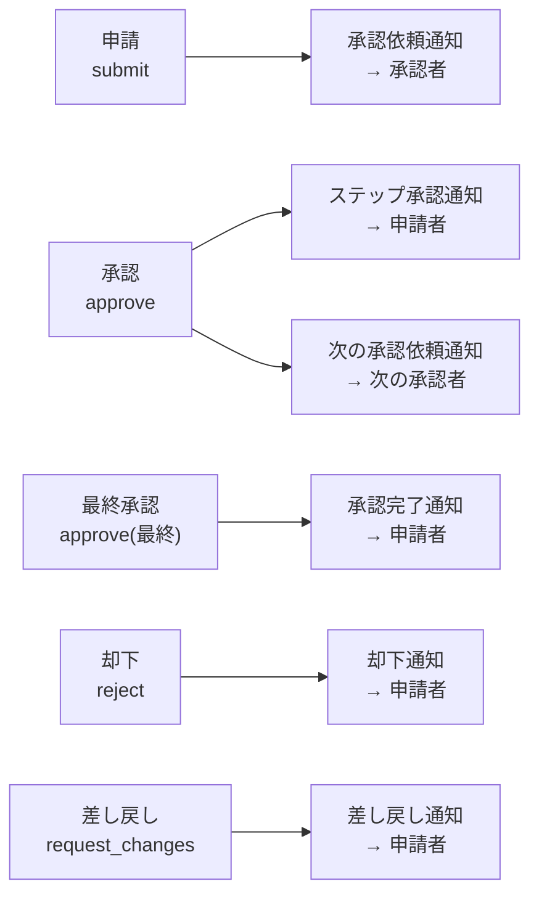
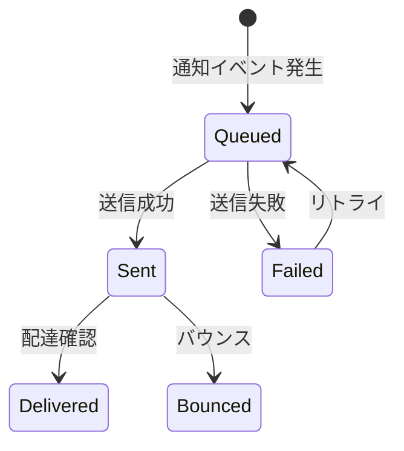

# 通知機能 機能仕様書

> **実装状態**: 未実装（Phase 2-5 で実装予定）

## 1. 概要

通知機能は、ワークフローの進行状況をメールで関係者に通知し、承認プロセスの迅速化を支援する機能である。承認依頼、承認完了、却下、差し戻しといったイベントの発生時に、対象ユーザーへ自動的にメール通知を送信する。

### 目的

- ワークフローの進行状況を関係者にタイムリーに伝える
- 承認者が承認依頼を見逃すことを防ぎ、承認プロセスの滞留を削減する
- 申請者が申請の結果を迅速に把握できるようにする

### 対象ユーザー

| ロール | この機能での役割 |
|--------|---------------|
| 申請者 | 承認完了・却下・差し戻し通知の受信 |
| 承認者 | 承認依頼通知の受信 |

Phase 2-5 では通知設定画面は提供しない。通知はシステムが自動送信し、ユーザーが通知の受信/停止を制御する機能は Phase 3（NOTIFY-006）で対応する。

### 関連する機能要件

`[SECTION_ID: CORE-04]` 4.5 通知機能（NOTIFY-001）
`[SECTION_ID: CORE-04]` 4.2 ワークフロー管理機能（WF-101〜WF-106）

## 2. シナリオ

### シナリオ 1: 承認依頼通知（承認者: 鈴木さん）

田中さんが経費精算ワークフローを申請した。鈴木さんが最初の承認者として指定されている。

1. 田中さんが「経費精算申請」ワークフローを申請する
2. 鈴木さんのメールアドレスに承認依頼通知が届く
3. メールの件名は「[RingiFlow] 承認依頼: 経費精算申請 WF-0042」
4. メール本文には以下が含まれる:
   - ワークフロータイトル（「経費精算申請」）
   - 表示用 ID（WF-0042）
   - 申請者名（田中太郎）
   - 承認ステップ名（「上長承認」）
   - ワークフロー詳細ページへのリンク
5. 鈴木さんはメールのリンクをクリックして RingiFlow にアクセスし、承認操作を行う

### シナリオ 2: 承認完了通知（申請者: 田中さん）

田中さんの経費精算申請が全ステップの承認を完了した。

1. 最終承認者が承認操作を行う
2. ワークフローのステータスが「承認完了」に変わる
3. 田中さんのメールアドレスに承認完了通知が届く
4. メールの件名は「[RingiFlow] 承認完了: 経費精算申請 WF-0042」
5. メール本文にはワークフロータイトル、表示用 ID、詳細ページへのリンクが含まれる

### シナリオ 3: 却下通知（申請者: 田中さん）

田中さんの経費精算申請が承認者によって却下された。

1. 鈴木さんがワークフローを却下する（コメント: 「領収書が添付されていません」）
2. 田中さんのメールアドレスに却下通知が届く
3. メールの件名は「[RingiFlow] 却下: 経費精算申請 WF-0042」
4. メール本文には却下コメント（「領収書が添付されていません」）とワークフロー詳細ページへのリンクが含まれる
5. 田中さんはコメントを確認し、必要に応じて修正・再申請を行う

### シナリオ 4: 差し戻し通知（申請者: 田中さん）

田中さんの経費精算申請が承認者によって差し戻された。

1. 鈴木さんがワークフローを差し戻す（コメント: 「金額の内訳を追記してください」）
2. 田中さんのメールアドレスに差し戻し通知が届く
3. メールの件名は「[RingiFlow] 要修正: 経費精算申請 WF-0042」
4. メール本文には差し戻しコメント（「金額の内訳を追記してください」）とワークフロー詳細ページへのリンクが含まれる
5. 田中さんは内容を修正して再申請する

## 3. 画面・操作フロー

Phase 2-5 では通知専用の画面は提供しない。通知はバックエンドからメールとして送信され、ユーザーはメールクライアントで受信・確認する。

### 通知トリガーの全体マップ

将来の拡張点:
- Phase 3（NOTIFY-005）: アプリ内通知センター画面の追加
- Phase 3（NOTIFY-006）: 通知設定画面（通知チャネル選択、通知の有効/無効切替）

## 4. 機能詳細

### 4.1 通知イベント

ワークフローの状態遷移に応じて、以下の通知が自動送信される。

| # | 通知イベント | トリガー | 受信者 | メール件名パターン |
|---|------------|---------|--------|-----------------|
| 1 | 承認依頼 | ステップが active になったとき（申請時または前ステップ承認時） | 当該ステップの承認者 | [RingiFlow] 承認依頼: {title} {display_id} |
| 2 | ステップ承認（中間） | 多段階承認で中間ステップが承認されたとき | 申請者 | [RingiFlow] ステップ承認: {title} {display_id} |
| 3 | 承認完了 | 最終ステップが承認され、インスタンスが Approved になったとき | 申請者 | [RingiFlow] 承認完了: {title} {display_id} |
| 4 | 却下 | ステップが却下され、インスタンスが Rejected になったとき | 申請者 | [RingiFlow] 却下: {title} {display_id} |
| 5 | 差し戻し | ステップが差し戻され、インスタンスが ChangesRequested になったとき | 申請者 | [RingiFlow] 要修正: {title} {display_id} |

### 4.2 メール本文

すべての通知メールに共通して含む情報:

| 項目 | 説明 | 例 |
|------|------|-----|
| ワークフロータイトル | 定義の名前 | 経費精算申請 |
| 表示用 ID | ワークフローの表示用 ID | WF-0042 |
| 操作者名 | 通知の原因となった操作を行ったユーザー名 | 鈴木一郎 |
| 詳細ページリンク | ワークフロー詳細画面への URL | https://app.ringiflow.example.com/workflows/WF-0042 |

通知イベントによって追加で含む情報:

| 通知イベント | 追加情報 |
|------------|---------|
| 承認依頼 | 承認ステップ名（「上長承認」等） |
| ステップ承認（中間） | 承認したステップ名、承認者名 |
| 承認完了 | — |
| 却下 | 却下コメント（あれば） |
| 差し戻し | 差し戻しコメント（あれば） |

メールは HTML 形式と平文形式の両方で送信する（マルチパート）。

### 4.3 送信失敗時の振る舞い

Phase 2-5 ではメール送信に失敗した場合:
- 送信エラーをログに記録する
- ワークフローの操作自体は正常に完了する（通知失敗でワークフロー操作をロールバックしない）
- 自動リトライは行わない

Phase 3 以降で Outbox パターンを導入し、送信の信頼性を向上する。

### 4.4 メール送信元

| 項目 | 値 |
|------|-----|
| From アドレス | noreply@{tenant-domain}（テナントごとのドメインが未設定の場合: noreply@ringiflow.example.com） |
| From 名 | RingiFlow |
| Reply-To | 設定しない（返信不可） |

## 5. 状態遷移

Phase 2-5 では通知自体の状態管理は行わない。送信の結果（成功/失敗）をログとして記録するのみ。

将来の通知状態遷移（Phase 3 以降）:

Phase 2-5 の実装では上記の遷移は管理せず、通知サービスの直接呼び出し（同期送信）で `sent` または `failed` のログを記録する。

## 6. 権限

通知の送信はシステムが自動で行う操作であり、ユーザーの権限チェックは不要。

| 操作 | 申請者 | 承認者 | テナント管理者 |
|------|:-----:|:-----:|:------------:|
| 通知メールの受信 | ✓（自分宛て） | ✓（自分宛て） | ✓（自分宛て） |
| 通知設定の変更 | ✗（Phase 3） | ✗（Phase 3） | ✗（Phase 3） |
| 通知履歴の閲覧 | ✗（Phase 3） | ✗（Phase 3） | ✗（Phase 3） |

## 7. 非ゴール（対象外）

| 機能 | 理由 | 関連機能ID |
|------|------|-----------|
| Slack 通知 | Phase 3 で実装予定 | NOTIFY-002 |
| Teams 通知 | Phase 3 以降で検討 | NOTIFY-003 |
| Webhook | Phase 3 で実装予定 | NOTIFY-004 |
| アプリ内通知 | Phase 3 で実装予定 | NOTIFY-005 |
| 通知設定 UI | Phase 3 で実装予定 | NOTIFY-006 |
| 送信リトライ / Outbox パターン | Phase 3 で信頼性向上として導入 | — |
| 通知リマインダー（未処理タスクの催促通知） | Phase 3 以降のバッチ処理で対応 | — |
| メールテンプレートの多言語対応 | Phase 2-5 では日本語のみ | — |

## 8. 未解決事項

| # | 事項 | 影響範囲 | ステータス |
|---|------|---------|-----------|
| 1 | テナントごとのメール送信元ドメインの設計 | SES 設定 | Phase 2-5 では共通ドメイン（ringiflow.example.com）を使用。テナント別ドメインは Phase 3 以降で検討 |
| 2 | 開発環境でのメール確認方法 | 開発体験 | Mailpit を Docker Compose に追加し、Web UI でメールを確認する方針 |
| 3 | メール本文内のリンク URL のベース URL 設定 | 環境設定 | 環境変数で設定する方針。ローカル: `http://localhost:1234`、本番: `https://app.ringiflow.example.com` |

## 9. 関連ドキュメント

| ドキュメント | 参照先 |
|-------------|--------|
| コア要件（通知機能） | `docs/01_要件定義書/01_コア要件.md` 4.5 節 |
| ワークフロー管理 機能仕様書 | `docs/01_要件定義書/機能仕様書/01_ワークフロー管理.md` |
| 実装ロードマップ（Phase 2-5） | `docs/03_詳細設計書/00_実装ロードマップ.md` |
| 通知機能 詳細設計書 | `docs/03_詳細設計書/16_通知機能設計.md` |

---

## 変更履歴

| 日付 | 変更内容 |
|------|---------|
| 2026-02-24 | 初版作成（#846） |
