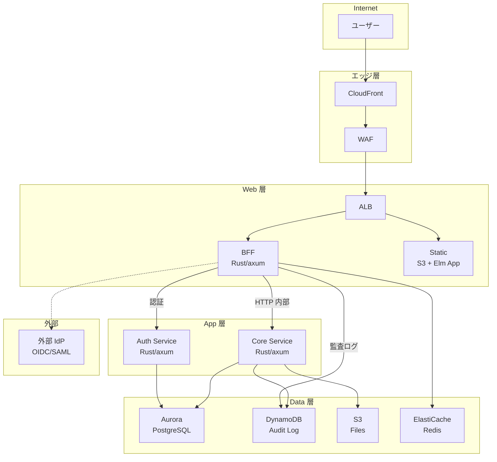
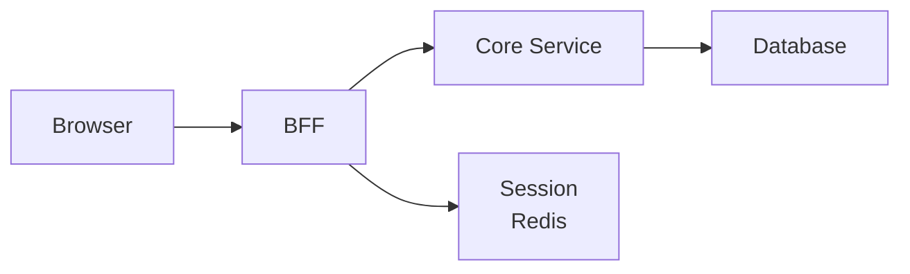
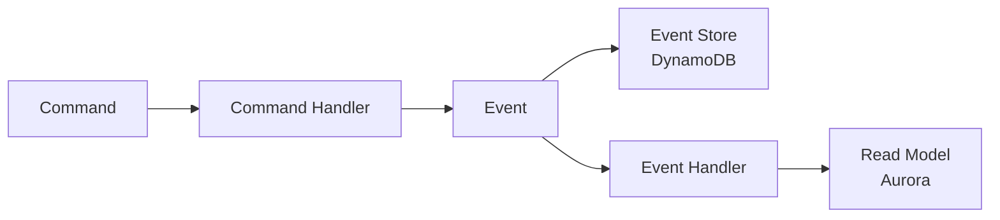
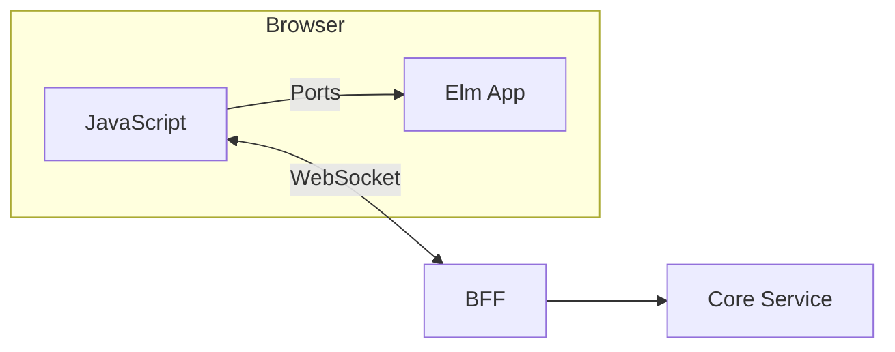
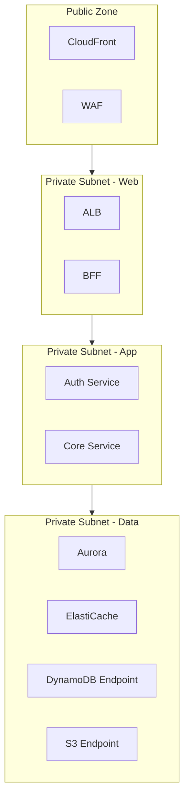

# アーキテクチャ概要

## 概要

本ドキュメントは RingiFlow のシステムアーキテクチャの全体像を定義する。

## システム構成図



## レイヤー構成

| レイヤー | 責務 | 技術 |
|---------|------|------|
| CDN | 静的配信、キャッシュ、DDoS 緩和 | CloudFront |
| WAF | Web アプリケーション防御 | AWS WAF |
| LB | ルーティング、TLS 終端 | ALB |
| BFF | セッション管理、認証、API プロキシ | Rust/axum |
| Auth Service | パスワード認証、資格情報管理 | Rust/axum |
| Core Service | ビジネスロジック、ドメイン処理 | Rust/axum |
| Data | 永続化、キャッシュ | Aurora, DynamoDB, S3, Redis |

## 主要なアーキテクチャパターン

### BFF パターン

ブラウザは BFF（Backend for Frontend）とのみ通信する。



利点:
- トークンをフロントエンドに露出しない
- セッション管理をサーバサイドに集約
- フロントエンド向けに最適化された API を提供

### セッション管理

HTTPOnly Cookie + Redis によるサーバサイドセッション。

| 項目 | 値 |
|------|-----|
| Cookie 属性 | HttpOnly, Secure, SameSite=Lax |
| セッションストア | ElastiCache Redis |
| セッション ID | UUID v4 |
| 有効期限 | 設定可能（デフォルト 8 時間） |

### マルチテナント

Pool モデル（共有 DB + tenant_id による行レベル分離）。アプリケーション層の WHERE 句（主防御線）+ RLS（セーフティネット）の二重防御で分離を担保する。

```sql
-- すべてのテナントスコープテーブルに tenant_id を持つ
CREATE TABLE users (
    id UUID PRIMARY KEY,
    tenant_id UUID NOT NULL REFERENCES tenants(id),  -- 分離キー
    ...
);

-- Row Level Security (RLS) で強制
ALTER TABLE users ENABLE ROW LEVEL SECURITY;
CREATE POLICY tenant_isolation ON users
    USING (tenant_id = NULLIF(current_setting('app.tenant_id', true), '')::UUID);
```

→ 詳細: [03_インフラとDB設計.md 7.1.3 節](03_インフラとDB設計.md)、[ADR-044](../05_ADR/044_PostgreSQL_RLSによるマルチテナント分離の実装方式.md)

### イベント駆動

> **実装状態**: 未実装（Phase 4 で実装予定）

CQRS + Event Sourcing パターン。



特徴:
- コマンドとクエリの分離
- イベントによる状態変更の記録
- 結果整合性モデル

### 監査ログ

ユーザー管理・ロール管理の操作履歴を DynamoDB に記録する。BFF が操作結果に応じて直接 DynamoDB に書き込み・読み取りを行う。

| 項目 | 値 |
|------|-----|
| データストア | DynamoDB |
| パーティションキー | `tenant_id` |
| ソートキー | `{timestamp}#{uuid}` |
| 自動削除 | TTL（1 年） |
| ページネーション | カーソルベース |

→ 詳細: [ADR-045](../05_ADR/045_DynamoDBによる監査ログストア設計.md)

### WebSocket 通信

> **実装状態**: 部分的に実装済み。Ports 基盤は構築済み。WebSocket リアルタイム通信は Phase 4 で対応予定。

接続管理は JavaScript 側、Elm は Ports 経由でイベントを受信。



## コンポーネント間通信

| 通信 | プロトコル | 認証 |
|------|-----------|------|
| Browser → BFF | HTTPS | Session Cookie |
| BFF → Auth Service | HTTP (内部) | 内部トークン or mTLS |
| BFF → Core Service | HTTP (内部) | 内部トークン or mTLS |
| BFF → DynamoDB | HTTPS | IAM 認証 |
| Auth Service → Aurora | PostgreSQL | IAM 認証 |
| Core Service → Aurora | PostgreSQL | IAM 認証 |
| Core Service → DynamoDB | HTTPS | IAM 認証 |
| Core Service → S3 | HTTPS | IAM 認証 |
| BFF → Redis | Redis Protocol | AUTH |

## セキュリティ境界



## 関連ドキュメント

- プロジェクト構造: [02_プロジェクト構造設計.md](02_プロジェクト構造設計.md)
- データベース設計: [03_詳細設計書/02_データベース設計.md](../03_詳細設計書/02_データベース設計.md)
- API 設計: [03_詳細設計書/03_API設計.md](../03_詳細設計書/03_API設計.md)

## 変更履歴

| 日付 | 変更内容 | 担当 |
|------|---------|------|
| 2026-02-25 | セキュリティ境界図に S3 Endpoint を追加（#880） | - |
| 2026-02-11 | DynamoDB ラベルを Audit Log に変更、BFF→DynamoDB 接続追加、監査ログセクション追加（#403） | - |
| 2026-02-11 | マルチテナントセクションに二重防御と NULLIF パターンを反映（#411） | - |
| 2026-02-07 | 未実装セクションに実装状態マーカーを追加（#300） | - |
| 2026-02-07 | Auth Service を追加（構成図、レイヤー表、通信表、セキュリティ境界図） | - |
| 2026-01-17 | セッション管理の設定値を詳細設計書と統一（SameSite=Lax, 8時間） | - |
| 2026-01-13 | 初版作成（CLAUDE.md から分離） | - |
