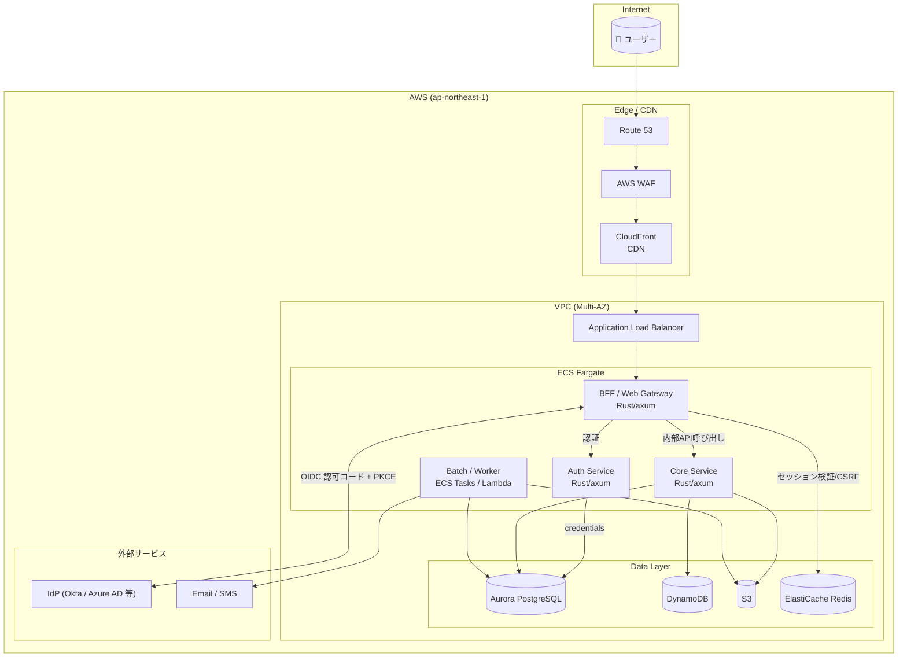
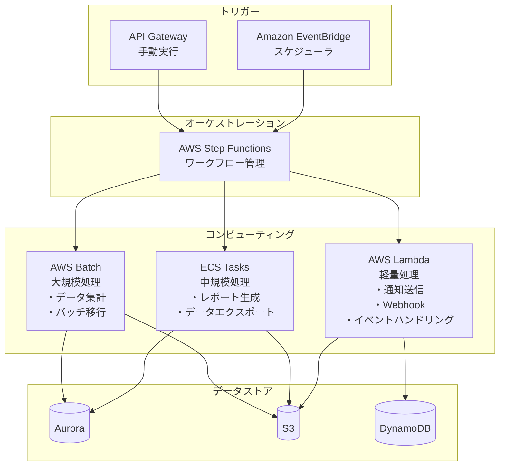
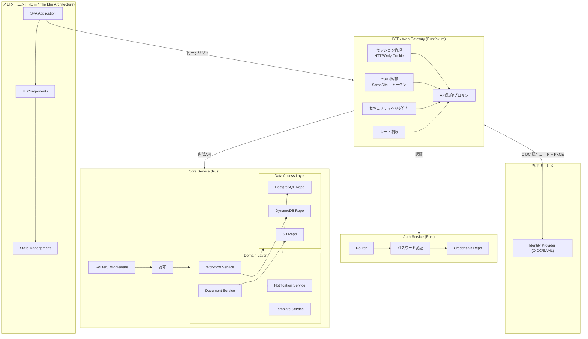
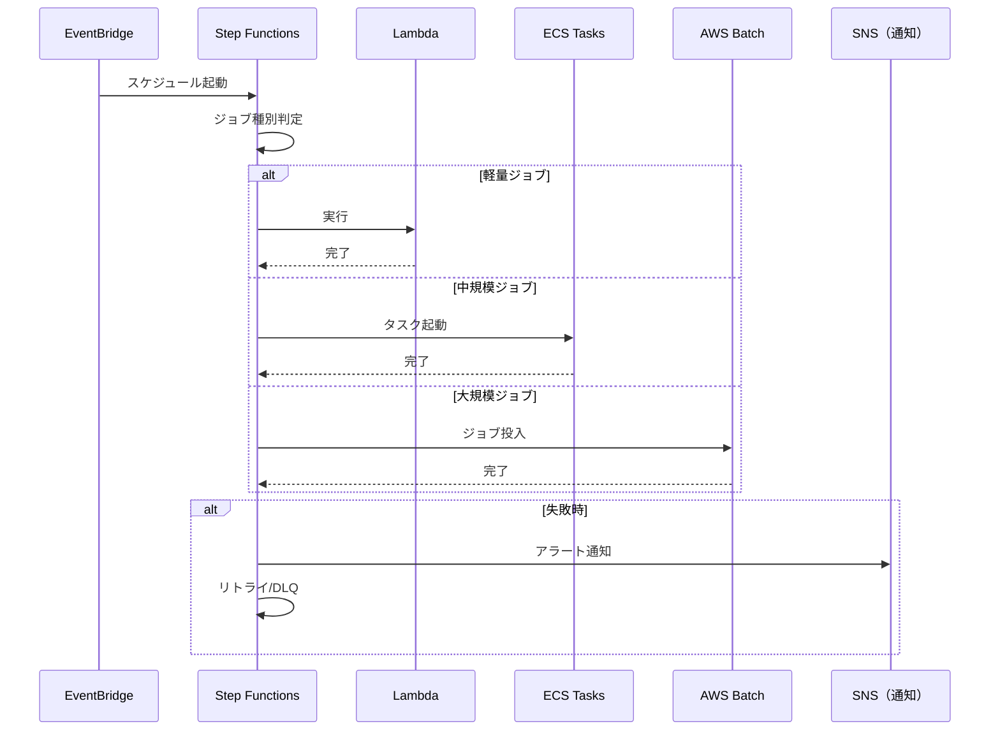

# RingiFlow アーキテクチャ設計

本ドキュメントでは、RingiFlow のシステム全体構成とコンポーネント設計を記載します。

## 主要 AWS サービスの説明

本アーキテクチャで使用する主要な AWS サービスを以下に示します。

| サービス名 | 説明 |
|-----------|------|
| Route 53 | DNS（Domain Name System）サービス。ドメイン名と IP アドレスを紐づける |
| CloudFront | CDN（Content Delivery Network）サービス。世界中のエッジサーバーからコンテンツを配信し、高速化と負荷分散を実現 |
| AWS WAF | Web Application Firewall。SQL インジェクションや XSS 等の攻撃を検知・防御 |
| ALB | Application Load Balancer。HTTP/HTTPS リクエストを複数のサーバーに振り分ける |
| ECS Fargate | サーバーレスコンテナ実行環境。サーバー管理不要でコンテナを実行できる |
| Aurora PostgreSQL | PostgreSQL 互換のマネージド RDB。自動バックアップ、レプリケーション等を提供 |
| DynamoDB | NoSQL データベース。高速な読み書きとスケーラビリティに優れる |
| ElastiCache Redis | インメモリキャッシュサービス。セッション管理やキャッシュに使用 |
| S3 | オブジェクトストレージ。ファイル保存やログ保管に使用 |
| Lambda | サーバーレス関数実行サービス。軽量な処理を実行 |
| Step Functions | ワークフローオーケストレーションサービス。複数の Lambda や ECS タスクを連携させる |
| EventBridge | イベントバス。スケジュール実行やイベント駆動処理のトリガーに使用 |
| AWS Batch | 大規模バッチ処理サービス。CPU/メモリを大量に使う処理を実行 |

## TOC
- [OPS-01] システムアーキテクチャ

---

## [OPS-01] システムアーキテクチャ

### 5.1 全体アーキテクチャ図

### 5.2 バッチ処理アーキテクチャ

> **実装状態**: 未実装（Phase 4 で実装予定）

### 5.3 コンポーネント構成

#### アプリケーションコンポーネント図

#### レイヤー構成

| レイヤー | コンポーネント | 技術スタック |
|---------|---------------|-------------|
| フロントエンド | SPA（静的アセット） | Elm（TEA：The Elm Architecture。Model-Update-View パターン） / elm-tooling / elm make（ビルド） |
| Edge/BFF | BFF（セッション・CSRF・画面用API集約） | Rust / axum / tower（Rust 用のミドルウェア抽象化ライブラリ） |
| Auth Service | 認証 API（パスワード認証、将来の SSO/MFA） | Rust / axum / tower |
| Core Service | ドメインAPI（内部） | Rust / axum / tower |
| ビジネスロジック | ドメインサービス | Rust |
| データアクセス | リポジトリ | SQLx（Rust 用の非同期 SQL ライブラリ） / DynamoDB SDK |
| インフラ | コンテナ基盤 | ECS Fargate |
| バッチ | 非同期処理 | Lambda / ECS Tasks / Step Functions |

#### 5.3.1 Elm / Ports 連携（Interop）要件

> **実装状態**: 部分的に実装済み。Ports 基盤（`src/Ports.elm`）は構築済み。WebSocket 再接続・再同期・監視の詳細実装は Phase 4 で対応予定。

RingiFlow のフロントエンドは Elm（The Elm Architecture）で実装する。
ブラウザ API および WebSocket 等の外部世界との連携は Ports を介して行い、Ports 境界を「安全境界」として明示的に設計・テスト・運用する。

##### 設計方針（Must）

- **Ports の集約**
  Ports は `Ports`（または `Interop`）モジュールに集約する。
  アプリ本体（Model / Update / View）は Ports を直接参照せず、純粋関数中心の状態遷移を維持する。

- **メッセージ契約とデコード**
  Ports で受信するデータは、Elm 側で必ず `Json.Decode` により検証（デコード）する。
  デコード失敗は「例外」ではなく「期待される失敗」として扱い、ユーザー向けの退避表示、テレメトリ記録、必要に応じた再同期を行う。
  Ports メッセージはバージョン付きエンベロープ形式とし、最低限 `v`（契約バージョン）、`type`（メッセージ種別）、`payload`（本体）、`correlationId`（操作/応答の紐付け）、`ts`（発生時刻）を持つ。

- **WebSocket の責務分離**
  WebSocket の接続管理（接続/切断、再接続、バックオフ、心拍、ブラウザ互換性、ログ）は JS 側の Ports ブリッジで担う。
  Elm 側は「正規化されたイベント」を受け取り、状態遷移（Update）に閉じ込める。

- **順序逆転と重複の耐性**
  通知は順不同・遅延・欠落が起こり得る前提とし、イベントには `sequence` または `revision` を必須とする。
  Elm 側は「過去のイベント」を無視できるように、集約単位（例：Task/Request）で最新 revision を保持し、単調増加のみ適用する。

- **楽観的更新（Optimistic UI）の確定/巻き戻し**
  UI 操作で発生する状態変更は `opId`（クライアント生成）を付与し、Pending 状態として保持する。
  サーバからの ACK（成功/失敗）で確定または巻き戻しを行い、ACK が遅延しても二重適用されないよう idempotent に処理する。

##### 再接続・再同期（Must）

- WebSocket 断線時は指数バックオフで再接続し、一定回数失敗時はユーザーに明示する。
- 再接続成功時は「最新 Read Model の再取得（HTTP）」を行い、通知遅延/欠落による不整合を収束させる。
- 通知は補助であり、最終整合性は Read Model の再取得で担保する（通知のみで整合性を保証しない）。

##### 運用・監視（Must）

- **接続状態の可視化**
  Ports ブリッジは WebSocket の接続状態（例：`DISCONNECTED` / `CONNECTING` / `CONNECTED` / `DEGRADED`）を Elm に通知できること。
  画面上に「接続状態」と「再同期実行中」の表示を持ち、断線や再同期が発生した場合にユーザーが状況を把握できること。

- **断線検知と心拍（標準前提、TBD 可）**
  心拍（ping/pong またはアプリレベルの keepalive）を実装し、一定時間（例：30秒）応答が無い場合は断線として扱う。
  断線判定から再接続開始までの遅延を極小化し、ユーザー操作の誤認（更新できていると思い込む）を防ぐ。

- **再接続戦略（標準前提、TBD 可）**
  再接続は指数バックオフ（リトライ間隔を 1秒→2秒→4秒... と指数的に増やす方式）＋ジッタ（ランダムな揺らぎを加えて同時再接続を分散）を必須とし、最大待機（例：30秒）を設ける。
  一定回数失敗（例：5回）以降はバナー表示等で明示し、手動再試行導線を提供する。

- **再同期トリガ（Must）**
  再同期（HTTP による Read Model 再取得）は、(a) 再接続成功時、(b) `sequence/revision` のギャップ検出時、(c) Decoder 失敗が一定閾値を超えた場合（例：5分で3回）に必ず実行する。
  これにより、通知の欠落や JS 側不具合があっても最終的に整合性を収束させる。

- **監視・計測（Must）**
  Ports ブリッジは少なくとも「接続状態遷移」「再接続回数」「再同期回数」「Decoder 失敗件数」「未知 `type` 受信件数」「`sequence/revision` ギャップ検出件数」をメトリクス化する。
  すべてのログは `correlationId` を含む構造化ログとし、障害解析で追跡可能であること。

##### 互換性・変更管理（Must）

- **契約バージョニング**
  `v` は契約バージョンを表し、破壊的変更はメジャーを上げる。
  標準前提として「現行バージョンと直前バージョン」を同時受信可能にする（後方互換を維持しながら移行できること）。

- **未知メッセージの扱い**
  未知の `type` や未知フィールドは受信してもアプリを停止させず、無視して計測に回す。
  互換性確保のため、Decoder は可能な限り"拡張に強い"設計（追加フィールド許容）とする。

- **変更手続き**
  Ports 契約の変更は、テスト（Decoder 異常系、E2E 再接続/再同期）を伴うことを必須とし、CI で回帰を検知できること。
  ドキュメント（本要件定義書）と契約定義（例：JSON Schema 等）の乖離を禁止する。

##### テスト要件（Must）

- Elm: Ports 受信 payload の Decoder に対し、例示テストに加えて境界値/異常系（欠落、型不一致、未知 type）を網羅する。
- JS: Ports ブリッジに対し、WebSocket の再接続、順不同到着、二重送信、エラー伝播、ログ出力のユニットテストを実施する。
- E2E: 断線→再接続→再同期、順序逆転、楽観的更新の巻き戻し、デコード失敗時の退避 UI を必須シナリオとして検証する。

##### セキュリティ要件（Must）

- WebSocket 接続は同一オリジンを前提とし、認証は HTTPOnly セッション Cookie のみで行う（フロントでトークンを保持しない）。
- Ports を通じてトークンや機微情報を永続保持しない。
- 監査/調査のため、Ports ブリッジは「接続状態」「再接続回数」「デコード失敗件数」「イベント欠落が疑われる再同期発生」をメトリクス化する。

#### 5.3.2 Rust バックエンド安定運用要件（BFF / Core Service / Domain Services）

> **実装状態**: 部分的に実装済み。レイヤー構造と基本的なエラーハンドリングは実装済み。サーキットブレーカ、分散トレーシング、構造化ログ（JSON）、レート制限は Phase 4 で対応予定。

本節は、Rust（BFF / Core Service / Domain Services）側の「壊れにくさ（実行時エラー最小）と安定運用」を担保するための非機能要件を定義する。
本節の要件は、実装方式（axum/tower/sqlx 等）に依存しない運用品質の拘束である。

##### 設計方針（Must）

- **境界の明確化**
  BFF・Core Service・Domain Services は、責務境界（認証/認可、入出力検証、ドメイン判断、永続化、非同期処理）を明示し、境界ごとに失敗の扱い（エラー種別、再試行可否、監査要否）を定義する。
  境界が曖昧な実装（例：BFF がドメイン整合性の最終判断を担う等）を禁止し、障害時の切り分け不能を回避する。

- **実行時エラー最小化**
  すべての外部入力（HTTP、イベント、外部 IdP 応答、DB レコード）について、処理開始点で妥当性検証を行い、想定外データは「処理中断 + 観測可能な失敗」として扱う。
  プロセス異常終了（panic 等）に依存した制御を禁止し、「失敗はレスポンス/イベントとして表現し、監視可能にする」ことを MUST とする。

##### エラーモデル（Must）

- **失敗分類の固定**
  API/内部RPC/イベント処理の失敗を、少なくとも「入力不正」「認証/認可」「競合（整合性）」「依存障害（外部/DB）」「資源枯渇（スロットリング/タイムアウト）」「内部不具合」に分類し、分類ごとに HTTP ステータス（または内部コード）と再試行可否を固定する。

- **ユーザー表示可否と秘匿**
  エラーレスポンスは、ユーザー表示可能なメッセージ（userMessage）と、内部向け診断情報（internalDetails）を分離する。
  internalDetails はクライアントへ返却してはならず（MUST NOT）、ログ/トレースにのみ出力し、PII/シークレットはマスキングを MUST とする。

- **相関ID（Correlation ID）**
  すべての外部リクエストは `correlationId` を受理/発行し、BFF→Core→Domain→DB/外部IdP まで伝播することを MUST とする。
  エラー応答・監査ログ・分散トレースは同一の `correlationId` で検索可能でなければならない。

##### 観測性（Must）

- **構造化ログ**
  すべてのサービスは JSON 等の構造化ログで出力し、最低限 `ts` `level` `service` `env` `correlationId` `requestId` `tenantId` `actorId` `eventId`（該当時）`errorClass`（該当時）を含める。
  これにより、障害時に「どのテナント/操作者/操作が、どの依存により失敗したか」を 1 クエリで復元可能にする。

- **分散トレーシング**
  BFF・Core Service・Domain Services・外部IdP・DB/キューの主要区間をトレースし、少なくとも「入口スパン」「依存呼び出しスパン」「イベント処理スパン」を MUST とする。
  トレースは必ず `correlationId` と相互参照できなければならない。

- **メトリクス**
  すべてのサービスは、レイテンシ（p50/p95/p99）、エラー率、タイムアウト率、リトライ回数、サーキットブレーカ開閉、DB プール枯渇、キュー滞留（ラグ/深さ）、外部IdP エラー率を計測し、ダッシュボードとアラートに紐づけることを MUST とする。

##### レート制限・バックプレッシャ（Must）

用語説明：
- レート制限：単位時間あたりのリクエスト数を制限する仕組み（例：1 分間に 100 リクエストまで）
- バックプレッシャ：下流のシステムが処理しきれない場合に、上流のシステムに対して流量を抑えるよう圧力をかける仕組み
- サーキットブレーカ：依存先が障害の場合に、一定期間リクエストを遮断して障害の連鎖を防ぐパターン
- スロットリング：リクエストを制限し、過負荷を防ぐこと

- **保護点の明示**
  BFF は外部（ブラウザ）からの流量に対してレート制限を実施し、Core Service への内部呼び出しにも独立した上限を持つことを MUST とする。
  外部IdP・DB・キュー/ワーカーは、各依存ごとにタイムアウト、同時実行上限、指数バックオフ付きリトライ、サーキットブレーカ方針を定義しなければならない。

- **過負荷時の応答**
  スロットリング時は 429/503 等で明示し、クライアントに再試行可能性（retryable）と推奨待機時間（retryAfterMs）を返却することを SHOULD とする。

##### 依存障害時のフェイルセーフ（Must）

- **部分劣化（Degradation）**
  依存障害時は「全停止」ではなく、可能な範囲で読み取り系を継続し、書き込み系は明示的に拒否する等の段階的劣化を MUST とする。
  ユーザー向けには、機能制限の理由と復旧見込み（不明なら不明）を表示できる情報を BFF が返すことを MUST とする。

- **キュー滞留時の制御**
  監視により滞留を検知した場合、投入側の抑制（レート制限/一時停止）、DLQ（Dead Letter Queue：処理に失敗したメッセージを退避するキュー）への隔離、再処理手順（後述）を Runbook（定型対応手順書）として定義することを MUST とする。

##### データ整合性（Must）

- **冪等性・重複排除**
  コマンド処理・イベントハンドラ・Read Model 更新は、同一 `eventId` / `commandId` に対して冪等に動作し、重複投入・再試行で結果が破壊されないことを MUST とする。

- **順序制御と再同期**
  同一 Aggregate 内の順序制御方針（パーティションキー、楽観ロック（更新時にバージョン番号をチェックし、競合を検出する方式）等）を定義し、欠落/遅延が疑われる場合の再同期手順（再取得・再投影・再通知）を運用手順として MUST 化する。

##### 契約テスト（Must）

用語説明：
- OpenAPI（旧 Swagger）：REST API の仕様を記述するための標準フォーマット。API のエンドポイント、パラメータ、レスポンス形式を定義
- JSON Schema：JSON データの構造を定義・検証するための標準仕様

- **HTTP API 契約**
  BFF⇔Core Service の API 契約は、スキーマ（例：OpenAPI/JSON Schema）と自動検証（CI での互換性チェック）を MUST とする。
  互換性のない変更は、破壊的変更として明示し、段階リリース/クライアント移行手順を伴わない限り禁止する（MUST NOT）。

- **イベント/WebSocket 契約（該当時）**
  サーバがイベントや WebSocket メッセージを発行する場合、メッセージエンベロープ（バージョン、種別、相関ID、時刻）を固定し、後方互換の自動検証を MUST とする。

### 5.4 AWS Batch の採用判断

> **実装状態**: 未実装（Phase 4 で実装予定）

AWS Batch は以下のユースケースで採用する。

| 採用するケース | 採用しないケース |
|---------------|-----------------|
| 大規模データ処理（数GB以上） | 軽量な定期実行タスク（Lambda で十分） |
| コンピューティング集約型処理 | 即時レスポンスが必要な処理 |
| 可変的なリソース要件がある処理 | シンプルなコンテナタスク（ECS Tasks で十分） |
| HPC ワークロード（High Performance Computing：科学計算等の高負荷計算処理） | - |

本システムでは以下の処理に AWS Batch を適用する。

- 月次/年次の大規模レポート生成
- テナントデータの一括エクスポート
- 全文検索インデックスの再構築

### 5.5 バッチジョブ一覧

> **実装状態**: 未実装（Phase 4 で実装予定）

#### 5.5.1 定期実行ジョブ

| ジョブID | ジョブ名 | 実行タイミング | 実行基盤 | 説明 |
|---------|---------|---------------|---------|------|
| BATCH-001 | SLA チェック | 毎時 | Lambda | 期限超過ワークフローの検出とエスカレーション通知 |
| BATCH-002 | セッションクリーンアップ | 毎時 | Lambda | 期限切れセッションの削除 |
| BATCH-003 | 通知リマインダー | 日次 06:00 | Lambda | 未処理タスクのリマインダー送信 |
| BATCH-004 | 日次統計集計 | 日次 02:00 | ECS Tasks | ダッシュボード用統計データの集計 |
| BATCH-005 | 監査ログアーカイブ | 日次 03:00 | ECS Tasks | 古い監査ログの S3 へのアーカイブ |
| BATCH-006 | ストレージ使用量計算 | 日次 04:00 | ECS Tasks | テナント別ストレージ使用量の計算 |
| BATCH-007 | 週次レポート生成 | 週次 月曜 01:00 | ECS Tasks | テナント管理者向け週次サマリ生成 |
| BATCH-008 | 月次請求データ生成 | 月次 1日 00:00 | ECS Tasks | 課金用使用量データの集計 |
| BATCH-009 | 検索インデックス最適化 | 週次 日曜 02:00 | AWS Batch | OpenSearch インデックスの最適化 |
| BATCH-010 | データ保持ポリシー適用 | 日次 05:00 | ECS Tasks | 保持期限切れデータの論理削除 |

#### 5.5.2 オンデマンドジョブ

| ジョブID | ジョブ名 | トリガー | 実行基盤 | 説明 |
|---------|---------|---------|---------|------|
| BATCH-101 | テナントデータエクスポート | 管理者操作 | AWS Batch | 全テナントデータの JSON/CSV エクスポート |
| BATCH-102 | 監査ログエクスポート | 管理者操作 | ECS Tasks | 指定期間の監査ログエクスポート |
| BATCH-103 | 検索インデックス再構築 | 管理者操作 | AWS Batch | OpenSearch インデックスの全件再構築 |
| BATCH-104 | Read Model 再投影 | 障害復旧時 | ECS Tasks | イベントからの Read Model 再構築 |
| BATCH-105 | 物理削除実行 | 管理者操作 | ECS Tasks | 論理削除済みデータの物理削除 |
| BATCH-106 | バルクユーザーインポート | 管理者操作 | ECS Tasks | CSV からのユーザー一括登録 |

#### 5.5.3 イベント駆動ジョブ

| ジョブID | ジョブ名 | トリガーイベント | 実行基盤 | 説明 |
|---------|---------|----------------|---------|------|
| BATCH-201 | ドキュメントインデックス | DocumentUploaded | Lambda | アップロードファイルのテキスト抽出・インデックス登録 |
| BATCH-202 | サムネイル生成 | DocumentUploaded | Lambda | 画像/PDF のサムネイル生成 |
| BATCH-203 | 通知送信 | NotificationRequested | Lambda | メール/Slack/Teams への通知送信 |
| BATCH-204 | Webhook 配信 | WorkflowCompleted | Lambda | 外部システムへの Webhook 送信 |
| BATCH-205 | 監査ログ書き込み | 各種イベント | Lambda | 監査ログの DynamoDB/S3 への書き込み |

#### 5.5.4 ジョブ実行フロー

#### 5.5.5 ジョブ監視要件

| 監視項目 | 閾値 | アクション |
|---------|------|----------|
| ジョブ実行時間 | ジョブごとの上限 | アラート + 強制停止 |
| 連続失敗回数 | 3回 | アラート + 一時停止 |
| DLQ 滞留件数 | 10件 | アラート |
| 実行遅延 | 予定時刻から30分超過 | アラート |

---
