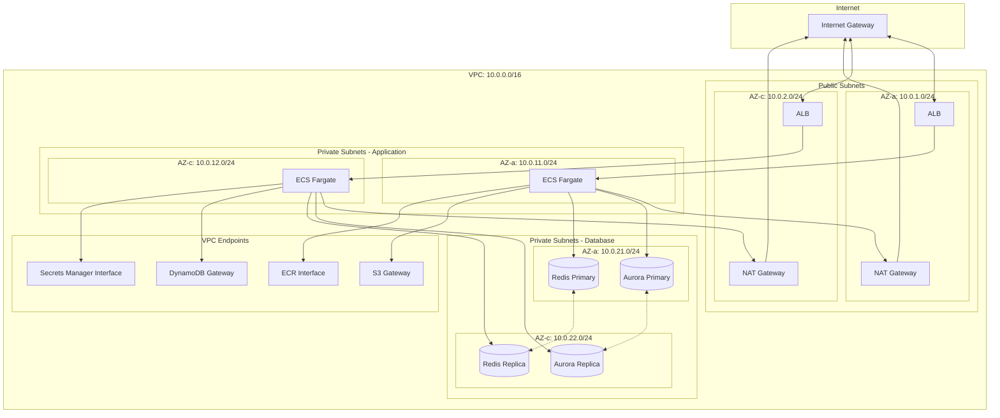
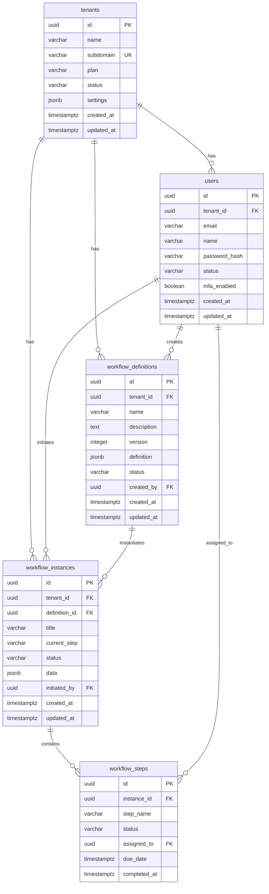

# RingiFlow インフラ・データベース設計

本ドキュメントは RingiFlow のインフラストラクチャ設計およびデータベース設計方針を定義する。

## 用語説明

本ドキュメントで使用する主要な用語を以下に示す。

### ネットワーク関連

| 用語 | 説明 |
|------|------|
| VPC | Virtual Private Cloud。AWS 上に作成する仮想ネットワーク |
| CIDR | Classless Inter-Domain Routing。IP アドレスの範囲を表す記法（例：10.0.0.0/16 は約 65,000 個の IP アドレスを含む） |
| サブネット | VPC 内を分割した小さなネットワーク。Public（インターネット接続可）と Private（内部のみ）に分ける |
| NAT Gateway | Private サブネットからインターネットへの外向き通信を可能にするゲートウェイ |
| VPC エンドポイント | AWS サービスへの接続をインターネットを経由せず VPC 内で完結させる機能。Gateway 型（S3/DynamoDB 向け、無料）と Interface 型（その他サービス向け、有料）がある |
| AZ（アベイラビリティゾーン） | 物理的に独立したデータセンター群。障害に備えて複数 AZ に分散配置する |

### データストア関連

| 用語 | 説明 |
|------|------|
| ACU | Aurora Capacity Unit。Aurora Serverless の処理能力単位。負荷に応じて自動スケール |
| KMS | AWS Key Management Service。暗号化キーを管理するサービス |
| パーティションキー | DynamoDB でデータを分散配置するためのキー。同じキー値のデータは同じパーティションに格納 |
| ソートキー | パーティション内でデータを並べ替えるためのキー |
| TTL | Time To Live。データの有効期限。期限切れデータは自動削除 |
| Pub/Sub | Publish/Subscribe パターン。送信者がチャンネルにメッセージを発行し、購読者が受信する通信方式 |
| Glacier | S3 の低コストストレージクラス。長期保存用でアクセス頻度の低いデータ向け |

### その他

| 用語 | 説明 |
|------|------|
| Graviton2 | AWS 独自開発の ARM ベース CPU。コスト効率が良い |
| ECR | Elastic Container Registry。Docker イメージを保存するレジストリサービス |
| Secrets Manager | 機密情報（パスワード、API キー等）を安全に保管・取得するサービス |
| SSM | AWS Systems Manager。パラメータストア（設定値の保管）等を提供 |
| ACM | AWS Certificate Manager。SSL/TLS 証明書を管理するサービス |

---

## [OPS-02] インフラストラクチャ設計

### 6.1 ネットワーク設計

#### VPC ネットワーク構成図



#### 6.1.1 VPC 構成

| 項目 | 設定値 |
|------|--------|
| VPC CIDR | 10.0.0.0/16 |
| リージョン | ap-northeast-1（東京） |
| アベイラビリティゾーン | ap-northeast-1a, ap-northeast-1c |

#### 6.1.2 サブネット設計

| サブネット名 | CIDR | AZ | 用途 |
|-------------|------|-----|------|
| public-1a | 10.0.1.0/24 | 1a | ALB、NAT Gateway |
| public-1c | 10.0.2.0/24 | 1c | ALB、NAT Gateway |
| private-app-1a | 10.0.11.0/24 | 1a | ECS Fargate |
| private-app-1c | 10.0.12.0/24 | 1c | ECS Fargate |
| private-db-1a | 10.0.21.0/24 | 1a | Aurora、ElastiCache |
| private-db-1c | 10.0.22.0/24 | 1c | Aurora、ElastiCache |

#### 6.1.3 VPC エンドポイント

| サービス | タイプ | 用途 |
|---------|-------|------|
| S3 | Gateway | S3 アクセス（無料） |
| DynamoDB | Gateway | DynamoDB アクセス（無料） |
| ECR (api/dkr) | Interface | コンテナイメージ取得 |
| CloudWatch Logs | Interface | ログ送信 |
| Secrets Manager | Interface | シークレット取得 |
| SSM | Interface | パラメータストア |

### 6.2 コンピューティング

#### 6.2.1 ECS クラスター

| 項目 | 設定値 |
|------|--------|
| 起動タイプ | Fargate |
| CPU アーキテクチャ | ARM64（Graviton2） |
| タスク CPU | 1 vCPU |
| タスク メモリ | 2 GB |
| 最小タスク数 | 2 |
| 最大タスク数 | 20 |

#### 6.2.2 オートスケーリング

| メトリクス | 閾値 | アクション |
|-----------|------|----------|
| CPU 使用率 | 70% 超過 | スケールアウト |
| CPU 使用率 | 30% 未満 | スケールイン |
| メモリ使用率 | 80% 超過 | スケールアウト |
| リクエスト数 | 1000/分 超過 | スケールアウト |

### 6.3 データストア

#### 6.3.1 Aurora Serverless v2

| 項目 | 設定値 |
|------|--------|
| エンジン | PostgreSQL 15.x |
| 最小 ACU | 0.5 |
| 最大 ACU | 16 |
| マルチAZ | 有効 |
| 自動バックアップ | 有効（35日保持） |
| 暗号化 | AWS KMS |
| パフォーマンスインサイト | 有効（7日保持） |

#### 6.3.2 DynamoDB

| テーブル | パーティションキー | ソートキー | 用途 |
|---------|------------------|----------|------|
| audit_logs | tenant_id | timestamp | 監査ログ |
| workflow_events | workflow_id | event_timestamp | イベントソーシング |
| notifications | user_id | created_at | 通知キュー |
| feature_flags | tenant_id | flag_key | フィーチャーフラグ |

注記: セッション管理は ElastiCache（Redis）で行う。DynamoDB は永続化が必要なデータに使用し、セッションのような揮発性データは Redis に保存する。

#### 6.3.3 ElastiCache (Redis)

| 項目 | 設定値 |
|------|--------|
| ノードタイプ | cache.r7g.large |
| ノード数 | 2（プライマリ + レプリカ） |
| マルチAZ | 有効 |
| 暗号化（転送中） | 有効 |
| 暗号化（保存時） | 有効 |
| 自動フェイルオーバー | 有効 |

##### Redis 用途

| 用途 | データ構造 | TTL | 説明 |
|------|-----------|-----|------|
| セッション管理 | Hash | 8時間（絶対期限） | ユーザーセッション情報（tenant_id, user_id, roles, last_access） |
| CSRF トークン | String | 30分 | セッションに紐付いた CSRF トークン |
| キャッシュ | String/Hash | 5分〜1時間 | Read Model キャッシュ、ユーザー情報キャッシュ |
| レート制限 | Sorted Set | 1分〜1時間 | API レート制限のカウンタ |
| WebSocket Pub/Sub | Pub/Sub | - | リアルタイム通知の配信 |
| ロック | String | 30秒〜5分 | 分散ロック（冪等性保証用） |

### 6.4 ストレージ

#### 6.4.1 S3 バケット構成

| バケット名 | 用途 | ライフサイクル |
|-----------|------|--------------|
| ringiflow-{env}-documents | ユーザードキュメント | 1年後 Glacier 移行 |
| ringiflow-{env}-assets | 静的アセット | - |
| ringiflow-{env}-logs | ログアーカイブ | 90日後 Glacier、1年後削除 |
| ringiflow-{env}-backups | DB バックアップ | 35日後削除 |
| ringiflow-{env}-exports | データエクスポート | 7日後削除 |

### 6.5 CDN・ロードバランサー

#### 6.5.1 CloudFront

| 項目 | 設定値 |
|------|--------|
| プライスクラス | PriceClass_200（日本含むほとんどのリージョン） |
| SSL証明書 | ACM（us-east-1） |
| キャッシュ動作 | 静的アセット: 1日、API: キャッシュなし |
| WAF | AWS WAF 連携 |
| ログ | S3 出力 |

#### 6.5.2 Application Load Balancer

| 項目 | 設定値 |
|------|--------|
| スキーム | internal（CloudFront 経由のみ） |
| リスナー | HTTPS:443 |
| ターゲットグループ | ECS Fargate タスク |
| ヘルスチェック | /health（10秒間隔） |
| スティッキーセッション | 無効（ステートレス設計：サーバーが状態を持たず、どのサーバーでも同じ処理ができる設計） |

---

## [OPS-03] データベース設計方針

### 7.1 データモデル方針

#### 7.1.1 Aurora (PostgreSQL) に格納するデータ

- マスターデータ: テナント、ユーザー、ロール、ワークフロー定義
- トランザクションデータ: ワークフローインスタンス、タスク、承認履歴
- 関係性が重要なデータ: 組織構造、権限設定

#### 7.1.2 DynamoDB に格納するデータ

- 高頻度書き込み: セッション、監査ログ
- イベントデータ: ワークフローイベント、通知
- キー・バリュー型アクセス: 設定値、フィーチャーフラグ
### 7.1.3 マルチテナント分離（データアクセス制御）

RingiFlow は「共有データベース・共有スキーマ」を基本とし、すべてのクエリに tenant_id コンテキストを強制付与して分離を担保する。
加えて、誤実装時の破壊的影響を抑えるため、以下の二重防御を必須とする。

| 項目 | 要件 | 実装 |
|------|------|------|
| アプリケーション層 | Repository 層の全クエリで `WHERE tenant_id = $N` を適用（主防御線） | axum ミドルウェアでセッションから tenant_id を抽出し、リクエストコンテキストに保持 |
| DB 層ガードレール | PostgreSQL RLS（Row Level Security）による強制フィルタ（セーフティネット） | `set_config('app.tenant_id', ...)` + RLS policy |
| 監査 | クロステナントアクセス検知（tenant_id 不一致、0件超の異常） | Datadog モニタ + 監査ログ |

> **実装状態**: アプリケーション層と DB 層ガードレールは実装済み。監査は Phase 2-2 以降で対応予定。

例外として、特定の大手テナントで法的/契約上の強分離が必要な場合は「スキーマ分離」または「DB 分離（Dedicated）」を選択できる設計とする。

##### RLS 実装方式

全 9 テナントスコープテーブルに対し、一貫したパターンで RLS を適用している。

```sql
-- テナントコンテキスト設定（リクエスト処理開始時）
SELECT set_config('app.tenant_id', $1, false);

-- テナントコンテキストリセット（コネクション返却時、after_release フック）
SELECT set_config('app.tenant_id', '', false);

-- RLS ポリシー
CREATE POLICY tenant_isolation ON テーブル名
    USING (tenant_id = NULLIF(current_setting('app.tenant_id', true), '')::UUID);
```

安全設計: `current_setting('app.tenant_id', true)` は未設定時に空文字列を返す。`NULLIF` で `NULL` に変換され、`tenant_id = NULL` は常に `false` となるため、未設定時はどの行もマッチしない。

| テーブル | ポリシー条件 |
|---------|------------|
| `tenants` | `id = NULLIF(...)::UUID` |
| `users` | `tenant_id = NULLIF(...)::UUID` |
| `roles` | `tenant_id = NULLIF(...)::UUID OR tenant_id IS NULL`（システムロール対応） |
| `user_roles` | `tenant_id = NULLIF(...)::UUID` |
| `workflow_definitions` | `tenant_id = NULLIF(...)::UUID` |
| `workflow_instances` | `tenant_id = NULLIF(...)::UUID` |
| `workflow_steps` | `tenant_id = NULLIF(...)::UUID` |
| `display_id_counters` | `tenant_id = NULLIF(...)::UUID` |
| `auth.credentials` | `tenant_id = NULLIF(...)::UUID` |

→ 設計判断の詳細: [ADR-044](../05_ADR/044_PostgreSQL_RLSによるマルチテナント分離の実装方式.md)

#### 7.1.4 分離モードの管理（Bridge の前提）

テナントには分離モードを付与し、コントロールプレーン（テナント管理テーブル）で一元管理する。

| 属性 | 説明 | 例 |
|------|------|----|
| tenant_id | テナント識別子 | UUID |
| isolation_mode | 分離モード | POOL / SILO |
| data_plane_ref | 専用リソース参照（SILO時） | aurora_cluster_id / account_id |
| region | 配置リージョン | ap-northeast-1 |

- POOL: Aurora の共有クラスター＋共有スキーマで運用し、tenant_id 強制＋RLS 等で分離する。
- SILO: テナント専用の Aurora クラスター（または専用 AWS アカウント/スタック）を用意し、障害ドメインと性能を強く分離する。

#### 7.1.5 ルーティング要件

- API 入口で tenant_id を確定し、Repository/DAO 層は tenant_id と isolation_mode を入力としてデータアクセス先を決定する。
- クロステナント集計が必要な場合は、オンライン系 DB を直接横断しない。
  - 代替: イベント/監査ログの集約ストア（S3 + Athena（S3 上のデータを SQL で分析できるサービス）等）または DWH（Data Warehouse：分析用に整理されたデータベース）へ ETL（Extract-Transform-Load：データの抽出・変換・取り込み処理）する。

#### 7.1.6 分離モード移行（POOL → SILO）

- 互換性のため、テナントは POOL から開始し、必要時に SILO へ昇格できる。
- 昇格は「データ複製 → 双方向書き込み停止 → 切替 → 検証 → ロールバック手順」を Runbook 化し、監査ログに記録する。


### 7.2 主要テーブル設計（Aurora）

#### ER図



#### DDL定義

```sql
-- テナント
CREATE TABLE tenants (
    id UUID PRIMARY KEY DEFAULT gen_random_uuid(),
    name VARCHAR(255) NOT NULL,
    subdomain VARCHAR(63) NOT NULL UNIQUE,
    plan VARCHAR(50) NOT NULL DEFAULT 'standard',
    status VARCHAR(20) NOT NULL DEFAULT 'active',
    settings JSONB NOT NULL DEFAULT '{}',
    created_at TIMESTAMPTZ NOT NULL DEFAULT NOW(),
    updated_at TIMESTAMPTZ NOT NULL DEFAULT NOW()
);

-- ユーザー
CREATE TABLE users (
    id UUID PRIMARY KEY DEFAULT gen_random_uuid(),
    tenant_id UUID NOT NULL REFERENCES tenants(id),
    email VARCHAR(255) NOT NULL,
    name VARCHAR(255) NOT NULL,
    password_hash VARCHAR(255),
    status VARCHAR(20) NOT NULL DEFAULT 'active',
    mfa_enabled BOOLEAN NOT NULL DEFAULT FALSE,
    created_at TIMESTAMPTZ NOT NULL DEFAULT NOW(),
    updated_at TIMESTAMPTZ NOT NULL DEFAULT NOW(),
    UNIQUE(tenant_id, email)
);

-- ワークフロー定義
CREATE TABLE workflow_definitions (
    id UUID PRIMARY KEY DEFAULT gen_random_uuid(),
    tenant_id UUID NOT NULL REFERENCES tenants(id),
    name VARCHAR(255) NOT NULL,
    description TEXT,
    version INTEGER NOT NULL DEFAULT 1,
    definition JSONB NOT NULL,
    status VARCHAR(20) NOT NULL DEFAULT 'draft',
    created_by UUID NOT NULL REFERENCES users(id),
    created_at TIMESTAMPTZ NOT NULL DEFAULT NOW(),
    updated_at TIMESTAMPTZ NOT NULL DEFAULT NOW()
);

-- ワークフローインスタンス
CREATE TABLE workflow_instances (
    id UUID PRIMARY KEY DEFAULT gen_random_uuid(),
    tenant_id UUID NOT NULL REFERENCES tenants(id),
    definition_id UUID NOT NULL REFERENCES workflow_definitions(id),
    title VARCHAR(255) NOT NULL,
    current_step VARCHAR(255) NOT NULL,
    status VARCHAR(20) NOT NULL DEFAULT 'pending',
    data JSONB NOT NULL DEFAULT '{}',
    initiated_by UUID NOT NULL REFERENCES users(id),
    created_at TIMESTAMPTZ NOT NULL DEFAULT NOW(),
    updated_at TIMESTAMPTZ NOT NULL DEFAULT NOW()
);
```

### 7.3 インデックス戦略

| テーブル | インデックス | 種別 | 用途 |
|---------|------------|------|------|
| users | (tenant_id, email) | UNIQUE | ログイン検索 |
| users | (tenant_id, status) | B-tree | ユーザー一覧 |
| workflow_instances | (tenant_id, status, created_at) | B-tree | ワークフロー一覧 |
| workflow_instances | (current_step, assigned_to) | B-tree | タスク一覧 |

---

*以上*
