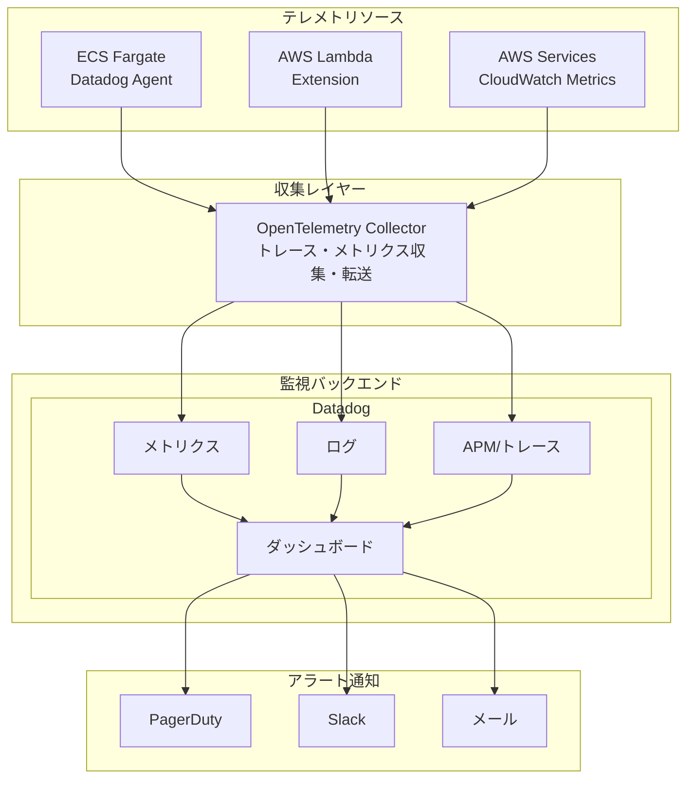
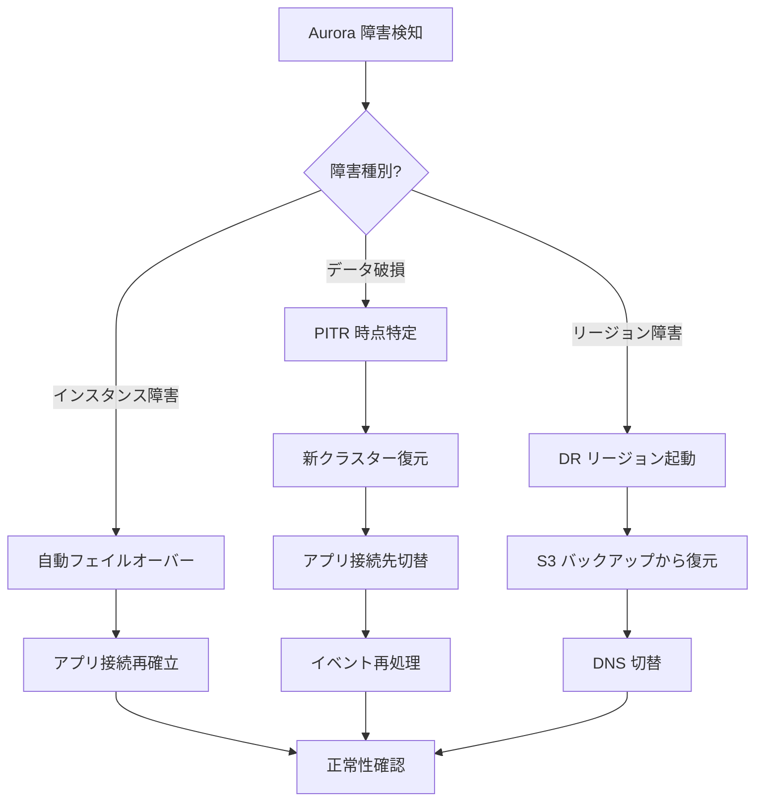
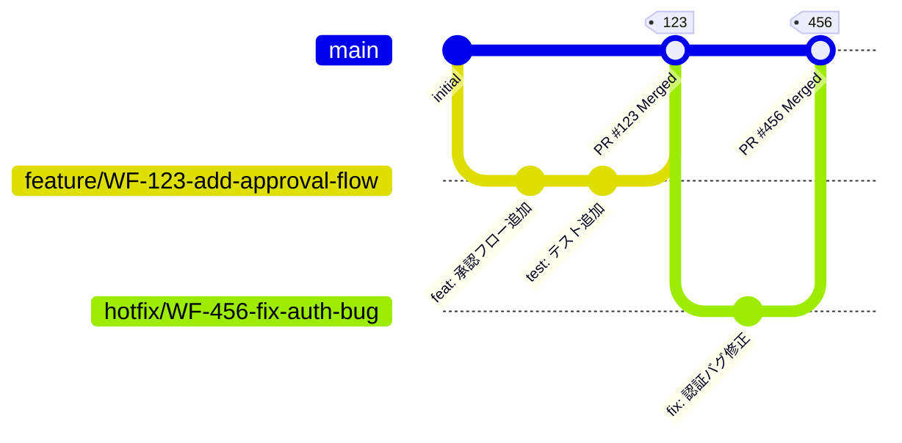
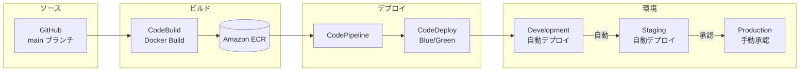
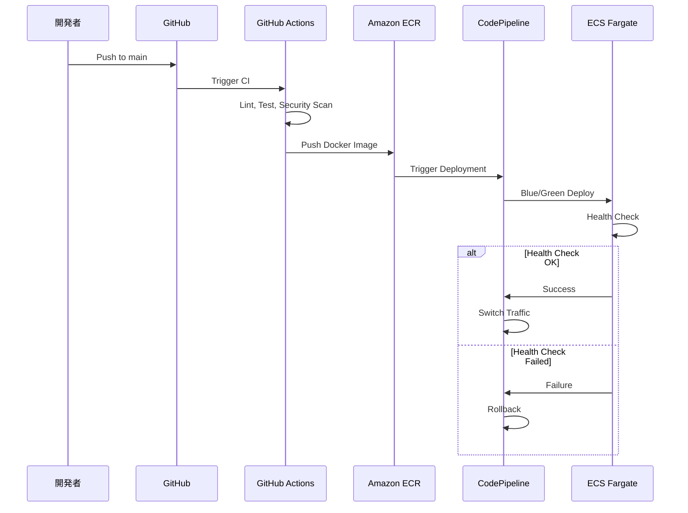

# RingiFlow 運用設計

本ドキュメントは RingiFlow のセキュリティ要件、監視・運用要件、および開発・デプロイメントを定義する。

## 用語説明

本ドキュメントで使用する主要な用語を以下に示す。

### セキュリティ関連

| 用語 | 説明 |
|------|------|
| XSS | Cross-Site Scripting。悪意のあるスクリプトを Web ページに埋め込む攻撃 |
| SQLi | SQL Injection。不正な SQL 文を実行させる攻撃 |
| CORS | Cross-Origin Resource Sharing。異なるオリジン間でのリソース共有を制御する仕組み |
| CSRF | Cross-Site Request Forgery。ユーザーの意図しないリクエストを送信させる攻撃 |
| DDoS | Distributed Denial of Service。大量のリクエストでサービスを停止させる攻撃 |
| PII | Personally Identifiable Information。個人を特定できる情報（氏名、メールアドレス等） |
| HSTS | HTTP Strict Transport Security。ブラウザに HTTPS 接続を強制するヘッダー |
| CSP | Content Security Policy。実行可能なスクリプトの出所を制限するヘッダー |
| CMK | Customer Master Key。KMS で管理する暗号化マスターキー |
| エンベロープ暗号 | データを暗号化するキー（データキー）自体を別のキー（CMK）で暗号化する方式 |
| SBOM | Software Bill of Materials。ソフトウェアに含まれるコンポーネントの一覧表 |

### 監視・運用関連

| 用語 | 説明 |
|------|------|
| OpenTelemetry | ログ・メトリクス・トレースを収集するためのオープンソース標準 |
| APM | Application Performance Monitoring。アプリケーションの性能を監視する仕組み |
| PagerDuty | インシデント管理・オンコール通知サービス |
| PITR | Point-In-Time Recovery。任意の時点の状態にデータベースを復元する機能 |
| MSK | Amazon Managed Streaming for Apache Kafka。Kafka のマネージドサービス |

### デプロイメント関連

| 用語 | 説明 |
|------|------|
| GitHub Flow | main ブランチからフィーチャーブランチを作成し、PR でマージするシンプルなワークフロー |
| CodePipeline | AWS の CI/CD オーケストレーションサービス |
| CodeBuild | AWS のビルドサービス |
| CodeDeploy | AWS のデプロイサービス。Blue/Green デプロイ等をサポート |
| UAT | User Acceptance Test。ユーザー受け入れテスト。本番前の最終確認 |

---

## [OPS-04] セキュリティ要件

### 8.1 ネットワークセキュリティ

| 要件 | 実装 |
|------|------|
| 外部公開の最小化 | CloudFront + WAF経由のみアクセス許可 |
| 内部通信の暗号化 | TLS 1.3 必須 |
| ネットワーク分離 | Private Subnet にアプリ・DB配置 |
| VPC Flow Logs | 全トラフィックログ記録 |

### 8.2 アプリケーションセキュリティ

| 要件 | 実装 |
|------|------|
| 入力値検証 | すべての入力をサーバーサイドで検証 |
| 出力エスケープ | XSS対策（コンテキストに応じたエスケープ） |
| CORS | SPA は BFF と同一オリジンを原則とし、Core Service を直接公開しない。例外的に許可する場合はオリジン許可リストを必須とする |
| CSRF対策 | SameSite Cookie + CSRF トークン（状態変更は必須）。Origin/Referer 検証を併用 |
| 認証 | OIDC（認可コード + PKCE）。トークンは BFF が保持し、ブラウザは HTTPOnly セッションCookieのみ |
| セッション管理 | サーバサイドセッション（Redis）。アイドル30分、絶対8時間（既定）。管理者による強制失効を必須 |

### 8.8 SPA + BFF セキュリティ（標準構成）

本システムは、SPA から直接 Core Service を呼び出さず、同一オリジンで BFF を経由してアクセスする。
これにより、ブラウザ上でのトークン露出を避け、CORS を最小化し、監査・レート制限・WAF 連携の制御点を BFF に集約する。

| 項目 | 要件 |
|------|------|
| オリジン設計 | SPA と BFF を同一オリジン配下で提供する（例: https://app.example.com）。Core Service は VPC 内部向けに閉じ、外部公開しない |
| トークン管理 | アクセストークン/リフレッシュトークンは BFF のみが保持する。SPA 側の JS から参照可能な保存領域（localStorage 等）に置かない |
| セッションCookie | `Secure` + `HttpOnly` を必須とし、`SameSite=Lax` を既定とする。要件に応じて `SameSite=Strict` を選択可能とする。Cookie 属性の誤設定を防ぐため、可能な限り `__Host-` 接頭辞を利用する |
| CSRF | 状態変更（POST/PUT/PATCH/DELETE）には CSRF トークンを必須とし、`Origin/Referer` 検証を併用する。読み取り系は同一オリジン制約を維持した上でリスク評価により免除可能とする |
| セキュリティヘッダ | BFF がレスポンスヘッダを統一付与する（例: HSTS、CSP、X-Content-Type-Options、Referrer-Policy、Permissions-Policy）。クリックジャッキング対策として `frame-ancestors` または X-Frame-Options を適用する |
| 監査・レート制限 | 認証状態・操作者・テナントを BFF で確定し、監査ログとレート制限を BFF で実施する（Core Service は内部トラフィック前提で補助的に実施） |
| ログアウト/失効 | ログアウトは BFF がセッションを破棄し、必要に応じて IdP のログアウト連携を行う。管理者操作によるセッション強制失効を必須とする |

### 8.3 データセキュリティ

| 要件 | 実装 |
|------|------|
| 保存時暗号化 | AES-256（AWS KMS） |
| 転送時暗号化 | TLS 1.3 |
| PII保護 | 機密データのマスキング・トークン化 |
| バックアップ暗号化 | AWS KMS による暗号化 |

### 8.4 AWS セキュリティサービス

| サービス | 用途 |
|---------|------|
| AWS WAF | SQLi/XSS/DDoS防御、Bot対策 |
| AWS Shield Standard | DDoS 基本防御 |
| AWS GuardDuty | 脅威検出 |
| AWS Security Hub | セキュリティ状況の統合ダッシュボード |
| AWS Config | 構成変更の追跡・コンプライアンス |
| AWS CloudTrail | API アクティビティログ |
| Amazon Inspector | 脆弱性スキャン |
| AWS Secrets Manager | シークレット管理 |
| AWS KMS | 暗号化キー管理 |

### 8.5 監査ログ要件

| ログ種別 | 保持期間 | 内容 |
|---------|---------|------|
| 認証ログ | 1年 | ログイン/ログアウト、MFA、パスワード変更 |
| 操作ログ | 1年 | データ作成/更新/削除 |
| 管理ログ | 3年 | ユーザー管理、権限変更、システム設定変更 |
| アクセスログ | 90日 | API アクセス履歴 |


補足（Must）
監査ログは「誰が・いつ・どのテナントで・何を・結果どうなったか」を再現できることを MUST とし、最低限 `ts` `tenantId` `actorId` `action` `resource` `result` `correlationId` `sourceIp`（取得可能な場合）を含める。
権限変更（ロール付与/剥奪、管理者昇格）と認証イベント（ログイン失敗急増、MFA 変更）は、監査ログ記録に加えてアラート対象とすることを SHOULD とする。
監査ログの閲覧権限は最小化し、改ざん・削除を防ぐため追記専用ストレージと長期保管を MUST とする（9.4 と整合）。


---

### 8.6 鍵管理・シークレット管理

| 項目 | 要件 | 実装 |
|------|------|------|
| 暗号鍵の分離 | 環境（dev/stg/prod）ごとに KMS CMK を分離 | KMS + IAM 条件 |
| 鍵ローテーション | CMK は自動ローテーションを有効化し、アプリ側はキーID固定に依存しない | エンベロープ暗号 |
| シークレットローテーション | DB 認証情報・外部APIキーは定期ローテーションに対応 | Secrets Manager Rotation |
| 最小権限 | 参照権限はタスクロール単位で限定 | IAM least privilege |


補足（Must）
鍵/シークレットのローテーションは「定期実施できること」だけでなく、「ローテーション失敗時に業務影響を最小化する手順（切り戻し/二重稼働）」を Runbook として MUST 整備する。
シークレットはログ・トレース・メトリクスへ出力してはならず（MUST NOT）、例外時もマスキングを MUST とする。


### 8.7 セキュリティテスト・サプライチェーン

| 項目 | 要件 | 備考 |
|------|------|------|
| 依存関係/脆弱性 | CI で継続スキャン（言語/コンテナ）し、閾値超過でブロック | 既存の cargo audit/trivy を強化 |
| SBOM | リリースごとに SBOM を生成・保管 | 顧客監査で要求されやすい |
| 署名付きアーティファクト | コンテナイメージの署名と検証を推奨 | 供給網攻撃の対策 |
| DAST | ステージングに対する自動スキャン（定期） | 変更検知を早期化 |


補足（Must）
脆弱性対応は、検知（スキャン）だけでなく、優先度付け・修正・リリースまでの運用SLA を定義することを MUST とする。
例として、Critical は 7 日以内、High は 30 日以内に修正を完了させる等、組織の基準を明文化する。


---

## [OPS-05] 監視・運用要件

### 9.1 監視アーキテクチャ



### 9.2 監視項目

#### 9.2.1 インフラ監視

| カテゴリ | メトリクス | 警告閾値 | 重大閾値 |
|---------|----------|---------|---------|
| ECS | CPU使用率 | 70% | 90% |
| ECS | メモリ使用率 | 80% | 95% |
| ECS | タスク起動失敗 | 1回 | 3回連続 |
| Aurora | CPU使用率 | 70% | 85% |
| Aurora | 接続数 | 80% | 95% |
| Aurora | レプリカラグ | 100ms | 500ms |
| ElastiCache | メモリ使用率 | 70% | 85% |
| ElastiCache | 接続数 | 80% | 95% |

#### 9.2.2 アプリケーション監視

| カテゴリ | メトリクス | 警告閾値 | 重大閾値 |
|---------|----------|---------|---------|
| API | レイテンシ (P99) | 150ms | 300ms |
| API | エラー率 (5xx) | 0.1% | 1% |
| API | エラー率 (4xx) | 5% | 10% |
| 認証 | ログイン失敗率 | 10% | 30% |
| ワークフロー | 処理時間 | 5分 | 15分 |


##### 9.2.2.1 Rust サービス共通（Must）

- メトリクスのラベル（次元）
  すべてのアプリケーションメトリクスは、最低限 `service` `env` `route`（または operation）`status_class`（2xx/4xx/5xx）`tenant`（匿名化/ID化可）を持つことを MUST とする。
  これにより、全体平均では隠れる「特定テナント/特定エンドポイントの劣化」を早期検知できる。

- 外部 OIDC/IdP 監視
  認可コード交換、トークン更新、JWKS 取得など外部 IdP 依存の成功率/レイテンシ/タイムアウト率を MUST 計測とし、失敗が増加した場合は「ログイン不可」等のユーザー影響を即時判定できる状態にする。

- DB/キュー/ワーカー監視
  DB はクエリレイテンシ、ロック競合、コネクションプール枯渇（待機時間/取得失敗）を MUST 計測とする。
  キュー/ストリームはラグ、滞留件数、DLQ 件数、再試行回数、重複排除件数を MUST 計測とする。

##### 9.2.2.2 ダッシュボード（Must）

以下を「標準ダッシュボード」として整備し、オンコールが 3 分以内に状況判断できる粒度を MUST とする。

- サービス別（BFF/Core/Domain）：レイテンシ、エラー率、スロットリング（429/503）、タイムアウト、依存（DB/IdP）内訳
- イベント処理：ラグ、DLQ、再処理件数、Read Model 更新遅延（4.7/4.9 と整合）
- セキュリティ運用：認証失敗率、権限変更、監査ログ取り込み遅延（8.5/4.9 と整合）


### 9.3 アラート通知

| 重要度 | 通知先 | SLA |
|-------|-------|-----|
| Critical | PagerDuty → 電話 / Slack #alerts-critical | 15分以内対応開始 |
| High | Slack #alerts-high + メール | 1時間以内対応開始 |
| Medium | Slack #alerts | 営業時間内対応 |
| Low | Slack #alerts-low | 週次確認 |


補足（Must）
アラートは「症状」ではなく「ユーザー影響または SLO 逸脱の予兆」に紐づける。
各アラートには、原因切り分け手順・一次対応・エスカレーションを記載した Runbook を必ず紐づける。
Runbook は、BFF/Core/Domain それぞれについて「依存障害（IdP/DB/キュー）」「過負荷」「データ不整合（再投影/再同期）」を最低限カバーする。


### 9.4 ログ管理

| ログ種別 | 出力先 | 保持期間 |
|---------|-------|---------|
| アプリケーションログ | CloudWatch Logs → S3 | CW: 30日、S3: 1年 |
| アクセスログ | CloudWatch Logs → S3 | CW: 30日、S3: 90日 |
| 監査ログ | DynamoDB + S3 | 1年（Glacier 移行後3年保持） |
| インフラログ | CloudWatch Logs | 30日 |


補足（Must）
アプリケーションログは構造化ログ（JSON）で統一し、`correlationId` によりトレース・監査ログと相互参照可能でなければならない。
ログには PII/シークレットを出力してはならず（MUST NOT）、マスキング/サニタイズ方針を運用規程として固定する。
監査ログは改ざん検知可能な保全（例：追記専用、アクセス制御、長期保管）を MUST とし、権限変更・管理者操作・認証イベントを対象に含める（8.5 と整合）。


### 9.5 障害復旧（DR）手順

#### 9.5.1 DR 目標（CORE-05 との整合）

| 指標 | 目標値 | 備考 |
|------|--------|------|
| RTO（目標復旧時間） | 4時間以内 | サービス復旧までの時間 |
| RPO（目標復旧時点） | 1時間以内 | データ損失許容範囲 |

#### 9.5.2 障害シナリオと対応

| シナリオ | 影響範囲 | 検知方法 | 対応手順 |
|---------|---------|---------|---------|
| 単一 AZ 障害 | 一部インスタンス | CloudWatch Alarm | 自動フェイルオーバー（対応不要） |
| Aurora プライマリ障害 | DB 書き込み不可 | Aurora イベント | 自動フェイルオーバー → 接続再確立 |
| Redis プライマリ障害 | セッション/キャッシュ | ElastiCache イベント | 自動フェイルオーバー → 再認証誘導 |
| MSK ブローカー障害 | イベント処理遅延 | MSK メトリクス | 自動復旧 → コンシューマ再起動 |
| リージョン障害 | 全サービス停止 | Route 53 ヘルスチェック | DR リージョンへ切替（手動） |
| データ破損（論理障害） | データ整合性 | 監査ログ/アラート | PITR 復元 → イベント再処理 |

#### 9.5.3 Aurora 障害復旧手順



##### PITR 復元手順（Runbook）

1. 障害発生時刻の特定（監査ログ、アラート履歴）
2. 復元対象時点の決定（障害発生の直前）
3. 新クラスターへの PITR 復元実行
4. 復元データの整合性検証
5. アプリケーション接続先の切替
6. イベント再処理（復元時点以降のイベント）
7. Read Model の再投影
8. サービス正常性の確認

#### 9.5.4 イベント駆動システムの復旧

| 障害 | 影響 | 復旧手順 |
|------|------|---------|
| Kafka コンシューマ遅延 | Read Model 更新遅延 | コンシューマ再起動 → オフセットリセット |
| DLQ 滞留 | イベント処理失敗 | 原因調査 → 修正 → DLQ 再処理 |
| Read Model 不整合 | 表示データ不整合 | イベント再投影（BATCH-104） |
| Event Store 破損 | イベント損失 | S3 バックアップから復元 |

##### イベント再処理手順（Runbook）

1. 影響範囲の特定（テナント、集約、時間範囲）
2. コンシューマの一時停止
3. オフセットのリセット（再処理開始時点へ）
4. コンシューマの再起動
5. 処理完了の確認（ラグ解消）
6. Read Model との整合性検証

#### 9.5.5 セッション/キャッシュ障害復旧

| 障害 | 影響 | 復旧手順 |
|------|------|---------|
| Redis フェイルオーバー | 一時的なセッション切断 | 自動復旧 → ユーザー再ログイン |
| Redis データ喪失 | 全セッション消失 | クラスター再構築 → 全ユーザー再認証 |
| キャッシュ不整合 | 古いデータ表示 | キャッシュフラッシュ → 再キャッシュ |

#### 9.5.6 DR 訓練

| 訓練種別 | 頻度 | 内容 |
|---------|------|------|
| テーブルトップ訓練 | 四半期 | 手順の机上確認、役割分担の確認 |
| フェイルオーバーテスト | 半期 | Aurora/Redis の計画的フェイルオーバー |
| PITR 復元テスト | 半期 | バックアップからの復元検証 |
| リージョン切替訓練 | 年次 | DR リージョンへの完全切替（計画メンテナンス時） |

---

## [OPS-06] 開発・デプロイメント

### 10.1 ソースコードリポジトリ

| 項目 | 設定 |
|------|------|
| プラットフォーム | GitHub（GitHub Enterprise Cloud） |
| ブランチ戦略 | GitHub Flow |
| 保護ブランチ | main（レビュー必須、CI パス必須） |
| コード署名 | Signed Commits 推奨 |

#### 10.1.1 リポジトリ構成

```
ringiflow/
├── apps/
│   ├── bff/                # BFF サービス（Rust/axum）
│   ├── core-service/           # Core Service サービス（Rust/axum）
│   └── web/                # Elm フロントエンド（SPA）
├── packages/               # 共有クレート（domain, infra, shared）
├── infra/                  # Terraform
├── docs/                   # ドキュメント
└── tools/                  # 開発ツール・スクリプト
```

BFF と Core Service は独立したサービスとして分離し、サービス境界を明確にする。
バッチ処理（Lambda / ECS Tasks）のコードは `apps/core-service/` 内で管理し、Lambda 関数や ECS タスク定義は `infra/` で管理する。

### 10.2 ブランチ戦略



| ブランチ種別 | 命名規則 | 用途 |
|-------------|---------|------|
| main | `main` | 本番リリース用（保護ブランチ） |
| feature | `feature/<ticket>-<description>` | 新機能開発 |
| hotfix | `hotfix/<ticket>-<description>` | 緊急バグ修正 |

### 10.3 CI/CD パイプライン

#### 10.3.1 使用ツール

| フェーズ | ツール |
|---------|-------|
| CI | GitHub Actions |
| CD | AWS CodePipeline + CodeDeploy |
| コンテナレジストリ | Amazon ECR |
| IaC 実行 | Terraform Cloud または GitHub Actions |

#### 10.3.2 CI パイプライン

```yaml
# .github/workflows/ci.yaml の概要
name: CI

on:
  push:
    branches: [main]
  pull_request:
    branches: [main]

jobs:
  lint:
    - rustfmt（フォーマットチェック）
    - clippy（静的解析）
    - cargo deny（ライセンス・脆弱性チェック）

  test:
    - cargo test（単体テスト）
    - cargo test --test integration（統合テスト）
    - cargo llvm-cov（コードカバレッジ 80%以上）

  security:
    - cargo audit（脆弱性スキャン）
    - trivy（コンテナスキャン）

  build:
    - cargo build --release
    - docker build & push to ECR
```


##### 10.3.2.1 品質ゲート（Must）

- 契約テストの自動検証
  BFF⇔Core Service の API 契約（スキーマ互換性）と、イベント/通知（該当時）の契約互換性は CI で自動検証し、失敗時はマージ/デプロイをブロックすることを MUST とする。
  契約の破壊的変更は、互換期間・段階リリース・ロールバック手順が同時に提示されない限り禁止する（MUST NOT）。

- 運用品質の最低条件
  主要パスの統合テスト、依存障害の注入テスト（少なくとも IdP/DB/キューのタイムアウト）を SHOULD とし、回復不能（プロセス停止、無限リトライ、ログ欠落）を検出した場合はブロックする。
  SBOM 生成、脆弱性スキャンの閾値（8.7）を満たさない場合も同様にブロックする。


#### 10.3.3 CD パイプライン





### 10.4 環境構成

| 環境 | 用途 | 更新頻度 | 承認 |
|------|------|---------|------|
| Development | 開発・テスト | 随時（自動） | 不要 |
| Staging | 統合テスト・UAT | PR マージ時 | 自動 |
| Production | 本番 | リリース時 | 手動承認必須 |

### 10.5 デプロイ戦略

| 項目 | 設定 |
|------|------|
| 方式 | Blue/Green デプロイ |
| ヘルスチェック | 起動後 60 秒の安定性確認 |
| ロールバック | 自動（ヘルスチェック失敗時） |
| トラフィック移行 | 段階的（10% → 50% → 100%） |


補足（Must）
Blue/Green の成立条件として、DB マイグレーションを含む変更は「後方互換」を前提に計画しなければならない。
具体的には、Expand/Contract パターン（①新カラム/テーブルを追加（Expand）→ ②旧新両方で動作する期間を設ける → ③旧を削除（Contract））を基本方針とし、旧バージョンと新バージョンが同時稼働しても整合性が崩れない期間を設けることを MUST とする。
ロールバック時にスキーマ不整合が発生する変更（例：即時カラム削除）は、事前の二段階リリースがない限り禁止する（MUST NOT）。
事故時復旧手順（ロールバック、機能フラグでの停止、イベント再処理/再投影の手順）を Runbook として MUST 整備する。


---

*以上*
