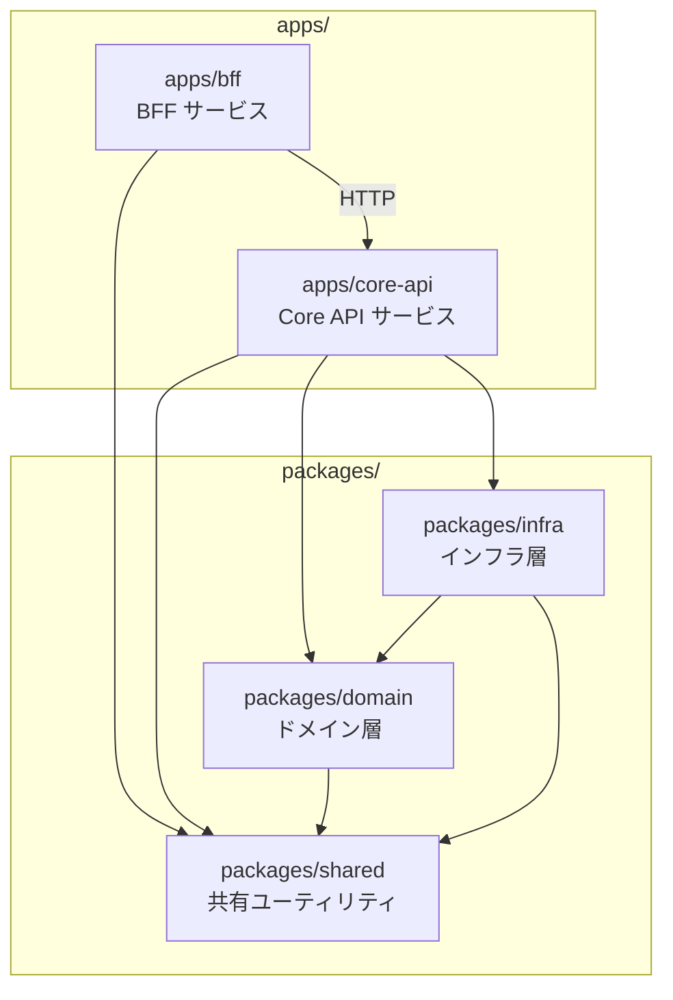
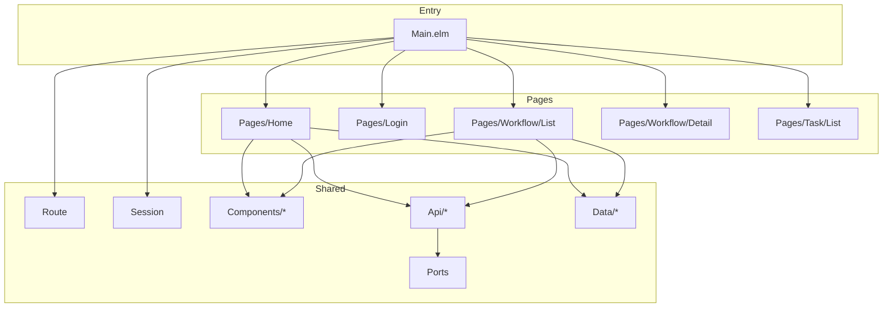
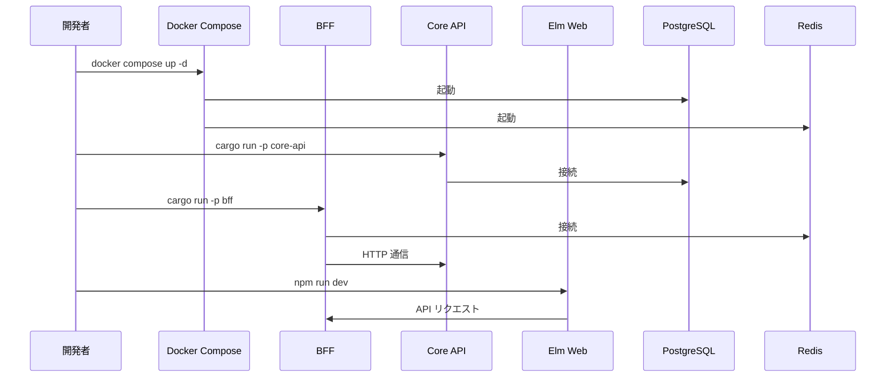

# RingiFlow プロジェクト構造設計

## 概要

本ドキュメントは、RingiFlow プロジェクトのリポジトリ構成、ディレクトリ構造、モジュール分割を定義する。

## リポジトリ構成

### 採用方式: モノレポ

```
ringiflow/                      # ルートリポジトリ
├── apps/                       # アプリケーション
│   ├── bff/                    # BFF サービス（Rust/axum）
│   ├── core-api/               # Core API サービス（Rust/axum）
│   └── web/                    # Elm フロントエンド
├── packages/                   # 共有クレート
├── infra/                      # Terraform
├── docs/                       # ドキュメント
├── prompts/                    # LLM プロンプト（テンプレ・運用）
└── tools/                      # 開発ツール・スクリプト
```

### 採用理由

| 観点 | モノレポのメリット |
|------|------------------|
| 学習効率 | 全体を一箇所で把握できる |
| 依存管理 | バージョン不整合が起きにくい |
| CI/CD | パイプラインが単純化 |
| リファクタリング | 横断的な変更が容易 |
| コードレビュー | 関連する変更をまとめて確認できる |

---

## 全体ディレクトリ構造

```
ringiflow/
├── .github/
│   └── workflows/
│       ├── ci.yml              # CI パイプライン
│       └── cd.yml              # CD パイプライン（将来）
│
├── apps/
│   ├── bff/                    # BFF サービス
│   │   ├── Cargo.toml
│   │   ├── src/
│   │   └── tests/
│   │
│   ├── core-api/               # Core API サービス
│   │   ├── Cargo.toml
│   │   ├── src/
│   │   ├── migrations/         # SQLx マイグレーション
│   │   └── tests/
│   │
│   └── web/                    # Elm フロントエンド
│       ├── elm.json
│       ├── src/
│       │   ├── Main.elm
│       │   ├── Pages/          # ページモジュール
│       │   ├── Components/     # UIコンポーネント
│       │   ├── Api/            # API クライアント
│       │   └── Ports.elm       # Ports 定義
│       ├── static/             # 静的アセット
│       ├── js/                 # JavaScript（Ports ブリッジ）
│       └── tests/              # elm-test
│
├── packages/                   # 共有クレート
│   ├── domain/                 # ドメイン層
│   │   ├── Cargo.toml
│   │   └── src/
│   ├── infra/                  # インフラ層（DB, Redis, etc.）
│   │   ├── Cargo.toml
│   │   └── src/
│   └── shared/                 # 共有ユーティリティ
│       ├── Cargo.toml
│       └── src/
│
├── infra/
│   ├── terraform/
│   │   ├── environments/
│   │   │   ├── dev/
│   │   │   ├── stg/
│   │   │   └── prod/
│   │   └── modules/
│   │       ├── vpc/
│   │       ├── ecs/
│   │       ├── rds/
│   │       └── ...
│   └── docker/
│       ├── docker-compose.yml  # ローカル開発環境
│       ├── bff.Dockerfile
│       ├── core-api.Dockerfile
│       └── web.Dockerfile
│
├── docs/
│   ├── 01_要件定義書/
│   ├── 02_設計書/
│   └── 03_手順書/
│
├── prompts/                    # LLM プロンプト（テンプレ・運用）
│   ├── templates/
│   └── runs/
│
├── tools/
│   └── scripts/                # 開発用スクリプト
│
├── Cargo.toml                  # ルートワークスペース定義
├── .gitignore
├── CLAUDE.md                   # Claude Code 用ガイダンス
├── README.md
└── justfile                    # タスクランナー
```

---

## Rust バックエンド構造

### Cargo Workspace 構成

BFF と Core API は独立したサービスとして分離し、共有コードは `packages/` 配下で管理する。
ルートに Cargo Workspace を配置し、全クレートを一元管理する。

```toml
# Cargo.toml（ルート）
[workspace]
resolver = "2"
members = [
    "apps/bff",
    "apps/core-api",
    "packages/domain",
    "packages/infra",
    "packages/shared",
]

[workspace.package]
version = "0.1.0"
edition = "2024"
rust-version = "1.92"
license = "MIT"

[workspace.dependencies]
# 内部クレート
domain = { path = "packages/domain" }
infra = { path = "packages/infra" }
shared = { path = "packages/shared" }

# Web フレームワーク
axum = "0.8"
tokio = { version = "1", features = ["full"] }
tower = "0.5"
tower-http = { version = "0.6", features = ["cors", "trace", "compression-gzip"] }

# シリアライゼーション
serde = { version = "1", features = ["derive"] }
serde_json = "1"

# データベース
sqlx = { version = "0.8", features = ["runtime-tokio", "postgres", "uuid", "chrono", "json"] }

# Redis
redis = { version = "0.27", features = ["tokio-comp", "connection-manager"] }

# ユーティリティ
uuid = { version = "1", features = ["v4", "v7", "serde"] }
chrono = { version = "0.4", features = ["serde"] }
thiserror = "2"
anyhow = "1"

# ロギング・トレーシング
tracing = "0.1"
tracing-subscriber = { version = "0.3", features = ["env-filter", "json"] }

# テスト
tokio-test = "0.4"
```

### サービス分離の意図

| 観点 | 説明 |
|------|------|
| 独立デプロイ | BFF と Core API を別々にデプロイ可能 |
| サービス境界 | API 契約による明確な境界を学習 |
| スケーリング | 負荷特性に応じた個別スケーリング |
| 障害分離 | 片方の障害が他方に波及しにくい |

### クレート構成図



### レイヤー依存関係と依存性逆転の原則

クレート間の依存方向は「外側から内側へ」を原則とする。
依存性逆転の詳細は技術ノートを参照。

→ [Cargo Workspace と依存性逆転](../05_技術ノート/Cargoワークスペース.md)

```
apps (api)
    ↓ 依存
packages/infra
    ↓ 依存
packages/domain
    ↓ 依存
packages/shared
```

| クレート | 役割 | 依存先 |
|---------|------|--------|
| `shared` | 共通ユーティリティ | なし（最も内側） |
| `domain` | エンティティ、trait 定義 | `shared` のみ |
| `infra` | trait 実装、外部連携 | `domain`, `shared` |
| `api` | HTTP ハンドラ、DI | 全クレート |

**重要: domain は infra に依存しない（依存性逆転の原則）**

### 各クレートの責務

#### `bff` - BFF サービス

```
apps/bff/
├── Cargo.toml
├── src/
│   ├── lib.rs
│   ├── main.rs                 # エントリーポイント
│   ├── config.rs               # 設定
│   ├── routes/                 # ルーティング
│   │   ├── mod.rs
│   │   ├── auth.rs             # 認証エンドポイント
│   │   └── api.rs              # Core API プロキシ
│   ├── middleware/             # ミドルウェア
│   │   ├── mod.rs
│   │   ├── session.rs          # セッション管理
│   │   ├── csrf.rs             # CSRF 防御
│   │   └── request_id.rs       # リクエストID付与
│   ├── session/                # セッション
│   │   ├── mod.rs
│   │   └── redis_store.rs
│   ├── client/                 # Core API クライアント
│   │   └── core_api.rs
│   └── error.rs                # エラーハンドリング
└── tests/                      # 統合テスト
```

責務:
- セッション管理（HTTPOnly Cookie + Redis）
- CSRF 防御
- Core API へのプロキシ
- セキュリティヘッダ付与
- レート制限

#### `core-api` - Core API サービス

```
apps/core-api/
├── Cargo.toml
├── src/
│   ├── lib.rs
│   ├── main.rs                 # エントリーポイント
│   ├── config.rs               # 設定
│   ├── routes/                 # ルーティング
│   │   ├── mod.rs
│   │   ├── workflows.rs        # ワークフロー API
│   │   ├── tasks.rs            # タスク API
│   │   ├── users.rs            # ユーザー API
│   │   └── health.rs           # ヘルスチェック
│   ├── handlers/               # リクエストハンドラ
│   │   ├── mod.rs
│   │   ├── workflow_handler.rs
│   │   └── task_handler.rs
│   ├── middleware/             # ミドルウェア
│   │   ├── mod.rs
│   │   ├── auth.rs             # 認証検証
│   │   └── tenant.rs           # テナントコンテキスト
│   └── error.rs                # エラーハンドリング
├── migrations/                 # SQLx マイグレーション
└── tests/                      # 統合テスト
```

責務:
- ビジネスロジックの実行
- ドメイン層の呼び出し
- 認可チェック

#### `domain` - ドメイン層（共有パッケージ）

```
packages/domain/
├── Cargo.toml
└── src/
    ├── lib.rs
    ├── entities/               # エンティティ
    │   ├── mod.rs
    │   ├── user.rs
    │   ├── tenant.rs
    │   ├── workflow.rs
    │   ├── workflow_definition.rs
    │   └── task.rs
    ├── value_objects/          # 値オブジェクト
    │   ├── mod.rs
    │   ├── email.rs
    │   ├── workflow_status.rs
    │   └── task_status.rs
    ├── services/               # ドメインサービス
    │   ├── mod.rs
    │   ├── workflow_service.rs
    │   └── auth_service.rs
    ├── repositories/           # リポジトリインターフェース
    │   ├── mod.rs
    │   ├── user_repository.rs
    │   ├── workflow_repository.rs
    │   └── task_repository.rs
    ├── events/                 # ドメインイベント（Phase 4）
    │   └── mod.rs
    └── errors.rs               # ドメインエラー
```

責務:
- ビジネスルールの定義
- エンティティ・値オブジェクトの定義
- リポジトリインターフェースの定義

#### `infra` - インフラ層（共有パッケージ）

```
packages/infra/
├── Cargo.toml
└── src/
    ├── lib.rs
    ├── database/               # データベース
    │   ├── mod.rs
    │   ├── pool.rs             # コネクションプール
    │   └── repositories/       # リポジトリ実装
    │       ├── mod.rs
    │       ├── user_repository.rs
    │       ├── workflow_repository.rs
    │       └── task_repository.rs
    ├── cache/                  # キャッシュ
    │   ├── mod.rs
    │   └── redis.rs
    └── external/               # 外部サービス（将来）
        └── mod.rs
```

責務:
- リポジトリの実装
- データベース接続管理
- キャッシュ操作
- 外部サービス連携

#### `shared` - 共有ユーティリティ（共有パッケージ）

```
packages/shared/
├── Cargo.toml
└── src/
    ├── lib.rs
    ├── config.rs               # 設定読み込み
    ├── telemetry.rs            # ロギング・トレーシング設定
    ├── error.rs                # 共通エラー型
    └── types.rs                # 共通型定義
```

責務:
- クレート横断で使用するユーティリティ
- 設定管理
- ロギング・トレーシング初期化

---

## Elm フロントエンド構造

```
apps/web/
├── elm.json
├── src/
│   ├── Main.elm                # エントリーポイント
│   ├── Route.elm               # ルーティング定義
│   ├── Session.elm             # セッション状態
│   │
│   ├── Pages/                  # ページモジュール
│   │   ├── Home.elm            # ダッシュボード
│   │   ├── Login.elm           # ログイン
│   │   ├── Workflow/
│   │   │   ├── List.elm        # ワークフロー一覧
│   │   │   ├── Detail.elm      # ワークフロー詳細
│   │   │   └── New.elm         # ワークフロー申請
│   │   ├── Task/
│   │   │   ├── List.elm        # タスク一覧
│   │   │   └── Detail.elm      # タスク詳細
│   │   └── NotFound.elm        # 404
│   │
│   ├── Components/             # 再利用可能コンポーネント
│   │   ├── Header.elm
│   │   ├── Sidebar.elm
│   │   ├── Button.elm
│   │   ├── Form.elm
│   │   ├── Table.elm
│   │   └── Modal.elm
│   │
│   ├── Api/                    # API クライアント
│   │   ├── Api.elm             # 共通処理
│   │   ├── Endpoint.elm        # エンドポイント定義
│   │   ├── Workflow.elm        # ワークフロー API
│   │   ├── Task.elm            # タスク API
│   │   └── Auth.elm            # 認証 API
│   │
│   ├── Data/                   # データモデル
│   │   ├── User.elm
│   │   ├── Workflow.elm
│   │   ├── Task.elm
│   │   └── Session.elm
│   │
│   └── Ports.elm               # Ports 定義
│
├── js/
│   ├── main.js                 # Elm 初期化
│   └── ports/
│       └── index.js            # Ports ブリッジ
│
├── static/
│   ├── index.html
│   └── styles/
│       └── main.css
│
├── tests/                      # elm-test
│   └── ...
│
├── vite.config.js              # Vite 設定
└── package.json
```

### Elm モジュール構成図



---

## Terraform 構造

```
infra/terraform/
├── environments/
│   ├── dev/
│   │   ├── main.tf
│   │   ├── variables.tf
│   │   ├── outputs.tf
│   │   └── terraform.tfvars
│   ├── stg/
│   │   └── ...
│   └── prod/
│       └── ...
│
├── modules/
│   ├── vpc/
│   │   ├── main.tf
│   │   ├── variables.tf
│   │   └── outputs.tf
│   ├── ecs/
│   │   └── ...
│   ├── rds/
│   │   └── ...
│   ├── elasticache/
│   │   └── ...
│   ├── s3/
│   │   └── ...
│   ├── alb/
│   │   └── ...
│   └── cloudfront/
│       └── ...
│
└── shared/
    └── backend.tf              # S3 バックエンド設定
```

### Terraform 設計意図

環境分離（environments/）:
- `dev`, `stg`, `prod` を完全に分離
- 同じモジュールを異なるパラメータで再利用
- State ファイルは環境ごとに分離（誤って本番を変更するリスクを軽減）

モジュール化（modules/）:
- 再利用可能なリソース定義を配置
- 環境間での一貫性を保証
- 変更の影響範囲を限定（vpc を変更しても ecs に影響しない）

State 管理（S3 + DynamoDB）:
- State ファイルを S3 に保存（ローカルに持たない）
- DynamoDB で State ロック（チーム開発での競合防止）
- S3 バージョニングで State の履歴を保持（誤操作からの復旧）

```hcl
# environments/dev/backend.tf
terraform {
  backend "s3" {
    bucket         = "ringiflow-terraform-state-{account-id}"
    key            = "dev/terraform.tfstate"  # 環境ごとに異なるキー
    region         = "ap-northeast-1"
    dynamodb_table = "ringiflow-terraform-lock"
    encrypt        = true
  }
}
```

この設計の利点:
- 環境ごとに独立して変更可能
- 本番への影響を最小化
- チーム開発で State の競合が発生しない

---

## Docker 構成

```
infra/docker/
├── docker-compose.yml    # ローカル開発用依存サービス
└── init/
    └── 01_extensions.sql # PostgreSQL 初期化スクリプト
```

### Docker 設計意図

ローカル開発環境の統一:
- 「自分の環境では動く」問題を防止
- 依存サービス（PostgreSQL, Redis）のバージョンを固定
- チームメンバー間で同一環境を保証

サービス構成:

| サービス | イメージ | ポート | 用途 |
|---------|---------|--------|------|
| postgres | postgres:17-alpine | 5432 | メインデータベース |
| redis | redis:7-alpine | 6379 | キャッシュ・セッション |

設計判断:
- Alpine イメージ採用（軽量、セキュリティ更新が速い）
- Healthcheck 設定（起動完了検知、CI での順序保証）
- 名前付きボリューム（データ永続化）

---

## 開発ワークフロー

### ローカル開発



### justfile タスク

```just
# 依存サービスの起動
dev-deps:
    docker compose -f infra/docker/docker-compose.yml up -d

# BFF の起動（ポート 3000）
dev-bff:
    cargo run -p bff

# Core API の起動（ポート 3001）
dev-core-api:
    cargo run -p core-api

# フロントエンドの起動
dev-web:
    cd apps/web && npm run dev

# 全体起動（別ターミナルで各サービスを起動）
dev: dev-deps
    @echo "依存サービスを起動しました"
    @echo "別ターミナルで以下を実行してください:"
    @echo "  just dev-core-api"
    @echo "  just dev-bff"
    @echo "  just dev-web"

# テスト実行
test:
    cargo test --workspace
    cd apps/web && npx elm-test

# リント
lint:
    cargo fmt --check
    cargo clippy --workspace
    cd apps/web && npx elm-format --validate src/

# ビルド
build:
    cargo build --release --workspace
    cd apps/web && npm run build
```

---

## 命名規則

### Rust

| 種別 | 規則 | 例 |
|------|------|-----|
| クレート名 | kebab-case | `core-api`, `ringiflow-domain` |
| モジュール名 | snake_case | `workflow_service` |
| 構造体/列挙型 | PascalCase | `Workflow`, `TaskStatus` |
| 関数/メソッド | snake_case | `create_workflow` |
| 定数 | SCREAMING_SNAKE_CASE | `MAX_RETRY_COUNT` |

### Elm

| 種別 | 規則 | 例 |
|------|------|-----|
| モジュール名 | PascalCase | `Pages.Workflow.List` |
| 型名 | PascalCase | `Workflow`, `Model` |
| 関数名 | camelCase | `viewWorkflowList` |
| メッセージ型 | PascalCase | `GotWorkflows`, `ClickedApprove` |

### ファイル・ディレクトリ

| 種別 | 規則 | 例 |
|------|------|-----|
| Rust ファイル | snake_case | `workflow_service.rs` |
| Elm ファイル | PascalCase | `WorkflowList.elm` |
| ディレクトリ | 小文字またはPascalCase | `routes/`, `Pages/` |
| ドキュメント | 日本語可、連番プレフィックス | `01_プロジェクト構造設計.md` |

---

## 変更履歴

| 日付 | 変更内容 | 担当 |
|------|---------|------|
| 2026-01-12 | 初版作成 | - |
