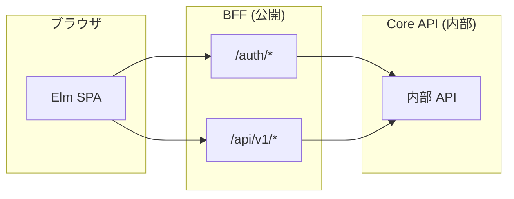
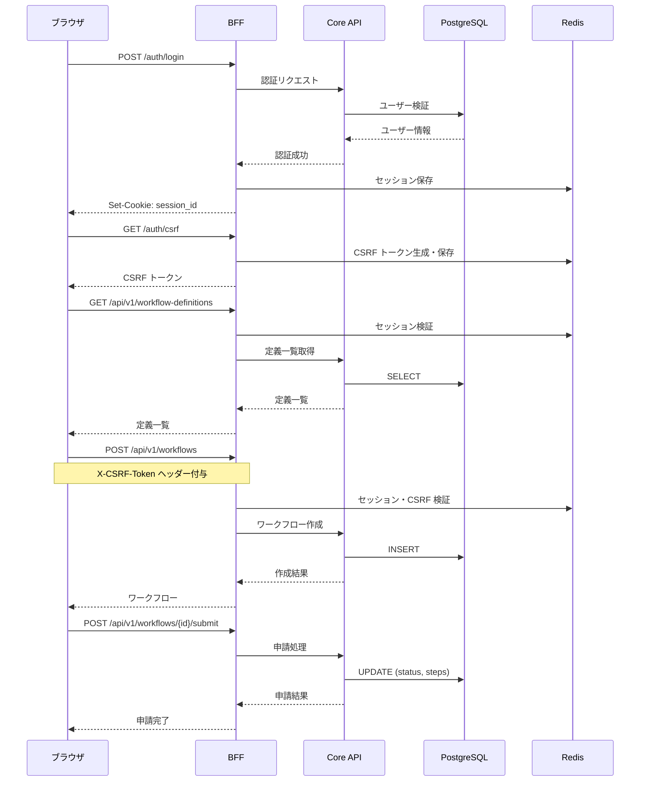
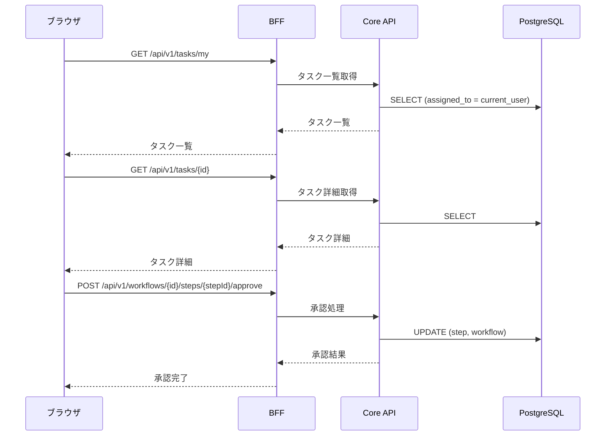

# RingiFlow API 設計（MVP）

## 概要

本ドキュメントは、RingiFlow MVP（Phase 1）の API 設計を定義する。

### 設計方針

- **RESTful**: リソース指向の URL 設計
- **JSON**: リクエスト/レスポンスは JSON 形式
- **BFF パターン**: ブラウザは BFF とのみ通信
- **エラーレスポンス**: RFC 7807 Problem Details 形式

### エンドポイント構成



---

## 共通仕様

### ベース URL

| 環境 | URL |
|------|-----|
| ローカル | `http://localhost:3000` |
| 開発 | `https://dev.ringiflow.example.com` |
| 本番 | `https://app.ringiflow.example.com` |

### リクエストヘッダー

| ヘッダー | 必須 | 説明 |
|---------|------|------|
| Content-Type | ○（POST/PUT/PATCH） | `application/json` |
| X-CSRF-Token | ○（状態変更） | CSRF トークン |
| X-Request-ID | - | リクエスト追跡用（自動生成） |

### レスポンスヘッダー

| ヘッダー | 説明 |
|---------|------|
| X-Request-ID | リクエスト追跡用 ID |
| X-RateLimit-Limit | レート制限上限 |
| X-RateLimit-Remaining | 残りリクエスト数 |
| X-RateLimit-Reset | リセット時刻（Unix タイムスタンプ） |

### 成功レスポンス

```json
// 単一リソース
{
  "data": { ... }
}

// リスト
{
  "data": [ ... ],
  "pagination": {
    "page": 1,
    "per_page": 20,
    "total_pages": 5,
    "total_count": 100
  }
}
```

### エラーレスポンス（RFC 7807）

```json
{
  "type": "https://ringiflow.example.com/errors/validation-error",
  "title": "Validation Error",
  "status": 400,
  "detail": "リクエストの検証に失敗しました",
  "instance": "/api/v1/workflows",
  "correlation_id": "550e8400-e29b-41d4-a716-446655440000",
  "errors": [
    {
      "field": "title",
      "code": "required",
      "message": "タイトルは必須です"
    }
  ]
}
```

### HTTP ステータスコード

| コード | 説明 | 使用場面 |
|--------|------|---------|
| 200 | OK | 取得・更新成功 |
| 201 | Created | 作成成功 |
| 204 | No Content | 削除成功 |
| 400 | Bad Request | バリデーションエラー |
| 401 | Unauthorized | 未認証 |
| 403 | Forbidden | 権限不足 |
| 404 | Not Found | リソースなし |
| 409 | Conflict | 競合（楽観ロック失敗等） |
| 422 | Unprocessable Entity | ビジネスルール違反 |
| 429 | Too Many Requests | レート制限超過 |
| 500 | Internal Server Error | サーバーエラー |

---

## 認証 API

### POST /auth/login

メール/パスワードでログインする。

**リクエスト:**
```json
{
  "email": "user@example.com",
  "password": "password123"
}
```

**レスポンス（200 OK）:**
```json
{
  "data": {
    "user": {
      "id": "550e8400-e29b-41d4-a716-446655440000",
      "email": "user@example.com",
      "name": "山田 太郎",
      "tenant_id": "550e8400-e29b-41d4-a716-446655440001",
      "roles": ["user"]
    }
  }
}
```

**エラー（401 Unauthorized）:**
```json
{
  "type": "https://ringiflow.example.com/errors/authentication-failed",
  "title": "Authentication Failed",
  "status": 401,
  "detail": "メールアドレスまたはパスワードが正しくありません"
}
```

**セッション Cookie:**
```
Set-Cookie: session_id=xxx; HttpOnly; Secure; SameSite=Lax; Path=/; Max-Age=28800
```

---

### POST /auth/logout

ログアウトする。

**リクエスト:** なし（Cookie のセッション ID を使用）

**レスポンス（204 No Content）:** 空

**Cookie:**
```
Set-Cookie: session_id=; HttpOnly; Secure; SameSite=Lax; Path=/; Max-Age=0
```

---

### GET /auth/me

現在のユーザー情報を取得する。

**レスポンス（200 OK）:**
```json
{
  "data": {
    "id": "550e8400-e29b-41d4-a716-446655440000",
    "email": "user@example.com",
    "name": "山田 太郎",
    "tenant_id": "550e8400-e29b-41d4-a716-446655440001",
    "tenant_name": "株式会社サンプル",
    "roles": ["user"],
    "permissions": ["workflow:read", "workflow:create", "task:read", "task:update"]
  }
}
```

**エラー（401 Unauthorized）:**
```json
{
  "type": "https://ringiflow.example.com/errors/unauthorized",
  "title": "Unauthorized",
  "status": 401,
  "detail": "認証が必要です"
}
```

---

### GET /auth/csrf

CSRF トークンを取得する。

**レスポンス（200 OK）:**
```json
{
  "data": {
    "token": "xxx..."
  }
}
```

---

## ワークフロー API

### GET /api/v1/workflows

ワークフロー一覧を取得する。

**クエリパラメータ:**

| パラメータ | 型 | 必須 | デフォルト | 説明 |
|-----------|------|------|------------|------|
| page | integer | - | 1 | ページ番号 |
| per_page | integer | - | 20 | 1ページあたりの件数（max: 100） |
| status | string | - | - | ステータスでフィルタ |
| initiated_by_me | boolean | - | false | 自分が申請したもののみ |
| sort | string | - | created_at | ソートキー |
| order | string | - | desc | ソート順（asc/desc） |

**レスポンス（200 OK）:**
```json
{
  "data": [
    {
      "id": "550e8400-e29b-41d4-a716-446655440000",
      "title": "経費申請 - 出張費",
      "definition_name": "経費申請",
      "status": "pending",
      "current_step_name": "上長承認",
      "initiated_by": {
        "id": "...",
        "name": "山田 太郎"
      },
      "submitted_at": "2025-01-12T10:00:00Z",
      "created_at": "2025-01-12T09:00:00Z"
    }
  ],
  "pagination": {
    "page": 1,
    "per_page": 20,
    "total_pages": 5,
    "total_count": 100
  }
}
```

---

### POST /api/v1/workflows

ワークフローを作成する（下書き）。

**リクエスト:**
```json
{
  "definition_id": "550e8400-e29b-41d4-a716-446655440001",
  "title": "経費申請 - 出張費",
  "form_data": {
    "title": "東京出張",
    "description": "クライアント訪問のための出張"
  }
}
```

**レスポンス（201 Created）:**
```json
{
  "data": {
    "id": "550e8400-e29b-41d4-a716-446655440000",
    "title": "経費申請 - 出張費",
    "definition_id": "550e8400-e29b-41d4-a716-446655440001",
    "definition_name": "経費申請",
    "status": "draft",
    "form_data": {
      "title": "東京出張",
      "description": "クライアント訪問のための出張"
    },
    "initiated_by": {
      "id": "...",
      "name": "山田 太郎"
    },
    "created_at": "2025-01-12T09:00:00Z"
  }
}
```

---

### GET /api/v1/workflows/{id}

ワークフロー詳細を取得する。

**レスポンス（200 OK）:**
```json
{
  "data": {
    "id": "550e8400-e29b-41d4-a716-446655440000",
    "title": "経費申請 - 出張費",
    "definition_id": "550e8400-e29b-41d4-a716-446655440001",
    "definition_name": "経費申請",
    "definition_version": 1,
    "status": "in_progress",
    "form_data": {
      "title": "東京出張",
      "description": "クライアント訪問のための出張"
    },
    "current_step": {
      "id": "...",
      "step_id": "approval",
      "step_name": "上長承認",
      "status": "active",
      "assigned_to": {
        "id": "...",
        "name": "鈴木 部長"
      }
    },
    "initiated_by": {
      "id": "...",
      "name": "山田 太郎"
    },
    "submitted_at": "2025-01-12T10:00:00Z",
    "created_at": "2025-01-12T09:00:00Z",
    "updated_at": "2025-01-12T10:00:00Z",
    "steps": [
      {
        "id": "...",
        "step_id": "approval",
        "step_name": "上長承認",
        "step_type": "approval",
        "status": "active",
        "assigned_to": {
          "id": "...",
          "name": "鈴木 部長"
        },
        "started_at": "2025-01-12T10:00:00Z"
      }
    ]
  }
}
```

---

### PUT /api/v1/workflows/{id}

ワークフローを更新する（下書き状態のみ）。

**リクエスト:**
```json
{
  "title": "経費申請 - 出張費（修正）",
  "form_data": {
    "title": "東京出張",
    "description": "クライアント訪問のための出張（更新）"
  }
}
```

**レスポンス（200 OK）:** 更新後のワークフロー

---

### DELETE /api/v1/workflows/{id}

ワークフローを削除する（下書き状態のみ）。

**レスポンス（204 No Content）:** 空

---

### POST /api/v1/workflows/{id}/submit

ワークフローを申請する。

**リクエスト:**
```json
{
  "assigned_to": "550e8400-e29b-41d4-a716-446655440002"
}
```

**レスポンス（200 OK）:**
```json
{
  "data": {
    "id": "...",
    "status": "pending",
    "current_step": {
      "step_id": "approval",
      "step_name": "承認",
      "assigned_to": {
        "id": "550e8400-e29b-41d4-a716-446655440002",
        "name": "鈴木 部長"
      }
    },
    "submitted_at": "2025-01-12T10:00:00Z"
  }
}
```

**エラー（422 Unprocessable Entity）:**
```json
{
  "type": "https://ringiflow.example.com/errors/invalid-workflow-state",
  "title": "Invalid Workflow State",
  "status": 422,
  "detail": "下書き状態のワークフローのみ申請できます"
}
```

---

### POST /api/v1/workflows/{id}/cancel

ワークフローを取り消す。

**リクエスト:**
```json
{
  "reason": "誤って申請したため"
}
```

**レスポンス（200 OK）:**
```json
{
  "data": {
    "id": "...",
    "status": "cancelled"
  }
}
```

---

### POST /api/v1/workflows/{id}/steps/{stepId}/approve

ステップを承認する。

**リクエスト:**
```json
{
  "comment": "承認します"
}
```

**レスポンス（200 OK）:**
```json
{
  "data": {
    "workflow": {
      "id": "...",
      "status": "approved",
      "completed_at": "2025-01-12T11:00:00Z"
    },
    "step": {
      "id": "...",
      "step_id": "approval",
      "status": "completed",
      "decision": "approved",
      "comment": "承認します",
      "completed_at": "2025-01-12T11:00:00Z"
    }
  }
}
```

---

### POST /api/v1/workflows/{id}/steps/{stepId}/reject

ステップを却下する。

**リクエスト:**
```json
{
  "comment": "内容に不備があるため却下します"
}
```

**レスポンス（200 OK）:**
```json
{
  "data": {
    "workflow": {
      "id": "...",
      "status": "rejected",
      "completed_at": "2025-01-12T11:00:00Z"
    },
    "step": {
      "id": "...",
      "step_id": "approval",
      "status": "completed",
      "decision": "rejected",
      "comment": "内容に不備があるため却下します",
      "completed_at": "2025-01-12T11:00:00Z"
    }
  }
}
```

---

## タスク API

### GET /api/v1/tasks/my

自分に割り当てられたタスク一覧を取得する。

**クエリパラメータ:**

| パラメータ | 型 | 必須 | デフォルト | 説明 |
|-----------|------|------|------------|------|
| page | integer | - | 1 | ページ番号 |
| per_page | integer | - | 20 | 1ページあたりの件数 |
| status | string | - | active | ステータス（active/completed/all） |

**レスポンス（200 OK）:**
```json
{
  "data": [
    {
      "id": "550e8400-e29b-41d4-a716-446655440000",
      "step_name": "上長承認",
      "workflow": {
        "id": "...",
        "title": "経費申請 - 出張費",
        "definition_name": "経費申請",
        "initiated_by": {
          "id": "...",
          "name": "山田 太郎"
        }
      },
      "status": "active",
      "due_date": null,
      "started_at": "2025-01-12T10:00:00Z"
    }
  ],
  "pagination": {
    "page": 1,
    "per_page": 20,
    "total_pages": 1,
    "total_count": 5
  }
}
```

---

### GET /api/v1/tasks/{id}

タスク詳細を取得する。

**レスポンス（200 OK）:**
```json
{
  "data": {
    "id": "550e8400-e29b-41d4-a716-446655440000",
    "step_id": "approval",
    "step_name": "上長承認",
    "step_type": "approval",
    "status": "active",
    "workflow": {
      "id": "...",
      "title": "経費申請 - 出張費",
      "definition_name": "経費申請",
      "form_data": {
        "title": "東京出張",
        "description": "クライアント訪問のための出張"
      },
      "initiated_by": {
        "id": "...",
        "name": "山田 太郎"
      },
      "submitted_at": "2025-01-12T10:00:00Z"
    },
    "actions": ["approve", "reject"],
    "due_date": null,
    "started_at": "2025-01-12T10:00:00Z"
  }
}
```

---

## ワークフロー定義 API

### GET /api/v1/workflow-definitions

公開されているワークフロー定義一覧を取得する。

**レスポンス（200 OK）:**
```json
{
  "data": [
    {
      "id": "550e8400-e29b-41d4-a716-446655440001",
      "name": "汎用申請",
      "description": "シンプルな1段階承認ワークフロー",
      "version": 1
    }
  ]
}
```

---

### GET /api/v1/workflow-definitions/{id}

ワークフロー定義詳細を取得する（フォーム構造を含む）。

**レスポンス（200 OK）:**
```json
{
  "data": {
    "id": "550e8400-e29b-41d4-a716-446655440001",
    "name": "汎用申請",
    "description": "シンプルな1段階承認ワークフロー",
    "version": 1,
    "form": {
      "fields": [
        {"id": "title", "type": "text", "label": "件名", "required": true, "maxLength": 100},
        {"id": "description", "type": "textarea", "label": "内容", "required": true, "maxLength": 2000}
      ]
    }
  }
}
```

---

## ダッシュボード API

### GET /api/v1/dashboard/stats

ダッシュボード統計を取得する。

**レスポンス（200 OK）:**
```json
{
  "data": {
    "pending_tasks": 3,
    "my_workflows_in_progress": 2,
    "completed_today": 5
  }
}
```

---

## ユーザー API

### GET /api/v1/users

ユーザー一覧を取得する（承認者選択用）。

**クエリパラメータ:**

| パラメータ | 型 | 必須 | デフォルト | 説明 |
|-----------|------|------|------------|------|
| q | string | - | - | 名前・メールで検索 |
| status | string | - | active | ステータス |
| limit | integer | - | 20 | 取得件数 |

**レスポンス（200 OK）:**
```json
{
  "data": [
    {
      "id": "550e8400-e29b-41d4-a716-446655440002",
      "name": "鈴木 部長",
      "email": "suzuki@example.com"
    }
  ]
}
```

---

## ヘルスチェック API

### GET /health

ヘルスチェック（BFF）。

**レスポンス（200 OK）:**
```json
{
  "status": "healthy",
  "version": "0.1.0",
  "timestamp": "2025-01-12T10:00:00Z"
}
```

### GET /health/ready

レディネスチェック（依存サービス含む）。

**レスポンス（200 OK）:**
```json
{
  "status": "ready",
  "checks": {
    "database": "ok",
    "redis": "ok",
    "core_api": "ok"
  }
}
```

---

## API フロー図

### ログイン〜ワークフロー申請



### タスク承認



---

## 変更履歴

| 日付 | 変更内容 | 担当 |
|------|---------|------|
| 2025-01-12 | 初版作成（MVP 範囲） | - |
