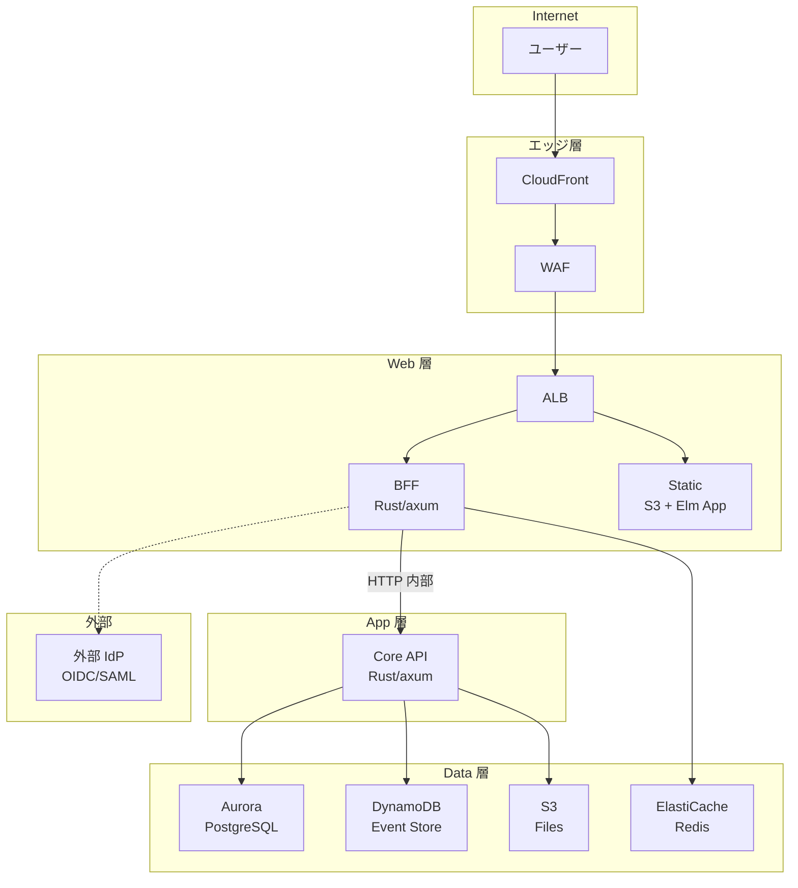
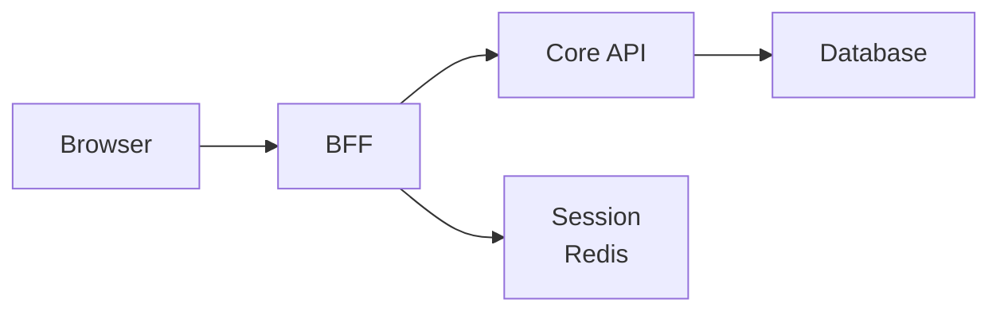
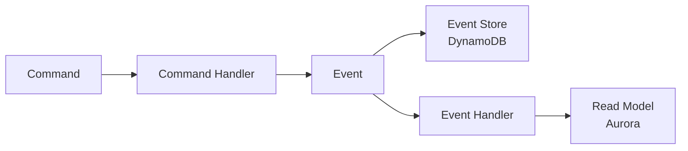
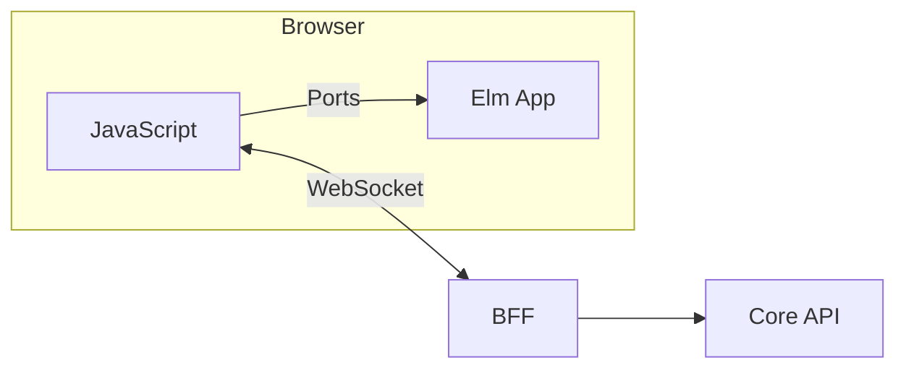
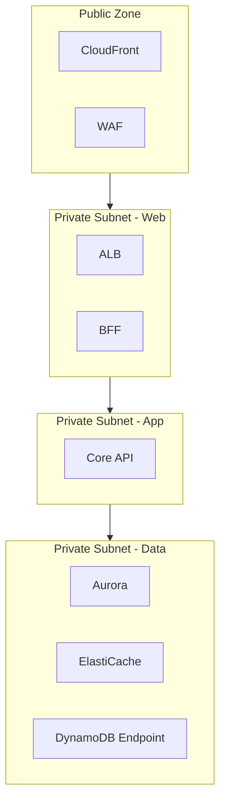

# アーキテクチャ概要

## 概要

本ドキュメントは RingiFlow のシステムアーキテクチャの全体像を定義する。

## システム構成図



## レイヤー構成

| レイヤー | 責務 | 技術 |
|---------|------|------|
| CDN | 静的配信、キャッシュ、DDoS 緩和 | CloudFront |
| WAF | Web アプリケーション防御 | AWS WAF |
| LB | ルーティング、TLS 終端 | ALB |
| BFF | セッション管理、認証、API プロキシ | Rust/axum |
| Core API | ビジネスロジック、ドメイン処理 | Rust/axum |
| Data | 永続化、キャッシュ | Aurora, DynamoDB, S3, Redis |

## 主要なアーキテクチャパターン

### BFF パターン

ブラウザは BFF（Backend for Frontend）とのみ通信する。



利点:
- トークンをフロントエンドに露出しない
- セッション管理をサーバサイドに集約
- フロントエンド向けに最適化された API を提供

### セッション管理

HTTPOnly Cookie + Redis によるサーバサイドセッション。

| 項目 | 値 |
|------|-----|
| Cookie 属性 | HttpOnly, Secure, SameSite=Strict |
| セッションストア | ElastiCache Redis |
| セッション ID | UUID v4 |
| 有効期限 | 設定可能（デフォルト 24 時間） |

### マルチテナント

Pool モデル（共有 DB + tenant_id による行レベル分離）。

```sql
-- すべてのテーブルに tenant_id を持つ
CREATE TABLE tasks (
    id UUID PRIMARY KEY,
    tenant_id UUID NOT NULL,  -- 分離キー
    ...
);

-- Row Level Security (RLS) で強制
ALTER TABLE tasks ENABLE ROW LEVEL SECURITY;
CREATE POLICY tenant_isolation ON tasks
    USING (tenant_id = current_setting('app.tenant_id')::UUID);
```

### イベント駆動

CQRS + Event Sourcing パターン。



特徴:
- コマンドとクエリの分離
- イベントによる状態変更の記録
- 結果整合性モデル

### WebSocket 通信

接続管理は JavaScript 側、Elm は Ports 経由でイベントを受信。



## コンポーネント間通信

| 通信 | プロトコル | 認証 |
|------|-----------|------|
| Browser → BFF | HTTPS | Session Cookie |
| BFF → Core API | HTTP (内部) | 内部トークン or mTLS |
| Core API → Aurora | PostgreSQL | IAM 認証 |
| Core API → DynamoDB | HTTPS | IAM 認証 |
| Core API → S3 | HTTPS | IAM 認証 |
| BFF → Redis | Redis Protocol | AUTH |

## セキュリティ境界



## 関連ドキュメント

- プロジェクト構造: [01_プロジェクト構造設計.md](01_プロジェクト構造設計.md)
- データベース設計: [02_データベース設計_MVP.md](02_データベース設計_MVP.md)
- API 設計: [03_API設計_MVP.md](03_API設計_MVP.md)

## 変更履歴

| 日付 | 変更内容 | 担当 |
|------|---------|------|
| 2026-01-13 | 初版作成（CLAUDE.md から分離） | - |
