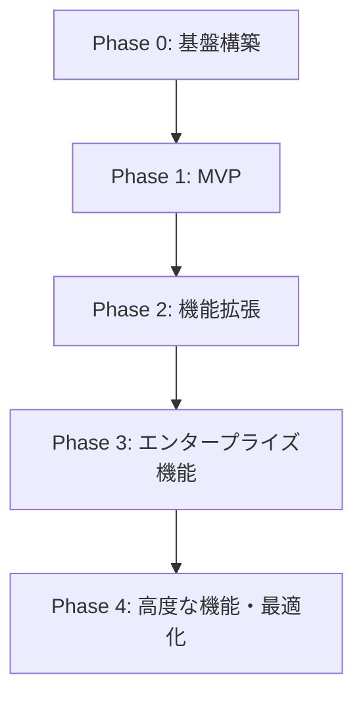
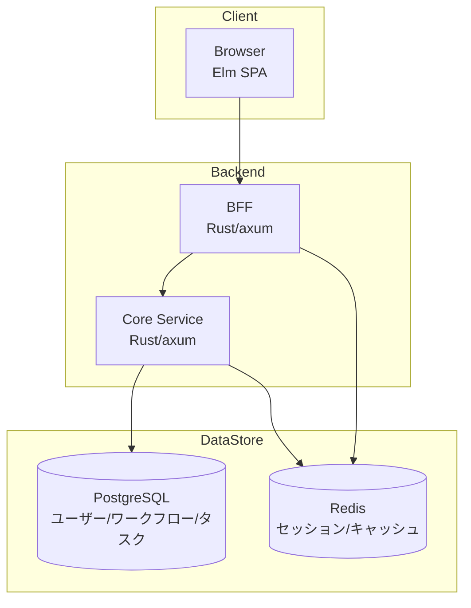
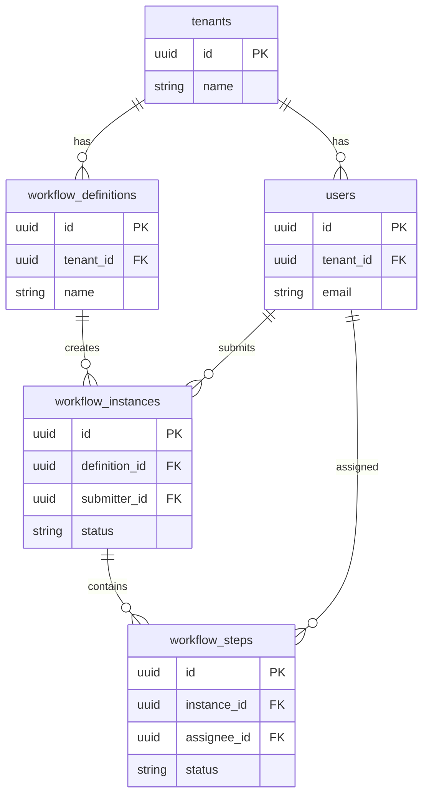
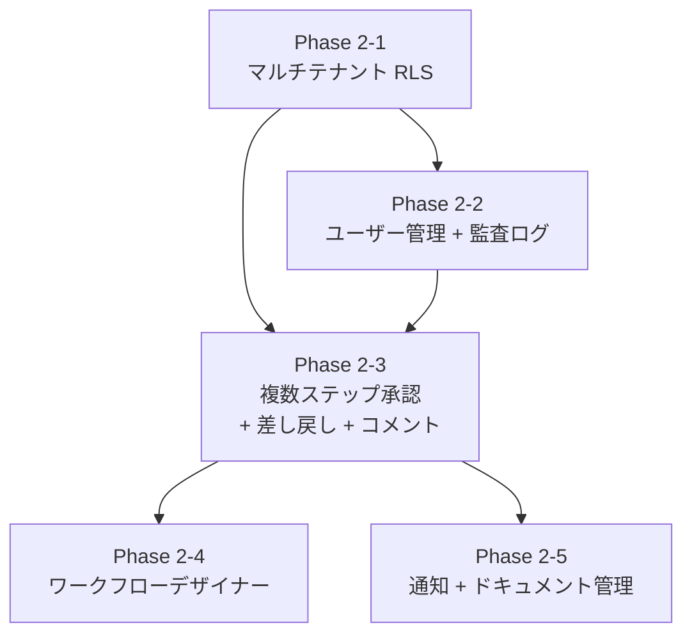

# RingiFlow 実装ロードマップ

## 概要

本ドキュメントは、RingiFlow の実装計画を定義する。
学習効果を最大化しつつ、段階的に機能を拡張するフェーズ分割を採用する。

## 進捗管理

進捗は GitHub Projects / Milestones で管理する。

- [Project Board](https://github.com/users/ka2kama/projects/1)
- [Milestones](https://github.com/ka2kama/ringiflow/milestones)

---

## フェーズ概要

---

## 進め方サマリー

### 各フェーズの概要

| Phase | 目的 | 何を作るか | どう進めるか |
|-------|------|-----------|-------------|
| 0 | 開発基盤を整える | 環境・雛形 | 手順書に従いファイル作成、ビルド確認 |
| 1 | 動く MVP を作る | 申請→承認→完了が動くシステム | DB → API → BFF → フロントの順で実装 |
| 2 | 実用機能を追加 | マルチテナント RLS、承認フロー拡張、デザイナー、通知、ドキュメント | 5 サブフェーズで段階的に拡張 |
| 3 | 企業向け機能追加 | SSO/MFA、複雑なフロー | 認証強化、ワークフローエンジン拡張 |
| 4 | 高度なアーキテクチャ | イベント駆動、リアルタイム | CQRS/ES/Kafka でアーキテクチャ刷新 |

### Phase 0 の進め方

手順書（[`docs/04_手順書/`](../04_手順書/)）に従い、以下の順序で実行する:

1. リポジトリ構造構築 → ディレクトリ、justfile、rust-toolchain.toml
2. Rust プロジェクト構築 → Cargo workspace、BFF/Core Service スケルトン
3. Elm プロジェクト構築 → elm.json、Vite 設定、Main.elm
4. Docker 環境構築 → docker-compose.yaml（PostgreSQL, Redis）
5. CI/CD 構築 → GitHub Actions ワークフロー
6. Terraform 基盤構築 → モジュール構造（適用はしない）

AWS へのデプロイは Phase 0 では行わない。ローカル開発環境の構築に集中する。

### Phase 1 の進め方

以下の順序で実装を進める:

1. DB スキーマ作成（SQLx マイグレーション）
2. Core Service 実装（エンティティ、リポジトリ、ユースケース）
3. BFF 実装（セッション管理、認証、Core Service プロキシ）
4. Elm フロントエンド実装（ページ、コンポーネント、API クライアント）
5. 結合テスト・動作確認
6. AWS デプロイ（Terraform 適用）

### Phase 2 の進め方

Phase 1 の基盤を維持しつつ、5 サブフェーズで段階的に機能を追加する:

1. **Phase 2-1**: マルチテナント RLS — DB レベルのテナント分離（全機能の基盤）
2. **Phase 2-2**: ユーザー管理 + 監査ログ — RLS の実運用検証 + 横断的基盤
3. **Phase 2-3**: 複数ステップ承認 + 差し戻し + コメント — ワークフロー実行層の拡張
4. **Phase 2-4**: ワークフローデザイナー — GUI でのフロー設計
5. **Phase 2-5**: 通知 + ドキュメント管理 — AWS サービス連携（SES, S3）

各サブフェーズの詳細は後述の「Phase 2: 機能拡張」セクションを参照。

### Phase 3〜4 の進め方

Phase 2 の基盤を維持しつつ、エンタープライズ機能・高度なアーキテクチャを追加する。
各フェーズの詳細は後述のセクションを参照。

---

## Phase 0: 基盤構築

### 目的
- 開発環境の整備
- プロジェクト構造の確立
- インフラ基礎の構築

### 成果物

| カテゴリ | 成果物 | 詳細 |
|---------|--------|------|
| プロジェクト | リポジトリ構成 | モノレポ or マルチレポの決定、ディレクトリ構造 |
| バックエンド | Rust プロジェクト雛形 | axum セットアップ、レイヤー構造、エラーハンドリング基盤 |
| フロントエンド | Elm プロジェクト雛形 | TEA 構造、Ports 基盤、ルーティング |
| インフラ | ローカル開発環境 | Docker Compose（PostgreSQL, Redis） |
| インフラ | Terraform 基盤 | AWS プロバイダ設定、ステート管理、モジュール構成 |
| CI/CD | GitHub Actions | lint, test, build の基本パイプライン |
| ドキュメント | 開発環境構築手順 | README、セットアップガイド |
| ドキュメント | コーディング規約 | Rust / Elm スタイルガイド |

### 技術的決定事項

| 項目 | 決定 | 理由 |
|------|------|------|
| リポジトリ構成 | モノレポ | 学習目的で全体を把握しやすい、CI/CD が単純化 |
| パッケージマネージャ | Cargo workspace | 複数クレートの統合管理 |
| Elm ビルド | elm make + Vite | シンプルかつ高速 |
| ローカル DB | PostgreSQL 18 | Aurora 互換 |
| ローカル キャッシュ | Redis 8 | ElastiCache 互換 |

### 完了基準

- `cargo build` が成功する
- `elm make` が成功する
- Docker Compose で PostgreSQL/Redis が起動する
- ヘルスチェックエンドポイント `/health` が応答する
- GitHub Actions で CI が通る

---

## Phase 1: MVP（Minimum Viable Product）

### 目的
- 最小限の動作するワークフローシステムを構築
- エンドツーエンドの基本フローを確立

### スコープ

#### 含めるもの

| 機能 | 詳細 | 要件ID |
|------|------|--------|
| 認証（基本） | メール/パスワードログイン、ログアウト | AUTH-001, AUTH-007 |
| セッション管理 | HTTPOnly Cookie、Redis セッション | AUTH-007, AUTH-010 |
| テナント基盤 | シングルテナント（マルチテナント準備のみ） | CORE-03 |
| ワークフロー定義（簡易） | 固定テンプレート（1段階承認） | WF-001 |
| ワークフロー申請 | フォーム入力、申請実行 | WF-101 |
| ワークフロー承認 | 単一承認者による承認/却下 | WF-102 |
| タスク一覧 | 自分に割り当てられたタスク表示 | TASK-007 |
| タスク詳細 | 承認/却下アクション | TASK-001 |
| ダッシュボード | 承認待ち件数、申請中件数 | KPI-001, KPI-004 |
| API | REST API（BFF経由） | API-001 |

#### 含めないもの（Phase 2 以降）
- SSO/OIDC/SAML
- MFA
- 複雑なワークフロー（並列承認、条件分岐）
- ドキュメント管理
- 通知（メール/Slack）
- WebSocket リアルタイム更新
- イベントソーシング（CRUD で実装）
- 全文検索

### アーキテクチャ（MVP）

BFF の責務: セッション管理、CSRF 防御、API 集約

Core Service の責務: ビジネスロジック、データアクセス

### 画面一覧（MVP）

| 画面ID | 画面名 | 機能 |
|--------|--------|------|
| SCR-001 | ログイン | メール/パスワード入力 |
| SCR-002 | ダッシュボード | KPI表示、クイックアクセス |
| SCR-003 | ワークフロー一覧 | 申請済み/承認待ちのリスト |
| SCR-004 | ワークフロー詳細 | 進捗、履歴、アクション |
| SCR-005 | ワークフロー申請 | フォーム入力、申請 |
| SCR-007 | タスク一覧 | 自分のタスクリスト |
| SCR-008 | タスク詳細 | 承認/却下アクション |

### データベース（MVP）

### API エンドポイント（MVP）

| メソッド | パス | 説明 |
|---------|------|------|
| POST | `/api/v1/auth/login` | ログイン |
| POST | `/api/v1/auth/logout` | ログアウト |
| GET | `/api/v1/auth/me` | 現在のユーザー情報 |
| GET | `/api/v1/workflows` | ワークフロー一覧 |
| POST | `/api/v1/workflows` | ワークフロー作成 |
| GET | `/api/v1/workflows/{id}` | ワークフロー詳細 |
| POST | `/api/v1/workflows/{id}/submit` | 申請 |
| POST | `/api/v1/workflows/{id}/steps/{stepId}/approve` | 承認 |
| POST | `/api/v1/workflows/{id}/steps/{stepId}/reject` | 却下 |
| GET | `/api/v1/tasks/my` | 自分のタスク一覧 |
| GET | `/api/v1/tasks/{id}` | タスク詳細 |
| GET | `/api/v1/dashboard/stats` | ダッシュボード統計 |

### 完了基準

- ユーザーがログインできる
- ワークフローを申請できる
- 承認者がタスク一覧から案件を確認できる
- 承認/却下ができ、ワークフローが完了する
- ダッシュボードに統計が表示される

---

## Phase 2: 機能拡張

### 目的
- マルチテナントの DB レベル分離（RLS）による本番品質のセキュリティ確立
- ワークフローの柔軟性向上（複数ステップ承認、差し戻し、GUI 設計）
- 外部サービス連携（メール通知、ドキュメント管理）
- 管理機能の追加（ユーザー管理、監査ログ）

### スコープ

| 機能 | 詳細 | 要件ID | サブフェーズ |
|------|------|--------|------------|
| マルチテナント RLS | PostgreSQL RLS による DB レベル分離 | CORE-03, AUTHZ-003 | 2-1 |
| ユーザー管理 | テナント内ユーザー CRUD、ロール割り当て | ADM-002, ADM-003 | 2-2 |
| 監査ログ（基本） | 操作履歴の記録・閲覧 | RPT-004 | 2-2 |
| 複数ステップ承認 | 順次承認（2〜3段階） | WF-002 | 2-3 |
| 差し戻し | 前ステップへの差し戻し | WF-103 | 2-3 |
| コメント機能 | タスクへのコメント | TASK-005 | 2-3 |
| ワークフローデザイナー | GUI でのフロー設計（基本） | WF-001, WFD-001〜005 | 2-4 |
| 通知（メール） | 承認依頼、完了通知 | NOTIFY-001 | 2-5 |
| ドキュメント管理（基本） | ファイルアップロード、一覧 | DOC-001, DOC-003 | 2-5 |

### サブフェーズ構成

9 機能を依存関係・学習効果・プロダクト完成度の 3 軸で 5 サブフェーズに分割する。

#### Phase 2-1: マルチテナント RLS

全機能の基盤。PostgreSQL RLS で DB レベルのテナント分離を実現する。

二重防御（アプリケーション層 + DB 層）が実装済み。全 9 テナントスコープテーブルに RLS ポリシーを適用し、アプリケーション層の WHERE 句（主防御線）+ RLS（セーフティネット）でテナント分離を担保する。

**スコープ:**

| 機能 | 詳細 | 要件ID |
|------|------|--------|
| RLS ポリシー設定 | 全テナントスコープテーブルに RLS ポリシーを作成 | CORE-03 |
| セッション変数設定 | コネクション取得時に `SET app.tenant_id` を実行 | CORE-03 |
| リポジトリ層の RLS 対応 | DB コネクションラッパーでテナント ID を自動設定 | CORE-03 |
| RLS 統合テスト | クロステナントアクセス防止の検証 | AUTHZ-003 |

**アーキテクチャ変更点:**
- PostgreSQL RLS 有効化（マイグレーション）
- リポジトリ層のコネクション取得ロジック変更

**学習ポイント:**
- PostgreSQL RLS（Row Level Security）の仕組みと設計パターン
- `current_setting()` による PostgreSQL セッション変数
- Pool 型マルチテナントにおける RLS の実践
- RLS 環境でのテスト戦略

**設計ドキュメントの準備状況:**
- 要件定義: CORE-03, AUTHZ-003 — 定義済み ✅
- 基本設計: 二重防御設計（7.1.3 節）— 定義済み ✅
- ADR: ADR-007（テナント退会削除）、ADR-023（アーキテクチャパターン）、ADR-044（RLS 実装方式）— 策定済み ✅
- 機能仕様書: 不要（インフラ層の変更）
- 詳細設計: Phase 2-1 着手時に作成

**完了基準:**
- [x] 全テナントスコープテーブルに RLS ポリシーが設定されている
- [x] リポジトリ層がコネクション取得時に `app.tenant_id` を設定する
- [x] テナント A のデータにテナント B のコンテキストではアクセスできないことが統合テストで検証されている
- [x] 既存の全テスト（`just check-all`）がパスする

#### Phase 2-2: ユーザー管理 + 監査ログ

RLS が有効な状態でテナント内のユーザー CRUD を実装し、RLS の実運用検証を兼ねる。監査ログは後続サブフェーズの横断的基盤。

**スコープ:**

| 機能 | 詳細 | 要件ID |
|------|------|--------|
| ユーザー CRUD API | テナント管理者向けユーザー管理 | ADM-002 |
| ロール管理 API | 権限ロールの定義・割り当て | ADM-003 |
| ユーザー管理画面 | Elm でのユーザー管理 UI | ADM-002 |
| 監査ログ記録基盤 | 操作履歴の記録 | RPT-004 |
| 監査ログ閲覧画面 | 基本的な検索・フィルタ | RPT-004 |

**アーキテクチャ変更点:**
- 監査ログの格納先検討（PostgreSQL or DynamoDB）

**学習ポイント:**
- テナント管理者の権限制御パターン
- 監査ログのデータモデル設計
- RBAC（Role-Based Access Control）の実装

**設計ドキュメントの準備状況:**
- 要件定義: ADM-002, ADM-003, RPT-004 — 定義済み ✅
- 機能仕様書: 未作成 ⚠️（Phase 2-2 着手時に作成が必要）
- 詳細設計: Phase 2-2 着手時に作成

**完了基準:**
- [ ] テナント管理者がユーザーを作成・編集・無効化できる
- [ ] テナント管理者がロールを作成・ユーザーに割り当てできる
- [ ] 操作履歴が監査ログに記録される
- [ ] テナント管理者が監査ログを一覧・検索できる

#### Phase 2-3: 複数ステップ承認 + 差し戻し + コメント

Phase 1 の 1 段階承認を拡張し、実用的な承認フローを実現する。3 機能はワークフロー実行層の拡張として密接に関連。

**スコープ:**

| 機能 | 詳細 | 要件ID |
|------|------|--------|
| 順次承認 | 2〜3 段階の順次承認サポート | WF-002 |
| 差し戻し | 前ステップへの差し戻し | WF-103 |
| コメント機能 | タスクへのコメント追加 | TASK-005 |
| 状態遷移拡張 | ワークフローの状態遷移を複数ステップ対応に | WF-002 |
| フロントエンド対応 | 承認フロー可視化、差し戻し UI、コメント UI | WF-002, WF-103, TASK-005 |

**学習ポイント:**
- 複雑な状態遷移の設計（状態マシンパターン）
- 差し戻しを含むワークフローエンジンの設計
- Elm での動的 UI パターン

**設計ドキュメントの準備状況:**
- 要件定義: WF-002, WF-103, TASK-005 — 定義済み ✅
- 機能仕様書: 単一承認のシナリオのみ記載 ⚠️（複数ステップ・差し戻しのシナリオ追加が必要）
- 詳細設計: Phase 2-3 着手時に作成

**完了基準:**
- [ ] 2 段階以上の順次承認フローが動作する
- [ ] 承認者が前ステップに差し戻しできる
- [ ] 差し戻された申請者が内容を修正・再申請できる
- [ ] タスク詳細画面でコメントを投稿・閲覧できる
- [ ] ワークフロー詳細画面で全ステップの進捗が確認できる

#### Phase 2-4: ワークフローデザイナー

GUI ベースのワークフロー定義機能。Phase 2 の目玉。Phase 2-3 で複数ステップ承認が動く状態が前提。

**スコープ:**

| 機能 | 詳細 | 要件ID |
|------|------|--------|
| ワークフロー定義スキーマ | JSON ベースの定義スキーマ実装 | WF-001 |
| キャンバス UI | ステップの配置 | WFD-001 |
| ステップパレット | 承認ステップの選択 | WFD-002 |
| 接続線 | ステップ間の遷移定義 | WFD-003 |
| プロパティパネル | ステップの設定編集 | WFD-004 |
| バリデーション | フロー定義の整合性チェック | WFD-005 |

注: Phase 2-4 では「順次承認のみ」を GUI で定義できることを目標とする。条件分岐・並列承認は Phase 3 で追加。

**アーキテクチャ変更点:**
- ワークフロー定義スキーマの導入（既存の固定テンプレートからの移行）

**学習ポイント:**
- GUI ビルダーパターン（ドラッグ&ドロップ）
- Elm Ports 経由の JavaScript API 連携
- JSON スキーマの設計と検証
- フロー定義のバリデーションアルゴリズム

**設計ドキュメントの準備状況:**
- 要件定義: WF-001, WFD-001〜005 — 定義済み ✅
- 機能仕様書: 未作成 ⚠️（Phase 2-4 着手時に作成が必要）
- 詳細設計: Phase 2-4 着手時に作成

**完了基準:**
- [ ] テナント管理者が GUI でワークフロー定義を作成できる
- [ ] 定義したワークフローで申請・承認フローが動作する
- [ ] フロー定義のバリデーション（循環検出、未接続ステップ検出等）が機能する
- [ ] 既存の固定テンプレートが新スキーマに移行されている

#### Phase 2-5: 通知 + ドキュメント管理

AWS サービス連携（SES、S3）を伴う機能。ワークフロー実行が完成した Phase 2-3 以降に実装することで、通知のトリガーとなるイベントが揃っている。

**スコープ:**

| 機能 | 詳細 | 要件ID |
|------|------|--------|
| メール通知基盤 | AWS SES 連携 | NOTIFY-001 |
| ワークフロー通知 | 承認依頼・完了・却下時のメール通知 | NOTIFY-001 |
| ファイルアップロード | AWS S3 連携 | DOC-001 |
| フォルダ管理 | 基本的な階層構造 | DOC-003 |

**アーキテクチャ変更点:**
- AWS S3 追加（ドキュメント保存）
- AWS SES 追加（メール送信）
- 開発環境への S3 互換ストレージ追加（MinIO 等の検討）
- Terraform モジュール追加

**学習ポイント:**
- AWS SES のメール送信設計
- AWS S3 のテナント分離パターン（プレフィックス分離）
- ファイルアップロードの署名付き URL パターン

**設計ドキュメントの準備状況:**
- 要件定義: NOTIFY-001, DOC-001, DOC-003 — 定義済み ✅
- 機能仕様書: 未作成 ⚠️（Phase 2-5 着手時に作成が必要）
- テナント退会時データ削除: S3 ドキュメントが削除対象として定義済み ✅
- 詳細設計: Phase 2-5 着手時に作成

**完了基準:**
- [ ] 承認依頼時にメール通知が送信される
- [ ] 承認/却下完了時に申請者にメール通知が送信される
- [ ] ワークフロー申請にファイルを添付できる
- [ ] アップロードしたファイルをダウンロードできる
- [ ] フォルダを作成してファイルを整理できる

### アーキテクチャ変更点（Phase 2 全体）

| サブフェーズ | 変更点 |
|-------------|--------|
| 2-1 | PostgreSQL RLS 有効化 |
| 2-2 | 監査ログの格納先追加 |
| 2-4 | ワークフロー定義スキーマの導入 |
| 2-5 | S3 追加（ドキュメント保存）、SES 追加（メール送信） |

### 完了基準（Phase 2 全体）

- 複数テナントが DB レベルで独立して動作する（RLS）
- テナント管理者がユーザーとロールを管理できる
- 監査ログが記録・閲覧できる
- 2 段階以上の承認フローが動作する
- 差し戻しとコメントが機能する
- GUI でワークフロー定義を作成できる
- メール通知が送信される
- ファイルをアップロード・ダウンロードできる

---

## Phase 3: エンタープライズ機能

### 目的
- エンタープライズ要件の実装
- セキュリティ強化
- 運用機能の充実

### スコープ

| 機能 | 詳細 | 要件ID |
|------|------|--------|
| SSO（OIDC） | 外部 IdP 連携 | AUTH-003 |
| SSO（SAML） | Okta/Azure AD 連携 | AUTH-002 |
| MFA | TOTP による二要素認証 | AUTH-004 |
| 条件分岐 | フロー内の条件分岐 | WF-003 |
| 並列承認 | 複数承認者の並列処理 | WF-002 |
| 代理承認 | 代理者による承認 | WF-104 |
| SLA 設定 | 期限設定、エスカレーション | WF-005 |
| Slack 通知 | Slack チャンネルへの通知 | NOTIFY-002 |
| Webhook | 外部システムへの通知 | NOTIFY-004 |
| レポート | 統計ダッシュボード、エクスポート | RPT-001〜003 |
| API キー管理 | 外部連携用 API キー | AUTHZ-004 |
| 検索（基本） | キーワード検索 | CORE-08 |

### アーキテクチャ変更点
- 外部 IdP 連携（Okta/Azure AD）
- OpenSearch 追加（検索）

### 完了基準

- OIDC でログインできる
- MFA が動作する
- 条件分岐を含むワークフローが動作する
- SLA 超過でエスカレーション通知が送られる
- レポートをエクスポートできる

---

## Phase 4: 高度な機能・最適化

### 目的
- イベント駆動アーキテクチャの完全実装
- リアルタイム機能の追加
- パフォーマンス最適化

### スコープ

| 機能 | 詳細 | 要件ID |
|------|------|--------|
| イベントソーシング | Event Store、イベント履歴 | OPS-10 |
| CQRS | Command/Query 分離 | OPS-10 |
| Kafka 統合 | MSK によるイベントバス | OPS-10 |
| WebSocket | リアルタイム通知 | OPS-10 |
| Saga パターン | 分散トランザクション | OPS-10 |
| 全文検索 | OpenSearch 統合 | CORE-08 |
| バッチ処理 | Step Functions 統合 | OPS-01 |
| パフォーマンス最適化 | キャッシュ、インデックス最適化 | CORE-05 |
| 本番インフラ | ECS Fargate、Aurora Serverless | OPS-02 |

### アーキテクチャ変更点
- MSK（Kafka）追加
- DynamoDB（Event Store）追加
- Step Functions 追加
- 本番 AWS インフラ構築

### 完了基準

- イベントソーシングでワークフローの全履歴が再現できる
- WebSocket でリアルタイム更新が届く
- Saga で複数サービスをまたぐ処理が完了する
- 本番環境で 99.9% 可用性を達成する

---

## 学習ポイントとフェーズの対応

| 学習目標 | Phase |
|---------|-------|
| Rust + axum の基本 | 0, 1 |
| Elm (TEA) の基本 | 0, 1 |
| REST API 設計 | 1 |
| 認証・セッション管理 | 1 |
| PostgreSQL + SQLx | 1 |
| PostgreSQL RLS + マルチテナント | 2-1 |
| RBAC + 監査ログ設計 | 2-2 |
| 状態マシン + ワークフローエンジン拡張 | 2-3 |
| GUI ビルダー + Elm Ports | 2-4 |
| AWS S3 / SES | 2-5 |
| OIDC / SAML | 3 |
| イベントソーシング | 4 |
| CQRS | 4 |
| Kafka (MSK) | 4 |
| Terraform | 0〜4 |
| CI/CD | 0〜4 |

---

## 推定作業量（目安）

| Phase | 期間目安 | 備考 |
|-------|---------|------|
| Phase 0 | 1〜2週間 | 環境構築、雛形作成 |
| Phase 1 | 4〜6週間 | MVP 実装 |
| Phase 2-1 | 2〜3週間 | マルチテナント RLS。設計ドキュメントが充実しているため比較的スムーズ |
| Phase 2-2 | 2〜3週間 | ユーザー管理 + 監査ログ。Phase 1 のパターンを踏襲 |
| Phase 2-3 | 3〜4週間 | 複数ステップ承認 + 差し戻し + コメント。状態遷移の複雑化 |
| Phase 2-4 | 4〜6週間 | ワークフローデザイナー。GUI 構築 + スキーマ実装。最も複雑 |
| Phase 2-5 | 3〜4週間 | 通知 + ドキュメント管理。AWS サービス連携 + インフラ追加 |
| Phase 3 | 4〜6週間 | エンタープライズ機能 |
| Phase 4 | 6〜8週間 | 高度な機能（EDA） |

※ 学習しながらの開発を想定した目安。経験や投入時間により変動。

---

## 次のステップ

Phase 2-1（マルチテナント RLS）を開始するにあたり、以下を実施する:

1. Phase 2-1 の詳細実装計画を策定する（Epic Issue 内で設計フェーズ）
2. RLS マイグレーションの詳細設計を作成する
3. リポジトリ層の RLS 対応方式を設計する

---

## 変更履歴

| 日付 | 変更内容 | 担当 |
|------|---------|------|
| 2026-02-11 | Phase 2-1 完了基準を実装済みに更新、ADR-044 追記（#411） | - |
| 2026-02-10 | Phase 2 を 5 サブフェーズに詳細化（#393） | - |
| 2026-01-16 | 進捗サマリーセクションを追加、Phase 0 完了 | - |
| 2026-01-13 | 進め方サマリーセクションを追加 | - |
| 2026-01-12 | 初版作成 | - |
