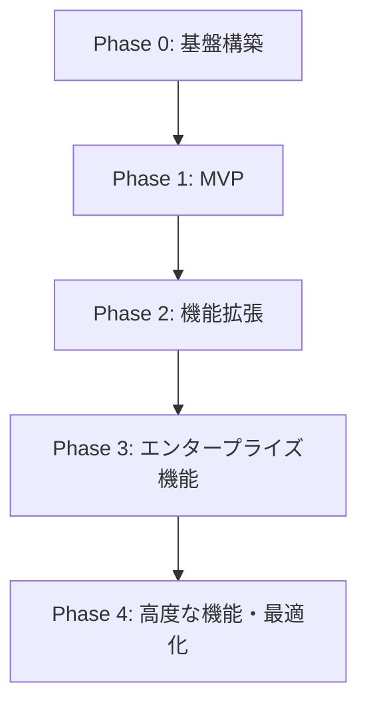
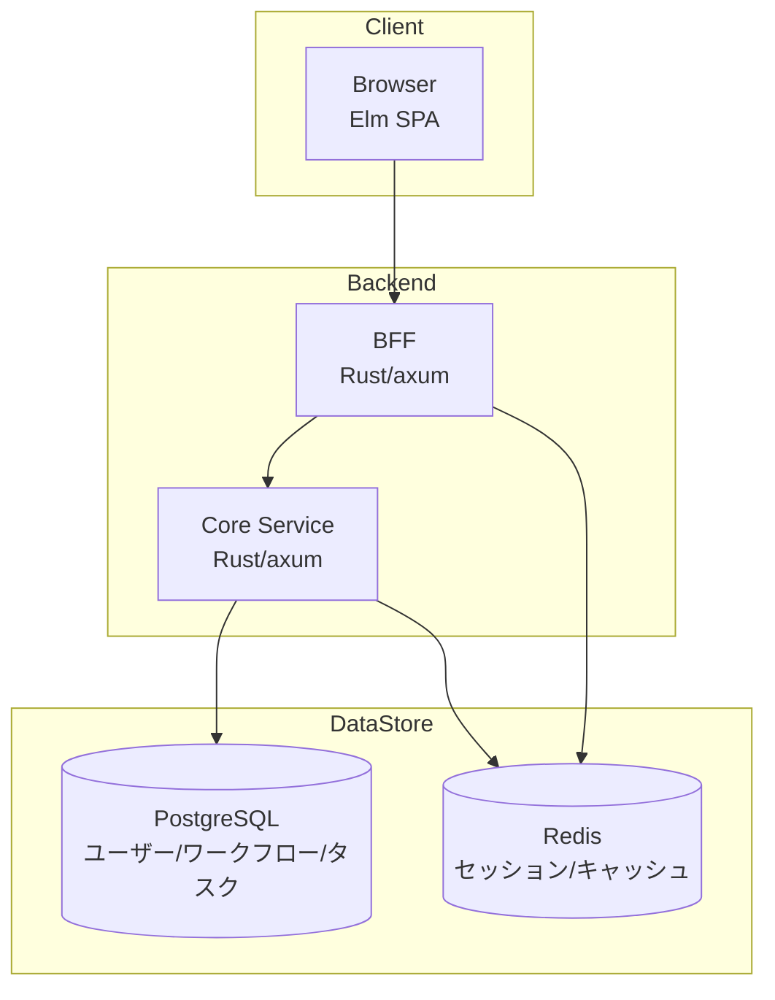
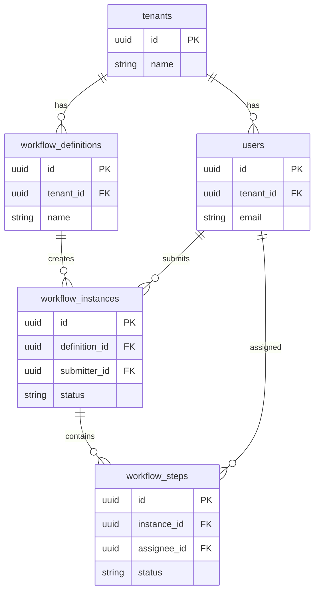

# RingiFlow 実装ロードマップ

## 概要

本ドキュメントは、RingiFlow の実装計画を定義する。
学習効果を最大化しつつ、段階的に機能を拡張するフェーズ分割を採用する。

## 進捗管理

進捗は GitHub Projects / Milestones で管理する。

- [Project Board](https://github.com/users/ka2kama/projects/1)
- [Milestones](https://github.com/ka2kama/ringiflow/milestones)

---

## フェーズ概要

---

## 進め方サマリー

### 各フェーズの概要

| Phase | 目的 | 何を作るか | どう進めるか |
|-------|------|-----------|-------------|
| 0 | 開発基盤を整える | 環境・雛形 | 手順書に従いファイル作成、ビルド確認 |
| 1 | 動く MVP を作る | 申請→承認→完了が動くシステム | DB → API → BFF → フロントの順で実装 |
| 2 | 実用機能を追加 | マルチテナント、通知、ドキュメント | Phase 1 の基盤を拡張 |
| 3 | 企業向け機能追加 | SSO/MFA、複雑なフロー | 認証強化、ワークフローエンジン拡張 |
| 4 | 高度なアーキテクチャ | イベント駆動、リアルタイム | CQRS/ES/Kafka でアーキテクチャ刷新 |

### Phase 0 の進め方

手順書（[`docs/04_手順書/`](../04_手順書/)）に従い、以下の順序で実行する:

1. リポジトリ構造構築 → ディレクトリ、justfile、rust-toolchain.toml
2. Rust プロジェクト構築 → Cargo workspace、BFF/Core Service スケルトン
3. Elm プロジェクト構築 → elm.json、Vite 設定、Main.elm
4. Docker 環境構築 → docker-compose.yml（PostgreSQL, Redis）
5. CI/CD 構築 → GitHub Actions ワークフロー
6. Terraform 基盤構築 → モジュール構造（適用はしない）

AWS へのデプロイは Phase 0 では行わない。ローカル開発環境の構築に集中する。

### Phase 1 の進め方

以下の順序で実装を進める:

1. DB スキーマ作成（SQLx マイグレーション）
2. Core Service 実装（エンティティ、リポジトリ、ユースケース）
3. BFF 実装（セッション管理、認証、Core Service プロキシ）
4. Elm フロントエンド実装（ページ、コンポーネント、API クライアント）
5. 結合テスト・動作確認
6. AWS デプロイ（Terraform 適用）

### Phase 2〜4 の進め方

Phase 1 の基盤を維持しつつ、機能を段階的に追加する。
各フェーズの詳細は後述のセクションを参照。

### 推奨戦略

**まず Phase 0 → 1 に集中する。**

Phase 0 と 1 を完了すれば「動作するワークフローシステム」ができる。
Phase 2〜4 は Phase 1 完了後に必要に応じて進める。

---

## Phase 0: 基盤構築

### 目的
- 開発環境の整備
- プロジェクト構造の確立
- インフラ基礎の構築

### 成果物

| カテゴリ | 成果物 | 詳細 |
|---------|--------|------|
| プロジェクト | リポジトリ構成 | モノレポ or マルチレポの決定、ディレクトリ構造 |
| バックエンド | Rust プロジェクト雛形 | axum セットアップ、レイヤー構造、エラーハンドリング基盤 |
| フロントエンド | Elm プロジェクト雛形 | TEA 構造、Ports 基盤、ルーティング |
| インフラ | ローカル開発環境 | Docker Compose（PostgreSQL, Redis） |
| インフラ | Terraform 基盤 | AWS プロバイダ設定、ステート管理、モジュール構成 |
| CI/CD | GitHub Actions | lint, test, build の基本パイプライン |
| ドキュメント | 開発環境構築手順 | README、セットアップガイド |
| ドキュメント | コーディング規約 | Rust / Elm スタイルガイド |

### 技術的決定事項

| 項目 | 決定 | 理由 |
|------|------|------|
| リポジトリ構成 | モノレポ | 学習目的で全体を把握しやすい、CI/CD が単純化 |
| パッケージマネージャ | Cargo workspace | 複数クレートの統合管理 |
| Elm ビルド | elm make + Vite | シンプルかつ高速 |
| ローカル DB | PostgreSQL 18 | Aurora 互換 |
| ローカル キャッシュ | Redis 8 | ElastiCache 互換 |

### 完了基準

- `cargo build` が成功する
- `elm make` が成功する
- Docker Compose で PostgreSQL/Redis が起動する
- ヘルスチェックエンドポイント `/health` が応答する
- GitHub Actions で CI が通る

---

## Phase 1: MVP（Minimum Viable Product）

### 目的
- 最小限の動作するワークフローシステムを構築
- エンドツーエンドの基本フローを確立

### スコープ

#### 含めるもの

| 機能 | 詳細 | 要件ID |
|------|------|--------|
| 認証（基本） | メール/パスワードログイン、ログアウト | AUTH-001, AUTH-007 |
| セッション管理 | HTTPOnly Cookie、Redis セッション | AUTH-007, AUTH-010 |
| テナント基盤 | シングルテナント（マルチテナント準備のみ） | CORE-03 |
| ワークフロー定義（簡易） | 固定テンプレート（1段階承認） | WF-001 |
| ワークフロー申請 | フォーム入力、申請実行 | WF-101 |
| ワークフロー承認 | 単一承認者による承認/却下 | WF-102 |
| タスク一覧 | 自分に割り当てられたタスク表示 | TASK-007 |
| タスク詳細 | 承認/却下アクション | TASK-001 |
| ダッシュボード | 承認待ち件数、申請中件数 | KPI-001, KPI-004 |
| API | REST API（BFF経由） | API-001 |

#### 含めないもの（Phase 2 以降）
- SSO/OIDC/SAML
- MFA
- 複雑なワークフロー（並列承認、条件分岐）
- ドキュメント管理
- 通知（メール/Slack）
- WebSocket リアルタイム更新
- イベントソーシング（CRUD で実装）
- 全文検索

### アーキテクチャ（MVP）

BFF の責務: セッション管理、CSRF 防御、API 集約

Core Service の責務: ビジネスロジック、データアクセス

### 画面一覧（MVP）

| 画面ID | 画面名 | 機能 |
|--------|--------|------|
| SCR-001 | ログイン | メール/パスワード入力 |
| SCR-002 | ダッシュボード | KPI表示、クイックアクセス |
| SCR-003 | ワークフロー一覧 | 申請済み/承認待ちのリスト |
| SCR-004 | ワークフロー詳細 | 進捗、履歴、アクション |
| SCR-005 | ワークフロー申請 | フォーム入力、申請 |
| SCR-007 | タスク一覧 | 自分のタスクリスト |
| SCR-008 | タスク詳細 | 承認/却下アクション |

### データベース（MVP）

### API エンドポイント（MVP）

| メソッド | パス | 説明 |
|---------|------|------|
| POST | `/auth/login` | ログイン |
| POST | `/auth/logout` | ログアウト |
| GET | `/auth/me` | 現在のユーザー情報 |
| GET | `/api/v1/workflows` | ワークフロー一覧 |
| POST | `/api/v1/workflows` | ワークフロー作成 |
| GET | `/api/v1/workflows/{id}` | ワークフロー詳細 |
| POST | `/api/v1/workflows/{id}/submit` | 申請 |
| POST | `/api/v1/workflows/{id}/steps/{stepId}/approve` | 承認 |
| POST | `/api/v1/workflows/{id}/steps/{stepId}/reject` | 却下 |
| GET | `/api/v1/tasks/my` | 自分のタスク一覧 |
| GET | `/api/v1/tasks/{id}` | タスク詳細 |
| GET | `/api/v1/dashboard/stats` | ダッシュボード統計 |

### 完了基準

- ユーザーがログインできる
- ワークフローを申請できる
- 承認者がタスク一覧から案件を確認できる
- 承認/却下ができ、ワークフローが完了する
- ダッシュボードに統計が表示される

---

## Phase 2: 機能拡張

### 目的
- ワークフローの柔軟性向上
- 通知・ドキュメント管理の追加
- マルチテナント対応

### スコープ

| 機能 | 詳細 | 要件ID |
|------|------|--------|
| マルチテナント | tenant_id による分離、RLS | CORE-03 |
| ワークフローデザイナー | GUI でのフロー設計（基本） | WF-001, WFD-001〜005 |
| 複数ステップ承認 | 順次承認（2〜3段階） | WF-002 |
| 差し戻し | 前ステップへの差し戻し | WF-103 |
| コメント機能 | タスクへのコメント | TASK-005 |
| 通知（メール） | 承認依頼、完了通知 | NOTIFY-001 |
| ドキュメント管理（基本） | ファイルアップロード、一覧 | DOC-001, DOC-003 |
| ユーザー管理 | CRUD、ロール割り当て | ADM-002, ADM-003 |
| 監査ログ（基本） | 操作履歴の記録 | RPT-004 |

### アーキテクチャ変更点
- S3 追加（ドキュメント保存）
- SES 追加（メール送信）
- RLS（Row Level Security）有効化

### 完了基準

- 複数テナントが独立して動作する
- 2段階以上の承認フローが動作する
- メール通知が送信される
- ファイルをアップロード・ダウンロードできる
- 監査ログが記録される

---

## Phase 3: エンタープライズ機能

### 目的
- エンタープライズ要件の実装
- セキュリティ強化
- 運用機能の充実

### スコープ

| 機能 | 詳細 | 要件ID |
|------|------|--------|
| SSO（OIDC） | 外部 IdP 連携 | AUTH-003 |
| SSO（SAML） | Okta/Azure AD 連携 | AUTH-002 |
| MFA | TOTP による二要素認証 | AUTH-004 |
| 条件分岐 | フロー内の条件分岐 | WF-003 |
| 並列承認 | 複数承認者の並列処理 | WF-002 |
| 代理承認 | 代理者による承認 | WF-104 |
| SLA 設定 | 期限設定、エスカレーション | WF-005 |
| Slack 通知 | Slack チャンネルへの通知 | NOTIFY-002 |
| Webhook | 外部システムへの通知 | NOTIFY-004 |
| レポート | 統計ダッシュボード、エクスポート | RPT-001〜003 |
| API キー管理 | 外部連携用 API キー | AUTHZ-004 |
| 検索（基本） | キーワード検索 | CORE-08 |

### アーキテクチャ変更点
- 外部 IdP 連携（Okta/Azure AD）
- OpenSearch 追加（検索）

### 完了基準

- OIDC でログインできる
- MFA が動作する
- 条件分岐を含むワークフローが動作する
- SLA 超過でエスカレーション通知が送られる
- レポートをエクスポートできる

---

## Phase 4: 高度な機能・最適化

### 目的
- イベント駆動アーキテクチャの完全実装
- リアルタイム機能の追加
- パフォーマンス最適化

### スコープ

| 機能 | 詳細 | 要件ID |
|------|------|--------|
| イベントソーシング | Event Store、イベント履歴 | OPS-10 |
| CQRS | Command/Query 分離 | OPS-10 |
| Kafka 統合 | MSK によるイベントバス | OPS-10 |
| WebSocket | リアルタイム通知 | OPS-10 |
| Saga パターン | 分散トランザクション | OPS-10 |
| 全文検索 | OpenSearch 統合 | CORE-08 |
| バッチ処理 | Step Functions 統合 | OPS-01 |
| パフォーマンス最適化 | キャッシュ、インデックス最適化 | CORE-05 |
| 本番インフラ | ECS Fargate、Aurora Serverless | OPS-02 |

### アーキテクチャ変更点
- MSK（Kafka）追加
- DynamoDB（Event Store）追加
- Step Functions 追加
- 本番 AWS インフラ構築

### 完了基準

- イベントソーシングでワークフローの全履歴が再現できる
- WebSocket でリアルタイム更新が届く
- Saga で複数サービスをまたぐ処理が完了する
- 本番環境で 99.9% 可用性を達成する

---

## 学習ポイントとフェーズの対応

| 学習目標 | Phase |
|---------|-------|
| Rust + axum の基本 | 0, 1 |
| Elm (TEA) の基本 | 0, 1 |
| REST API 設計 | 1 |
| 認証・セッション管理 | 1 |
| PostgreSQL + SQLx | 1 |
| マルチテナント設計 | 2 |
| AWS S3 / SES | 2 |
| OIDC / SAML | 3 |
| イベントソーシング | 4 |
| CQRS | 4 |
| Kafka (MSK) | 4 |
| Terraform | 0〜4 |
| CI/CD | 0〜4 |

---

## 推定作業量（目安）

| Phase | 期間目安 | 備考 |
|-------|---------|------|
| Phase 0 | 1〜2週間 | 環境構築、雛形作成 |
| Phase 1 | 4〜6週間 | MVP 実装 |
| Phase 2 | 4〜6週間 | 機能拡張 |
| Phase 3 | 4〜6週間 | エンタープライズ機能 |
| Phase 4 | 6〜8週間 | 高度な機能（EDA） |

※ 学習しながらの開発を想定した目安。経験や投入時間により変動。

---

## 次のステップ

Phase 0 を開始するにあたり、以下のドキュメントを作成する：

1. **プロジェクト構造設計** - リポジトリ構成、ディレクトリ構造
2. **開発環境構築手順** - セットアップガイド
3. **データベース設計（MVP）** - テーブル定義、ER図
4. **API 設計（MVP）** - OpenAPI 仕様

---

## 変更履歴

| 日付 | 変更内容 | 担当 |
|------|---------|------|
| 2026-01-16 | 進捗サマリーセクションを追加、Phase 0 完了 | - |
| 2026-01-13 | 進め方サマリーセクションを追加 | - |
| 2026-01-12 | 初版作成 | - |
