# RingiFlow 高度な設計

> **注記**: 本ドキュメントの内容はほぼ全て未実装の将来像である。各セクションの実装状態マーカーを参照のこと。実装時期は [実装ロードマップ](00_実装ロードマップ.md) に準拠する。

本ドキュメントは RingiFlow の外部連携、AWS アカウント・IAM 設計、ベストプラクティス、およびイベント駆動アーキテクチャを定義する。

## 用語説明

本ドキュメントで使用する主要な用語を以下に示す。

### セキュリティ関連

| 用語 | 説明 |
|------|------|
| Zero Trust | 「何も信頼しない」を前提とするセキュリティモデル。ネットワーク内部でも常に認証・検証を行う |
| マイクロセグメンテーション | ネットワークを細かく分割し、サービス間の通信を個別に制御する方式 |
| C2 サーバー | Command and Control サーバー。マルウェアが攻撃者の指令を受け取るために接続するサーバー |
| Sigstore/Cosign | コンテナイメージに電子署名を付与・検証するためのツール |

### イベント駆動アーキテクチャ関連

| 用語 | 説明 |
|------|------|
| Aggregate Root | DDD（ドメイン駆動設計）において、一貫性を保つべきデータのまとまりの親要素 |
| Correlation ID | 一連のリクエスト/処理を追跡するための識別子 |
| Causation ID | あるイベントの直接の原因となったイベント/コマンドの識別子 |
| Projection | イベントから読み取り用データモデルを構築する処理 |
| Projector | Projection を実行するコンポーネント |
| Outbox パターン | DB 書き込みとメッセージ発行の整合性を保つためのパターン |
| Saga パターン | 複数サービスにまたがる処理を、ローカルトランザクションの連鎖で実現するパターン |
| CDC | Change Data Capture。データベースの変更を検知して配信する仕組み |

### AWS / インフラ関連

| 用語 | 説明 |
|------|------|
| SCP | Service Control Policy。AWS Organizations で組織全体のアクセス制御を行うポリシー |
| OU | Organizational Unit。AWS Organizations 内の組織単位 |
| ARN | Amazon Resource Name。AWS リソースを一意に識別する名前 |
| IAM | Identity and Access Management。AWS のアクセス管理サービス |

### 開発関連

| 用語 | 説明 |
|------|------|
| OPA | Open Policy Agent。ポリシー記述・評価のためのエンジン |
| Sentinel | HashiCorp 製のポリシー記述言語 |
| PGO | Profile-Guided Optimization。実行時プロファイルを使ってコンパイラ最適化を行う手法 |

---

## [OPS-07] 外部連携

> **実装状態**: 未実装（Phase 3〜4 で実装予定）

### 11.1 認証連携

| サービス | プロトコル | 用途 |
|---------|----------|------|
| Okta | SAML 2.0 / OIDC | エンタープライズSSO |
| Azure AD | SAML 2.0 / OIDC | Microsoft 環境SSO |
| Google Workspace | OIDC | Google 環境SSO |
| Auth0 | OIDC | 汎用認証プロバイダー |

### 11.2 通知連携

| サービス | 連携方式 | 用途 |
|---------|---------|------|
| Slack | Webhook / Bot API | チャット通知 |
| Microsoft Teams | Webhook | チャット通知 |
| Amazon SES | AWS SDK | メール送信 |
| Twilio | REST API | SMS通知（MFA等） |

### 11.3 ストレージ連携

| サービス | 連携方式 | 用途 |
|---------|---------|------|
| Google Drive | OAuth 2.0 + REST API | ドキュメント連携 |
| OneDrive | OAuth 2.0 + Graph API | ドキュメント連携 |
| Dropbox | OAuth 2.0 + REST API | ドキュメント連携 |

### 11.4 監視・ログ連携

| サービス | 連携方式 | 用途 |
|---------|---------|------|
| Datadog | Agent / API | 統合監視 |
| OpenTelemetry | OTLP | トレース・メトリクス収集 |
| PagerDuty | Webhook / API | インシデント管理 |

### 11.5 API 認証方式

| 認証方式 | 用途 | 管理 |
|---------|------|------|
| API Key | 外部サービス連携 | Secrets Manager |
| OAuth 2.0 Client Credentials | サーバー間連携 | Secrets Manager |
| JWT Bearer | ユーザー代理アクセス | 動的発行 |

---

## [OPS-08] AWS アカウント・IAM 設計

> **実装状態**: 未実装（Phase 4 で実装予定）

### 12.1 マルチアカウント構成

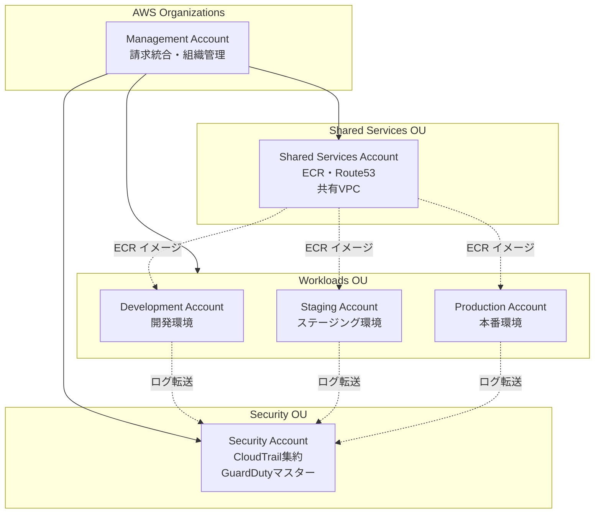

### 12.2 アカウント一覧

| アカウント | 用途 | Account ID (例) |
|-----------|------|-----------------|
| Management | Organizations 管理、請求統合 | 111111111111 |
| Security | CloudTrail 集約、GuardDuty マスター | 222222222222 |
| Shared Services | ECR、Route 53、共有 VPC | 333333333333 |
| Development | 開発環境 | 444444444444 |
| Staging | ステージング環境 | 555555555555 |
| Production | 本番環境 | 666666666666 |

### 12.3 IAM 設計

#### 12.3.1 IAM グループ

| グループ名 | 権限 | 対象者 |
|-----------|------|--------|
| Administrators | AdministratorAccess | システム管理者（限定） |
| Developers | 開発環境フルアクセス + Staging 読み取り | 開発者 |
| Operators | 本番読み取り + 限定的な操作権限 | 運用担当 |
| Auditors | 読み取り専用 + CloudTrail/Config アクセス | 監査担当 |
| CI-CD | デプロイに必要な最小権限 | CI/CD パイプライン |

#### 12.3.2 IAM ロール

| ロール名 | 用途 | 信頼関係 |
|---------|------|---------|
| ECSTaskExecutionRole | ECS タスク実行 | ecs-tasks.amazonaws.com |
| ECSTaskRole | アプリケーション権限 | ecs-tasks.amazonaws.com |
| LambdaExecutionRole | Lambda 実行 | lambda.amazonaws.com |
| BatchJobRole | AWS Batch ジョブ | batch.amazonaws.com |
| CrossAccountDeployRole | クロスアカウントデプロイ | Shared Services Account |

#### 12.3.3 権限の最小化

- すべての IAM ポリシーは最小権限の原則に従う
- ワイルドカード（`*`）の使用を避け、リソース ARN を明示
- 条件キー（`aws:SourceVpc`、`aws:SourceIp`等）による制限
- サービスコントロールポリシー（SCP）による組織全体の制限

### 12.4 セキュリティ設定

| 設定項目 | 内容 |
|---------|------|
| MFA | 全 IAM ユーザーに必須 |
| パスワードポリシー | 14文字以上、複雑性要件、90日ローテーション |
| アクセスキー | 使用を最小限に、90日ローテーション |
| ルートユーザー | MFA 設定、使用禁止（緊急時のみ） |

---

## [OPS-09] 2025年ベストプラクティス

> **実装状態**: 未実装（Phase 4 で実装予定）

本セクションでは、2025年時点で推奨される最新のベストプラクティスを記載する。

### 14.1 Zero Trust Architecture（ゼロトラストアーキテクチャ）

従来の境界型セキュリティモデルから、「Never Trust, Always Verify」を原則とするゼロトラストアーキテクチャへ移行する。

| 実装領域 | サービス/手法 | 説明 |
|---------|-------------|------|
| ネットワーク | AWS VPC Lattice | サービス間通信のきめ細かなポリシー管理、マイクロセグメンテーション |
| アプリケーションアクセス | AWS Verified Access | VPNを使用せずにプライベートアプリケーションへのセキュアアクセス |
| ID管理 | IAM Identity Center | 一元的なID管理とSSO、MFA必須化 |
| コンテキストベース認可 | IAM Conditions | 時間帯・IP・デバイス状態に基づくアクセス制御 |

```hcl
# Terraform: IAM Identity Center を使用したゼロトラストアクセス制御例
resource "aws_ssoadmin_permission_set" "developer" {
  name             = "DeveloperAccess"
  instance_arn     = aws_ssoadmin_instance.main.arn
  session_duration = "PT4H"  # 4時間セッション制限

  # MFAを必須化
  inline_policy = jsonencode({
    Version = "2012-10-17"
    Statement = [{
      Effect   = "Deny"
      Action   = "*"
      Resource = "*"
      Condition = {
        BoolIfExists = {
          "aws:MultiFactorAuthPresent" = "false"
        }
      }
    }]
  })
}
```

### 14.2 ECS Fargate 最新ベストプラクティス

#### 14.2.1 Graviton プロセッサの採用

ARM64（Graviton3）プロセッサを採用し、コスト効率とパフォーマンスを両立する。

| 項目 | 設定 |
|------|------|
| CPU アーキテクチャ | ARM64（Graviton3） |
| 想定コスト削減 | x86_64比 約20%削減 |
| パフォーマンス | 同等以上（Rust は ARM64 に最適化済み） |

#### 14.2.2 Fargate Spot の活用

開発・ステージング環境では Fargate Spot を活用してコストを最大70%削減する。

```hcl
# Terraform: Capacity Provider 設定
resource "aws_ecs_cluster_capacity_providers" "main" {
  cluster_name = aws_ecs_cluster.main.name

  capacity_providers = ["FARGATE", "FARGATE_SPOT"]

  default_capacity_provider_strategy {
    base              = 1  # 最低1タスクは通常Fargate
    weight            = 1
    capacity_provider = "FARGATE"
  }

  default_capacity_provider_strategy {
    weight            = 3  # 残りはFargate Spot優先
    capacity_provider = "FARGATE_SPOT"
  }
}
```

#### 14.2.3 GuardDuty Runtime Monitoring

ECS Fargate ワークロードに対するランタイム脅威検出を有効化する。

| 検出対象 | 説明 |
|---------|------|
| 権限昇格 | 不正な権限昇格の試行を検出 |
| 認証情報の悪用 | 漏洩した認証情報の使用を検出 |
| 悪意のある通信 | C2サーバーとの通信を検出 |
| マルウェア | コンテナ内のマルウェア活動を検出 |

#### 14.2.4 ECR イメージセキュリティ

| ベストプラクティス | 説明 |
|------------------|------|
| 不変タグ（Immutable Tags） | イメージタグの上書きを禁止し、改ざんを防止 |
| Enhanced Scanning | Amazon Inspector による継続的な脆弱性スキャン |
| イメージ署名 | Sigstore/Cosign によるイメージの署名・検証 |
| ベースイメージ管理 | 組織承認済みのベースイメージのみ使用 |

```hcl
# Terraform: ECR リポジトリ設定
resource "aws_ecr_repository" "api" {
  name                 = "ringiflow-api"
  image_tag_mutability = "IMMUTABLE"  # 不変タグを有効化

  image_scanning_configuration {
    scan_on_push = true
  }

  encryption_configuration {
    encryption_type = "KMS"
    kms_key         = aws_kms_key.ecr.arn
  }
}
```

### 14.3 Terraform ベストプラクティス（2025年版）

#### 14.3.1 default_tags の活用

AWS Provider の default_tags 機能を使用して、すべてのリソースに一貫したタグを適用する。

```hcl
provider "aws" {
  region = "ap-northeast-1"

  default_tags {
    tags = {
      Project     = "RingiFlow"
      Environment = var.environment
      ManagedBy   = "Terraform"
      Owner       = "platform-team"
      CostCenter  = "engineering"
    }
  }
}
```

#### 14.3.2 terraform test の活用

Terraform 以降のネイティブテスト機能を活用する。

```hcl
# tests/vpc_test.tftest.hcl
run "vpc_creation" {
  command = plan

  assert {
    condition     = aws_vpc.main.cidr_block == "10.0.0.0/16"
    error_message = "VPC CIDR block が正しくありません"
  }

  assert {
    condition     = aws_vpc.main.enable_dns_hostnames == true
    error_message = "DNS hostnames が有効になっていません"
  }
}
```

#### 14.3.3 Policy as Code（OPA/Sentinel）

Open Policy Agent (OPA) または HashiCorp Sentinel を使用して、Infrastructure as Code のポリシー検証を自動化する。

| 検証項目 | ポリシー例 |
|---------|----------|
| セキュリティグループ | 0.0.0.0/0 への開放を禁止 |
| 暗号化 | S3/RDS/EBS の暗号化を必須化 |
| タグ | 必須タグの存在を検証 |
| インスタンスタイプ | 承認済みインスタンスタイプのみ許可 |

#### 14.3.4 リモートバックエンド設定

```hcl
terraform {
  backend "s3" {
    bucket         = "ringiflow-terraform-state"
    key            = "environments/production/terraform.tfstate"
    region         = "ap-northeast-1"
    encrypt        = true
    dynamodb_table = "terraform-state-lock"

    # クロスアカウントアクセス用
    role_arn = "arn:aws:iam::333333333333:role/TerraformStateAccess"
  }
}
```

### 14.4 Rust/axum ベストプラクティス（2025年版）

#### 14.4.1 Axum 0.8+ 対応

Axum 0.8以降では以下の変更に対応する。

| 項目 | 旧方式 | 新方式（0.8+） |
|------|-------|---------------|
| ルートパラメータ | `/:id` | `/{id}` |
| サーバー起動 | `axum::Server::bind()` | `axum::serve(listener, app)` |
| 状態共有 | `Extension<T>` | `State<T>` を推奨 |

```rust
// Axum 0.8+ でのサーバー起動
use axum::{routing::get, Router};
use tokio::net::TcpListener;

#[tokio::main]
async fn main() {
    // トレーシング初期化
    tracing_subscriber::fmt::init();

    let app = Router::new()
        .route("/", get(root))
        .route("/users/{id}", get(get_user));  // 新しいパラメータ構文

    let listener = TcpListener::bind("0.0.0.0:3000").await.unwrap();

    // Graceful shutdown対応
    axum::serve(listener, app)
        .with_graceful_shutdown(shutdown_signal())
        .await
        .unwrap();
}

async fn shutdown_signal() {
    tokio::signal::ctrl_c()
        .await
        .expect("SIGINT シグナルハンドラーの設定に失敗");
    tracing::info!("シャットダウンシグナルを受信しました");
}
```

#### 14.4.2 OpenAPI 自動生成（utoipa）

`utoipa` クレートを使用して、API ドキュメントを自動生成する。

```rust
use utoipa::OpenApi;
use utoipa_swagger_ui::SwaggerUi;

#[derive(OpenApi)]
#[openapi(
    paths(get_user, create_user),
    components(schemas(User, CreateUserRequest)),
    tags((name = "users", description = "ユーザー管理API"))
)]
struct ApiDoc;

// Swagger UI を Router に追加
let app = Router::new()
    .merge(SwaggerUi::new("/swagger-ui")
        .url("/api-docs/openapi.json", ApiDoc::openapi()));
```

#### 14.4.3 Profile-Guided Optimization (PGO)

本番ビルドでは PGO を活用してパフォーマンスを最適化する。

```bash
# 1. インストルメンテーションビルド
RUSTFLAGS="-Cprofile-generate=/tmp/pgo-data" cargo build --release

# 2. プロファイルデータ収集（本番相当の負荷テスト実行）
./target/release/ringiflow-api &
wrk -t12 -c400 -d300s http://localhost:3000/

# 3. プロファイルデータをマージ
llvm-profdata merge -o /tmp/pgo-data/merged.profdata /tmp/pgo-data

# 4. 最適化ビルド
RUSTFLAGS="-Cprofile-use=/tmp/pgo-data/merged.profdata" cargo build --release
```

### 14.5 Observability ベストプラクティス（2025年版）

#### 14.5.1 AWS Distro for OpenTelemetry (ADOT)

ベンダーロックインを避けるため、AWS Distro for OpenTelemetry を採用する。

```yaml
# ADOT Collector 設定例
receivers:
  otlp:
    protocols:
      grpc:
        endpoint: 0.0.0.0:4317
      http:
        endpoint: 0.0.0.0:4318

processors:
  batch:
    timeout: 10s
    send_batch_size: 1024

  # リソース属性の追加
  resource:
    attributes:
      - key: service.namespace
        value: ringiflow
        action: upsert
      - key: deployment.environment
        from_attribute: ENVIRONMENT
        action: insert

exporters:
  awsxray:
    region: ap-northeast-1

  awscloudwatchlogs:
    log_group_name: "/aws/ecs/ringiflow"
    region: ap-northeast-1

  # Datadog へも同時エクスポート
  datadog:
    api:
      key: ${DD_API_KEY}

service:
  pipelines:
    traces:
      receivers: [otlp]
      processors: [batch, resource]
      exporters: [awsxray, datadog]

    metrics:
      receivers: [otlp]
      processors: [batch]
      exporters: [datadog]
```

#### 14.5.2 構造化ロギング

すべてのログを JSON 形式で出力し、検索・分析を容易にする。

```rust
use tracing_subscriber::{layer::SubscriberExt, util::SubscriberInitExt};

fn init_tracing() {
    let json_layer = tracing_subscriber::fmt::layer()
        .json()
        .with_current_span(true)
        .with_span_list(true)
        .with_file(true)
        .with_line_number(true);

    tracing_subscriber::registry()
        .with(json_layer)
        .with(tracing_subscriber::EnvFilter::from_default_env())
        .init();
}

// 構造化ログの出力例
tracing::info!(
    user_id = %user.id,
    action = "login",
    ip_address = %client_ip,
    "ユーザーがログインしました"
);
```

#### 14.5.3 スマートサンプリング戦略

コストとObservabilityのバランスを取るため、適応的なサンプリングを実装する。

| サンプリング種別 | 用途 | サンプリング率 |
|----------------|------|--------------|
| エラートレース | すべてのエラーを収集 | 100% |
| 低レイテンシ | 正常なリクエスト | 1-10% |
| 高レイテンシ | P95超過リクエスト | 100% |
| 新機能 | フィーチャーフラグ有効時 | 50% |

### 14.6 コスト最適化ベストプラクティス

#### 14.6.1 AWS Compute Optimizer の活用

ECS タスクのリソースサイズを継続的に最適化する。

| 分析対象 | 推奨アクション |
|---------|--------------|
| CPU使用率が常に30%未満 | タスクCPUの削減を検討 |
| メモリ使用率が常に50%未満 | タスクメモリの削減を検討 |
| CPU throttling発生 | タスクCPUの増加を検討 |

#### 14.6.2 コスト配分タグ戦略

```hcl
# 必須タグの定義
locals {
  required_tags = {
    Project     = "RingiFlow"
    Environment = var.environment
    CostCenter  = var.cost_center
    Owner       = var.owner
    ManagedBy   = "Terraform"

    # コスト配分用
    "aws:cost-allocation:Application" = "RingiFlow"
    "aws:cost-allocation:Team"        = var.team
  }
}
```

### 14.7 追加推奨 AWS サービス（2025年版）

| サービス | 用途 | 採用優先度 | 備考 |
|---------|------|----------|------|
| Amazon Bedrock Guardrails | AI/LLM利用時の安全性確保 | 高（AI機能導入時） | 生成AIの入出力制御 |
| AWS VPC Lattice | サービスメッシュ | 高 | App Mesh の後継、シンプルな設定 |
| Amazon CloudWatch Application Signals | APM | 高 | SLO 自動生成、アプリケーション中心の監視 |
| AWS Clean Rooms | データ共有 | 中 | テナント間データ分析（将来拡張用） |
| Amazon DataZone | データカタログ | 中 | メタデータ管理、データガバナンス |
| AWS Network Firewall | ネットワーク防御 | 高 | L7 インスペクション、IDS/IPS |

---

## [OPS-10] イベント駆動アーキテクチャ

> **実装状態**: 未実装（Phase 4 で実装予定）

本システムでは、ワークフロー管理の特性を活かし、イベント駆動アーキテクチャ（EDA）を全面的に採用する。これにより、監査性、スケーラビリティ、リアルタイム性を高いレベルで実現する。

### 15.1 イベントソーシング

#### 15.1.1 概要

イベントソーシングとは、システムの状態を「現在の状態」ではなく「状態変化の履歴（イベント）」として永続化するパターンである。

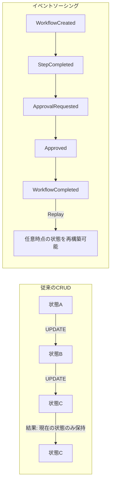

#### 15.1.2 ワークフローシステムとの適合性

ワークフロー管理システムはイベントソーシングの理想的なユースケースである。

| 観点 | イベントソーシングによるメリット |
|-----|-------------------------------|
| 監査要件 | 「誰が」「いつ」「何を」したかが自然に記録される |
| コンプライアンス | 改ざん不可能な履歴（Append-only） |
| デバッグ | 問題発生時の完全な追跡が可能 |
| 状態再構築 | 任意時点のワークフロー状態を再現可能 |
| 複雑なビジネスロジック | 承認・差し戻し・条件分岐の履歴管理が容易 |

#### 15.1.3 イベント設計

##### ドメインイベント一覧

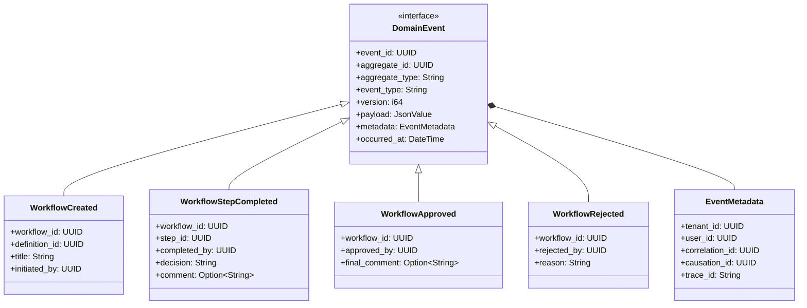

##### 主要イベント定義

| イベント種別 | 説明 | 発生タイミング |
|-------------|------|---------------|
| WorkflowCreated | ワークフローインスタンス作成 | 申請時 |
| WorkflowStepAssigned | ステップへの担当者割り当て | ステップ開始時 |
| WorkflowStepCompleted | ステップ完了 | 承認/却下/差し戻し時 |
| WorkflowApproved | ワークフロー最終承認 | 全ステップ完了時 |
| WorkflowRejected | ワークフロー却下 | 却下判断時 |
| WorkflowCancelled | ワークフロー取り消し | 申請者による取り消し時 |
| WorkflowEscalated | エスカレーション発生 | SLA 超過時 |
| DocumentAttached | ドキュメント添付 | ファイルアップロード時 |
| CommentAdded | コメント追加 | コメント投稿時 |

#### 15.1.4 イベントストア実装

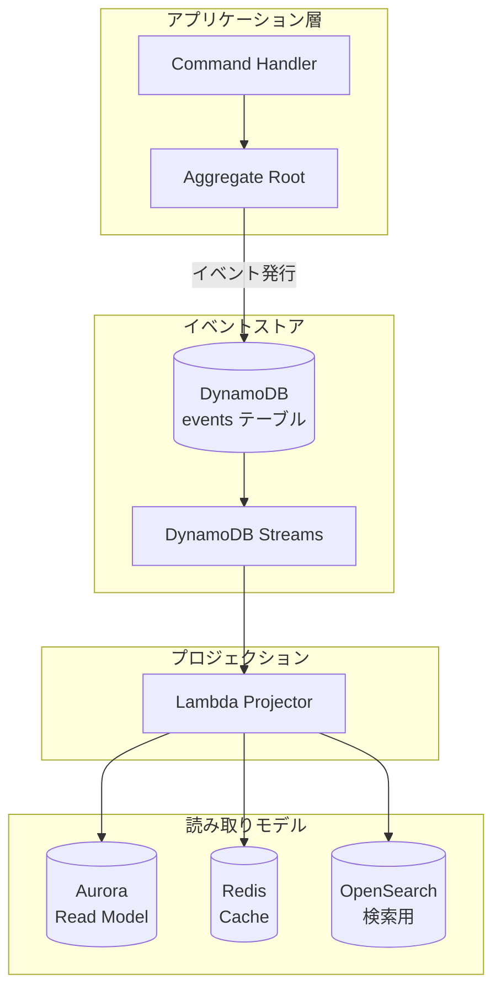

##### DynamoDB イベントテーブル設計

```
テーブル名: ringiflow-events

パーティションキー: aggregate_id (String)
ソートキー: version (Number)

属性:
  - event_id: String (UUID)
  - aggregate_type: String
  - event_type: String
  - payload: Map
  - metadata: Map
  - occurred_at: String (ISO 8601)

GSI:
  - tenant-time-index
    - PK: tenant_id
    - SK: occurred_at
    - 用途: テナント別の時系列クエリ

  - event-type-index
    - PK: event_type
    - SK: occurred_at
    - 用途: イベント種別ごとの分析

ストリーム: NEW_IMAGE
```

##### DynamoDB Streams → Kafka ブリッジ

DynamoDB をイベントストアとして使用する場合、DynamoDB Streams を通じてイベントを Kafka に連携する。
これにより、イベントの永続化とイベントバスへの配信を分離し、それぞれの責務を明確にする。

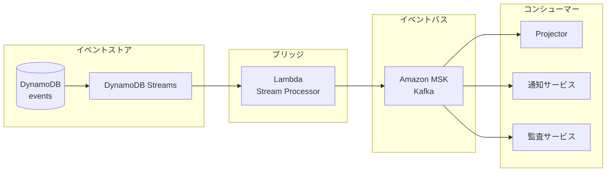

| 項目 | 設計 |
|------|------|
| トリガー | DynamoDB Streams（NEW_IMAGE） |
| 処理 | Lambda でレコードを変換し Kafka へ produce |
| 順序保証 | パーティションキー = aggregate_id で順序保証 |
| 冪等性 | event_id を Kafka メッセージキーに含め、コンシューマ側で重複排除 |
| エラー処理 | 失敗時は DLQ（SQS）へ退避し、手動再処理 |
| バックプレッシャ | Lambda の同時実行数制限 + Kafka のレート制限 |

Lambda ブリッジ実装方針:

```rust
// Lambda ハンドラ（疑似コード）
async fn handler(event: DynamoDbEvent) -> Result<(), Error> {
    let producer = create_kafka_producer();

    for record in event.records {
        if record.event_name == "INSERT" {
            let event = parse_domain_event(&record.dynamodb.new_image)?;
            let topic = format!("ringiflow.{}.events", event.aggregate_type);
            let key = event.aggregate_id.to_string();

            producer.send(topic, key, serialize(&event)?).await?;
        }
    }

    Ok(())
}
```

注意事項:

- DynamoDB Streams の保持期間は 24 時間のため、障害時は早期復旧が必要
- Lambda の同時実行数を適切に設定し、Kafka への過負荷を防止
- 再処理時は DynamoDB のイベントを直接読み取り、Kafka へ再送信可能

##### Rust イベント構造体

```rust
use chrono::{DateTime, Utc};
use serde::{Deserialize, Serialize};
use uuid::Uuid;

/// イベントメタデータ
#[derive(Debug, Clone, Serialize, Deserialize)]
pub struct EventMetadata {
    /// テナントID
    pub tenant_id: Uuid,
    /// 実行ユーザーID
    pub user_id: Uuid,
    /// 相関ID（リクエスト全体を追跡）
    pub correlation_id: Uuid,
    /// 因果ID（直接の原因となったイベント/コマンド）
    pub causation_id: Uuid,
    /// 分散トレーシング用トレースID
    pub trace_id: String,
}

/// ドメインイベント基底構造体
#[derive(Debug, Clone, Serialize, Deserialize)]
pub struct DomainEvent<T: Serialize> {
    /// イベント一意識別子
    pub event_id: Uuid,
    /// 集約ルートID
    pub aggregate_id: Uuid,
    /// 集約種別
    pub aggregate_type: String,
    /// イベント種別
    pub event_type: String,
    /// 集約バージョン（楽観的ロック用）
    pub version: i64,
    /// イベントペイロード
    pub payload: T,
    /// メタデータ
    pub metadata: EventMetadata,
    /// 発生日時
    pub occurred_at: DateTime<Utc>,
}

/// ワークフロー作成イベント
#[derive(Debug, Clone, Serialize, Deserialize)]
pub struct WorkflowCreatedPayload {
    pub definition_id: Uuid,
    pub title: String,
    pub description: Option<String>,
    pub priority: WorkflowPriority,
    pub due_date: Option<DateTime<Utc>>,
}

/// ワークフローステップ完了イベント
#[derive(Debug, Clone, Serialize, Deserialize)]
pub struct WorkflowStepCompletedPayload {
    pub step_id: Uuid,
    pub step_name: String,
    pub decision: StepDecision,
    pub comment: Option<String>,
    pub next_step_id: Option<Uuid>,
}

#[derive(Debug, Clone, Serialize, Deserialize)]
pub enum StepDecision {
    Approved,
    Rejected,
    RequestedChanges,
    Delegated { to_user_id: Uuid },
}

#[derive(Debug, Clone, Serialize, Deserialize)]
pub enum WorkflowPriority {
    Low,
    Medium,
    High,
    Urgent,
}
```

### 15.2 CQRS（Command Query Responsibility Segregation）

#### 15.2.1 概要

CQRS は、データの書き込み（Command）と読み取り（Query）を分離するパターンである。イベントソーシングと組み合わせることで、それぞれを最適化できる。

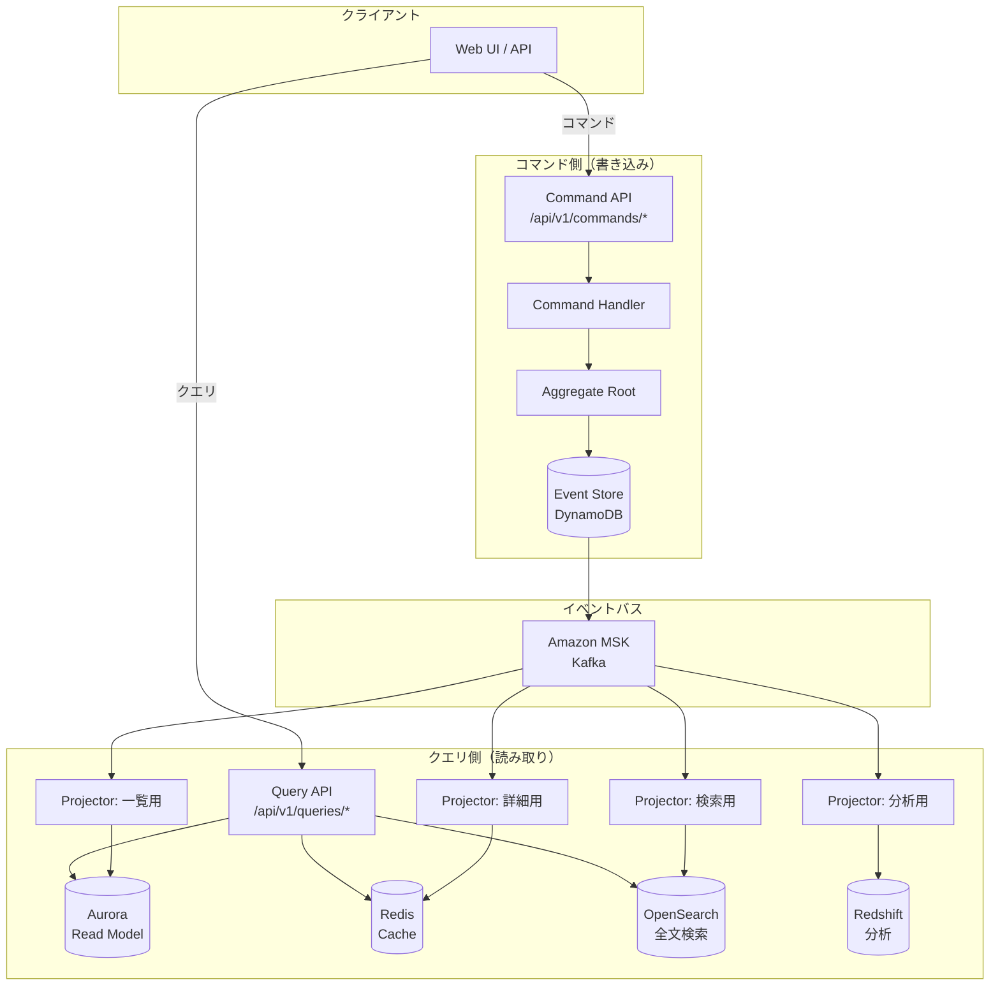

#### 15.2.2 コマンドとクエリの分離

##### コマンド一覧

| コマンド | 説明 | 生成イベント |
|---------|------|-------------|
| CreateWorkflow | ワークフロー作成 | WorkflowCreated |
| SubmitWorkflow | ワークフロー申請 | WorkflowSubmitted |
| ApproveStep | ステップ承認 | WorkflowStepCompleted |
| RejectStep | ステップ却下 | WorkflowStepCompleted, WorkflowRejected |
| RequestChanges | 差し戻し | WorkflowStepCompleted |
| CancelWorkflow | ワークフロー取り消し | WorkflowCancelled |
| AddComment | コメント追加 | CommentAdded |
| AttachDocument | ドキュメント添付 | DocumentAttached |

##### クエリ一覧

| クエリ | 説明 | データソース |
|-------|------|-------------|
| GetWorkflowList | ワークフロー一覧取得 | Aurora (Read Model) |
| GetWorkflowDetail | ワークフロー詳細取得 | Redis Cache → Aurora |
| GetMyTasks | 自分のタスク一覧 | Aurora (Read Model) |
| SearchWorkflows | ワークフロー検索 | OpenSearch |
| GetWorkflowHistory | ワークフロー履歴取得 | DynamoDB (Event Store) |
| GetDashboardStats | ダッシュボード統計 | Redis Cache |

#### 15.2.3 プロジェクション設計

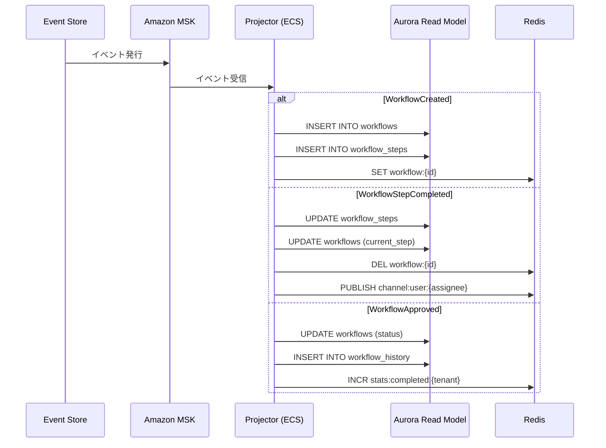

##### Read Model テーブル（Aurora）

```sql
-- ワークフロー一覧/詳細用の非正規化テーブル
CREATE TABLE workflow_read_models (
    id UUID PRIMARY KEY,
    tenant_id UUID NOT NULL,
    definition_id UUID NOT NULL,
    definition_name VARCHAR(255) NOT NULL,
    title VARCHAR(500) NOT NULL,
    status VARCHAR(50) NOT NULL,
    priority VARCHAR(20) NOT NULL,
    current_step_id UUID,
    current_step_name VARCHAR(255),
    current_assignee_id UUID,
    current_assignee_name VARCHAR(255),
    initiated_by_id UUID NOT NULL,
    initiated_by_name VARCHAR(255) NOT NULL,
    due_date TIMESTAMPTZ,
    completed_at TIMESTAMPTZ,
    created_at TIMESTAMPTZ NOT NULL,
    updated_at TIMESTAMPTZ NOT NULL,
    -- 検索用の非正規化フィールド
    search_text TSVECTOR,
    -- イベントソーシング同期用
    last_event_id UUID NOT NULL,
    last_event_version BIGINT NOT NULL
);

-- インデックス
CREATE INDEX idx_workflow_rm_tenant_status ON workflow_read_models(tenant_id, status);
CREATE INDEX idx_workflow_rm_assignee ON workflow_read_models(current_assignee_id) WHERE status = 'in_progress';
CREATE INDEX idx_workflow_rm_search ON workflow_read_models USING GIN(search_text);

-- タスク一覧用ビュー
CREATE MATERIALIZED VIEW my_tasks_view AS
SELECT
    ws.id AS step_id,
    ws.workflow_id,
    w.title AS workflow_title,
    w.priority,
    ws.step_name,
    ws.assigned_to AS assignee_id,
    ws.due_date,
    ws.status,
    w.tenant_id
FROM workflow_steps ws
JOIN workflow_read_models w ON ws.workflow_id = w.id
WHERE ws.status = 'pending';
```


##### 運用上の再処理・再同期（Must）

- Read Model 更新（プロジェクタ）は、少なくとも「再試行可能エラー」「再試行不能エラー」を分類し、再試行不能は DLQ/隔離（手動対応）へ送ることを MUST とする。
- 冪等性は `event_id`（またはイベントの一意キー）で担保し、再処理・重複配送・順序の入れ替わりが起きても最終状態が破壊されないことを MUST とする。
- 再同期（整合性回復）は、(1) 影響範囲の特定（テナント/集約/時刻）、(2) 再投影（イベント再生）、(3) 検証（Read Model とイベントの突合）、(4) 必要に応じた再通知、の手順を Runbook 化することを MUST とする。


### 15.3 Amazon MSK（Managed Streaming for Apache Kafka）

#### 15.3.1 採用理由

| 選択肢 | 特徴 | 採用判断 |
|-------|------|---------|
| Amazon MSK (Kafka) | 業界標準、高機能、学習価値が高い | ✅ 採用 |
| Kinesis Data Streams | AWS ネイティブ、シャード管理が必要 | ❌ |
| DynamoDB Streams | DynamoDB 統合、24時間保持制限 | 補助的に使用 |
| EventBridge | サーバーレス、ルーティング得意 | 補助的に使用 |

#### 15.3.2 トピック設計

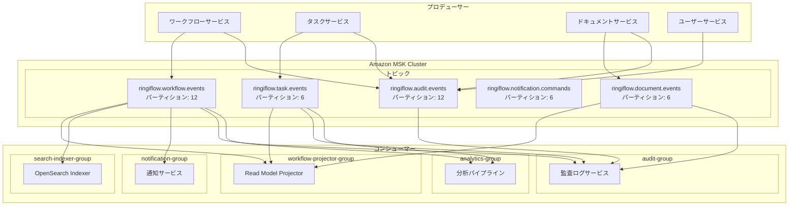

##### トピック設計詳細

| トピック名 | パーティション | レプリカ | 保持期間 | パーティションキー |
|-----------|--------------|---------|---------|------------------|
| ringiflow.workflow.events | 12 | 3 | 7日 | aggregate_id |
| ringiflow.task.events | 6 | 3 | 7日 | aggregate_id |
| ringiflow.document.events | 6 | 3 | 7日 | aggregate_id |
| ringiflow.notification.commands | 6 | 3 | 1日 | user_id |
| ringiflow.audit.events | 12 | 3 | 30日 | tenant_id |

#### 15.3.3 MSK クラスター構成

```hcl
# Terraform: MSK クラスター
resource "aws_msk_cluster" "main" {
  cluster_name           = "ringiflow-msk"
  kafka_version          = "3.6.0"
  number_of_broker_nodes = 3

  broker_node_group_info {
    instance_type   = "kafka.m7g.large"  # Graviton3
    client_subnets  = var.private_subnet_ids
    security_groups = [aws_security_group.msk.id]

    storage_info {
      ebs_storage_info {
        volume_size = 100
        provisioned_throughput {
          enabled           = true
          volume_throughput = 250
        }
      }
    }
  }

  encryption_info {
    encryption_in_transit {
      client_broker = "TLS"
      in_cluster    = true
    }
    encryption_at_rest_kms_key_arn = aws_kms_key.msk.arn
  }

  configuration_info {
    arn      = aws_msk_configuration.main.arn
    revision = aws_msk_configuration.main.latest_revision
  }

  logging_info {
    broker_logs {
      cloudwatch_logs {
        enabled   = true
        log_group = aws_cloudwatch_log_group.msk.name
      }
    }
  }

  tags = {
    Name        = "ringiflow-msk"
    Environment = var.environment
  }
}

resource "aws_msk_configuration" "main" {
  name              = "ringiflow-msk-config"
  kafka_versions    = ["3.6.0"]
  server_properties = <<PROPERTIES
auto.create.topics.enable=false
default.replication.factor=3
min.insync.replicas=2
num.partitions=6
log.retention.hours=168
log.retention.bytes=107374182400
PROPERTIES
}
```

#### 15.3.4 Rust Kafka クライアント

```rust
use rdkafka::config::ClientConfig;
use rdkafka::consumer::{Consumer, StreamConsumer};
use rdkafka::producer::{FutureProducer, FutureRecord};
use rdkafka::Message;
use serde::{de::DeserializeOwned, Serialize};
use std::time::Duration;
use tracing::{info, error, instrument};

/// Kafka プロデューサー
pub struct EventPublisher {
    producer: FutureProducer,
    topic: String,
}

impl EventPublisher {
    pub fn new(brokers: &str, topic: &str) -> Result<Self, KafkaError> {
        let producer: FutureProducer = ClientConfig::new()
            .set("bootstrap.servers", brokers)
            .set("security.protocol", "SASL_SSL")
            .set("sasl.mechanism", "AWS_MSK_IAM")
            .set("sasl.jaas.config", "software.amazon.msk.auth.iam.IAMLoginModule required;")
            .set("message.timeout.ms", "30000")
            .set("acks", "all")
            .set("enable.idempotence", "true")
            .set("retries", "3")
            .create()?;

        Ok(Self {
            producer,
            topic: topic.to_string(),
        })
    }

    #[instrument(skip(self, event), fields(event_type = %event.event_type))]
    pub async fn publish<T: Serialize>(
        &self,
        event: &DomainEvent<T>,
    ) -> Result<(), PublishError> {
        let payload = serde_json::to_vec(event)?;
        let key = event.aggregate_id.to_string();

        let record = FutureRecord::to(&self.topic)
            .key(&key)
            .payload(&payload)
            .headers(Self::create_headers(event));

        match self.producer.send(record, Duration::from_secs(10)).await {
            Ok((partition, offset)) => {
                info!(
                    partition = partition,
                    offset = offset,
                    "イベント発行成功"
                );
                Ok(())
            }
            Err((err, _)) => {
                error!(error = %err, "イベント発行失敗");
                Err(PublishError::Kafka(err))
            }
        }
    }
}

/// Kafka コンシューマー
pub struct EventConsumer {
    consumer: StreamConsumer,
}

impl EventConsumer {
    pub fn new(brokers: &str, group_id: &str, topics: &[&str]) -> Result<Self, KafkaError> {
        let consumer: StreamConsumer = ClientConfig::new()
            .set("bootstrap.servers", brokers)
            .set("group.id", group_id)
            .set("security.protocol", "SASL_SSL")
            .set("sasl.mechanism", "AWS_MSK_IAM")
            .set("enable.auto.commit", "false")
            .set("auto.offset.reset", "earliest")
            .set("isolation.level", "read_committed")
            .create()?;

        consumer.subscribe(topics)?;

        Ok(Self { consumer })
    }

    pub async fn consume<T, F, Fut>(&self, handler: F) -> Result<(), ConsumeError>
    where
        T: DeserializeOwned,
        F: Fn(DomainEvent<T>) -> Fut,
        Fut: std::future::Future<Output = Result<(), ProcessError>>,
    {
        loop {
            match self.consumer.recv().await {
                Ok(message) => {
                    let payload = message.payload().ok_or(ConsumeError::EmptyPayload)?;
                    let event: DomainEvent<T> = serde_json::from_slice(payload)?;

                    match handler(event).await {
                        Ok(()) => {
                            self.consumer.commit_message(&message, rdkafka::consumer::CommitMode::Async)?;
                        }
                        Err(e) => {
                            error!(error = %e, "イベント処理失敗");
                            // DLQ への送信やリトライロジックをここに実装
                        }
                    }
                }
                Err(e) => {
                    error!(error = %e, "メッセージ受信エラー");
                }
            }
        }
    }
}
```

### 15.4 WebSocket リアルタイム通信

#### 15.4.1 ユースケース

| ユースケース | 説明 | 優先度 |
|-------------|------|--------|
| 承認依頼通知 | 新しい承認依頼をリアルタイムで通知 | 高 |
| ワークフロー状態更新 | 他ユーザーによる更新をリアルタイム反映 | 高 |
| タスクアサイン通知 | タスクが割り当てられたら即座に通知 | 高 |
| ダッシュボード統計 | リアルタイムで統計を更新 | 中 |
| プレゼンス | オンラインユーザー表示 | 低 |

#### 15.4.2 アーキテクチャ

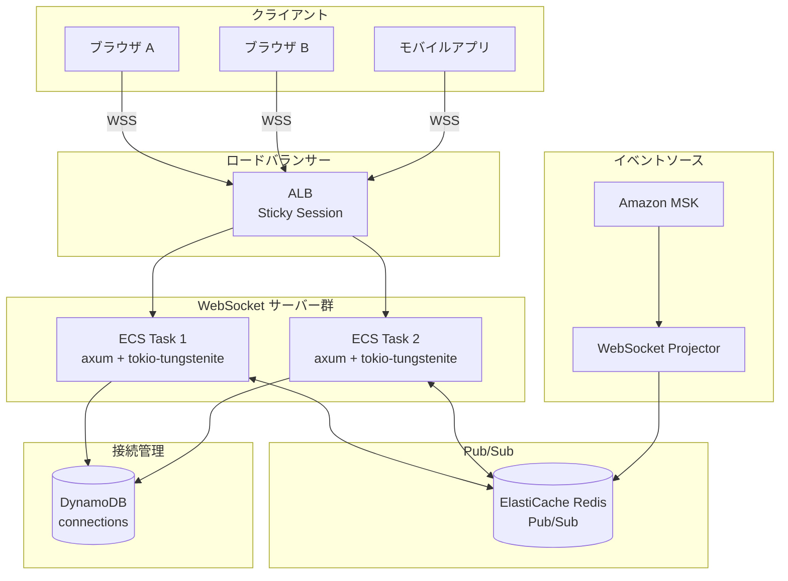

#### 15.4.3 接続管理

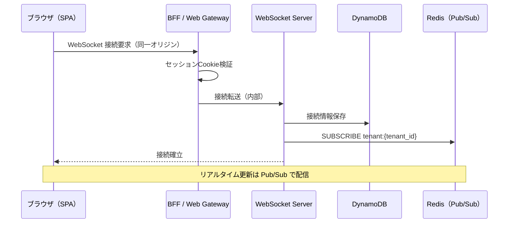

##### DynamoDB 接続管理テーブル

```
テーブル名: ringiflow-websocket-connections

パーティションキー: connection_id (String)

属性:
  - user_id: String (UUID)
  - tenant_id: String (UUID)
  - server_id: String
  - connected_at: String (ISO 8601)
  - last_heartbeat: String (ISO 8601)

GSI:
  - user-connections-index
    - PK: user_id
    - 用途: 特定ユーザーの全接続取得

TTL: expires_at (接続から24時間後)
```

#### 15.4.4 Rust WebSocket 実装

```rust
use axum::{
    extract::{
        ws::{Message, WebSocket, WebSocketUpgrade},
        State,
    },
    response::Response,
    routing::get,
    Router,
};
use futures::{SinkExt, StreamExt};
use redis::aio::PubSub;
use std::sync::Arc;
use tokio::sync::broadcast;
use tracing::{info, error, instrument};

/// WebSocket 接続状態
pub struct WebSocketState {
    redis: redis::Client,
    connections: DynamoDbClient,
    tx: broadcast::Sender<ServerMessage>,
}

/// WebSocket ハンドラー
#[instrument(skip(ws, state))]
pub async fn ws_handler(
    ws: WebSocketUpgrade,
    State(state): State<Arc<WebSocketState>>,
    session: SessionContext,  // セッションから抽出
) -> Response {
    ws.on_upgrade(move |socket| handle_socket(socket, state, claims))
}

async fn handle_socket(
    socket: WebSocket,
    state: Arc<WebSocketState>,
    session: SessionContext,
) {
    let connection_id = Uuid::new_v4();
    let user_id = claims.sub;
    let tenant_id = claims.tenant_id;

    info!(
        connection_id = %connection_id,
        user_id = %user_id,
        "WebSocket 接続確立"
    );

    // 接続情報を DynamoDB に保存
    if let Err(e) = state.connections.save_connection(&ConnectionInfo {
        connection_id,
        user_id,
        tenant_id,
        server_id: get_server_id(),
        connected_at: Utc::now(),
    }).await {
        error!(error = %e, "接続情報の保存に失敗");
        return;
    }

    let (mut sender, mut receiver) = socket.split();

    // Redis Pub/Sub 購読
    let mut pubsub = state.redis.get_async_pubsub().await.unwrap();
    pubsub.subscribe(&format!("user:{}", user_id)).await.unwrap();
    pubsub.subscribe(&format!("tenant:{}", tenant_id)).await.unwrap();

    // メッセージ受信タスク
    let recv_task = tokio::spawn(async move {
        while let Some(msg) = receiver.next().await {
            match msg {
                Ok(Message::Text(text)) => {
                    // クライアントからのメッセージ処理
                    handle_client_message(&text).await;
                }
                Ok(Message::Ping(data)) => {
                    // Pong 応答は axum が自動処理
                }
                Ok(Message::Close(_)) => {
                    info!("クライアントから切断要求");
                    break;
                }
                Err(e) => {
                    error!(error = %e, "メッセージ受信エラー");
                    break;
                }
                _ => {}
            }
        }
    });

    // Redis からのメッセージをクライアントに転送
    let send_task = tokio::spawn(async move {
        let mut pubsub_stream = pubsub.on_message();
        while let Some(msg) = pubsub_stream.next().await {
            let payload: String = msg.get_payload().unwrap();
            if sender.send(Message::Text(payload)).await.is_err() {
                break;
            }
        }
    });

    // どちらかのタスクが終了したら両方終了
    tokio::select! {
        _ = recv_task => {},
        _ = send_task => {},
    }

    // 接続情報を削除
    let _ = state.connections.delete_connection(connection_id).await;

    info!(
        connection_id = %connection_id,
        "WebSocket 接続終了"
    );
}

/// サーバーからクライアントへのメッセージ
#[derive(Debug, Clone, Serialize, Deserialize)]
#[serde(tag = "type", content = "payload")]
pub enum ServerMessage {
    /// 承認依頼通知
    ApprovalRequested {
        workflow_id: Uuid,
        workflow_title: String,
        step_name: String,
        requested_by: String,
    },
    /// ワークフロー状態更新
    WorkflowUpdated {
        workflow_id: Uuid,
        status: String,
        updated_by: String,
    },
    /// タスクアサイン通知
    TaskAssigned {
        task_id: Uuid,
        task_title: String,
        workflow_id: Uuid,
        due_date: Option<DateTime<Utc>>,
    },
    /// ダッシュボード統計更新
    StatsUpdated {
        pending_count: i32,
        completed_today: i32,
        overdue_count: i32,
    },
}
```

### 15.5 Saga パターン（分散トランザクション）

#### 15.5.1 概要

Saga パターンは、複数のサービスにまたがるトランザクションを、一連のローカルトランザクションと補償トランザクションで実現するパターンである。

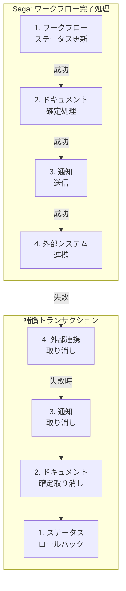

#### 15.5.2 Saga オーケストレーター（Step Functions）

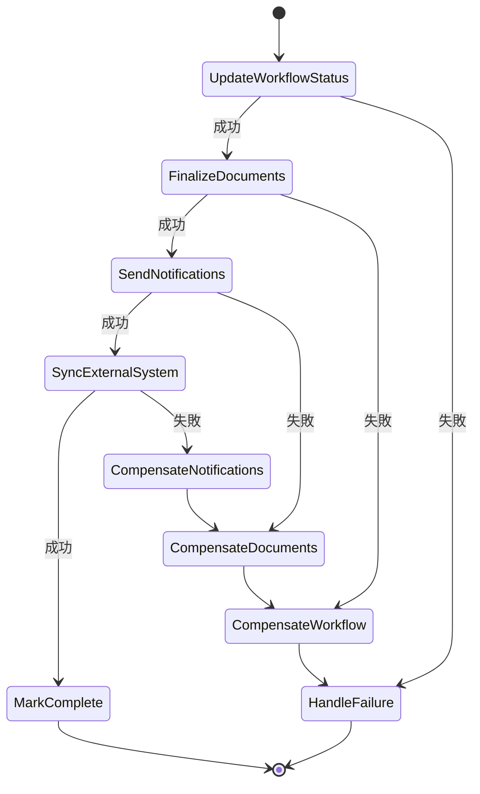

##### Step Functions 定義

```json
{
  "Comment": "ワークフロー完了 Saga",
  "StartAt": "UpdateWorkflowStatus",
  "States": {
    "UpdateWorkflowStatus": {
      "Type": "Task",
      "Resource": "arn:aws:lambda:${region}:${account}:function:update-workflow-status",
      "ResultPath": "$.workflowResult",
      "Catch": [
        {
          "ErrorEquals": ["States.ALL"],
          "ResultPath": "$.error",
          "Next": "HandleFailure"
        }
      ],
      "Next": "FinalizeDocuments"
    },
    "FinalizeDocuments": {
      "Type": "Task",
      "Resource": "arn:aws:lambda:${region}:${account}:function:finalize-documents",
      "ResultPath": "$.documentResult",
      "Catch": [
        {
          "ErrorEquals": ["States.ALL"],
          "ResultPath": "$.error",
          "Next": "CompensateWorkflow"
        }
      ],
      "Next": "SendNotifications"
    },
    "SendNotifications": {
      "Type": "Task",
      "Resource": "arn:aws:lambda:${region}:${account}:function:send-notifications",
      "ResultPath": "$.notificationResult",
      "Catch": [
        {
          "ErrorEquals": ["States.ALL"],
          "ResultPath": "$.error",
          "Next": "CompensateDocuments"
        }
      ],
      "Next": "SyncExternalSystem"
    },
    "SyncExternalSystem": {
      "Type": "Task",
      "Resource": "arn:aws:lambda:${region}:${account}:function:sync-external-system",
      "ResultPath": "$.externalResult",
      "Catch": [
        {
          "ErrorEquals": ["States.ALL"],
          "ResultPath": "$.error",
          "Next": "CompensateNotifications"
        }
      ],
      "Next": "MarkComplete"
    },
    "MarkComplete": {
      "Type": "Task",
      "Resource": "arn:aws:lambda:${region}:${account}:function:mark-saga-complete",
      "End": true
    },
    "CompensateNotifications": {
      "Type": "Task",
      "Resource": "arn:aws:lambda:${region}:${account}:function:compensate-notifications",
      "Next": "CompensateDocuments"
    },
    "CompensateDocuments": {
      "Type": "Task",
      "Resource": "arn:aws:lambda:${region}:${account}:function:compensate-documents",
      "Next": "CompensateWorkflow"
    },
    "CompensateWorkflow": {
      "Type": "Task",
      "Resource": "arn:aws:lambda:${region}:${account}:function:compensate-workflow",
      "Next": "HandleFailure"
    },
    "HandleFailure": {
      "Type": "Task",
      "Resource": "arn:aws:lambda:${region}:${account}:function:handle-saga-failure",
      "End": true
    }
  }
}
```

### 15.6 Outbox パターン

#### 15.6.1 問題と解決

「DB への書き込み」と「イベント発行」を確実に両方成功させる（または両方失敗させる）必要がある。

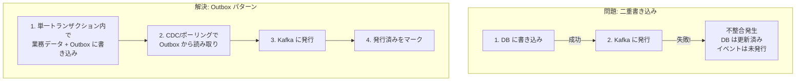

#### 15.6.2 Outbox テーブル設計

```sql
-- Outbox テーブル
CREATE TABLE outbox (
    id UUID PRIMARY KEY DEFAULT gen_random_uuid(),
    aggregate_type VARCHAR(100) NOT NULL,
    aggregate_id UUID NOT NULL,
    event_type VARCHAR(100) NOT NULL,
    payload JSONB NOT NULL,
    metadata JSONB NOT NULL,
    created_at TIMESTAMPTZ NOT NULL DEFAULT NOW(),
    -- 発行状態管理
    status VARCHAR(20) NOT NULL DEFAULT 'pending',
    published_at TIMESTAMPTZ,
    retry_count INT NOT NULL DEFAULT 0,
    last_error TEXT
);

-- ポーリング用インデックス
CREATE INDEX idx_outbox_pending ON outbox(created_at)
    WHERE status = 'pending';

-- クリーンアップ用インデックス
CREATE INDEX idx_outbox_published ON outbox(published_at)
    WHERE status = 'published';
```

#### 15.6.3 Outbox 実装

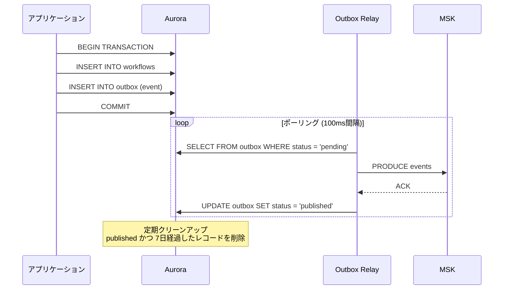

##### Rust Outbox 実装

```rust
use sqlx::{PgPool, Postgres, Transaction};
use uuid::Uuid;

/// Outbox リポジトリ
pub struct OutboxRepository {
    pool: PgPool,
}

impl OutboxRepository {
    /// トランザクション内でイベントを Outbox に保存
    pub async fn save_event<T: Serialize>(
        &self,
        tx: &mut Transaction<'_, Postgres>,
        event: &DomainEvent<T>,
    ) -> Result<(), RepositoryError> {
        sqlx::query!(
            r#"
            INSERT INTO outbox (
                id, aggregate_type, aggregate_id, event_type,
                payload, metadata, created_at
            ) VALUES ($1, $2, $3, $4, $5, $6, $7)
            "#,
            event.event_id,
            event.aggregate_type,
            event.aggregate_id,
            event.event_type,
            serde_json::to_value(&event.payload)?,
            serde_json::to_value(&event.metadata)?,
            event.occurred_at,
        )
        .execute(&mut **tx)
        .await?;

        Ok(())
    }

    /// 未発行イベントを取得
    pub async fn fetch_pending_events(
        &self,
        batch_size: i32,
    ) -> Result<Vec<OutboxEvent>, RepositoryError> {
        let events = sqlx::query_as!(
            OutboxEvent,
            r#"
            SELECT id, aggregate_type, aggregate_id, event_type,
                   payload, metadata, created_at, retry_count
            FROM outbox
            WHERE status = 'pending'
            ORDER BY created_at ASC
            LIMIT $1
            FOR UPDATE SKIP LOCKED
            "#,
            batch_size,
        )
        .fetch_all(&self.pool)
        .await?;

        Ok(events)
    }

    /// 発行済みとしてマーク
    pub async fn mark_as_published(
        &self,
        event_ids: &[Uuid],
    ) -> Result<(), RepositoryError> {
        sqlx::query!(
            r#"
            UPDATE outbox
            SET status = 'published', published_at = NOW()
            WHERE id = ANY($1)
            "#,
            event_ids,
        )
        .execute(&self.pool)
        .await?;

        Ok(())
    }
}

/// Outbox Relay サービス
pub struct OutboxRelay {
    outbox_repo: OutboxRepository,
    kafka_producer: EventPublisher,
}

impl OutboxRelay {
    /// ポーリングループ
    pub async fn run(&self) -> Result<(), RelayError> {
        let mut interval = tokio::time::interval(Duration::from_millis(100));

        loop {
            interval.tick().await;

            match self.process_batch().await {
                Ok(count) if count > 0 => {
                    info!(count = count, "Outbox イベント発行完了");
                }
                Err(e) => {
                    error!(error = %e, "Outbox 処理エラー");
                }
                _ => {}
            }
        }
    }

    async fn process_batch(&self) -> Result<usize, RelayError> {
        let events = self.outbox_repo.fetch_pending_events(100).await?;

        if events.is_empty() {
            return Ok(0);
        }

        let mut published_ids = Vec::new();

        for event in &events {
            match self.kafka_producer.publish_raw(&event.to_kafka_message()).await {
                Ok(()) => {
                    published_ids.push(event.id);
                }
                Err(e) => {
                    error!(
                        event_id = %event.id,
                        error = %e,
                        "Kafka 発行失敗"
                    );
                    // リトライカウントを増やすなどの処理
                }
            }
        }

        if !published_ids.is_empty() {
            self.outbox_repo.mark_as_published(&published_ids).await?;
        }

        Ok(published_ids.len())
    }
}
```

### 15.7 イベント駆動アーキテクチャ全体図

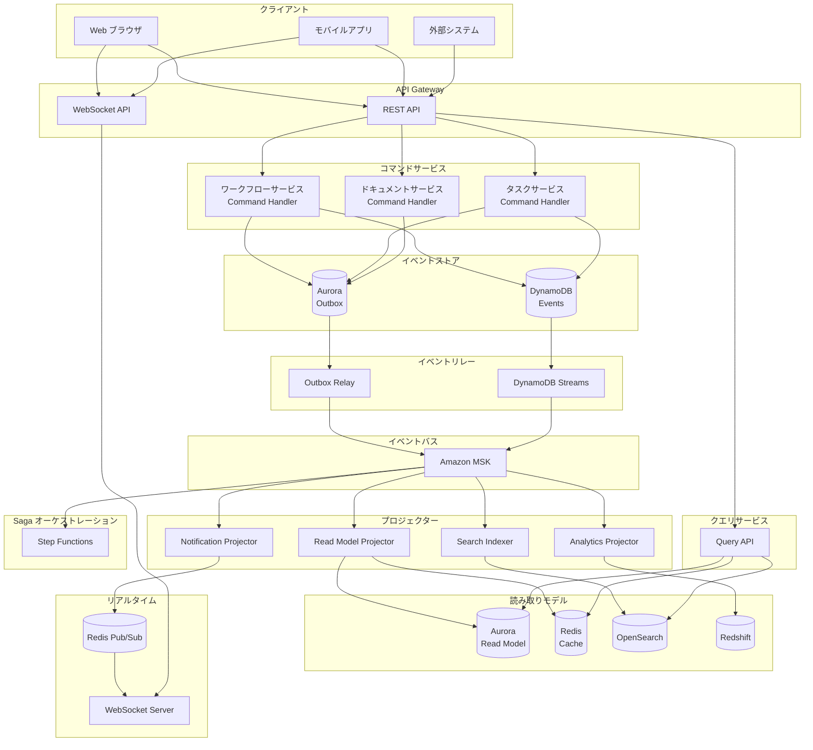

### 15.8 技術選定まとめ

| コンポーネント | 技術選定 | 理由 |
|---------------|---------|------|
| イベントストア | DynamoDB | Append-only、スケーラブル、ストリーム対応 |
| メッセージブローカー | Amazon MSK (Kafka) | 業界標準、高機能、学習価値 |
| Read Model DB | Aurora PostgreSQL | リレーショナルクエリ、複雑な集計 |
| キャッシュ | ElastiCache Redis | 高速読み取り、Pub/Sub |
| 全文検索 | OpenSearch | 柔軟な検索、日本語対応 |
| 分析基盤 | Redshift Serverless | 大規模分析、将来拡張用 |
| Saga オーケストレーション | Step Functions | ビジュアル化、エラー処理 |
| Outbox Relay | ECS Fargate | 専用サービスとして分離 |
| WebSocket | ECS Fargate + axum | Rust 非同期、学習価値 |

### 15.9 学習ロードマップ

本章の技術は複雑であり、段階的に習得することを推奨する。

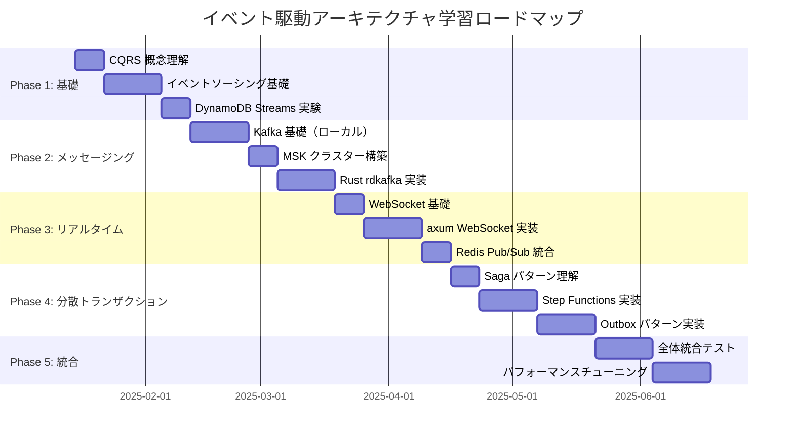

---

## 付録

### A. 技術スタック一覧

| カテゴリ | 技術 | バージョン/備考 |
|---------|------|----------------|
| 言語 | Rust | 1.75+ (stable) |
| Web フレームワーク | axum | 0.8.x |
| 非同期ランタイム | tokio | 1.x |
| DB クライアント | SQLx | 0.8.x |
| シリアライゼーション | serde | 1.x |
| WebSocket | tokio-tungstenite | 0.24.x |
| Kafka クライアント | rdkafka | 0.36.x |
| Redis クライアント | redis-rs | 0.27.x |
| テスト | cargo test + nextest | - |
| フロントエンド | Elm | 0.19.1 |
| ビルドツール | Elm toolchain（elm make / elm-test）＋（任意）Vite | 0.19.1 / 0.19.1-revision16 / 5.x |
| IaC | Terraform | 1.6+ |
| コンテナ | Docker | multi-stage build |
| CI | GitHub Actions | - |
| CD | AWS CodePipeline | - |
| メッセージング | Amazon MSK (Kafka) | 3.6.0 |
| Event Store | DynamoDB + Streams | - |
| Pub/Sub | ElastiCache Redis | 7.x |
| Saga Orchestrator | AWS Step Functions | - |

### B. 推奨 AWS サービス追加候補

| サービス | 用途 | 優先度 |
|---------|------|--------|
| Amazon Cognito | ユーザー認証基盤（Okta 代替案） | 高 |
| Amazon MSK | Kafka マネージドサービス | 高（採用済） |
| AWS Step Functions | Saga オーケストレーター | 高（採用済） |
| AWS AppSync | GraphQL マネージド | 中 |
| Amazon OpenSearch | 全文検索 | 高 |
| AWS X-Ray | 分散トレーシング | 高 |
| Amazon EventBridge | イベントルーティング | 中 |
| AWS DMS | CDC（Outbox Relay 代替） | 中 |
| AWS Verified Access | ゼロトラストアクセス | 中 |
| Amazon Macie | S3 の機密データ検出 | 中 |

### C. 関連ドキュメント

| ドキュメント | 説明 |
|-------------|------|
| API 設計書 | REST/GraphQL API の詳細仕様 |
| DB 設計書 | テーブル定義、ER 図 |
| 画面設計書 | UI/UX 設計、ワイヤーフレーム |
| インフラ設計書 | Terraform モジュール構成 |
| 運用マニュアル | 障害対応、デプロイ手順 |
| セキュリティガイドライン | セキュアコーディング規約 |

---

*以上*
