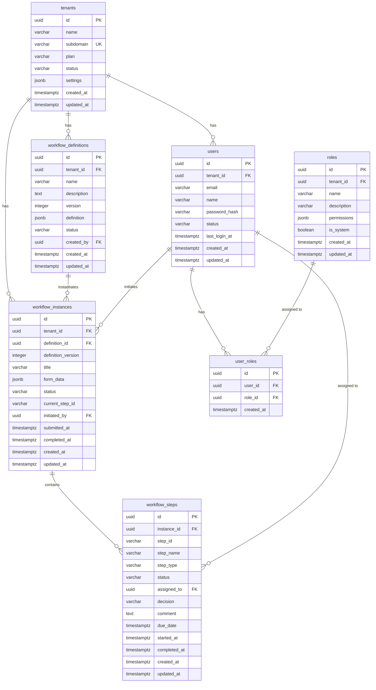

# RingiFlow データベース設計（MVP）

## 概要

本ドキュメントは、RingiFlow MVP（Phase 1）のデータベース設計を定義する。

### 対象範囲
- テナント管理
- ユーザー管理
- ワークフロー定義・インスタンス
- タスク管理
- セッション管理（Redis）

### 対象外（Phase 2 以降）
- ドキュメント管理
- 監査ログ（DynamoDB）
- イベントストア（DynamoDB）
- 全文検索（OpenSearch）

### ID 設計方針

主キーには UUID を使用し、用途に応じて v4 と v7 を使い分ける。

| 用途 | UUID バージョン | 生成方法 | 対象テーブル |
|------|----------------|----------|-------------|
| 参照系（マスタ） | v4（ランダム） | DB の `gen_random_uuid()` | tenants, users, roles, user_roles, workflow_definitions |
| 時系列系（運用） | v7（タイムスタンプ） | アプリケーション側 | workflow_instances, workflow_steps |

**UUID v7 を時系列系に採用する理由:**
- 時系列でソート可能（作成順での一覧表示に有利）
- B-tree インデックスと相性が良い（ほぼ末尾追記になり断片化を抑制）

詳細: [ADR-001: ID 形式の選定](../05_ADR/001_ID形式の選定.md)、[04_ID設計規約.md](04_ID設計規約.md)

---

## ER 図



---

## テーブル定義

### tenants（テナント）

テナント（組織）情報を管理する。

| カラム | 型 | NULL | デフォルト | 説明 |
|--------|------|------|------------|------|
| id | UUID | NO | gen_random_uuid() | 主キー |
| name | VARCHAR(255) | NO | - | テナント名 |
| subdomain | VARCHAR(63) | NO | - | サブドメイン（ユニーク） |
| plan | VARCHAR(50) | NO | 'free' | プラン（free/standard/professional/enterprise） |
| status | VARCHAR(20) | NO | 'active' | 状態（active/suspended/deleted） |
| settings | JSONB | NO | '{}' | テナント設定 |
| created_at | TIMESTAMPTZ | NO | NOW() | 作成日時 |
| updated_at | TIMESTAMPTZ | NO | NOW() | 更新日時 |

**インデックス:**
- `tenants_pkey` (id) - PRIMARY KEY
- `tenants_subdomain_key` (subdomain) - UNIQUE

**DDL:**
```sql
CREATE TABLE tenants (
    id UUID PRIMARY KEY DEFAULT gen_random_uuid(),
    name VARCHAR(255) NOT NULL,
    subdomain VARCHAR(63) NOT NULL UNIQUE,
    plan VARCHAR(50) NOT NULL DEFAULT 'free',
    status VARCHAR(20) NOT NULL DEFAULT 'active',
    settings JSONB NOT NULL DEFAULT '{}',
    created_at TIMESTAMPTZ NOT NULL DEFAULT NOW(),
    updated_at TIMESTAMPTZ NOT NULL DEFAULT NOW(),

    CONSTRAINT tenants_plan_check CHECK (plan IN ('free', 'standard', 'professional', 'enterprise')),
    CONSTRAINT tenants_status_check CHECK (status IN ('active', 'suspended', 'deleted'))
);

-- 更新日時の自動更新トリガー
CREATE OR REPLACE FUNCTION update_updated_at()
RETURNS TRIGGER AS $$
BEGIN
    NEW.updated_at = NOW();
    RETURN NEW;
END;
$$ LANGUAGE plpgsql;

CREATE TRIGGER tenants_updated_at
    BEFORE UPDATE ON tenants
    FOR EACH ROW
    EXECUTE FUNCTION update_updated_at();
```

---

### users（ユーザー）

ユーザー情報を管理する。

| カラム | 型 | NULL | デフォルト | 説明 |
|--------|------|------|------------|------|
| id | UUID | NO | gen_random_uuid() | 主キー |
| tenant_id | UUID | NO | - | テナントID（FK） |
| email | VARCHAR(255) | NO | - | メールアドレス |
| name | VARCHAR(255) | NO | - | 表示名 |
| password_hash | VARCHAR(255) | YES | - | パスワードハッシュ（SSO の場合 NULL） |
| status | VARCHAR(20) | NO | 'active' | 状態（active/inactive/deleted） |
| last_login_at | TIMESTAMPTZ | YES | - | 最終ログイン日時 |
| created_at | TIMESTAMPTZ | NO | NOW() | 作成日時 |
| updated_at | TIMESTAMPTZ | NO | NOW() | 更新日時 |

**インデックス:**
- `users_pkey` (id) - PRIMARY KEY
- `users_tenant_email_key` (tenant_id, email) - UNIQUE
- `users_tenant_status_idx` (tenant_id, status) - 一覧取得用

**DDL:**
```sql
CREATE TABLE users (
    id UUID PRIMARY KEY DEFAULT gen_random_uuid(),
    tenant_id UUID NOT NULL REFERENCES tenants(id) ON DELETE CASCADE,
    email VARCHAR(255) NOT NULL,
    name VARCHAR(255) NOT NULL,
    password_hash VARCHAR(255),
    status VARCHAR(20) NOT NULL DEFAULT 'active',
    last_login_at TIMESTAMPTZ,
    created_at TIMESTAMPTZ NOT NULL DEFAULT NOW(),
    updated_at TIMESTAMPTZ NOT NULL DEFAULT NOW(),

    CONSTRAINT users_tenant_email_key UNIQUE (tenant_id, email),
    CONSTRAINT users_status_check CHECK (status IN ('active', 'inactive', 'deleted'))
);

CREATE INDEX users_tenant_status_idx ON users(tenant_id, status);

CREATE TRIGGER users_updated_at
    BEFORE UPDATE ON users
    FOR EACH ROW
    EXECUTE FUNCTION update_updated_at();
```

---

### roles（ロール）

権限ロールを定義する。

| カラム | 型 | NULL | デフォルト | 説明 |
|--------|------|------|------------|------|
| id | UUID | NO | gen_random_uuid() | 主キー |
| tenant_id | UUID | YES | - | テナントID（NULL = システムロール） |
| name | VARCHAR(100) | NO | - | ロール名 |
| description | TEXT | YES | - | 説明 |
| permissions | JSONB | NO | '[]' | 権限リスト |
| is_system | BOOLEAN | NO | false | システム定義ロールか |
| created_at | TIMESTAMPTZ | NO | NOW() | 作成日時 |
| updated_at | TIMESTAMPTZ | NO | NOW() | 更新日時 |

**DDL:**
```sql
CREATE TABLE roles (
    id UUID PRIMARY KEY DEFAULT gen_random_uuid(),
    tenant_id UUID REFERENCES tenants(id) ON DELETE CASCADE,
    name VARCHAR(100) NOT NULL,
    description TEXT,
    permissions JSONB NOT NULL DEFAULT '[]',
    is_system BOOLEAN NOT NULL DEFAULT false,
    created_at TIMESTAMPTZ NOT NULL DEFAULT NOW(),
    updated_at TIMESTAMPTZ NOT NULL DEFAULT NOW(),

    CONSTRAINT roles_tenant_name_key UNIQUE (tenant_id, name)
);

CREATE TRIGGER roles_updated_at
    BEFORE UPDATE ON roles
    FOR EACH ROW
    EXECUTE FUNCTION update_updated_at();

-- システムロールの初期データ
INSERT INTO roles (id, tenant_id, name, description, permissions, is_system) VALUES
    ('00000000-0000-0000-0000-000000000001', NULL, 'system_admin', 'システム管理者', '["*"]', true),
    ('00000000-0000-0000-0000-000000000002', NULL, 'tenant_admin', 'テナント管理者', '["tenant:*", "user:*", "workflow:*", "task:*"]', true),
    ('00000000-0000-0000-0000-000000000003', NULL, 'user', '一般ユーザー', '["workflow:read", "workflow:create", "task:read", "task:update"]', true);
```

---

### user_roles（ユーザーロール関連）

ユーザーとロールの関連を管理する。

| カラム | 型 | NULL | デフォルト | 説明 |
|--------|------|------|------------|------|
| id | UUID | NO | gen_random_uuid() | 主キー |
| user_id | UUID | NO | - | ユーザーID（FK） |
| role_id | UUID | NO | - | ロールID（FK） |
| created_at | TIMESTAMPTZ | NO | NOW() | 作成日時 |

**DDL:**
```sql
CREATE TABLE user_roles (
    id UUID PRIMARY KEY DEFAULT gen_random_uuid(),
    user_id UUID NOT NULL REFERENCES users(id) ON DELETE CASCADE,
    role_id UUID NOT NULL REFERENCES roles(id) ON DELETE CASCADE,
    created_at TIMESTAMPTZ NOT NULL DEFAULT NOW(),

    CONSTRAINT user_roles_user_role_key UNIQUE (user_id, role_id)
);

CREATE INDEX user_roles_user_idx ON user_roles(user_id);
CREATE INDEX user_roles_role_idx ON user_roles(role_id);
```

---

### workflow_definitions（ワークフロー定義）

ワークフローのテンプレート定義を管理する。

| カラム | 型 | NULL | デフォルト | 説明 |
|--------|------|------|------------|------|
| id | UUID | NO | gen_random_uuid() | 主キー |
| tenant_id | UUID | NO | - | テナントID（FK） |
| name | VARCHAR(255) | NO | - | 定義名 |
| description | TEXT | YES | - | 説明 |
| version | INTEGER | NO | 1 | バージョン |
| definition | JSONB | NO | - | 定義本体（JSON） |
| status | VARCHAR(20) | NO | 'draft' | 状態（draft/published/archived） |
| created_by | UUID | NO | - | 作成者（FK） |
| created_at | TIMESTAMPTZ | NO | NOW() | 作成日時 |
| updated_at | TIMESTAMPTZ | NO | NOW() | 更新日時 |

**定義 JSON の構造例:**
```json
{
  "form": {
    "fields": [
      {"id": "title", "type": "text", "label": "件名", "required": true},
      {"id": "amount", "type": "number", "label": "金額", "required": true}
    ]
  },
  "steps": [
    {"id": "approval", "type": "approval", "name": "承認", "assignee": {"type": "manager"}}
  ]
}
```

**DDL:**
```sql
CREATE TABLE workflow_definitions (
    id UUID PRIMARY KEY DEFAULT gen_random_uuid(),
    tenant_id UUID NOT NULL REFERENCES tenants(id) ON DELETE CASCADE,
    name VARCHAR(255) NOT NULL,
    description TEXT,
    version INTEGER NOT NULL DEFAULT 1,
    definition JSONB NOT NULL,
    status VARCHAR(20) NOT NULL DEFAULT 'draft',
    created_by UUID NOT NULL REFERENCES users(id),
    created_at TIMESTAMPTZ NOT NULL DEFAULT NOW(),
    updated_at TIMESTAMPTZ NOT NULL DEFAULT NOW(),

    CONSTRAINT workflow_definitions_status_check CHECK (status IN ('draft', 'published', 'archived'))
);

CREATE INDEX workflow_definitions_tenant_status_idx ON workflow_definitions(tenant_id, status);

CREATE TRIGGER workflow_definitions_updated_at
    BEFORE UPDATE ON workflow_definitions
    FOR EACH ROW
    EXECUTE FUNCTION update_updated_at();
```

---

### workflow_instances（ワークフローインスタンス）

実行中のワークフローインスタンスを管理する。

| カラム | 型 | NULL | デフォルト | 説明 |
|--------|------|------|------------|------|
| id | UUID | NO | - | 主キー（UUID v7、アプリ生成） |
| tenant_id | UUID | NO | - | テナントID（FK） |
| definition_id | UUID | NO | - | 定義ID（FK） |
| definition_version | INTEGER | NO | - | 定義バージョン（作成時点） |
| title | VARCHAR(500) | NO | - | タイトル |
| form_data | JSONB | NO | '{}' | フォームデータ |
| status | VARCHAR(20) | NO | 'draft' | 状態 |
| current_step_id | VARCHAR(100) | YES | - | 現在のステップID |
| initiated_by | UUID | NO | - | 申請者（FK） |
| submitted_at | TIMESTAMPTZ | YES | - | 申請日時 |
| completed_at | TIMESTAMPTZ | YES | - | 完了日時 |
| created_at | TIMESTAMPTZ | NO | NOW() | 作成日時 |
| updated_at | TIMESTAMPTZ | NO | NOW() | 更新日時 |

**ステータス一覧:**

| status | 説明 |
|--------|------|
| draft | 下書き |
| pending | 承認待ち |
| in_progress | 処理中 |
| approved | 承認完了 |
| rejected | 却下 |
| cancelled | 取り消し |

**DDL:**
```sql
-- 注: id は UUID v7（時系列ソート可能）を使用。アプリケーション側で生成。
-- 参照: docs/05_ADR/001_ID形式の選定.md
CREATE TABLE workflow_instances (
    id UUID PRIMARY KEY,
    tenant_id UUID NOT NULL REFERENCES tenants(id) ON DELETE CASCADE,
    definition_id UUID NOT NULL REFERENCES workflow_definitions(id),
    definition_version INTEGER NOT NULL,
    title VARCHAR(500) NOT NULL,
    form_data JSONB NOT NULL DEFAULT '{}',
    status VARCHAR(20) NOT NULL DEFAULT 'draft',
    current_step_id VARCHAR(100),
    initiated_by UUID NOT NULL REFERENCES users(id),
    submitted_at TIMESTAMPTZ,
    completed_at TIMESTAMPTZ,
    created_at TIMESTAMPTZ NOT NULL DEFAULT NOW(),
    updated_at TIMESTAMPTZ NOT NULL DEFAULT NOW(),

    CONSTRAINT workflow_instances_status_check CHECK (
        status IN ('draft', 'pending', 'in_progress', 'approved', 'rejected', 'cancelled')
    )
);

CREATE INDEX workflow_instances_tenant_status_idx ON workflow_instances(tenant_id, status);
CREATE INDEX workflow_instances_initiated_by_idx ON workflow_instances(initiated_by);
CREATE INDEX workflow_instances_created_at_idx ON workflow_instances(tenant_id, created_at DESC);

CREATE TRIGGER workflow_instances_updated_at
    BEFORE UPDATE ON workflow_instances
    FOR EACH ROW
    EXECUTE FUNCTION update_updated_at();
```

---

### workflow_steps（ワークフローステップ）

ワークフローの各ステップの実行状態を管理する。

| カラム | 型 | NULL | デフォルト | 説明 |
|--------|------|------|------------|------|
| id | UUID | NO | - | 主キー（UUID v7、アプリ生成） |
| instance_id | UUID | NO | - | インスタンスID（FK） |
| step_id | VARCHAR(100) | NO | - | 定義上のステップID |
| step_name | VARCHAR(255) | NO | - | ステップ名 |
| step_type | VARCHAR(50) | NO | - | ステップ種別（approval/notification/...） |
| status | VARCHAR(20) | NO | 'pending' | 状態 |
| assigned_to | UUID | YES | - | 担当者（FK） |
| decision | VARCHAR(50) | YES | - | 判断（approved/rejected/...） |
| comment | TEXT | YES | - | コメント |
| due_date | TIMESTAMPTZ | YES | - | 期限 |
| started_at | TIMESTAMPTZ | YES | - | 開始日時 |
| completed_at | TIMESTAMPTZ | YES | - | 完了日時 |
| created_at | TIMESTAMPTZ | NO | NOW() | 作成日時 |
| updated_at | TIMESTAMPTZ | NO | NOW() | 更新日時 |

**ステータス一覧:**
| status | 説明 |
|--------|------|
| pending | 待機中 |
| active | アクティブ（担当者が処理中） |
| completed | 完了 |
| skipped | スキップ |

**DDL:**
```sql
-- 注: id は UUID v7（時系列ソート可能）を使用。アプリケーション側で生成。
-- 参照: docs/05_ADR/001_ID形式の選定.md
CREATE TABLE workflow_steps (
    id UUID PRIMARY KEY,
    instance_id UUID NOT NULL REFERENCES workflow_instances(id) ON DELETE CASCADE,
    step_id VARCHAR(100) NOT NULL,
    step_name VARCHAR(255) NOT NULL,
    step_type VARCHAR(50) NOT NULL,
    status VARCHAR(20) NOT NULL DEFAULT 'pending',
    assigned_to UUID REFERENCES users(id),
    decision VARCHAR(50),
    comment TEXT,
    due_date TIMESTAMPTZ,
    started_at TIMESTAMPTZ,
    completed_at TIMESTAMPTZ,
    created_at TIMESTAMPTZ NOT NULL DEFAULT NOW(),
    updated_at TIMESTAMPTZ NOT NULL DEFAULT NOW(),

    CONSTRAINT workflow_steps_status_check CHECK (status IN ('pending', 'active', 'completed', 'skipped')),
    CONSTRAINT workflow_steps_decision_check CHECK (decision IS NULL OR decision IN ('approved', 'rejected', 'request_changes'))
);

CREATE INDEX workflow_steps_instance_idx ON workflow_steps(instance_id);
CREATE INDEX workflow_steps_assigned_to_idx ON workflow_steps(assigned_to) WHERE status = 'active';

CREATE TRIGGER workflow_steps_updated_at
    BEFORE UPDATE ON workflow_steps
    FOR EACH ROW
    EXECUTE FUNCTION update_updated_at();
```

---

## Redis データ構造

### セッション

```
キー: session:{session_id}
型: Hash
TTL: 8時間（絶対期限）

フィールド:
  - user_id: UUID
  - tenant_id: UUID
  - email: string
  - name: string
  - roles: JSON array
  - created_at: ISO 8601
  - last_accessed_at: ISO 8601
```

### CSRF トークン

```
キー: csrf:{session_id}
型: String
TTL: 30分
値: ランダムトークン
```

### ダッシュボード統計キャッシュ

```
キー: stats:{tenant_id}:{user_id}
型: Hash
TTL: 1分

フィールド:
  - pending_tasks: integer
  - my_workflows_in_progress: integer
  - completed_today: integer
```

---

## マイグレーション

### ファイル構成

```
backend/migrations/
├── 20250112000001_create_tenants.sql
├── 20250112000002_create_users.sql
├── 20250112000003_create_roles.sql
├── 20250112000004_create_user_roles.sql
├── 20250112000005_create_workflow_definitions.sql
├── 20250112000006_create_workflow_instances.sql
├── 20250112000007_create_workflow_steps.sql
└── 20250112000008_seed_system_data.sql
```

### SQLx マイグレーション実行

```bash
# マイグレーション実行
sqlx migrate run --database-url $DATABASE_URL

# マイグレーション作成
sqlx migrate add create_tenants
```

---

## 初期データ

### システムテナント（開発用）

```sql
-- 開発用テナント
INSERT INTO tenants (id, name, subdomain, plan, status) VALUES
    ('00000000-0000-0000-0000-000000000001', 'Development Tenant', 'dev', 'enterprise', 'active');

-- 開発用ユーザー（パスワード: password）
INSERT INTO users (id, tenant_id, email, name, password_hash, status) VALUES
    ('00000000-0000-0000-0000-000000000001', '00000000-0000-0000-0000-000000000001',
     'admin@example.com', '管理者', '$argon2id$...', 'active'),
    ('00000000-0000-0000-0000-000000000002', '00000000-0000-0000-0000-000000000001',
     'user@example.com', '一般ユーザー', '$argon2id$...', 'active');

-- ロール割り当て
INSERT INTO user_roles (user_id, role_id) VALUES
    ('00000000-0000-0000-0000-000000000001', '00000000-0000-0000-0000-000000000002'), -- tenant_admin
    ('00000000-0000-0000-0000-000000000002', '00000000-0000-0000-0000-000000000003'); -- user
```

### MVP 用ワークフロー定義

```sql
-- シンプルな承認ワークフロー
INSERT INTO workflow_definitions (id, tenant_id, name, description, version, definition, status, created_by) VALUES
    ('00000000-0000-0000-0000-000000000001',
     '00000000-0000-0000-0000-000000000001',
     '汎用申請',
     'シンプルな1段階承認ワークフロー',
     1,
     '{
       "form": {
         "fields": [
           {"id": "title", "type": "text", "label": "件名", "required": true, "maxLength": 100},
           {"id": "description", "type": "textarea", "label": "内容", "required": true, "maxLength": 2000}
         ]
       },
       "steps": [
         {"id": "start", "type": "start", "name": "開始"},
         {"id": "approval", "type": "approval", "name": "承認", "assignee": {"type": "user"}},
         {"id": "end_approved", "type": "end", "name": "承認完了", "status": "approved"},
         {"id": "end_rejected", "type": "end", "name": "却下", "status": "rejected"}
       ],
       "transitions": [
         {"from": "start", "to": "approval"},
         {"from": "approval", "to": "end_approved", "trigger": "approve"},
         {"from": "approval", "to": "end_rejected", "trigger": "reject"}
       ]
     }',
     'published',
     '00000000-0000-0000-0000-000000000001');
```

---

## 変更履歴

| 日付 | 変更内容 | 担当 |
|------|---------|------|
| 2026-01-12 | 初版作成（MVP 範囲） | - |
