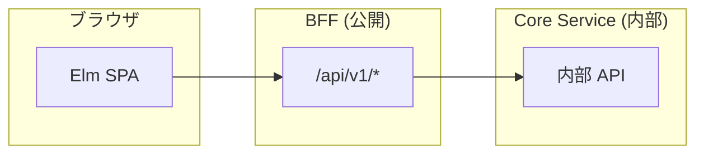
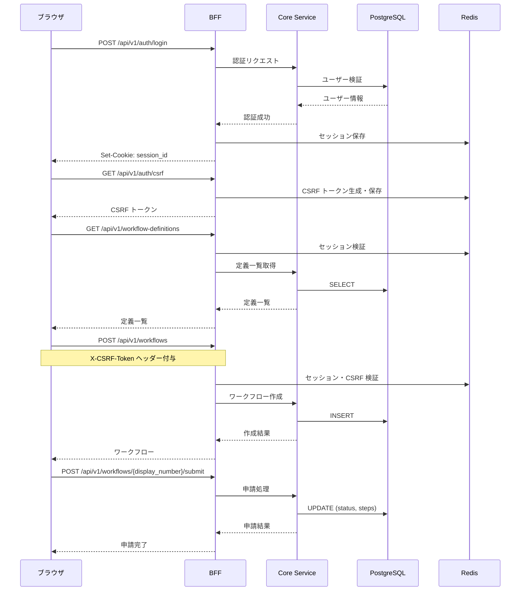
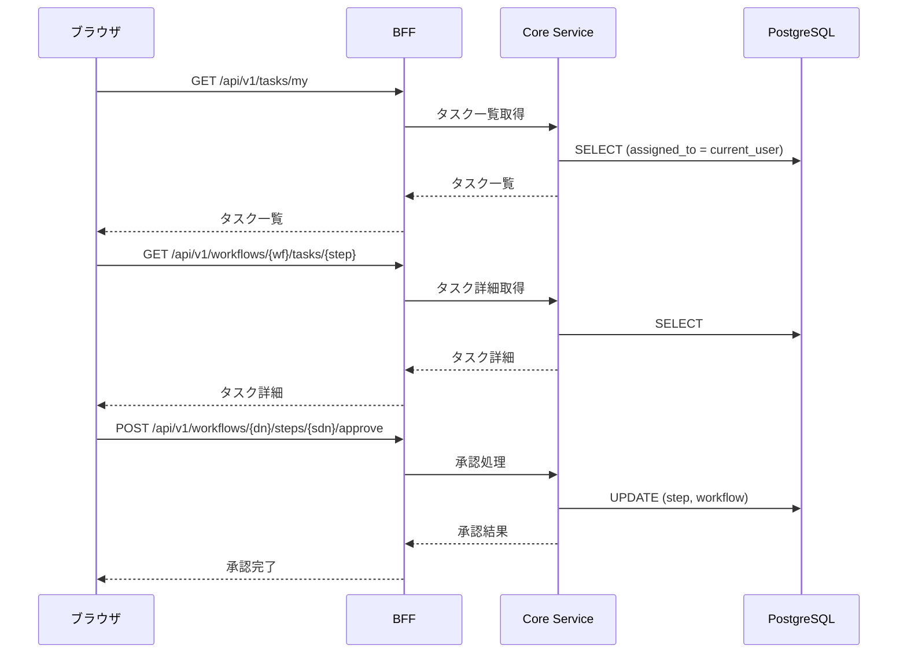
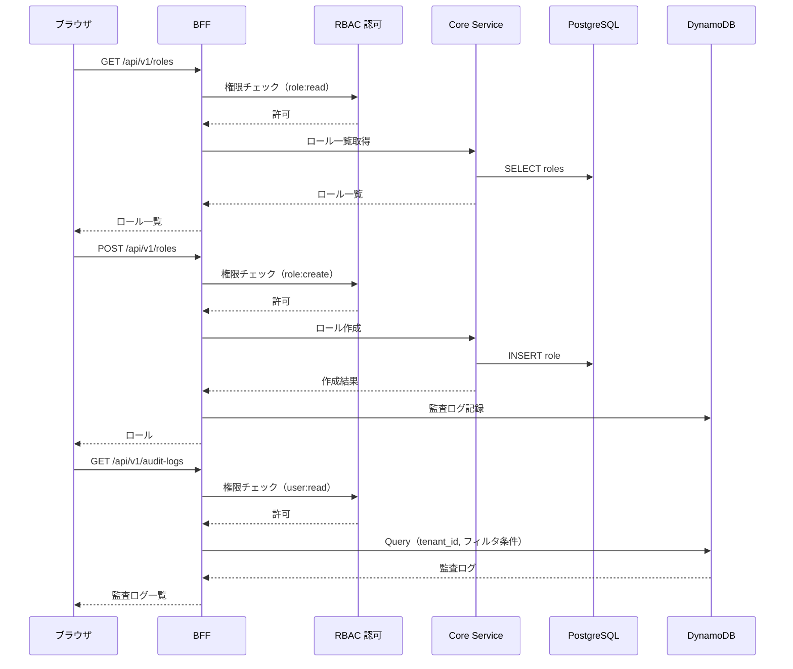

# RingiFlow API 設計

## 概要

本ドキュメントは、RingiFlow の API 設計を定義する。

### 設計方針

- RESTful: リソース指向の URL 設計
- JSON: リクエスト/レスポンスは JSON 形式
- BFF パターン: ブラウザは BFF とのみ通信
- エラーレスポンス: RFC 9457 Problem Details 形式

### エンドポイント構成



### OpenAPI 仕様書

機械可読な API 仕様は OpenAPI 形式で管理している。

→ [OpenAPI 仕様書](../../openapi/openapi.yaml)

---

## 共通仕様

API 設計の一般的なパターンはナレッジベースを参照。

→ [RESTful API 設計](../06_ナレッジベース/architecture/REST_API設計.md)

### ベース URL

| 環境 | URL |
|------|-----|
| ローカル | `http://localhost:13000` |
| 開発 | `https://dev.ringiflow.example.com` |
| 本番 | `https://app.ringiflow.example.com` |

### 本プロジェクトでの方針

- レスポンス形式: `{ "data": ... }` でラップ
- エラー形式: RFC 9457 準拠
- ページネーション: `page` / `per_page` パラメータ
- 認証: Cookie ベースのセッション + CSRF トークン

---

## 認証 API

### POST /api/v1/auth/login

メール/パスワードでログインする。

**リクエスト:**
```json
{
  "email": "user@example.com",
  "password": "password123"
}
```

**レスポンス（200 OK）:**
```json
{
  "data": {
    "user": {
      "id": "550e8400-e29b-41d4-a716-446655440000",
      "email": "user@example.com",
      "name": "山田 太郎",
      "tenant_id": "550e8400-e29b-41d4-a716-446655440001",
      "roles": ["user"]
    }
  }
}
```

**エラー（401 Unauthorized）:**
```json
{
  "type": "https://ringiflow.example.com/errors/authentication-failed",
  "title": "Authentication Failed",
  "status": 401,
  "detail": "メールアドレスまたはパスワードが正しくありません"
}
```

**セッション Cookie:**
```
Set-Cookie: session_id=xxx; HttpOnly; Secure; SameSite=Lax; Path=/; Max-Age=28800
```

---

### POST /api/v1/auth/logout

ログアウトする。

**リクエスト:** なし（Cookie のセッション ID を使用）

**レスポンス（204 No Content）:** 空

**Cookie:**
```
Set-Cookie: session_id=; HttpOnly; Secure; SameSite=Lax; Path=/; Max-Age=0
```

---

### GET /api/v1/auth/me

現在のユーザー情報を取得する。

**レスポンス（200 OK）:**
```json
{
  "data": {
    "id": "550e8400-e29b-41d4-a716-446655440000",
    "email": "user@example.com",
    "name": "山田 太郎",
    "tenant_id": "550e8400-e29b-41d4-a716-446655440001",
    "tenant_name": "株式会社サンプル",
    "roles": ["user"],
    "permissions": ["workflow:read", "workflow:create", "task:read", "task:update"]
  }
}
```

**エラー（401 Unauthorized）:**
```json
{
  "type": "https://ringiflow.example.com/errors/unauthorized",
  "title": "Unauthorized",
  "status": 401,
  "detail": "認証が必要です"
}
```

---

### GET /api/v1/auth/csrf

CSRF トークンを取得する。

**レスポンス（200 OK）:**
```json
{
  "data": {
    "token": "xxx..."
  }
}
```

---

## ワークフロー API

### GET /api/v1/workflows

ワークフロー一覧を取得する。

**クエリパラメータ:**

| パラメータ | 型 | 必須 | デフォルト | 説明 |
|-----------|------|------|------------|------|
| page | integer | - | 1 | ページ番号 |
| per_page | integer | - | 20 | 1ページあたりの件数（max: 100） |
| status | string | - | - | ステータスでフィルタ |
| initiated_by_me | boolean | - | false | 自分が申請したもののみ |
| sort | string | - | created_at | ソートキー |
| order | string | - | desc | ソート順（asc/desc） |

**レスポンス（200 OK）:**
```json
{
  "data": [
    {
      "id": "550e8400-e29b-41d4-a716-446655440000",
      "title": "経費申請 - 出張費",
      "definition_name": "経費申請",
      "status": "pending",
      "current_step_name": "上長承認",
      "initiated_by": {
        "id": "...",
        "name": "山田 太郎"
      },
      "submitted_at": "2025-01-12T10:00:00Z",
      "created_at": "2025-01-12T09:00:00Z"
    }
  ],
  "pagination": {
    "page": 1,
    "per_page": 20,
    "total_pages": 5,
    "total_count": 100
  }
}
```

---

### POST /api/v1/workflows

ワークフローを作成する（下書き）。

**リクエスト:**
```json
{
  "definition_id": "550e8400-e29b-41d4-a716-446655440001",
  "title": "経費申請 - 出張費",
  "form_data": {
    "title": "東京出張",
    "description": "クライアント訪問のための出張"
  }
}
```

**レスポンス（201 Created）:**
```json
{
  "data": {
    "id": "550e8400-e29b-41d4-a716-446655440000",
    "title": "経費申請 - 出張費",
    "definition_id": "550e8400-e29b-41d4-a716-446655440001",
    "definition_name": "経費申請",
    "status": "draft",
    "form_data": {
      "title": "東京出張",
      "description": "クライアント訪問のための出張"
    },
    "initiated_by": {
      "id": "...",
      "name": "山田 太郎"
    },
    "created_at": "2025-01-12T09:00:00Z"
  }
}
```

---

### GET /api/v1/workflows/{display_number}

ワークフロー詳細を表示用番号で取得する。

**パスパラメータ:**

| パラメータ | 型 | 説明 |
|-----------|------|------|
| display_number | integer | ワークフローの表示用番号（テナント内で一意） |

**レスポンス（200 OK）:**
```json
{
  "data": {
    "id": "550e8400-e29b-41d4-a716-446655440000",
    "display_id": "WF-42",
    "display_number": 42,
    "title": "経費申請 - 出張費",
    "definition_id": "550e8400-e29b-41d4-a716-446655440001",
    "status": "InProgress",
    "version": 1,
    "form_data": {
      "title": "東京出張",
      "description": "クライアント訪問のための出張"
    },
    "initiated_by": {
      "id": "...",
      "name": "山田 太郎"
    },
    "submitted_at": "2025-01-12T10:00:00Z",
    "created_at": "2025-01-12T09:00:00Z",
    "updated_at": "2025-01-12T10:00:00Z",
    "steps": [
      {
        "id": "...",
        "display_id": "STEP-1",
        "display_number": 1,
        "step_id": "approval",
        "step_name": "上長承認",
        "step_type": "Approval",
        "status": "Active",
        "version": 1,
        "assigned_to": {
          "id": "...",
          "name": "鈴木 部長"
        },
        "started_at": "2025-01-12T10:00:00Z",
        "created_at": "2025-01-12T10:00:00Z",
        "updated_at": "2025-01-12T10:00:00Z"
      }
    ]
  }
}
```

---

### PUT /api/v1/workflows/{display_number}

ワークフローを更新する（下書き状態のみ）。

**リクエスト:**
```json
{
  "title": "経費申請 - 出張費（修正）",
  "form_data": {
    "title": "東京出張",
    "description": "クライアント訪問のための出張（更新）"
  }
}
```

**レスポンス（200 OK）:** 更新後のワークフロー

---

### DELETE /api/v1/workflows/{display_number}

ワークフローを削除する（下書き状態のみ）。

**レスポンス（204 No Content）:** 空

---

### POST /api/v1/workflows/{display_number}/submit

ワークフローを申請する。

**リクエスト:**
```json
{
  "assigned_to": "550e8400-e29b-41d4-a716-446655440002"
}
```

**レスポンス（200 OK）:** 更新後のワークフロー（`WorkflowInstance` 形式）

**エラー（400 Bad Request）:**
```json
{
  "type": "https://ringiflow.example.com/errors/validation-error",
  "title": "Validation Error",
  "status": 400,
  "detail": "下書き状態のワークフローのみ申請できます"
}
```

---

### POST /api/v1/workflows/{display_number}/cancel

ワークフローを取り消す。

**リクエスト:**
```json
{
  "reason": "誤って申請したため"
}
```

**レスポンス（200 OK）:** 更新後のワークフロー（`WorkflowInstance` 形式）

---

### POST /api/v1/workflows/{display_number}/steps/{step_display_number}/approve

ステップを承認する。楽観的ロック用の `version` が必要。

**パスパラメータ:**

| パラメータ | 型 | 説明 |
|-----------|------|------|
| display_number | integer | ワークフローの表示用番号 |
| step_display_number | integer | ステップの表示用番号 |

**リクエスト:**
```json
{
  "version": 1,
  "comment": "承認します"
}
```

**レスポンス（200 OK）:** 更新後のワークフロー（`WorkflowInstance` 形式、全ステップ含む）

**エラー:**

| ステータス | 説明 |
|-----------|------|
| 400 | ステップが承認可能な状態でない |
| 403 | 承認権限がない |
| 404 | ワークフローまたはステップが見つからない |
| 409 | 楽観的ロック競合 |

---

### POST /api/v1/workflows/{display_number}/steps/{step_display_number}/reject

ステップを却下する。楽観的ロック用の `version` が必要。

**リクエスト:**
```json
{
  "version": 1,
  "comment": "内容に不備があるため却下します"
}
```

**レスポンス（200 OK）:** 更新後のワークフロー（`WorkflowInstance` 形式、全ステップ含む）

**エラー:** 承認と同じ（400 / 403 / 404 / 409）

---

## タスク API

### GET /api/v1/tasks/my

自分に割り当てられたタスク一覧を取得する。

**クエリパラメータ:**

| パラメータ | 型 | 必須 | デフォルト | 説明 |
|-----------|------|------|------------|------|
| page | integer | - | 1 | ページ番号 |
| per_page | integer | - | 20 | 1ページあたりの件数 |
| status | string | - | active | ステータス（active/completed/all） |

**レスポンス（200 OK）:**
```json
{
  "data": [
    {
      "id": "550e8400-e29b-41d4-a716-446655440000",
      "step_name": "上長承認",
      "workflow": {
        "id": "...",
        "title": "経費申請 - 出張費",
        "definition_name": "経費申請",
        "initiated_by": {
          "id": "...",
          "name": "山田 太郎"
        }
      },
      "status": "active",
      "due_date": null,
      "started_at": "2025-01-12T10:00:00Z"
    }
  ],
  "pagination": {
    "page": 1,
    "per_page": 20,
    "total_pages": 1,
    "total_count": 5
  }
}
```

---

### GET /api/v1/workflows/{workflow_display_number}/tasks/{step_display_number}

ワークフローとステップの表示用番号でタスク詳細を取得する。自分にアサインされたタスクのみ取得可能。

**パスパラメータ:**

| パラメータ | 型 | 説明 |
|-----------|------|------|
| workflow_display_number | integer | ワークフローの表示用番号 |
| step_display_number | integer | ステップの表示用番号（ワークフロー内で一意） |

**レスポンス（200 OK）:**
```json
{
  "data": {
    "step": {
      "id": "...",
      "display_id": "STEP-1",
      "display_number": 1,
      "step_id": "approval",
      "step_name": "上長承認",
      "step_type": "Approval",
      "status": "Active",
      "version": 1,
      "assigned_to": {
        "id": "...",
        "name": "鈴木 部長"
      },
      "started_at": "2025-01-12T10:00:00Z",
      "created_at": "2025-01-12T10:00:00Z",
      "updated_at": "2025-01-12T10:00:00Z"
    },
    "workflow": {
      "id": "...",
      "display_id": "WF-42",
      "display_number": 42,
      "title": "経費申請 - 出張費",
      "status": "InProgress",
      "initiated_by": {
        "id": "...",
        "name": "山田 太郎"
      },
      "submitted_at": "2025-01-12T10:00:00Z"
    }
  }
}
```

**エラー:**

| ステータス | 説明 |
|-----------|------|
| 403 | 自分にアサインされていないタスク |
| 404 | タスクが見つからない |

---

## ワークフロー定義 API

### GET /api/v1/workflow-definitions

公開されているワークフロー定義一覧を取得する。

**レスポンス（200 OK）:**
```json
{
  "data": [
    {
      "id": "550e8400-e29b-41d4-a716-446655440001",
      "name": "汎用申請",
      "description": "シンプルな1段階承認ワークフロー",
      "version": 1
    }
  ]
}
```

---

### GET /api/v1/workflow-definitions/{id}

ワークフロー定義詳細を取得する（フォーム構造を含む）。

**レスポンス（200 OK）:**
```json
{
  "data": {
    "id": "550e8400-e29b-41d4-a716-446655440001",
    "name": "汎用申請",
    "description": "シンプルな1段階承認ワークフロー",
    "version": 1,
    "form": {
      "fields": [
        {"id": "title", "type": "text", "label": "件名", "required": true, "maxLength": 100},
        {"id": "description", "type": "textarea", "label": "内容", "required": true, "maxLength": 2000}
      ]
    }
  }
}
```

---

## ダッシュボード API

### GET /api/v1/dashboard/stats

ダッシュボード統計を取得する。

**レスポンス（200 OK）:**
```json
{
  "data": {
    "pending_tasks": 3,
    "my_workflows_in_progress": 2,
    "completed_today": 5
  }
}
```

---

## ユーザー API

### GET /api/v1/users

テナント内のアクティブなユーザー一覧を取得する。承認者選択 UI など、テナント内のユーザーを選択する場面で使用する。同姓同名のユーザーを区別するため、表示用 ID（USER-N）とメールアドレスを返す。

**レスポンス（200 OK）:**
```json
{
  "data": [
    {
      "id": "550e8400-e29b-41d4-a716-446655440002",
      "display_id": "USER-5",
      "display_number": 5,
      "name": "鈴木 部長",
      "email": "suzuki@example.com"
    }
  ]
}
```

---

## ロール管理 API

テナント管理者向けのロール CRUD API。RBAC 認可ミドルウェアにより `role:*` 権限が必要。

### GET /api/v1/roles

テナント内で利用可能なロール一覧をユーザー数付きで取得する。システムロール（user, tenant_admin 等）とカスタムロールの両方を返す。`system_admin` ロールは除外される。

**レスポンス（200 OK）:**
```json
{
  "data": [
    {
      "id": "550e8400-e29b-41d4-a716-446655440010",
      "name": "editor",
      "description": "ドキュメント編集権限を持つロール",
      "permissions": ["workflow:read", "workflow:create"],
      "is_system": false,
      "user_count": 5
    }
  ]
}
```

---

### POST /api/v1/roles

テナント固有のカスタムロールを作成する。ロール名はテナント内で一意。権限は 1 つ以上必須。

**リクエスト:**
```json
{
  "name": "editor",
  "description": "ドキュメント編集権限を持つロール",
  "permissions": ["workflow:read", "workflow:create"]
}
```

**レスポンス（201 Created）:** 作成されたロール詳細（`RoleDetail` 形式）

**エラー:**

| ステータス | 説明 |
|-----------|------|
| 400 | バリデーションエラー（権限が空） |
| 409 | 同名ロールが既に存在する |

---

### GET /api/v1/roles/{role_id}

ロールの詳細情報を取得する。

**レスポンス（200 OK）:**
```json
{
  "data": {
    "id": "550e8400-e29b-41d4-a716-446655440010",
    "name": "editor",
    "description": "ドキュメント編集権限を持つロール",
    "permissions": ["workflow:read", "workflow:create"],
    "is_system": false,
    "created_at": "2026-01-12T09:00:00Z",
    "updated_at": "2026-01-12T09:00:00Z"
  }
}
```

---

### PATCH /api/v1/roles/{role_id}

カスタムロールの名前・説明・権限を更新する。システムロールは更新できない。更新するフィールドのみ指定する。

**リクエスト:**
```json
{
  "name": "editor-v2",
  "permissions": ["workflow:read", "workflow:create", "workflow:update"]
}
```

**レスポンス（200 OK）:** 更新後のロール詳細（`RoleDetail` 形式）

**エラー:**

| ステータス | 説明 |
|-----------|------|
| 400 | バリデーションエラー（システムロール、権限が空） |
| 404 | ロールが見つからない |

---

### DELETE /api/v1/roles/{role_id}

カスタムロールを削除する。システムロールは削除できない。ユーザーに割り当てられているロールは削除できない。

**レスポンス（204 No Content）:** 空

**エラー:**

| ステータス | 説明 |
|-----------|------|
| 400 | バリデーションエラー（システムロール） |
| 404 | ロールが見つからない |
| 409 | ユーザーに割り当てられている |

---

## 監査ログ API

テナント管理者向けの監査ログ閲覧 API。`user:read` 権限が必要。監査ログは DynamoDB に保存され、カーソルベースページネーションで取得する。

### GET /api/v1/audit-logs

テナント内の監査ログを新しい順で取得する。

**クエリパラメータ:**

| パラメータ | 型 | 必須 | デフォルト | 説明 |
|-----------|------|------|------------|------|
| cursor | string | - | - | 次ページ取得用カーソル（前回レスポンスの `next_cursor` 値） |
| limit | integer | - | 50 | 取得件数（最大 100） |
| from | string (date-time) | - | - | 開始日時（ISO 8601） |
| to | string (date-time) | - | - | 終了日時（ISO 8601） |
| actor_id | string (uuid) | - | - | 操作者 ID でフィルタ |
| action | string | - | - | アクションでフィルタ（カンマ区切りで複数指定可） |
| result | string | - | - | 結果でフィルタ（`success` / `failure`） |

**指定可能なアクション:** `user.create`, `user.update`, `user.deactivate`, `user.activate`, `role.create`, `role.update`, `role.delete`

**レスポンス（200 OK）:**
```json
{
  "data": [
    {
      "id": "550e8400-e29b-41d4-a716-446655440020",
      "actor_id": "550e8400-e29b-41d4-a716-446655440000",
      "actor_name": "山田 太郎",
      "action": "user.create",
      "result": "success",
      "resource_type": "user",
      "resource_id": "550e8400-e29b-41d4-a716-446655440030",
      "detail": {
        "email": "new-user@example.com",
        "name": "新規ユーザー"
      },
      "source_ip": "192.168.1.1",
      "created_at": "2026-01-12T10:00:00Z"
    }
  ],
  "next_cursor": "eyJ0cyI6IjIwMjYtMDEtMTJUMDk6MDA6MDBaIiwiaWQiOiIuLi4ifQ=="
}
```

`next_cursor` が `null` の場合は最後のページを意味する。

---

## ヘルスチェック API

### GET /health

ヘルスチェック（BFF）。

**レスポンス（200 OK）:**
```json
{
  "status": "healthy",
  "version": "0.1.0",
  "timestamp": "2025-01-12T10:00:00Z"
}
```

### GET /health/ready

レディネスチェック（依存サービス含む）。

**レスポンス（200 OK）:**
```json
{
  "status": "ready",
  "checks": {
    "database": "ok",
    "redis": "ok",
    "core_api": "ok"
  }
}
```

---

## API フロー図

### ログイン〜ワークフロー申請



### タスク承認



### ユーザー管理（テナント管理者）



---

## 変更履歴

| 日付 | 変更内容 | 担当 |
|------|---------|------|
| 2026-02-11 | Phase 2-2: ロール管理 API、監査ログ API、ユーザー管理フロー図を追加。ワークフロー/タスク API のパスパラメータを display_number に更新 | - |
| 2026-01-17 | OpenAPI 仕様書への参照を追加 | - |
| 2026-01-12 | 初版作成（MVP 範囲） | - |
