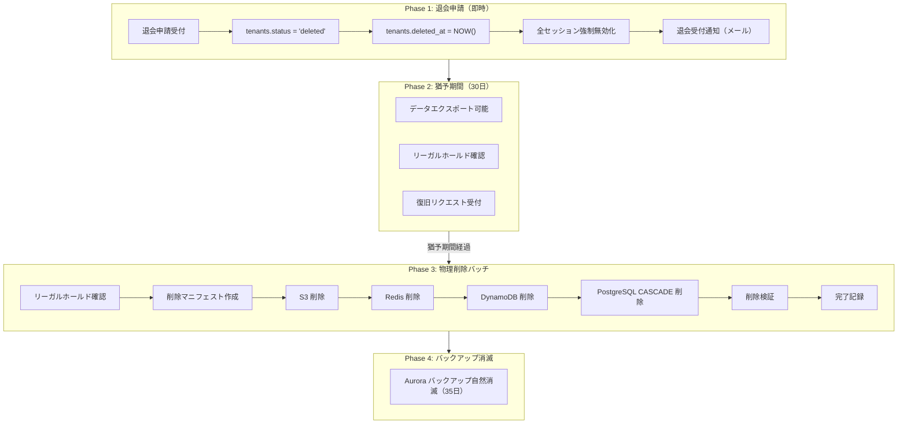
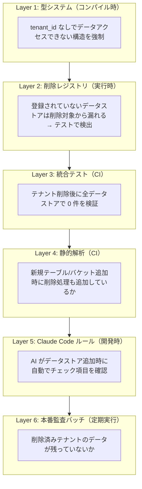
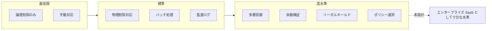

# テナント退会時データ削除設計

## 概要

テナントが RingiFlow を退会する際の、個人情報を含むデータの削除方針と実装設計を定義する。

### 設計原則

```
技術的には完全削除できる状態を作り、運用で制御する
```

契約や原則が「匿名化」であっても、技術的に「完全削除」が可能な設計にしておく。これにより、顧客要求や法規制の変化に対応できる。

意思決定の詳細は [ADR-007: テナント退会時のデータ削除方針](../05_ADR/007_テナント退会時のデータ削除方針.md) を参照。

---

## 削除対象データ一覧

### PostgreSQL (Aurora)

#### public スキーマ（Core Service 管理）

| テーブル | 個人情報 | 削除方法 | 備考 |
|---------|---------|---------|------|
| tenants | △ settings 内 | CASCADE 起点 | status='deleted' で論理削除後、物理削除 |
| users | ◎ email, name | CASCADE | tenant_id 経由で削除 |
| roles | × | CASCADE | テナント固有ロール |
| user_roles | × | CASCADE | user_id 経由で削除 |
| workflow_definitions | × | CASCADE | created_by は SET NULL |
| workflow_instances | ◎ form_data | CASCADE | initiated_by は SET NULL |
| workflow_steps | ○ comment | CASCADE | assigned_to は SET NULL |
| workflow_comments | ○ body | CASCADE | instance_id 経由で削除、posted_by は RESTRICT |
| display_id_counters | × | CASCADE | tenant_id FK で自動削除 |

#### auth スキーマ（Auth Service 管理）

| テーブル | 個人情報 | 削除方法 | 備考 |
|---------|---------|---------|------|
| auth.credentials | ◎ credential_data | tenant_id で DELETE | users とは独立して削除可能 |

### DynamoDB

| テーブル | 個人情報 | パーティションキー | 削除方法 |
|---------|---------|------------------|---------|
| audit_logs | ◎ actorId, sourceIp | tenant_id | Query + BatchDeleteItem |
| workflow_events | ○ | tenant_id | Query + BatchDeleteItem |
| notifications | ○ | tenant_id | Query + BatchDeleteItem |
| feature_flags | × | tenant_id | Query + BatchDeleteItem |

### S3

| バケット | 個人情報 | パス設計 | 削除方法 |
|---------|---------|---------|---------|
| documents | ◎ ファイル内容 | `{tenant_id}/...` | プレフィックス削除 |
| exports | ◎ | `{tenant_id}/...` | プレフィックス削除 |
| logs/app | ○ | `{tenant_id}/...` | プレフィックス削除 |
| logs/audit | ◎ | `{tenant_id}/...` | ポリシーに従い処理 |

### Redis

| キーパターン | 個人情報 | 削除方法 |
|-------------|---------|---------|
| session:{tenant_id}:{session_id} | ◎ email, name | SCAN + DEL |
| csrf:{tenant_id}:{session_id} | × | SCAN + DEL |
| stats:{tenant_id}:* | × | SCAN + DEL |
| tenant_sessions:{tenant_id} | × | DEL |

### バックアップ

| 種別 | 削除方法 | 備考 |
|------|---------|------|
| Aurora 自動バックアップ | 自然消滅（35日） | 個別削除不可 |
| S3 バージョニング | 削除マーカー + 自然消滅 | ライフサイクルポリシー |

---

## データストア設計要件

### 必須: tenant_id による削除が可能な設計

すべてのデータストアで、`tenant_id` を指定して効率的に削除できる設計とする。

#### PostgreSQL

```sql
-- 外部キーは CASCADE または SET NULL を必ず設定
-- SET NULL は「削除されたユーザーによる操作」を表現する場合に使用

ALTER TABLE workflow_definitions
  DROP CONSTRAINT IF EXISTS workflow_definitions_created_by_fkey,
  ADD CONSTRAINT workflow_definitions_created_by_fkey
    FOREIGN KEY (created_by) REFERENCES users(id) ON DELETE SET NULL;

ALTER TABLE workflow_instances
  DROP CONSTRAINT IF EXISTS workflow_instances_initiated_by_fkey,
  ADD CONSTRAINT workflow_instances_initiated_by_fkey
    FOREIGN KEY (initiated_by) REFERENCES users(id) ON DELETE SET NULL;

ALTER TABLE workflow_steps
  DROP CONSTRAINT IF EXISTS workflow_steps_assigned_to_fkey,
  ADD CONSTRAINT workflow_steps_assigned_to_fkey
    FOREIGN KEY (assigned_to) REFERENCES users(id) ON DELETE SET NULL;
```

```sql
-- テナントテーブルに削除管理用カラムを追加
ALTER TABLE tenants ADD COLUMN IF NOT EXISTS deleted_at TIMESTAMPTZ;
ALTER TABLE tenants ADD COLUMN IF NOT EXISTS deletion_policy JSONB NOT NULL DEFAULT '{
  "audit_log_policy": "delete",
  "grace_period_days": 30
}';
```

#### DynamoDB

```
すべてのテーブルで tenant_id をパーティションキーに含める

推奨設計:
  PK: tenant_id
  SK: {entity_type}#{entity_id}#{timestamp}

例:
  audit_logs:     PK=tenant_id, SK=timestamp
  workflow_events: PK=tenant_id, SK=workflow_id#sequence
  notifications:  PK=tenant_id, SK=user_id#created_at
  feature_flags:  PK=tenant_id, SK=flag_key
```

#### S3

```
すべてのオブジェクトパスの先頭に tenant_id を含める

s3://{bucket}/{tenant_id}/{category}/{...}

例:
  s3://ringiflow-prod-documents/tenant-abc/workflows/123/attachment.pdf
  s3://ringiflow-prod-exports/tenant-abc/2025/01/export-456.json
  s3://ringiflow-prod-logs/tenant-abc/app/2025/01/15/app.log
```

#### Redis

```
セッション関連のキーに tenant_id を含める

session:{tenant_id}:{session_id}
csrf:{tenant_id}:{session_id}
stats:{tenant_id}:{user_id}

テナントのセッション一覧を管理:
tenant_sessions:{tenant_id} → Set of session_ids
```

---

## 削除フロー



### Phase 1: 退会申請（即時実行）

```rust
async fn initiate_tenant_withdrawal(tenant_id: TenantId) -> Result<()> {
    // 1. ステータス更新
    sqlx::query!(
        r#"
        UPDATE tenants
        SET status = 'deleted', deleted_at = NOW()
        WHERE id = $1
        "#,
        tenant_id
    ).execute(&pool).await?;

    // 2. 全セッション無効化
    invalidate_all_sessions(tenant_id).await?;

    // 3. 退会通知メール送信
    send_withdrawal_confirmation_email(tenant_id).await?;

    // 4. 監査ログ記録
    audit_log(AuditEvent::TenantWithdrawalInitiated { tenant_id }).await?;

    Ok(())
}
```

### Phase 2: 猶予期間

- 期間: デフォルト 30 日（テナント設定で 7〜30 日の範囲で変更可能）
- この期間中、テナント管理者はデータエクスポートが可能
- 誤退会の場合、サポート経由で復旧可能
- リーガルホールドが設定されている場合は削除を延期

### Phase 3: 物理削除バッチ

毎日実行されるバッチ処理。`deleted_at + grace_period` を経過したテナントを物理削除する。

```rust
async fn physical_deletion_batch() -> Result<BatchResult> {
    // 削除対象テナントを取得
    let targets = sqlx::query_as!(
        DeletionTarget,
        r#"
        SELECT t.id, t.deleted_at, t.deletion_policy
        FROM tenants t
        WHERE t.status = 'deleted'
          AND t.deleted_at + (t.deletion_policy->>'grace_period_days')::int * INTERVAL '1 day' < NOW()
          AND NOT COALESCE((t.deletion_policy->>'legal_hold')::boolean, false)
        "#
    ).fetch_all(&pool).await?;

    for target in targets {
        match delete_tenant_data(target).await {
            Ok(_) => log::info!("Tenant {} deleted successfully", target.id),
            Err(e) => {
                log::error!("Failed to delete tenant {}: {}", target.id, e);
                alert_deletion_failure(target.id, e).await;
            }
        }
    }

    Ok(BatchResult { processed: targets.len() })
}
```

#### 削除順序

データ間の依存関係を考慮し、以下の順序で削除する。

```rust
async fn delete_tenant_data(target: DeletionTarget) -> Result<()> {
    let tenant_id = target.id;

    // Step 0: 削除マニフェスト作成（事前カウント）
    let manifest = create_deletion_manifest(tenant_id).await?;
    save_manifest_to_s3(&manifest).await?;

    // Step 1: S3 削除（外部参照されないので先に削除可能）
    delete_s3_objects(tenant_id, "documents").await?;
    delete_s3_objects(tenant_id, "exports").await?;

    // Step 2: Redis 削除（セッションは既に無効化済み）
    delete_redis_keys(tenant_id).await?;

    // Step 3: DynamoDB 削除
    delete_dynamodb_items(tenant_id, "notifications").await?;
    delete_dynamodb_items(tenant_id, "feature_flags").await?;
    delete_dynamodb_items(tenant_id, "workflow_events").await?;

    // Step 4: Auth Service の credentials 削除
    delete_auth_credentials(tenant_id).await?;

    // Step 5: 監査ログ処理（ポリシーに従う）
    match target.deletion_policy.audit_log_policy.as_str() {
        "delete" => delete_dynamodb_items(tenant_id, "audit_logs").await?,
        "anonymize" => anonymize_audit_logs(tenant_id).await?,
        "retain" => {} // 何もしない
    }

    // Step 6: PostgreSQL CASCADE 削除
    // tenants を削除すると、CASCADE で関連テーブルがすべて削除される
    sqlx::query!("DELETE FROM tenants WHERE id = $1", tenant_id)
        .execute(&pool).await?;

    // Step 7: 削除検証
    let verification = verify_deletion(tenant_id).await?;
    if !verification.is_complete() {
        return Err(Error::DeletionIncomplete(verification.errors));
    }

    // Step 8: 完了記録
    manifest.mark_completed();
    save_manifest_to_s3(&manifest).await?;

    // システム監査ログ（テナント情報は匿名化）
    system_audit_log(SystemAuditEvent::TenantDataDeleted {
        tenant_hash: hash(tenant_id),
        manifest_path: manifest.s3_path,
    }).await?;

    Ok(())
}
```

---

## 漏れ防止の仕組み

### 1. 削除マニフェスト

削除前に対象件数をカウントし、削除後に 0 件であることを検証する。

```rust
struct DeletionManifest {
    tenant_id: Uuid,
    created_at: DateTime<Utc>,

    // 削除前のカウント
    pre_deletion_counts: DataCounts,

    // 削除後のカウント（検証用）
    post_deletion_counts: Option<DataCounts>,

    // 完了情報
    completed_at: Option<DateTime<Utc>>,
    status: DeletionStatus,
}

struct DataCounts {
    postgres_users: u64,
    postgres_workflow_instances: u64,
    postgres_workflow_steps: u64,
    auth_credentials: u64,
    dynamodb_audit_logs: u64,
    dynamodb_workflow_events: u64,
    dynamodb_notifications: u64,
    dynamodb_feature_flags: u64,
    s3_documents: u64,
    s3_exports: u64,
    redis_sessions: u64,
}
```

### 2. 削除後検証

```rust
async fn verify_deletion(tenant_id: Uuid) -> Result<DeletionVerification> {
    let mut errors = vec![];

    // PostgreSQL (public スキーマ)
    let user_count = sqlx::query_scalar!(
        "SELECT COUNT(*) FROM users WHERE tenant_id = $1",
        tenant_id
    ).fetch_one(&pool).await?;
    if user_count > 0 {
        errors.push(format!("PostgreSQL: {} users remaining", user_count));
    }

    // PostgreSQL (auth スキーマ)
    let cred_count = sqlx::query_scalar!(
        "SELECT COUNT(*) FROM auth.credentials WHERE tenant_id = $1",
        tenant_id
    ).fetch_one(&pool).await?;
    if cred_count > 0 {
        errors.push(format!("Auth: {} credentials remaining", cred_count));
    }

    // DynamoDB
    let audit_count = count_dynamodb_items(tenant_id, "audit_logs").await?;
    if audit_count > 0 {
        errors.push(format!("DynamoDB: {} audit_logs remaining", audit_count));
    }

    // S3
    let doc_count = count_s3_objects(tenant_id, "documents").await?;
    if doc_count > 0 {
        errors.push(format!("S3: {} documents remaining", doc_count));
    }

    // Redis
    let session_count = count_redis_keys(format!("session:{}:*", tenant_id)).await?;
    if session_count > 0 {
        errors.push(format!("Redis: {} sessions remaining", session_count));
    }

    if errors.is_empty() {
        Ok(DeletionVerification::Complete)
    } else {
        // アラート発報
        alert_deletion_incomplete(tenant_id, &errors).await;
        Ok(DeletionVerification::Incomplete { errors })
    }
}
```

### 3. 定期監査バッチ

毎日実行。削除済みテナントにデータが残っていないか確認する。

```rust
async fn audit_deleted_tenants() -> Result<()> {
    // 削除完了済み（status='deleted' かつ物理削除済み）のテナント一覧
    // ※ 物理削除後は tenants レコード自体がないので、マニフェストから取得
    let manifests = list_completed_manifests().await?;

    for manifest in manifests {
        let verification = verify_deletion(manifest.tenant_id).await?;
        if !verification.is_complete() {
            // 削除漏れ発見 → アラート
            alert_data_leak_detected(manifest.tenant_id, verification.errors).await;
        }
    }

    Ok(())
}
```

### 4. 多層防御による漏れ防止

「人の注意力」に頼らず、システム的に漏れを防ぐ多層防御を実装する。



#### Layer 1: 型システムによる強制

```rust
/// テナントスコープのデータであることを示すトレイト
pub trait TenantScoped {
    fn tenant_id(&self) -> TenantId;
}

/// テナント削除可能であることを示すトレイト
pub trait TenantDeleter: Send + Sync {
    fn name(&self) -> &'static str;
    async fn delete(&self, tenant_id: TenantId) -> Result<DeletionResult>;
    async fn count(&self, tenant_id: TenantId) -> Result<u64>;
}

/// 削除クエリは必ず TenantId を受け取る（全件削除を型レベルで防ぐ）
pub struct TenantDeletionQuery {
    tenant_id: TenantId,  // 必須、tenant_id なしで構築不可
}
```

#### Layer 2: 削除レジストリ

```rust
/// 削除対象のデータストアを登録するレジストリ
pub struct DeletionRegistry {
    deleters: Vec<Box<dyn TenantDeleter>>,
}

impl DeletionRegistry {
    pub fn new() -> Self {
        let mut registry = Self { deleters: vec![] };

        // すべてのデータストアを登録（ここに追加し忘れるとテストで検出）
        registry.register(Box::new(PostgresUserDeleter));
        registry.register(Box::new(PostgresWorkflowDeleter));
        registry.register(Box::new(AuthCredentialsDeleter));  // Auth Service
        registry.register(Box::new(DynamoAuditLogDeleter));
        registry.register(Box::new(DynamoWorkflowEventDeleter));
        registry.register(Box::new(S3DocumentDeleter));
        registry.register(Box::new(RedisSessionDeleter));
        // ... 新規追加時はここに登録

        registry
    }
}
```

#### Layer 3: 統合テスト

```rust
#[tokio::test]
async fn test_tenant_deletion_removes_all_data() {
    // Arrange: テストデータ作成
    let tenant = create_test_tenant().await;
    create_test_user(tenant.id).await;
    create_test_workflow(tenant.id).await;

    // Act: テナント削除
    let registry = DeletionRegistry::new();
    registry.delete_all(tenant.id).await.unwrap();

    // Assert: すべて 0 件
    let report = registry.verify_all(tenant.id).await.unwrap();
    for (name, count) in report.counts() {
        assert_eq!(count, 0, "Data remains in {}: {} items", name, count);
    }
}

#[test]
fn test_all_data_stores_are_registered() {
    let registry = DeletionRegistry::new();
    let registered = registry.registered_names();

    // 期待リスト（手動管理、新規追加時に更新必須）
    let expected = vec![
        "postgres:users",
        "postgres:workflows",
        "auth:credentials",
        "dynamodb:audit_logs",
        "dynamodb:workflow_events",
        "s3:documents",
        "redis:sessions",
    ];

    for name in &expected {
        assert!(registered.contains(name), "Missing: {}", name);
    }
    for name in &registered {
        assert!(expected.contains(name), "Unexpected: {} - update expected list!", name);
    }
}
```

#### Layer 4: CI チェック

```yaml
# .github/workflows/data-store-check.yaml
name: Data Store Registration Check

on:
  pull_request:
    paths:
      - 'backend/migrations/**'
      - 'infra/dynamodb/**'
      - 'infra/s3/**'

jobs:
  check:
    runs-on: ubuntu-latest
    steps:
      - name: Check for new data stores
        run: |
          NEW_STORES=$(git diff origin/main --name-only | grep -E 'migrations/.*create|infra/(dynamodb|s3)' || true)
          if [ -n "$NEW_STORES" ]; then
            DELETION_CHANGES=$(git diff origin/main --name-only | grep -E 'deletion' || true)
            if [ -z "$DELETION_CHANGES" ]; then
              echo "::error::New data store added but no changes to deletion handlers!"
              exit 1
            fi
          fi
```

#### Layer 5: Claude Code ルール

AI エージェントがデータストア関連ファイルを編集する際、自動的にチェック項目を確認する。

→ [`.claude/rules/data-store.md`](../../.claude/rules/data-store.md)

適用対象:
- `backend/migrations/**/*.sql`
- `infra/dynamodb/**/*.tf`
- `infra/s3/**/*.tf`
- `**/repository/**/*.rs`

#### Layer 6: 本番監査バッチ

毎日実行し、削除済みテナントにデータが残っていないか確認する（既述の `audit_deleted_tenants()`）。

### チェック機構の一覧

| Layer | チェック内容 | タイミング | 検出できること |
|-------|------------|-----------|---------------|
| 型システム | tenant_id 必須の構造 | コンパイル時 | tenant_id なしのアクセス |
| 削除レジストリ | 登録されたものだけ削除 | 実行時 | 登録漏れ（テストで検出） |
| 統合テスト | 削除後 0 件検証 | CI | 削除処理の実装バグ |
| 登録漏れテスト | expected リストとの照合 | CI | 新規データストアの登録忘れ |
| CI チェック | 新規追加時の削除処理確認 | PR | 削除ハンドラ追加忘れ |
| Claude Code | チェックリスト自動確認 | 開発時 | AI による追加漏れ |
| 本番監査 | 削除済みテナントの残存確認 | 定期実行 | 本番での削除漏れ |

---

## 監査ログの扱い

監査ログは契約/ポリシーによって処理が異なる。

| ポリシー | 処理内容 | ユースケース |
|---------|---------|-------------|
| delete | 物理削除 | デフォルト、GDPR 対応 |
| anonymize | actorId→ハッシュ, sourceIp→マスク | 監査証跡を残しつつ個人特定不可に |
| retain | 何もしない | 法的要件で保持が必要な場合 |

```rust
async fn anonymize_audit_logs(tenant_id: Uuid) -> Result<()> {
    // DynamoDB の audit_logs を走査して匿名化
    let items = query_all_audit_logs(tenant_id).await?;

    for item in items {
        let anonymized = AuditLogItem {
            actor_id: hash(item.actor_id),  // UUID → SHA256 ハッシュ
            source_ip: mask_ip(item.source_ip),  // 192.168.1.100 → 192.168.x.x
            ..item
        };
        update_audit_log(anonymized).await?;
    }

    Ok(())
}
```

---

## 顧客への説明

退会時にテナント管理者へ送信するメールの内容例:

```
件名: RingiFlow 退会手続き完了のお知らせ

○○様

RingiFlow の退会手続きを受け付けました。

■ 退会日時: 2025-01-15 10:30:00 (JST)

■ データの取り扱い
- 退会日から 30 日間はデータエクスポートが可能です
- 30 日経過後、お客様のデータは完全に削除されます
- バックアップを含め、35 日以内にすべてのデータが消去されます

■ データエクスポート
退会後 30 日以内であれば、以下の URL からデータをエクスポートできます:
https://app.ringiflow.com/export

ご不明な点がございましたら、サポートまでお問い合わせください。
```

---

## 今後の検討事項

本設計は実装を開始できるレベルにあるが、以下の観点は実装時・運用開始前に詰める必要がある。

### 実装時に詰める項目

| 観点 | 検討内容 | 対応タイミング |
|------|---------|---------------|
| バックアップ35日問題 | GDPR は「不当な遅延なく」削除を要求。35日が許容範囲か確認 | 法務レビュー時 |
| サードパーティ連携 | メール配信・分析ツール等の外部サービスに送ったデータの削除手順 | 外部サービス選定時 |
| 削除証明書 | 「削除しました」の証跡を顧客にどう提供するか（PDF、API等） | 運用設計時 |
| 暗号化キー管理 | 保存時暗号化のキーはテナント単位か共通か。テナント単位なら鍵削除も考慮 | インフラ実装時 |
| 削除パフォーマンス | 大量データ（数百万件）の削除にかかる時間とリソース | 負荷テスト時 |

### 運用開始前に必要なレビュー

| レビュー種別 | 確認内容 |
|-------------|---------|
| 法務レビュー | プライバシーポリシーへの反映、利用規約での削除ポリシー明示、顧客向け説明資料 |
| セキュリティレビュー | 削除処理自体の権限管理、削除ログの改ざん防止、削除バッチの実行権限 |
| 運用レビュー | 障害時のリカバリ手順、削除失敗時のエスカレーションフロー、監査対応手順 |

### 将来的な拡張（海外展開時）

| 観点 | 検討内容 |
|------|---------|
| 国別の法規制差異 | GDPR（EU）、CCPA（カリフォルニア）、PIPL（中国）等で要件が異なる |
| データレジデンシー | 特定リージョンにデータを留める要件への対応 |
| 越境データ移転 | データエクスポート時の越境移転規制への対応 |

### 業界水準との比較

本設計の位置づけを以下に示す。



---

## 変更履歴

| 日付 | 変更内容 |
|------|---------|
| 2026-01-15 | 初版作成 |
| 2026-01-15 | 多層防御による漏れ防止機構を追加（型システム、削除レジストリ、テスト、CI、Claude Code ルール） |
| 2026-01-15 | 今後の検討事項セクションを追加 |
| 2026-01-22 | auth.credentials テーブルを追加（Auth Service 分離対応） |
| 2026-02-02 | display_id_counters テーブルを追加（表示用 ID 対応） |
| 2026-02-12 | workflow_comments テーブルを追加（ワークフローコメント機能対応） |
