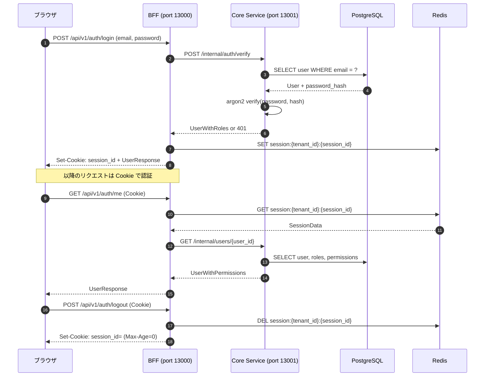
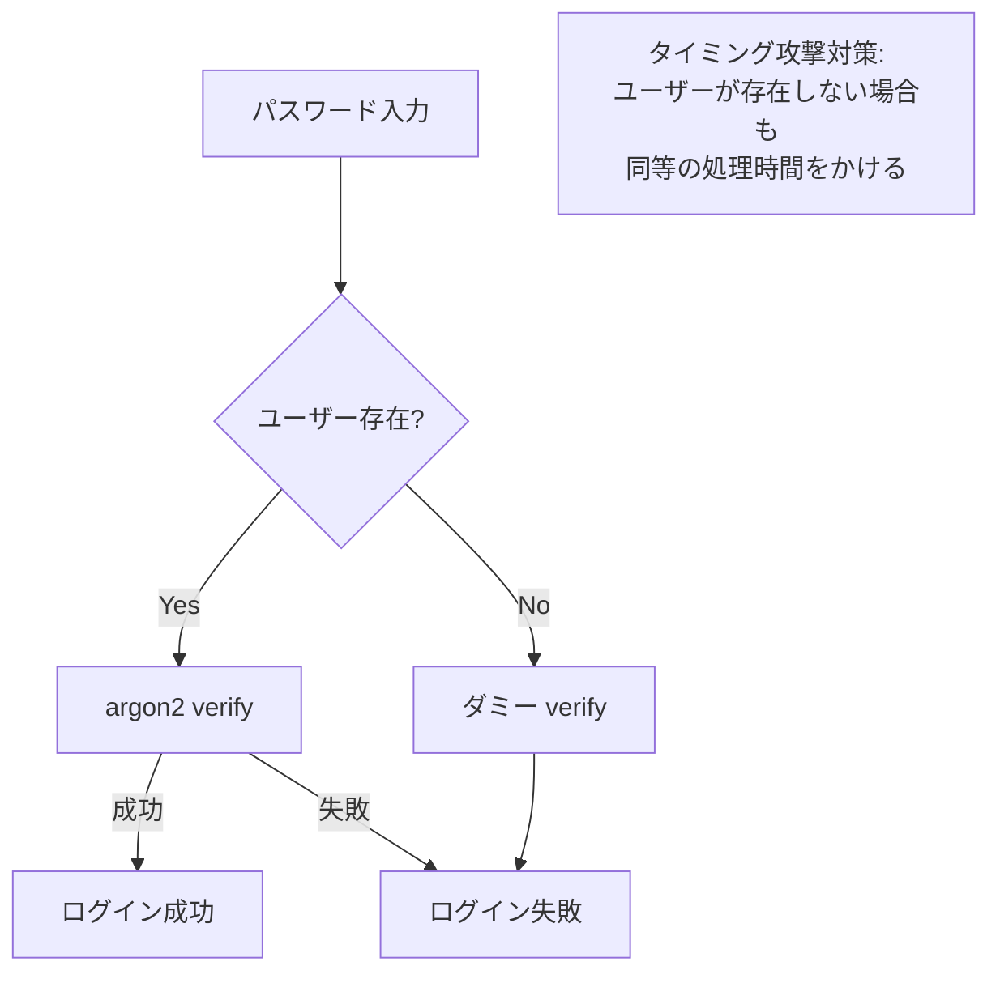
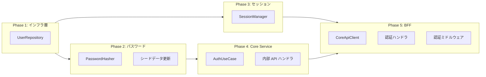

# 認証機能設計

## 概要

本ドキュメントは、RingiFlow MVP（Phase 1）の認証機能の詳細設計を定義する。

### 対象要件

| 要件 ID | 要件名 | 説明 |
|---------|--------|------|
| AUTH-001 | メール/パスワード認証 | 標準的なメール・パスワードによるログイン |
| AUTH-007 | セッション管理 | HTTPOnly Cookie、アイドル/絶対期限 |
| AUTH-010 | トークン秘匿 | BFF でトークンを保持し、ブラウザに露出しない |
| AUTH-011 | CSRF 防御 | SameSite Cookie と同期トークン方式を併用 |

### Phase 1 スコープ

| 含めるもの | 含めないもの（Phase 2 以降） |
|-----------|---------------------------|
| メール/パスワード認証 | SSO（OIDC/SAML） |
| セッション管理 | MFA |
| CSRF トークン | パスワードリセット |
| ログイン/ログアウト API | ソーシャルログイン |

---

## アーキテクチャ

### 認証フロー全体像



### 責務分担

| レイヤー | 責務 |
|---------|------|
| **BFF** | セッション管理、Cookie 処理、CSRF 防御、Core Service への中継 |
| **Core Service** | パスワード検証、ユーザー情報取得、ビジネスロジック |
| **Redis** | セッションストア、CSRF トークン保存 |
| **PostgreSQL** | ユーザー永続化、ロール・権限管理 |

---

## API 設計

### BFF 公開 API

#### POST /api/v1/auth/login

メール/パスワードでログインし、セッションを確立する。

**リクエスト:**
```json
{
  "email": "user@example.com",
  "password": "password123"
}
```

**レスポンス（200 OK）:**
```json
{
  "data": {
    "user": {
      "id": "550e8400-e29b-41d4-a716-446655440000",
      "email": "user@example.com",
      "name": "山田 太郎",
      "tenant_id": "550e8400-e29b-41d4-a716-446655440001",
      "roles": ["user"]
    }
  }
}
```

**レスポンスヘッダー:**
```
Set-Cookie: session_id=xxx; HttpOnly; Secure; SameSite=Lax; Path=/; Max-Age=28800
```

**エラー（401 Unauthorized）:**
```json
{
  "type": "https://ringiflow.example.com/errors/authentication-failed",
  "title": "Authentication Failed",
  "status": 401,
  "detail": "メールアドレスまたはパスワードが正しくありません"
}
```

**セキュリティ考慮事項:**
- メールが存在しない場合もパスワード検証を実行し、タイミング攻撃を防ぐ
- ログイン失敗時は具体的な理由（メール不存在/パスワード不一致）を明かさない

---

#### POST /api/v1/auth/logout

セッションを無効化してログアウトする。

**リクエスト:** なし（Cookie のセッション ID を使用）

**レスポンス（204 No Content）:** 空

**レスポンスヘッダー:**
```
Set-Cookie: session_id=; HttpOnly; Secure; SameSite=Lax; Path=/; Max-Age=0
```

---

#### GET /api/v1/auth/me

現在のユーザー情報と権限を取得する。

**リクエスト:** なし（Cookie のセッション ID を使用）

**レスポンス（200 OK）:**
```json
{
  "data": {
    "id": "550e8400-e29b-41d4-a716-446655440000",
    "email": "user@example.com",
    "name": "山田 太郎",
    "tenant_id": "550e8400-e29b-41d4-a716-446655440001",
    "tenant_name": "Development Tenant",
    "roles": ["user"],
    "permissions": ["workflow:read", "workflow:create", "task:read", "task:update"]
  }
}
```

**エラー（401 Unauthorized）:**
```json
{
  "type": "https://ringiflow.example.com/errors/unauthorized",
  "title": "Unauthorized",
  "status": 401,
  "detail": "認証が必要です"
}
```

---

#### GET /api/v1/auth/csrf

CSRF トークンを取得する。

**リクエスト:** なし

**レスポンス（200 OK）:**
```json
{
  "data": {
    "token": "xxxxxxxxxxxxxxxxxxxxxxxxxxxxxxxx"
  }
}
```

---

### Core Service 内部 API

内部 API は BFF からのみアクセス可能。外部からのアクセスは禁止。

#### POST /internal/auth/verify

認証情報を検証し、ユーザー情報を返す。

**リクエスト:**
```json
{
  "tenant_id": "550e8400-e29b-41d4-a716-446655440001",
  "email": "user@example.com",
  "password": "password123"
}
```

**レスポンス（200 OK）:**
```json
{
  "user": {
    "id": "550e8400-e29b-41d4-a716-446655440000",
    "tenant_id": "550e8400-e29b-41d4-a716-446655440001",
    "email": "user@example.com",
    "name": "山田 太郎",
    "status": "active"
  },
  "roles": [
    {
      "id": "...",
      "name": "user",
      "permissions": ["workflow:read", "workflow:create", "task:read", "task:update"]
    }
  ]
}
```

**エラー（401 Unauthorized）:** 認証失敗

---

#### GET /internal/users/{user_id}

ユーザー情報をロール・権限付きで取得する。

**レスポンス（200 OK）:**
```json
{
  "user": {
    "id": "550e8400-e29b-41d4-a716-446655440000",
    "tenant_id": "550e8400-e29b-41d4-a716-446655440001",
    "email": "user@example.com",
    "name": "山田 太郎",
    "status": "active"
  },
  "tenant": {
    "id": "550e8400-e29b-41d4-a716-446655440001",
    "name": "Development Tenant"
  },
  "roles": ["user"],
  "permissions": ["workflow:read", "workflow:create", "task:read", "task:update"]
}
```

---

## セッション管理

### セッションデータ構造

```rust
pub struct SessionData {
    pub user_id: Uuid,
    pub tenant_id: Uuid,
    pub email: String,
    pub name: String,
    pub roles: Vec<String>,
    pub created_at: DateTime<Utc>,
    pub last_accessed_at: DateTime<Utc>,
}
```

### Redis キー設計

| キー | 値 | TTL | 説明 |
|-----|-----|-----|------|
| `session:{tenant_id}:{session_id}` | SessionData (JSON) | 28800秒 | セッションデータ |
| `csrf:{tenant_id}:{session_id}` | CSRF Token | 28800秒 | CSRF トークン |

**テナント退会時の削除:**
- `SCAN` で `session:{tenant_id}:*` パターンをマッチさせて `DEL`
- `SCAN` で `csrf:{tenant_id}:*` パターンをマッチさせて `DEL`

### Cookie 属性

| 属性 | 値 | 目的 |
|------|-----|------|
| HttpOnly | true | JavaScript からのアクセス禁止（XSS 対策） |
| Secure | true | HTTPS のみで送信 |
| SameSite | Lax | CSRF 対策（クロスサイトリクエストを制限） |
| Path | / | 全パスで有効 |
| Max-Age | 28800 | 8 時間（セッション有効期限） |

### セッション ID 生成

- UUID v4（暗号論的に安全なランダム値）を使用
- セッション ID は推測困難であること

---

## パスワード管理

パスワード要件は [01_コア要件.md](../01_要件定義書/01_コア要件.md) を参照。

### ハッシュアルゴリズム

Argon2id を使用（OWASP 推奨）。

**パラメータ:**

| パラメータ | 値 | 説明 |
|-----------|-----|------|
| Memory | 65536 KB (64 MB) | メモリコスト（RFC 9106 推奨） |
| Iterations | 1 | 時間コスト |
| Parallelism | 1 | 並列度 |
| Hash Length | 32 bytes | 出力ハッシュ長 |

詳細: [パスワードハッシュ](../06_ナレッジベース/security/パスワードハッシュ.md)

**ハッシュ形式:**
```
$argon2id$v=19$m=65536,t=1,p=1$<salt>$<hash>
```

### パスワード検証フロー



---

## CSRF 防御

### Double Submit Cookie パターン

1. ログイン成功時、CSRF トークンを生成して Redis に保存
2. `GET /api/v1/auth/csrf` でトークンをクライアントに返す
3. クライアントは状態変更リクエスト時に `X-CSRF-Token` ヘッダーにトークンを付与
4. BFF でトークンを検証

### CSRF トークン仕様

| 項目 | 仕様 |
|------|------|
| 形式 | 64 文字の暗号論的ランダム文字列（hex エンコード） |
| 保存場所 | Redis（`csrf:{tenant_id}:{session_id}`） |
| 有効期限 | セッションと同じ（28800 秒） |

### 検証対象

| メソッド | CSRF 検証 |
|---------|----------|
| GET | 不要 |
| HEAD | 不要 |
| OPTIONS | 不要 |
| POST | **必要** |
| PUT | **必要** |
| PATCH | **必要** |
| DELETE | **必要** |

---

## エラーハンドリング

### エラーコード

| HTTP ステータス | エラータイプ | 説明 |
|----------------|-------------|------|
| 400 | validation-error | バリデーションエラー |
| 401 | authentication-failed | 認証失敗（ログイン時） |
| 401 | unauthorized | 未認証（セッションなし/無効） |
| 403 | forbidden | 権限不足 |
| 429 | rate-limit-exceeded | レート制限超過 |

### エラーレスポンス形式

RFC 9457 Problem Details 形式を使用。

```json
{
  "type": "https://ringiflow.example.com/errors/authentication-failed",
  "title": "Authentication Failed",
  "status": 401,
  "detail": "メールアドレスまたはパスワードが正しくありません",
  "correlation_id": "550e8400-e29b-41d4-a716-446655440000"
}
```

---

## 実装コンポーネント

### 実装順序



### ファイル構成

```
backend/
├── crates/
│   ├── domain/
│   │   └── src/
│   │       ├── user.rs              # User エンティティ（既存）
│   │       └── role.rs              # Role エンティティ（既存）
│   └── infra/
│       └── src/
│           ├── repository.rs        # リポジトリモジュール
│           ├── repository/
│           │   └── user_repository.rs  # 新規
│           ├── password.rs          # 新規
│           └── session.rs           # 新規
├── apps/
│   ├── core-service/
│   │   └── src/
│   │       ├── usecase.rs           # ユースケースモジュール
│   │       ├── usecase/
│   │       │   └── auth.rs          # 新規
│   │       ├── handler.rs           # ハンドラモジュール
│   │       └── handler/
│   │           └── auth.rs          # 新規
│   └── bff/
│       └── src/
│           ├── client.rs            # クライアントモジュール
│           ├── client/
│           │   └── core_api.rs      # 新規
│           ├── handler.rs           # ハンドラモジュール
│           ├── handler/
│           │   └── auth.rs          # 新規
│           ├── middleware.rs        # ミドルウェアモジュール
│           └── middleware/
│               └── csrf.rs          # 新規: CSRF 検証ミドルウェア
└── migrations/
    └── 20260115000008_seed_system_data.sql  # パスワードハッシュ更新
```

### インターフェース定義

#### UserRepository

```rust
#[async_trait]
pub trait UserRepository: Send + Sync {
    /// メールアドレスでユーザーを検索（テナント内）
    async fn find_by_email(
        &self,
        tenant_id: &TenantId,
        email: &Email,
    ) -> Result<Option<User>, InfraError>;

    /// ID でユーザーを検索
    async fn find_by_id(&self, id: &UserId) -> Result<Option<User>, InfraError>;

    /// ユーザーをロール付きで取得
    async fn find_with_roles(
        &self,
        id: &UserId,
    ) -> Result<Option<(User, Vec<Role>)>, InfraError>;

    /// 最終ログイン日時を更新
    async fn update_last_login(&self, id: &UserId) -> Result<(), InfraError>;
}
```

#### PasswordHasher

```rust
pub trait PasswordHasher: Send + Sync {
    /// パスワードをハッシュ化
    fn hash(&self, password: &str) -> Result<String, InfraError>;

    /// パスワードを検証
    fn verify(&self, password: &str, hash: &str) -> Result<bool, InfraError>;
}
```

#### SessionManager

```rust
#[async_trait]
pub trait SessionManager: Send + Sync {
    /// セッションを作成し、セッション ID を返す
    async fn create(&self, data: &SessionData) -> Result<String, InfraError>;

    /// セッションを取得
    async fn get(
        &self,
        tenant_id: &TenantId,
        session_id: &str,
    ) -> Result<Option<SessionData>, InfraError>;

    /// セッションを削除
    async fn delete(
        &self,
        tenant_id: &TenantId,
        session_id: &str,
    ) -> Result<(), InfraError>;

    /// テナントの全セッションを削除（テナント退会時）
    async fn delete_all_for_tenant(&self, tenant_id: &TenantId) -> Result<(), InfraError>;

    // --- CSRF トークン管理 ---

    /// CSRF トークンを作成する
    async fn create_csrf_token(
        &self,
        tenant_id: &TenantId,
        session_id: &str,
    ) -> Result<String, InfraError>;

    /// CSRF トークンを取得する
    async fn get_csrf_token(
        &self,
        tenant_id: &TenantId,
        session_id: &str,
    ) -> Result<Option<String>, InfraError>;

    /// CSRF トークンを削除する
    async fn delete_csrf_token(
        &self,
        tenant_id: &TenantId,
        session_id: &str,
    ) -> Result<(), InfraError>;

    /// テナントの全 CSRF トークンを削除する（テナント退会時）
    async fn delete_all_csrf_for_tenant(&self, tenant_id: &TenantId) -> Result<(), InfraError>;
}
```

---

## テスト計画

### 単体テスト

| 対象 | テストケース |
|------|-------------|
| PasswordHasher | 正しいパスワード検証、不正なパスワード検証、不正なハッシュ形式 |

### 統合テスト

| 対象/シナリオ | テストケース |
|--------------|-------------|
| UserRepository | メールでユーザー検索、存在しないメール、別テナント分離、ロール付き取得、最終ログイン更新 |
| SessionManager | セッション作成/取得/削除、存在しないセッション取得、テナント単位削除 |
| CSRF トークン（SessionManager） | トークン作成/取得/削除、存在しないトークン取得、テナント単位削除 |
| ログイン成功 | 正しい認証情報でログイン → Cookie 取得 |
| ログイン失敗（パスワード不一致） | 不正なパスワードで 401 |
| ログイン失敗（メール不存在） | 存在しないメールで 401 |
| ログイン失敗（非アクティブユーザー） | 非アクティブユーザーで 401 |
| ユーザー情報取得 | Cookie でログイン後、/api/v1/auth/me でユーザー情報取得 |
| ログアウト | ログイン → ログアウト → /api/v1/auth/me で 401 |
| CSRF トークン生成 | ログイン成功時に CSRF トークンが Redis に生成される |
| CSRF トークン取得 | GET /api/v1/auth/csrf でトークンを取得できる |
| CSRF 検証成功 | 正しいトークンで POST リクエストが成功 |
| CSRF 検証失敗（トークンなし） | トークンなしで 403 |
| CSRF 検証失敗（不正トークン） | 不正なトークンで 403 |
| CSRF トークン削除 | ログアウト時に CSRF トークンが削除される |

---

## セキュリティ考慮事項

### 攻撃対策

| 攻撃 | 対策 |
|------|------|
| ブルートフォース | レート制限（将来実装） |
| タイミング攻撃 | ユーザー不存在時もダミー検証を実行 |
| セッションハイジャック | HTTPOnly + Secure + SameSite Cookie |
| XSS | トークンを JavaScript から隠蔽 |
| CSRF | SameSite Cookie + CSRF トークン |
| セッション固定 | ログイン時に新しいセッション ID を発行 |

### 監査ログ

以下のイベントを監査ログに記録する（Phase 2 以降で実装）：

- ログイン成功/失敗
- ログアウト
- セッション無効化

---

## 変更履歴

| 日付 | 変更内容 | 担当 |
|------|---------|------|
| 2026-01-17 | 初版作成 | - |
| 2026-01-18 | SessionManager に CSRF トークン管理メソッドを追加、テスト計画を詳細化 | - |
