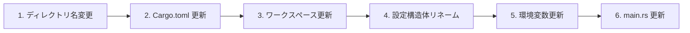
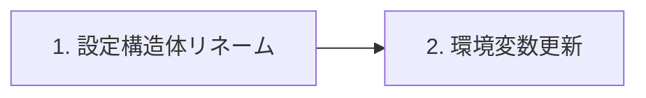
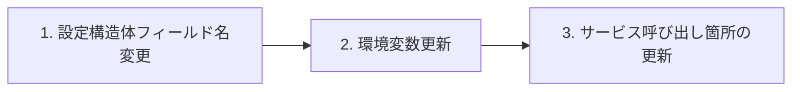

# 命名規則統一リファクタリング設計

## 概要

本ドキュメントは、ADR-022 に基づくバックエンドサービスの命名規則と層構造の統一に関する詳細設計を定義する。

### 関連ドキュメント

- [ADR-022: バックエンドサービスの命名規則と層構造の統一](../05_ADR/022_バックエンドサービスの命名規則と層構造の統一.md)
- [08_AuthService設計.md](./08_AuthService設計.md)

### スコープ

| 含めるもの | 含めないもの |
|-----------|-------------|
| `core-api` → `core-service` リネーム | 機能追加 |
| 環境変数の命名統一 | usecase 層の追加（core-service） |
| 設定構造体の命名統一 | アーキテクチャ変更 |
| ドキュメント更新 | — |

---

## 変更箇所一覧

### 1. ディレクトリ・ファイル名

| 変更前 | 変更後 |
|--------|--------|
| `backend/apps/core-api/` | `backend/apps/core-service/` |
| `backend/apps/core-api/Cargo.toml` | `backend/apps/core-service/Cargo.toml` |

### 2. Cargo.toml（クレート名）

#### backend/apps/core-service/Cargo.toml

```toml
# 変更前
[package]
name = "ringiflow-core-api"

# 変更後
[package]
name = "ringiflow-core-service"
```

#### backend/Cargo.toml（ワークスペース）

```toml
# 変更前
members = [
    "apps/bff",
    "apps/core-api",
    "apps/auth-service",
    # ...
]

# 変更後
members = [
    "apps/bff",
    "apps/core-service",
    "apps/auth-service",
    # ...
]
```

### 3. 環境変数

#### 変更対象ファイル

- `.env.example`
- `.env.development`（存在する場合）
- `docker-compose.yaml`
- `justfile`（該当箇所がある場合）
- GitHub Actions ワークフロー（該当箇所がある場合）

#### 変更内容

| 変更前 | 変更後 |
|--------|--------|
| `CORE_API_HOST` | `CORE_HOST` |
| `CORE_API_PORT` | `CORE_PORT` |
| `CORE_API_DATABASE_URL` | `CORE_DATABASE_URL` |
| `AUTH_SERVICE_HOST` | `AUTH_HOST` |
| `AUTH_SERVICE_PORT` | `AUTH_PORT` |
| `AUTH_SERVICE_DATABASE_URL` | `AUTH_DATABASE_URL` |

#### BFF 側の変更

| 変更前 | 変更後 |
|--------|--------|
| `BFF_CORE_API_URL` | `BFF_CORE_URL` |
| `BFF_AUTH_SERVICE_URL` | `BFF_AUTH_URL` |

### 4. 設定構造体

#### core-service/src/config.rs

```rust
// 変更前
pub struct CoreApiConfig {
    pub host: String,
    pub port: u16,
    pub database_url: String,
}

impl CoreApiConfig {
    pub fn from_env() -> Result<Self, ConfigError> {
        Ok(Self {
            host: env::var("CORE_API_HOST")?,
            port: env::var("CORE_API_PORT")?.parse()?,
            database_url: env::var("CORE_API_DATABASE_URL")?,
        })
    }
}

// 変更後
pub struct CoreConfig {
    pub host: String,
    pub port: u16,
    pub database_url: String,
}

impl CoreConfig {
    pub fn from_env() -> Result<Self, ConfigError> {
        Ok(Self {
            host: env::var("CORE_HOST")?,
            port: env::var("CORE_PORT")?.parse()?,
            database_url: env::var("CORE_DATABASE_URL")?,
        })
    }
}
```

#### auth-service/src/config.rs

```rust
// 変更前
pub struct AuthServiceConfig {
    pub host: String,
    pub port: u16,
    pub database_url: String,
}

impl AuthServiceConfig {
    pub fn from_env() -> Result<Self, ConfigError> {
        Ok(Self {
            host: env::var("AUTH_SERVICE_HOST")?,
            port: env::var("AUTH_SERVICE_PORT")?.parse()?,
            database_url: env::var("AUTH_SERVICE_DATABASE_URL")?,
        })
    }
}

// 変更後
pub struct AuthConfig {
    pub host: String,
    pub port: u16,
    pub database_url: String,
}

impl AuthConfig {
    pub fn from_env() -> Result<Self, ConfigError> {
        Ok(Self {
            host: env::var("AUTH_HOST")?,
            port: env::var("AUTH_PORT")?.parse()?,
            database_url: env::var("AUTH_DATABASE_URL")?,
        })
    }
}
```

#### bff/src/config.rs

```rust
// 変更前
pub struct BffConfig {
    // ...
    pub core_api_url: String,
    pub auth_service_url: String,
}

// 変更後
pub struct BffConfig {
    // ...
    pub core_url: String,
    pub auth_url: String,
}
```

### 5. main.rs のログ出力

#### core-service/src/main.rs

```rust
// 変更前
tracing::info!("Core API listening on {}:{}", config.host, config.port);

// 変更後
tracing::info!("Core Service listening on {}:{}", config.host, config.port);
```

#### auth-service/src/main.rs

```rust
// 変更前（該当箇所があれば）
tracing::info!("Auth Service listening on {}:{}", config.host, config.port);

// 変更なし（既に正しい）
```

### 6. ドキュメント更新

#### 更新対象

| ファイル | 変更内容 |
|---------|---------|
| `CLAUDE.md` | コードアーキテクチャの図を更新 |
| `docs/02_基本設計書/01_アーキテクチャ設計.md` | サービス名の更新 |
| `docs/03_詳細設計書/08_AuthService設計.md` | 環境変数名、設定構造体名の更新 |
| `docs/03_詳細設計書/03_API設計.md` | サービス名の更新（該当箇所） |
| `README.md` | サービス名の更新（該当箇所） |

---

## 実装手順

### Phase 1: core-api → core-service リネーム



#### 手順 1: ディレクトリ名変更

```bash
git mv backend/apps/core-api backend/apps/core-service
```

#### 手順 2: Cargo.toml 更新

`backend/apps/core-service/Cargo.toml` のパッケージ名を変更。

#### 手順 3: ワークスペース更新

`backend/Cargo.toml` のメンバーリストを更新。

#### 手順 4: 設定構造体リネーム

`CoreApiConfig` → `CoreConfig` に変更。

#### 手順 5: 環境変数更新

`.env.example` 等の環境変数名を更新。

#### 手順 6: main.rs 更新

ログ出力のサービス名を更新。

### Phase 2: auth-service の命名統一



#### 手順 1: 設定構造体リネーム

`AuthServiceConfig` → `AuthConfig` に変更。

#### 手順 2: 環境変数更新

`AUTH_SERVICE_*` → `AUTH_*` に変更。

### Phase 3: BFF の更新



#### 手順 1: 設定構造体フィールド名変更

`core_api_url` → `core_url`、`auth_service_url` → `auth_url` に変更。

#### 手順 2: 環境変数更新

`BFF_CORE_API_URL` → `BFF_CORE_URL` 等に変更。

#### 手順 3: サービス呼び出し箇所の更新

設定フィールド名変更に伴うコード修正。

### Phase 4: ドキュメント更新

1. CLAUDE.md のコードアーキテクチャ図を更新
2. 基本設計書・詳細設計書のサービス名を更新
3. README.md の該当箇所を更新

### Phase 5: 検証

```bash
# ビルド確認
just check-all

# 開発環境での動作確認
just dev-deps
just dev  # 開発サーバー起動（該当コマンドがあれば）
```

---

## 変更影響範囲

### ファイル一覧

```
backend/
├── Cargo.toml                    # ワークスペースメンバー更新
├── apps/
│   ├── bff/
│   │   └── src/
│   │       └── config.rs         # フィールド名、環境変数名
│   ├── core-service/             # ディレクトリ名変更
│   │   ├── Cargo.toml            # パッケージ名
│   │   └── src/
│   │       ├── main.rs           # ログ出力
│   │       └── config.rs         # 構造体名、環境変数名
│   └── auth-service/
│       └── src/
│           └── config.rs         # 構造体名、環境変数名

.env.example                      # 環境変数名
docker-compose.yaml                # 環境変数名、サービス名
justfile                          # 該当箇所があれば

docs/
├── CLAUDE.md                     # コードアーキテクチャ図
├── 02_基本設計書/
│   └── 01_アーキテクチャ設計.md  # サービス名
└── 03_詳細設計書/
    ├── 03_API設計.md             # サービス名
    └── 08_AuthService設計.md     # 環境変数名、構造体名
```

### 影響を受ける開発者アクション

| アクション | 対応 |
|-----------|------|
| ローカル環境変数の更新 | `.env` ファイルの変数名を新しい命名に変更 |
| IDE の再インデックス | Cargo.toml 変更後に再読み込み |

---

## リスクと対策

| リスク | 対策 |
|--------|------|
| 環境変数の変更漏れ | CI でのビルド・テストで検出 |
| ドキュメントの更新漏れ | PR レビューでチェック |
| 依存クレートの参照エラー | ワークスペース内の依存は相対パス、クレート名参照はない |

---

## 変更履歴

| 日付 | 変更内容 |
|------|---------|
| 2026-01-22 | 初版作成 |
