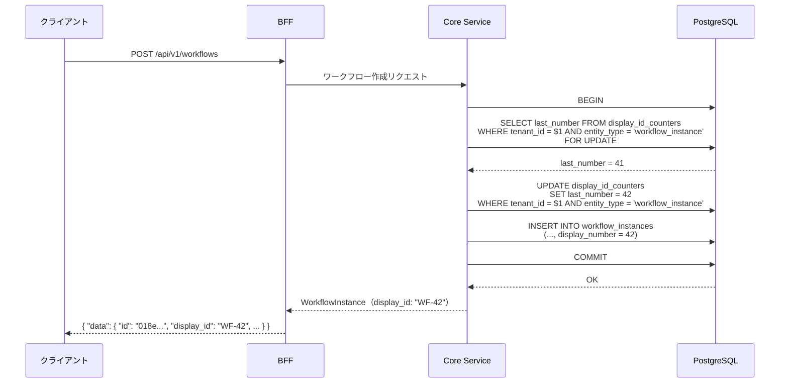

# 表示用 ID 設計

## 概要

本ドキュメントは、RingiFlow における人間向け表示用 ID の実装仕様を定義する。

決定の背景・代替案との比較については [ADR-029: 人間向け表示用 ID の導入](../05_ADR/029_人間向け表示用IDの導入.md) を参照。

## 表示用 ID の仕様

### フォーマット

```
{プレフィックス}-{連番}
```

例: `WF-1`, `WF-42`, `TASK-7`

| 要素 | 仕様 |
|------|------|
| プレフィックス | エンティティ種別ごとの固定文字列。アプリ層で結合 |
| 区切り文字 | ハイフン（`-`） |
| 連番 | テナント単位の正の整数（1 始まり、欠番許容、可変長） |

### 連番の桁数: 可変長

連番はゼロパディングしない可変長とする（`WF-42`。`WF-0042` ではない）。

理由:
- 表示用 ID の主目的は口頭伝達の改善。ゼロパディングは口頭で冗長になる（「ゼロゼロヨンニ」）
- 固定長は桁数の事前決定が必要で、桁あふれ時のルールも追加で必要になる
- Jira（`PROJ-123`）、GitHub（`#1`）など業界標準は可変長
- ソートは DB の `display_number`（BIGINT）で行うため、文字列ソートの順序問題は発生しない

### 対象エンティティとプレフィックス

| エンティティ | プレフィックス | 表示例 | entity_type 値 |
|-------------|--------------|--------|----------------|
| ワークフローインスタンス | `WF` | `WF-42` | `workflow_instance` |
| ワークフローステップ | `STEP` | `STEP-7` | `workflow_step` |

注: ワークフローステップはインスタンスに従属するため、プレフィックスは `TASK` ではなく `STEP` とする。将来独立したタスクエンティティが導入された場合に `TASK` を割り当てる。

### スコープ

テナント単位。各テナントが独立した連番体系を持つ。

```
テナント A: WF-1, WF-2, WF-3, ...
テナント B: WF-1, WF-2, WF-3, ...（独立）
```

### 欠番ポリシー

欠番を許容する。

理由:
- トランザクションのロールバックで採番済みの番号が使われない場合がある
- 論理削除・物理削除で番号が歯抜けになる場合がある
- 欠番を埋める処理は複雑でバグの温床になる
- ユーザーにとって連番の連続性は重要ではない（「WF-42 の次が WF-44」は問題にならない）

### URL ルーティング

URL には引き続き UUID を使用する。表示用 ID は URL パスには使用しない。

```
/workflows/018e5e6c-7f5a-7b3d-8f1a-2b3c4d5e6f7a  ← UUID（変更なし）
```

理由:
- UUID は全テナントで一意であり、tenant_id なしでルーティング可能
- 表示用 ID はテナント単位のため、`/tenants/{tenant_id}/workflows/WF-42` のようなパスが必要になる
- 既存の URL 構造を変更する必要がない

---

## 段階的導入計画

### Phase A: WorkflowInstance

ワークフローインスタンスに表示用 ID を導入する。

| Sub-issue | 内容 |
|-----------|------|
| A-1 | DB スキーマ変更（カウンターテーブル、display_number カラム、マイグレーション） |
| A-2 | バックエンド実装（ドメインモデル、採番サービス、リポジトリ） |
| A-3 | API + フロントエンド（レスポンスに display_id 追加、UI 表示） |

### Phase B: WorkflowStep

Phase A 完了後、ワークフローステップに同様のパターンを適用する。

Phase A で確立したパターンを再利用するため、実装コストは低い。

---

## DB スキーマ設計

### カウンターテーブル

```sql
CREATE TABLE display_id_counters (
    tenant_id UUID NOT NULL REFERENCES tenants(id) ON DELETE CASCADE,
    entity_type VARCHAR(50) NOT NULL,
    last_number BIGINT NOT NULL DEFAULT 0,
    PRIMARY KEY (tenant_id, entity_type),
    CONSTRAINT chk_last_number_non_negative CHECK (last_number >= 0)
);

COMMENT ON TABLE display_id_counters IS '表示用 ID の採番カウンター';
COMMENT ON COLUMN display_id_counters.entity_type IS 'エンティティ種別（workflow_instance, workflow_step）';
COMMENT ON COLUMN display_id_counters.last_number IS '最後に採番した番号（0 は未採番）';
```

設計判断:
- 複合主キー `(tenant_id, entity_type)` により、テナント×エンティティ種別ごとに1行
- `ON DELETE CASCADE` でテナント退会時にカウンターも自動削除
- `last_number` は 0 始まり（未採番状態を表現）。採番時に +1 して使用
- BIGINT（最大 9.2 × 10^18）により、実質的に枯渇しない

### workflow_instances テーブルへのカラム追加

```sql
ALTER TABLE workflow_instances
    ADD COLUMN display_number BIGINT;

-- テナント内でのユニーク制約
CREATE UNIQUE INDEX idx_workflow_instances_display_number
    ON workflow_instances (tenant_id, display_number)
    WHERE display_number IS NOT NULL;

COMMENT ON COLUMN workflow_instances.display_number IS '表示用連番（テナント内で一意）';
```

設計判断:
- `display_number` は NULLABLE。既存データのマイグレーション前は NULL を許容
- 部分ユニークインデックス（`WHERE display_number IS NOT NULL`）により、NULL 行は制約対象外
- プレフィックスは保存しない（アプリ層で結合）

### workflow_steps テーブルへのカラム追加（Phase B）

```sql
ALTER TABLE workflow_steps
    ADD COLUMN display_number BIGINT;

CREATE UNIQUE INDEX idx_workflow_steps_display_number
    ON workflow_steps (instance_id, display_number)
    WHERE display_number IS NOT NULL;

COMMENT ON COLUMN workflow_steps.display_number IS '表示用連番（インスタンス内で一意）';
```

注: ワークフローステップの連番スコープはインスタンス単位とする。テナント全体で通し番号にすると番号が大きくなりすぎるため。カウンターテーブルの `entity_type` は `workflow_step` で、カウンターのスコープ自体はテナント単位（テナント内の全ステップに通し番号）。

---

## ドメインモデル設計

### DisplayNumber 値オブジェクト

```rust
/// 表示用連番（テナント内で一意な正の整数）
#[derive(Debug, Clone, Copy, PartialEq, Eq, Hash, PartialOrd, Ord)]
#[derive(serde::Serialize, serde::Deserialize)]
#[serde(transparent)]
pub struct DisplayNumber(i64);

impl DisplayNumber {
    /// 値を生成（1 以上であることを保証）
    pub fn new(value: i64) -> Result<Self, DomainError> {
        if value < 1 {
            return Err(DomainError::InvalidDisplayNumber(value));
        }
        Ok(Self(value))
    }

    pub fn value(&self) -> i64 {
        self.0
    }
}

impl std::fmt::Display for DisplayNumber {
    fn fmt(&self, f: &mut std::fmt::Formatter<'_>) -> std::fmt::Result {
        write!(f, "{}", self.0)
    }
}
```

設計判断:
- `i64` を使用（PostgreSQL の BIGINT は符号付き 64bit 整数）
- `new()` でバリデーション（1 以上）を強制し、不正な状態を型で防ぐ
- `serde(transparent)` で JSON シリアライズ時は数値としてそのまま出力

### DisplayId 値オブジェクト

```rust
/// 表示用 ID（プレフィックス + 連番）
/// API レスポンスで使用する文字列表現
#[derive(Debug, Clone, PartialEq, Eq, Hash)]
pub struct DisplayId {
    prefix: &'static str,
    number: DisplayNumber,
}

impl DisplayId {
    pub fn new(prefix: &'static str, number: DisplayNumber) -> Self {
        Self { prefix, number }
    }
}

impl std::fmt::Display for DisplayId {
    fn fmt(&self, f: &mut std::fmt::Formatter<'_>) -> std::fmt::Result {
        write!(f, "{}-{}", self.prefix, self.number)
    }
}

impl serde::Serialize for DisplayId {
    fn serialize<S: serde::Serializer>(&self, serializer: S) -> Result<S::Ok, S::Error> {
        serializer.serialize_str(&self.to_string())
    }
}
```

設計判断:
- `prefix` は `&'static str` でコンパイル時に決まる定数
- `Display` トレイトで `WF-42` 形式の文字列を生成
- シリアライズ時は文字列として出力（`"WF-42"`）

### エンティティプレフィックスの定義

```rust
/// 表示用 ID のプレフィックス定義
pub mod display_prefix {
    pub const WORKFLOW_INSTANCE: &str = "WF";
    pub const WORKFLOW_STEP: &str = "STEP";
}

/// 表示用 ID のカウンター対象エンティティ種別
#[derive(Debug, Clone, Copy, PartialEq, Eq, Hash)]
pub enum DisplayIdEntityType {
    WorkflowInstance,
    WorkflowStep,
}

impl DisplayIdEntityType {
    /// DB に保存する文字列
    pub fn as_str(&self) -> &'static str {
        match self {
            Self::WorkflowInstance => "workflow_instance",
            Self::WorkflowStep => "workflow_step",
        }
    }

    /// 表示用プレフィックス
    pub fn prefix(&self) -> &'static str {
        match self {
            Self::WorkflowInstance => display_prefix::WORKFLOW_INSTANCE,
            Self::WorkflowStep => display_prefix::WORKFLOW_STEP,
        }
    }
}
```

---

## 採番フロー

### シーケンス図（ワークフロー作成時）



### 採番処理の擬似コード

```rust
/// 表示用 ID の採番
async fn next_display_number(
    tx: &mut PgTransaction,
    tenant_id: TenantId,
    entity_type: DisplayIdEntityType,
) -> Result<DisplayNumber, DomainError> {
    // 行ロックを取得しつつ現在値を読み取り
    let row = sqlx::query!(
        r#"
        SELECT last_number
        FROM display_id_counters
        WHERE tenant_id = $1 AND entity_type = $2
        FOR UPDATE
        "#,
        tenant_id.as_uuid(),
        entity_type.as_str(),
    )
    .fetch_one(&mut **tx)
    .await?;

    let next = row.last_number + 1;

    // カウンターを更新
    sqlx::query!(
        r#"
        UPDATE display_id_counters
        SET last_number = $3
        WHERE tenant_id = $1 AND entity_type = $2
        "#,
        tenant_id.as_uuid(),
        entity_type.as_str(),
        next,
    )
    .execute(&mut **tx)
    .await?;

    DisplayNumber::new(next)
}
```

### テナント作成時のカウンター初期化

テナント作成時に、対象エンティティ種別のカウンター行を INSERT する。

```sql
-- テナント作成トランザクション内で実行
INSERT INTO display_id_counters (tenant_id, entity_type, last_number) VALUES
    ($1, 'workflow_instance', 0),
    ($1, 'workflow_step', 0);
```

---

## API 仕様変更

### レスポンスへの display_id フィールド追加

ワークフロー関連の API レスポンスに `display_id` フィールドを追加する。

#### ワークフロー一覧（GET /api/v1/workflows）

```json
{
  "data": [
    {
      "id": "018e5e6c-7f5a-7b3d-8f1a-2b3c4d5e6f7a",
      "display_id": "WF-42",
      "title": "出張旅費申請",
      "status": "pending",
      ...
    }
  ]
}
```

#### ワークフロー詳細（GET /api/v1/workflows/{id}）

```json
{
  "data": {
    "id": "018e5e6c-7f5a-7b3d-8f1a-2b3c4d5e6f7a",
    "display_id": "WF-42",
    "title": "出張旅費申請",
    "status": "pending",
    "steps": [
      {
        "id": "019a...",
        "display_id": "STEP-7",
        "step_name": "部長承認",
        ...
      }
    ],
    ...
  }
}
```

#### タスク一覧（GET /api/v1/tasks/my）

```json
{
  "data": [
    {
      "id": "019a...",
      "workflow_display_id": "WF-42",
      "step_name": "部長承認",
      ...
    }
  ]
}
```

### OpenAPI 仕様の変更箇所

`openapi/openapi.yaml` に以下を追加:

1. `WorkflowSummary` スキーマに `display_id` プロパティ追加
2. `WorkflowDetail` スキーマに `display_id` プロパティ追加
3. `StepDetail` スキーマに `display_id` プロパティ追加
4. `TaskSummary` スキーマに `workflow_display_id` プロパティ追加

---

## フロントエンド対応

### 表示箇所

| 画面 | 表示方法 |
|------|---------|
| ワークフロー一覧 | タイトルの前に `WF-42` をバッジ表示 |
| ワークフロー詳細 | ヘッダーに `WF-42: 出張旅費申請` |
| タスク一覧 | ワークフロー参照に `WF-42` を表示 |
| ダッシュボード | 統計には影響なし |

### Elm モデルの変更

```elm
type alias WorkflowSummary =
    { id : WorkflowInstanceId
    , displayId : String        -- 追加: "WF-42"
    , title : String
    , status : WorkflowStatus
    , ...
    }
```

`displayId` は API からの文字列をそのまま使用する。フロントエンドでの組み立ては不要。

---

## 既存データのマイグレーション方針

### 方針

既存の workflow_instances に対して、`created_at` 順で連番を割り当てる。

```sql
-- 既存データへの display_number 割り当て
WITH numbered AS (
    SELECT id, tenant_id,
           ROW_NUMBER() OVER (PARTITION BY tenant_id ORDER BY created_at, id) AS rn
    FROM workflow_instances
)
UPDATE workflow_instances wi
SET display_number = n.rn
FROM numbered n
WHERE wi.id = n.id;

-- カウンターテーブルの初期化
INSERT INTO display_id_counters (tenant_id, entity_type, last_number)
SELECT tenant_id, 'workflow_instance', COUNT(*)
FROM workflow_instances
GROUP BY tenant_id
ON CONFLICT (tenant_id, entity_type)
DO UPDATE SET last_number = EXCLUDED.last_number;
```

### マイグレーション後の NOT NULL 制約

データマイグレーション完了後、display_number を NOT NULL に変更する。

```sql
ALTER TABLE workflow_instances
    ALTER COLUMN display_number SET NOT NULL;
```

注: この ALTER は別マイグレーションファイルとして実行する（データマイグレーションと DDL 変更を分離）。

---

## セキュリティ考慮事項

| リスク | 対策 |
|--------|------|
| テナント間の番号推測 | テナント単位の連番のため、他テナントの番号は無意味 |
| 列挙攻撃（display_number 順に試行） | API は UUID でのみアクセス可能。display_id による検索 API は提供しない |
| カウンターの競合操作 | `SELECT FOR UPDATE` で排他制御済み |

---

## 関連ドキュメント

- [ADR-029: 人間向け表示用 ID の導入](../05_ADR/029_人間向け表示用IDの導入.md) - 決定の背景と代替案の比較
- [04_ID設計規約.md](04_ID設計規約.md) - ID 全般の設計規約
- [02_データベース設計書.md](02_データベース設計書.md) - DB スキーマ全体
- [03_API設計書.md](03_API設計書.md) - API 仕様全体

---

## 変更履歴

| 日付 | 変更内容 | 担当 |
|------|---------|------|
| 2026-02-01 | 初版作成 | - |
