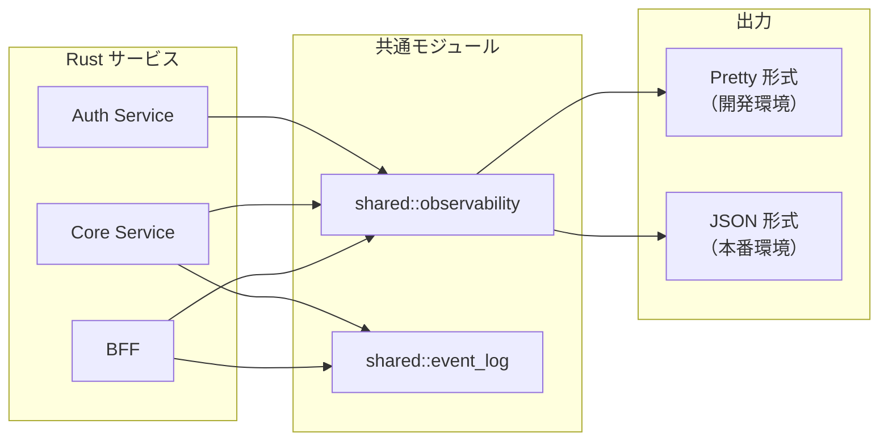
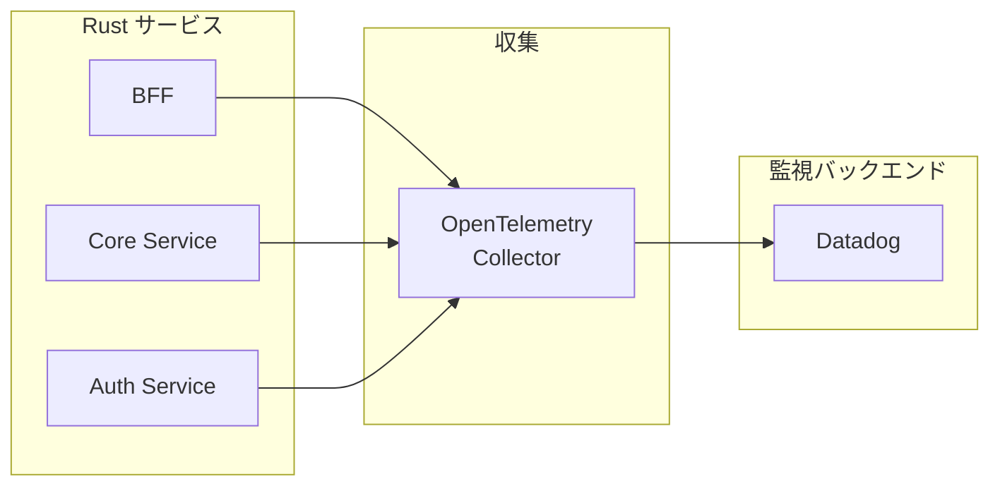
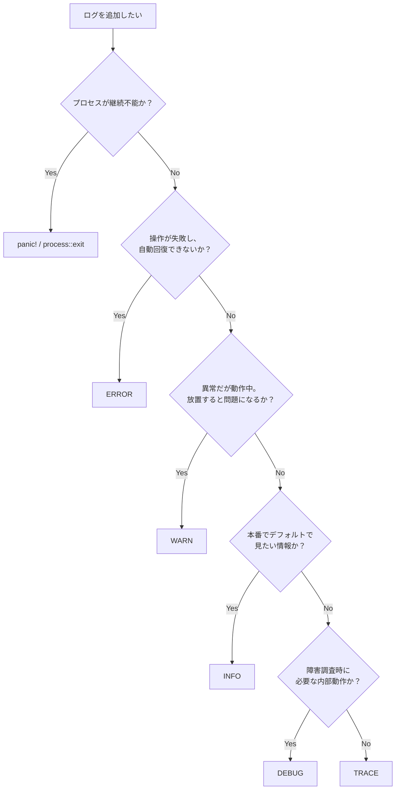
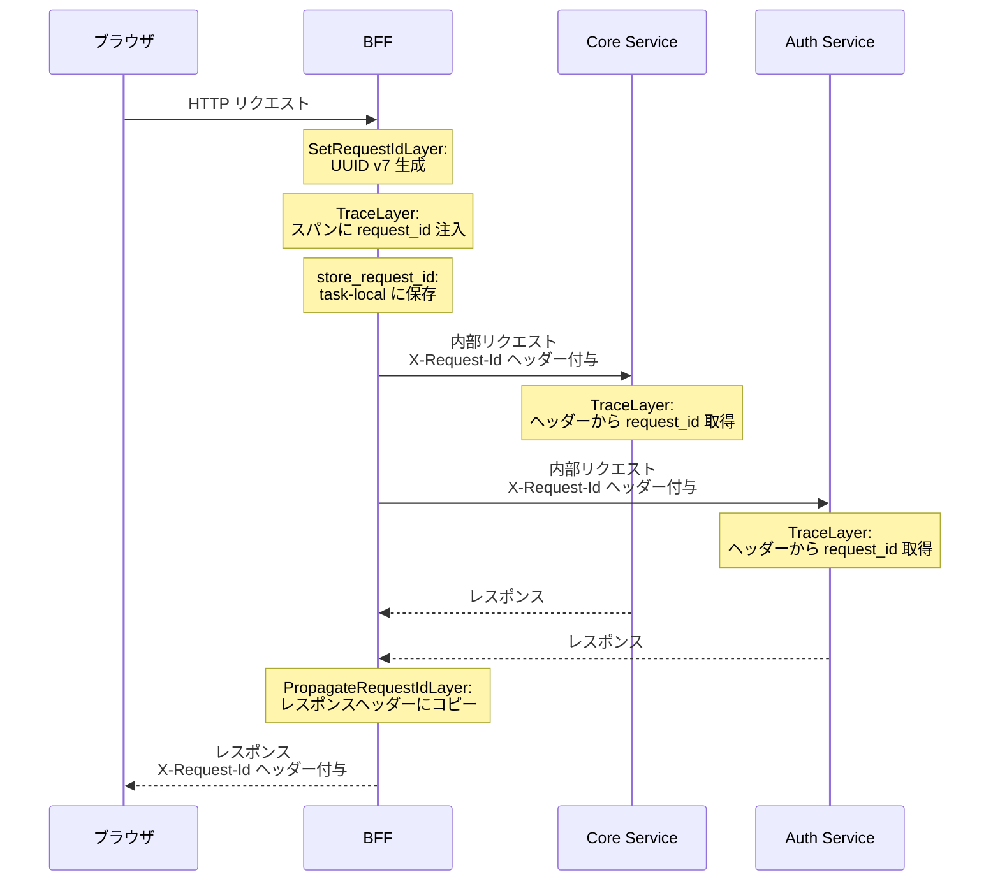
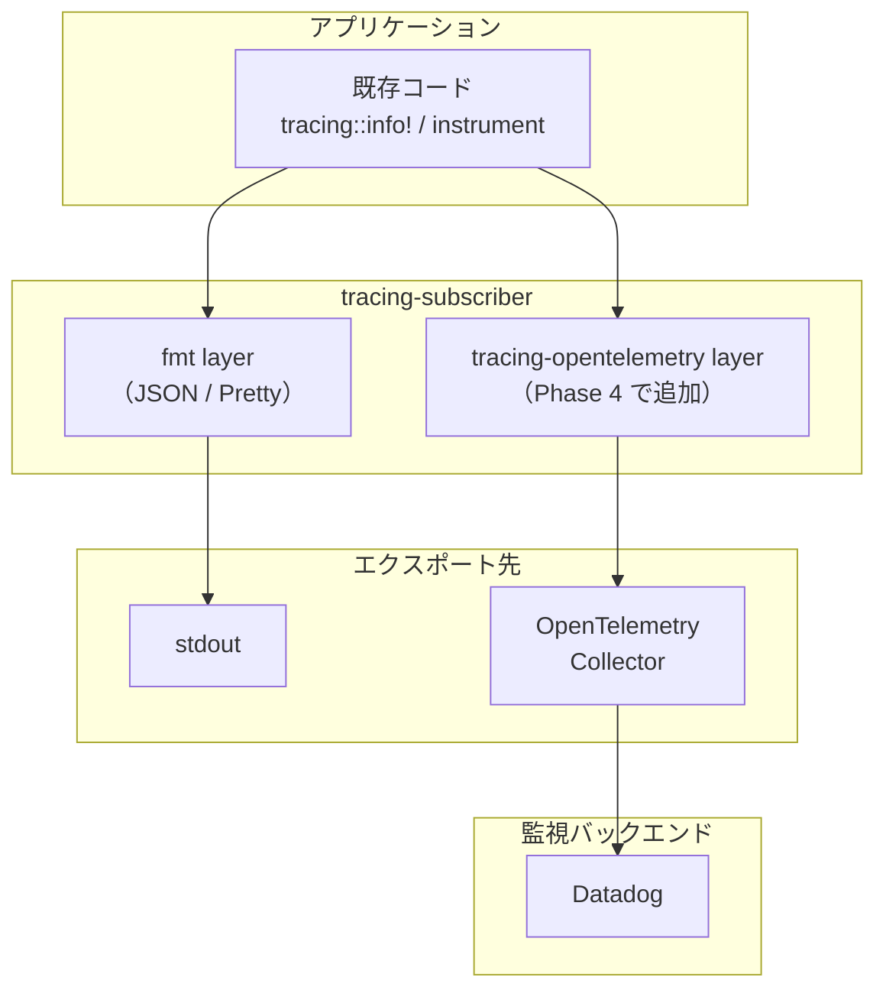
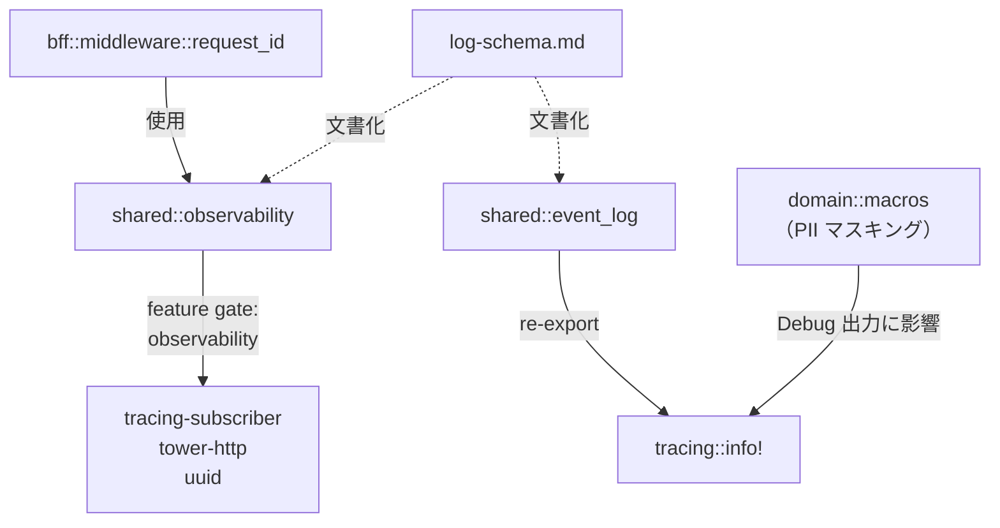

# Observability 設計

## 概要

RingiFlow の Observability（可観測性）基盤の設計を定義する。運用設計書（`docs/02_基本設計書/04_運用設計.md` セクション 9.1〜9.4）の要件（WHAT）と実装（HOW）を橋渡しし、Phase 4（OpenTelemetry + Datadog）への移行パスを明確にする。

### 関連ドキュメント

- 運用設計書: [セクション 9.1〜9.4](../02_基本設計書/04_運用設計.md#ops-05-監視運用要件)（監視・ログ管理の要件）
- 運用設計書: [セクション 8.5〜8.6](../02_基本設計書/04_運用設計.md#85-監査ログ要件)（監査ログ、鍵管理要件）
- ADR-045: [DynamoDB による監査ログストア設計](../05_ADR/045_DynamoDBによる監査ログストア設計.md)
- ADR-049: [サービス間共通コード抽出の方針](../05_ADR/049_サービス間共通コード抽出の方針.md)
- ナレッジベース: [ログスキーマ](../06_ナレッジベース/backend/log-schema.md)
- Epic: [#648 Observability 基盤の設計と段階的実装](https://github.com/ka2kama/ringiflow/issues/648)

### 対象要件

| 要件 ID | 要件名 | 説明 |
|---------|--------|------|
| OPS-05 9.1 | 監視アーキテクチャ | テレメトリ収集の全体構成 |
| OPS-05 9.2 | 監視項目 | インフラ・アプリケーション監視のメトリクスと閾値 |
| OPS-05 9.3 | アラート通知 | 重要度別通知先と SLA |
| OPS-05 9.4 | ログ管理 | ログ種別・出力先・保持期間 |
| OPS-04 8.5 | 監査ログ要件 | 再現性、最低限フィールド、改ざん防止 |
| OPS-04 8.6 | 鍵管理・シークレット管理 | シークレットのログ出力禁止 |

### スコープ

| 実装済み | Phase 4 で実装予定 |
|---------|------------------|
| 構造化ログ（JSON）出力 | OpenTelemetry Collector |
| Request ID 生成・伝播 | Datadog 連携 |
| PII マスキング | メトリクス収集・ダッシュボード |
| アプリケーション計装（`tracing::instrument`） | アラート・Runbook |
| ビジネスイベントログ | サンプリング戦略 |
| エラーコンテキスト構造化 | |

---

## 設計原則

AI エージェントがログを用いて障害調査・デバッグを行うことを前提とする。

### AI エージェントのログ消費特性

| 特性 | 人間 | AI エージェント |
|------|------|----------------|
| ログの読み方 | 目で流し読み、パターン認識 | `jq` / MCP ツールでクエリ |
| 文脈の補完 | 周囲の行から推測可能 | 構造化フィールドがないと相関不能 |
| 大量ログの処理 | 疲弊する | 得意（スキーマが一貫している前提） |
| 曖昧さへの対応 | 経験から推測 | 明示的なフィールドが必要 |

### 原則

| # | 原則 | 説明 |
|---|------|------|
| 1 | 自己完結性 | 1 つのログエントリだけで「誰が・いつ・何を・どのエンティティに・結果どうなったか」が判明する |
| 2 | 構造化 | 自由テキストではなく、名前空間付きの構造化フィールド（`event.*`, `error.*`）で表現する |
| 3 | クエリ容易性 | AI エージェントが `jq` でワンライナーフィルタ可能なスキーマ |
| 4 | 因果関係の保存 | エラーログに根本原因（cause）と発生コンテキスト（context）を含める |
| 5 | 一貫したスキーマ | フィールド命名規則を統一し、スキーマを学習可能にする |

---

## アーキテクチャ

### 現在の構成



3 サービスが `shared::observability` モジュールを共有し、環境変数 `LOG_FORMAT` で出力形式を切り替える。`shared::event_log` はビジネスイベントとエラーコンテキストの構造化ヘルパーを提供する。

### Phase 4 の構成

> **実装状態**: 未実装（Phase 4 で実装予定）



既存の `tracing` コードを変更せず、`tracing-opentelemetry` レイヤーを追加することで OpenTelemetry Collector にテレメトリを送信する。詳細は [Phase 4 移行パス](#phase-4-移行パス) を参照。

---

## ログ設計

### 構造化ログフォーマット

JSON モード（`LOG_FORMAT=json`）では、`tracing-subscriber` の JSON レイヤーを使用する。

設定:

| オプション | 値 | 効果 |
|-----------|-----|------|
| `flatten_event(true)` | 有効 | スパンフィールドとイベントフィールドをフラットに出力 |
| `with_target(true)` | 有効 | Rust モジュールパスを `target` フィールドに出力 |
| `with_current_span(true)` | 有効 | 現在のスパンのフィールドをログに含める |
| `with_span_list(false)` | 無効 | スパンの入れ子リストを出力しない（フラットに展開） |

JSON ログ出力例:

```json
{
  "timestamp": "2026-02-18T12:34:56.789Z",
  "level": "INFO",
  "target": "ringiflow_core_service::usecase::workflow::command::submit",
  "message": "ワークフロー申請完了",
  "request_id": "019501a0-1234-7abc-8000-000000000001",
  "span": { "service": "core-service" },
  "event.kind": "business_event",
  "event.category": "workflow",
  "event.action": "workflow.submitted",
  "event.tenant_id": "019501a0-0000-7000-8000-000000000001",
  "event.entity_type": "workflow_instance",
  "event.entity_id": "019501a0-5678-7def-8000-000000000002",
  "event.actor_id": "019501a0-9abc-7012-8000-000000000003",
  "event.result": "success"
}
```

### ログレベルガイドライン

デフォルトフィルタ: `RUST_LOG` 未設定時は `"info,ringiflow=debug"` を適用。

| レベル | 用途 | 例 |
|-------|------|-----|
| ERROR | 回復不能なエラー、即時対応が必要 | DB 接続失敗、サービス間通信エラー |
| WARN | 回復可能だが注意が必要 | 不正値のフォールバック、リトライ発生 |
| INFO | ビジネスイベント、リクエスト開始/終了 | ログイン成功、ワークフロー申請、ヘルスチェック |
| DEBUG | 内部処理の詳細（リポジトリ操作、HTTP クライアント呼び出し） | SQL 実行、Redis 操作、BFF → Core 通信 |
| TRACE | 開発時のみ使用 | 引数の値、中間状態 |

### 出力先

| 環境 | 出力形式 | 出力先 | 設定 |
|------|---------|--------|------|
| 開発 | Pretty（人間向け） | stdout | `LOG_FORMAT` 未設定またはデフォルト |
| 本番 | JSON（機械向け） | stdout → CloudWatch Logs → S3 | `LOG_FORMAT=json` |

保持期間は運用設計書 9.4 に従う:

| ログ種別 | CloudWatch Logs | S3 |
|---------|----------------|-----|
| アプリケーションログ | 30 日 | 1 年 |
| アクセスログ | 30 日 | 90 日 |
| 監査ログ | DynamoDB + S3 | 1 年（Glacier 移行後 3 年） |

### PII マスキング

運用設計書 8.6 / 9.4 の MUST NOT 要件（PII・シークレットのログ出力禁止）に対応する。

方式: ドメイン層の型定義で `Debug` trait をカスタマイズし、ログ出力時にマスクする。親構造体が `derive(Debug)` でも、子型のカスタム Debug が伝播するため、ログ出力の安全性が型レベルで保証される。

| PII 型 | 所在 | 保護方式 |
|--------|------|---------|
| `UserName` | `domain/src/value_objects.rs` | `define_validated_string!` マクロ（`pii: true`） |
| `Email` | `domain/src/user.rs` | カスタム `Debug` 実装 |
| `PlainPassword` | `domain/src/password.rs` | カスタム `Debug` 実装 |

マクロの動作:

```rust
// pii: true 指定時の Debug 出力
define_validated_string! {
    pub struct UserName {
        label: "ユーザー名",
        max_length: 100,
        pii: true,
    }
}
// Debug: UserName("[REDACTED]")
// Display: 生成しない（平文出力を防止）
```

`REDACTED` 定数（`domain/src/lib.rs`）を全クレートで共有し、一貫性とテスト容易性を確保する。

---

## ログポリシー

新しいコードを書く際の「何をログすべきか、何をログすべきでないか」の判断基準を定義する。[ログ設計](#ログ設計)が「どう出力するか（How）」を、[計装設計](#計装設計)が「どこに設置するか（Where）」を定義するのに対し、本セクションは「いつ・何を出力すべきか（When/What）」を定義する。

参考: [Better Stack Logging Best Practices](https://betterstack.com/community/guides/logging/logging-best-practices/), [Honeycomb Engineer's Checklist](https://www.honeycomb.io/blog/engineers-checklist-logging-best-practices), [OpenTelemetry Semantic Conventions](https://opentelemetry.io/docs/concepts/semantic-conventions/)

### ビジネスイベントの追加基準

`log_business_event!` マクロでビジネスイベントを記録する操作の判定基準。以下のいずれかに該当する操作は記録対象とする。

| # | 判定テスト | 例 |
|---|----------|-----|
| 1 | ビジネス上の状態遷移を伴うか？ | ワークフロー申請、承認、却下 |
| 2 | 監査証跡として記録が必要か？ | ログイン、ログアウト、権限変更 |
| 3 | この操作の成功/失敗を後から検索する必要があるか？ | 通知送信、外部サービス連携 |
| 4 | ビジネス KPI の測定に必要か？ | ワークフロー作成数、承認率 |

判定テストのいずれにも該当しない操作（リスト表示、詳細表示、検索等）は記録対象外。

追加フロー:

1. 判定テストで記録対象と判断
2. `shared/src/event_log.rs` にカテゴリ・アクション定数を追加
3. ユースケース層またはハンドラ層で `log_business_event!` を呼び出し
4. [ログスキーマ](../06_ナレッジベース/backend/log-schema.md)のアクション一覧を更新

### ログレベルの判定フロー

[ログレベルガイドライン](#ログレベルガイドライン)の表を補完する判定フロー。新しいログ出力を追加する際にこのフローに従う。



レベル間の境界ケース:

| 境界 | 判定基準 | 例 |
|------|---------|-----|
| ERROR vs WARN | 自動回復の有無。リトライで成功するなら WARN | リトライ成功 → WARN、リトライ上限到達 → ERROR |
| WARN vs INFO | 正常系かどうか。設計された動作なら INFO | バリデーションエラー（設計された拒否）→ INFO レベルのビジネスイベント |
| INFO vs DEBUG | 本番のデフォルトログで必要か | リクエスト開始/終了 → INFO、SQL 実行詳細 → DEBUG |
| DEBUG vs TRACE | 障害調査で必要か、開発時のみか | リポジトリ操作 → DEBUG、引数の値ダンプ → TRACE |

### ログ vs メトリクスの境界

離散イベント（ログ）と連続計測値（メトリクス）の使い分け方針。メトリクスは Phase 4 で実装予定だが、判断基準を先行して定義する。

| 問い | Yes | No |
|------|-----|-----|
| 個々の発生を調査する必要があるか？ | ログ | メトリクス |
| 集約して傾向を見たいか？ | メトリクス | ログ |
| ダッシュボードでリアルタイム監視したいか？ | メトリクス | ログ |
| 複数サービスを横断する因果関係を追いたいか？ | トレース | ログ or メトリクス |

適用例:

| データ | 種別 | 理由 |
|-------|------|------|
| 個々のログイン失敗 | ログ（ビジネスイベント） | 個別調査が必要（誰が、いつ、なぜ） |
| ログイン失敗率 | メトリクス（Phase 4） | 傾向監視・アラートの基盤 |
| API レイテンシ P99 | メトリクス（Phase 4） | 閾値ベースのアラート |
| 特定リクエストの処理経路 | トレース（Phase 4） | サービス間の因果関係追跡 |

ログからメトリクスを導出できる（例: ビジネスイベントログのカウント → 操作頻度メトリクス）。Phase 4 では OpenTelemetry Collector でこの変換を実装予定。

### リクエスト/レスポンスボディの方針

| 区分 | 対象 |
|------|------|
| 記録する | HTTP メソッド、URL パス、ステータスコード、リソース識別子（ID）、処理時間、エラーメッセージ（サニタイズ済み）、Content-Type、Content-Length |
| 記録しない | リクエストボディの全文、レスポンスボディの全文、認証トークン、セッション ID、パスワード、PII、ファイルアップロードの内容 |

リクエスト/レスポンスの内容が調査に必要な場合は、識別子のみを構造化フィールドとして記録する。生のボディは、[PII マスキング](#pii-マスキング)機構（`Debug` trait カスタマイズ、`define_validated_string!` の `pii: true`）で保護されない可能性があるため、記録しない。

### 高頻度イベントの抑制基準

以下の条件を**すべて**満たすイベントは、手動のログ出力（`tracing::info!` 等）や `log_business_event!` の対象外とする。tower-http による自動リクエストログは本基準の対象外。

| # | 条件 | 説明 |
|---|------|------|
| 1 | ビジネス上の意味がない | 監査証跡や KPI に寄与しない |
| 2 | 高頻度で発生する | 秒単位またはそれ以上の頻度 |
| 3 | 障害調査でノイズになる | 有用な情報を含まず、ログ検索を妨げる |

現在の抑制対象:

| イベント | 根拠 |
|---------|------|
| ヘルスチェック（`/health`） | 条件 1-3 すべて該当。ELB からの定期リクエスト |

将来の抑制候補（該当する場合に適用）:

| イベント | 対応 |
|---------|------|
| キャッシュヒット/ミス | DEBUG 以下で記録（INFO には含めない） |
| 定期的なバックグラウンドジョブの心拍 | 成功時は記録不要、失敗時のみ WARN |
| リトライループ内の個別試行 | 最終結果のみ記録、個別試行は TRACE |

### 計装（`tracing::instrument`）追加基準

判定テスト: 「この関数は外部システム（HTTP、DB、Redis、キュー）との境界を越えるか？」

| 回答 | 対応 |
|------|------|
| Yes | `#[tracing::instrument(skip_all)]` を付与（必須） |
| No | 計装不要（ユースケース層、ドメイン層） |

レイヤー別の詳細と `fields()` の設計原則は[スパン設計](#スパン設計)を参照。

### ログメッセージの書き方ガイドライン

構造化ログにおける `message` フィールドの基本原則:

- `message` は人間が読むためのサマリ。検索・フィルタは構造化フィールドで行う
- メッセージは定数的な文字列とし、動的な値は構造化フィールドに分離する
- イベントの完了状態を日本語で表現する

詳細な命名規約とコード例は[ログスキーマ > メッセージ書き方ガイドライン](../06_ナレッジベース/backend/log-schema.md#メッセージ書き方ガイドライン)を参照。

### Phase 4 との整合性

本ポリシーの判断基準は Phase 4（OpenTelemetry 移行）後も変更なく適用される。

| 項目 | Phase 4 での変化 | ポリシーへの影響 |
|------|----------------|---------------|
| ログ出力先 | stdout → OpenTelemetry Collector | なし（判断基準は出力先に依存しない） |
| メトリクス | 未実装 → 実装 | 「ログ vs メトリクス」の判定が実際に適用される |
| トレース | Request ID → 分散トレース | 計装基準は同じ。スパンの粒度は変更なし |
| フィールド命名 | ECS ベース → OTel Semantic Conventions と共存 | ビジネスドメインの `event.*` / `error.*` は変更なし |

---

## 計装設計

### スパン設計

`#[tracing::instrument]` 属性マクロでレイヤーごとにスパンを設置する。

基本方針:
- `skip_all` を既定とし、PII・大きな構造体がスパンに記録されることを防ぐ
- 安全なフィールド（ID 等）のみ `fields()` で明示的に記録
- ヘルスチェック（`health_check`）はノイズのため計装対象外
- ユースケース層はハンドラ + リポジトリで十分なため計装対象外

| レイヤー | レベル | パターン | 例 |
|---------|--------|---------|-----|
| HTTP ハンドラ | INFO | `skip_all` + 識別子 | `fields(%id)`, `fields(display_number)` |
| BFF HTTP クライアント | DEBUG | `skip_all` + テナント/ユーザー | `fields(%tenant_id, %user_id)` |
| PostgreSQL リポジトリ | DEBUG | `skip_all` + テナント | `fields(%tenant_id)` |
| Redis セッション | DEBUG | `skip_all` + テナント | `fields(%tenant_id)` |
| DynamoDB 監査ログ | DEBUG | `skip_all` | — |

属性の配置順（外側から内側へ）:

```rust
#[utoipa::path(...)]                          // OpenAPI メタデータ
#[tracing::instrument(skip_all, fields(%id))] // スパン設定
pub async fn handler(...) -> ... { ... }
```

### フィールド命名規則

ドット記法（`event.category`, `error.kind`）を使用。`tracing` の structured field 構文でサポートされ、JSON 出力でフラットなキーとなる。

命名規約の参考: [Elastic Common Schema (ECS)](https://www.elastic.co/guide/en/ecs/current/index.html)

フィールド一覧は [ログスキーマ](../06_ナレッジベース/backend/log-schema.md) を参照。

#### 自動注入フィールド

アプリケーションコードで明示的に設定する必要がないフィールド。

| フィールド | 型 | 説明 | 注入元 |
|-----------|-----|------|--------|
| `timestamp` | string | ISO 8601 タイムスタンプ | tracing-subscriber |
| `level` | string | INFO / WARN / ERROR 等 | tracing-subscriber |
| `target` | string | Rust モジュールパス | tracing-subscriber |
| `request_id` | string | UUID v7 | `make_request_span` |
| `span.service` | string | bff / core-service / auth-service | main.rs の `info_span!` |

### Request ID 伝播

UUID v7（時系列ソート可能）を Request ID として使用する。



実装コンポーネント:

| コンポーネント | 所在 | 責務 |
|-------------|------|------|
| `MakeRequestUuidV7` | `shared/src/observability.rs` | UUID v7 ベースの Request ID 生成 |
| `make_request_span` | `shared/src/observability.rs` | `X-Request-Id` をスパンに注入 |
| `REQUEST_ID_HEADER` | `shared/src/observability.rs` | ヘッダー名定数（`x-request-id`） |
| `store_request_id` | `bff/src/middleware/request_id.rs` | task-local への Request ID 保存 |
| `inject_request_id` | `bff/src/middleware/request_id.rs` | アウトバウンドリクエストへの付与 |
| `current_request_id` | `bff/src/middleware/request_id.rs` | task-local からの Request ID 取得 |

BFF の task-local 伝播: Request ID を引数として全関数に渡す方法は 34 箇所のシグネチャ変更が必要で侵襲的なため、task-local による暗黙的伝播を選択した。

---

## ビジネスイベントログ設計

### 概要

`log_business_event!` マクロでビジネスイベントを構造化ログとして出力する。`event.kind = "business_event"` マーカーが自動付与され、`jq` で全ビジネスイベントをフィルタできる。

### フィールド体系

| フィールド | 型 | 必須/推奨 | 説明 |
|-----------|-----|----------|------|
| `event.kind` | string | 自動 | `"business_event"`（マクロが付与） |
| `event.category` | string | 必須 | イベントカテゴリ |
| `event.action` | string | 必須 | アクション名 |
| `event.tenant_id` | string | 必須 | テナント ID |
| `event.result` | string | 必須 | `"success"` / `"failure"` |
| `event.entity_type` | string | 推奨 | エンティティ種別 |
| `event.entity_id` | string | 推奨 | エンティティ ID |
| `event.actor_id` | string | 推奨 | 操作者の User ID |
| `event.reason` | string | 任意 | 失敗理由 |

### イベントカテゴリとアクション

定数は `shared/src/event_log.rs` で定義。

| カテゴリ | アクション | 説明 | 配置 |
|---------|----------|------|------|
| `workflow` | `workflow.created` | ワークフロー作成 | Core: usecase |
| `workflow` | `workflow.submitted` | ワークフロー申請 | Core: usecase |
| `workflow` | `step.approved` | ステップ承認 | Core: usecase |
| `workflow` | `step.rejected` | ステップ却下 | Core: usecase |
| `workflow` | `step.changes_requested` | ステップ差し戻し | Core: usecase |
| `workflow` | `workflow.resubmitted` | ワークフロー再申請 | Core: usecase |
| `auth` | `auth.login_success` | ログイン成功 | BFF: handler |
| `auth` | `auth.login_failure` | ログイン失敗 | BFF: handler |
| `auth` | `auth.logout` | ログアウト | BFF: handler |

### エラーコンテキスト

既存の `tracing::error!` に `error.category` + `error.kind` フィールドを追加する。

| カテゴリ | 種別 | 説明 |
|---------|------|------|
| `infrastructure` | `database` | DB 接続・クエリエラー |
| `infrastructure` | `session` | セッションストア（Redis）エラー |
| `infrastructure` | `internal` | 内部ロジックエラー |
| `infrastructure` | `csrf_token` | CSRF トークン操作エラー |
| `external_service` | `user_lookup` | Core Service ユーザー検索エラー |
| `external_service` | `password_verification` | Auth Service パスワード検証エラー |
| `external_service` | `service_communication` | サービス間通信エラー（汎用） |

---

## メトリクス設計

> **実装状態**: 未実装（Phase 4 で実装予定）

運用設計書 9.2 に基づくメトリクス設計。Phase 4 で `metrics` クレートまたは OpenTelemetry Metrics API を使用して実装する。

### 必須ラベル（運用設計書 9.2.2.1 MUST）

すべてのアプリケーションメトリクスに付与する。

| ラベル | 説明 |
|--------|------|
| `service` | サービス名（bff / core-service / auth-service） |
| `env` | 環境（dev / staging / production） |
| `route` | ルートまたは操作名 |
| `status_class` | ステータスクラス（2xx / 4xx / 5xx） |
| `tenant` | テナント ID（匿名化/ID 化可） |

### 収集対象メトリクス

運用設計書 9.2 のメトリクスと閾値:

| カテゴリ | メトリクス | 警告閾値 | 重大閾値 |
|---------|----------|---------|---------|
| API | レイテンシ (P99) | 150ms | 300ms |
| API | エラー率 (5xx) | 0.1% | 1% |
| API | エラー率 (4xx) | 5% | 10% |
| 認証 | ログイン失敗率 | 10% | 30% |
| ワークフロー | 処理時間 | 5 分 | 15 分 |

### 外部依存監視（MUST）

| 対象 | メトリクス |
|------|----------|
| 外部 OIDC/IdP | 成功率、レイテンシ、タイムアウト率 |
| DB | クエリレイテンシ、ロック競合、コネクションプール枯渇（待機時間/取得失敗） |

---

## Phase 4 移行パス

> **実装状態**: 未実装（Phase 4 で実装予定）

### 移行戦略: Exporter 追加方式

既存の `tracing` コードを変更せず、`tracing-opentelemetry` レイヤーを `tracing-subscriber` に追加することで OpenTelemetry にテレメトリを送信する。



### 移行ステップ

| ステップ | 内容 | 影響範囲 |
|---------|------|---------|
| 1 | `tracing-opentelemetry` + `opentelemetry-otlp` クレートを追加 | `Cargo.toml` |
| 2 | `init_tracing` に OpenTelemetry レイヤーを追加 | `shared/src/observability.rs` |
| 3 | OpenTelemetry Collector を ECS サイドカーとしてデプロイ | Terraform |
| 4 | Collector → Datadog Exporter を設定 | Collector 設定 |
| 5 | メトリクス収集を実装 | 各サービス |
| 6 | ダッシュボード・アラートを Datadog で構築 | Datadog |

### 既存コードの変更量

移行ステップ 1〜2 で変更が必要なのは `observability.rs` のみ。各サービスの `main.rs` や個別のハンドラ・リポジトリのコードは変更不要。これは初期設計で `tracing` エコシステムを選択したことによる利点。

### サンプリング戦略

Phase 4 で検討する項目:

| 戦略 | 用途 |
|------|------|
| Head-based sampling | リクエスト開始時にサンプリング判定（低オーバーヘッド） |
| Tail-based sampling | レスポンス完了後にサンプリング判定（エラートレースを確実に収集） |
| Adaptive sampling | トラフィック量に応じてサンプリング率を調整 |

### ダッシュボード設計（運用設計書 9.2.2.2 MUST）

> **実装状態**: 未実装（Phase 4 で実装予定）

オンコールが 3 分以内に状況判断できる粒度を目標とする。

| ダッシュボード | 表示内容 |
|-------------|---------|
| サービス別 | レイテンシ、エラー率、スロットリング（429/503）、タイムアウト、依存内訳 |
| セキュリティ運用 | 認証失敗率、権限変更、監査ログ取り込み遅延 |

### アラート設計（運用設計書 9.3 MUST）

> **実装状態**: 未実装（Phase 4 で実装予定）

各アラートに原因切り分け手順・一次対応・エスカレーションを記載した Runbook を紐づける。

| 重要度 | 通知先 | SLA |
|-------|-------|-----|
| Critical | PagerDuty → 電話 / Slack | 15 分以内対応開始 |
| High | Slack + メール | 1 時間以内対応開始 |
| Medium | Slack | 営業時間内対応 |
| Low | Slack | 週次確認 |

---

## MUST 要件対応表

運用設計書の MUST / MUST NOT 要件と、対応する実装・計画を対応づける。

### 9.4 ログ管理

| # | MUST 要件 | 対応状況 | 実装 |
|---|----------|---------|------|
| 1 | 構造化ログ（JSON）で統一 | 実装済み | `LOG_FORMAT=json` で JSON 出力（`shared/src/observability.rs`） |
| 2 | `correlationId` によりトレース・監査ログと相互参照可能 | 実装済み | `request_id`（UUID v7）がスパンフィールドとして全ログに自動注入。監査ログにも `correlation_id` フィールドあり |
| 3 | PII/シークレットをログに出力してはならない（MUST NOT） | 実装済み | ドメイン型の `Debug` カスタマイズで PII マスク。`define_validated_string!` マクロの `pii: true` モード |
| 4 | マスキング/サニタイズ方針を運用規程として固定 | 実装済み | マスキング対象型リストと方式を本設計書で文書化 |
| 5 | 監査ログの改ざん検知可能な保全 | 実装済み | DynamoDB（追記専用、IAM でアクセス制御）+ S3 長期保管（ADR-045） |

### 9.2 監視項目

| # | MUST 要件 | 対応状況 | 実装 / 計画 |
|---|----------|---------|------------|
| 1 | メトリクスラベル: `service`, `env`, `route`, `status_class`, `tenant` | Phase 4 | メトリクス設計で定義済み。Phase 4 で計装 |
| 2 | 外部 OIDC/IdP の成功率/レイテンシ/タイムアウト率 | Phase 4 | Phase 4 でメトリクス計装 |
| 3 | DB クエリレイテンシ、ロック競合、コネクションプール枯渇 | Phase 4 | Phase 4 でメトリクス計装 |
| 4 | キュー/ストリーム ラグ、滞留件数、DLQ 件数 | Phase 4 | Phase 4 でイベント駆動アーキテクチャと同時実装 |
| 5 | 標準ダッシュボード（3 分以内に状況判断可能） | Phase 4 | Datadog ダッシュボード |

### 9.3 アラート通知

| # | MUST 要件 | 対応状況 | 計画 |
|---|----------|---------|------|
| 1 | アラートは「ユーザー影響/SLO 逸脱の予兆」に紐づける | Phase 4 | Datadog アラート |
| 2 | 各アラートに Runbook を紐づける | Phase 4 | Runbook テンプレート作成 |

### 8.5 監査ログ要件

| # | MUST 要件 | 対応状況 | 実装 |
|---|----------|---------|------|
| 1 | 「誰が・いつ・どのテナントで・何を・結果どうなったか」を再現可能 | 実装済み | DynamoDB 監査ログ + ビジネスイベントログの構造化フィールド |
| 2 | 最低限 `ts`, `tenantId`, `actorId`, `action`, `resource`, `result`, `correlationId`, `sourceIp` を含める | 実装済み | 監査ログ（DynamoDB）に全フィールド含む。ビジネスイベントログにも `event.*` フィールドで対応 |
| 3 | 監査ログの閲覧権限最小化、改ざん・削除防止（追記専用） | 実装済み | DynamoDB + IAM 最小権限 + S3 長期保管（ADR-045） |

### 8.6 鍵管理・シークレット管理

| # | MUST NOT 要件 | 対応状況 | 実装 |
|---|-------------|---------|------|
| 1 | シークレットはログ・トレース・メトリクスへ出力してはならない | 実装済み | PII マスキング（`Debug` カスタマイズ）+ `tracing::instrument(skip_all)` パターン |
| 2 | 例外時もマスキングを MUST とする | 実装済み | `REDACTED` 定数によるマスク出力 |

---

## 実装コンポーネント

### ファイル構成

```
backend/
├── crates/
│   ├── shared/src/
│   │   ├── observability.rs     # トレーシング初期化、Request ID 生成、スパン作成
│   │   └── event_log.rs         # ビジネスイベントマクロ、フィールド定数
│   └── domain/src/
│       ├── macros.rs            # PII マスキングマクロ（define_validated_string!）
│       └── lib.rs               # REDACTED 定数
├── apps/
│   └── bff/src/
│       └── middleware/
│           └── request_id.rs    # Request ID 伝播（task-local）
docs/
└── 06_ナレッジベース/
    └── backend/
        └── log-schema.md        # ログフィールドスキーマ定義
```

### 依存関係



共通化は `shared` クレートの `observability` feature gate で optional 化し、domain / infra クレートが observability に依存しない構造を維持する（ADR-049）。

---

## 変更履歴

| 日付 | 変更内容 |
|------|---------|
| 2026-02-19 | 初版作成（#655） |
| 2026-02-27 | ログポリシーセクション追加（#941） |
