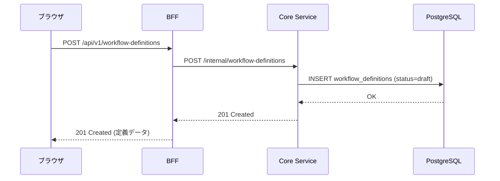
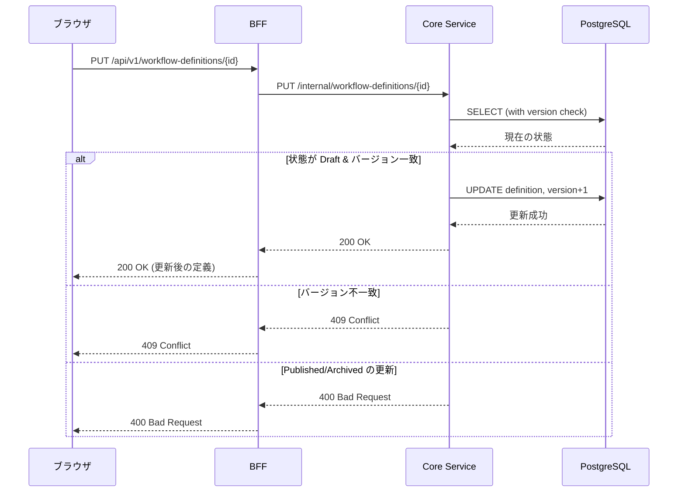
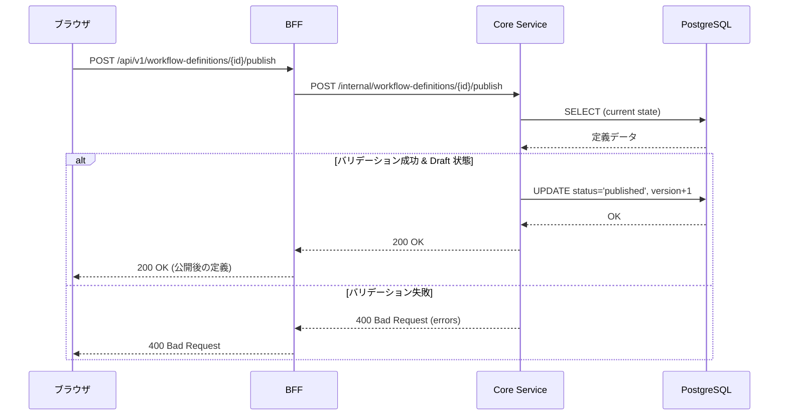
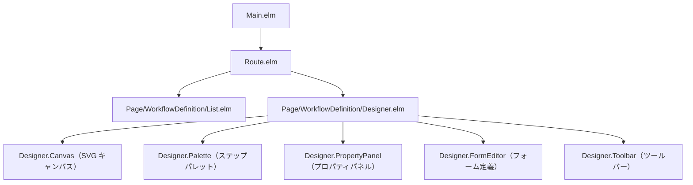
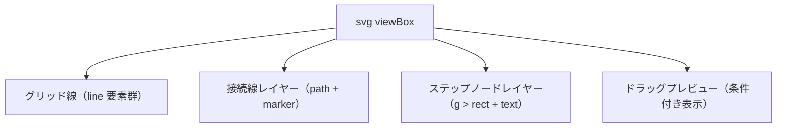

# ワークフローデザイナー設計

> **実装状態**: 未実装（Phase 2-4 で実装予定）

## 概要

テナント管理者が GUI でワークフロー定義を作成・編集・公開するためのデザイナー機能の実装設計。

Phase 2-4 のスコープでは順次承認のみを対象とし、以下のステップ種別をサポートする:

- 開始（start）: ワークフローの起点（1 つ）
- 承認（approval）: 承認者による判断ステップ（1 つ以上）
- 終了（end）: ワークフローの終点（1 つ以上、approved/rejected）

## 要件

- WF-001: ワークフロー定義の作成・管理
- WFD-001: キャンバス
- WFD-002: ステップパレット
- WFD-003: 接続線
- WFD-004: プロパティパネル
- WFD-005: バリデーション
- CORE-11: ワークフロー定義のデータモデル

→ 機能仕様書: [04_ワークフローデザイナー.md](../01_要件定義書/機能仕様書/04_ワークフローデザイナー.md)
→ 技術選定: [ADR-053](../05_ADR/053_ワークフローデザイナー技術選定.md)

## アーキテクチャ

### シーケンス図（定義作成）



### シーケンス図（定義更新）



### シーケンス図（定義公開）



### フロントエンドコンポーネント構成（Nested TEA）



### SVG キャンバスのレンダリング構成

ADR-053 で決定した SVG + Elm 直接レンダリング方式に基づく。



レイヤー順序: グリッド（最背面）→ 接続線 → ステップノード → ドラッグプレビュー（最前面）

### Ports 通信設計

ADR-053 の決定に基づき、Ports の役割はキャンバス要素の寸法取得のみ。

| Port | 方向 | 用途 |
|------|------|------|
| `requestCanvasBounds` | Elm → JS | キャンバス SVG 要素の `getBoundingClientRect()` を要求 |
| `receiveCanvasBounds` | JS → Elm | `{ x, y, width, height }` を返す |

既存の Ports メッセージ形式（`{ v: 1, type, payload, correlationId, ts }`）に準拠する。

## ワークフロー定義 JSON スキーマ（Phase 2-4 サブセット）

CORE-11 のフルスキーマから Phase 2-4 で使用するサブセットを定義する。

### スキーマ定義

```json
{
  "form": {
    "fields": [
      {
        "id": "string（一意識別子）",
        "type": "text | textarea | number | select | date",
        "label": "string（表示名）",
        "required": "boolean",
        "maxLength": "number（text/textarea のみ、任意）",
        "options": ["string[]（select のみ）"]
      }
    ]
  },
  "steps": [
    {
      "id": "string（一意識別子）",
      "type": "start | approval | end",
      "name": "string（表示名）",
      "position": { "x": "number", "y": "number" },
      "assignee": { "type": "user" },
      "status": "approved | rejected（end のみ）"
    }
  ],
  "transitions": [
    {
      "from": "string（steps[].id）",
      "to": "string（steps[].id）",
      "trigger": "approve | reject（approval からの遷移のみ）"
    }
  ]
}
```

### フィールド詳細

| パス | 型 | 必須 | 説明 |
|------|-----|------|------|
| `form.fields[].id` | string | ✓ | フィールド一意識別子 |
| `form.fields[].type` | string | ✓ | `text`, `textarea`, `number`, `select`, `date` |
| `form.fields[].label` | string | ✓ | 表示ラベル |
| `form.fields[].required` | boolean | ✓ | 入力必須 |
| `form.fields[].maxLength` | number | - | 最大文字数（text/textarea のみ） |
| `form.fields[].options` | string[] | - | 選択肢（select のみ） |
| `steps[].id` | string | ✓ | ステップ一意識別子 |
| `steps[].type` | string | ✓ | `start`, `approval`, `end` |
| `steps[].name` | string | ✓ | 表示名 |
| `steps[].position` | object | - | キャンバス上の座標 `{ x, y }` |
| `steps[].assignee` | object | - | 承認者指定（approval のみ） |
| `steps[].assignee.type` | string | ✓ | Phase 2-4 では `user` のみ |
| `steps[].status` | string | - | 終了ステータス（end のみ）: `approved`, `rejected` |
| `transitions[].from` | string | ✓ | 遷移元ステップ ID |
| `transitions[].to` | string | ✓ | 遷移先ステップ ID |
| `transitions[].trigger` | string | - | 遷移トリガー: `approve`, `reject` |

### `position` フィールドの後方互換性

`position` はデザイナーで新たに追加するフィールド。既存の seed データには `position` が含まれていないため、以下の方針で後方互換性を確保する:

- `position` が存在しない場合: デザイナーで開いた際にデフォルト配置を自動計算する（縦一列、等間隔）
- `position` が存在する場合: そのまま使用する
- 保存時: 必ず `position` を含めて保存する

## API 設計

注: `openapi/openapi.yaml` は utoipa アノテーションから自動生成される（`just openapi-generate`）。本セクションの API 仕様は実装時に utoipa アノテーションとして記述し、`openapi.yaml` に反映する。

### エンドポイント一覧

| メソッド | パス | 説明 | 認可 |
|---------|------|------|------|
| GET | `/api/v1/workflow-definitions` | 一覧取得（既存） | 全ユーザー |
| GET | `/api/v1/workflow-definitions/{id}` | 詳細取得（既存） | 全ユーザー |
| POST | `/api/v1/workflow-definitions` | 作成（Draft） | テナント管理者 |
| PUT | `/api/v1/workflow-definitions/{id}` | 更新（Draft のみ） | テナント管理者 |
| DELETE | `/api/v1/workflow-definitions/{id}` | 削除（Draft のみ） | テナント管理者 |
| POST | `/api/v1/workflow-definitions/{id}/publish` | 公開 | テナント管理者 |
| POST | `/api/v1/workflow-definitions/{id}/archive` | アーカイブ | テナント管理者 |
| POST | `/api/v1/workflow-definitions/{id}/validate` | バリデーション | テナント管理者 |

### POST /api/v1/workflow-definitions（作成）

リクエスト:

```json
{
  "name": "経費精算申請",
  "description": "経費精算の申請ワークフロー（任意）",
  "definition": {
    "form": { "fields": [] },
    "steps": [
      { "id": "start", "type": "start", "name": "開始", "position": { "x": 400, "y": 50 } }
    ],
    "transitions": []
  }
}
```

| フィールド | 型 | 必須 | 説明 |
|-----------|-----|------|------|
| name | string | ✓ | 定義名（1〜100 文字） |
| description | string | - | 説明（最大 500 文字） |
| definition | object | ✓ | ワークフロー定義 JSON |

レスポンス（201 Created）:

```json
{
  "data": {
    "id": "019...",
    "name": "経費精算申請",
    "description": "経費精算の申請ワークフロー",
    "version": 1,
    "definition": { "..." },
    "status": "draft",
    "created_by": "019...",
    "created_at": "2026-02-20T...",
    "updated_at": "2026-02-20T..."
  }
}
```

### PUT /api/v1/workflow-definitions/{id}（更新）

リクエスト:

```json
{
  "name": "経費精算申請（更新後）",
  "description": "更新された説明",
  "definition": { "..." },
  "version": 1
}
```

| フィールド | 型 | 必須 | 説明 |
|-----------|-----|------|------|
| name | string | ✓ | 定義名 |
| description | string | - | 説明 |
| definition | object | ✓ | ワークフロー定義 JSON |
| version | integer | ✓ | 楽観的ロック用バージョン |

レスポンス（200 OK）: 作成時と同じ形式（version がインクリメントされる）

エラー:
- 400: Draft 以外の定義を更新しようとした場合
- 404: 定義が見つからない
- 409: バージョン競合

### DELETE /api/v1/workflow-definitions/{id}（削除）

Draft 状態の定義のみ削除可能。Published/Archived の定義はアーカイブを使用する。

レスポンス: 204 No Content

エラー:
- 400: Draft 以外の定義を削除しようとした場合
- 404: 定義が見つからない

### POST /api/v1/workflow-definitions/{id}/publish（公開）

リクエスト:

```json
{
  "version": 1
}
```

公開前にバリデーションを自動実行する。バリデーションに失敗した場合は 400 を返す。

レスポンス（200 OK）: 定義データ（status が `published` に変更）

エラー:
- 400: バリデーション失敗、または既に Published の場合
- 404: 定義が見つからない
- 409: バージョン競合

### POST /api/v1/workflow-definitions/{id}/archive（アーカイブ）

リクエスト:

```json
{
  "version": 2
}
```

Published 状態の定義をアーカイブする。アーカイブされた定義は一覧で非表示になるが、既存のワークフローインスタンスへの参照は維持される。

レスポンス（200 OK）: 定義データ（status が `archived` に変更）

エラー:
- 400: Draft の定義をアーカイブしようとした場合
- 404: 定義が見つからない
- 409: バージョン競合

### POST /api/v1/workflow-definitions/{id}/validate（バリデーション）

リクエスト:

```json
{
  "definition": { "..." }
}
```

保存前にクライアントサイドからバリデーションを実行できるエンドポイント。保存時にもサーバーサイドで同じバリデーションが実行される。

レスポンス（200 OK）:

```json
{
  "data": {
    "valid": true,
    "errors": []
  }
}
```

バリデーションエラー時（200 OK）:

```json
{
  "data": {
    "valid": false,
    "errors": [
      { "code": "missing_start_step", "message": "開始ステップが必要です" },
      { "code": "orphaned_step", "message": "ステップ 'approval_1' が接続されていません", "step_id": "approval_1" }
    ]
  }
}
```

注: バリデーションエンドポイントは常に 200 OK を返す。`valid: false` はバリデーション結果であり、HTTP エラーではない。

### 楽観的ロック

既存パターン（`Version` 値オブジェクト）に準拠する。

- 作成時: `version = 1`
- 更新時: リクエストの `version` と DB の `version` を比較。一致すれば `version + 1` で更新
- 不一致時: 409 Conflict を返す

```json
{
  "type": "https://ringiflow.example.com/errors/conflict",
  "title": "Conflict",
  "status": 409,
  "detail": "このワークフロー定義は既に更新されています。最新の状態を取得してください。",
  "current_version": 3
}
```

## データモデル変更

### workflow_definitions テーブル

既存テーブルの構造変更は不要。`definition` カラム（JSONB）に `position` フィールドが追加されるが、カラムレベルの変更はない。

```sql
-- 既存のテーブル定義（変更なし）
CREATE TABLE workflow_definitions (
    id          UUID PRIMARY KEY DEFAULT gen_random_uuid(),
    tenant_id   UUID NOT NULL REFERENCES tenants(id) ON DELETE CASCADE,
    name        VARCHAR(100) NOT NULL,
    description TEXT,
    version     INTEGER NOT NULL DEFAULT 1,
    definition  JSONB NOT NULL,
    status      VARCHAR(20) NOT NULL DEFAULT 'draft',
    created_by  UUID NOT NULL REFERENCES users(id),
    created_at  TIMESTAMPTZ NOT NULL DEFAULT NOW(),
    updated_at  TIMESTAMPTZ NOT NULL DEFAULT NOW()
);
```

### display_id の適用

Phase 2-4 では `workflow_definitions` に display_id を導入しない。理由:

- ワークフロー定義はテナント管理者のみが操作する管理系エンティティ
- 定義数は少なく（通常 10 個以下）、口頭での特定が不要
- URL ルーティングは UUID を維持（既存パターン）

将来的に定義数が増えた場合は、既存の `display_id` パターン（[12_表示用ID設計.md](12_表示用ID設計.md)）を適用可能。

## ドメインロジック

### 定義の更新

```rust
impl WorkflowDefinition {
    /// 定義を更新した新しいインスタンスを返す（Draft のみ更新可能）
    pub fn update(
        self,
        name: WorkflowName,
        description: Option<String>,
        definition: JsonValue,
        now: DateTime<Utc>,
    ) -> Result<Self, DomainError> {
        if self.status != WorkflowDefinitionStatus::Draft {
            return Err(DomainError::Validation(
                "下書き状態の定義のみ更新できます".to_string(),
            ));
        }

        Ok(Self {
            name,
            description,
            definition,
            version: self.version.next(),
            updated_at: now,
            ..self
        })
    }

    /// 定義を削除可能かチェックする（Draft のみ削除可能）
    pub fn can_delete(&self) -> Result<(), DomainError> {
        if self.status != WorkflowDefinitionStatus::Draft {
            return Err(DomainError::Validation(
                "下書き状態の定義のみ削除できます".to_string(),
            ));
        }
        Ok(())
    }

    /// 定義をアーカイブ可能かチェックする（Published のみアーカイブ可能）
    pub fn can_archive(&self) -> Result<(), DomainError> {
        if self.status != WorkflowDefinitionStatus::Published {
            return Err(DomainError::Validation(
                "公開済みの定義のみアーカイブできます".to_string(),
            ));
        }
        Ok(())
    }
}
```

### バリデーション

定義 JSON の整合性を検証する関数。公開時に必ず実行される。

```rust
/// バリデーション結果
pub struct ValidationResult {
    pub valid: bool,
    pub errors: Vec<ValidationError>,
}

/// バリデーションエラー
pub struct ValidationError {
    pub code: String,
    pub message: String,
    pub step_id: Option<String>,
}

/// ワークフロー定義をバリデーションする
pub fn validate_definition(definition: &JsonValue) -> ValidationResult {
    let mut errors = Vec::new();

    // 各バリデーションルールを実行
    validate_start_step(definition, &mut errors);
    validate_end_steps(definition, &mut errors);
    validate_approval_steps(definition, &mut errors);
    validate_connections(definition, &mut errors);
    validate_no_orphans(definition, &mut errors);
    validate_no_cycles(definition, &mut errors);
    validate_approval_transitions(definition, &mut errors);
    validate_step_ids_unique(definition, &mut errors);
    validate_form_fields(definition, &mut errors);
    validate_transition_references(definition, &mut errors);

    ValidationResult {
        valid: errors.is_empty(),
        errors,
    }
}
```

### CRUD ユースケース

```rust
/// 定義作成ユースケース
pub async fn create_workflow_definition(
    repo: &dyn WorkflowDefinitionRepository,
    tenant_id: TenantId,
    user_id: UserId,
    name: WorkflowName,
    description: Option<String>,
    definition: JsonValue,
    now: DateTime<Utc>,
) -> Result<WorkflowDefinition, UseCaseError> {
    let def = WorkflowDefinition::new(NewWorkflowDefinition {
        id: WorkflowDefinitionId::new(),
        tenant_id,
        name,
        description,
        definition,
        created_by: user_id,
        now,
    });
    repo.insert(&def).await?;
    Ok(def)
}

/// 定義更新ユースケース
pub async fn update_workflow_definition(
    repo: &dyn WorkflowDefinitionRepository,
    id: WorkflowDefinitionId,
    tenant_id: TenantId,
    name: WorkflowName,
    description: Option<String>,
    definition: JsonValue,
    expected_version: Version,
    now: DateTime<Utc>,
) -> Result<WorkflowDefinition, UseCaseError> {
    let existing = repo.find_by_id(&id, &tenant_id).await?
        .ok_or(UseCaseError::NotFound)?;
    let updated = existing.update(name, description, definition, now)?;
    repo.update_with_version_check(&updated, expected_version).await?;
    Ok(updated)
}

/// 定義公開ユースケース
pub async fn publish_workflow_definition(
    repo: &dyn WorkflowDefinitionRepository,
    id: WorkflowDefinitionId,
    tenant_id: TenantId,
    expected_version: Version,
    now: DateTime<Utc>,
) -> Result<WorkflowDefinition, UseCaseError> {
    let existing = repo.find_by_id(&id, &tenant_id).await?
        .ok_or(UseCaseError::NotFound)?;

    // 公開前バリデーション
    let result = validate_definition(existing.definition());
    if !result.valid {
        return Err(UseCaseError::ValidationFailed(result.errors));
    }

    let published = existing.published(now)?;
    repo.update_with_version_check(&published, expected_version).await?;
    Ok(published)
}
```

## 権限チェック

デザイナー操作（作成・更新・削除・公開・アーカイブ）はテナント管理者のみ実行可能。

一覧・詳細取得は全ユーザーがアクセス可能（ワークフロー申請時に定義を選択するため）。

```rust
fn check_admin_permission(permissions: &[String]) -> Result<(), UseCaseError> {
    if !permissions.contains(&"workflow_definition:manage".to_string()) {
        return Err(UseCaseError::Forbidden);
    }
    Ok(())
}
```

## フロントエンド設計

### モジュール構成

```
frontend/src/
├── Page/
│   └── WorkflowDefinition/
│       ├── List.elm          # 定義一覧ページ
│       └── Designer.elm      # デザイナーページ（新規作成・編集）
├── Component/
│   └── Designer/
│       ├── Canvas.elm        # SVG キャンバス
│       ├── Palette.elm       # ステップパレット
│       ├── PropertyPanel.elm # プロパティパネル
│       ├── FormEditor.elm    # フォーム定義エディタ
│       └── Toolbar.elm       # ツールバー（保存・公開・バリデーション）
├── Data/
│   └── WorkflowDefinition.elm  # 定義データモデル・デコーダー（既存を拡張）
└── Api/
    └── WorkflowDefinition.elm  # CRUD API 呼び出し（既存を拡張）
```

### キャンバスの Model 型定義案

```elm
type alias CanvasModel =
    { steps : Dict String StepNode
    , transitions : List Transition
    , selectedStepId : Maybe String
    , dragging : Maybe DraggingState
    , canvasBounds : Maybe Bounds
    , gridSize : Int  -- グリッドスナップ単位（20px）
    }

type alias StepNode =
    { id : String
    , stepType : StepType
    , name : String
    , position : Position
    , assignee : Maybe Assignee
    , endStatus : Maybe String  -- end ステップのみ
    }

type StepType
    = Start
    | Approval
    | End

type alias Position =
    { x : Float
    , y : Float
    }

type alias Transition =
    { from : String
    , to : String
    , trigger : Maybe String  -- "approve" | "reject"
    }

type DraggingState
    = DraggingStep String Position  -- ステップ ID, オフセット
    | DraggingNewStep StepType Position  -- パレットからのドラッグ
    | DraggingConnection String Position  -- 接続元ステップ ID, マウス位置

type alias Bounds =
    { x : Float
    , y : Float
    , width : Float
    , height : Float
    }
```

### SVG ビュー構成

```elm
viewCanvas : CanvasModel -> Html Msg
viewCanvas model =
    svg
        [ viewBox "0 0 1200 800"
        , Svg.Attributes.width "100%"
        , Svg.Attributes.height "100%"
        , onMouseMove CanvasMouseMove
        , onMouseUp CanvasMouseUp
        ]
        [ viewGrid model.gridSize          -- グリッド線
        , viewTransitions model             -- 接続線（path + marker）
        , viewSteps model                   -- ステップノード（rect + text）
        , viewDragPreview model.dragging    -- ドラッグプレビュー
        ]
```

### D&D イベントハンドリング

TEA パターンで dragging 状態を管理する。

```elm
type Msg
    = StepMouseDown String Mouse.Event    -- ステップのドラッグ開始
    | PaletteMouseDown StepType           -- パレットからのドラッグ開始
    | CanvasMouseMove Mouse.Event         -- マウス移動（グローバル subscription）
    | CanvasMouseUp Mouse.Event           -- ドラッグ終了
    | ConnectionStartDrag String          -- 接続線のドラッグ開始
    | ConnectionDrop String               -- 接続先にドロップ
    | SelectStep String                   -- ステップ選択
    | DeselectStep                        -- 選択解除
    | DeleteStep String                   -- ステップ削除
    | UpdateStepProperty String String    -- プロパティ更新

subscriptions : CanvasModel -> Sub Msg
subscriptions model =
    case model.dragging of
        Just _ ->
            Sub.batch
                [ Browser.Events.onMouseMove (Decode.map CanvasMouseMove mouseDecoder)
                , Browser.Events.onMouseUp (Decode.map CanvasMouseUp mouseDecoder)
                ]

        Nothing ->
            Sub.none
```

`Browser.Events.onMouseMove` / `onMouseUp` はグローバル subscription として、dragging 状態が `Just` の場合のみ登録される。これにより、ドラッグ中にマウスがキャンバス外に出てもイベントを捕捉できる。

## バリデーションルール一覧

| # | コード | ルール | 説明 |
|---|--------|--------|------|
| 1 | `missing_start_step` | 開始ステップが 1 つ存在する | `type == "start"` のステップが正確に 1 つ |
| 2 | `missing_end_step` | 終了ステップが 1 つ以上存在する | `type == "end"` のステップが 1 つ以上 |
| 3 | `missing_approval_step` | 承認ステップが 1 つ以上存在する | `type == "approval"` のステップが 1 つ以上 |
| 4 | `orphaned_step` | すべてのステップが遷移で接続されている | 遷移の `from` / `to` に含まれないステップがない |
| 5 | `cycle_detected` | 循環参照がない | 遷移グラフに循環がない（DAG であること） |
| 6 | `missing_approval_transition` | 承認ステップに approve/reject 両方の遷移がある | approval ステップから `trigger: "approve"` と `trigger: "reject"` の遷移が両方存在する |
| 7 | `duplicate_step_id` | ステップ ID が一意である | `steps[].id` に重複がない |
| 8 | `invalid_transition_ref` | 遷移が有効なステップを参照している | `transitions[].from` / `to` がすべて `steps[].id` に存在する |
| 9 | `invalid_form_field` | フォームフィールドが有効である | `form.fields[].id` が一意、`type` が有効、select には `options` が存在 |
| 10 | `multiple_start_steps` | 開始ステップが 2 つ以上ある | `type == "start"` のステップが 2 つ以上の場合 |

## エラーコード

| HTTP | エラータイプ | 説明 |
|------|-------------|------|
| 400 | invalid-status | 操作が現在のステータスで許可されていない |
| 400 | validation-failed | 定義のバリデーションに失敗 |
| 403 | forbidden | テナント管理者権限がない |
| 404 | not-found | ワークフロー定義が見つからない |
| 409 | conflict | 楽観的ロックによる競合 |

## テスト観点

### ドメイン（ユニットテスト）

- バリデーションロジック（10 ルール × 正常系・異常系）
- 状態遷移（Draft → Published、Published → Archived、不正な遷移のエラー）
- `update()` の Draft 限定チェック
- `can_delete()` / `can_archive()` のステータスチェック

### ハンドラテスト

- CRUD の各エンドポイント（正常系・異常系）
- 楽観的ロックの競合検出
- 権限チェック（テナント管理者のみ）

### API テスト

- E2E API（BFF → Core → DB の結合テスト）
- 一連の操作フロー: 作成 → 更新 → バリデーション → 公開

### E2E テスト

- デザイナー画面でのステップ配置・接続・プロパティ編集・保存
- バリデーションエラーの表示と解消
- 定義一覧からの編集・公開・アーカイブ

## 関連ドキュメント

- [機能仕様書: ワークフローデザイナー](../01_要件定義書/機能仕様書/04_ワークフローデザイナー.md)
- [ADR-053: ワークフローデザイナー技術選定](../05_ADR/053_ワークフローデザイナー技術選定.md)
- [コア要件 CORE-11](../01_要件定義書/01_コア要件.md)
- [ワークフロー承認却下機能設計](11_ワークフロー承認却下機能設計.md)
- [表示用 ID 設計](12_表示用ID設計.md)

## 変更履歴

| 日付 | 変更内容 |
|------|---------|
| 2026-02-20 | 初版作成 |
