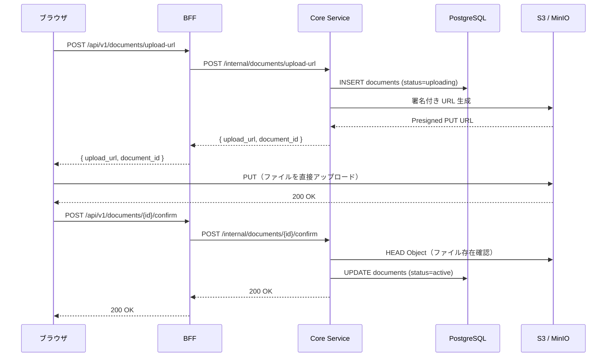
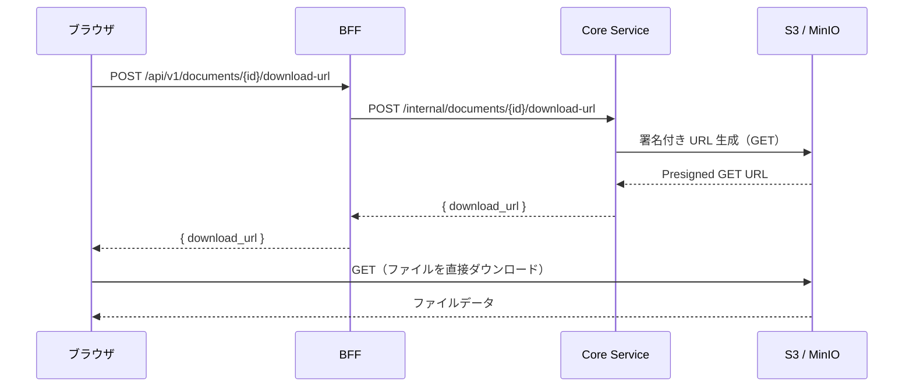
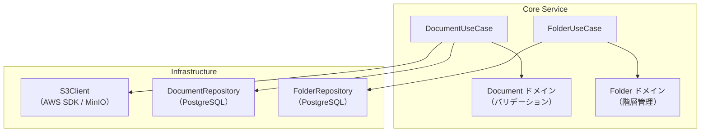

# ドキュメント管理設計

> **実装状態**: 未実装（Phase 2-5 で実装予定）

## 概要

ワークフロー申請へのファイル添付とテナント内でのフォルダ管理を実装するための設計。Phase 2-5 では AWS S3 を使ったファイルアップロード基盤（Presigned URL 方式）とフォルダの基本的な階層構造管理を構築する。

### 要件

- DOC-001: ファイルアップロード
- DOC-003: フォルダ管理（基本的な階層構造）

→ 機能仕様書: [06_ドキュメント管理.md](../01_要件定義書/機能仕様書/06_ドキュメント管理.md)

### Phase 2-5 のスコープ

| 対象 | 対象外（Phase 3 以降） |
|------|---------------------|
| ファイルアップロード（Presigned URL） | バージョン管理 |
| ファイルダウンロード | 全文検索 |
| ファイル削除（ソフトデリート） | ファイル/フォルダ単位のアクセス権限 |
| フォルダ CRUD（最大 5 階層） | ブラウザ内プレビュー |
| MinIO（ローカル開発） | サムネイル生成 |

## アーキテクチャ

### シーケンス図（ファイルアップロード）



### シーケンス図（ファイルダウンロード）



### コンポーネント構成



## 設計判断

### 1. アップロード方式

| 選択肢 | 説明 |
|--------|------|
| **Presigned URL（採用）** | サーバーは URL 発行のみ、ブラウザが S3 に直接 PUT |
| マルチパートアップロード（サーバー経由） | サーバーがファイルを受け取り S3 に転送 |

採用理由:
- サーバーの CPU・メモリ・帯域の負荷を軽減（ファイルデータがサーバーを通過しない）
- AWS のベストプラクティス
- 20MB のファイルサイズ制限なら単一 PUT で十分（マルチパートアップロード API は不要）

### 2. S3 バケット構成

| 選択肢 | 説明 |
|--------|------|
| **単一バケット + テナントプレフィックス（採用）** | `ringiflow-{env}-documents` バケットでテナントプレフィックス分離 |
| テナント別バケット | テナントごとにバケットを作成 |

採用理由:
- テナント退会時にプレフィックス削除で一括削除可能（既存の削除設計に準拠）
- バケット数の AWS 上限（デフォルト 100）を気にする必要がない
- IAM ポリシーでプレフィックスベースのアクセス制御が可能

### 3. フォルダデータモデル

| 選択肢 | 説明 |
|--------|------|
| **materialized path + depth CHECK（採用）** | `path` カラムに `/parent/child/` 形式のパスを格納 |
| adjacency list（parent_id のみ） | parent_id で親子関係を管理 |
| nested set | left/right 値で木構造を管理 |
| closure table | 祖先-子孫の全ペアをテーブルに格納 |

採用理由:
- サブツリーの取得が `LIKE '{path}%'` で高速（読み取り最適化）
- 階層制限（5 階層）を `depth CHECK` で DB レベルで強制
- 実装がシンプルで、Phase 2-5 のフォルダ操作（CRUD + 移動）に十分
- トレードオフ: 移動時にサブツリー全体の path 更新が必要だが、5 階層制限で影響は限定的

### 4. ローカル開発環境（S3 互換）

| 選択肢 | 説明 |
|--------|------|
| **MinIO（採用）** | S3 互換 API を提供するオブジェクトストレージ |
| LocalStack | AWS サービス全体のエミュレータ |
| S3 Mock | 軽量な S3 モック |

採用理由:
- 最も広く使われる S3 互換ストレージ
- AWS SDK for Rust と完全互換（endpoint_url を変更するのみ）
- Web UI でアップロードされたファイルを確認できる

### 5. Elm ファイルアップロード

| 選択肢 | 説明 |
|--------|------|
| **elm/file + Http.request（採用）** | Elm 標準ライブラリで Presigned URL に直接 PUT |
| Ports + JavaScript | JavaScript で fetch / XMLHttpRequest を使用 |

採用理由:
- `elm/file` が間接依存に含まれている（v1.0.5）
- `File.Select.file` でファイル選択、`Http.request` で Presigned URL への PUT が可能
- Ports 不要で TEA パターン内に収まる
- ドラッグ&ドロップは `Browser.Events` の dragover / drop イベントで対応

## ローカル開発環境

### MinIO（Docker Compose 追加）

`infra/docker/docker-compose.yaml` に以下を追加する:

```yaml
  # MinIO（ローカル S3 互換ストレージ）
  # 本番環境: Amazon S3
  # AWS SDK の endpoint_url を MinIO に向けることで互換動作
  minio:
    image: minio/minio:latest
    command: server /data --console-address ":9001"
    environment:
      MINIO_ROOT_USER: minioadmin
      MINIO_ROOT_PASSWORD: minioadmin
    ports:
      - "${MINIO_API_PORT}:9000"      # S3 API
      - "${MINIO_CONSOLE_PORT}:9001"  # Web Console
    volumes:
      - minio_data:/data
    healthcheck:
      test: ["CMD", "mc", "ready", "local"]
      interval: 5s
      timeout: 5s
      retries: 5
      start_period: 10s
    restart: unless-stopped

  # MinIO 初期設定（バケット自動作成）
  minio-init:
    image: minio/mc:latest
    depends_on:
      minio:
        condition: service_healthy
    entrypoint: >
      /bin/sh -c "
      mc alias set local http://minio:9000 minioadmin minioadmin;
      mc mb --ignore-existing local/ringiflow-dev-documents;
      "
```

環境変数のデフォルト値:

| 変数名 | デフォルト値 | 用途 |
|--------|------------|------|
| `MINIO_API_PORT` | 19000 | S3 互換 API ポート |
| `MINIO_CONSOLE_PORT` | 19001 | Web Console ポート |

volumes に `minio_data` を追加:

```yaml
volumes:
  postgres_data:
  redis_data:
  minio_data:
```

API テスト用の `infra/docker/docker-compose.api-test.yaml` にも同様の設定を追加する。

### 環境切替

| 環境 | S3 接続先 | 設定 |
|------|----------|------|
| ローカル開発 | MinIO | `S3_ENDPOINT_URL=http://localhost:19000` |
| API テスト | MinIO | `S3_ENDPOINT_URL=http://minio:9000` |
| 本番 | AWS S3 | `S3_ENDPOINT_URL` 未設定（AWS SDK デフォルト） |

```
# ローカル / API テスト
S3_ENDPOINT_URL=http://localhost:19000
S3_BUCKET_NAME=ringiflow-dev-documents
AWS_ACCESS_KEY_ID=minioadmin
AWS_SECRET_ACCESS_KEY=minioadmin

# 本番
S3_BUCKET_NAME=ringiflow-prod-documents
AWS_REGION=ap-northeast-1
# S3_ENDPOINT_URL は未設定（AWS SDK がデフォルトのエンドポイントを使用）
```

## API 設計

注: `openapi/openapi.yaml` は utoipa アノテーションから自動生成される（`just openapi-generate`）。本セクションの API 仕様は実装時に utoipa アノテーションとして記述し、`openapi.yaml` に反映する。

### エンドポイント一覧

| メソッド | パス | 説明 | 認可 |
|---------|------|------|------|
| POST | `/api/v1/documents/upload-url` | アップロード URL 発行 | 全ユーザー |
| POST | `/api/v1/documents/{id}/confirm` | アップロード完了通知 | アップロード者 |
| POST | `/api/v1/documents/{id}/download-url` | ダウンロード URL 発行 | 閲覧権限者 |
| DELETE | `/api/v1/documents/{id}` | ファイル削除（ソフトデリート） | 所有者 / 管理者 |
| GET | `/api/v1/documents` | ファイル一覧取得 | テナント内ユーザー |
| POST | `/api/v1/folders` | フォルダ作成 | テナント管理者 |
| PUT | `/api/v1/folders/{id}` | フォルダ更新（名前変更 / 移動） | テナント管理者 |
| DELETE | `/api/v1/folders/{id}` | フォルダ削除 | テナント管理者 |
| GET | `/api/v1/folders` | フォルダ一覧取得 | テナント内ユーザー |
| GET | `/api/v1/workflows/{id}/attachments` | ワークフロー添付ファイル一覧 | 閲覧権限者 |

### POST /api/v1/documents/upload-url（アップロード URL 発行）

リクエスト:

```json
{
  "filename": "領収書.pdf",
  "content_type": "application/pdf",
  "content_length": 1258291,
  "folder_id": "019...",
  "workflow_instance_id": "019..."
}
```

| フィールド | 型 | 必須 | 説明 |
|-----------|-----|------|------|
| filename | string | ✓ | ファイル名 |
| content_type | string | ✓ | MIME タイプ |
| content_length | integer | ✓ | ファイルサイズ（バイト） |
| folder_id | UUID | - | フォルダ ID（ドキュメント管理画面からのアップロード時） |
| workflow_instance_id | UUID | - | ワークフローインスタンス ID（申請添付時） |

`folder_id` と `workflow_instance_id` のいずれかが必須。両方指定された場合は 400 エラー。

レスポンス（200 OK）:

```json
{
  "data": {
    "document_id": "019...",
    "upload_url": "https://s3.ap-northeast-1.amazonaws.com/ringiflow-prod-documents/...",
    "expires_in": 300
  }
}
```

### POST /api/v1/documents/{id}/confirm（アップロード完了通知）

ブラウザが S3 への PUT を完了した後に呼び出す。Core Service は S3 の HEAD Object でファイルの存在を確認し、documents レコードのステータスを `active` に更新する。

リクエスト: 空（パスパラメータのみ）

レスポンス（200 OK）:

```json
{
  "data": {
    "id": "019...",
    "filename": "領収書.pdf",
    "content_type": "application/pdf",
    "size": 1258291,
    "status": "active",
    "created_at": "2026-02-24T..."
  }
}
```

エラー:
- 404: ドキュメントが見つからない
- 400: ステータスが `uploading` でない
- 500: S3 にファイルが存在しない

### POST /api/v1/documents/{id}/download-url（ダウンロード URL 発行）

リクエスト: 空（パスパラメータのみ）

レスポンス（200 OK）:

```json
{
  "data": {
    "download_url": "https://s3.ap-northeast-1.amazonaws.com/ringiflow-prod-documents/...",
    "expires_in": 900
  }
}
```

### POST /api/v1/folders（フォルダ作成）

リクエスト:

```json
{
  "name": "2026年度",
  "parent_id": "019..."
}
```

| フィールド | 型 | 必須 | 説明 |
|-----------|-----|------|------|
| name | string | ✓ | フォルダ名（1〜255 文字） |
| parent_id | UUID | - | 親フォルダ ID（省略時はルート直下） |

レスポンス（201 Created）:

```json
{
  "data": {
    "id": "019...",
    "name": "2026年度",
    "path": "/2026年度/",
    "depth": 1,
    "parent_id": null,
    "created_at": "2026-02-24T..."
  }
}
```

エラー:
- 400: フォルダ名が不正、階層制限超過、同一フォルダ内で名前重複
- 404: parent_id が見つからない

## データモデル

### documents テーブル

```sql
CREATE TABLE documents (
    id                    UUID PRIMARY KEY DEFAULT gen_random_uuid(),
    tenant_id             UUID NOT NULL REFERENCES tenants(id) ON DELETE CASCADE,
    -- ファイル情報
    filename              VARCHAR(255) NOT NULL,
    content_type          VARCHAR(100) NOT NULL,
    size                  BIGINT NOT NULL,
    s3_key                VARCHAR(1000) NOT NULL,
    -- 所属
    folder_id             UUID REFERENCES folders(id) ON DELETE SET NULL,
    workflow_instance_id  UUID REFERENCES workflow_instances(id) ON DELETE CASCADE,
    -- 状態
    status                VARCHAR(20) NOT NULL DEFAULT 'uploading',  -- uploading, active, deleted
    -- メタデータ
    uploaded_by           UUID NOT NULL REFERENCES users(id) ON DELETE SET NULL,
    created_at            TIMESTAMPTZ NOT NULL DEFAULT NOW(),
    updated_at            TIMESTAMPTZ NOT NULL DEFAULT NOW(),
    deleted_at            TIMESTAMPTZ
);

-- RLS ポリシー
ALTER TABLE documents ENABLE ROW LEVEL SECURITY;

CREATE POLICY documents_tenant_isolation ON documents
    USING (tenant_id = current_setting('app.current_tenant_id')::UUID);

-- インデックス
CREATE INDEX idx_documents_tenant_id ON documents (tenant_id);
CREATE INDEX idx_documents_folder_id ON documents (folder_id) WHERE folder_id IS NOT NULL;
CREATE INDEX idx_documents_workflow_instance_id ON documents (workflow_instance_id) WHERE workflow_instance_id IS NOT NULL;
CREATE INDEX idx_documents_status ON documents (status) WHERE status != 'deleted';
```

### folders テーブル

```sql
CREATE TABLE folders (
    id          UUID PRIMARY KEY DEFAULT gen_random_uuid(),
    tenant_id   UUID NOT NULL REFERENCES tenants(id) ON DELETE CASCADE,
    name        VARCHAR(255) NOT NULL,
    parent_id   UUID REFERENCES folders(id) ON DELETE RESTRICT,
    -- materialized path: "/root/child/grandchild/"
    path        TEXT NOT NULL,
    depth       INTEGER NOT NULL CHECK (depth >= 1 AND depth <= 5),
    -- メタデータ
    created_by  UUID NOT NULL REFERENCES users(id) ON DELETE SET NULL,
    created_at  TIMESTAMPTZ NOT NULL DEFAULT NOW(),
    updated_at  TIMESTAMPTZ NOT NULL DEFAULT NOW(),
    -- 同一フォルダ内で名前の重複を防ぐ
    UNIQUE (tenant_id, parent_id, name)
);

-- RLS ポリシー
ALTER TABLE folders ENABLE ROW LEVEL SECURITY;

CREATE POLICY folders_tenant_isolation ON folders
    USING (tenant_id = current_setting('app.current_tenant_id')::UUID);

-- インデックス
CREATE INDEX idx_folders_tenant_id ON folders (tenant_id);
CREATE INDEX idx_folders_parent_id ON folders (parent_id);
CREATE INDEX idx_folders_path ON folders (path);
```

### materialized path の管理

| 操作 | path の更新 |
|------|-------------|
| 作成 | `{parent.path}{name}/`（ルート直下: `/{name}/`） |
| 名前変更 | 自身と全子孫の path を更新 |
| 移動 | 自身と全子孫の path を更新、depth を再計算 |
| 削除 | フォルダが空の場合のみ削除可能（子孫の更新不要） |

サブツリー取得:

```sql
-- フォルダ "/2026年度/" 配下の全フォルダを取得
SELECT * FROM folders
WHERE tenant_id = $1
  AND path LIKE '/2026年度/%'
ORDER BY path;
```

## S3 パス設計

テナント退会時データ削除設計に準拠し、`{tenant_id}` をプレフィックスとする。

### ファイルパス構成

| 用途 | S3 キー |
|------|---------|
| ワークフロー添付 | `{tenant_id}/workflows/{instance_id}/{document_id}_{filename}` |
| フォルダ内ファイル | `{tenant_id}/folders/{folder_id}/{document_id}_{filename}` |

例:

```
tenant-abc/workflows/019.../019..._領収書.pdf
tenant-abc/folders/019.../019..._見積書.xlsx
```

`document_id` をキーに含めることでファイル名の重複を回避する。

## Presigned URL セキュリティ

| 項目 | アップロード（PUT） | ダウンロード（GET） |
|------|-------------------|--------------------|
| 有効期限 | 5 分 | 15 分 |
| Content-Type 制限 | 指定された MIME タイプのみ | — |
| Content-Length 制限 | 20 MB 以下 | — |

```rust
/// Presigned URL 生成
pub async fn generate_presigned_put_url(
    &self,
    s3_key: &str,
    content_type: &str,
    content_length: i64,
) -> Result<String, S3Error> {
    let presign_config = PresigningConfig::expires_in(Duration::from_secs(300))?;

    let presigned = self.client
        .put_object()
        .bucket(&self.bucket_name)
        .key(s3_key)
        .content_type(content_type)
        .content_length(content_length)
        .presigned(presign_config)
        .await?;

    Ok(presigned.uri().to_string())
}
```

## ドメインロジック

### ファイルバリデーション

```rust
/// ファイルアップロードのバリデーション
pub struct FileValidation;

impl FileValidation {
    /// 対応 Content-Type の一覧
    const ALLOWED_CONTENT_TYPES: &[&str] = &[
        "application/pdf",
        "application/msword",
        "application/vnd.openxmlformats-officedocument.wordprocessingml.document",
        "application/vnd.ms-excel",
        "application/vnd.openxmlformats-officedocument.spreadsheetml.sheet",
        "text/plain",
        "text/csv",
        "image/png",
        "image/jpeg",
        "image/gif",
    ];

    const MAX_FILE_SIZE: i64 = 20 * 1024 * 1024;        // 20 MB
    const MAX_TOTAL_SIZE: i64 = 100 * 1024 * 1024;      // 100 MB
    const MAX_FILE_COUNT: usize = 10;

    pub fn validate_file(
        content_type: &str,
        content_length: i64,
    ) -> Result<(), DomainError> { /* ... */ }

    pub fn validate_total(
        existing_count: usize,
        existing_total_size: i64,
        new_size: i64,
    ) -> Result<(), DomainError> { /* ... */ }
}
```

### フォルダ操作ルール

```rust
/// フォルダドメインモデル
pub struct Folder {
    pub id: FolderId,
    pub tenant_id: TenantId,
    pub name: String,
    pub parent_id: Option<FolderId>,
    pub path: String,
    pub depth: i32,
    // ...
}

impl Folder {
    /// フォルダ名のバリデーション
    pub fn validate_name(name: &str) -> Result<(), DomainError> {
        if name.is_empty() || name.len() > 255 {
            return Err(DomainError::Validation("フォルダ名は 1〜255 文字".to_string()));
        }
        const FORBIDDEN_CHARS: &[char] = &['/', '\\', ':', '*', '?', '"', '<', '>', '|'];
        if name.chars().any(|c| FORBIDDEN_CHARS.contains(&c)) {
            return Err(DomainError::Validation("使用不可の文字が含まれています".to_string()));
        }
        Ok(())
    }

    /// 子フォルダの path を計算
    pub fn child_path(&self, child_name: &str) -> String {
        format!("{}{}/", self.path, child_name)
    }

    /// 子フォルダの depth を計算
    pub fn child_depth(&self) -> Result<i32, DomainError> {
        let new_depth = self.depth + 1;
        if new_depth > 5 {
            return Err(DomainError::Validation("階層が上限（5 階層）を超えています".to_string()));
        }
        Ok(new_depth)
    }
}
```

## フロントエンド設計

### モジュール構成

- `Page/Document/`
  - `List.elm` — ドキュメント管理画面（フォルダツリー + ファイル一覧）
- `Component/`
  - `FileUpload.elm` — ファイルアップロードコンポーネント（D&D + ファイル選択）
  - `FolderTree.elm` — フォルダツリーコンポーネント
- `Data/Document.elm` — ドキュメントデータモデル・デコーダー
- `Api/Document.elm` — ドキュメント API 呼び出し
- `Api/Folder.elm` — フォルダ API 呼び出し

### FileUpload コンポーネント

```elm
type alias FileUploadModel =
    { files : List UploadingFile
    , dragOver : Bool
    , maxFiles : Int
    , maxFileSize : Int
    , maxTotalSize : Int
    }

type alias UploadingFile =
    { id : String          -- document_id（サーバーから返却）
    , name : String
    , size : Int
    , progress : UploadProgress
    }

type UploadProgress
    = RequestingUrl       -- Presigned URL 要求中
    | Uploading Float     -- アップロード中（0.0〜1.0）
    | Confirming          -- アップロード完了通知中
    | Completed           -- 完了
    | Failed String       -- エラー（メッセージ）

type Msg
    = FilesSelected File (List File)   -- ファイル選択
    | DragEnter                         -- ドラッグ開始
    | DragLeave                         -- ドラッグ終了
    | FilesDropped File (List File)     -- ドロップ
    | GotUploadUrl String (Result Http.Error UploadUrlResponse)
    | UploadProgress String Http.Progress
    | UploadCompleted String (Result Http.Error ())
    | ConfirmCompleted String (Result Http.Error DocumentResponse)
    | RemoveFile String                 -- ファイル削除
```

アップロードフロー:
1. `File.Select.files` または `Browser.Events` の drop イベントでファイルを取得
2. クライアント側で Content-Type とサイズをバリデーション
3. `Api.Document.requestUploadUrl` で Presigned URL を取得
4. `Http.request` で Presigned URL に PUT（`Http.track` で進捗を追跡）
5. PUT 完了後、`Api.Document.confirmUpload` でアップロード完了を通知

### フォルダツリー

```elm
type alias FolderTreeModel =
    { folders : RemoteData (List Folder)
    , selectedFolderId : Maybe String
    , expandedFolderIds : Set String
    }

type alias Folder =
    { id : String
    , name : String
    , parentId : Maybe String
    , path : String
    , depth : Int
    }
```

## テスト観点

### ドメイン（ユニットテスト）

- ファイルバリデーション（Content-Type、サイズ、ファイル数、合計サイズ）
- フォルダ名バリデーション（空、長さ超過、禁止文字、重複）
- フォルダ階層計算（materialized path、depth）
- S3 キー生成

### ハンドラテスト

- アップロード URL 発行（正常系、バリデーション失敗）
- アップロード完了通知（正常系、ファイル未存在）
- ダウンロード URL 発行（正常系、権限なし）
- フォルダ CRUD（正常系、重複名、階層制限）
- ファイル削除（正常系、権限なし、申請済みファイル削除不可）

### API テスト（MinIO）

- アップロード → 確認 → ダウンロードの E2E フロー
- MinIO にファイルが実際に保存されることを検証
- Presigned URL の有効期限

### E2E テスト

- 申請フォームでファイル添付 → 承認者がダウンロード
- ドキュメント管理画面でフォルダ作成 → ファイルアップロード
- ファイル削除操作（確認ダイアログ含む）

## テナント退会削除対応

### PostgreSQL

`documents` テーブルと `folders` テーブルは `tenant_id` FK の CASCADE で自動削除される。

### S3

テナント退会時に `{tenant_id}/` プレフィックスのオブジェクトを一括削除する。既存の削除フローの Step 1（S3 削除）に追加:

```rust
// Step 1: S3 削除
delete_s3_objects(tenant_id, "documents").await?;  // 既存
// → documents バケット内の {tenant_id}/ プレフィックスが削除される
```

### 削除レジストリ

追加対応:
1. `documents` と `folders` を [テナント退会時データ削除設計](06_テナント退会時データ削除設計.md) の削除対象一覧に追加
2. 削除レジストリに `PostgresDocumentDeleter` と `PostgresFolderDeleter` を登録
3. `DeletionManifest.DataCounts` に `postgres_documents`、`postgres_folders` を追加

## ワークフロー定義スキーマ拡張

Phase 2-5 で `file` フィールド型をワークフロー定義のフォームスキーマに追加する。

```json
{
  "form": {
    "fields": [
      {
        "id": "receipt",
        "type": "file",
        "label": "領収書",
        "required": true,
        "maxFiles": 3,
        "maxFileSize": 20971520,
        "allowedTypes": ["application/pdf", "image/jpeg", "image/png"]
      }
    ]
  }
}
```

新しいフィールドタイプ:

| プロパティ | 型 | 説明 |
|-----------|-----|------|
| type | `"file"` | ファイルアップロードフィールド |
| maxFiles | number | 最大ファイル数（デフォルト: 10） |
| maxFileSize | number | 最大ファイルサイズ（バイト、デフォルト: 20MB） |
| allowedTypes | string[] | 許可する Content-Type（デフォルト: 全対応形式） |

既存の `definition_validator.rs` にファイルフィールドのバリデーションを追加する。デザイナーのフォームエディタにもファイル型フィールドの追加 UI を実装する。

## 関連ドキュメント

- [機能仕様書: ドキュメント管理](../01_要件定義書/機能仕様書/06_ドキュメント管理.md)
- [コア要件（ドキュメント管理機能）](../01_要件定義書/01_コア要件.md) 4.4 節
- [インフラと DB 設計（S3 バケット）](../02_基本設計書/03_インフラとDB設計.md)
- [テナント退会時データ削除設計](06_テナント退会時データ削除設計.md)
- [ワークフローデザイナー設計（フォームスキーマ）](15_ワークフローデザイナー設計.md)

## 変更履歴

| 日付 | 変更内容 |
|------|---------|
| 2026-02-24 | 初版作成（#846） |
