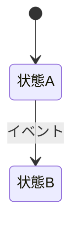

# エンティティ影響マップ: {エンティティ名}

## 基本情報

| 項目 | 値 |
|------|-----|
| テーブル | `{テーブル名}` |
| ドメインモデル | `{モジュールパス}` |
| 主キー | `{主キー}` |

## 更新パス

どのユースケースがこのエンティティを更新するか。

| # | ユースケース | 更新フィールド | 前提条件 | 備考 |
|---|-------------|--------------|---------|------|
| 1 | {例: 申請作成} | {例: status, created_at} | {例: なし} | |
| 2 | {例: 承認} | {例: status, approved_by} | {例: status = pending} | |

## 競合リスク

同じフィールドを複数のユースケースが更新する場合、競合が発生しうる。

| フィールド | 更新元 | リスク | 対策 |
|-----------|--------|--------|------|
| {例: status} | {例: 承認, 却下} | {例: 同時更新による状態不整合} | {例: 楽観的ロック} |

## 状態遷移

## 読み取りパス

どのユースケースがこのエンティティを参照するか（主要なもの）。

| # | ユースケース | 参照フィールド | 備考 |
|---|-------------|--------------|------|
| 1 | {例: 一覧表示} | {例: id, title, status} | |

## 関連エンティティ

| エンティティ | 関係 | FK | 備考 |
|-------------|------|-----|------|
| {例: User} | {例: N:1} | {例: created_by → users.id} | |
