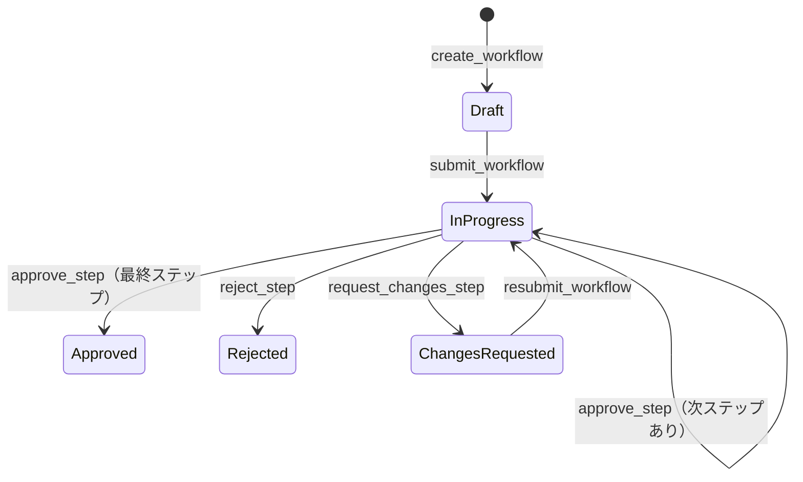

# エンティティ影響マップ: WorkflowInstance

## 基本情報

| 項目 | 値 |
|------|-----|
| テーブル | `workflow_instances` |
| ドメインモデル | `ringiflow_domain::workflow::instance::WorkflowInstance` |
| 主キー | `id` (UUID v7) |
| 楽観的ロック | `version` カラム（`update_with_version_check` で検証） |

## 更新パス

| # | ユースケース | 操作 | 更新フィールド | 前提条件 | 備考 |
|---|-------------|------|--------------|---------|------|
| 1 | `create_workflow` | INSERT | 全フィールド（status=Draft） | 定義が Published | `instance_repo.insert()` |
| 2 | `submit_workflow` | UPDATE | status(Draft→InProgress), current_step_id, submitted_at, version | status=Draft | `submitted()` + `with_current_step()` の2段階遷移 |
| 3 | `approve_step`（次ステップあり） | UPDATE | current_step_id, version | status=InProgress | `advance_to_next_step()` |
| 4 | `approve_step`（最終ステップ） | UPDATE | status(→Approved), completed_at, version | status=InProgress | `complete_with_approval()` |
| 5 | `reject_step` | UPDATE | status(→Rejected), completed_at, version | status=InProgress | `complete_with_rejection()` |
| 6 | `request_changes_step` | UPDATE | status(→ChangesRequested), version | status=InProgress | `complete_with_request_changes()`。completed_at は設定しない |
| 7 | `resubmit_workflow` | UPDATE | status(→InProgress), form_data, current_step_id, completed_at(→None), version | status=ChangesRequested | `resubmitted()`。申請者本人のみ実行可能 |

## 競合リスク

| フィールド | 更新元 | リスク | 現在の対策 |
|-----------|--------|--------|-----------|
| status | approve_step / reject_step / request_changes_step | 同一インスタンスへの同時判断操作で状態不整合 | 楽観的ロック（version check → 409 Conflict） |
| current_step_id | approve_step / submit_workflow / resubmit_workflow | 同時実行時に不整合な step を指す可能性 | 楽観的ロック |
| version | 全 UPDATE 操作 | 楽観的ロックの競合検出 | `InfraError::Conflict` → `CoreError::Conflict` (HTTP 409) |

トランザクション未整備の問題: Step と Instance の更新が同一トランザクション内で実行されないため、Step 更新成功 → Instance 更新失敗の部分更新が発生しうる。→ #687〜#689 で対応予定。

## 状態遷移

注: `submit_workflow` では内部的に Draft → Pending → InProgress の2段階遷移が行われるが、外部からは Draft → InProgress として観測される。Cancelled 状態への遷移は現時点で未実装。

## 不変条件

| ID | 条件 | 検証タイミング |
|----|------|--------------|
| INV-I1 | status=Approved ⇒ completed_at IS NOT NULL | approve_step（最終ステップ）完了後 |
| INV-I2 | status=Rejected ⇒ completed_at IS NOT NULL | reject_step 完了後 |
| INV-I3 | status=InProgress ⇒ current_step_id IS NOT NULL | submit_workflow / approve_step / resubmit_workflow 完了後 |
| INV-I4 | status=Draft ⇒ submitted_at IS NULL | create_workflow 完了後 |

クロスエンティティ不変条件: → [WorkflowStep 影響マップ > クロスエンティティ不変条件](WorkflowStep.md#クロスエンティティ不変条件)

## 読み取りパス

| # | ユースケース | 参照フィールド | 備考 |
|---|-------------|--------------|------|
| 1 | `list_my_workflows` | 全フィールド | `initiated_by` でフィルタ |
| 2 | `get_workflow` | 全フィールド | `id` + `tenant_id` で取得。Steps も同時取得 |
| 3 | `get_workflow_by_display_number` | 全フィールド | `display_number` + `tenant_id` で取得。Steps も同時取得 |
| 4 | `approve_step` / `reject_step` / `request_changes_step` | id, status, version | 判断操作の前提条件チェック |
| 5 | `submit_workflow` / `resubmit_workflow` | id, status, version, initiated_by | ライフサイクル操作の前提条件チェック |

## 関連エンティティ

| エンティティ | 関係 | FK | 備考 |
|-------------|------|-----|------|
| WorkflowDefinition | N:1 | `definition_id` → `workflow_definitions.id` | 定義のバージョンも `definition_version` で保持 |
| WorkflowStep | 1:N | `workflow_steps.instance_id` → `workflow_instances.id` | Steps は Instance のライフサイクルに従属 |
| User | N:1 | `initiated_by` → `users.id` | 申請者 |
| WorkflowComment | 1:N | `workflow_comments.instance_id` → `workflow_instances.id` | コメント |

## 既知の問題

- `update_with_version_check` の WHERE 句に `tenant_id` 条件が欠落している（`WorkflowStepRepository` 側にはある）。RLS による防御はあるが、アプリ層の防御として不完全。→ #687 で対応予定。
