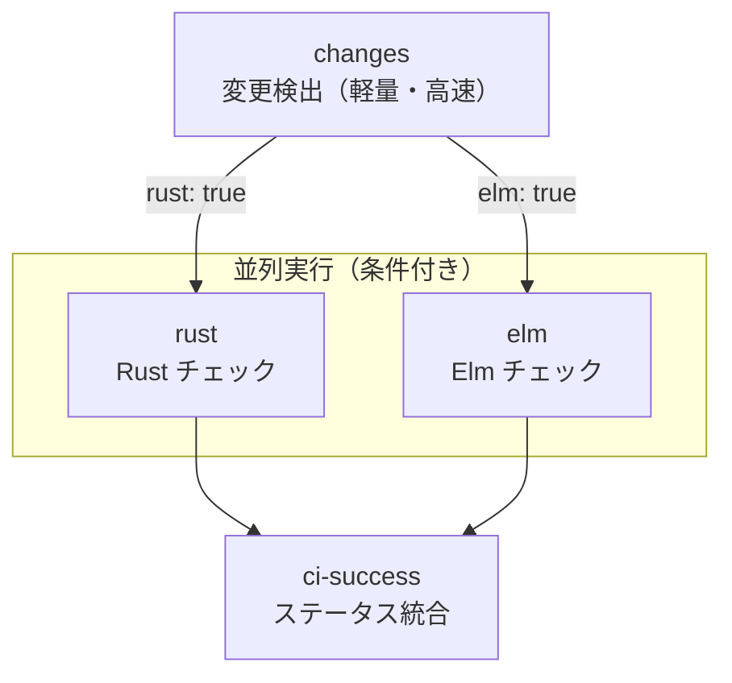

# ADR-004: CI 並列化と変更検出

## ステータス

承認済み

## コンテキスト

RingiFlow は Rust（バックエンド）と Elm（フロントエンド）の Monorepo 構成を採用している。
CI で両方のチェックを毎回実行すると、以下の問題が発生する:

- Elm のみ変更しても Rust のビルド・テストが走り、不要な待ち時間が発生
- Rust のみ変更しても Elm のセットアップ・テストが走る
- 開発中は片方のみの変更が多く、無駄な CI 実行が頻発

CI 待ち時間は開発体験に直結するため、変更されたコンポーネントのみチェックする仕組みが必要。

## 検討した選択肢

### 選択肢 1: 単一ジョブ（現状維持）

全チェックを 1 つのジョブで直列実行する。

```yaml
jobs:
  ci:
    steps:
      - Rust セットアップ
      - Elm セットアップ
      - Rust チェック
      - Elm チェック
```

評価:
- 利点: 設定がシンプル、キャッシュ共有が容易
- 欠点: 常に全チェック実行、待ち時間が長い

### 選択肢 2: `on.push.paths` によるワークフロー分割

Rust 用と Elm 用で別々のワークフローファイルを作成し、`paths` トリガーで制御する。

```yaml
# ci-rust.yml
on:
  push:
    paths:
      - 'apps/api/**'
      - 'packages/**'

# ci-elm.yml
on:
  push:
    paths:
      - 'apps/web/**'
```

評価:
- 利点: GitHub 組み込み機能、追加依存なし
- 欠点: ブランチ保護で複数ワークフローの管理が煩雑、PR で両方変更時に 2 つのステータスが出る

### 選択肢 3: `dorny/paths-filter` によるジョブ分割

単一ワークフロー内で変更検出を行い、条件付きでジョブを実行する。

```yaml
jobs:
  changes:
    outputs:
      rust: ${{ steps.filter.outputs.rust }}
      elm: ${{ steps.filter.outputs.elm }}
    steps:
      - uses: dorny/paths-filter@v3
        with:
          filters: |
            rust:
              - 'apps/api/**'
            elm:
              - 'apps/web/**'

  rust:
    needs: changes
    if: needs.changes.outputs.rust == 'true'

  elm:
    needs: changes
    if: needs.changes.outputs.elm == 'true'
```

評価:
- 利点: 単一ワークフローで管理、ジョブ単位の条件分岐、並列実行可能
- 欠点: 外部 Action への依存、changes ジョブのオーバーヘッド（約 5 秒）

### 選択肢 4: `git diff` による自前実装

シェルスクリプトで変更ファイルを検出する。

```yaml
- run: |
    if git diff --name-only HEAD~1 | grep -q '^apps/api/'; then
      echo "rust=true" >> $GITHUB_OUTPUT
    fi
```

評価:
- 利点: 外部依存なし、完全なカスタマイズ性
- 欠点: 初回コミット・force push・PR のベース比較等のエッジケース処理が複雑

### 比較表

| 観点 | 単一ジョブ | paths 分割 | paths-filter | git diff |
|------|-----------|-----------|--------------|----------|
| 実行時間 | 常に全部 | 変更部分のみ | 変更部分のみ | 変更部分のみ |
| 設定の複雑さ | 低 | 中 | 中 | 高 |
| ブランチ保護 | 容易 | 煩雑 | 容易 | 容易 |
| 外部依存 | なし | なし | あり | なし |
| エッジケース | N/A | 対応済み | 対応済み | 要実装 |
| 並列実行 | 不可 | 可 | 可 | 可 |

## 決定

**選択肢 3: `dorny/paths-filter` によるジョブ分割を採用する。**

理由:
1. 単一ワークフローで Rust/Elm 両方を管理でき、ブランチ保護設定がシンプル
2. PR とプッシュ両方のベース比較を自動処理してくれる
3. paths-filter は広く使われており、メンテナンスも活発

選択肢 2 は複数ワークフローの管理が煩雑で、選択肢 4 はエッジケースの実装コストが高い。

## 帰結

### 肯定的な影響

- Elm のみ変更時の CI 時間: 約 140 秒 → 約 55 秒（60% 削減）
- Rust のみ変更時の CI 時間: 約 140 秒 → 約 95 秒（30% 削減）
- 両方変更時は並列実行により、直列時より高速

### 否定的な影響・トレードオフ

- `dorny/paths-filter` への外部依存が発生
- changes ジョブのオーバーヘッド（約 5 秒）が常に発生
- ジョブが分離されるため、Cargo/npm キャッシュをジョブ毎に取得する必要がある

### 設計詳細

#### ジョブ構成



#### ci-success パターン

GitHub のブランチ保護は「特定のジョブが成功」を要求する。
条件付きジョブは `skipped` になることがあり、保護ルールの設定によっては失敗扱いになる。

`ci-success` ジョブで全結果を統合することで:
- ブランチ保護は `ci-success` のみを監視すればよい
- `skipped` を成功扱いにできる

```yaml
ci-success:
  needs: [changes, rust, elm]
  if: always()  # 依存ジョブの結果に関わらず実行
  steps:
    - run: |
        # failure 以外（success, skipped）は OK
        [[ "${{ needs.rust.result }}" != "failure" ]] && \
        [[ "${{ needs.elm.result }}" != "failure" ]]
```

`if: always()` がないと、依存ジョブが `skipped` の場合に `ci-success` も実行されない。

#### fetch-depth: 0 の必要性

`actions/checkout` のデフォルトは `fetch-depth: 1`（shallow clone）。
paths-filter は push イベントで `github.event.before`（前のコミット）との差分を見るため、
shallow clone だと比較対象のコミットが取得できず、全ファイルが変更扱いになる場合がある。

```yaml
- uses: actions/checkout@v4
  with:
    fetch-depth: 0  # 全履歴を取得
```

トレードオフ:
- 履歴が大きいリポジトリでは checkout が遅くなる
- 変更検出ジョブは軽量なので、数秒の増加は許容範囲

#### 変更検出の対象パス

| パス | 含める理由 |
|------|-----------|
| `apps/api/**` | API サーバーのソースコード |
| `packages/**` | 共有 Rust クレート |
| `Cargo.toml` | ワークスペース設定 |
| `Cargo.lock` | 依存バージョン固定 |
| `rust-toolchain.toml` | Rust バージョン指定 |
| `apps/web/**` | Elm ソースコード、pnpm-lock.yaml 含む |

含めていないもの:
- `.github/workflows/ci.yml`: CI 設定自体の変更は手動確認が妥当
- `justfile`: 通常は他のファイルと一緒に変更される
- `docs/**`: ビルドに影響しない

### 関連ドキュメント

- 手順書: [`docs/03_手順書/06_CICD構築.md`](../03_手順書/06_CICD構築.md)
- 実装: [`.github/workflows/ci.yml`](../../.github/workflows/ci.yml)

---

## 変更履歴

| 日付 | 変更内容 |
|------|---------|
| 2026-01-14 | 初版作成 |
