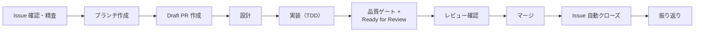
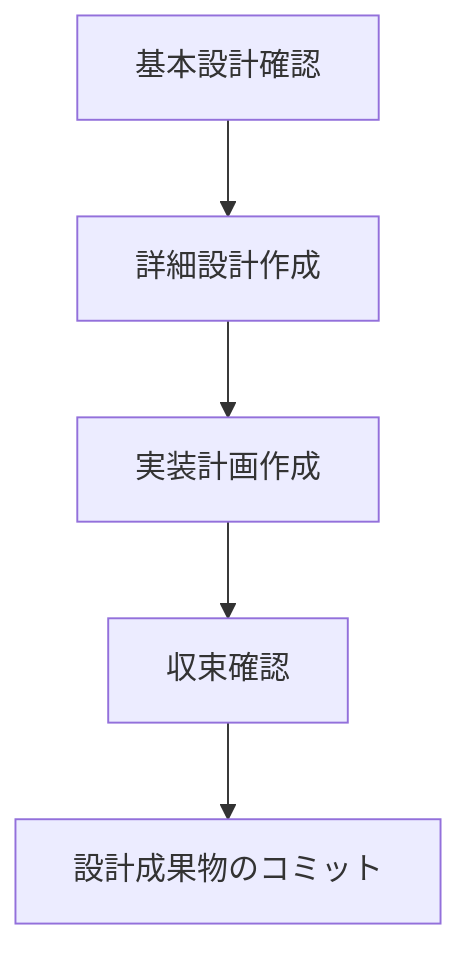
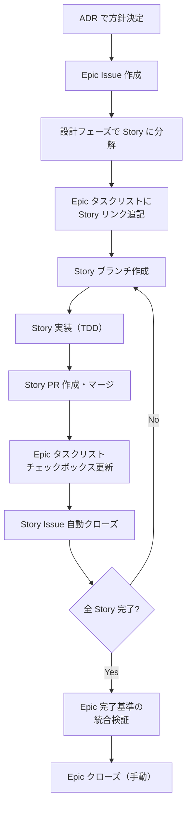

# Issue 駆動開発

## 概要

このプロジェクトでは GitHub Projects + Issue 駆動で開発を進める。
タスクを Issue として管理し、PR と紐づけることで変更の追跡性を確保する。

前提: Issue は仮説であり、精査・検討対象である。Issue に書かれた内容を無批判に「正」として受け入れず、着手前に前提・スコープ・完了基準の妥当性を検証する。

採用理由: [ADR-012: Issue 駆動開発の採用](../../05_ADR/012_Issue駆動開発の採用.md)

## リソース

| リソース | URL |
|---------|-----|
| Project Board | https://github.com/users/ka2kama/projects/1 |
| Milestones | https://github.com/ka2kama/ringiflow/milestones |
| Issues | https://github.com/ka2kama/ringiflow/issues |

## 開発フロー



### AI エージェントの着手トリガー

ユーザーが Issue 番号を指定した場合、着手の指示として扱い、直ちに精査フローに入る。

**禁止:** 着手の意思が明確な場合に「着手してよろしいですか？」等の確認を挟むこと

改善の経緯: [Issue 指定時の不要な着手確認](../../../process/improvements/2026-02/2026-02-19_2030_Issue指定時の不要な着手確認.md)

### 1. Issue を確認または作成

```bash
# Issue 一覧を確認
gh issue list

# 新しい Issue を作成
gh issue create --title "機能名" --body "説明" --milestone "Phase 1: MVP" --label "backend"
```

Issue には以下を含める:
- 概要: 何を実装するか
- 完了基準: 何ができたら完了か（チェックリスト形式）
- 参照: 関連する要件ID、設計書へのリンク

#### 完了基準の書き方

完了基準は **技術的基準** と **E2E 基準** の両方を含める。

- 技術的基準: API エンドポイントの動作、データの保存、等
- E2E 基準: ユーザーが UI から操作を完了できること（フルスタック機能の場合は必須）

E2E 基準がないと、各レイヤーが個別に正しくてもレイヤー間の接続が検証されず、問題の検出が遅れる。

#### 完了基準と操作パス

完了基準は「コンポーネント実装レベル」ではなく「操作パスレベル」で記述する。

| レベル | 視点 | 例 | リスク |
|--------|------|-----|--------|
| コンポーネント実装レベル | 個々のモジュールが動作する | 「バリデーション結果を表示できる」 | 操作パス全体の検証が漏れる |
| 操作パスレベル | ユーザーが操作を完了できる | 「検証ボタンを押して結果を確認できる」 | — |

良い例（操作パスレベル）:

```markdown
## 完了基準

- [ ] 承認者が詳細画面から承認ボタンを押して承認を完了できる
- [ ] 承認者が詳細画面から却下ボタンを押して却下を完了できる
- [ ] 不正な操作時にエラーメッセージが表示される
```

悪い例（コンポーネント実装レベル）:

```markdown
## 完了基準

- [ ] POST /approve で承認できる
- [ ] POST /reject で却下できる
```

操作パスの詳細な列挙手順と分類: [TDD 開発フロー > 操作パスの列挙](./02_TDD開発フロー.md#操作パスの列挙テストリスト作成の前に)

改善の経緯: [E2E 視点の完了基準欠如](../../../process/improvements/2026-01/2026-01-29_1304_E2E視点の完了基準欠如.md)

#### 既存 Issue の精査

既存の Issue に着手する場合、実装を始める前に Issue 自体を精査する。[問題解決フレームワーク](../../../.claude/rules/problem-solving.md)を Issue に適用し、以下の観点で検証する:

| 観点 | 問い |
|------|------|
| Want の確認 | この Issue が解決しようとしている本質的なニーズは何か？ |
| How への偏り | Issue が特定の解決策を前提にしていないか？ |
| 完了基準の妥当性 | 完了基準は Want を満たしているか？ |
| 暗黙の仮定 | Issue が前提としている仮定は正しいか？ |
| スコープの適切さ | 過大/過小ではないか？別の分割がありえないか？ |
| As-Is の妥当性 | Issue の現状分析は最新か、事実として正しいか？ |

**As-Is の妥当性確認（必須）:**

Issue 本文の現状分析は「作成時点の仮説」。着手時には最新の As-Is で検証する。

1. Issue 作成日時を確認（`gh issue view <number> --json createdAt`）
2. 作成後の関連 PR を検索（`gh pr list --search "#<Issue番号>"`）
3. 最新の As-Is を測定・確認（Issue 本文を鵜呑みにしない、可能な限り実測・設定ファイル確認）
4. Issue の前提が現在も有効か判断
   - 既に改善済み → 精査結果「破棄」（Issue をクローズ）
   - 現状分析が間違っている → 精査結果「修正して続行」（正しい As-Is で Issue を更新）

詳細: [問題解決フレームワーク > Issue 精査時の As-Is 確認](../../../.claude/rules/problem-solving.md#issue-精査時の-as-is-確認)

精査結果に応じた分岐:

| 精査結果 | 条件 | アクション |
|---------|------|-----------|
| 続行 | Issue の内容に問題なし | ブランチ作成へ |
| 修正して続行 | スコープ・完了基準等に修正が必要 | Issue を修正後、ブランチ作成へ |
| 再構成 | 分割・統合・再作成が必要 | 新 Issue を作成し、元 Issue をクローズ |
| 破棄 | Want 不在、前提崩壊、重複等 | 理由を記録して Issue をクローズ |

**精査結果の記録（必須）:**

精査を実施した際は、結果を Issue コメントとして記録する。記録のフォーマットと詳細手順は [問題解決フレームワーク > 精査結果の記録](../../../.claude/rules/problem-solving.md#精査結果の記録成果物要件) を参照。

```bash
# Issue にコメントを追加
gh issue comment <Issue番号> --body "$(cat <<'EOF'
## Issue 精査

**Want**: [本質的なニーズ]

**As-Is 検証**:
- Issue 作成日: YYYY-MM-DD
- 関連 PR: #XXX（または なし）
- 最新の As-Is: [実測結果]

**精査結果**: 続行

**理由**: [判断理由]
EOF
)"
```

改善の経緯:
- [Issue を正として扱う暗黙の前提](../../../process/improvements/2026-02/2026-02-06_1946_Issueを正として扱う暗黙の前提.md)
- [Issue 精査フローに破棄パスが未定義](../../../process/improvements/2026-02/2026-02-11_2036_Issue精査フローに破棄パスが未定義.md)

### 2. ブランチを作成

ブランチ作成前に、ローカルの main を最新化する:

```bash
git checkout main
git pull origin main
```

```bash
# Issue 番号に基づいてブランチを作成
git checkout -b feature/34-user-auth
```

命名規則:
- `feature/{issue番号}-{機能名}` — 新機能
- `fix/{issue番号}-{バグ名}` — バグ修正

改善の経緯: [新規作業開始時の main 同期漏れ](../../../process/improvements/2026-02/2026-02-14_2120_新規作業開始時のmain同期漏れ.md)

### 3. Draft PR を作成

ブランチ作成後、すぐに Draft PR を作成する。

```bash
# 空コミットで Draft PR を作成
git commit --allow-empty -m "#34 WIP: Implement login feature"
git push -u origin HEAD
gh pr create --draft --title "#34 Implement login feature" --body-file .github/pull_request_template.md
```

**Draft PR の目的:**
- 作業中であることを可視化
- PR Description に設計メモや検討事項を記録

注意: Draft PR では自動レビューは実行されない。Ready for Review に変更した時点でレビューが走る。

採用理由: [ADR-013: Draft PR 運用の導入](../../05_ADR/013_Draft_PR運用の導入.md)

#### PR 本文のルール

PR テンプレート（`.github/pull_request_template.md`）の形式に従う。
Squash マージで PR 本文がコミットメッセージになるため、以下を守る:

| セクション | 必須 | 内容 |
|-----------|------|------|
| Summary | ✓ | 変更内容を 1〜3 行で |
| Related | ✓ | 関連 Issue 番号（`#34`, `Closes #34` など） |
| Test plan | ✓ | 完了したテスト項目を `[x]` で記載 |

オプションセクション（必要な場合のみ追加）:
- **Changes** — Summary で足りない場合の詳細な変更点
- **Notes** — 設計判断の背景、レビュアーへの補足

注意:
- 空のセクションは削除する
- HTML コメント（`<!-- -->`）は使用しない
- Test plan には完了項目のみ記載（未完了 `[ ]` を残さない）

### 4. 設計

実装前に必ず設計フェーズを経る。コードを書く前に「何を作るか」「どう作るか」を明確にする。



#### 4.1 基本設計確認

既存の基本設計書（`docs/02_基本設計書/`）を確認し、アーキテクチャ上の位置づけを把握する。

- 新しいコンポーネントが必要か
- 既存コンポーネントとの関係は
- データフローはどうなるか

基本設計の変更が必要な場合は、設計書を先に更新する。

#### 4.2 詳細設計作成

機能の詳細設計を `docs/03_詳細設計書/` に作成する。

含める内容:
- アーキテクチャ図（Mermaid）
- インターフェース定義（trait、API）
- データ構造
- シーケンス図（必要に応じて）

**API を含む機能の場合:**

OpenAPI 仕様書（`openapi/openapi.yaml`）を更新する。OpenAPI が Single Source of Truth。

- 新しいエンドポイントを追加
- リクエスト/レスポンススキーマを定義
- エラーレスポンスを定義

#### 4.3 実装計画作成

Issue 本文に実装計画を追記する。

フォーマット:

```markdown
## 実装計画

TDD（Red → Green → Refactor）で MVP を積み上げる。

### Phase 1: コンポーネント名

**テストリスト:**
- [ ] 正常系のテスト
- [ ] 異常系のテスト
- [ ] 境界値のテスト

### Phase 2: 次のコンポーネント名
...
```

**Phase 分割の基準:**
- 依存順（下位レイヤーから上位レイヤーへ）
- フルスタック機能の場合、既存 API の拡張が必要な箇所を洗い出す（新規エンドポイントだけでなく、既存エンドポイントのレスポンス拡張も Phase に含める）
- 詳細: [TDD 開発フロー > MVP 積み上げ方式](./02_TDD開発フロー.md#mvp-積み上げ方式)

**テストリストの書き方:**
- 1テスト = 1つの振る舞い
- 正常系 → 異常系 → 境界値の順
- 詳細: [TDD 開発フロー > テストリスト](./02_TDD開発フロー.md#テストリスト)

参考例: [Issue #34: ユーザー認証](https://github.com/ka2kama/ringiflow/issues/34)

#### 4.4 収束確認（設計フェーズ）

実装計画を作成したら、設計の収束を確認する。これはこのプロジェクトの核となるプラクティスであり、省略してはならない。

**手順:**

1. **To-Be（理想状態）を定義する**
   - ユーザー視点: この機能が完成したとき、ユーザーは何ができるか？
   - 技術視点: どのコンポーネントがどう動作するか？

2. **設計・計画チェックリストで検証する**
   - 網羅性、曖昧さ排除、設計判断の完結性、スコープ境界、技術的前提、既存ドキュメント整合
   - 詳細: [俯瞰・実装リズム](../../../.claude/rules/zoom-rhythm.md)

3. **検証結果を計画に記載する**
   - PR 本文または Issue に収束確認セクションを追加
   - 各項目の判定と確認内容を明記

**フォーマット例:**

```markdown
## 収束確認（設計・計画）

| # | 観点 | 判定 | 確認内容 |
|---|------|------|---------|
| 1 | 網羅性 | OK | 探索結果と Phase 構成を突合、差分なし |
| 2 | 曖昧さ排除 | OK | 曖昧表現なし、変更ファイルを明示 |
| 3 | 設計判断の完結性 | OK | 全ての選択肢に判断理由を記載 |
| 4 | スコープ境界 | OK | 対象・対象外を Issue に明記 |
| 5 | 技術的前提 | OK | 制約事項を確認済み |
| 6 | 既存ドキュメント整合 | OK | 関連 ADR・設計書と照合 |
```

**禁止:** 収束確認セクションのない計画で実装を開始すること

#### 4.5 設計成果物のコミット

設計フェーズで作成・更新したドキュメントをコミットする。

```bash
git add docs/03_詳細設計書/ openapi/
git commit -m "#34 Add detailed design for login feature"
```

設計と実装を分けてコミットすることで:
- 設計レビューを先に受けられる
- 実装中に設計変更があった場合、差分が明確になる

#### 設計フェーズの簡略化

以下の**すべて**を満たす場合のみ、設計フェーズ（4.1〜4.3）を簡略化できる:

- 単純なバグ修正、typo 修正、ドキュメント修正である
- **新しい設計判断が不要**である（URL 設計、データ構造、API 契約の変更なし）
- 変更ファイルが 3 個以下である

**収束確認（4.4）は省略不可。** 簡略化する場合でも、最低限の To-Be 定義とスコープ確認は行う。

判定テスト: 「この変更には選択肢があるか？」→ Yes なら設計判断が必要。スキップ不可。

改善の経緯: [設計フェーズにおける理想駆動の省略](../../../process/improvements/2026-02/2026-02-05_2335_設計フェーズにおける理想駆動の省略.md)

### 5. 実装（TDD）

TDD（テスト駆動開発）で実装を進める。詳細は [TDD 開発フロー](./02_TDD開発フロー.md) を参照。

```
Red → Green → Refactor を繰り返す
```

#### コミットの粒度

セーブポイントを積み上げるようにコツコツとコミットする。

| タイミング | 例 |
|-----------|-----|
| テストが通ったとき | `Add test for UserRepository find_by_email` |
| リファクタリング完了時 | `Refactor error handling in UserRepository` |
| 1つの機能単位が完成したとき | `Implement UserRepository` |

**良いコミット:**
- 小さく、1つの目的に集中
- テストが通る状態でコミット（壊れた状態を残さない）
- 後から履歴を追いやすい

**避けるべきコミット:**
- 「WIP」のまま長時間放置
- 複数の無関係な変更を1つにまとめる
- テストが落ちる状態でコミット

コミットメッセージの先頭に Issue 番号を含める（GitHub 上でリンクされる）。

```bash
git commit -m "#34 Implement find_by_email for UserRepository"
```

自動付与: lefthook がブランチ名（`feature/34-xxx`）から Issue 番号を抽出して自動で先頭に追加する。手動で書く必要はない。

#### Issue の進捗更新

Phase やタスクが完了したら、Issue のチェックボックスを都度更新する。

```bash
# Issue の本文を更新（チェックボックスを [x] に変更）
gh issue edit 34 --body "$(cat <<'EOF'
## 実装計画

### Phase 1: UserRepository ✅

**テストリスト:**
- [x] メールアドレスでユーザーを取得できる
- [x] 存在しないメールアドレスの場合 None を返す
...
EOF
)"
```

**なぜ都度更新が重要か:**
- 進捗が可視化され、チームメンバーや将来の自分が状況を把握できる
- 完了した作業と残りの作業が明確になる
- Project Board の進捗と Issue の詳細が一致する

### 6. 品質ゲートと Ready for Review

実装が完了したら、品質ゲート（6.1-6.4）を通過してから Draft PR を Ready for Review に変更する（6.5-6.8）。

- 品質ゲート: 品質チェックリスト + Self-review + 収束確認。品質を担保するプロセス
- Ready for Review: `gh pr ready` で Draft を解除する操作

#### 6.1 自動チェック

```bash
just check-all  # lint + test
```

#### 6.2 品質チェックリスト

自動チェック通過後、以下を確認する。

→ 位置づけ: [品質を守る二つの砦](../../../.claude/rules/zoom-rhythm.md#品質を守る二つの砦)（最後の砦 = 品質ゲート）
→ 各観点の背景・出典: [俯瞰・実装リズム > 収束確認のチェックリスト](../../../.claude/rules/zoom-rhythm.md#収束確認のチェックリスト)

プロセス完了確認:

設計・ドキュメント:
- [ ] 詳細設計書が作成・更新されているか（`docs/03_詳細設計書/`）
- [ ] API を含む場合、OpenAPI 仕様書が更新されているか（`openapi/`）
- [ ] 技術選定・設計判断があれば ADR が作成されているか（`docs/05_ADR/`）
- [ ] 設計判断を伴う実装があれば実装解説が作成されているか（`docs/07_実装解説/`）
- [ ] コード変更・設計判断があればセッションログが作成されているか（`prompts/runs/`）
- [ ] 変更種別に応じた必須ドキュメントが更新されているか（該当する場合のみ）
  - アーキテクチャ構成変更 → 基本設計書（`docs/02_基本設計書/`）
  - エンティティ追加・更新パス追加 → エンティティ影響マップ
  - データストア追加 → データ削除設計
  - 開発ツール追加 → 環境構築手順 + `justfile`
  - CI ワークフロー変更 → GitHub Actions ナレッジベース

Issue との整合:
- [ ] `just check-issue` が正常終了するか（全チェックボックスが `[x]` に更新されていること）
- [ ] PR の変更が Issue の Want/To-Be を過不足なく満たしているか: Issue の Want を再確認し、変更の欠落（削りすぎ）・過剰な変更（やりすぎ）がないことを検証

テスト:
- [ ] テストリストの項目が全て実装されているか（計画と実装が 1:1 で対応）
- [ ] テスト層の網羅性: 各 Phase でテストピラミッドの全層（ユニット/ハンドラ/API/E2E）が検討され、該当・非該当が明記されているか
- [ ] 操作パス起点の検証: テスト設計が操作パス（正常系・準正常系・異常系）から出発し、テストリストと対応づけられているか
- [ ] フルスタック機能の場合、E2E シナリオを確認済みか
- [ ] テスト責任の検証: Epic の Story の場合、テスト責任マッピングに割り当てられたテスト（ユニット〜E2E の全層）が実装・通過しているか
- [ ] PR Test plan の全確認項目がチェック済みであること
- [ ] TDD サイクル（Red → Green → Refactor）を守っているか
- [ ] テストレビュー済みか（冗長なテストの統合、テスト名の明確さ、構造の整理）

注: 操作パスの分類と列挙手順の詳細は [TDD 開発フロー > 操作パスの列挙](./02_TDD開発フロー.md#操作パスの列挙テストリスト作成の前に) を参照。

コード品質確認（マイナス→ゼロ）:

- [ ] アーキテクチャ一貫性: ハンドラ→リポジトリ直接呼び出し等のショートカットがない
- [ ] 既存パターン整合: 命名、構造、エラー処理が既存パターンに準拠
- [ ] 型安全性・エラーハンドリング: String/整数の濫用、安易な unwrap/expect がない
- [ ] 仕様突合: OpenAPI 仕様と実装が一致（フィールド、ステータスコード、型）
  - 新規ハンドラモジュール追加時: `openapi.rs` の `paths()` にハンドラ関数を登録
  - 新規タグ追加時: `openapi.rs` の `tags()` にタグを登録
  - `just openapi-generate` を実行して `openapi.yaml` を更新
  - `git diff openapi/openapi.yaml` で新規エンドポイントが含まれていることを確認
- [ ] レイヤー間接続: 全レイヤーにフィールド変更が伝播、DB 制約（UNIQUE、FK、NOT NULL）への影響確認
- [ ] YAGNI/KISS の正しい適用: シンプル化を理由にしたレイヤー違反・型安全性省略がない
- [ ] 技術的前提の確認: ツール仕様が公式ドキュメントで確認されている
- [ ] 既存ドキュメントとの矛盾がないか（要件定義書、基本設計書、ADR など）
- [ ] 構造的健全性: 未使用依存なし（`just check-unused-deps`）、新モジュール追加時は責務重複を確認済み

品質向上の最終確認（ゼロ→プラス）:

- [ ] シンプルさ: 同じ結果をより少ない概念で実現できないか（不要な中間層、冗長なデータ構造）
- [ ] 型の活用: 型で防げる不正状態を String や整数で済ませていないか
- [ ] 責務の明確さ: 各コンポーネントの責務が単一か（複数の関心事が混ざっていないか）
- [ ] ベストプラクティス: その分野の推奨パターンに沿っているか（標準ライブラリ、フレームワークの活用）

UI/UX 品質確認（フロントエンド変更がある場合）:

→ 既知手法との対応: [TDD 開発フロー > 既知手法との対応](02_TDD開発フロー.md#既知手法との対応)

- [ ] デザイントークン整合: [デザインガイドライン](../../03_詳細設計書/13_デザインガイドライン.md)に準拠しているか
- [ ] 共有コンポーネント活用: 既存の共有コンポーネントを使用しているか（新規実装前に確認）
- [ ] アクセシビリティ: セマンティック HTML、ARIA 属性、キーボード操作（focus-visible）、フォームの label 関連付け
- [ ] 状態表示: RemoteData の全状態 + 空データが適切に処理されているか
- [ ] エラー表示: ユーザーの言語で表現され、回復手段（再読み込み等）を提供しているか
- [ ] 視覚的階層: タイポグラフィ階層（[デザインガイドライン](../../03_詳細設計書/13_デザインガイドライン.md)）に沿っているか
- [ ] 破壊的操作の防御: 削除・却下等に ConfirmDialog があり、ボタン色が操作の意味と一致しているか

デザイン品質向上（ゼロ→プラス）:

- [ ] コントラストの効果: 重要な要素（CTA、見出し、状態バッジ）が周囲と明確に差別化されているか
- [ ] 整列の一貫性: 要素がスペーシンググリッド（4px 基準）に沿って整列しているか
- [ ] 余白の活用: 余白が情報のグルーピングと呼吸感を適切に生み出しているか

横断検証（複数 Phase の PR の場合）:

- [ ] Phase 間データフロー整合: 下位レイヤーの出力と上位レイヤーの入力を突合し、差分ゼロ
- [ ] 仕様との端到端突合: OpenAPI → Core → BFF → フロントエンドでデータが一貫、Silent Failure がない
- [ ] 完了基準の E2E 検証: Issue の完了基準がすべて達成されている

#### 6.3 収束確認結果を PR 本文に記載

品質チェックリスト（6.2）の確認結果を **PR 本文の Self-review セクション** にカテゴリ別の確認内容として記載する。

各カテゴリに対して:
- カテゴリ名 + コロン + 確認内容（何を確認したか）を 1 行で記載する
- 該当しないカテゴリは `N/A（理由）` で明示する
- 全カテゴリが記載され、各行にコロン以降の確認内容があること

実装の場合:

```markdown
## Self-review

- 設計・ドキュメント: 詳細設計書更新済み、ADR該当なし、セッションログ作成済み
- Issue との整合: 完了基準3件・実装計画4Phase すべて達成、Want/To-Be 突合で過不足なし
- テスト: テストリスト全12項目実装、ユニット/ハンドラ/API/E2E全層カバー
- コード品質（マイナス→ゼロ）: レイヤー違反なし、既存パターン準拠、OpenAPI同期確認済み
- 品質向上（ゼロ→プラス）: 不要な中間層なし、責務単一
- UI/UX: N/A（バックエンドのみ）
- 横断検証: N/A（単一Phase）
- `just check-all` pass: 全テスト通過
```

ドキュメント修正の場合:

```markdown
## Self-review

- 参照の網羅性: 関連ファイルの参照をすべて更新
- 用語の統一: 新旧用語が混在していないことを確認
- 意図の明確さ: 変更の目的が読み手に伝わることを確認
- `just check-all` pass: 全テスト通過
```

注意:
- 確認内容は具体的に記載する（rubber-stamp 防止）。「確認済み」のみは不可
- 収束確認結果が記載されていない PR は Ready for Review にしない

改善の経緯: [実装フェーズにおける収束確認の自動実行欠如](../../../process/improvements/2026-02/2026-02-06_0010_実装フェーズにおける自己検証の自動実行欠如.md)

#### 6.4 計画ファイルの確認

<!-- 改善: process/improvements/2026-02/2026-02-16_2301_planモード後のコンテキスト喪失による計画ファイルのコミット漏れ.md -->
`prompts/plans/` に未コミットの計画ファイルがないか確認する。plan mode で作成された計画ファイルは、コンテキスト圧縮後に「自分が作ったもの」という情報が失われ、コミット漏れが発生しやすい。

```bash
git status prompts/plans/
```

| 状態 | 対応 |
|------|------|
| 未コミットファイルなし | 6.5 へ |
| 未コミットファイルあり | 現在の作業との関連を確認し、関連があればコミットする |

改善の経緯: [plan モード後のコンテキスト喪失による計画ファイルのコミット漏れ](../../../process/improvements/2026-02/2026-02-16_2301_planモード後のコンテキスト喪失による計画ファイルのコミット漏れ.md)

#### 6.5 base branch との同期確認

プッシュ前に base branch（main）との同期状態を確認する。差分がある場合は rebase してからプッシュする。

```bash
git fetch origin main
git log HEAD..origin/main --oneline
```

| 状態 | 対応 |
|------|------|
| 差分なし | 6.6 へ |
| 差分あり | `git rebase origin/main` を実行し、`just check-all` で再確認してから 6.6 へ |

なぜプッシュ前に行うか: Ready for Review 後に rebase が必要になると、CI + Claude Auto Review が再実行される無駄なサイクルが発生する。

#### 6.6 プッシュ

チェック完了後、変更をリモートにプッシュする:

```bash
git push
```

#### 6.7 CI 通過を確認

GitHub Actions の CI が通過するのを待つ:

```bash
gh pr checks --watch  # CI の完了を待機
```

#### 6.8 Ready for Review に変更

**CI が通過してから** Draft を解除する:

```bash
gh pr ready
```

これにより Claude Code Action の自動レビューが実行される。

注意: CI が失敗している状態で Ready にしない。CI 失敗時は原因を修正してから再度プッシュする。

### 6.9 Draft に戻した後、再度 Ready にする場合

Draft に戻した = 品質保証がリセットされた状態。コミットの作成者（AI / ユーザー）に関わらず、品質ゲートを再度通過する必要がある。

1. 修正・追加コミットを実施
2. `just check-all` で品質ゲート通過
3. base branch 同期確認（差分があれば rebase + `just check-all` で再確認）
4. `gh pr ready` で Ready にする

**禁止:** 品質ゲートを通過せずに Ready for Review に戻すこと

### 7. レビュー確認

Claude Code Action による自動レビューが実行される。

1. レビューコメントを確認
2. 指摘があれば修正をコミット
3. 修正不要な指摘は理由を返信してから resolve

レビュー方針: [CLAUDE.md の PRレビュー](../../../CLAUDE.md#prレビュー)

### 8. マージ

レビュー確認後、手動でマージする。

```bash
gh pr merge --squash
just clean-branches
```

**Squash マージの効果:**
- PR 内の全コミットが 1 つのコミットに統合される
- コミットメッセージ: PR タイトル + PR 本文（Summary, Test plan 等）
- `git log` で変更の背景を追跡できる

→ 設定詳細: [GitHub 設定 > Pull Requests](../02_プロジェクト構築/03_GitHub設定.md#13-pull-requests)

注意: `--auto` は使用しない。レビュー結果を確認してからマージすること。リモートブランチは GitHub の auto-delete 設定で自動削除される。

### 9. 振り返り

Issue クローズ後、振り返りコメントを残す。学習は「記録」ではなく「振り返り」から生まれる。

採用理由: [ADR-025: 情報管理とローカル知識集約の方針](../../05_ADR/025_情報管理とローカル知識集約の方針.md)

#### 振り返りコメントのフォーマット

Issue に以下を含むコメントを追加する:

```markdown
## 振り返り

### 完了条件の検証
- [x] 条件1: 達成
- [x] 条件2: 達成

### 予想と違ったこと
（実装前の想定と異なった点。なければ「特になし」）

### 学んだこと
（技術的な発見、設計上の気づき）

### 次に活かすこと
（同様のタスクで意識すべき点）
```

```bash
# Issue にコメントを追加
gh issue comment 34 --body "$(cat <<'EOF'
## 振り返り

### 完了条件の検証
- [x] POST /auth/login でログインできる: 達成
- [x] 不正なパスワードの場合は 401 を返す: 達成

### 予想と違ったこと
セッション Cookie の設定で SameSite 属性の考慮が必要だった。

### 学んだこと
Cookie のセキュリティ属性（Secure, HttpOnly, SameSite）の組み合わせ。

### 次に活かすこと
認証関連の実装時は Cookie 属性を設計段階で検討する。
EOF
)"
```

#### 学びの転記基準

振り返りで得た学びは、重要度に応じてローカルドキュメントに転記する:

| 重要度 | 記録先 | 例 |
|--------|-------|-----|
| 高: 再利用可能なパターン | ローカルドキュメント | 技術ノート、ADR、実装解説 |
| 中: このプロジェクト固有 | Issue コメント + セッションログ | API の仕様、設定値の理由 |
| 低: 一時的な気づき | Issue コメントのみ | エラーメッセージの改善案 |

#### 改善記録の検証

Issue クローズ時に、この Issue に関連する改善記録がないか確認し、検証セクションを追記する。

確認方法:

```bash
# この Issue に関連する改善記録を検索
grep -rl "#<Issue番号>" process/improvements/ --include="*.md"
```

| 状態 | 対応 |
|------|------|
| 関連する改善記録がない | 追加アクション不要 |
| 関連する改善記録があり、検証セクションが未追記 | 検証セクションを追記する |
| 関連する改善記録があり、検証セクションが追記済み | 追加アクション不要 |

検証セクションのフォーマット: [改善記録 README > 検証](../../../process/improvements/README.md#検証)

改善の経緯: [改善記録の効果追跡が機能していない](../../../process/improvements/2026-02/2026-02-10_0337_改善記録の効果追跡が機能していない.md)

#### 振り返りのスキップ

以下の場合は振り返りを簡略化または省略できる:

- typo 修正や軽微なドキュメント修正
- 既存パターンの単純な踏襲（新しい学びがない）
- 数行の修正で完結するバグ修正

注意: 振り返りコメントをスキップする場合でも、改善記録の検証は省略しない。改善記録の検証は Issue に紐づくアクションであり、実装の種類に依存しない。

## Milestone

Phase ごとに Milestone を作成している。Issue 作成時に適切な Milestone を設定する。

| Milestone | 状態 |
|-----------|------|
| Phase 0: 基盤構築 | 完了 |
| Phase 1: MVP | 進行中 |
| Phase 2: 機能拡張 | 未着手 |
| Phase 3: エンタープライズ機能 | 未着手 |
| Phase 4: 高度な機能・最適化 | 未着手 |

```bash
# Milestone の進捗を確認
gh api repos/ka2kama/ringiflow/milestones --jq '.[] | "\(.title): \(.open_issues) open, \(.closed_issues) closed"'
```

## Label

### Issue タイプ

| Label | 用途 | 色 |
|-------|------|-----|
| `type:epic` | 複数の Story をまとめる大きな機能 | 紫 |
| `type:story` | ユーザー価値の単位（1〜数日で完了） | 青 |

### カテゴリ

| Label | 用途 | 色 |
|-------|------|-----|
| `backend` | Rust / API 関連 | 青 |
| `frontend` | Elm / UI 関連 | 緑 |
| `infra` | Docker / Terraform / AWS | 紫 |
| `docs` | ドキュメント | 水色 |

### 優先度

| Label | 用途 | 色 |
|-------|------|-----|
| `priority:high` | 優先度: 高 | 赤 |
| `priority:medium` | 優先度: 中 | 黄 |
| `priority:low` | 優先度: 低 | 緑 |

## Project Board

Project Board はカンバン形式でタスクを可視化する。

| カラム | 意味 |
|--------|------|
| No Status | 未分類 |
| Todo | 着手前 |
| In Progress | 作業中 |
| Done | 完了 |

Issue を作成すると自動的に Project に追加される（`--project "RingiFlow"` オプション使用時）。

## Epic / Story 運用

アジャイルの Issue 階層を取り入れ、大きな機能を段階的に管理する。

→ 意思決定: [ADR-046 Story-per-PR ブランチ戦略](../../05_ADR/046_Story-per-PRブランチ戦略.md)

### 階層構造

```
Epic（大きな機能）
├── Story（ユーザー価値の単位）
│   └── Task（チェックリストで管理）
└── Story
    └── Task
```

| 概念 | 説明 | GitHub での実現 |
|------|------|----------------|
| Epic | 複数スプリントにまたがる大きな機能 | Issue + `type:epic` + Sub-issues |
| Story | ユーザー視点の価値単位（1〜数日） | Issue + `type:story` |
| Task | 技術的な作業単位 | Issue 内のチェックリスト |

### Epic の作成タイミング

以下の場合に Epic を作成する:

- ADR で方針決定した大きな機能
- 複数の Story に分解される機能
- 数週間以上かかる見込みの機能

```bash
# Epic の作成例
gh issue create \
  --title "Auth Service を分離する" \
  --label "type:epic" \
  --milestone "Phase 2: 機能拡張" \
  --project "RingiFlow"
```

### Story への分解

Epic の設計フェーズで Story に分解する。分解のタイミング:

- Epic 着手時に全体像が見えている場合 → 最初に分解
- 段階的に明確になる場合 → 進行に応じて追加

#### Story 分解の品質基準

各 Story は main に独立してマージ可能でなければならない。以下の基準を満たすこと:

| 基準 | 問い |
|------|------|
| 独立動作 | この Story だけマージしても main は壊れないか？ |
| 後方互換 | 後続 Story がなくても既存機能は動作するか？ |
| テスト完結 | この Story 単独でテストが全て通るか？ |
| 意味のある単位 | この Story だけで何らかの価値を提供するか？ |
| テスト責任の網羅 | Epic の完了基準の各項目が、テストピラミッドの各層（ユニット〜E2E）にわたって、いずれかの Story のテスト責任に割り当てられているか？ |

Story が独立してマージできないなら、Story の分解が不十分である。
Epic の完了基準に紐づく操作パス（正常系・準正常系・異常系）が、いずれの Story にもテスト責任として割り当てられていないなら、テスト責任の断絶がある。

```bash
# Story の作成（Epic の Sub-issue として）
gh issue create \
  --title "Auth Service の API を設計する" \
  --label "type:story,backend" \
  --milestone "Phase 2: 機能拡張" \
  --project "RingiFlow"

# 親 Issue（Epic）に紐付け（GitHub UI で設定、または gh api で）
```

#### テスト責任マッピング（成果物要件）

Story 分解時に、Epic の完了基準から操作パスを導出し、テストピラミッドの各層（ユニット / ハンドラ / API / E2E）にわたってテスト責任を子 Story に割り当てる。正常系だけでなく、準正常系（バリデーションエラー、権限不足等）・異常系（API エラー、タイムアウト等）も対象。成果物として、Epic 本文に以下のマッピング表を記載する。

```markdown
## テスト責任マッピング

| Epic 完了基準 | 操作パス | テスト層 | 担当 Story | テスト内容 |
|--------------|---------|---------|-----------|----------|
| バリデーションが機能する | 正常系 | ユニット | #726 | エンコード結果が definition ラッパーを含む |
| バリデーションが機能する | 正常系 | E2E | #726 | 検証ボタンを押して成功結果を確認できる |
| バリデーションが機能する | 準正常系 | E2E | #726 | 不正な定義で検証ボタンを押してエラーが表示される |
| 有効な定義のみ公開できる | 正常系 | E2E | #726 | 公開ボタンを押して確認後に公開される |
```

マッピング表の確認:
- Epic の完了基準の全項目が表に含まれていること
- 各完了基準について正常系・準正常系・異常系の操作パスが検討されていること
- 各完了基準についてテストピラミッドの適切な層が選択されていること
- 各項目に担当 Story が割り当てられていること
- 「どの Story にも属さない」項目がある場合、統合テスト Story を別途作成すること

**禁止:** Epic の完了基準に対するテスト責任が、いずれの Story にも割り当てられていない状態で実装に入ること

改善の経緯: [子 Issue 分割実装時の操作パス検証欠落](../../../process/improvements/2026-02/2026-02-21_1700_子Issue分割実装時の操作パス検証欠落.md)

### 運用フロー（Story-per-PR）

各 Story を個別の PR で main にマージする。Epic 単位の PR は作成しない。



#### Epic 完了基準の統合検証

全 Story 完了後、Epic をクローズする前に、Epic の完了基準をテスト責任マッピング表に基づいて統合検証する。

確認手順:

1. Epic の完了基準を一覧する
2. テスト責任マッピング表の各項目について、対応するテスト（ユニット〜E2E）が存在し、通過していることを確認する
3. テストでカバーされない完了基準がある場合、手動で動作確認する

成果物要件: Epic クローズコメントに検証結果を記載すること。

```markdown
## Epic 完了基準の統合検証

| 完了基準 | テスト層 | テスト | 結果 |
|---------|---------|-------|------|
| バリデーションが機能する | ユニット | WorkflowDefinitionTest.encodeValidationRequest | Pass |
| バリデーションが機能する | E2E | workflow-definition-management.spec.ts | Pass |
| GUI で定義を作成できる | E2E | designer-workflow-flow.spec.ts | Pass |
```

**禁止:** 統合検証を実施せずに Epic をクローズすること

改善の経緯: [子 Issue 分割実装時の操作パス検証欠落](../../../process/improvements/2026-02/2026-02-21_1700_子Issue分割実装時の操作パス検証欠落.md)

#### ブランチ命名

Story 単位でブランチを作成する。Epic 番号でブランチを作成しない。

```bash
# Story #427 のブランチ（Epic #403 のサブ Issue）
git checkout -b feature/427-user-management-api

# Epic 番号のブランチは作成しない
# NG: git checkout -b feature/403-phase2-2
```

#### PR と Issue の紐付け

| 対象 | 方法 | 例 |
|------|------|-----|
| Story | PR 本文で `Closes` → 自動クローズ | `Closes #427` |
| Epic | 全サブ Issue 完了後に手動クローズ | GitHub UI で確認・クローズ |

Epic に対して `Closes` を使用しない。Epic のクローズは全サブ Issue の完了を確認してから手動で行う。

### Epic タスクリストの管理

Epic 本文のタスクリストを手動で管理し、進捗を正確に反映する。

#### Story Issue 作成時

Story Issue を作成したら、Epic 本文のタスクリストに Story の Issue リンクを追記する。

```bash
# Epic の現在の本文を確認
gh issue view <Epic番号>

# Epic 本文を更新（タスクリストに Story リンクを追記）
gh issue edit <Epic番号> --body "$(cat <<'EOF'
## タスク

- [ ] Story 1: 〇〇を実装する #<Story番号>
- [ ] Story 2: △△を実装する #<Story番号>
EOF
)"
```

#### Story PR マージ時

Story PR をマージしたら、`just sync-epic` で Epic のタスクリストを自動更新する。

```bash
just sync-epic <Story番号>
```

スクリプトは Story Issue の body から親 Epic 番号（`Epic: #NNN`）を検出し、Epic のタスクリストで該当 Story のチェックボックスを `[x]` に更新する。Epic に属さない Issue の場合は何もしない。

全 Story のチェックボックスが `[x]` になったら、Epic をクローズする。

改善の経緯:
- [Epic の Story 進捗が未記録](../../../process/improvements/2026-02/2026-02-14_2230_EpicのStory進捗が未記録.md)
- Epic #747 Story 3 で `just sync-epic` を導入し、手動更新を自動化

### 進捗の可視化

- Epic の進捗は Sub-issues progress フィールドで自動追跡される
- Project Board の Board ビューで Story の状態を確認
- Milestone で Phase 全体の進捗を確認

## Issue の粒度

- 大きすぎる Issue は分割する（目安: 1日〜数日で完了できる単位）
- 小さなタスクは Issue 内のチェックリストで管理する
- Epic は例外的に大きくて良い（Sub-issues で分解するため）

良い例:
```markdown
## 完了基準

- [ ] POST /auth/login でログインできる
- [ ] POST /auth/logout でログアウトできる
- [ ] GET /auth/me で現在のユーザー情報を取得できる
- [ ] フロントエンドでログイン画面が動作する
```

## 運用補足

### Assignee

個人開発かつ AI エージェント運用のため、Issue / PR に assignee は設定しない。
作業状態は Project Board の Status と Draft PR で管理する。

### Project 紐づけ

Issue のみ Project に紐づけ、PR は紐づけない。
Issue 駆動開発では Issue が作業単位であり、PR は `Closes #xx` で Issue に紐づくため、Board は Issue のみで管理する。

## よく使うコマンド

```bash
# Issue 一覧
gh issue list

# Issue 詳細
gh issue view 34

# Issue を作成して Project に追加
gh issue create --title "タイトル" --milestone "Phase 1: MVP" --label "backend" --project "RingiFlow"

# PR 一覧
gh pr list

# PR の状態確認
gh pr checks

# Milestone 一覧
gh api repos/ka2kama/ringiflow/milestones
```

---

## 変更履歴

| 日付 | 変更内容 |
|------|---------|
| 2026-02-21 | 6.4 に計画ファイル確認ステップを追加。PR #589 で CLAUDE.md に追加された対策が再構成で消失していたため再追加（#583 再発対策） |
| 2026-02-21 | 完了基準の書き方に操作パスレベルの視点を追加、品質チェックリストのテスト項目を操作パス起点に更新（#765） |
| 2026-02-21 | Story 分解にテスト責任マッピング（成果物要件）を追加、Epic クローズに統合検証ゲートを追加、品質チェックリストにテスト責任の検証を追加（#763） |
| 2026-02-21 | 6.2「Issue との整合」を `just check-issue` に置換、Epic 管理を `just sync-epic` に自動化（#751） |
| 2026-02-21 | 6.3 Self-review をチェックボックスから検証レポート形式（根拠付きリスト）に変更（#749） |
| 2026-02-21 | 6.3 Self-review をカテゴリ別チェックボックス形式に構造化（#745） |
| 2026-02-21 | 6.2「Issue との整合」に Want/To-Be 突合ステップを追加（#742） |
| 2026-02-19 | 開発フローに「AI エージェントの着手トリガー」セクションを追加（#714） |
| 2026-02-18 | 6.2 品質チェックリスト UI/UX セクションにデザイン品質向上（攻め）項目を追加（#653） |
| 2026-02-17 | Epic / Story 運用に「Epic タスクリストの管理」セクションを追加（#524） |
| 2026-02-14 | Step 2 にブランチ作成前の main 最新化ステップを追加（#516） |
| 2026-02-11 | 6.2 にコンテキスト依存の必須ドキュメント確認項目を追加 |
| 2026-02-10 | Step 9 に改善記録の検証ステップを追加（#375） |
| 2026-02-09 | 6.4 に base branch 同期確認ステップを追加（#356） |
| 2026-02-06 | 概要に「Issue は仮説」の前提を追加、Step 1 に Issue 精査プロセスを追加 |
| 2026-02-06 | 6.2 にコード品質・テスト・横断検証の全項目を統合し、zoom-rhythm.md との重複を解消（#269） |
| 2026-01-29 | 完了基準に E2E 視点を追加、Phase 分割基準にデータフロー確認を追加 |
| 2026-01-27 | 振り返りセクションを追加（ADR-025） |
| 2026-01-26 | PR テンプレート導入、PR 本文のルールを追加 |
| 2026-01-25 | 運用補足セクションを追加（Assignee / Project 紐づけ方針） |
| 2026-01-22 | Ready for Review セクションを拡充（整合性チェック、手動確認チェックリスト追加） |
| 2026-01-18 | Epic / Story 運用セクションを追加、Label を Issue タイプ別に整理 |
| 2026-01-17 | マージ後のローカルブランチ削除手順を追加 |
| 2026-01-17 | lefthook による Issue 番号の自動付与を追加 |
| 2026-01-17 | コミットメッセージ・PR タイトルの先頭に Issue 番号を含める形式に統一 |
| 2026-01-17 | Issue の進捗更新ルールを追加 |
| 2026-01-17 | Draft PR 運用を導入（ADR-013） |
| 2026-01-17 | ブランチ作成を設計の前に移動（設計成果物をコミットするため） |
| 2026-01-17 | 設計フェーズを追加、TDD 開発フローへのリンクを追加、コミット粒度を追加、レビュー確認ステップを追加 |
| 2026-01-16 | 初版作成 |
