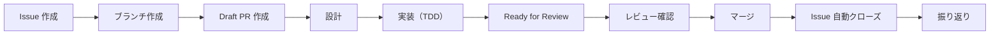
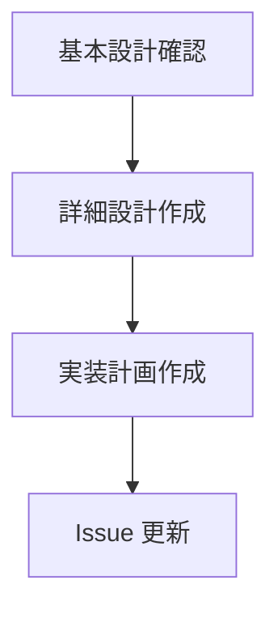
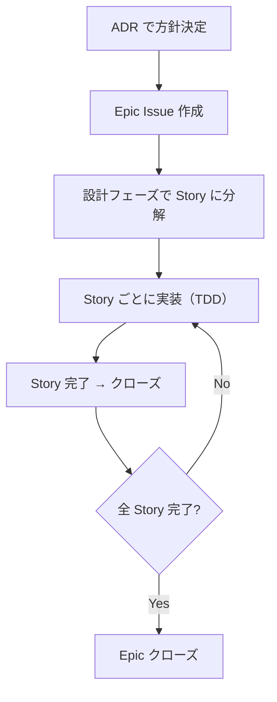

# Issue 駆動開発

## 概要

このプロジェクトでは GitHub Projects + Issue 駆動で開発を進める。
タスクを Issue として管理し、PR と紐づけることで変更の追跡性を確保する。

採用理由: [ADR-012: Issue 駆動開発の採用](../../05_ADR/012_Issue駆動開発の採用.md)

## リソース

| リソース | URL |
|---------|-----|
| Project Board | https://github.com/users/ka2kama/projects/1 |
| Milestones | https://github.com/ka2kama/ringiflow/milestones |
| Issues | https://github.com/ka2kama/ringiflow/issues |

## 開発フロー



### 1. Issue を確認または作成

```bash
# Issue 一覧を確認
gh issue list

# 新しい Issue を作成
gh issue create --title "機能名" --body "説明" --milestone "Phase 1: MVP" --label "backend"
```

Issue には以下を含める:
- 概要: 何を実装するか
- 完了基準: 何ができたら完了か（チェックリスト形式）
- 参照: 関連する要件ID、設計書へのリンク

#### 完了基準の書き方

完了基準は **技術的基準** と **E2E 基準** の両方を含める。

- 技術的基準: API エンドポイントの動作、データの保存、等
- E2E 基準: ユーザーが UI から操作を完了できること（フルスタック機能の場合は必須）

E2E 基準がないと、各レイヤーが個別に正しくてもレイヤー間の接続が検証されず、問題の検出が遅れる。

良い例（フルスタック機能）:

```markdown
## 完了基準

- [ ] POST /api/v1/workflows/{id}/steps/{stepId}/approve で承認できる
- [ ] POST /api/v1/workflows/{id}/steps/{stepId}/reject で却下できる
- [ ] 承認者が詳細画面から承認操作を完了できる（E2E）
- [ ] 承認者が詳細画面から却下操作を完了できる（E2E）
```

悪い例（技術的基準のみ）:

```markdown
## 完了基準

- [ ] POST /approve で承認できる
- [ ] POST /reject で却下できる
```

改善の経緯: [E2E 視点の完了基準欠如](../../../../prompts/improvements/2026-01/2026-01-29_1304_E2E視点の完了基準欠如.md)

### 2. ブランチを作成

```bash
# Issue 番号に基づいてブランチを作成
git checkout -b feature/34-user-auth
```

命名規則:
- `feature/{issue番号}-{機能名}` — 新機能
- `fix/{issue番号}-{バグ名}` — バグ修正

### 3. Draft PR を作成

ブランチ作成後、すぐに Draft PR を作成する。

```bash
# 空コミットで Draft PR を作成
git commit --allow-empty -m "#34 WIP: Implement login feature"
git push -u origin HEAD
gh pr create --draft --title "#34 Implement login feature" --body-file .github/pull_request_template.md
```

**Draft PR の目的:**
- 作業中であることを可視化
- PR Description に設計メモや検討事項を記録
- 必要に応じて `@claude` メンションで相談

注意: Draft PR では自動レビューは実行されない。Ready for Review に変更した時点でレビューが走る。

採用理由: [ADR-013: Draft PR 運用の導入](../../05_ADR/013_Draft_PR運用の導入.md)

#### PR 本文のルール

PR テンプレート（`.github/pull_request_template.md`）の形式に従う。
Squash マージで PR 本文がコミットメッセージになるため、以下を守る:

| セクション | 必須 | 内容 |
|-----------|------|------|
| Summary | ✓ | 変更内容を 1〜3 行で |
| Related | ✓ | 関連 Issue 番号（`#34`, `Closes #34` など） |
| Test plan | ✓ | 完了したテスト項目を `[x]` で記載 |

オプションセクション（必要な場合のみ追加）:
- **Changes** — Summary で足りない場合の詳細な変更点
- **Notes** — 設計判断の背景、レビュアーへの補足

注意:
- 空のセクションは削除する
- HTML コメント（`<!-- -->`）は使用しない
- Test plan には完了項目のみ記載（未完了 `[ ]` を残さない）

### 4. 設計

実装前に必ず設計フェーズを経る。コードを書く前に「何を作るか」「どう作るか」を明確にする。



#### 4.1 基本設計確認

既存の基本設計書（`docs/02_基本設計書/`）を確認し、アーキテクチャ上の位置づけを把握する。

- 新しいコンポーネントが必要か
- 既存コンポーネントとの関係は
- データフローはどうなるか

基本設計の変更が必要な場合は、設計書を先に更新する。

#### 4.2 詳細設計作成

機能の詳細設計を `docs/03_詳細設計書/` に作成する。

含める内容:
- アーキテクチャ図（Mermaid）
- インターフェース定義（trait、API）
- データ構造
- シーケンス図（必要に応じて）

**API を含む機能の場合:**

OpenAPI 仕様書（`openapi/openapi.yaml`）を更新する。OpenAPI が Single Source of Truth。

- 新しいエンドポイントを追加
- リクエスト/レスポンススキーマを定義
- エラーレスポンスを定義

#### 4.3 実装計画作成

Issue 本文に実装計画を追記する。

フォーマット:

```markdown
## 実装計画

TDD（Red → Green → Refactor）で MVP を積み上げる。

### Phase 1: コンポーネント名

**テストリスト:**
- [ ] 正常系のテスト
- [ ] 異常系のテスト
- [ ] 境界値のテスト

### Phase 2: 次のコンポーネント名
...
```

**Phase 分割の基準:**
- 依存順（下位レイヤーから上位レイヤーへ）
- フルスタック機能の場合、既存 API の拡張が必要な箇所を洗い出す（新規エンドポイントだけでなく、既存エンドポイントのレスポンス拡張も Phase に含める）
- 詳細: [TDD 開発フロー > MVP 積み上げ方式](./02_TDD開発フロー.md#mvp-積み上げ方式)

**テストリストの書き方:**
- 1テスト = 1つの振る舞い
- 正常系 → 異常系 → 境界値の順
- 詳細: [TDD 開発フロー > テストリスト](./02_TDD開発フロー.md#テストリスト)

参考例: [Issue #34: ユーザー認証](https://github.com/ka2kama/ringiflow/issues/34)

#### 4.4 設計成果物のコミット

設計フェーズで作成・更新したドキュメントをコミットする。

```bash
git add docs/03_詳細設計書/ openapi/
git commit -m "#34 Add detailed design for login feature"
```

設計と実装を分けてコミットすることで:
- 設計レビューを先に受けられる
- 実装中に設計変更があった場合、差分が明確になる

#### 設計フェーズのスキップ

以下の場合は設計フェーズを簡略化できる:
- 単純なバグ修正
- 既存パターンの踏襲（設計済み機能の追加実装）
- ドキュメント修正

### 5. 実装（TDD）

TDD（テスト駆動開発）で実装を進める。詳細は [TDD 開発フロー](./02_TDD開発フロー.md) を参照。

```
Red → Green → Refactor を繰り返す
```

#### コミットの粒度

セーブポイントを積み上げるようにコツコツとコミットする。

| タイミング | 例 |
|-----------|-----|
| テストが通ったとき | `Add test for UserRepository find_by_email` |
| リファクタリング完了時 | `Refactor error handling in UserRepository` |
| 1つの機能単位が完成したとき | `Implement UserRepository` |

**良いコミット:**
- 小さく、1つの目的に集中
- テストが通る状態でコミット（壊れた状態を残さない）
- 後から履歴を追いやすい

**避けるべきコミット:**
- 「WIP」のまま長時間放置
- 複数の無関係な変更を1つにまとめる
- テストが落ちる状態でコミット

コミットメッセージの先頭に Issue 番号を含める（GitHub 上でリンクされる）。

```bash
git commit -m "#34 Implement find_by_email for UserRepository"
```

自動付与: lefthook がブランチ名（`feature/34-xxx`）から Issue 番号を抽出して自動で先頭に追加する。手動で書く必要はない。

#### Issue の進捗更新

Phase やタスクが完了したら、Issue のチェックボックスを都度更新する。

```bash
# Issue の本文を更新（チェックボックスを [x] に変更）
gh issue edit 34 --body "$(cat <<'EOF'
## 実装計画

### Phase 1: UserRepository ✅

**テストリスト:**
- [x] メールアドレスでユーザーを取得できる
- [x] 存在しないメールアドレスの場合 None を返す
...
EOF
)"
```

**なぜ都度更新が重要か:**
- 進捗が可視化され、チームメンバーや将来の自分が状況を把握できる
- 完了した作業と残りの作業が明確になる
- Project Board の進捗と Issue の詳細が一致する

### 6. Ready for Review

実装が完了したら、チェックを実行してから Draft PR を Ready for Review に変更する。

#### 6.1 自動チェック

```bash
just check-all  # lint + test
```

#### 6.2 整合性チェックリスト

自動チェック通過後、以下を確認する:

設計・ドキュメント:
- [ ] 詳細設計書が作成・更新されているか（`docs/03_詳細設計書/`）
- [ ] API を含む場合、OpenAPI 仕様書が更新されているか（`openapi/`）
- [ ] 技術選定・設計判断があれば ADR が作成されているか（`docs/05_ADR/`）

Issue との整合:
- [ ] Issue の完了基準チェックリストが全て達成されているか
- [ ] Issue の実装計画（Phase、テストリスト）が全て完了しているか

テスト:
- [ ] テストリストの項目が全て実装されているか
- [ ] 正常系・異常系・境界値が網羅されているか

既存成果物との整合:
- [ ] 既存ドキュメントとの矛盾がないか（要件定義書、基本設計書、ADR など）
- [ ] コード全体の統一感が保たれているか（命名、パターン）

#### 6.3 プッシュ

チェック完了後、変更をリモートにプッシュする:

```bash
git push
```

#### 6.4 CI 通過を確認

GitHub Actions の CI が通過するのを待つ:

```bash
gh pr checks --watch  # CI の完了を待機
```

#### 6.5 Ready for Review に変更

**CI が通過してから** Draft を解除する:

```bash
gh pr ready
```

これにより Claude Code Action の自動レビューが実行される。

注意: CI が失敗している状態で Ready にしない。CI 失敗時は原因を修正してから再度プッシュする。

### 7. レビュー確認

Claude Code Action による自動レビューが実行される。

1. レビューコメントを確認
2. 指摘があれば修正をコミット
3. 修正不要な指摘は理由を返信してから resolve

レビュー方針: [CLAUDE.md の PRレビュー](../../../CLAUDE.md#prレビュー)

### 8. マージ

レビュー確認後、手動でマージする。

```bash
gh pr merge --squash --delete-branch
```

**Squash マージの効果:**
- PR 内の全コミットが 1 つのコミットに統合される
- コミットメッセージ: PR タイトル + PR 本文（Summary, Test plan 等）
- `git log` で変更の背景を追跡できる

→ 設定詳細: [GitHub 設定 > Pull Requests](../../02_プロジェクト構築/03_GitHub設定.md#13-pull-requests)

注意: `--auto` は使用しない。レビュー結果を確認してからマージすること。

**マージ後のローカルブランチ削除:**

```bash
just clean-branches
```

### 9. 振り返り

Issue クローズ後、振り返りコメントを残す。学習は「記録」ではなく「振り返り」から生まれる。

採用理由: [ADR-025: 情報管理とローカル知識集約の方針](../../05_ADR/025_情報管理とローカル知識集約の方針.md)

#### 振り返りコメントのフォーマット

Issue に以下を含むコメントを追加する:

```markdown
## 振り返り

### 完了条件の検証
- [x] 条件1: 達成
- [x] 条件2: 達成

### 予想と違ったこと
（実装前の想定と異なった点。なければ「特になし」）

### 学んだこと
（技術的な発見、設計上の気づき）

### 次に活かすこと
（同様のタスクで意識すべき点）
```

```bash
# Issue にコメントを追加
gh issue comment 34 --body "$(cat <<'EOF'
## 振り返り

### 完了条件の検証
- [x] POST /auth/login でログインできる: 達成
- [x] 不正なパスワードの場合は 401 を返す: 達成

### 予想と違ったこと
セッション Cookie の設定で SameSite 属性の考慮が必要だった。

### 学んだこと
Cookie のセキュリティ属性（Secure, HttpOnly, SameSite）の組み合わせ。

### 次に活かすこと
認証関連の実装時は Cookie 属性を設計段階で検討する。
EOF
)"
```

#### 学びの転記基準

振り返りで得た学びは、重要度に応じてローカルドキュメントに転記する:

| 重要度 | 記録先 | 例 |
|--------|-------|-----|
| 高: 再利用可能なパターン | ローカルドキュメント | 技術ノート、ADR、実装解説 |
| 中: このプロジェクト固有 | Issue コメント + セッションログ | API の仕様、設定値の理由 |
| 低: 一時的な気づき | Issue コメントのみ | エラーメッセージの改善案 |

#### 振り返りのスキップ

以下の場合は振り返りを簡略化または省略できる:

- typo 修正や軽微なドキュメント修正
- 既存パターンの単純な踏襲（新しい学びがない）
- 数行の修正で完結するバグ修正

## Milestone

Phase ごとに Milestone を作成している。Issue 作成時に適切な Milestone を設定する。

| Milestone | 状態 |
|-----------|------|
| Phase 0: 基盤構築 | 完了 |
| Phase 1: MVP | 進行中 |
| Phase 2: 機能拡張 | 未着手 |
| Phase 3: エンタープライズ機能 | 未着手 |
| Phase 4: 高度な機能・最適化 | 未着手 |

```bash
# Milestone の進捗を確認
gh api repos/ka2kama/ringiflow/milestones --jq '.[] | "\(.title): \(.open_issues) open, \(.closed_issues) closed"'
```

## Label

### Issue タイプ

| Label | 用途 | 色 |
|-------|------|-----|
| `type:epic` | 複数の Story をまとめる大きな機能 | 紫 |
| `type:story` | ユーザー価値の単位（1〜数日で完了） | 青 |

### カテゴリ

| Label | 用途 | 色 |
|-------|------|-----|
| `backend` | Rust / API 関連 | 青 |
| `frontend` | Elm / UI 関連 | 緑 |
| `infra` | Docker / Terraform / AWS | 紫 |
| `docs` | ドキュメント | 水色 |

### 優先度

| Label | 用途 | 色 |
|-------|------|-----|
| `priority:high` | 優先度: 高 | 赤 |
| `priority:medium` | 優先度: 中 | 黄 |
| `priority:low` | 優先度: 低 | 緑 |

## Project Board

Project Board はカンバン形式でタスクを可視化する。

| カラム | 意味 |
|--------|------|
| No Status | 未分類 |
| Todo | 着手前 |
| In Progress | 作業中 |
| Done | 完了 |

Issue を作成すると自動的に Project に追加される（`--project "RingiFlow"` オプション使用時）。

## Epic / Story 運用

アジャイルの Issue 階層を取り入れ、大きな機能を段階的に管理する。

### 階層構造

```
Epic（大きな機能）
├── Story（ユーザー価値の単位）
│   └── Task（チェックリストで管理）
└── Story
    └── Task
```

| 概念 | 説明 | GitHub での実現 |
|------|------|----------------|
| Epic | 複数スプリントにまたがる大きな機能 | Issue + `type:epic` + Sub-issues |
| Story | ユーザー視点の価値単位（1〜数日） | Issue + `type:story` |
| Task | 技術的な作業単位 | Issue 内のチェックリスト |

### Epic の作成タイミング

以下の場合に Epic を作成する:

- ADR で方針決定した大きな機能
- 複数の Story に分解される機能
- 数週間以上かかる見込みの機能

```bash
# Epic の作成例
gh issue create \
  --title "Auth Service を分離する" \
  --label "type:epic" \
  --milestone "Phase 2: 機能拡張" \
  --project "RingiFlow"
```

### Story への分解

Epic の設計フェーズで Story に分解する。分解のタイミング:

- Epic 着手時に全体像が見えている場合 → 最初に分解
- 段階的に明確になる場合 → 進行に応じて追加

```bash
# Story の作成（Epic の Sub-issue として）
gh issue create \
  --title "Auth Service の API を設計する" \
  --label "type:story,backend" \
  --milestone "Phase 2: 機能拡張" \
  --project "RingiFlow"

# 親 Issue（Epic）に紐付け（GitHub UI で設定、または gh api で）
```

### 運用フロー



### 進捗の可視化

- Epic の進捗は Sub-issues progress フィールドで自動追跡される
- Project Board の Board ビューで Story の状態を確認
- Milestone で Phase 全体の進捗を確認

## Issue の粒度

- 大きすぎる Issue は分割する（目安: 1日〜数日で完了できる単位）
- 小さなタスクは Issue 内のチェックリストで管理する
- Epic は例外的に大きくて良い（Sub-issues で分解するため）

良い例:
```markdown
## 完了基準

- [ ] POST /auth/login でログインできる
- [ ] POST /auth/logout でログアウトできる
- [ ] GET /auth/me で現在のユーザー情報を取得できる
- [ ] フロントエンドでログイン画面が動作する
```

## 運用補足

### Assignee

個人開発かつ AI エージェント運用のため、Issue / PR に assignee は設定しない。
作業状態は Project Board の Status と Draft PR で管理する。

### Project 紐づけ

Issue のみ Project に紐づけ、PR は紐づけない。
Issue 駆動開発では Issue が作業単位であり、PR は `Closes #xx` で Issue に紐づくため、Board は Issue のみで管理する。

## よく使うコマンド

```bash
# Issue 一覧
gh issue list

# Issue 詳細
gh issue view 34

# Issue を作成して Project に追加
gh issue create --title "タイトル" --milestone "Phase 1: MVP" --label "backend" --project "RingiFlow"

# PR 一覧
gh pr list

# PR の状態確認
gh pr checks

# Milestone 一覧
gh api repos/ka2kama/ringiflow/milestones
```

---

## 変更履歴

| 日付 | 変更内容 |
|------|---------|
| 2026-01-29 | 完了基準に E2E 視点を追加、Phase 分割基準にデータフロー確認を追加 |
| 2026-01-27 | 振り返りセクションを追加（ADR-025） |
| 2026-01-26 | PR テンプレート導入、PR 本文のルールを追加 |
| 2026-01-25 | 運用補足セクションを追加（Assignee / Project 紐づけ方針） |
| 2026-01-22 | Ready for Review セクションを拡充（整合性チェック、手動確認チェックリスト追加） |
| 2026-01-18 | Epic / Story 運用セクションを追加、Label を Issue タイプ別に整理 |
| 2026-01-17 | マージ後のローカルブランチ削除手順を追加 |
| 2026-01-17 | lefthook による Issue 番号の自動付与を追加 |
| 2026-01-17 | コミットメッセージ・PR タイトルの先頭に Issue 番号を含める形式に統一 |
| 2026-01-17 | Issue の進捗更新ルールを追加 |
| 2026-01-17 | Draft PR 運用を導入（ADR-013） |
| 2026-01-17 | ブランチ作成を設計の前に移動（設計成果物をコミットするため） |
| 2026-01-17 | 設計フェーズを追加、TDD 開発フローへのリンクを追加、コミット粒度を追加、レビュー確認ステップを追加 |
| 2026-01-16 | 初版作成 |
