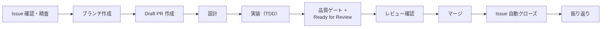
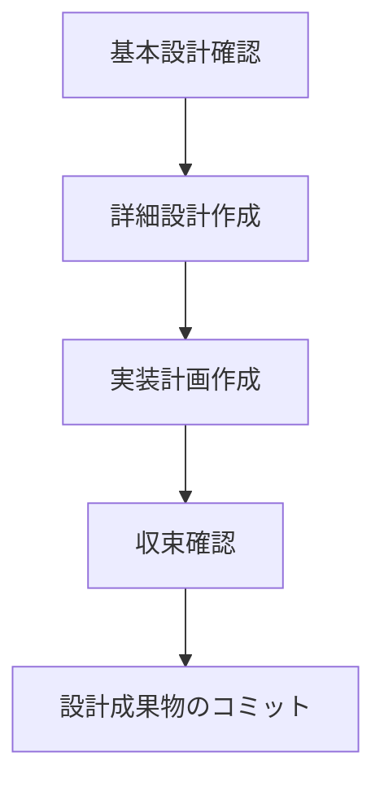
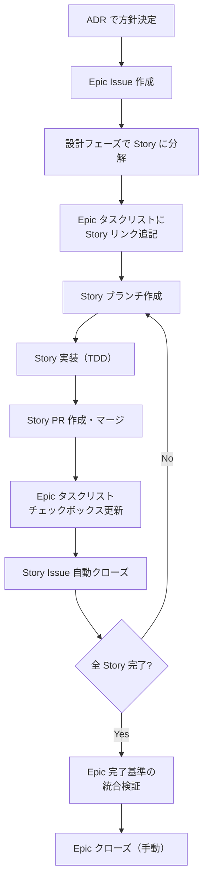

# Issue 駆動開発

> AI ディレクティブ版: [`.claude/rules/dev-flow-issue.md`](../../../.claude/rules/dev-flow-issue.md)。本ファイルは教育・参照用。

## 概要

このプロジェクトでは GitHub Projects + Issue 駆動で開発を進める。
タスクを Issue として管理し、PR と紐づけることで変更の追跡性を確保する。

前提: Issue は仮説であり、精査・検討対象である。Issue に書かれた内容を無批判に「正」として受け入れず、着手前に前提・スコープ・完了基準の妥当性を検証する。

採用理由: [ADR-012: Issue 駆動開発の採用](../../05_ADR/012_Issue駆動開発の採用.md)

## リソース

| リソース | URL |
|---------|-----|
| Project Board | https://github.com/users/ka2kama/projects/1 |
| Milestones | https://github.com/ka2kama/ringiflow/milestones |
| Issues | https://github.com/ka2kama/ringiflow/issues |

## 開発フロー



### AI エージェントの着手トリガー

ユーザーが Issue 番号を指定した場合、着手の指示として扱い、直ちに精査フローに入る。

**禁止:** 着手の意思が明確な場合に「着手してよろしいですか？」等の確認を挟むこと

改善の経緯: [Issue 指定時の不要な着手確認](../../../process/improvements/2026-02/2026-02-19_2030_Issue指定時の不要な着手確認.md)

### 1. Issue を確認または作成

```bash
# Issue 一覧を確認
gh issue list

# 新しい Issue を作成
gh issue create --title "機能名" --body "説明" --milestone "Phase 1: MVP" --label "backend"
```

Issue には以下を含める:
- 概要: 何を実装するか
- 完了基準: 何ができたら完了か（チェックリスト形式）
- 参照: 関連する要件ID、設計書へのリンク

#### 完了基準の書き方

完了基準は **技術的基準** と **E2E 基準** の両方を含める。

- 技術的基準: API エンドポイントの動作、データの保存、等
- E2E 基準: ユーザーが UI から操作を完了できること（フルスタック機能の場合は必須）

E2E 基準がないと、各レイヤーが個別に正しくてもレイヤー間の接続が検証されず、問題の検出が遅れる。

#### 完了基準と操作パス

完了基準は「コンポーネント実装レベル」ではなく「操作パスレベル」で記述する。

| レベル | 視点 | 例 | リスク |
|--------|------|-----|--------|
| コンポーネント実装レベル | 個々のモジュールが動作する | 「バリデーション結果を表示できる」 | 操作パス全体の検証が漏れる |
| 操作パスレベル | ユーザーが操作を完了できる | 「検証ボタンを押して結果を確認できる」 | — |

良い例（操作パスレベル）:

```markdown
## 完了基準

- [ ] 承認者が詳細画面から承認ボタンを押して承認を完了できる
- [ ] 承認者が詳細画面から却下ボタンを押して却下を完了できる
- [ ] 不正な操作時にエラーメッセージが表示される
```

悪い例（コンポーネント実装レベル）:

```markdown
## 完了基準

- [ ] POST /approve で承認できる
- [ ] POST /reject で却下できる
```

操作パスの詳細な列挙手順と分類: [TDD 開発フロー > 操作パスの列挙](./02_TDD開発フロー.md#操作パスの列挙テストリスト作成の前に)

改善の経緯: [E2E 視点の完了基準欠如](../../../process/improvements/2026-01/2026-01-29_1304_E2E視点の完了基準欠如.md)

#### 既存 Issue の精査

→ 手順の詳細: [AI ディレクティブ版](../../../.claude/rules/dev-flow-issue.md#1-issue-精査)

既存の Issue に着手する場合、実装を始める前に Issue 自体を精査する。[問題解決フレームワーク](../../../.claude/rules/problem-solving.md)を Issue に適用する。

精査の観点、As-Is 検証手順、精査結果の分岐、記録フォーマットは AI ディレクティブ版を参照。

改善の経緯:
- [Issue を正として扱う暗黙の前提](../../../process/improvements/2026-02/2026-02-06_1946_Issueを正として扱う暗黙の前提.md)
- [Issue 精査フローに破棄パスが未定義](../../../process/improvements/2026-02/2026-02-11_2036_Issue精査フローに破棄パスが未定義.md)

### 2. ブランチを作成

→ 手順の詳細: [AI ディレクティブ版](../../../.claude/rules/dev-flow-issue.md#2-ブランチ作成)

改善の経緯: [新規作業開始時の main 同期漏れ](../../../process/improvements/2026-02/2026-02-14_2120_新規作業開始時のmain同期漏れ.md)

### 3. Draft PR を作成

→ 手順の詳細: [AI ディレクティブ版](../../../.claude/rules/dev-flow-issue.md#3-draft-pr-作成)

**Draft PR の目的:**
- 作業中であることを可視化
- PR Description に設計メモや検討事項を記録

注意: Draft PR では自動レビューは実行されない。Ready for Review に変更した時点でレビューが走る。

採用理由: [ADR-013: Draft PR 運用の導入](../../05_ADR/013_Draft_PR運用の導入.md)

### 4. 設計

→ 手順の詳細: [AI ディレクティブ版](../../../.claude/rules/dev-flow-issue.md#4-設計)

実装前に必ず設計フェーズを経る。コードを書く前に「何を作るか」「どう作るか」を明確にする。



4.1 基本設計確認、4.2 詳細設計作成、4.3 実装計画作成、4.5 設計成果物コミット、簡略化条件の手順は AI ディレクティブ版を参照。

#### 4.4 収束確認（設計フェーズ）

実装計画を作成したら、設計の収束を確認する。これはこのプロジェクトの核となるプラクティスであり、省略してはならない。

収束確認の詳細手順: [俯瞰・実装リズム](../../../.claude/rules/zoom-rhythm.md)

**フォーマット例:**

```markdown
## 収束確認（設計・計画）

| # | 観点 | 判定 | 確認内容 |
|---|------|------|---------|
| 1 | 網羅性 | OK | 探索結果と Phase 構成を突合、差分なし |
| 2 | 曖昧さ排除 | OK | 曖昧表現なし、変更ファイルを明示 |
| 3 | 設計判断の完結性 | OK | 全ての選択肢に判断理由を記載 |
| 4 | スコープ境界 | OK | 対象・対象外を Issue に明記 |
| 5 | 技術的前提 | OK | 制約事項を確認済み |
| 6 | 既存ドキュメント整合 | OK | 関連 ADR・設計書と照合 |
```

設計と実装を分けてコミットすることで:
- 設計レビューを先に受けられる
- 実装中に設計変更があった場合、差分が明確になる

改善の経緯: [設計フェーズにおける理想駆動の省略](../../../process/improvements/2026-02/2026-02-05_2335_設計フェーズにおける理想駆動の省略.md)

### 5. 実装（TDD）

→ 手順の詳細: [AI ディレクティブ版](../../../.claude/rules/dev-flow-issue.md#5-実装tdd)

TDD（テスト駆動開発）で実装を進める。詳細は [TDD 開発フロー](./02_TDD開発フロー.md) を参照。

コミット粒度、Issue 進捗更新の手順は AI ディレクティブ版を参照。

**良いコミット:**
- 小さく、1つの目的に集中
- テストが通る状態でコミット（壊れた状態を残さない）
- 後から履歴を追いやすい

**避けるべきコミット:**
- 「WIP」のまま長時間放置
- 複数の無関係な変更を1つにまとめる
- テストが落ちる状態でコミット

自動付与: lefthook がブランチ名（`feature/34-xxx`）から Issue 番号を抽出して自動で先頭に追加する。手動で書く必要はない。

**なぜ都度更新が重要か:**
- 進捗が可視化され、チームメンバーや将来の自分が状況を把握できる
- 完了した作業と残りの作業が明確になる
- Project Board の進捗と Issue の詳細が一致する

### 6. 品質ゲートと Ready for Review

→ 手順の詳細: [AI ディレクティブ版](../../../.claude/rules/dev-flow-issue.md#6-品質ゲート)

実装が完了したら、品質ゲート（6.1-6.4）を通過してから Draft PR を Ready for Review に変更する（6.5-6.8）。

- 品質ゲート: 品質チェックリスト + 品質確認 + 収束確認。品質を担保するプロセス
- Ready for Review: `gh pr ready` で Draft を解除する操作

品質チェックリスト (6.2)、品質確認の PR 本文記載 (6.3)、計画ファイル確認 (6.4)、base branch 同期 (6.5)、プッシュ〜Ready (6.6-6.8)、Draft 再 Ready (6.9) の全手順は AI ディレクティブ版を参照。

#### 6.2 品質チェックリスト

→ 位置づけ: [品質を守る二つの砦](../../../.claude/rules/zoom-rhythm.md#品質を守る二つの砦)（最後の砦 = 品質ゲート）
→ 各フェーズの理想状態（To-Be）: [俯瞰・実装リズム > 収束確認のチェックリスト](../../../.claude/rules/zoom-rhythm.md#収束確認のチェックリスト)
→ ISO 25010 品質特性との対応: [KB: ISO 25010 > 品質チェックリストとのマッピング](../../06_ナレッジベース/methodology/ISO25010.md#品質チェックリストとのマッピング)

改善の経緯: [実装フェーズにおける収束確認の自動実行欠如](../../../process/improvements/2026-02/2026-02-06_0010_実装フェーズにおける自己検証の自動実行欠如.md)

改善の経緯: [plan モード後のコンテキスト喪失による計画ファイルのコミット漏れ](../../../process/improvements/2026-02/2026-02-16_2301_planモード後のコンテキスト喪失による計画ファイルのコミット漏れ.md)

### 7. レビュー確認

→ 手順の詳細: [AI ディレクティブ版](../../../.claude/rules/dev-flow-issue.md#7-レビュー確認)

レビュー方針: [CLAUDE.md の PRレビュー](../../../CLAUDE.md#prレビュー)

### 8. マージ

→ 手順の詳細: [AI ディレクティブ版](../../../.claude/rules/dev-flow-issue.md#8-マージ)

**Squash マージの効果:**
- PR 内の全コミットが 1 つのコミットに統合される
- コミットメッセージ: PR タイトル + PR 本文（概要, 確認項目等）
- `git log` で変更の背景を追跡できる

→ 設定詳細: [GitHub 設定 > Pull Requests](../02_プロジェクト構築/03_GitHub設定.md#13-pull-requests)

注意: `--auto` は使用しない。レビュー結果を確認してからマージすること。リモートブランチは GitHub の auto-delete 設定で自動削除される。

### 9. 振り返り

→ 手順の詳細: [AI ディレクティブ版](../../../.claude/rules/dev-flow-issue.md#9-振り返り)

Issue クローズ後、振り返りコメントを残す。学習は「記録」ではなく「振り返り」から生まれる。

採用理由: [ADR-025: 情報管理とローカル知識集約の方針](../../05_ADR/025_情報管理とローカル知識集約の方針.md)

振り返りコメントのフォーマット、学びの転記基準、改善記録の検証、TODO/FIXME 棚卸しの手順は AI ディレクティブ版を参照。

振り返りの具体例（ログイン機能の場合）:
- 予想と違ったこと: セッション Cookie の設定で SameSite 属性の考慮が必要だった
- 学んだこと: Cookie のセキュリティ属性（Secure, HttpOnly, SameSite）の組み合わせ
- 次に活かすこと: 認証関連の実装時は Cookie 属性を設計段階で検討する

改善の経緯: [改善記録の効果追跡が機能していない](../../../process/improvements/2026-02/2026-02-10_0337_改善記録の効果追跡が機能していない.md)

<!-- 改善: process/improvements/2026-02/2026-02-24_1500_TODO-FIXMEのライフサイクル管理不在.md -->

→ アノテーション規約: [code-annotations.md > ライフサイクル](../../../.claude/rules/code-annotations.md#ライフサイクル)

#### 振り返りのスキップ

以下の場合は振り返りを簡略化または省略できる:

- typo 修正や軽微なドキュメント修正
- 既存パターンの単純な踏襲（新しい学びがない）
- 数行の修正で完結するバグ修正

注意: 振り返りコメントをスキップする場合でも、改善記録の検証は省略しない。改善記録の検証は Issue に紐づくアクションであり、実装の種類に依存しない。

## Milestone

Phase ごとに Milestone を作成している。Issue 作成時に適切な Milestone を設定する。

| Milestone | 状態 |
|-----------|------|
| Phase 0: 基盤構築 | 完了 |
| Phase 1: MVP | 進行中 |
| Phase 2: 機能拡張 | 未着手 |
| Phase 3: エンタープライズ機能 | 未着手 |
| Phase 4: 高度な機能・最適化 | 未着手 |

```bash
# Milestone の進捗を確認
gh api repos/ka2kama/ringiflow/milestones --jq '.[] | "\(.title): \(.open_issues) open, \(.closed_issues) closed"'
```

## Label

### Issue タイプ

| Label | 用途 | 色 |
|-------|------|-----|
| `type:epic` | 複数の Story をまとめる大きな機能 | 紫 |
| `type:story` | ユーザー価値の単位（1〜数日で完了） | 青 |

### カテゴリ

| Label | 用途 | 色 |
|-------|------|-----|
| `backend` | Rust / API 関連 | 青 |
| `frontend` | Elm / UI 関連 | 緑 |
| `infra` | Docker / Terraform / AWS | 紫 |
| `docs` | ドキュメント | 水色 |

### 優先度

| Label | 用途 | 色 |
|-------|------|-----|
| `priority:high` | 優先度: 高 | 赤 |
| `priority:medium` | 優先度: 中 | 黄 |
| `priority:low` | 優先度: 低 | 緑 |

## Project Board

Project Board はカンバン形式でタスクを可視化する。

| カラム | 意味 |
|--------|------|
| No Status | 未分類 |
| Todo | 着手前 |
| In Progress | 作業中 |
| Done | 完了 |

Issue を作成すると自動的に Project に追加される（`--project "RingiFlow"` オプション使用時）。

## Epic / Story 運用

アジャイルの Issue 階層を取り入れ、大きな機能を段階的に管理する。

→ 意思決定: [ADR-046 Story-per-PR ブランチ戦略](../../05_ADR/046_Story-per-PRブランチ戦略.md)
→ 手順の詳細: [AI ディレクティブ版](../../../.claude/rules/dev-flow-issue.md#epicstory-運用)

### 階層構造

```
Epic（大きな機能）
├── Story（ユーザー価値の単位）
│   └── Task（チェックリストで管理）
└── Story
    └── Task
```

| 概念 | 説明 | GitHub での実現 |
|------|------|----------------|
| Epic | 複数スプリントにまたがる大きな機能 | Issue + `type:epic` + Sub-issues |
| Story | ユーザー視点の価値単位（1〜数日） | Issue + `type:story` |
| Task | 技術的な作業単位 | Issue 内のチェックリスト |

### Epic の作成タイミング

以下の場合に Epic を作成する:

- ADR で方針決定した大きな機能
- 複数の Story に分解される機能
- 数週間以上かかる見込みの機能

```bash
# Epic の作成例
gh issue create \
  --title "Auth Service を分離する" \
  --label "type:epic" \
  --milestone "Phase 2: 機能拡張" \
  --project "RingiFlow"
```

### Story への分解

Epic の設計フェーズで Story に分解する。分解のタイミング:

- Epic 着手時に全体像が見えている場合 → 最初に分解
- 段階的に明確になる場合 → 進行に応じて追加

Story 分解の品質基準、テスト責任マッピングの手順は AI ディレクティブ版を参照。

Story が独立してマージできないなら、Story の分解が不十分である。
Epic の完了基準に紐づく操作パス（正常系・準正常系・異常系）が、いずれの Story にもテスト責任として割り当てられていないなら、テスト責任の断絶がある。

改善の経緯: [子 Issue 分割実装時の操作パス検証欠落](../../../process/improvements/2026-02/2026-02-21_1700_子Issue分割実装時の操作パス検証欠落.md)

### 運用フロー（Story-per-PR）

各 Story を個別の PR で main にマージする。Epic 単位の PR は作成しない。



統合検証、ブランチ命名、PR 紐付けの詳細は AI ディレクティブ版を参照。

Epic タスクリスト管理（`just sync-epic`）の詳細は AI ディレクティブ版を参照。

改善の経緯:
- [Epic の Story 進捗が未記録](../../../process/improvements/2026-02/2026-02-14_2230_EpicのStory進捗が未記録.md)
- Epic #747 Story 3 で `just sync-epic` を導入し、手動更新を自動化

### 進捗の可視化

- Epic の進捗は Sub-issues progress フィールドで自動追跡される
- Project Board の Board ビューで Story の状態を確認
- Milestone で Phase 全体の進捗を確認

## Issue の粒度

- 大きすぎる Issue は分割する（目安: 1日〜数日で完了できる単位）
- 小さなタスクは Issue 内のチェックリストで管理する
- Epic は例外的に大きくて良い（Sub-issues で分解するため）

良い例:
```markdown
## 完了基準

- [ ] POST /auth/login でログインできる
- [ ] POST /auth/logout でログアウトできる
- [ ] GET /auth/me で現在のユーザー情報を取得できる
- [ ] フロントエンドでログイン画面が動作する
```

## 運用補足

### Assignee

個人開発かつ AI エージェント運用のため、Issue / PR に assignee は設定しない。
作業状態は Project Board の Status と Draft PR で管理する。

### Project 紐づけ

Issue のみ Project に紐づけ、PR は紐づけない。
Issue 駆動開発では Issue が作業単位であり、PR は `Closes #xx` で Issue に紐づくため、Board は Issue のみで管理する。

## よく使うコマンド

```bash
# Issue 一覧
gh issue list

# Issue 詳細
gh issue view 34

# Issue を作成して Project に追加
gh issue create --title "タイトル" --milestone "Phase 1: MVP" --label "backend" --project "RingiFlow"

# PR 一覧
gh pr list

# PR の状態確認
gh pr checks

# Milestone 一覧
gh api repos/ka2kama/ringiflow/milestones
```

