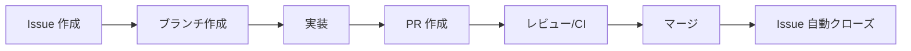

# Issue 駆動開発

## 概要

このプロジェクトでは GitHub Projects + Issue 駆動で開発を進める。
タスクを Issue として管理し、PR と紐づけることで変更の追跡性を確保する。

採用理由: [ADR-012: Issue 駆動開発の採用](../../04_ADR/012_Issue駆動開発の採用.md)

## リソース

| リソース | URL |
|---------|-----|
| Project Board | https://github.com/users/ka2kama/projects/1 |
| Milestones | https://github.com/ka2kama/ringiflow/milestones |
| Issues | https://github.com/ka2kama/ringiflow/issues |

## 開発フロー



### 1. Issue を確認または作成

```bash
# Issue 一覧を確認
gh issue list

# 新しい Issue を作成
gh issue create --title "機能名" --body "説明" --milestone "Phase 1: MVP" --label "backend"
```

Issue には以下を含める:
- 概要: 何を実装するか
- 完了基準: 何ができたら完了か（チェックリスト形式）
- 参照: 関連する要件ID、設計書へのリンク

### 2. ブランチを作成

```bash
# Issue 番号に基づいてブランチを作成
git checkout -b feature/34-user-auth
```

命名規則:
- `feature/{issue番号}-{機能名}` — 新機能
- `fix/{issue番号}-{バグ名}` — バグ修正

### 3. 実装

通常通り実装を進める。コミットメッセージに Issue 番号を含めると GitHub 上でリンクされる。

```bash
git commit -m "ログイン機能を実装 #34"
```

### 4. PR を作成

```bash
gh pr create --title "ログイン機能を実装" --body "Closes #34"
```

`Closes #34` を含めると、PR マージ時に Issue が自動的にクローズされる。

キーワード:
- `Closes #N` — Issue をクローズ
- `Fixes #N` — Issue をクローズ（バグ修正向け）
- `Relates to #N` — 関連付けのみ（クローズしない）

### 5. マージ

```bash
gh pr merge --squash --delete-branch --auto
```

## Milestone

Phase ごとに Milestone を作成している。Issue 作成時に適切な Milestone を設定する。

| Milestone | 状態 |
|-----------|------|
| Phase 0: 基盤構築 | 完了 |
| Phase 1: MVP | 進行中 |
| Phase 2: 機能拡張 | 未着手 |
| Phase 3: エンタープライズ機能 | 未着手 |
| Phase 4: 高度な機能・最適化 | 未着手 |

```bash
# Milestone の進捗を確認
gh api repos/ka2kama/ringiflow/milestones --jq '.[] | "\(.title): \(.open_issues) open, \(.closed_issues) closed"'
```

## Label

| Label | 用途 | 色 |
|-------|------|-----|
| `backend` | Rust / API 関連 | 青 |
| `frontend` | Elm / UI 関連 | 緑 |
| `infra` | Docker / Terraform / AWS | 紫 |
| `docs` | ドキュメント | 水色 |
| `priority:high` | 優先度: 高 | 赤 |
| `priority:medium` | 優先度: 中 | 黄 |
| `priority:low` | 優先度: 低 | 緑 |

## Project Board

Project Board はカンバン形式でタスクを可視化する。

| カラム | 意味 |
|--------|------|
| No Status | 未分類 |
| Todo | 着手前 |
| In Progress | 作業中 |
| Done | 完了 |

Issue を作成すると自動的に Project に追加される（`--project "RingiFlow"` オプション使用時）。

## Issue の粒度

- 大きすぎる Issue は分割する（目安: 1日〜数日で完了できる単位）
- 小さなタスクは Issue 内のチェックリストで管理する

良い例:
```markdown
## 完了基準

- [ ] POST /auth/login でログインできる
- [ ] POST /auth/logout でログアウトできる
- [ ] GET /auth/me で現在のユーザー情報を取得できる
- [ ] フロントエンドでログイン画面が動作する
```

## よく使うコマンド

```bash
# Issue 一覧
gh issue list

# Issue 詳細
gh issue view 34

# Issue を作成して Project に追加
gh issue create --title "タイトル" --milestone "Phase 1: MVP" --label "backend" --project "RingiFlow"

# PR 一覧
gh pr list

# PR の状態確認
gh pr checks

# Milestone 一覧
gh api repos/ka2kama/ringiflow/milestones
```

---

## 変更履歴

| 日付 | 変更内容 |
|------|---------|
| 2026-01-16 | 初版作成 |
