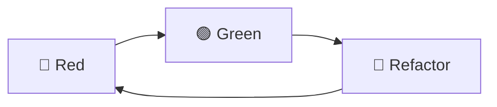
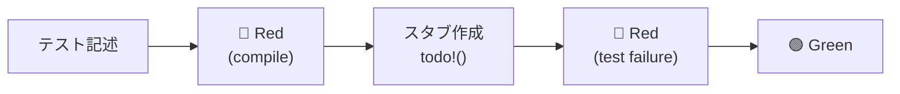
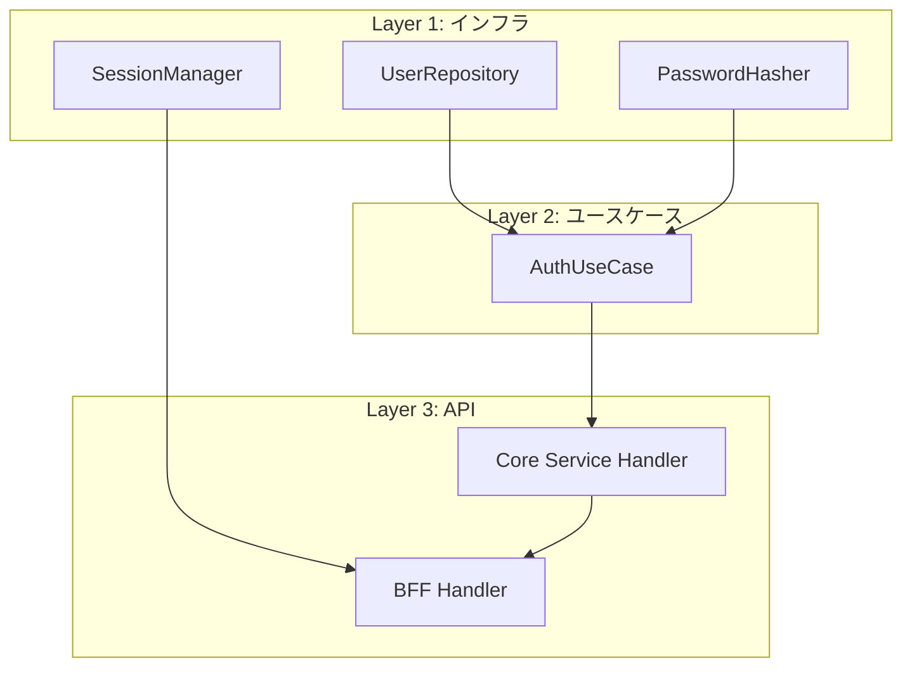
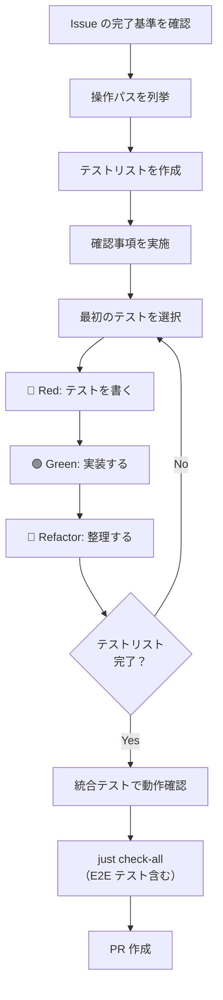

# TDD 開発フロー

## 概要

このプロジェクトでは TDD（テスト駆動開発）を採用し、テストファーストで実装を進める。
t_wada（和田卓人）の TDD 手法を基本とし、アジャイル的に MVP を積み上げる。

### 採用理由

| 観点 | TDD のメリット |
|------|---------------|
| 品質 | バグの早期発見、リグレッション防止 |
| 設計 | テストしやすい設計 = 良い設計 |
| 学習 | 小さなステップで着実に理解を深められる |
| 安心 | 動くコードを常に維持、大胆なリファクタリングが可能 |

---

## TDD サイクル



### 確認事項の実施

**目的:** 推測ではなく事実に基づいてコードを書く

→ 哲学と原則: [実装前の確認](../../../.claude/rules/pre-implementation.md)

各 Phase のテストを書き始める前に、計画ファイルの確認事項を Read/Grep で実施する:

1. 型: Read ツールで型定義を確認する
2. パターン: Read ツールで参照ファイルを確認する
3. ライブラリ: Grep で既存使用を確認する。初めて使う API は docs.rs / package.elm-lang.org で確認する

確認事項はゲート条件（前提条件）として機能する。確認を実施してから実装に入る。計画ファイルへの状態更新は不要（確認の証跡は Read/Grep ツールの実行そのもの）。

確認の結果、設計判断の変更が生じた場合はセッションログの判断ログにも記録する。

実装中に計画外の API が必要になった場合は、その場で同じ手順を実施する。

注意: これは Phase 開始時に1回実施する。TDD サイクルの各イテレーションで繰り返す必要はない。

---

### 🔴 Red: 失敗するテストを書く

**目的:** 実装すべき振る舞いを明確にする

1. テストを1つだけ書く（→ Red: compile）
2. コンパイルエラーを解消する（→ Green: compile / Red: test failure）
3. テストを実行して **失敗することを確認** する

```rust
#[tokio::test]
async fn test_find_user_by_email_returns_user_when_exists() {
    // Arrange
    let repo = setup_test_repository().await;

    // Act
    let result = repo.find_by_email(&tenant_id, &email).await;

    // Assert
    assert!(result.is_ok());
    assert!(result.unwrap().is_some());
}
```

#### 二層の Red モデル

静的型付き言語（Rust / Elm）では、テストからのフィードバックが 2 層になる:

| レベル | フィードバック源 | 教えてくれること | 書くもの | 書かないもの |
|--------|----------------|----------------|---------|------------|
| Red (compile) | コンパイラ | 何を定義すべきか | 型定義、関数シグネチャ、`todo!()` / `Debug.todo` | ロジック、分岐、計算 |
| Red (test failure) | テストランナー | 何を実装すべきか | — （失敗を確認するだけ） | — |



メンタルモデル: コンパイラは「最初のテストランナー」。コンパイラのエラーメッセージが「何を定義すべきか」を教え、テストランナーが「何を実装すべきか」を教える。この 2 つのフィードバックを混同しないことが重要。

Robert C. Martin はこれを nano-cycle（Red 内の小サイクル）と呼ぶ。テストを書く → コンパイルエラーを解消する → テスト失敗を確認する、という一連の流れが Red フェーズ内部のサイクルを成す。

#### コンパイルエラー解消の原則

コンパイルエラーの解消では、コンパイラが要求する最小限の定義だけを記述する:

| 書くもの | 書かないもの |
|---------|------------|
| 構造体、enum の型定義 | フィールドの値を計算するロジック |
| 関数シグネチャ（引数と戻り値の型） | 関数の本体ロジック |
| `todo!()`（Rust）/ `Debug.todo`（Elm） | 条件分岐、ループ、ビジネスルール |
| トレイト実装の骨格 | トレイトメソッドの具体的な処理 |

Rust の例:

```rust
// コンパイルエラー解消で書くもの: 型定義 + todo!()
pub struct UserRepository {
    pool: PgPool,
}

impl UserRepository {
    pub async fn find_by_email(
        &self,
        tenant_id: &TenantId,
        email: &Email,
    ) -> Result<Option<User>> {
        todo!() // ロジックは Green フェーズで書く
    }
}
```

Elm の例:

```elm
-- コンパイルエラー解消で書くもの: 型定義 + Debug.todo
findByEmail : TenantId -> Email -> Cmd Msg
findByEmail tenantId email =
    Debug.todo "findByEmail" -- ロジックは Green フェーズで書く
```

プロジェクト内の実例: テストスタブで `todo!()` を使用するパターン → `core-service/src/handler/auth/tests.rs`

重要: 失敗を確認せずに実装に進まない。失敗を見ることで：
- テストが正しく書けていることを確認できる
- 実装前後の差分が明確になる

### 🟢 Green: 最短で通す

**目的:** テストを通す最小限のコードを書く

1. **仮実装（Fake It）:** 定数を返すなど、最も単純な実装
2. **明白な実装（Obvious Implementation）:** 答えが明らかなら直接実装
3. コードの美しさは後回し

```rust
// 仮実装の例（まずこれでテストを通す）
pub async fn find_by_email(&self, tenant_id: &TenantId, email: &Email) -> Result<Option<User>> {
    Ok(Some(User::new(/* テストデータと同じ値 */)))
}
```

重要: この段階では「動く」ことだけに集中。重複や汚いコードは許容する。

### 🔵 Refactor: 設計を改善する

**目的:** 動作を変えずに設計品質を高める

#### コードの整理

プロダクションコード:
1. 重複を除去
2. 命名を改善
3. 構造を整理

テストコード:
1. テストの意図が名前から読み取れるか確認
2. 三角測量で追加したテストの中に、一般化後は冗長になったものがないか確認
3. Arrange / Act / Assert の構造が明確か確認

**テストが通り続けることを確認しながら** 進める。

```rust
// リファクタリング後（実際のDB問い合わせ）
pub async fn find_by_email(&self, tenant_id: &TenantId, email: &Email) -> Result<Option<User>> {
    let row = sqlx::query_as!(
        UserRow,
        "SELECT * FROM users WHERE tenant_id = $1 AND email = $2",
        tenant_id.as_uuid(),
        email.as_str()
    )
    .fetch_optional(&self.pool)
    .await?;

    Ok(row.map(User::from))
}
```

#### 設計原則レンズ

コードの整理に加えて、設計原則の観点から改善機会を探す。

→ 位置づけ: [俯瞰・実装リズム > 実装中の俯瞰](../../../.claude/rules/zoom-rhythm.md#実装中の俯瞰-設計原則レンズ)

毎 Refactor（書いた直後が最も気づきやすい）:

| レンズ | 問い |
|--------|------|
| 意図の明確さ | このコードの意図は読み手に伝わるか？ |
| 重複の排除 | 同じ知識が複数箇所に存在していないか？新しく書いたコードの主要パターン（関数シグネチャ、match ブロック、変換コード等）を Grep で既存コードと照合する |
| 要素の最小性 | 不要な中間変数、引数、構造体フィールドはないか？ |

モジュール/関数の完成時（単位が見えてから評価できる）:

| レンズ | 問い |
|--------|------|
| 単一責務（SRP） | この関数/モジュールに変更理由は1つだけか？ |
| 依存方向（DIP） | 依存の方向は正しいか？詳細が抽象に依存しているか？ |
| 型の活用 | 型で防げる不正状態を String や整数で済ませていないか？（[ADR-016](../../../docs/05_ADR/016_プリミティブ型のNewtype化方針.md)） 状態によって有効なフィールドが異なるのにフラットな型にしていないか？（[ADR-054](../../../docs/05_ADR/054_型安全ステートマシンパターンの標準化.md)） |

発見があった場合のみ、セッションログの判断ログに記録する。発見がなければ記録不要。

これらの観点は [品質チェックリスト](01_Issue駆動開発.md#62-品質チェックリスト) の「品質向上の最終確認（ゼロ→プラス）」と同一の設計原則。Refactor で作り込み、品質チェックリストで最終確認する。

既知手法との対応: 「毎 Refactor」は Kent Beck の Simple Design rules、「モジュール完成時」は SOLID 原則の SRP・DIP に対応。

#### UI/UX レンズ（フロントエンド変更時）

フロントエンド（Elm ビュー関数、Tailwind クラス）を変更する場合、コード設計レンズに加えて以下を適用する。

→ 参照: デザインガイドライン — [`docs/03_詳細設計書/13_デザインガイドライン.md`](../../03_詳細設計書/13_デザインガイドライン.md)
→ 参照: デザイントークン定義 — [`frontend/src/styles.css`](../../../frontend/src/styles.css)

毎 Refactor:

| レンズ | 問い |
|--------|------|
| デザイントークン準拠 | [デザインガイドライン](../../03_詳細設計書/13_デザインガイドライン.md)に準拠しているか？生の色値・未定義シェードはないか？ |
| 共有コンポーネント活用 | 既存の共有コンポーネント（Button, Badge, FormField, ErrorState, EmptyState 等）で実現できないか？ |
| 状態の網羅性 | RemoteData の全状態（NotAsked/Loading/Failure/Success）と空データにフィードバックがあるか？ |

ページ/コンポーネントの完成時:

| レンズ | 問い |
|--------|------|
| アクセシビリティ | セマンティック HTML、ARIA 属性、キーボード操作（focus-visible）、フォームの label 関連付けが適切か？ |
| エラーのユーザビリティ | エラー表示がユーザーの言語で表現され、回復手段（再読み込み等）を提供しているか？ |
| 視覚的階層 | [デザインガイドライン](../../03_詳細設計書/13_デザインガイドライン.md)のタイポグラフィ階層に沿い、関連要素が近接でグルーピングされているか？ |
| 破壊的操作の防御 | 削除・却下等の破壊的操作に ConfirmDialog があり、ボタン色が操作の意味と一致しているか？ |

デザイン品質向上（ページ/コンポーネントの完成時）:

| レンズ | 問い |
|--------|------|
| コントラストの効果 | 重要な要素（CTA、見出し、状態バッジ）が周囲と明確に差別化され、ユーザーの視線を適切に誘導しているか？ |
| 整列の一貫性 | 要素がスペーシンググリッド（4px 基準）に沿って整列し、視覚的な秩序を保っているか？ |
| 余白の活用 | 余白が情報のグルーピングと呼吸感を適切に生み出し、窮屈さや散漫さがないか？ |

コード設計レンズとの対応:

| コード設計レンズ | 対応する UI/UX レンズ |
|----------------|---------------------|
| 意図の明確さ | 視覚的階層 |
| 重複の排除 | 共有コンポーネント活用 |
| 要素の最小性 | （H8 ミニマルデザインとして視覚的階層に包含） |
| 型の活用 | 状態の網羅性（RemoteData + Button.Variant） |

既知手法との対応: UI/UX レンズの守りは Nielsen の 10 Usability Heuristics（H1: 状態の網羅性、H4: デザイントークン準拠、H5/H3: 破壊的操作の防御、H8: 視覚的階層、H9: エラーのユーザビリティ）と WCAG 2.1 POUR 原則（アクセシビリティ）に対応。攻めは CRAP 原則（Robin Williams, 2004）の Contrast・Alignment・Proximity に対応（Repetition は守りレンズの「デザイントークン準拠」「共有コンポーネント活用」でカバー）。CRAP はデザイン実践の手法（How）、ゲシュタルト原則が理論的裏付け（Why）を提供する。

---

## テストリスト

実装前にテストリスト（TODO リスト）を作成する。

テストリストには二つの役割がある:

| 段階 | 役割 | 性質 |
|------|------|------|
| TDD サイクル中 | 実装の道標 | 思いついた順に追加してよい。仮実装や三角測量のためのテストも含む |
| Phase 完了時 | 仕様の文書化 | 正常系・異常系・境界値が体系的に整理され、各テストが独立した仕様を表現している |

TDD サイクル中はリストを自由に使い、Phase 完了時に品質保証の観点で整理する（後述の「テストレビュー」を参照）。

### 操作パスの列挙（テストリスト作成の前に）

テストリストを作成する前に、ユーザーの操作パスを列挙する。テスト設計は「実装の構造」（モジュール、関数、レイヤー）ではなく「ユーザーの操作パス」から出発する。

#### 適用条件

| Issue の種類 | 適用 | 理由 |
|-------------|------|------|
| フルスタック機能（UI + API + DB） | 必須 | ユーザー操作パスが存在する |
| API のみ（UI なし） | 必須 | API クライアントの操作パスが存在する |
| ドメインロジックのみ | 推奨 | 呼び出し元の操作コンテキストを意識することで設計が改善される |
| ドキュメント・インフラ | 不要 | 操作パスが存在しない |

#### 手順

1. Issue の完了基準を確認する
2. 完了基準から、ユーザーが行う操作の正常系パス（Main Success Scenario）を列挙する
3. 各正常系パスの分岐点を特定し、準正常系・異常系パスを導出する
4. 各操作パスをテスト層に対応づける

#### 操作パスの分類

| 分類 | 内容 | 例 |
|------|------|-----|
| 正常系 | 期待通りの成功パス | ログインに成功する |
| 準正常系 | 設計されたエラー処理（ユーザー起因） | パスワードが間違っている、入力が不正 |
| 異常系 | 想定外の障害（システム起因） | API タイムアウト、DB 接続エラー |

注: 日本の IT 現場での慣用分類。ISTQB では positive testing / negative testing の 2 分類。

#### 計画ファイル用フォーマット

```markdown
#### 操作パス

| # | 操作パス | 分類 | テスト層 |
|---|---------|------|---------|
| 1 | ログインに成功する | 正常系 | E2E |
| 2 | パスワードが間違っている場合、エラーメッセージが表示される | 準正常系 | E2E |
| 3 | 存在しないユーザーでログインしようとするとエラーが表示される | 準正常系 | API |
| 4 | API がタイムアウトした場合、エラーが表示される | 異常系 | E2E |
```

操作パスが不要な Phase は「操作パス: 該当なし（ドメインロジックのみ）」と明示する。

#### 操作パスからテスト層への変換

操作パスはトップダウンで設計し、テスト層はテストピラミッドに基づいてボトムアップで配置する。

| 操作パスの性質 | 主なテスト層 | 補足 |
|--------------|------------|------|
| UI からの操作完結性 | E2E | ユーザー操作の端から端まで |
| API エンドポイントの入出力 | API テスト / ハンドラテスト | HTTP レベルの検証 |
| ドメインルールの検証 | ユニットテスト | ビジネスロジックの正確性 |
| エラーハンドリング（UI 表示） | E2E | ユーザーへのフィードバック |
| エラーハンドリング（API レスポンス） | API テスト / ハンドラテスト | ステータスコード・エラーボディ |
| エラーハンドリング（ロジック） | ユニットテスト | エラー型・分岐の正確性 |

1 つの操作パスが複数のテスト層にまたがることがある。上位層（E2E）で操作パスの完結性を保証し、下位層（ユニット）で個々のロジックの正確性を保証する。

### テスト設計の方向性

テスト設計はトップダウン（操作パス → テストリスト）で行い、テスト実装はボトムアップ（ユニット → API → E2E）で行う。

```
設計（トップダウン）:  操作パス → テスト層の配置 → テストリスト
実装（ボトムアップ）:  ユニットテスト → ハンドラテスト → API テスト → E2E テスト
```

設計と実装の方向が逆であることを意識する。設計時にボトムアップで考えると、個々のモジュールのテストに集中しやすく、操作パス全体の検証が漏れる。

### 作成のコツ

1. **操作パスから逆算:** 操作パスの各ステップをテストケースに分解
2. **正常系 → 準正常系 → 異常系:** まず成功パス、次に設計されたエラー処理、最後に想定外の障害
3. **境界値:** エッジケースを忘れずに
4. **テスト層の配置:** 操作パスの性質に応じて適切なテスト層に配置

### テスト層の明記

テストリストには、テストピラミッドの各層を明記する。テスト層の選択は設計判断であり、計画ファイル作成時（設計段階）で検討する。

→ 計画ファイルの必須要素: [zoom-rhythm.md > テストリスト](../../../.claude/rules/zoom-rhythm.md#テストリスト各-phase)

各テスト層の役割:

| テスト層 | 検証対象 | 速度 | 該当条件 |
|---------|---------|------|---------|
| ユニットテスト | ドメインロジック、ユースケース | 高速 | 常に |
| ハンドラテスト | HTTP ハンドラの入出力、認可 | 高速 | HTTP ハンドラがある場合 |
| API テスト（Hurl） | 実 DB を含むエンドポイント結合 | 中速 | 公開 API エンドポイントがある場合 |
| E2E テスト（Playwright） | ユーザー操作の完結性 | 低速 | UI 操作を伴う場合 |

該当しない層は「該当なし」と明記し、暗黙の省略を防ぐ。

### 例: ログイン機能

```markdown
## 操作パス

| # | 操作パス | 分類 | テスト層 |
|---|---------|------|---------|
| 1 | ログイン画面からログイン操作を完了できる | 正常系 | E2E + API + ユニット |
| 2 | 不正なパスワードでエラーメッセージが表示される | 準正常系 | E2E + API + ユニット |
| 3 | 存在しないユーザーでエラーメッセージが表示される | 準正常系 | API + ユニット |
| 4 | 非アクティブユーザーでログインが拒否される | 準正常系 | ユニット |

## テストリスト

### Phase 1: UserRepository / PasswordHasher

操作パス: 該当なし（ドメインロジックのみ）

ユニットテスト:
- [ ] メールアドレスでユーザーを取得できる（操作パス #1 の下位層）
- [ ] 存在しないメールアドレスの場合 None を返す（操作パス #3 の下位層）
- [ ] 別テナントのユーザーは取得できない
- [ ] パスワードを検証できる（正しいパスワード）（操作パス #1 の下位層）
- [ ] 不正なパスワードは検証失敗（操作パス #2 の下位層）

ハンドラテスト（該当なし）
API テスト（該当なし）
E2E テスト（該当なし）

### Phase 2: AuthUseCase

操作パス: 該当なし（ドメインロジックのみ）

ユニットテスト:
- [ ] 正しい認証情報でログインできる（操作パス #1 の下位層）
- [ ] 不正なパスワードでログイン失敗（操作パス #2 の下位層）
- [ ] 存在しないユーザーでログイン失敗（操作パス #3 の下位層）
- [ ] 非アクティブユーザーはログイン不可（操作パス #4）

ハンドラテスト（該当なし）
API テスト（該当なし）
E2E テスト（該当なし）

### Phase 3: Core Service Handler / BFF Handler

ユニットテスト:
- [ ] SessionManager: セッションを作成できる
- [ ] SessionManager: セッションを取得できる
- [ ] SessionManager: セッションを削除できる
- [ ] SessionManager: 存在しないセッションは None を返す

ハンドラテスト:
- [ ] Core Service: 正しい認証情報で 200 を返す（操作パス #1）
- [ ] Core Service: 不正な認証情報で 401 を返す（操作パス #2, #3）
- [ ] BFF: セッション Cookie を設定する（操作パス #1）
- [ ] BFF: テナント分離が機能する

API テスト:
- [ ] POST /api/v1/auth/login で認証成功（操作パス #1）
- [ ] POST /api/v1/auth/login で認証失敗（操作パス #2）

E2E テスト:
- [ ] ログイン画面からログイン操作を完了できる（操作パス #1）
- [ ] 不正なパスワードでエラーメッセージが表示される（操作パス #2）
```

### 進め方

1. リストの最初の項目を選ぶ
2. Red → Green → Refactor
3. 完了したらチェックを付ける ✅
4. 次の項目へ
5. 新しいテストケースを思いついたらリストに追加

---

## MVP 積み上げ方式

アジャイル的に、動く最小単位から段階的に機能を追加する。

### 原則

| 原則 | 説明 |
|------|------|
| 垂直スライス | 1つの機能を端から端まで動かす |
| 常に動く状態 | 各ステップ完了時点で動作確認できる |
| 依存順に積む | 下位レイヤーから順に実装 |

### 依存関係を考慮した順序



**実装順序:**
1. UserRepository（DB からユーザー取得）
2. PasswordHasher（パスワード検証）
3. AuthUseCase（認証ロジック）
4. Core Service Handler（内部 API）
5. SessionManager（セッション管理）
6. BFF Handler（公開 API）

各ステップで「テスト → 実装 → リファクタリング」を繰り返す。

### テストレビュー（Phase 完了時）

各 Phase の TDD サイクル完了後、テストを品質保証の観点でレビューする。

確認観点:

| 観点 | 確認内容 |
|------|---------|
| 冗長性 | 三角測量や仮実装で追加したテストの中に、本実装後は同じことを検証しているものがないか |
| 網羅性 | 正常系・異常系・境界値が体系的に網羅されているか。TDD では思いついた順に書くため、抜けがないか確認 |
| 明確さ | 各テストが「何の仕様を検証しているか」をテスト名から読み取れるか |
| 構造 | テストの並び順が仕様として読みやすいか（正常系 → 異常系 → 境界値） |

TDD サイクル中の Refactor はテストの局所的な改善。テストレビューは Phase 全体を俯瞰した整理。

---

## 実践的なパターン

### パターン1: 三角測量（Triangulation）

1つのテストだけでは一般化しにくい場合、複数のテストケースを追加して実装を導く。

```rust
// テスト1
#[test]
fn test_verify_password_returns_true_for_correct_password() {
    let hasher = Argon2PasswordHasher::new();
    let hash = hasher.hash("password123").unwrap();
    assert!(hasher.verify("password123", &hash).unwrap());
}

// テスト2（三角測量）
#[test]
fn test_verify_password_returns_false_for_wrong_password() {
    let hasher = Argon2PasswordHasher::new();
    let hash = hasher.hash("password123").unwrap();
    assert!(!hasher.verify("wrongpassword", &hash).unwrap());
}
```

### パターン2: Given-When-Then（AAA）

テストの構造を明確にする。

```rust
#[tokio::test]
async fn test_login_succeeds_with_valid_credentials() {
    // Given（Arrange）: 前提条件
    let repo = MockUserRepository::new();
    let hasher = MockPasswordHasher::new();
    let sut = AuthUseCase::new(repo, hasher);

    // When（Act）: 実行
    let result = sut.authenticate(&email, &password).await;

    // Then（Assert）: 検証
    assert!(result.is_ok());
}
```

### パターン3: テストダブル

依存を差し替えて単体テストを可能にする。

| 種類 | 用途 |
|------|------|
| Stub | 固定値を返す |
| Mock | 呼び出しを検証 |
| Fake | 簡易版の実装（インメモリDBなど） |

```rust
// Fake 実装の例
pub struct InMemoryUserRepository {
    users: HashMap<Email, User>,
}

impl UserRepository for InMemoryUserRepository {
    async fn find_by_email(&self, _tenant_id: &TenantId, email: &Email) -> Result<Option<User>> {
        Ok(self.users.get(email).cloned())
    }
}
```

---

## テスト規約

### テスト対象の命名: `sut`

テスト対象オブジェクトの変数名には `sut`（System Under Test）を使用する。

```rust
// Arrange
let definition_repo = MockWorkflowDefinitionRepository::new();
let instance_repo = MockWorkflowInstanceRepository::new();
let step_repo = MockWorkflowStepRepository::new();

let sut = WorkflowUseCaseImpl::new(definition_repo, instance_repo, step_repo);

// Act
let result = sut.create_workflow(...).await;
```

適用範囲: 全レイヤーのテスト（Usecase、Repository、Handler、Session 等）。

| テスト対象 | `sut` の変数 | 依存関係（`sut` にしない） |
|-----------|-------------|--------------------------|
| Usecase | `let sut = XxxUseCaseImpl::new(...)` | Mock リポジトリ（`step_repo`, `instance_repo` 等） |
| Repository | `let sut = PostgresXxxRepository::new(pool)` | 前提データ用の別リポジトリ（`instance_repo` 等） |
| Handler | `let sut = create_test_app(...)` | スタブクライアント、テストデータ |
| Session | `let sut = RedisSessionManager::new(...)` | テストデータ |

注意: テスト対象のみ `sut` にする。テスト対象の依存関係（Mock リポジトリ等）は意味のある名前を維持する。

出典: Gerard Meszaros『xUnit Test Patterns』（Addison-Wesley, 2007）で体系化された用語。C#/Java 圏で広く浸透している。

---

## ワークフロー全体像



---

## E2E テストの実行タイミング

E2E テスト（Playwright）は TDD の Red-Green-Refactor サイクルには組み込まない。

| 理由 | 説明 |
|------|------|
| 実行速度 | バックエンド + フロントエンドの起動が必要で、ユニットテストと比べ大幅に遅い |
| TDD の本質 | TDD は高速なフィードバックループ。E2E テストの遅さはこのリズムを崩す |
| 責務の分離 | E2E は「ユーザー操作の完結性」を検証する品質ゲートであり、設計を駆動するツールではない |

### 実行タイミング

```
TDD サイクル（高速）→ Phase 完了 → just check-all（E2E 含む）→ PR
```

| タイミング | 実行するテスト |
|-----------|--------------|
| TDD サイクル中 | `cargo test` / `elm-test`（ユニットテスト） |
| Phase 完了時 | `just check-all`（lint + ユニット + API + E2E） |
| UI に影響する変更時 | `just test-e2e` で明示的に確認 |

→ E2E テストの詳細: [Playwright ナレッジベース](../../../docs/06_ナレッジベース/devtools/Playwright.md)
→ E2E テストのルール: [`.claude/rules/e2e-test.md`](../../../.claude/rules/e2e-test.md)

---

## チェックリスト

実装完了時に確認する項目:

- [ ] すべてのテストが通る（`cargo test`）
- [ ] テストカバレッジが妥当（主要パスを網羅）
- [ ] リファクタリングが完了している
- [ ] 統合テストで動作を確認
- [ ] UI 変更がある場合、E2E テストが影響するシナリオを確認
- [ ] `just check-all` が通る（E2E テスト含む）

---

## 参考資料

- 『テスト駆動開発』Kent Beck 著、和田卓人 訳
- t_wada のスライド・講演資料
- [テスト駆動開発についてまとめてみた](https://qiita.com/t_wada/items/e2b3b1a5b9e89a5b7f9c)
- Robert C. Martin (2021) "Clean Craftsmanship" — nano-cycle（Red 内の小サイクル）
- Steve Freeman & Nat Pryce (2009) "Growing Object-Oriented Software, Guided by Tests" — "Write the test you wish you had"
- Robin Williams (2004) "The Non-Designer's Design Book" (CRAP 原則)

### 既知手法との対応

| 概念 | 出典 | 本ドキュメントでの対応 |
|------|------|---------------------|
| nano-cycle（Red 内の小サイクル） | Robert C. Martin, *Clean Craftsmanship* (2021) | 二層の Red モデル |
| Compiler-Driven Development | 静的型付き言語 TDD の一般的な考え方 | コンパイルエラー解消の原則 |
| "Write the test you wish you had" | Freeman & Pryce, *GOOS* (2009) | Red フェーズの「テストを1つだけ書く」 |
| Usability Heuristics | Jakob Nielsen, *10 Usability Heuristics for User Interface Design* (1994, 2024 更新) | UI/UX レンズ（H1, H3, H4, H5, H8, H9） |
| POUR 原則 | W3C, *WCAG 2.1* (2018) | アクセシビリティレンズ（Perceivable + Operable） |
| CRAP 原則 | Robin Williams, *The Non-Designer's Design Book* (2004) | デザイン品質向上レンズ（C: コントラストの効果、A: 整列の一貫性、P: 余白の活用）。R は守りレンズでカバー |

→ 詳細: [独自フレームワークと既知手法の対応](../../06_ナレッジベース/methodology/独自フレームワークと既知手法の対応.md)

---

## 変更履歴

| 日付 | 変更内容 |
|------|---------|
| 2026-02-21 | テストリストセクションに「操作パスの列挙」「テスト設計の方向性」を追加。テスト設計を操作パス起点に再構成（#765） |
| 2026-02-21 | 確認事項の実施をゲート条件方式に変更。チェックボックス更新手順を廃止し、Read/Grep の実行自体を証跡とする（#747） |
| 2026-02-18 | UI/UX レンズにデザイン品質向上（攻め）レンズを追加。CRAP 原則を既知手法に記載（#653） |
| 2026-02-18 | 設計原則レンズに UI/UX レンズ（フロントエンド変更時）を追加。Nielsen's Heuristics・WCAG 2.1 POUR を既知手法に記載（#644） |
| 2026-02-18 | Red フェーズに二層の Red モデル（compile → test failure）、コンパイルエラー解消の原則、既知手法との対応を追加（#637） |
| 2026-02-11 | 確認事項の実施に結果記録（チェックボックス + 1行結果）の手順を追加 |
| 2026-02-11 | E2E テスト（Playwright）の実行タイミングセクションを追加、チェックリストに E2E 項目を追加（#435） |
| 2026-02-09 | 確認事項の実施ステップを追加。推測ではなく事実に基づくコード記述の構造的強制 |
| 2026-02-09 | テスト規約セクションを追加: `sut` 命名規約を全レイヤーに適用（#330） |
| 2026-02-08 | Refactor ステップに設計原則レンズを追加。「きれいにする」→「設計を改善する」に再定義（#291） |
| 2026-02-07 | Refactor ステップにテストのリファクタリングを追加、テストリストの二面性を明記、Phase 完了時のテストレビューを追加（#279） |
| 2026-01-17 | 初版作成 |
