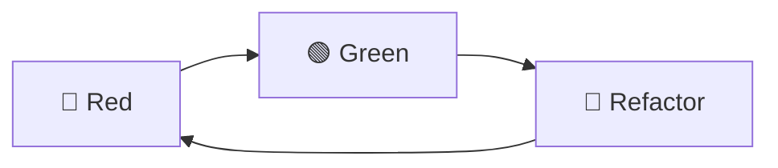
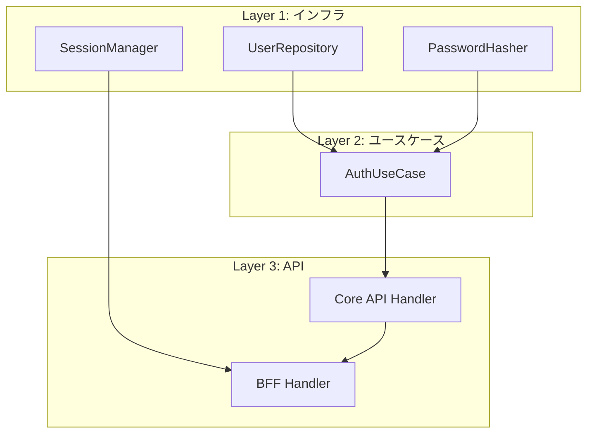
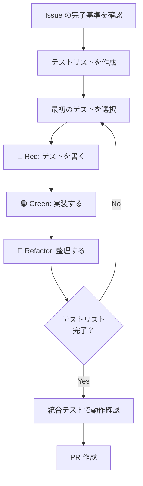

# TDD 開発フロー

## 概要

このプロジェクトでは TDD（テスト駆動開発）を採用し、テストファーストで実装を進める。
t_wada（和田卓人）の TDD 手法を基本とし、アジャイル的に MVP を積み上げる。

### 採用理由

| 観点 | TDD のメリット |
|------|---------------|
| 品質 | バグの早期発見、リグレッション防止 |
| 設計 | テストしやすい設計 = 良い設計 |
| 学習 | 小さなステップで着実に理解を深められる |
| 安心 | 動くコードを常に維持、大胆なリファクタリングが可能 |

---

## TDD サイクル



### 🔴 Red: 失敗するテストを書く

**目的:** 実装すべき振る舞いを明確にする

1. テストを1つだけ書く
2. コンパイルエラーを解消する（最小限のスタブ）
3. テストを実行して **失敗することを確認** する

```rust
#[tokio::test]
async fn test_find_user_by_email_returns_user_when_exists() {
    // Arrange
    let repo = setup_test_repository().await;

    // Act
    let result = repo.find_by_email(&tenant_id, &email).await;

    // Assert
    assert!(result.is_ok());
    assert!(result.unwrap().is_some());
}
```

重要: 失敗を確認せずに実装に進まない。失敗を見ることで：
- テストが正しく書けていることを確認できる
- 実装前後の差分が明確になる

### 🟢 Green: 最短で通す

**目的:** テストを通す最小限のコードを書く

1. **仮実装（Fake It）:** 定数を返すなど、最も単純な実装
2. **明白な実装（Obvious Implementation）:** 答えが明らかなら直接実装
3. コードの美しさは後回し

```rust
// 仮実装の例（まずこれでテストを通す）
pub async fn find_by_email(&self, tenant_id: &TenantId, email: &Email) -> Result<Option<User>> {
    Ok(Some(User::new(/* テストデータと同じ値 */)))
}
```

重要: この段階では「動く」ことだけに集中。重複や汚いコードは許容する。

### 🔵 Refactor: きれいにする

**目的:** 動作を変えずにコードを改善する

1. 重複を除去
2. 命名を改善
3. 構造を整理
4. **テストが通り続けることを確認しながら** 進める

```rust
// リファクタリング後（実際のDB問い合わせ）
pub async fn find_by_email(&self, tenant_id: &TenantId, email: &Email) -> Result<Option<User>> {
    let row = sqlx::query_as!(
        UserRow,
        "SELECT * FROM users WHERE tenant_id = $1 AND email = $2",
        tenant_id.as_uuid(),
        email.as_str()
    )
    .fetch_optional(&self.pool)
    .await?;

    Ok(row.map(User::from))
}
```

---

## テストリスト

実装前にテストリスト（TODO リスト）を作成する。これが実装の道標になる。

### 作成のコツ

1. **完了基準から逆算:** Issue の完了基準をテストケースに分解
2. **正常系 → 異常系:** まず動く場合、次に失敗する場合
3. **境界値:** エッジケースを忘れずに
4. **優先順位付け:** 最も価値のあるテストから

### 例: ログイン機能

```markdown
## テストリスト

### UserRepository
- [ ] メールアドレスでユーザーを取得できる
- [ ] 存在しないメールアドレスの場合 None を返す
- [ ] 別テナントのユーザーは取得できない

### PasswordHasher
- [ ] パスワードを検証できる（正しいパスワード）
- [ ] 不正なパスワードは検証失敗

### SessionManager
- [ ] セッションを作成できる
- [ ] セッションを取得できる
- [ ] セッションを削除できる
- [ ] 存在しないセッションは None を返す

### AuthUseCase
- [ ] 正しい認証情報でログインできる
- [ ] 不正なパスワードでログイン失敗
- [ ] 存在しないユーザーでログイン失敗
- [ ] 非アクティブユーザーはログイン不可
```

### 進め方

1. リストの最初の項目を選ぶ
2. Red → Green → Refactor
3. 完了したらチェックを付ける ✅
4. 次の項目へ
5. 新しいテストケースを思いついたらリストに追加

---

## MVP 積み上げ方式

アジャイル的に、動く最小単位から段階的に機能を追加する。

### 原則

| 原則 | 説明 |
|------|------|
| 垂直スライス | 1つの機能を端から端まで動かす |
| 常に動く状態 | 各ステップ完了時点で動作確認できる |
| 依存順に積む | 下位レイヤーから順に実装 |

### 依存関係を考慮した順序



**実装順序:**
1. UserRepository（DB からユーザー取得）
2. PasswordHasher（パスワード検証）
3. AuthUseCase（認証ロジック）
4. Core API Handler（内部 API）
5. SessionManager（セッション管理）
6. BFF Handler（公開 API）

各ステップで「テスト → 実装 → リファクタリング」を繰り返す。

---

## 実践的なパターン

### パターン1: 三角測量（Triangulation）

1つのテストだけでは一般化しにくい場合、複数のテストケースを追加して実装を導く。

```rust
// テスト1
#[test]
fn test_verify_password_returns_true_for_correct_password() {
    let hasher = Argon2PasswordHasher::new();
    let hash = hasher.hash("password123").unwrap();
    assert!(hasher.verify("password123", &hash).unwrap());
}

// テスト2（三角測量）
#[test]
fn test_verify_password_returns_false_for_wrong_password() {
    let hasher = Argon2PasswordHasher::new();
    let hash = hasher.hash("password123").unwrap();
    assert!(!hasher.verify("wrongpassword", &hash).unwrap());
}
```

### パターン2: Given-When-Then（AAA）

テストの構造を明確にする。

```rust
#[tokio::test]
async fn test_login_succeeds_with_valid_credentials() {
    // Given（Arrange）: 前提条件
    let repo = MockUserRepository::new();
    let hasher = MockPasswordHasher::new();
    let usecase = AuthUseCase::new(repo, hasher);

    // When（Act）: 実行
    let result = usecase.authenticate(&email, &password).await;

    // Then（Assert）: 検証
    assert!(result.is_ok());
}
```

### パターン3: テストダブル

依存を差し替えて単体テストを可能にする。

| 種類 | 用途 |
|------|------|
| Stub | 固定値を返す |
| Mock | 呼び出しを検証 |
| Fake | 簡易版の実装（インメモリDBなど） |

```rust
// Fake 実装の例
pub struct InMemoryUserRepository {
    users: HashMap<Email, User>,
}

impl UserRepository for InMemoryUserRepository {
    async fn find_by_email(&self, _tenant_id: &TenantId, email: &Email) -> Result<Option<User>> {
        Ok(self.users.get(email).cloned())
    }
}
```

---

## ワークフロー全体像



---

## チェックリスト

実装完了時に確認する項目:

- [ ] すべてのテストが通る（`cargo test`）
- [ ] テストカバレッジが妥当（主要パスを網羅）
- [ ] リファクタリングが完了している
- [ ] 統合テストで E2E の動作を確認
- [ ] `just check-all` が通る

---

## 参考資料

- 『テスト駆動開発』Kent Beck 著、和田卓人 訳
- t_wada のスライド・講演資料
- [テスト駆動開発についてまとめてみた](https://qiita.com/t_wada/items/e2b3b1a5b9e89a5b7f9c)

---

## 変更履歴

| 日付 | 変更内容 |
|------|---------|
| 2026-01-17 | 初版作成 |
