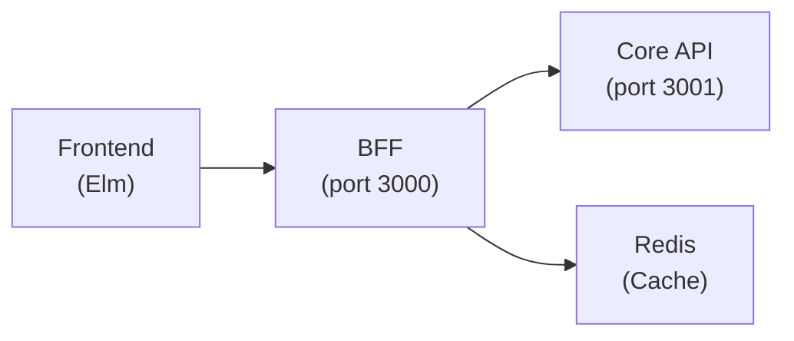
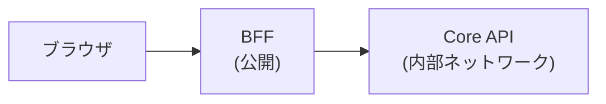
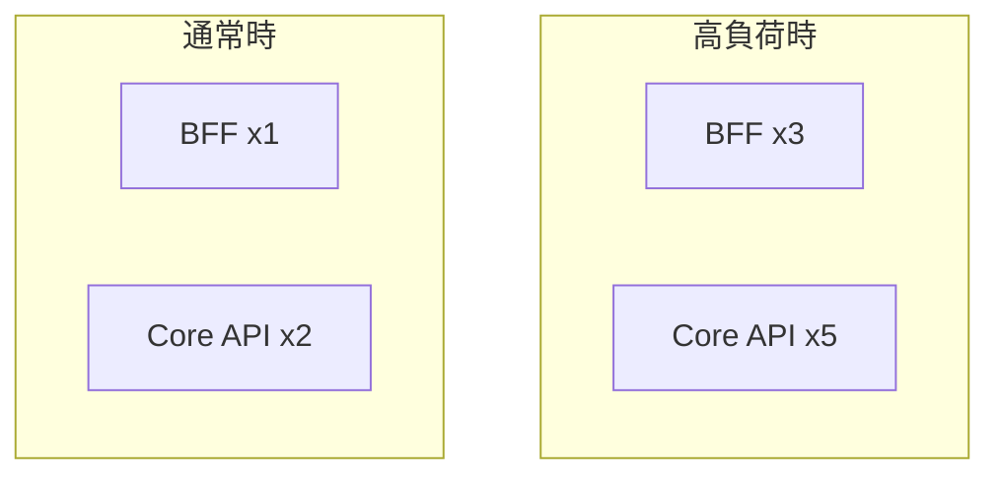

# BFF (Backend for Frontend) パターン

## 概要

BFF は、フロントエンド専用のバックエンドサーバーを設けるアーキテクチャパターン。
フロントエンドと内部 API の間に位置し、フロントエンド固有の要件を処理する。

## アーキテクチャ



## BFF の責務

| 責務 | 説明 |
|------|------|
| 認証・セッション管理 | Cookie ベースのセッション、JWT 発行・検証 |
| CSRF 防御 | トークン生成・検証 |
| レスポンス最適化 | フロントエンドに最適な形式にデータを変換 |
| アグリゲーション | 複数の API 呼び出しを 1 つにまとめる |
| キャッシュ | Redis を使用したレスポンスキャッシュ |
| レート制限 | クライアントごとのリクエスト制限 |
| セキュリティヘッダ | CORS、CSP などのヘッダ付与 |

## Core API の責務

| 責務 | 説明 |
|------|------|
| ビジネスロジック | ドメインルールの実行 |
| データ永続化 | データベース操作 |
| 認可チェック | リソースへのアクセス権限検証 |
| 内部サービス通信 | 他のマイクロサービスとの連携 |

## なぜ分離するか

### 1. セキュリティ



- Core API は内部ネットワークに配置
- 外部からの直接アクセスを防止
- 攻撃対象を BFF に限定

### 2. 関心の分離

- BFF: フロントエンド固有の要件（セッション、CSRF、レスポンス形式）
- Core API: ビジネスロジック（フロントエンドに依存しない）

### 3. 独立したスケーリング



- BFF と Core API を別々にスケールアウト可能
- 負荷特性に応じたリソース配分

### 4. 障害分離

- BFF がダウンしても Core API は影響を受けない
- Core API がダウンしても BFF はエラーレスポンスを返せる

## セッション管理

BFF は HTTPOnly Cookie + Redis でセッションを管理する。

```
1. ブラウザ → BFF: POST /auth/login
2. BFF → Core API: 認証リクエスト
3. Core API → BFF: ユーザー情報
4. BFF → Redis: セッション保存
5. BFF → ブラウザ: Set-Cookie: session_id=xxx; HttpOnly; Secure
```

### Cookie 属性

| 属性 | 値 | 目的 |
|------|-----|------|
| HttpOnly | true | JavaScript からのアクセス禁止（XSS 対策） |
| Secure | true | HTTPS のみで送信 |
| SameSite | Lax | CSRF 対策 |
| Path | / | 全パスで有効 |

## CSRF 防御

BFF は Double Submit Cookie パターンで CSRF を防御する。

```
1. ブラウザ → BFF: GET /auth/csrf
2. BFF → Redis: CSRF トークン生成・保存
3. BFF → ブラウザ: { "token": "xxx" }
4. ブラウザ → BFF: POST /api/... (X-CSRF-Token: xxx)
5. BFF: トークン検証
```

## アグリゲーション

複数の API 呼び出しを 1 つにまとめて、フロントエンドのリクエスト数を削減。

```rust
// BFF: ダッシュボード用エンドポイント
async fn get_dashboard() -> Result<Json<DashboardData>, ApiError> {
    // 並列で複数の API を呼び出し
    let (tasks, workflows, stats) = tokio::join!(
        core_api.get_my_tasks(),
        core_api.get_my_workflows(),
        core_api.get_dashboard_stats(),
    );

    Ok(Json(DashboardData {
        tasks: tasks?,
        workflows: workflows?,
        stats: stats?,
    }))
}
```

## レスポンス変換

フロントエンドに最適な形式にデータを変換する。

```rust
// Core API のレスポンス
struct InternalWorkflow {
    id: Uuid,
    definition_id: Uuid,
    status_code: i32,
    metadata: serde_json::Value,
    created_at: DateTime<Utc>,
}

// BFF が変換して返すレスポンス
struct WorkflowResponse {
    id: String,
    title: String,
    status: String,  // "pending", "approved" など人間可読
    created_at: String,  // ISO 8601 形式
}
```

## プロジェクトでの使用

| バイナリ | ポート | 役割 |
|---------|--------|------|
| `apps/api/src/bin/bff.rs` | 3000 | BFF |
| `apps/api/src/bin/core_api.rs` | 3001 | Core API |

## 関連リソース

- [Sam Newman - Pattern: Backends For Frontends](https://samnewman.io/patterns/architectural/bff/)
- [Microsoft - Gateway Aggregation pattern](https://learn.microsoft.com/en-us/azure/architecture/patterns/gateway-aggregation)

---

## 変更履歴

| 日付 | 変更内容 |
|------|---------|
| 2026-01-14 | 初版作成 |
