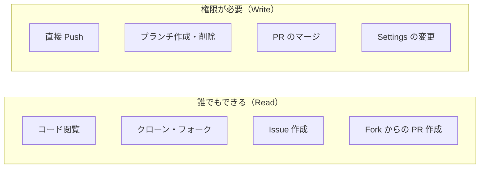
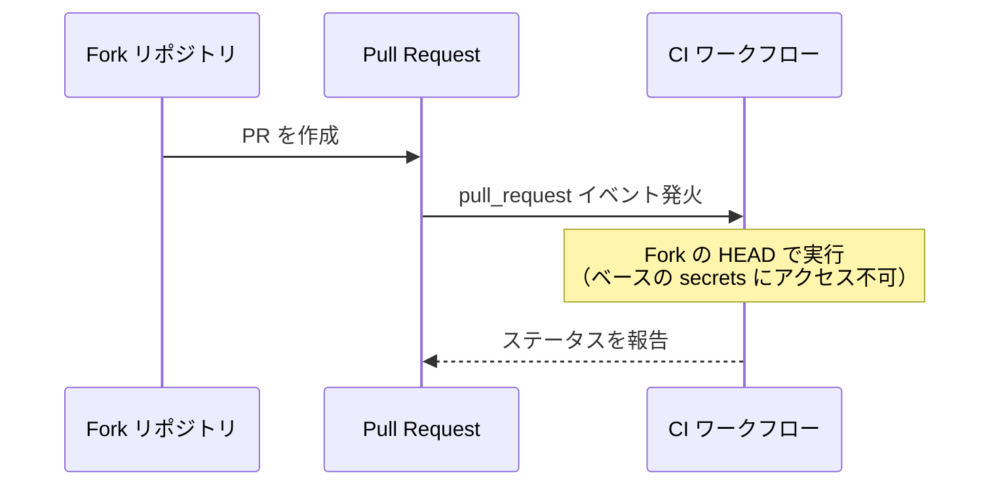
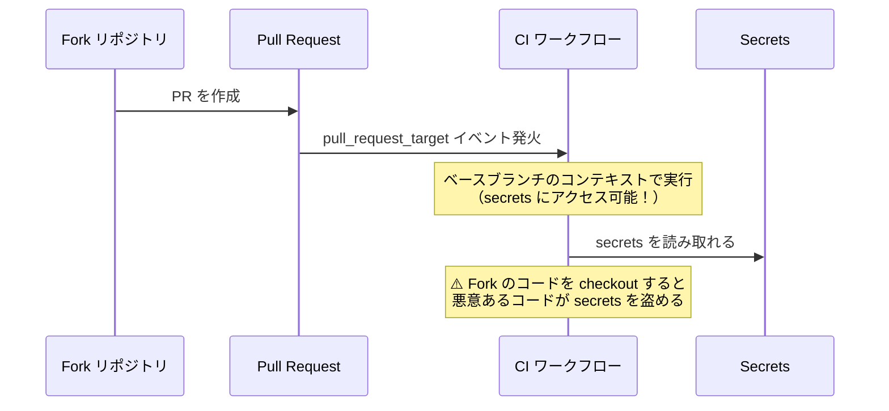
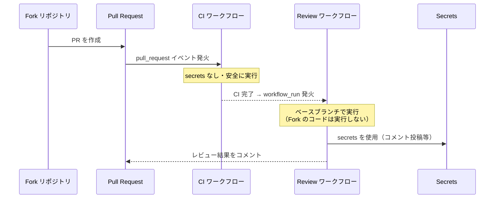
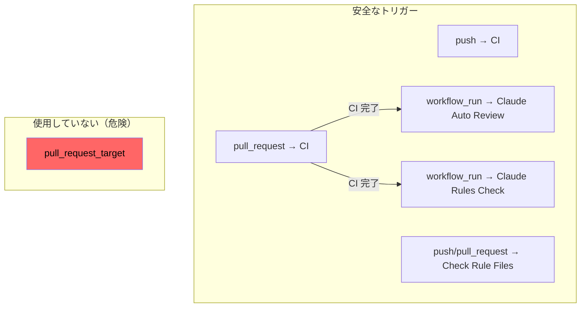

# GitHub 公開リポジトリのセキュリティモデル

## 概要

GitHub の公開（public）リポジトリは「誰でもコードを見られる」だけであり、「誰でもコードを変更できる」わけではない。
このドキュメントでは、公開リポジトリにおける権限モデルとワークフローセキュリティの仕組みを解説する。

## 権限モデルの基本

### Public = 「読み取り公開」

public リポジトリの「public」は**読み取りの公開**を意味する。



### GitHub の権限レベル

| 権限レベル | 直接 Push | PR マージ | workflow_dispatch | Settings 変更 |
|-----------|----------|----------|-------------------|--------------|
| 未認証 / 一般ユーザー | No | No | No | No |
| Read（Collaborator） | No | No | No | No |
| Triage | No | No | No | No |
| Write（Collaborator） | Yes | Yes | Yes | No |
| Maintain | Yes | Yes | Yes | 一部 |
| Admin | Yes | Yes | Yes | Yes |

個人リポジトリ（Organization でない）では、オーナーが Admin 権限を持ち、招待した Collaborator は Write 権限を得る。

**ポイント**: Fork して PR を送る行為は write 権限を必要としない。これが OSS のコントリビューションモデルの基盤。

## Fork PR とワークフローセキュリティ

公開リポジトリで最も理解が重要な領域。外部からの PR がワークフローに与える影響を正確に把握する必要がある。

### pull_request イベント（安全）



`pull_request` トリガーの特徴:

| 項目 | 挙動 |
|------|------|
| 実行コンテキスト | Fork のコード（PR の HEAD） |
| ワークフロー定義 | **ベースブランチのもの**を使用 |
| secrets | アクセス**不可** |
| `GITHUB_TOKEN` | read-only（PR へのコメント等も不可） |
| ワークフロー改変 | Fork 側で `.github/workflows/` を変更しても**無視される** |

**なぜ安全か**: Fork の PR 作成者がワークフロー定義を書き換えても、実行されるのはベースブランチ（main）の定義。secrets へのアクセスもブロックされるため、悪意あるコードが secrets を読み取ることはできない。

### pull_request_target イベント（危険）



`pull_request_target` の特徴:

| 項目 | 挙動 |
|------|------|
| 実行コンテキスト | **ベースブランチ**（main）のコード |
| ワークフロー定義 | ベースブランチのもの |
| secrets | アクセス**可能** |
| `GITHUB_TOKEN` | write 権限あり |

**なぜ危険か**: ベースブランチのコンテキストで動くため secrets にアクセスできる。ここで `actions/checkout` を使って Fork のコードを checkout すると、Fork の悪意あるコードがリポジトリの secrets にアクセスできてしまう。

```yaml
# ⚠️ 危険なパターン
on: pull_request_target
jobs:
  build:
    steps:
      - uses: actions/checkout@v6
        with:
          ref: ${{ github.event.pull_request.head.sha }}  # Fork のコードを checkout
      - run: make build  # ← Fork の Makefile が secrets を盗む可能性
```

### workflow_run イベント（安全な代替策）

`pull_request_target` を避けつつ、PR に対して secrets が必要な操作（コメント投稿、ステータス報告など）を行うためのパターン。



**なぜ安全か**: `workflow_run` はベースブランチのコンテキストで動き secrets にアクセスできるが、Fork のコードを checkout・実行しないため、悪意あるコードが secrets に触れる経路がない。

### 3つのトリガーの比較

| 観点 | `pull_request` | `pull_request_target` | `workflow_run` |
|------|---------------|----------------------|----------------|
| Fork PR で発火 | Yes | Yes | 間接的に Yes |
| secrets アクセス | No | **Yes** | Yes |
| Fork コードの実行 | Yes（安全に） | 設定による（**危険**） | No |
| 用途 | ビルド・テスト | 本プロジェクトでは使用しない | レビュー・通知 |
| 安全性 | 高い | **低い** | 高い |

## issue_comment イベント

公開リポジトリでは誰でも Issue や PR にコメントできるため、`issue_comment` トリガーは誰でも発火できる。

### リスクと対策

| リスク | 対策 |
|--------|------|
| 誰でもトリガーできる | コメント内容のフィルタリング（特定キーワード必須） |
| Bot の無限ループ | Bot 自身のコメントを除外する条件を追加 |
| secrets の露出 | permissions を最小限に設定 |
| リソース消費 | concurrency 設定で重複実行を防止 |

```yaml
# 安全なパターン
on:
  issue_comment:
    types: [created]

jobs:
  respond:
    # Bot のコメントを除外（無限ループ防止）
    if: |
      contains(github.event.comment.body, '@claude') &&
      github.event.comment.user.login != 'github-actions[bot]'
    permissions:
      contents: read        # 必要最小限
      pull-requests: write  # コメント投稿に必要
```

## GITHUB_TOKEN の権限

ワークフロー内で自動的に提供される `GITHUB_TOKEN` は、トリガーによって権限が異なる。

| トリガー | GITHUB_TOKEN の権限 |
|---------|-------------------|
| `push` | read/write |
| `pull_request`（同一リポジトリ） | read/write |
| `pull_request`（Fork） | **read-only** |
| `workflow_run` | read/write |
| `issue_comment` | read/write |

`permissions` ブロックで明示的に制限することがベストプラクティス:

```yaml
permissions:
  contents: read
  pull-requests: write

# ↑ 必要な権限だけを明示的に付与
# 指定しなかった権限は自動的に none になる
```

→ 関連: [GitHub Actions ナレッジベース](GitHubActions.md)

## ブランチ保護による防御

権限があっても、ブランチ保護ルール（Ruleset）で追加の制約を設けられる。

| 保護ルール | 効果 |
|-----------|------|
| PR 必須 | main への直接 push を禁止 |
| レビュー承認必須 | 承認なしのマージを禁止 |
| CI 必須 | テスト失敗時のマージを禁止 |
| Force push 禁止 | 履歴改変を防止 |
| 削除禁止 | ブランチの誤削除を防止 |

→ 詳細: [GitHub Ruleset ナレッジベース](GitHub_Ruleset.md)

## このプロジェクトでの構成

### ワークフローのトリガー構成



### 各ワークフローの権限設定

| ワークフロー | contents | pull-requests | issues | actions | statuses | secrets 使用 |
|-------------|----------|---------------|--------|---------|----------|-------------|
| CI | default | default | default | default | default | なし |
| Claude Auto Review | read | write | write | read | write | `CLAUDE_CODE_OAUTH_TOKEN` |
| Claude Rules Check | read | write | write | read | write | `CLAUDE_CODE_OAUTH_TOKEN` |
| Check Rule Files | default | default | default | default | default | なし |

Claude 系ワークフローは `contents: read` に制限しており、コードの変更はできない。

## よくある誤解

| 誤解 | 実際 |
|------|------|
| public = 誰でもコミットできる | push 権限は Collaborator 以上のみ |
| Fork PR で secrets が漏れる | `pull_request` トリガーでは secrets にアクセス不可 |
| ワークフローを書き換えて攻撃できる | `pull_request` ではベースブランチのワークフロー定義が使われる |
| issue_comment は安全 | 誰でも発火できるため、フィルタリングと権限制限が必要 |

## 関連リソース

- [GitHub Docs: Security hardening for GitHub Actions](https://docs.github.com/en/actions/security-for-github-actions/security-guides/security-hardening-for-github-actions)
- [GitHub Docs: Events that trigger workflows](https://docs.github.com/en/actions/writing-workflows/choosing-when-your-workflow-runs/events-that-trigger-workflows)
- [GitHub Docs: Automatic token authentication (GITHUB_TOKEN)](https://docs.github.com/en/actions/security-for-github-actions/security-guides/automatic-token-authentication)

---

## 変更履歴

| 日付 | 変更内容 |
|------|---------|
| 2026-02-09 | 初版作成 |
