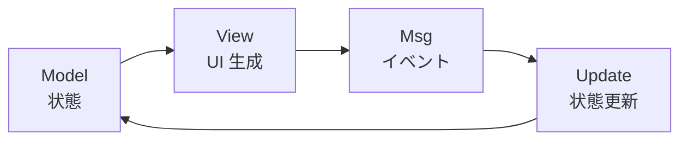

# The Elm Architecture / TEA（エルムアーキテクチャ）

## 概要

The Elm Architecture (TEA) は、Elm アプリケーションの設計パターン。
React/Redux の設計に大きな影響を与えた。

3 つの要素で構成される単方向データフローにより、状態管理が予測可能になる。



## 3 つの要素

### Model（状態）

アプリケーションの状態を表す不変のデータ構造。

```elm
type alias Model =
    { user : Maybe User
    , workflows : List Workflow
    , loading : Bool
    }
```

設計方針:
- 最小限の状態のみを保持する
- 派生値（例: フィルタ済みリスト）は view 関数内で計算する

### Update（状態更新）

メッセージを受け取り、Model を更新する純粋関数。

```elm
update : Msg -> Model -> ( Model, Cmd Msg )
update msg model =
    case msg of
        GotWorkflows (Ok workflows) ->
            ( { model | workflows = workflows, loading = False }
            , Cmd.none
            )

        GotWorkflows (Err _) ->
            ( { model | loading = False }
            , Cmd.none
            )
```

ポイント:
- `( Model, Cmd Msg )` のタプルを返す
- `Cmd` は副作用（HTTP リクエスト等）を表現
- 副作用がない場合は `Cmd.none`

### View（UI 生成）

Model から HTML を生成する純粋関数。

```elm
view : Model -> Html Msg
view model =
    if model.loading then
        div [] [ text "読み込み中..." ]
    else
        ul [] (List.map viewWorkflow model.workflows)
```

## Msg（メッセージ）

「何が起きたか」を表現するカスタム型。

```elm
type Msg
    = ClickedLogin
    | EnteredEmail String
    | GotWorkflows (Result Http.Error (List Workflow))
    | UrlChanged Url
```

命名規則:
- ユーザーアクション: `Clicked*`, `Entered*`, `Toggled*`
- HTTP レスポンス: `Got*`
- システムイベント: `UrlChanged`, `TimePassed`

## Browser.application

Elm には 4 種類のプログラム構造がある。

| 関数 | URL 管理 | 履歴 | 用途 |
|------|---------|------|------|
| `Browser.sandbox` | なし | なし | 純粋な UI コンポーネント |
| `Browser.element` | なし | なし | 既存ページへの埋め込み |
| `Browser.document` | なし | なし | 全画面 SPA（URL 不要） |
| `Browser.application` | あり | あり | フル機能 SPA |

RingiFlow は複数ページを持つ SPA のため、`Browser.application` を採用。

```elm
main : Program Flags Model Msg
main =
    Browser.application
        { init = init
        , view = view
        , update = update
        , subscriptions = subscriptions
        , onUrlChange = UrlChanged
        , onUrlRequest = LinkClicked
        }
```

### Program 型の 3 つの型パラメータ

- `Flags`: JavaScript から渡される初期データの型
- `Model`: アプリケーション状態の型
- `Msg`: 状態更新トリガーとなるメッセージの型

## Flags（JavaScript からの初期値）

Elm は純粋関数型言語であり、外部環境に直接アクセスできない。
Flags を通じて JavaScript 側から値を注入する。

```elm
type alias Flags =
    { apiBaseUrl : String
    , timestamp : Int
    }
```

```javascript
// JavaScript 側
Elm.Main.init({
    flags: {
        apiBaseUrl: import.meta.env.VITE_API_URL || '',
        timestamp: Date.now()
    }
});
```

## Subscriptions（外部イベントの購読）

外部からのイベント（WebSocket、タイマー等）を購読する。

```elm
subscriptions : Model -> Sub Msg
subscriptions model =
    Sub.batch
        [ Time.every 1000 Tick
        , Ports.receiveMessage ReceivedMessage
        ]
```

購読がない場合は `Sub.none` を返す。

## 初期化（init）

```elm
init : Flags -> Url -> Nav.Key -> ( Model, Cmd Msg )
init flags url key =
    let
        route = Route.fromUrl url
    in
    ( { key = key
      , url = url
      , route = route
      , apiBaseUrl = flags.apiBaseUrl
      }
    , fetchInitialData
    )
```

### Nav.Key

ブラウザ履歴を操作するためのキー。Elm ランタイムから提供される。

```elm
-- ページ遷移
Nav.pushUrl model.key "/workflows"

-- 戻る
Nav.back model.key 1
```

## Redux との比較

TEA は Redux の設計に大きな影響を与えた。

| TEA | Redux | 役割 |
|-----|-------|------|
| Model | State | 状態 |
| Msg | Action | イベント |
| update | Reducer | 状態更新 |
| Cmd | Middleware/Thunk | 副作用 |

## プロジェクトでの使用

`apps/web/src/Main.elm` で TEA パターンを実装している。

## 関連リソース

- [Elm 公式ガイド - The Elm Architecture](https://guide.elm-lang.org/architecture/)
- [Elm in Action](https://www.manning.com/books/elm-in-action)

---

## 変更履歴

| 日付 | 変更内容 |
|------|---------|
| 2026-01-14 | 初版作成 |
