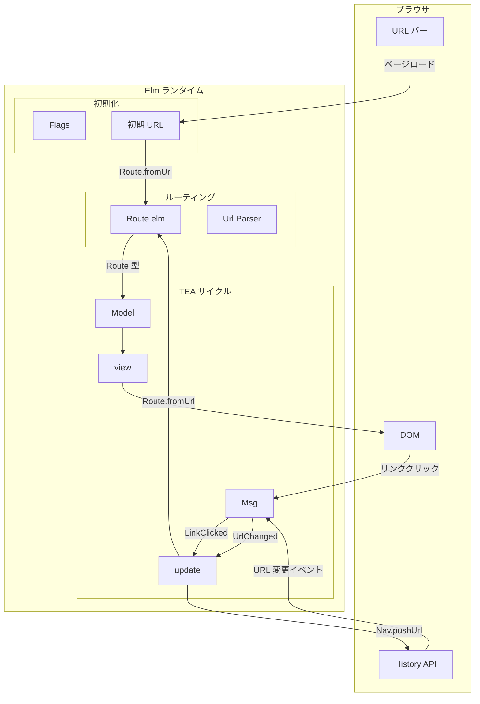
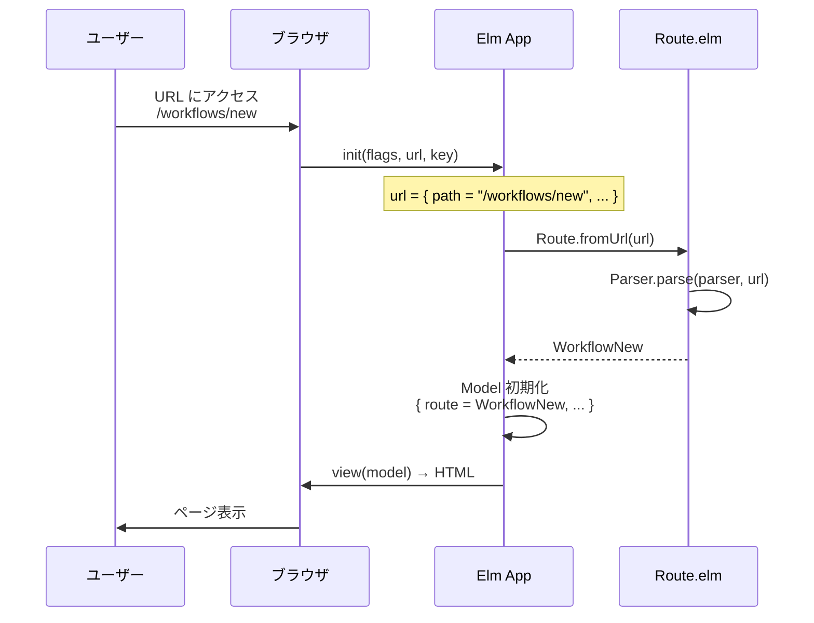
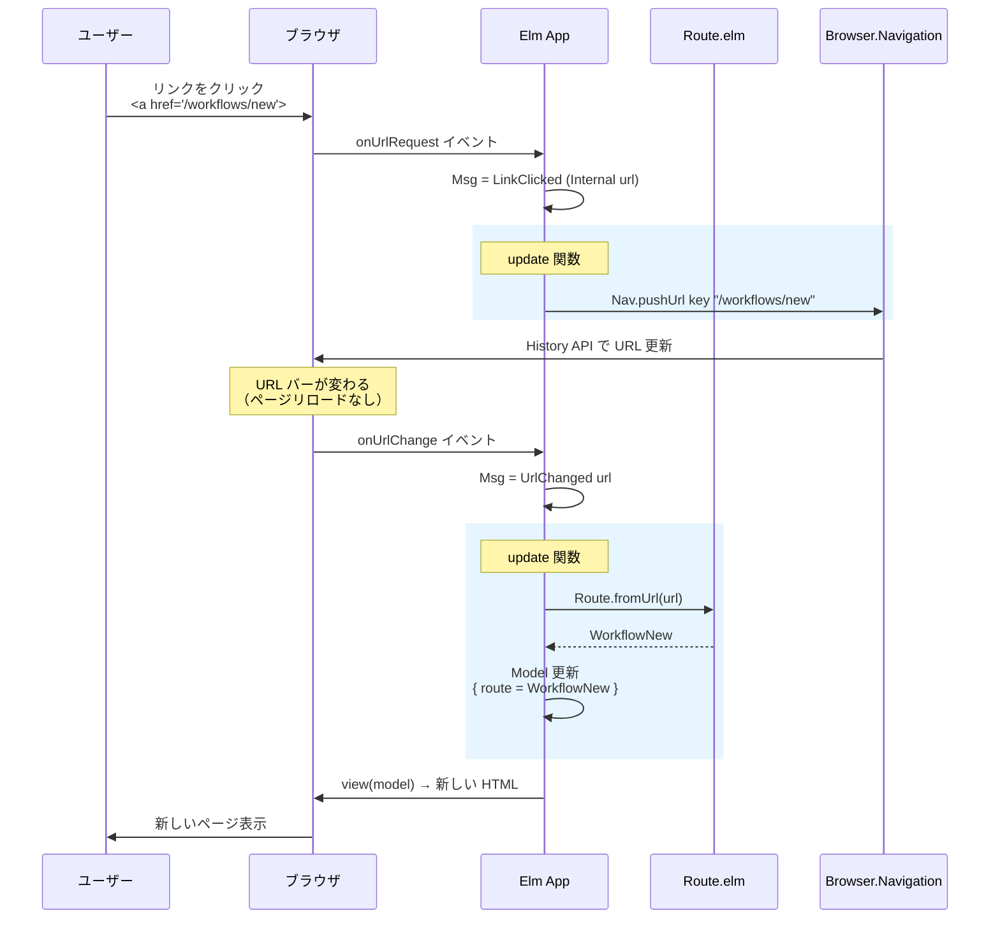
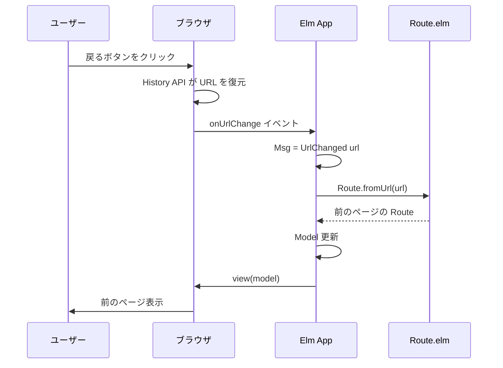
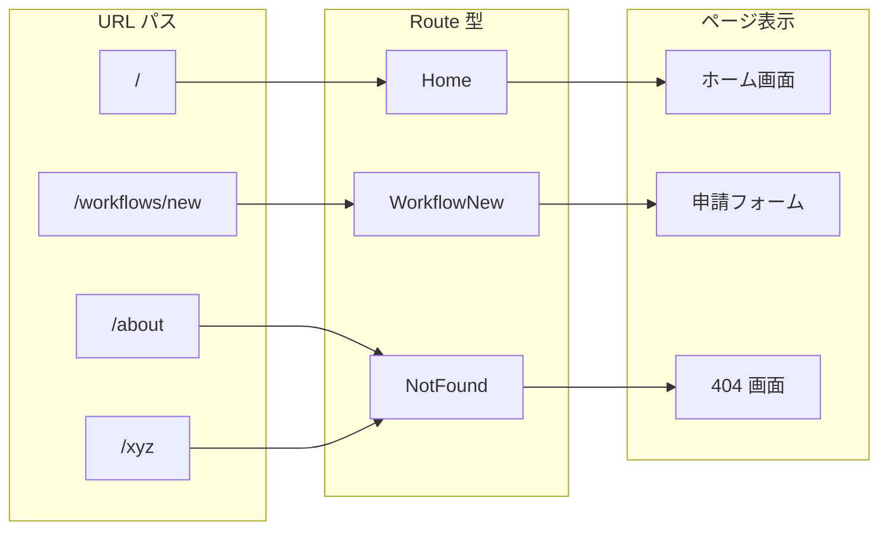

# Elm ルーティング

Elm SPA におけるルーティングの仕組みと実装パターンを解説する。

## 概要

Elm では `Browser.application` を使用して SPA を構築する。
ルーティングは以下の要素で構成される：

| 要素 | 役割 |
|------|------|
| `Url` | ブラウザの URL を表す型 |
| `Route` | アプリケーション固有のルート型（カスタム型） |
| `Url.Parser` | URL を Route に変換するパーサー |
| `Browser.Navigation` | URL 操作（pushUrl, load など） |

## 全体フロー



## ルーティングフロー詳細

### 1. 初期ロード時

ユーザーが URL に直接アクセスした場合のフロー。



### 2. 内部リンククリック時

SPA 内でのリンク遷移。ページリロードは発生しない。



### 3. ブラウザの戻る/進むボタン

ブラウザの履歴操作時のフロー。



## Route 型とページの対応



## 実装パターン

### Route.elm

```elm
module Route exposing (Route(..), fromUrl, toString)

import Url exposing (Url)
import Url.Parser as Parser exposing (Parser, oneOf, s, top)


{-| アプリケーションのルート（画面）を表す型

カスタム型として定義することで：
1. 存在しないルートを参照できない（型安全）
2. case 式で全ルートを処理しないとコンパイルエラー（網羅性チェック）

-}
type Route
    = Home
    | WorkflowNew
    | NotFound


{-| URL パーサー

パーサーコンビネータで URL パターンを定義する。
-}
parser : Parser (Route -> a) a
parser =
    oneOf
        [ Parser.map Home top                           -- /
        , Parser.map WorkflowNew (s "workflows" </> s "new")  -- /workflows/new
        ]


{-| URL を Route に変換
-}
fromUrl : Url -> Route
fromUrl url =
    Parser.parse parser url
        |> Maybe.withDefault NotFound


{-| Route を URL 文字列に変換（リンク生成用）
-}
toString : Route -> String
toString route =
    case route of
        Home ->
            "/"

        WorkflowNew ->
            "/workflows/new"

        NotFound ->
            "/not-found"
```

### Main.elm

```elm
import Browser
import Browser.Navigation as Nav
import Route exposing (Route)
import Url exposing (Url)


main : Program Flags Model Msg
main =
    Browser.application
        { init = init
        , view = view
        , update = update
        , subscriptions = subscriptions
        , onUrlRequest = LinkClicked   -- リンククリック時
        , onUrlChange = UrlChanged     -- URL 変更時
        }


type Msg
    = LinkClicked Browser.UrlRequest
    | UrlChanged Url


update : Msg -> Model -> ( Model, Cmd Msg )
update msg model =
    case msg of
        -- Step 1: リンクがクリックされた
        LinkClicked urlRequest ->
            case urlRequest of
                Browser.Internal url ->
                    -- 内部リンク → URL を変更（リロードなし）
                    ( model, Nav.pushUrl model.key (Url.toString url) )

                Browser.External href ->
                    -- 外部リンク → 通常の遷移（リロードあり）
                    ( model, Nav.load href )

        -- Step 2: URL が変更された（pushUrl の結果 or 戻る/進む）
        UrlChanged url ->
            -- Route を更新して Model に反映
            ( { model | url = url, route = Route.fromUrl url }
            , Cmd.none
            )
```

## 主要な関数・型

| 関数/型 | 説明 |
|--------|------|
| `Browser.application` | SPA を構築するプログラム型 |
| `Nav.Key` | URL 操作に必要なキー（init で取得） |
| `Nav.pushUrl` | URL を変更（履歴に追加） |
| `Nav.replaceUrl` | URL を変更（履歴を置換） |
| `Nav.load` | 外部 URL にリダイレクト（リロード） |
| `Browser.UrlRequest` | `Internal Url` または `External String` |
| `Url.Parser` | URL パターンマッチング用のパーサー |

## 2段階処理の理由

Elm のルーティングが `LinkClicked` → `UrlChanged` の2段階になっている理由：

1. **制御の分離**: リンククリックと実際の URL 変更を分離
2. **柔軟性**: `LinkClicked` で遷移を中断・変更可能（例: 未保存データの確認）
3. **統一的な処理**: 戻る/進むボタンも `UrlChanged` で同じ処理

```elm
LinkClicked urlRequest ->
    case urlRequest of
        Browser.Internal url ->
            if model.hasUnsavedChanges then
                -- 未保存データがあれば確認ダイアログを表示
                ( { model | showConfirmDialog = True, pendingUrl = Just url }
                , Cmd.none
                )
            else
                -- 通常の遷移
                ( model, Nav.pushUrl model.key (Url.toString url) )

        Browser.External href ->
            ( model, Nav.load href )
```

## パーサーコンビネータ

`Url.Parser` の主要なコンビネータ：

| コンビネータ | 説明 | 例 |
|-------------|------|-----|
| `top` | ルートパス `/` | `Parser.map Home top` |
| `s "path"` | 固定文字列 | `s "workflows"` → `/workflows` |
| `</>` | パス連結 | `s "users" </> int` → `/users/123` |
| `int` | 整数をキャプチャ | `/users/123` → `123` |
| `string` | 文字列をキャプチャ | `/users/abc` → `"abc"` |
| `oneOf` | 複数パーサーを試行 | 最初にマッチしたものを採用 |

## 関連ドキュメント

- [Elm アーキテクチャ](./Elmアーキテクチャ.md)
- [Elm ポート](./Elmポート.md)
- [申請フォーム UI 設計](../../03_詳細設計書/10_ワークフロー申請フォームUI設計.md)

## 参考

- [Elm Guide: Navigation](https://guide.elm-lang.org/webapps/navigation.html)
- [Url.Parser ドキュメント](https://package.elm-lang.org/packages/elm/url/latest/Url-Parser)
