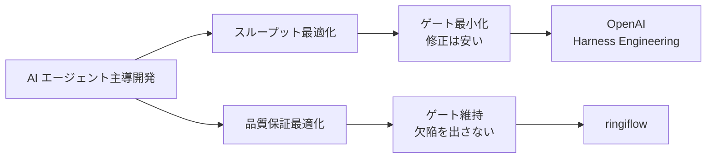

# AI エージェント主導開発のアプローチ比較

## 概要

AI エージェントに開発を主導させるアプローチは、最適化対象によって異なる設計になる。本記事では OpenAI の Harness Engineering と ringiflow のアプローチを比較し、それぞれの設計思想とトレードオフを整理する。

## 比較対象

| | OpenAI Harness Engineering | ringiflow |
|--|---------------------------|-----------|
| 出典 | [Harness engineering: leveraging Codex in an agent-first world](https://openai.com/index/harness-engineering/)（2026） | 本プロジェクト |
| AI モデル | Codex（GPT-5 系） | Claude Code |
| 最適化対象 | スループット（コード生産量の最大化） | 品質保証（AI 主導開発での品質担保） |
| 規模 | 3→7人、5ヶ月、~100万行、1,500 PR | 1人、~4ヶ月 |

## 共通する設計原則

独立に到達しているが、構造的に同じ原則を採用している領域がある。

### 1. リポジトリローカルな知識管理

| OpenAI | ringiflow |
|--------|-----------|
| "repository-local, versioned artifacts are all the agent can see" | ADR-025 ローカルファースト方針 |

AI エージェントはリポジトリ内の情報しか確実に参照できないため、知識をリポジトリに集約する設計は必然的に収束する。

### 2. 失敗→環境改善のフィードバックループ

| OpenAI | ringiflow |
|--------|-----------|
| "what capability is missing? make it legible and enforceable" | 改善記録 → 成果物要件 → フロー組み込み |

AI が失敗したとき「もっと頑張れ」ではなく「環境（ルール、ツール、ガードレール）を改善する」。

### 3. 機械的なアーキテクチャ強制

| OpenAI | ringiflow |
|--------|-----------|
| カスタムリンター + 構造テスト + レイヤー依存の機械的検証 | hooks + CI + ルールファイル + 品質チェックリスト |

行動規範（「〜すること」）ではなく、機械的に検証可能な制約で品質を担保する。

### 4. Agent Legibility

| OpenAI | ringiflow |
|--------|-----------|
| "agent legibility is the goal" — リポジトリの全情報を agent が読める形にする | CLAUDE.md + .claude/rules/ で AI の行動を構造的に規定 |

## 異なる設計判断

最適化対象の違いにより、同じ原則から異なる結論に至る領域がある。

### プロセスの重さ

| 観点 | OpenAI | ringiflow |
|------|--------|-----------|
| PR の寿命 | 短命、すぐマージ | Draft → レビュー → 品質ゲート → wrap-up → Ready |
| テスト失敗 | 再実行で対応、ブロックしない | `just check-all` 必須、CI 失敗でマージ不可 |
| 品質ゲート | 最小限（"corrections are cheap, waiting is expensive"） | 品質チェックリスト + 収束確認 |
| 人間の関与 | 意図の指定と検証 | 設計判断、レビュー、すべての承認 |

OpenAI は「AI のスループットが人間の注意力を超えると、修正コストが待機コストより安くなる」という判断に基づき、ブロッキングゲートを最小化している。ringiflow は品質保証を優先し、ゲートを維持している。

### 人間のコード記述

| OpenAI | ringiflow |
|--------|-----------|
| "no manually-written code" が原則 | AI が書くが人間がレビュー・判断 |

### マージ哲学

| OpenAI | ringiflow |
|--------|-----------|
| 高スループット優先、テストフレイクは再実行 | Squash merge、CI 通過必須 |

## ringiflow が深掘りしている領域

OpenAI の公開情報（2026-02 時点）に具体的な記述がない領域で、ringiflow が体系化を進めているもの。

| 領域 | ringiflow の実装 | 備考 |
|------|-----------------|------|
| AI の失敗パターン分類 | 改善記録 55件、カテゴリ × 失敗タイプの 2 軸分類 | OpenAI 社内にも存在する可能性はあるが公開情報では不明 |
| 問題解決フレームワーク | Want/To-Be/As-Is/Gap/Root Cause/Solution | — |
| プロセスの自己進化サイクル | 改善記録 → ルール化 → 検証の完全なループ | OpenAI は「失敗→環境改善」を言及するが、追跡・検証の仕組みは不明 |
| 対策形式の段階化 | 行動規範 → 成果物要件 → フロー組み込み | — |

## トレードオフの構造

これは対立ではなく、最適化対象の違いによる設計判断の分岐。

- スループット最適化は大規模チーム・高頻度リリース環境に適する
- 品質保証最適化は、AI の判断品質をまだ完全には信頼できない段階、またはミスのコストが高い環境に適する
- 成熟に伴い、品質保証のコストを下げながらスループットを上げる方向に収束する可能性がある

## 普遍的な原則の示唆

両アプローチが独立に到達した共通原則は、AI エージェント主導開発における普遍的な要件である可能性が高い:

1. 知識はリポジトリローカルに集約する
2. AI の失敗は環境の問題として対処する（AI を叱らない）
3. 制約は機械的に強制する（ドキュメントに書くだけでは守られない）
4. リポジトリを agent にとって legible（読み取り可能）にする

## 参照

- [Harness engineering: leveraging Codex in an agent-first world | OpenAI](https://openai.com/index/harness-engineering/)
- [Unlocking the Codex harness: how we built the App Server | OpenAI](https://openai.com/index/unlocking-the-codex-harness/)
- [Custom instructions with AGENTS.md | OpenAI Developers](https://developers.openai.com/codex/guides/agents-md/)
- [CLAUDE.md](../../../CLAUDE.md) — ringiflow の AI エージェント指針
- [改善記録](../../../process/improvements/) — AI の失敗パターンと対策
