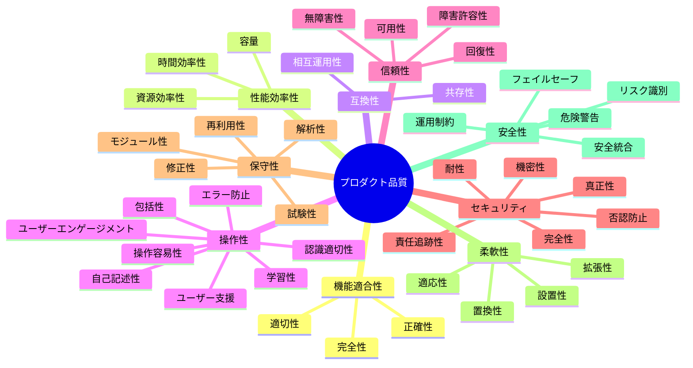
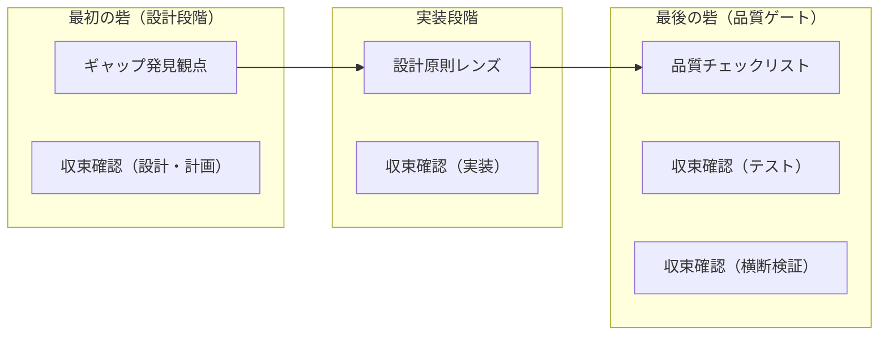

# ISO/IEC 25010 プロダクト品質モデル

## 概要

ISO/IEC 25010 は、ソフトウェアプロダクトの品質を体系的に定義する国際規格。SQuaRE（Systems and software Quality Requirements and Evaluation）シリーズの一部で、品質特性とその副特性を階層的に整理している。

2023年に改訂され（ISO/IEC 25010:2023）、8 特性から 9 特性に拡張された。

## 2023 版の品質特性と副特性

### 全体像

### 各特性の詳細

| # | 品質特性 | 英名 | 定義 | 副特性 |
|---|---------|------|------|--------|
| 1 | 機能適合性 | Functional Suitability | 明示・暗黙のニーズを満たす機能を提供する度合い | 完全性、正確性、適切性 |
| 2 | 性能効率性 | Performance Efficiency | 使用する資源に対する性能の度合い | 時間効率性、資源効率性、容量 |
| 3 | 互換性 | Compatibility | 他のプロダクトと情報を交換できる度合い | 共存性、相互運用性 |
| 4 | 操作性 | Interaction Capability | 指定されたユーザーが目標を達成するために操作できる度合い | 認識適切性、学習性、操作容易性、エラー防止、ユーザーエンゲージメント、包括性、ユーザー支援、自己記述性 |
| 5 | 信頼性 | Reliability | 指定された条件下で機能を実行する度合い | 無障害性、可用性、障害許容性、回復性 |
| 6 | セキュリティ | Security | 悪意あるアクターの攻撃パターンから防御する度合い | 機密性、完全性、否認防止、責任追跡性、真正性、耐性 |
| 7 | 保守性 | Maintainability | 意図された保守者が効果的・効率的に修正できる度合い | モジュール性、再利用性、解析性、修正性、試験性 |
| 8 | 柔軟性 | Flexibility | 要件の変化に適応できる度合い | 適応性、拡張性、設置性、置換性 |
| 9 | 安全性 | Safety | 人・ビジネス・ソフトウェア・財産・環境への損害を回避する度合い | 運用制約、リスク識別、フェイルセーフ、危険警告、安全統合 |

### 2011 版からの主な変更点

| 変更 | 2011 版 | 2023 版 |
|------|--------|---------|
| 追加 | — | 安全性（Safety）を新規追加 |
| 改名 | 使用性（Usability） | 操作性（Interaction Capability） |
| 改名 | 移植性（Portability） | 柔軟性（Flexibility） |
| 副特性追加 | — | 耐性（Resistance）をセキュリティに追加 |
| 副特性追加 | — | 包括性（Inclusivity）、自己記述性（Self-descriptiveness）を操作性に追加 |
| 副特性追加 | — | 拡張性（Scalability）を柔軟性に追加 |
| 副特性変更 | 成熟性（Maturity） | 無障害性（Faultlessness） |
| 副特性変更 | UI 美観（User Interface Aesthetics） | ユーザーエンゲージメント（User Engagement） |
| 副特性分割 | アクセシビリティ（Accessibility） | 包括性 + ユーザー支援に分割 |

## Quality in Use モデル

プロダクト品質とは別に、利用品質（Quality in Use）モデルも定義されている。こちらは利用者の視点から品質を評価する。

| 品質特性 | 定義 |
|---------|------|
| 有効性（Effectiveness） | ユーザーが目標を正確かつ完全に達成できる度合い |
| 効率性（Efficiency） | 目標達成に費やす資源に対する成果の度合い |
| 満足性（Satisfaction） | ユーザーのニーズが満たされる度合い |
| リスク回避性（Freedom from Risk） | 経済・健康・環境リスクを軽減する度合い |
| コンテキストカバレッジ（Context Coverage） | 想定された利用コンテキストで使用できる度合い |

## プロジェクトでの使用

### 品質特性の優先度

プロジェクトの開発段階に応じて優先度を分けている:

| 優先度 | 品質特性 | 理由 |
|--------|---------|------|
| 現在の重点 | 保守性、機能適合性、セキュリティ | 仕組み（TDD、レビュー、テナント分離設計）が整備済み |
| Phase 2〜 | 信頼性、操作性 | MVP 完了後、堅牢性と UX の改善 |
| Phase 3〜 | 性能効率性 | エンタープライズ規模対応 |
| 低優先 | 互換性、柔軟性、安全性 | 現時点では要件なし |

### 品質向上の二方向

品質特性への取り組みには二方向がある:

| 方向 | 内容 | 例 |
|------|------|-----|
| 守り（マイナス→ゼロ） | 欠陥を検出し修正する | テスト、リント、レビュー |
| 攻め（ゼロ→プラス） | より良い設計を追求する | リファクタリング、設計原則レンズ |

### 品質メカニズム全体と品質特性の対応

プロジェクトの品質メカニズムは「[二つの砦](../../../.claude/rules/zoom-rhythm.md#品質を守る二つの砦)」モデルで構造化されている。各メカニズムが ISO 25010:2023 のどの品質特性をカバーするかを俯瞰する。

#### メカニズムの全体像

#### メカニズム別カバレッジサマリー

各メカニズムがカバーする ISO 25010 品質特性を示す。◎ = 主要カバー、○ = 部分的カバー、— = カバーなし。

| 品質特性 | ギャップ発見観点 | 設計原則レンズ | 収束確認チェックリスト | 品質チェックリスト | 総合 |
|---------|---------------|-------------|-------------------|----------------|------|
| 保守性 | ◎ | ◎ | ◎ | ◎ | 全副特性カバー |
| 機能適合性 | ◎ | — | ◎ | ◎ | 全副特性カバー |
| 操作性 | ◎ | ◎ | — | ◎ | FE 変更時に強 |
| 信頼性 | ○ | ○ | ○ | ○ | 無障害性中心。可用性・回復性は未カバー |
| セキュリティ | ○ | — | — | ○ | ギャップ発見 + 品質CL で基本的にカバー |
| 柔軟性 | — | — | — | ○ | 微弱（ベストプラクティス経由） |
| 性能効率性 | — | — | — | — | 意図的除外（Phase 3〜） |
| 互換性 | — | — | — | — | 意図的除外 |
| 安全性 | — | — | — | — | 意図的除外 |

### 品質チェックリストとのマッピング

[品質チェックリスト（6.2）](../../04_手順書/04_開発フロー/01_Issue駆動開発.md#62-品質チェックリスト)の各項目が ISO 25010:2023 のどの品質特性・副特性に対応するかを示す。

#### サマリー（品質特性レベル）

| ISO 25010 品質特性 | チェックリストカテゴリ | カバー状況 | 備考 |
|-------------------|---------------------|-----------|------|
| 保守性 | 設計・ドキュメント、テスト、コード品質、品質向上 | 強 | 最多項目。解析性・試験性・修正性・モジュール性を幅広くカバー |
| 機能適合性 | Issue との整合、テスト、コード品質、横断検証 | 強 | 完全性・正確性を中心にカバー |
| 操作性 | UI/UX 品質、デザイン品質向上 | 強（FE 変更時） | フロントエンド変更がある場合のみ適用 |
| 信頼性 | コード品質、品質向上、UI/UX 品質 | 部分的 | 型安全性・状態表示経由。可用性・回復性は未カバー |
| セキュリティ | コード品質 | 基本的 | セキュリティ基本確認項目でカバー |
| 性能効率性 | — | 意図的除外 | Phase 3 以降で追加予定 |
| 互換性 | — | 意図的除外 | 現時点で要件なし |
| 柔軟性 | 品質向上 | 微弱 | ベストプラクティス項目が間接的にカバー |
| 安全性 | — | 意図的除外 | SaaS 特性上、物理安全性は対象外 |

#### 詳細マッピング（副特性レベル）

チェックリストのカテゴリ順に、各項目がどの品質特性・副特性に対応するかを示す。

| チェックリスト項目 | 品質特性 | 副特性 |
|------------------|---------|--------|
| **設計・ドキュメント** | | |
| 詳細設計書の作成・更新 | 保守性 | 解析性 |
| OpenAPI 仕様書の更新 | 保守性 | 解析性、修正性 |
| ADR の作成 | 保守性 | 解析性 |
| 実装解説の作成 | 保守性 | 解析性 |
| セッションログの作成 | 保守性 | 解析性 |
| 変更種別に応じた必須ドキュメント | 保守性 | 解析性、修正性 |
| **Issue との整合** | | |
| check-issue の正常終了 | 機能適合性 | 完全性 |
| Want/To-Be との過不足確認 | 機能適合性 | 完全性、適切性 |
| **テスト** | | |
| テストリスト全項目実装 | 保守性 | 試験性 |
| テスト層の網羅性 | 保守性 | 試験性 |
| 操作パス起点の検証 | 機能適合性 | 完全性 |
| E2E シナリオ確認 | 機能適合性 | 完全性、正確性 |
| テスト責任の検証 | 保守性 | 試験性 |
| PR Test plan チェック | 保守性 | 試験性 |
| TDD サイクル遵守 | 保守性 | 試験性、修正性 |
| テストレビュー | 保守性 | 試験性 |
| **コード品質確認（マイナス→ゼロ）** | | |
| アーキテクチャ一貫性 | 保守性 | モジュール性 |
| 既存パターン整合 | 保守性 | 修正性 |
| 型安全性・エラーハンドリング | 信頼性、保守性 | 無障害性、修正性 |
| 仕様突合（OpenAPI） | 機能適合性 | 正確性 |
| レイヤー間接続 | 機能適合性、信頼性 | 正確性、無障害性 |
| YAGNI/KISS の正しい適用 | 保守性 | モジュール性、修正性 |
| 技術的前提の確認 | 信頼性 | 無障害性 |
| 既存ドキュメントとの矛盾確認 | 保守性 | 解析性 |
| 構造的健全性 | 保守性 | モジュール性、再利用性 |
| セキュリティ基本確認 | セキュリティ | 機密性、完全性、真正性 |
| **品質向上（ゼロ→プラス）** | | |
| シンプルさ | 保守性 | モジュール性、修正性 |
| 型の活用 | 信頼性、保守性 | 無障害性、修正性 |
| 責務の明確さ | 保守性 | モジュール性 |
| ベストプラクティス | 保守性、柔軟性 | 修正性、適応性 |
| **UI/UX 品質確認** | | |
| デザイントークン整合 | 操作性 | 認識適切性、自己記述性 |
| 共有コンポーネント活用 | 保守性、操作性 | 再利用性、認識適切性 |
| アクセシビリティ | 操作性 | 包括性 |
| 状態表示 | 操作性、信頼性 | 認識適切性、障害許容性 |
| エラー表示 | 操作性 | ユーザー支援、エラー防止 |
| 視覚的階層 | 操作性 | 認識適切性 |
| 破壊的操作の防御 | 操作性 | エラー防止 |
| **デザイン品質向上（ゼロ→プラス）** | | |
| コントラストの効果 | 操作性 | 認識適切性、ユーザーエンゲージメント |
| 整列の一貫性 | 操作性 | 認識適切性 |
| 余白の活用 | 操作性 | 認識適切性 |
| **横断検証** | | |
| Phase 間データフロー整合 | 機能適合性 | 正確性 |
| 仕様との端到端突合 | 機能適合性、信頼性 | 正確性、無障害性 |
| 完了基準の E2E 検証 | 機能適合性 | 完全性 |

#### カバレッジギャップ分析

| 品質特性 | カバーされていない副特性 | 対応方針 |
|---------|----------------------|---------|
| 機能適合性 | — | 完全性・正確性・適切性すべてカバー済み |
| 信頼性 | 可用性、回復性 | Phase 2 以降でインフラ・運用の信頼性項目を追加予定 |
| セキュリティ | 否認防止、責任追跡性、耐性 | 高度なセキュリティ項目は専用チェックリストを Phase 2 以降で検討 |
| 保守性 | — | 全副特性カバー済み |
| 操作性 | 学習性、操作容易性 | FE 実装が進む Phase 2 以降で必要に応じて追加 |
| 性能効率性 | 全副特性 | 意図的除外。Phase 3 以降で追加予定 |
| 互換性 | 全副特性 | 意図的除外。現時点で要件なし |
| 柔軟性 | 拡張性、設置性、置換性 | 意図的除外。IaC（Terraform）で設置性は担保されるが、チェックリスト項目としては不要 |
| 安全性 | 全副特性 | 意図的除外。SaaS 特性上、物理安全性は対象外 |

### 設計原則レンズとのマッピング

[設計原則レンズ](../../04_手順書/04_開発フロー/02_TDD開発フロー.md#設計原則レンズ)の各レンズが ISO 25010:2023 のどの品質特性・副特性に対応するかを示す。

#### コード設計レンズ

| タイミング | レンズ | 品質特性 | 副特性 |
|-----------|--------|---------|--------|
| **毎 Refactor** | | | |
| | 意図の明確さ | 保守性 | 解析性 |
| | 重複の排除 | 保守性 | 修正性、再利用性 |
| | 要素の最小性 | 保守性 | モジュール性、修正性 |
| **モジュール/関数の完成時** | | | |
| | 単一責務（SRP） | 保守性 | モジュール性 |
| | 依存方向（DIP） | 保守性 | モジュール性、修正性 |
| | 型の活用 | 信頼性、保守性 | 無障害性、修正性 |

#### UI/UX レンズ（FE 変更時）

| タイミング | レンズ | 品質特性 | 副特性 |
|-----------|--------|---------|--------|
| **毎 Refactor** | | | |
| | デザイントークン準拠 | 操作性 | 認識適切性、自己記述性 |
| | 共有コンポーネント活用 | 保守性、操作性 | 再利用性、認識適切性 |
| | 状態の網羅性 | 操作性、信頼性 | 認識適切性、障害許容性 |
| **ページ/コンポーネントの完成時** | | | |
| | アクセシビリティ | 操作性 | 包括性 |
| | エラーのユーザビリティ | 操作性 | ユーザー支援、エラー防止 |
| | 視覚的階層 | 操作性 | 認識適切性 |
| | 破壊的操作の防御 | 操作性 | エラー防止 |
| **デザイン品質向上** | | | |
| | コントラストの効果 | 操作性 | 認識適切性、ユーザーエンゲージメント |
| | 整列の一貫性 | 操作性 | 認識適切性 |
| | 余白の活用 | 操作性 | 認識適切性 |

#### レンズのカバレッジ

| 品質特性 | カバー状況 | 備考 |
|---------|-----------|------|
| 保守性 | 強 | コード設計レンズ 6 項目すべてが保守性に寄与。モジュール性・修正性・再利用性・解析性をカバー |
| 操作性 | 強（FE 変更時） | UI/UX レンズ 10 項目がカバー。認識適切性・包括性・エラー防止等 |
| 信頼性 | 部分的 | 型の活用（無障害性）と状態の網羅性（障害許容性）のみ |
| 機能適合性 | — | レンズは設計品質を評価するもの。機能の完全性・正確性は品質チェックリストが担当 |

### ギャップ発見観点とのマッピング

[ギャップ発見の観点](../../../.claude/rules/zoom-rhythm.md#ギャップ発見の観点)の各観点が ISO 25010:2023 のどの品質特性・副特性に対応するかを示す。

#### 欠陥の発見（マイナス → ゼロ）

| 観点 | 品質特性 | 副特性 |
|------|---------|--------|
| 未定義 | 機能適合性 | 完全性 |
| 曖昧 | 保守性 | 解析性 |
| 競合・エッジケース | 信頼性 | 無障害性 |
| 不完全なパス | 信頼性 | 無障害性、障害許容性 |
| アーキテクチャ不整合 | 保守性 | モジュール性 |
| 既存手段の見落とし | 保守性 | 再利用性 |
| デザイントークン乖離 | 操作性 | 認識適切性、自己記述性 |
| アクセシビリティ欠陥 | 操作性 | 包括性 |
| 状態網羅漏れ | 操作性、信頼性 | 認識適切性、障害許容性 |
| 状態依存フィールド | 保守性、信頼性 | 修正性、無障害性 |
| テスト層網羅漏れ | 保守性 | 試験性 |
| 操作パス網羅漏れ | 機能適合性 | 完全性 |
| テスト責任の断絶 | 機能適合性 | 完全性 |
| セキュリティ境界の欠落 | セキュリティ | 機密性、完全性、真正性 |

#### 品質の向上（ゼロ → プラス）

| 観点 | 品質特性 | 副特性 |
|------|---------|--------|
| シンプルさ | 保守性 | モジュール性、修正性 |
| 型の活用 | 信頼性、保守性 | 無障害性、修正性 |
| 責務の明確さ | 保守性 | モジュール性 |
| ベストプラクティス | 保守性、柔軟性 | 修正性、適応性 |
| ユーザーフィードバック | 操作性 | 認識適切性 |
| 視覚的階層 | 操作性 | 認識適切性 |
| ビジュアルバランス | 操作性 | 認識適切性、ユーザーエンゲージメント |

#### ギャップ発見観点のカバレッジ

| 品質特性 | カバー状況 | 備考 |
|---------|-----------|------|
| 保守性 | 強 | 欠陥 6 項目 + 向上 4 項目。解析性・モジュール性・修正性・再利用性・試験性をカバー |
| 機能適合性 | 強 | 未定義（完全性）、操作パス網羅漏れ（完全性）、テスト責任の断絶（完全性）|
| 操作性 | 強（FE 変更時） | デザイントークン・アクセシビリティ・状態網羅・視覚系を幅広くカバー |
| 信頼性 | 部分的 | 競合・不完全なパス・状態網羅漏れ・型の活用で無障害性・障害許容性をカバー |
| セキュリティ | 基本的 | セキュリティ境界の欠落（機密性・完全性・真正性） |
| 柔軟性 | 微弱 | ベストプラクティス（適応性）のみ |

### 収束確認チェックリストとのマッピング

[収束確認のチェックリスト](../../../.claude/rules/zoom-rhythm.md#収束確認のチェックリスト)の各フェーズの確認項目が ISO 25010:2023 のどの品質特性・副特性に対応するかを示す。

#### 設計・計画フェーズ

| 確認項目 | 品質特性 | 副特性 |
|---------|---------|--------|
| 網羅性 | 機能適合性 | 完全性 |
| 曖昧さ排除 | 保守性 | 解析性 |
| 設計判断の完結性 | 保守性 | 解析性、修正性 |
| スコープ境界 | 機能適合性 | 完全性、適切性 |
| 技術的前提 | 信頼性 | 無障害性 |
| 既存ドキュメント整合 | 保守性 | 解析性 |

#### 実装フェーズ

| 確認項目 | 品質特性 | 副特性 |
|---------|---------|--------|
| アーキテクチャ一貫性 | 保守性 | モジュール性 |
| 既存パターン整合 | 保守性 | 修正性 |
| 型安全性・エラーハンドリング | 信頼性、保守性 | 無障害性、修正性 |
| 仕様突合（OpenAPI） | 機能適合性 | 正確性 |
| レイヤー間接続 | 機能適合性、信頼性 | 正確性、無障害性 |
| YAGNI/KISS の正しい適用 | 保守性 | モジュール性、修正性 |
| 技術的前提の確認 | 信頼性 | 無障害性 |

#### テストフェーズ

| 確認項目 | 品質特性 | 副特性 |
|---------|---------|--------|
| テストリスト突合 | 保守性 | 試験性 |
| カバレッジ | 保守性 | 試験性 |
| E2E 視点 | 機能適合性 | 完全性 |
| TDD 遵守 | 保守性 | 試験性、修正性 |
| テスト品質 | 保守性 | 試験性 |

#### 横断検証フェーズ

| 確認項目 | 品質特性 | 副特性 |
|---------|---------|--------|
| Phase 間データフロー整合 | 機能適合性 | 正確性 |
| 仕様との端到端突合 | 機能適合性、信頼性 | 正確性、無障害性 |
| 完了基準の E2E 検証 | 機能適合性 | 完全性 |

#### 収束確認チェックリストのカバレッジ

| 品質特性 | カバー状況 | 備考 |
|---------|-----------|------|
| 保守性 | 強 | 全フェーズでカバー。解析性・修正性・モジュール性・試験性 |
| 機能適合性 | 強 | 全フェーズでカバー。完全性・正確性・適切性 |
| 信頼性 | 部分的 | 実装・横断検証フェーズで無障害性をカバー |
| 操作性 | — | 収束確認は設計・コード品質に焦点。UI/UX は品質チェックリストとレンズが担当 |

### 全体カバレッジ分析

全メカニズムを統合した ISO 25010 品質特性のカバレッジ。

#### 副特性レベルの総合カバレッジ

| 品質特性 | 副特性 | カバーするメカニズム | カバー状況 |
|---------|--------|-------------------|-----------|
| **機能適合性** | | | |
| | 完全性 | ギャップ発見、収束確認、品質CL | 強 |
| | 正確性 | 収束確認、品質CL | 強 |
| | 適切性 | 収束確認、品質CL | 強 |
| **保守性** | | | |
| | モジュール性 | レンズ、ギャップ発見、収束確認、品質CL | 強 |
| | 再利用性 | レンズ、ギャップ発見、品質CL | 強 |
| | 解析性 | レンズ、ギャップ発見、収束確認、品質CL | 強 |
| | 修正性 | レンズ、ギャップ発見、収束確認、品質CL | 強 |
| | 試験性 | ギャップ発見、収束確認、品質CL | 強 |
| **操作性** | | | |
| | 認識適切性 | レンズ、ギャップ発見、品質CL | 強（FE 変更時） |
| | 包括性 | レンズ、ギャップ発見、品質CL | 強（FE 変更時） |
| | エラー防止 | レンズ、品質CL | 強（FE 変更時） |
| | ユーザー支援 | レンズ、品質CL | 部分的（FE 変更時） |
| | ユーザーエンゲージメント | レンズ、ギャップ発見、品質CL | 部分的（FE 変更時） |
| | 自己記述性 | レンズ、ギャップ発見、品質CL | 部分的（FE 変更時） |
| | 学習性 | — | 未カバー（Phase 2〜） |
| | 操作容易性 | — | 未カバー（Phase 2〜） |
| **信頼性** | | | |
| | 無障害性 | レンズ、ギャップ発見、収束確認、品質CL | 強 |
| | 障害許容性 | レンズ、ギャップ発見、品質CL | 部分的 |
| | 可用性 | — | 未カバー（Phase 2〜） |
| | 回復性 | — | 未カバー（Phase 2〜） |
| **セキュリティ** | | | |
| | 機密性 | ギャップ発見、品質CL | 基本的 |
| | 完全性 | ギャップ発見、品質CL | 基本的 |
| | 真正性 | ギャップ発見、品質CL | 基本的 |
| | 否認防止 | — | 未カバー（Phase 2〜） |
| | 責任追跡性 | — | 未カバー（Phase 2〜） |
| | 耐性 | — | 未カバー（Phase 2〜） |
| **柔軟性** | | | |
| | 適応性 | ギャップ発見、品質CL | 微弱 |
| | 拡張性 | — | 意図的除外 |
| | 設置性 | — | 意図的除外（IaC で担保） |
| | 置換性 | — | 意図的除外 |
| **性能効率性** | 全副特性 | — | 意図的除外（Phase 3〜） |
| **互換性** | 全副特性 | — | 意図的除外 |
| **安全性** | 全副特性 | — | 意図的除外 |

#### メカニズム間の補完関係

各品質メカニズムは異なるタイミング・粒度で品質を担保し、互いに補完する。

| 関係 | 内容 |
|------|------|
| ギャップ発見 → 品質CL | ギャップ発見は設計段階で欠陥を「事前に」検出する。品質CLは実装後に「事後的に」検出する。同じ副特性に対する二重防御 |
| レンズ → 品質CL | レンズは毎 Refactor で設計品質を「作り込む」。品質CL は PR 全体を通した「最終確認」。レンズで見逃した問題を品質CLが捕捉する |
| 収束確認 → 品質CL | 収束確認はフェーズ固有の確認（計画の網羅性、テストの突合等）。品質CLはフェーズ横断の総合確認 |
| ギャップ発見 → レンズ | ギャップ発見は設計段階の広い視野（20 観点）。レンズは実装段階の焦点（6〜16 レンズ）。設計で広く検出し、実装で深く確認する |

#### 総合カバレッジギャップ

全メカニズムを統合しても未カバーの副特性と対応方針。

| 品質特性 | 未カバー副特性 | 対応方針 |
|---------|--------------|---------|
| 信頼性 | 可用性、回復性 | Phase 2 以降でインフラ・運用の観点を追加 |
| セキュリティ | 否認防止、責任追跡性、耐性 | Phase 2 以降で専用セキュリティチェックリストを検討 |
| 操作性 | 学習性、操作容易性 | Phase 2 以降で FE 実装が進む中で追加 |

## 関連リソース

- [ISO 25000 公式サイト](https://iso25000.com/en/iso-25000-standards/iso-25010)
- [arc42 Quality Model - ISO 25010 Update 2023](https://quality.arc42.org/articles/iso-25010-update-2023)
- [arc42 Quality Model - ISO/IEC 25010](https://quality.arc42.org/standards/iso-25010)

## 変更履歴

| 日付 | 変更内容 |
|------|---------|
| 2026-02-24 | 品質メカニズム全体のマッピングに拡張。設計原則レンズ、ギャップ発見観点、収束確認チェックリストのマッピングを追加。全体カバレッジ分析とメカニズム間の補完関係を記載（#894） |
