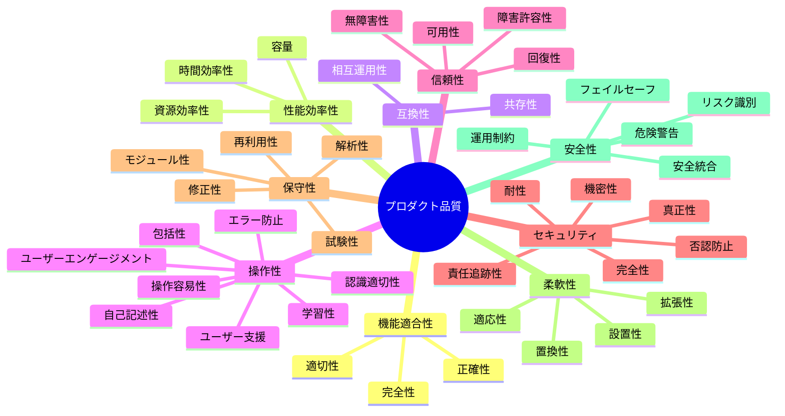

# ISO/IEC 25010 プロダクト品質モデル

## 概要

ISO/IEC 25010 は、ソフトウェアプロダクトの品質を体系的に定義する国際規格。SQuaRE（Systems and software Quality Requirements and Evaluation）シリーズの一部で、品質特性とその副特性を階層的に整理している。

2023年に改訂され（ISO/IEC 25010:2023）、8 特性から 9 特性に拡張された。

## 2023 版の品質特性と副特性

### 全体像

### 各特性の詳細

| # | 品質特性 | 英名 | 定義 | 副特性 |
|---|---------|------|------|--------|
| 1 | 機能適合性 | Functional Suitability | 明示・暗黙のニーズを満たす機能を提供する度合い | 完全性、正確性、適切性 |
| 2 | 性能効率性 | Performance Efficiency | 使用する資源に対する性能の度合い | 時間効率性、資源効率性、容量 |
| 3 | 互換性 | Compatibility | 他のプロダクトと情報を交換できる度合い | 共存性、相互運用性 |
| 4 | 操作性 | Interaction Capability | 指定されたユーザーが目標を達成するために操作できる度合い | 認識適切性、学習性、操作容易性、エラー防止、ユーザーエンゲージメント、包括性、ユーザー支援、自己記述性 |
| 5 | 信頼性 | Reliability | 指定された条件下で機能を実行する度合い | 無障害性、可用性、障害許容性、回復性 |
| 6 | セキュリティ | Security | 悪意あるアクターの攻撃パターンから防御する度合い | 機密性、完全性、否認防止、責任追跡性、真正性、耐性 |
| 7 | 保守性 | Maintainability | 意図された保守者が効果的・効率的に修正できる度合い | モジュール性、再利用性、解析性、修正性、試験性 |
| 8 | 柔軟性 | Flexibility | 要件の変化に適応できる度合い | 適応性、拡張性、設置性、置換性 |
| 9 | 安全性 | Safety | 人・ビジネス・ソフトウェア・財産・環境への損害を回避する度合い | 運用制約、リスク識別、フェイルセーフ、危険警告、安全統合 |

### 2011 版からの主な変更点

| 変更 | 2011 版 | 2023 版 |
|------|--------|---------|
| 追加 | — | 安全性（Safety）を新規追加 |
| 改名 | 使用性（Usability） | 操作性（Interaction Capability） |
| 改名 | 移植性（Portability） | 柔軟性（Flexibility） |
| 副特性追加 | — | 耐性（Resistance）をセキュリティに追加 |
| 副特性追加 | — | 包括性（Inclusivity）、自己記述性（Self-descriptiveness）を操作性に追加 |
| 副特性追加 | — | 拡張性（Scalability）を柔軟性に追加 |
| 副特性変更 | 成熟性（Maturity） | 無障害性（Faultlessness） |
| 副特性変更 | UI 美観（User Interface Aesthetics） | ユーザーエンゲージメント（User Engagement） |
| 副特性分割 | アクセシビリティ（Accessibility） | 包括性 + ユーザー支援に分割 |

## Quality in Use モデル

プロダクト品質とは別に、利用品質（Quality in Use）モデルも定義されている。こちらは利用者の視点から品質を評価する。

| 品質特性 | 定義 |
|---------|------|
| 有効性（Effectiveness） | ユーザーが目標を正確かつ完全に達成できる度合い |
| 効率性（Efficiency） | 目標達成に費やす資源に対する成果の度合い |
| 満足性（Satisfaction） | ユーザーのニーズが満たされる度合い |
| リスク回避性（Freedom from Risk） | 経済・健康・環境リスクを軽減する度合い |
| コンテキストカバレッジ（Context Coverage） | 想定された利用コンテキストで使用できる度合い |

## プロジェクトでの使用

### 品質特性の優先度

プロジェクトの開発段階に応じて優先度を分けている:

| 優先度 | 品質特性 | 理由 |
|--------|---------|------|
| 現在の重点 | 保守性、機能適合性、セキュリティ | 仕組み（TDD、レビュー、テナント分離設計）が整備済み |
| Phase 2〜 | 信頼性、操作性 | MVP 完了後、堅牢性と UX の改善 |
| Phase 3〜 | 性能効率性 | エンタープライズ規模対応 |
| 低優先 | 互換性、柔軟性、安全性 | 現時点では要件なし |

### 品質向上の二方向

品質特性への取り組みには二方向がある:

| 方向 | 内容 | 例 |
|------|------|-----|
| 守り（マイナス→ゼロ） | 欠陥を検出し修正する | テスト、リント、レビュー |
| 攻め（ゼロ→プラス） | より良い設計を追求する | リファクタリング、設計原則レンズ |

## 関連リソース

- [ISO 25000 公式サイト](https://iso25000.com/en/iso-25000-standards/iso-25010)
- [arc42 Quality Model - ISO 25010 Update 2023](https://quality.arc42.org/articles/iso-25010-update-2023)
- [arc42 Quality Model - ISO/IEC 25010](https://quality.arc42.org/standards/iso-25010)
