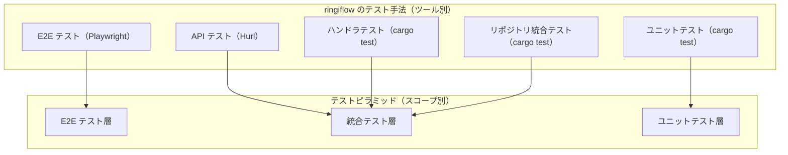

# テストピラミッド

## 概要

テストピラミッドは、テストを**検証スコープ**（検証範囲とフィードバック速度）で 3 層に分類するモデル。Mike Cohn が『Succeeding with Agile』（2009）で提唱した。

重要な点: ピラミッドの「層」はツールではなくスコープで分ける。同じツール（例: `cargo test`）でも、テストするスコープによって異なる層に属する。

## 3 層ピラミッド

```
        /\
       /  \        E2E テスト
      / E2E\       ユーザー操作の完結性
     /------\
    /        \     統合テスト
   / 統合テスト\    コンポーネント間の結合
  /------------\
 /              \  ユニットテスト
/ ユニットテスト  \  単一コンポーネントのロジック
\________________/

    少ない ← テスト数 → 多い
    遅い   ← 速度     → 速い
    高い   ← コスト   → 低い
```

| 層 | 検証スコープ | フィードバック速度 | テスト数 |
|----|------------|-----------------|---------|
| E2E | システム全体をユーザー視点で検証 | 遅い（秒〜分） | 少ない |
| 統合 | 複数コンポーネントの結合を検証 | 中程度（ミリ秒〜秒） | 中程度 |
| ユニット | 単一コンポーネントのロジックを検証 | 速い（ミリ秒） | 多い |

ピラミッド形状が意味すること: 下位層（ユニット）を厚くし、上位層（E2E）を薄くする。フィードバックが速く安定したテストを多く持ち、遅くて不安定になりがちなテストは最小限にする。

## ringiflow のテスト手法と 3 層ピラミッドの対応

ringiflow では 4 つのテスト手法を使用しているが、これはツール別の分類。ピラミッドのスコープ別に整理すると 3 層に対応する。

| ピラミッド層 | ringiflow のテスト手法 | ツール | 検証対象 |
|-----------|---------------------|--------|---------|
| E2E | E2E テスト | Playwright | ブラウザからの操作完結性 |
| 統合 | API テスト | Hurl | HTTP エンドポイント全体の結合（実 DB） |
| 統合 | ハンドラテスト | cargo test（`apps/` 内 tests/） | HTTP ハンドラの入出力、認可 |
| 統合 | リポジトリ統合テスト | cargo test（`crates/infra/` 内 tests/） | リポジトリと実 DB の結合 |
| ユニット | ユニットテスト | cargo test（`#[cfg(test)] mod tests`） | ドメインロジック、ユースケース |

### ツール別に数えるとピラミッドに見えない

`dev-flow-tdd.md` では 4 つのテスト手法を並列に記載している:

1. ユニットテスト
2. ハンドラテスト
3. API テスト（Hurl）
4. E2E テスト（Playwright）

この 4 分類はツール別の実践ガイドとして有用だが、ピラミッドの層と 1:1 対応しない。ハンドラテスト・API テスト・リポジトリ統合テストはすべて「統合テスト」層に属する。



### 統合テスト層内の位置づけ

統合テスト層内でも、検証スコープに幅がある。

```
広い ─────────── 統合テスト層のスコープ ─────────── 狭い

  API テスト          ハンドラテスト       リポジトリ統合テスト
  (Hurl)             (cargo test)        (cargo test)
  ┌────────────┐    ┌──────────┐        ┌────────┐
  │ HTTP → BFF │    │ HTTP →   │        │ Repo → │
  │ → Core →   │    │ Handler  │        │ DB     │
  │ DB → 応答  │    │ → 応答   │        │        │
  └────────────┘    └──────────┘        └────────┘

  エントリーポイント:  エントリーポイント:  エントリーポイント:
  HTTP (外部)         HTTP (テスト内)     Rust コード
  実サーバー起動       テスト用 Router     直接呼び出し
```

- API テスト（Hurl）: 実際の HTTP リクエストで、サーバーを通して DB まで到達する。最も広い統合スコープ
- ハンドラテスト: テスト内で Router を構築し、HTTP レイヤーの入出力を検証する。ミドルウェア・認可を含む
- リポジトリ統合テスト: Rust コードから直接リポジトリを呼び出し、実 DB でクエリの正しさを検証する

エントリーポイントの違い（HTTP vs Rust コード）は、ツールの違いであってスコープの層の違いではない。

## Testing Trophy との比較

Kent C. Dodds が提唱した Testing Trophy（テスティングトロフィー）は、テストピラミッドの発展形。

```
        _____
       /     \      E2E
      /  E2E  \     （少ない）
     /_________\
    |           |
    |           |   統合テスト
    |  統合テスト |   （最も多い）← ピラミッドとの違い
    |           |
    |___________|
     |         |
     | ユニット |    ユニットテスト
     |_________|    （必要な分だけ）
      |       |
      | 静的  |     静的解析
      |_______|     （型チェック、リンター）
```

| 観点 | テストピラミッド | Testing Trophy |
|------|---------------|----------------|
| 提唱者 | Mike Cohn（2009） | Kent C. Dodds（2019） |
| 最も厚い層 | ユニットテスト | 統合テスト |
| 静的解析 | モデルに含まない | 基盤として明示 |
| 主な対象 | バックエンド中心のシステム | フロントエンド / フルスタック |
| 哲学 | 速いテストを多く | ユーザーに近いテストを多く |

### ringiflow での位置づけ

ringiflow は Testing Trophy の考え方も取り入れている。

静的解析の充実: Rust のコンパイラと型システムが強力な静的解析層として機能する。Newtype パターン（[ADR-016](../../05_ADR/016_プリミティブ型のNewtype化方針.md)）や型安全ステートマシン（[ADR-054](../../05_ADR/054_型安全ステートマシンパターンの標準化.md)）により、テストを書く前に多くのバグを型で防いでいる。Elm のコンパイラも同様に、フロントエンドの型安全性を担保する。

統合テストの重視: 統合テスト層が 3 つの手法（ハンドラ・API・リポジトリ）に分かれていることは、この層を重視している表れ。特に API テスト（Hurl）は「ルールが HTTP 層まで伝播しているか」を検証し、ユーザーに近い視点を持つ。

ユニットテストの役割: ドメインロジックの正確さと境界値の網羅はユニットテストの責務として維持している。Rust の型システムで防げない実行時のビジネスルールを検証する。

```
ringiflow のテスト構成:

  静的解析:    Rust コンパイラ + clippy + Elm コンパイラ + 型システム
  ユニット:    cargo test（domain/usecase の mod tests）
  統合:        cargo test（handler/repo） + Hurl（API）  ← 3 手法で厚く
  E2E:         Playwright（クリティカルパスのみ）
```

## 概念層と実践層の関係

```
概念層（本ドキュメント）
  └─ 実践層（ツール別ガイド）
       ├─ dev-flow-tdd.md        ← テストリスト作成、TDD サイクル
       ├─ テスト戦略_エッジケース方針.md ← 各層の責務分担
       ├─ api-test.md            ← Hurl のルール
       └─ e2e-test.md            ← Playwright のルール
```

本ドキュメントは「なぜこの 4 手法をこの組み合わせで使うのか」を説明する概念層。テストの書き方・実行方法は実践層のドキュメントを参照する。

## 関連ドキュメント

上位ドキュメント（要件・設計）:
- [CORE-12: テスト戦略](../../01_要件定義書/01_コア要件.md#core-12-テスト戦略) — テストピラミッドの比率定義（75/20/5）
- [基本設計書: テスト戦略](../../02_基本設計書/01_アーキテクチャ設計.md#56-テスト戦略) — 5 層テストの定義とツール対応

実践ガイド:
- [TDD 開発フロー](../../../.claude/rules/dev-flow-tdd.md) — テスト手法の実践ガイド
- [テスト戦略: エッジケース・境界値・不変条件テスト方針](../../08_テスト/テスト戦略_エッジケース方針.md) — 各層の責務分担
- [API テスト README](../../../tests/api/README.md) — API テストの実行方法とピラミッド上の位置づけ
- [Hurl ナレッジベース](../devtools/hurl.md) — API テストツール
- [Playwright ナレッジベース](../devtools/Playwright.md) — E2E テストツール

設計判断:
- [ADR-032: テスト設計方針](../../05_ADR/032_テスト設計方針.md)
- [ADR-036: Handler 層テスト戦略](../../05_ADR/036_Handler層テスト戦略.md)

## 参考資料

- Mike Cohn, "Succeeding with Agile: Software Development Using Scrum" (2009) — テストピラミッドの原典
- Martin Fowler, ["The Practical Test Pyramid"](https://martinfowler.com/articles/practical-test-pyramid.html) (2018) — 実践的な解説
- Kent C. Dodds, ["Write tests. Not too many. Mostly integration."](https://kentcdodds.com/blog/write-tests) (2019) — Testing Trophy の提唱

---

## 変更履歴

| 日付 | 変更内容 |
|------|---------|
| 2026-02-27 | 初版作成（#967） |
