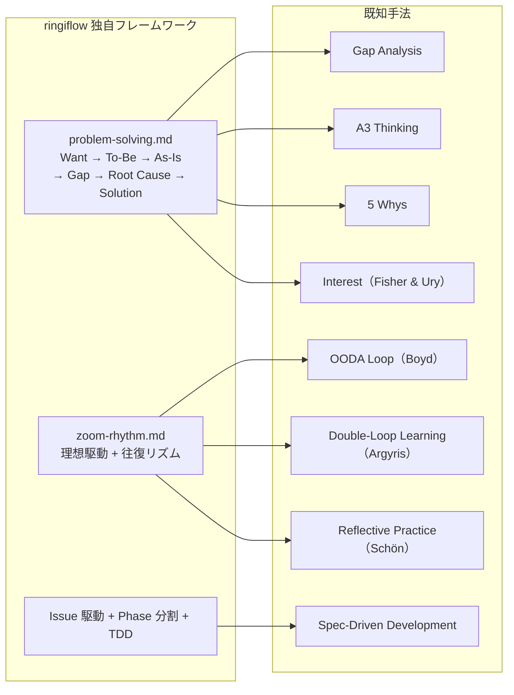

# 独自フレームワークと既知手法の対応

## 概要

ringiflow で独自に構築した問題解決フレームワークや開発プロセスと、対応する既知の方法論・学術的フレームワークの関係を整理する。

独自フレームワークは実践から帰納的に構築されたものだが、多くの既知手法と共通する構造を持っている。既知手法を知ることで「なぜ効くのか」の理論的裏付けが得られ、関連文献へのアクセス（検索可能性）が向上する。

## 対応関係の全体像

## problem-solving.md と既知手法

### ギャップ分析（Gap Analysis）

現状（As-Is）と理想状態（To-Be）の差分を特定し、解消策を導く手法。経営戦略、組織開発、IT プロジェクトマネジメントで広く使われる。

ringiflow の対応: フレームワークのステップ 2-4（To-Be → As-Is → ギャップ分析）が直接対応する。

### A3 Thinking（トヨタ生産方式）

A3 用紙1枚に「問題 → 現状 → 目標 → 原因分析 → 対策 → 実行計画」を記載する思考法。トヨタの問題解決文化の中核であり、データ駆動の意思決定と構造化コミュニケーションを重視する。

ringiflow の対応: 6ステップのフレームワーク全体が A3 Thinking の構造と対応する。

参考文献: Sobek, D. K. & Smalley, A. (2008) "Understanding A3 Thinking"

### なぜなぜ分析（5 Whys）

「なぜ？」を繰り返し問うことで根本原因に到達する手法。豊田佐吉が考案し、トヨタ生産方式の一部として確立された。

ringiflow の対応: ステップ 5（根本原因）が対応する。

注意: 5 Whys は単独では因果の飛躍を起こしやすい弱点がある。ringiflow ではギャップ分析で構造化した後に根本原因を探るため、この弱点を補完している。

### Want と Interest（Fisher & Ury）

Fisher & Ury の著書『Getting to Yes（ハーバード流交渉術）』で提唱された概念。Position（立場・主張）の奥にある本当の関心事を Interest と呼ぶ。

ringiflow の「Want」との関係: 最も近い既知概念。「How にこだわりすぎると、別の領域で同じ問題が再発する」という問題意識は、Position と Interest の区別そのもの。

関連概念:
- Job to be Done（Christensen）: 顧客が本当に達成したいこと
- Desired Outcome（Outcome-Driven Innovation）: 成果物ではなく達成したい成果

### ringiflow の独自性

| 要素 | 既知手法に存在するか | ringiflow 独自の追加 |
|------|---------------------|---------------------|
| To-Be / As-Is / Gap | ギャップ分析 | — |
| 根本原因の追究 | 5 Whys, A3 Thinking | — |
| Want の位置づけ | Interest（交渉学）に類似 | プロジェクト理念レベルへの固定、How との明示的区別 |
| 手段の目的化防止 | 部分的（Interest / Position） | 表による How の列挙と Want との対応付け |
| 複数手法の統合 | 個別に存在 | ギャップ分析 + 5 Whys + Interest を一つのフレームワークに統合 |

## zoom-rhythm.md と既知手法

### OODA ループ（Boyd）

Observe（観察）→ Orient（方向づけ）→ Decide（決定）→ Act（行動）のループ。米空軍大佐 John Boyd が提唱した意思決定モデル。

ringiflow の対応: 「往復のリズム」全体が OODA に対応する。俯瞰 = Observe + Orient、局所作業 = Decide + Act。

違い: OODA は意思決定の速度を重視するが、ringiflow は品質収束を重視する。

### ダブルループ学習（Argyris & Schön）

シングルループ学習（行動の修正）に加え、前提や目標自体を見直すダブルループ学習。Chris Argyris と Donald Schön が 1970 年代に提唱した。

ringiflow の対応:
- シングルループ = As-Is を To-Be に近づける通常の作業
- ダブルループ = To-Be 自体の更新（前提の見直し）

zoom-rhythm.md では To-Be の更新条件を明示し、暗黙の変更を禁止することで、シングルループとダブルループを構造的に区別している。

参考文献: Argyris, C. (1977) "Double Loop Learning in Organizations", Harvard Business Review

### リフレクティブ・プラクティス（Schön）

実践の中での省察（reflection-in-action）と実践後の省察（reflection-on-action）。Donald Schön が 1983 年に提唱した。

ringiflow の対応:
- reflection-in-action = 「いつ視点を上げるか」の表（実践中のトリガー）
- reflection-on-action = 収束確認チェックリスト（実践後の検証）

参考文献: Schön, D. A. (1983) "The Reflective Practitioner"

### ringiflow の独自性

| 要素 | 既知手法に存在するか | ringiflow 独自の追加 |
|------|---------------------|---------------------|
| 観察と行動の往復 | OODA ループ | 明示的な高度メタファ（俯瞰 / 局所） |
| 前提の見直し | ダブルループ学習 | To-Be 更新の条件と禁止事項の形式知化 |
| 実践中の省察 | リフレクティブ・プラクティス | トリガーの表による形式知化 |
| 二次元ギャップ | — | マイナス→ゼロ（欠陥除去）とゼロ→プラス（品質向上）の区別 |
| 収束の定義 | — | To-Be = As-Is でギャップゼロという明確な完了基準 |
| 二つの砦 | — | 設計段階と品質ゲートの二段構えによる品質保証 |

## Issue 駆動 + Phase 分割 + TDD と既知手法

### Spec-Driven Development（GitHub Spec Kit）

GitHub が 2025 年後半に OSS 公開した開発手法。Intent → Spec → Plan → Tasks → Implement → PR のパイプラインで、仕様を中心に開発を進める。

ringiflow の対応:
- Intent = 要件定義書
- Spec = 詳細設計書 + OpenAPI 仕様書
- Plan = plan mode での設計
- Tasks = Issue のチェックリスト
- Implement = TDD 実装
- PR = PR フロー

ringiflow の独自性: 収束確認チェックリスト、設計ブラッシュアップループ、Self-review セクションなど、SDD にはない品質保証の仕組みを持つ。

参考リソース:
- [GitHub Spec Kit](https://github.com/github/spec-kit)
- [Martin Fowler: Understanding SDD tools](https://martinfowler.com/articles/exploring-gen-ai/sdd-3-tools.html)

## まとめ

独自フレームワークは「再発明」ではあるが、実践から帰納的に導いたことにより:

- プロジェクトの文脈に最適化されている
- 具体的な適用方法（チェックリスト、トリガー条件、禁止事項）が実践知として蓄積されている
- 複数の既知手法を統合した形になっている（例: ギャップ分析 + 5 Whys + Interest の統合）

既知手法を知ることの価値:

- 「なぜ効くのか」の理論的裏付けが得られる
- 関連文献へのアクセスが容易になる（検索可能性の向上）
- 既知手法が持つ観点で自分たちのフレームワークを評価・改善できる

## 関連リソース

- Fisher, R. & Ury, W. (1981) "Getting to Yes: Negotiating Agreement Without Giving In"
- Sobek, D. K. & Smalley, A. (2008) "Understanding A3 Thinking"
- Argyris, C. (1977) "Double Loop Learning in Organizations", Harvard Business Review
- Schön, D. A. (1983) "The Reflective Practitioner"
- Boyd, J. (1996) "The Essence of Winning and Losing" (OODA Loop)
- Christensen, C. M. (2016) "Competing Against Luck" (Jobs to Be Done)
- [GitHub Spec Kit](https://github.com/github/spec-kit)
- [Martin Fowler: Understanding SDD tools](https://martinfowler.com/articles/exploring-gen-ai/sdd-3-tools.html)

---

## 変更履歴

| 日付 | 変更内容 |
|------|---------|
| 2026-02-07 | 初版作成（#271） |
