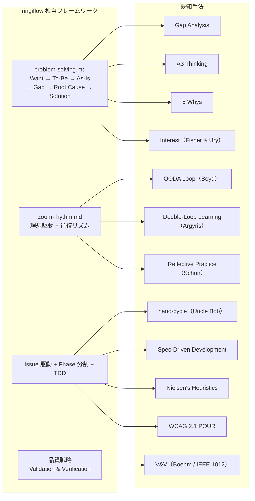

# 独自フレームワークと既知手法の対応

## 概要

ringiflow で独自に構築した問題解決フレームワークや開発プロセスと、対応する既知の方法論・学術的フレームワークの関係を整理する。

独自フレームワークは実践から帰納的に構築されたものだが、多くの既知手法と共通する構造を持っている。既知手法を知ることで「なぜ効くのか」の理論的裏付けが得られ、関連文献へのアクセス（検索可能性）が向上する。

## 対応関係の全体像

## problem-solving.md と既知手法

### ギャップ分析（Gap Analysis）

現状（As-Is）と理想状態（To-Be）の差分を特定し、解消策を導く手法。経営戦略、組織開発、IT プロジェクトマネジメントで広く使われる。

ringiflow の対応: フレームワークのステップ 2-4（To-Be → As-Is → ギャップ分析）が直接対応する。

### A3 Thinking（トヨタ生産方式）

A3 用紙1枚に「問題 → 現状 → 目標 → 原因分析 → 対策 → 実行計画」を記載する思考法。トヨタの問題解決文化の中核であり、データ駆動の意思決定と構造化コミュニケーションを重視する。

ringiflow の対応: 6ステップのフレームワーク全体が A3 Thinking の構造と対応する。

参考文献: Sobek, D. K. & Smalley, A. (2008) "Understanding A3 Thinking"

### なぜなぜ分析（5 Whys）

「なぜ？」を繰り返し問うことで根本原因に到達する手法。豊田佐吉が考案し、トヨタ生産方式の一部として確立された。

ringiflow の対応: ステップ 5（根本原因）が対応する。

注意: 5 Whys は単独では因果の飛躍を起こしやすい弱点がある。ringiflow ではギャップ分析で構造化した後に根本原因を探るため、この弱点を補完している。

### Want と Interest（Fisher & Ury）

Fisher & Ury の著書『Getting to Yes（ハーバード流交渉術）』で提唱された概念。Position（立場・主張）の奥にある本当の関心事を Interest と呼ぶ。

ringiflow の「Want」との関係: 最も近い既知概念。「How にこだわりすぎると、別の領域で同じ問題が再発する」という問題意識は、Position と Interest の区別そのもの。

関連概念:
- Job to be Done（Christensen）: 顧客が本当に達成したいこと
- Desired Outcome（Outcome-Driven Innovation）: 成果物ではなく達成したい成果

### ringiflow の独自性

| 要素 | 既知手法に存在するか | ringiflow 独自の追加 |
|------|---------------------|---------------------|
| To-Be / As-Is / Gap | ギャップ分析 | — |
| 根本原因の追究 | 5 Whys, A3 Thinking | — |
| Want の位置づけ | Interest（交渉学）に類似 | プロジェクト理念レベルへの固定、How との明示的区別 |
| 手段の目的化防止 | 部分的（Interest / Position） | 表による How の列挙と Want との対応付け |
| 複数手法の統合 | 個別に存在 | ギャップ分析 + 5 Whys + Interest を一つのフレームワークに統合 |

## zoom-rhythm.md と既知手法

### OODA ループ（Boyd）

Observe（観察）→ Orient（方向づけ）→ Decide（決定）→ Act（行動）のループ。米空軍大佐 John Boyd が提唱した意思決定モデル。

ringiflow の対応: 「往復のリズム」全体が OODA に対応する。俯瞰 = Observe + Orient、局所作業 = Decide + Act。

違い: OODA は意思決定の速度を重視するが、ringiflow は品質収束を重視する。

### ダブルループ学習（Argyris & Schön）

シングルループ学習（行動の修正）に加え、前提や目標自体を見直すダブルループ学習。Chris Argyris と Donald Schön が 1970 年代に提唱した。

ringiflow の対応:
- シングルループ = As-Is を To-Be に近づける通常の作業
- ダブルループ = To-Be 自体の更新（前提の見直し）

zoom-rhythm.md では To-Be の更新条件を明示し、暗黙の変更を禁止することで、シングルループとダブルループを構造的に区別している。

参考文献: Argyris, C. (1977) "Double Loop Learning in Organizations", Harvard Business Review

### リフレクティブ・プラクティス（Schön）

実践の中での省察（reflection-in-action）と実践後の省察（reflection-on-action）。Donald Schön が 1983 年に提唱した。

ringiflow の対応:
- reflection-in-action = 「いつ視点を上げるか」の表（実践中のトリガー）
- reflection-on-action = 収束確認チェックリスト（実践後の検証）

参考文献: Schön, D. A. (1983) "The Reflective Practitioner"

### ringiflow の独自性

| 要素 | 既知手法に存在するか | ringiflow 独自の追加 |
|------|---------------------|---------------------|
| 観察と行動の往復 | OODA ループ | 明示的な高度メタファ（俯瞰 / 局所） |
| 前提の見直し | ダブルループ学習 | To-Be 更新の条件と禁止事項の形式知化 |
| 実践中の省察 | リフレクティブ・プラクティス | トリガーの表による形式知化 |
| 二次元ギャップ | — | マイナス→ゼロ（欠陥除去）とゼロ→プラス（品質向上）の区別 |
| 収束の定義 | — | To-Be = As-Is でギャップゼロという明確な完了基準 |
| 二つの砦 | — | 設計段階と品質ゲートの二段構えによる品質保証 |

## Issue 駆動 + Phase 分割 + TDD と既知手法

### nano-cycle と二層の Red モデル（Robert C. Martin）

Robert C. Martin は『Clean Craftsmanship』(2021) で、TDD の Red-Green-Refactor サイクル内にさらに小さなサイクル（nano-cycle）が存在することを示した。特に Red フェーズでは、テストを書く → コンパイルエラーを解消する → テスト失敗を確認する、という段階的なフィードバックループが回る。

ringiflow の対応: TDD 開発フローの「二層の Red モデル」が対応する。

| 既知概念 | ringiflow での表現 |
|---------|-------------------|
| nano-cycle（Red 内の小サイクル） | 二層の Red モデル（Red: compile → Red: test failure） |
| Compiler-Driven Development | コンパイルエラー解消の原則（`todo!()` / `Debug.todo`） |
| "Write the test you wish you had"（GOOS） | Red フェーズの「テストを1つだけ書く」 |

関連概念:
- Compiler-Driven Development: 静的型付き言語の TDD で一般的な考え方。コンパイラのエラーメッセージを設計のフィードバックとして活用する
- "Write the test you wish you had": Freeman & Pryce『Growing Object-Oriented Software, Guided by Tests』(2009) の教え。まず理想的なテストを書き、そこからインターフェースを導出する

ringiflow の独自性: 静的型付き言語（Rust / Elm）に特化した形で二層モデルを明示化し、各層で「書くもの / 書かないもの」を具体的に定義している。これは nano-cycle の概念をプロジェクトの技術スタックに合わせて具体化したもの。

→ 詳細: [TDD 開発フロー > 二層の Red モデル](../../04_手順書/04_開発フロー/02_TDD開発フロー.md#二層の-red-モデル)

### Spec-Driven Development（GitHub Spec Kit）

GitHub が 2025 年後半に OSS 公開した開発手法。Spec Kit v0.1.0（2026-01-28）で 8 つのコマンドから成るパイプラインに拡張された。仕様を中心に開発を進め、AI エージェントのスラッシュコマンドとしてパッケージ化している点が特徴。

#### パイプラインの対応関係

| SDD コマンド | 役割 | ringiflow の対応 |
|-------------|------|-----------------|
| Constitution | プロジェクトの不変原則を定義 | CLAUDE.md + `.claude/rules/` |
| Specify | Intent → 仕様化（WHAT と WHY） | 要件定義書 + Issue 精査（Want 分析） |
| Clarify | 仕様の曖昧さを質問で解消 | 設計ブラッシュアップループ |
| Plan | 技術計画（アーキテクチャ、API 契約） | plan mode + 計画ファイル |
| Checklist | ドメインカバレッジ検証 | 品質チェックリスト |
| Tasks | 具体的タスクへの分解 | Phase 分割 + テストリスト |
| Analyze | 全成果物の一貫性検証 | 収束確認チェックリスト |
| Implement | タスクに基づく実装 | TDD 開発フロー |

初回調査時（2026-02-06）は基本パイプライン（Intent → Spec → Plan → Tasks → Implement → PR）のみだったが、v0.1.0 で Constitution・Clarify・Checklist・Analyze が追加された。これら 4 つは ringiflow が既に独自に構築していた仕組みと強い対応を持つ。

#### 3つの実装レベル（Bockeler）

Martin Fowler のシリーズで Birgitta Bockeler が定義した 3 段階:

| レベル | 名称 | 仕様の位置づけ |
|--------|------|---------------|
| 1 | Spec-First | 仕様を書いて実装するが、実装後に仕様は放棄 |
| 2 | Spec-Anchored | 仕様が維持され、機能進化のアンカーとなる |
| 3 | Spec-as-Source | 仕様のみ人間が編集。コードは完全に生成 |

ringiflow は Spec-Anchored レベルに位置する。要件定義書・設計書・OpenAPI が維持され、実装のアンカーとして機能する。Spec-as-Source は学習効果の最大化（理念1）と相反するため、意識的に選択しない。

#### ringiflow の独自性

Clarify と Analyze の対応箇所で特に差異が大きい:

- Clarify: SDD はアドホックな質問形式。ringiflow のブラッシュアップループは「ギャップ発見の観点」を体系化し、欠陥の発見（マイナス→ゼロ）と品質の向上（ゼロ→プラス）を区別する
- Analyze: SDD は全成果物の一括クロスチェック。ringiflow はフェーズ別（設計・実装・テスト・横断検証）にチェックリストを分化

| ringiflow 独自の仕組み | SDD に対応がないもの |
|----------------------|---------------------|
| 二つの砦（設計段階 + 品質ゲート） | 品質保証の二段構え |
| 設計原則レンズ | TDD Refactor での設計品質評価 |
| 問題解決フレームワーク | Want → To-Be → As-Is の構造的分析 |
| Self-review セクション | PR 本文への収束確認結果の明示 |
| 実装前の確認 | 型・API・パターンの事前検証 |

| SDD 独自の仕組み | ringiflow に対応がないもの |
|-----------------|--------------------------|
| Skills 化（スラッシュコマンド） | ワークフローステップの AI コマンド化 |
| Handoffs | コマンド間の機械可読な引き継ぎ |
| Extension System | 外部ツールとのプラグイン統合 |

#### 関連: Harness Engineering（Fowler, 2026-02）

同じ Fowler シリーズで提唱された AI エージェントの品質維持フレームワーク。SDD と補完的に位置づけられる。

| 要素 | 内容 | ringiflow の対応 |
|------|------|-----------------|
| Context Engineering | コードベース内のナレッジ強化 | CLAUDE.md、rules、手順書、ナレッジベース |
| Architectural Constraints | 決定論的リンター・構造テスト | `just check-all`、lefthook |
| Garbage Collection | 定期エージェント実行で不整合検出 | `/assess`（月次）、`/retro`（週次） |

参考リソース:
- [GitHub Spec Kit](https://github.com/github/spec-kit)
- [Fowler: Understanding SDD tools](https://martinfowler.com/articles/exploring-gen-ai/sdd-3-tools.html)
- [Fowler: Context Engineering for Coding Agents](https://martinfowler.com/articles/exploring-gen-ai/context-engineering-coding-agents.html)
- [Fowler: Harness Engineering](https://martinfowler.com/articles/exploring-gen-ai/harness-engineering.html)

## 設計原則レンズ（UI/UX）と既知手法

### Nielsen's 10 Usability Heuristics

Jakob Nielsen が 1994 年に発表（2024 年更新）したユーザビリティ評価の 10 原則。UI デザインのヒューリスティック評価における事実上の標準。

ringiflow の対応: TDD 開発フローの「UI/UX レンズ（フロントエンド変更時）」が対応する。10 原則のうち、コードレベルで即座に確認できる 6 つを選択的に採用。

| Nielsen のヒューリスティック | ringiflow の UI/UX レンズ |
|---------------------------|--------------------------|
| H1: Visibility of System Status（システム状態の可視性） | 状態の網羅性（RemoteData 全状態 + 空データ） |
| H3: User Control and Freedom（ユーザーコントロール） | 破壊的操作の防御（ConfirmDialog） |
| H4: Consistency and Standards（一貫性と標準） | デザイントークン準拠、共有コンポーネント活用 |
| H5: Error Prevention（エラー予防） | 破壊的操作の防御 |
| H8: Aesthetic and Minimalist Design（ミニマルデザイン） | 視覚的階層 |
| H9: Help Users Recover from Errors（エラー回復支援） | エラーのユーザビリティ |

不採用のヒューリスティクス（H2, H6, H7, H10）は、コードレベルでの即時確認が難しいか、現フェーズの品質特性（操作性は Phase 2 以降）に該当するため除外した。

### WCAG 2.1 POUR 原則

W3C が策定した Web コンテンツのアクセシビリティガイドライン。4 つの原則（Perceivable, Operable, Understandable, Robust）で構成される。

ringiflow の対応: UI/UX レンズの「アクセシビリティ」が Perceivable（セマンティック HTML、ARIA）と Operable（キーボード操作、focus-visible）に対応する。

### ゲシュタルト心理学（視覚的階層）

Wertheimer (1923) が提唱した知覚の法則群。近接、類似、閉合、共通領域などの原則で、人間がどのように視覚情報をグループ化して認識するかを説明する。

ringiflow の対応: UI/UX レンズの「視覚的階層」が対応する。タイポグラフィ階層（styles.css ガイドライン）と近接によるグルーピングを問う。

### ringiflow の独自性

| 要素 | 既知手法に存在するか | ringiflow 独自の追加 |
|------|---------------------|---------------------|
| ユーザビリティ評価 | Nielsen's Heuristics | コードレベルの問いへの変換（TDD Refactor で適用可能な形式） |
| アクセシビリティ | WCAG 2.1 | 品質チェックリストとの 1:1 対応による二段構え |
| 視覚的階層 | ゲシュタルト原則 | styles.css のデザインガイドラインとの紐づけ |
| 条件付き適用 | — | フロントエンド変更時のみ適用（プロセスの重さの最小化） |
| コード設計レンズとの対応 | — | コード設計レンズ（意図の明確さ → 視覚的階層、重複の排除 → 共有コンポーネント活用）との概念的対応を明示 |

→ 詳細: [TDD 開発フロー > UI/UX レンズ](../../04_手順書/04_開発フロー/02_TDD開発フロー.md#uiux-レンズフロントエンド変更時)

## 品質戦略と既知手法

### V&V（Verification & Validation）

Boehm（1984）が広めた品質保証の基本概念。Validation = "Are we building the right product?"、Verification = "Are we building the product right?" の2つの問いで品質活動を区別する。IEEE 1012 で体系化されている。

ringiflow の対応: CLAUDE.md の品質戦略を V&V の2層構造で整理している。

| ringiflow の層 | V&V | 仕組み |
|---------------|-----|--------|
| Validation | Validation | Issue 精査、問題解決フレームワーク |
| Verification（守りと攻め） | Verification | 設計レビュー、TDD、品質チェックリスト |

→ 詳細: [V&V](V&V.md)

## まとめ

独自フレームワークは「再発明」ではあるが、実践から帰納的に導いたことにより:

- プロジェクトの文脈に最適化されている
- 具体的な適用方法（チェックリスト、トリガー条件、禁止事項）が実践知として蓄積されている
- 複数の既知手法を統合した形になっている（例: ギャップ分析 + 5 Whys + Interest の統合）

既知手法を知ることの価値:

- 「なぜ効くのか」の理論的裏付けが得られる
- 関連文献へのアクセスが容易になる（検索可能性の向上）
- 既知手法が持つ観点で自分たちのフレームワークを評価・改善できる

## 関連リソース

- Fisher, R. & Ury, W. (1981) "Getting to Yes: Negotiating Agreement Without Giving In"
- Sobek, D. K. & Smalley, A. (2008) "Understanding A3 Thinking"
- Argyris, C. (1977) "Double Loop Learning in Organizations", Harvard Business Review
- Schön, D. A. (1983) "The Reflective Practitioner"
- Boyd, J. (1996) "The Essence of Winning and Losing" (OODA Loop)
- Christensen, C. M. (2016) "Competing Against Luck" (Jobs to Be Done)
- Martin, R. C. (2021) "Clean Craftsmanship" (nano-cycle)
- Freeman, S. & Pryce, N. (2009) "Growing Object-Oriented Software, Guided by Tests"
- [GitHub Spec Kit](https://github.com/github/spec-kit)
- [Fowler: Understanding SDD tools](https://martinfowler.com/articles/exploring-gen-ai/sdd-3-tools.html)
- [Fowler: Context Engineering for Coding Agents](https://martinfowler.com/articles/exploring-gen-ai/context-engineering-coding-agents.html)
- [Fowler: Harness Engineering](https://martinfowler.com/articles/exploring-gen-ai/harness-engineering.html)
- Nielsen, J. (1994, 2024 更新) "10 Usability Heuristics for User Interface Design", Nielsen Norman Group
- W3C (2018) "Web Content Accessibility Guidelines (WCAG) 2.1"
- Wertheimer, M. (1923) "Laws of Organization in Perceptual Forms" (ゲシュタルト原則)

---

## 変更履歴

| 日付 | 変更内容 |
|------|---------|
| 2026-02-18 | SDD セクションを大幅更新。パイプライン詳細対応、3 実装レベル、Harness Engineering を追加 |
| 2026-02-18 | 設計原則レンズ（UI/UX）セクションを追加。Nielsen's Heuristics, WCAG 2.1 POUR, ゲシュタルト原則（#644） |
| 2026-02-18 | nano-cycle と二層の Red モデルセクションを追加（#637） |
| 2026-02-11 | V&V（品質戦略）セクションを追加（#438） |
| 2026-02-07 | 初版作成（#271） |
