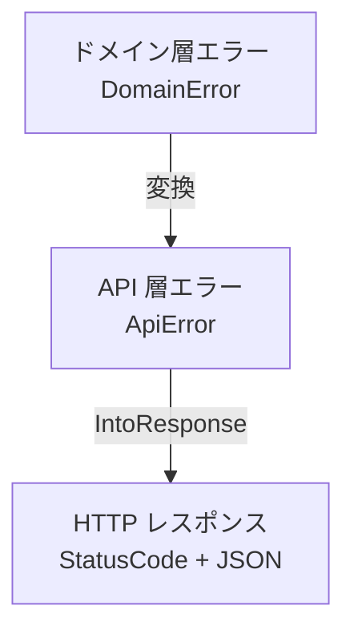

# Rust（ラスト）エラーハンドリング

## 概要

Rust における HTTP API のエラーハンドリングパターン。
`thiserror` + `anyhow` の組み合わせと、RFC 9457 準拠のエラーレスポンスを解説する。

## thiserror vs anyhow

| クレート | 用途 | 特徴 |
|---------|------|------|
| `thiserror` | ライブラリ・アプリケーションのエラー定義 | 型安全なエラー型を定義 |
| `anyhow` | アプリケーションのエラー伝播 | 任意のエラーをラップ |

### 使い分け

```
ドメイン層・API 層 → thiserror（明示的なエラー型）
インフラ層・雑多なエラー → anyhow（柔軟なエラーチェイン）
```

## thiserror の使い方

`thiserror` は `#[derive(Error)]` マクロでエラー型を定義する。

```rust
use thiserror::Error;

#[derive(Debug, Error)]
pub enum ApiError {
    #[error("リソースが見つかりません")]
    NotFound,

    #[error("バリデーションエラー: {0}")]
    Validation(String),

    #[error("認証エラー")]
    Unauthorized,

    #[error("権限エラー")]
    Forbidden,

    #[error("内部サーバーエラー")]
    Internal(#[from] anyhow::Error),
}
```

### 属性の説明

| 属性 | 説明 |
|------|------|
| `#[error("...")]` | `Display` トレイトの実装を生成 |
| `#[from]` | `From` トレイトを自動実装（`?` 演算子で変換可能に） |

## anyhow との連携

`#[from] anyhow::Error` により、任意のエラーを `?` で変換可能。

```rust
async fn handler() -> Result<(), ApiError> {
    // std::io::Error → anyhow::Error → ApiError::Internal
    let file = std::fs::read_to_string("config.json")?;

    // sqlx::Error → anyhow::Error → ApiError::Internal
    let user = sqlx::query!("SELECT * FROM users")
        .fetch_one(&pool)
        .await?;

    Ok(())
}
```

## エラー分類

HTTP API のエラーは以下のカテゴリに分類する。

| カテゴリ | HTTP Status | 説明 | 例 |
|---------|-------------|------|-----|
| 入力不正 | 400 | クライアントからの不正入力 | バリデーションエラー |
| 認証エラー | 401 | 認証失敗 | トークン無効 |
| 認可エラー | 403 | 権限不足 | アクセス拒否 |
| リソースなし | 404 | リソースが存在しない | ID が見つからない |
| 競合 | 409 | リソース状態の競合 | 楽観的ロック失敗 |
| ビジネスルール違反 | 422 | 入力は正しいが処理不可 | 状態遷移エラー |
| 依存障害 | 502/503 | 外部サービス障害 | DB 接続失敗 |
| 資源枯渇 | 429/503 | リソース制限 | レート制限 |
| 内部不具合 | 500 | 予期しないエラー | パニック |

## RFC 9457 (Problem Details)

HTTP API のエラーレスポンス形式を標準化した仕様。

```json
{
  "type": "https://example.com/problems/not-found",
  "title": "リソースが見つかりません",
  "status": 404,
  "detail": "ID 'abc123' のワークフローは存在しません",
  "instance": "/api/v1/workflows/abc123"
}
```

### フィールド

| フィールド | 必須 | 説明 |
|-----------|------|------|
| `type` | ○ | エラーの種類を識別する URI |
| `title` | ○ | エラーの概要（人間可読） |
| `status` | ○ | HTTP ステータスコード |
| `detail` | - | エラーの詳細情報 |
| `instance` | - | 問題が発生したリソースの URI |

### Rust での実装

```rust
use serde::Serialize;

#[derive(Debug, Serialize)]
pub struct ErrorResponse {
    #[serde(rename = "type")]
    pub error_type: String,
    pub title: String,
    pub status: u16,
    #[serde(skip_serializing_if = "Option::is_none")]
    pub detail: Option<String>,
}
```

## axum との統合

`IntoResponse` トレイトを実装すると、エラーを自動的に HTTP レスポンスに変換できる。

```rust
use axum::{
    http::StatusCode,
    response::{IntoResponse, Response},
    Json,
};

impl IntoResponse for ApiError {
    fn into_response(self) -> Response {
        let (status, error_response) = match self {
            ApiError::NotFound => (
                StatusCode::NOT_FOUND,
                ErrorResponse {
                    error_type: "about:blank".to_string(),
                    title: "リソースが見つかりません".to_string(),
                    status: 404,
                    detail: None,
                },
            ),
            ApiError::Validation(msg) => (
                StatusCode::BAD_REQUEST,
                ErrorResponse {
                    error_type: "about:blank".to_string(),
                    title: "バリデーションエラー".to_string(),
                    status: 400,
                    detail: Some(msg),
                },
            ),
            ApiError::Internal(err) => {
                // セキュリティ: 内部エラー詳細はログのみ
                tracing::error!("内部エラー: {:?}", err);
                (
                    StatusCode::INTERNAL_SERVER_ERROR,
                    ErrorResponse {
                        error_type: "about:blank".to_string(),
                        title: "内部サーバーエラー".to_string(),
                        status: 500,
                        detail: None,
                    },
                )
            }
            // ... 他のバリアント
        };

        (status, Json(error_response)).into_response()
    }
}
```

## ハンドラでの使用

```rust
async fn get_workflow(
    Path(id): Path<String>,
) -> Result<Json<Workflow>, ApiError> {
    let workflow = repository
        .find(&id)
        .await
        .map_err(|e| ApiError::Internal(e.into()))?  // DB エラー
        .ok_or(ApiError::NotFound)?;                  // 見つからない

    Ok(Json(workflow))
}
```

## エラー階層



ドメイン層のエラーを API 層のエラーに変換することで、ビジネスロジックと HTTP の詳細を分離する。

```rust
// ドメイン層
#[derive(Debug, Error)]
pub enum DomainError {
    #[error("ワークフローが見つかりません")]
    WorkflowNotFound,

    #[error("無効な状態遷移: {from} → {to}")]
    InvalidStateTransition { from: String, to: String },
}

// API 層での変換
impl From<DomainError> for ApiError {
    fn from(err: DomainError) -> Self {
        match err {
            DomainError::WorkflowNotFound => ApiError::NotFound,
            DomainError::InvalidStateTransition { .. } => {
                ApiError::Validation(err.to_string())
            }
        }
    }
}
```

## セキュリティ考慮

- 内部エラーの詳細はクライアントに返さない
- エラー内容はサーバーサイドのログにのみ出力
- スタックトレースは本番環境で公開しない

## プロジェクトでの使用

`apps/bff/src/error.rs` および `apps/core-service/src/error.rs` で `ApiError` と `IntoResponse` を実装している。

## 関連リソース

- [RFC 9457 - Problem Details for HTTP APIs](https://datatracker.ietf.org/doc/rfc9457/)
- [thiserror ドキュメント](https://docs.rs/thiserror)
- [anyhow ドキュメント](https://docs.rs/anyhow)
- [ADR-005: データベースツールキットの選定](../../05_ADR/005_データベースツールキットの選定.md)

---

## 変更履歴

| 日付 | 変更内容 |
|------|---------|
| 2026-01-14 | 初版作成 |
